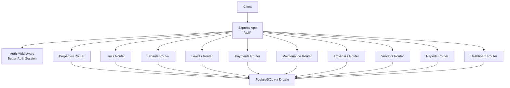
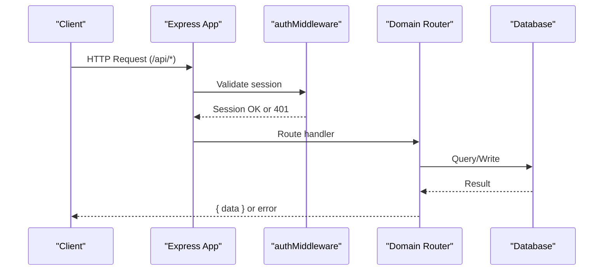
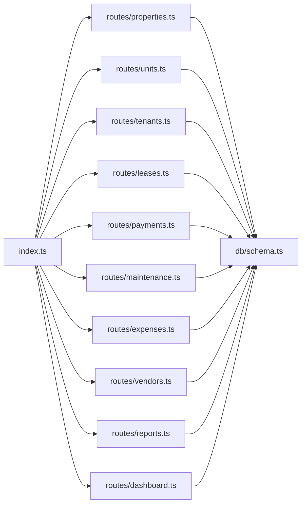

# API Reference

<cite>
**Referenced Files in This Document**
- [server/src/index.ts](file://server/src/index.ts)
- [server/src/auth/middleware.ts](file://server/src/auth/middleware.ts)
- [server/src/routes/properties.ts](file://server/src/routes/properties.ts)
- [server/src/routes/units.ts](file://server/src/routes/units.ts)
- [server/src/routes/tenants.ts](file://server/src/routes/tenants.ts)
- [server/src/routes/leases.ts](file://server/src/routes/leases.ts)
- [server/src/routes/payments.ts](file://server/src/routes/payments.ts)
- [server/src/routes/maintenance.ts](file://server/src/routes/maintenance.ts)
- [server/src/routes/expenses.ts](file://server/src/routes/expenses.ts)
- [server/src/routes/vendors.ts](file://server/src/routes/vendors.ts)
- [server/src/routes/reports.ts](file://server/src/routes/reports.ts)
- [server/src/routes/dashboard.ts](file://server/src/routes/dashboard.ts)
- [server/src/db/schema.ts](file://server/src/db/schema.ts)
</cite>

## Table of Contents
1. [Introduction](#introduction)
2. [Project Structure](#project-structure)
3. [Core Components](#core-components)
4. [Architecture Overview](#architecture-overview)
5. [Detailed Component Analysis](#detailed-component-analysis)
6. [Dependency Analysis](#dependency-analysis)
7. [Performance Considerations](#performance-considerations)
8. [Troubleshooting Guide](#troubleshooting-guide)
9. [Conclusion](#conclusion)
10. [Appendices](#appendices)

## Introduction
This document provides a comprehensive API reference for the RentLite backend. It covers all RESTful endpoints organized by functional domains: properties, units, tenants, leases, payments, maintenance, expenses, vendors, reports, and dashboard. For each endpoint, you will find HTTP methods, URL patterns, authentication requirements, request parameters, response schemas, validation rules, status codes, and example payloads. The API uses JSON over HTTPS with session-based authentication via Better-Auth. All data models are defined using Drizzle ORM against PostgreSQL.

## Project Structure
The server is an Express application that mounts routers under /api prefixes. Authentication middleware protects most routes. Routes are grouped by domain (properties, units, tenants, leases, payments, maintenance, expenses, vendors, reports, dashboard). A health check endpoint is exposed at /api/health.

**Diagram sources**
- [server/src/index.ts:16-56](file://server/src/index.ts#L16-L56)
- [server/src/auth/middleware.ts:9-27](file://server/src/auth/middleware.ts#L9-L27)

**Section sources**
- [server/src/index.ts:16-56](file://server/src/index.ts#L16-L56)

## Core Components
- Authentication: Session-based auth via Better-Auth. Protected routes use authMiddleware which validates sessions and attaches userId to requests. Unauthenticated requests receive 401 Unauthorized.
- Validation: Zod schemas validate request bodies for create/update operations. Validation errors return 400 with details.
- Data access: Drizzle ORM queries filter resources by user ownership where applicable.
- Error handling: Consistent error responses include message, code, and optional details.

**Section sources**
- [server/src/auth/middleware.ts:9-27](file://server/src/auth/middleware.ts#L9-L27)
- [server/src/routes/properties.ts:11-23](file://server/src/routes/properties.ts#L11-L23)
- [server/src/routes/payments.ts:11-22](file://server/src/routes/payments.ts#L11-L22)

## Architecture Overview
The API exposes domain-specific routers mounted under /api. Each router applies authMiddleware to enforce authorization. Requests are validated with Zod before database operations. Responses are wrapped in { data } envelopes for success cases and standardized error objects for failures.

**Diagram sources**
- [server/src/index.ts:19-44](file://server/src/index.ts#L19-L44)
- [server/src/auth/middleware.ts:9-27](file://server/src/auth/middleware.ts#L9-L27)

## Detailed Component Analysis

### Authentication and Authorization
- Base path: /api/auth/* handled by Better-Auth.
- Protected endpoints require a valid session; otherwise return 401 Unauthorized.
- Authorization model: Multi-tenant isolation by userId; resources are filtered by owner.

**Section sources**
- [server/src/index.ts:29-31](file://server/src/index.ts#L29-L31)
- [server/src/auth/middleware.ts:9-27](file://server/src/auth/middleware.ts#L9-L27)

### Properties
Base path: /api/properties

- GET /api/properties
  - Auth: Required
  - Response: Array of properties with associated units
  - Notes: Ordered by creation date descending

- GET /api/properties/:id
  - Auth: Required
  - Path param: id (UUID)
  - Response: Property object with units
  - Status: 404 if not found

- POST /api/properties
  - Auth: Required
  - Body schema: name, address, city, state, zip, type, unitCount, status, notes
  - Behavior: Creates property and auto-creates units based on unitCount
  - Status: 201 Created

- PUT /api/properties/:id
  - Auth: Required
  - Path param: id (UUID)
  - Body schema: Partial fields allowed
  - Status: 404 if not found

- DELETE /api/properties/:id
  - Auth: Required
  - Path param: id (UUID)
  - Status: 404 if not found

Request body fields:
- name: string, required
- address: string, required
- city: string, required
- state: string, required
- zip: string, required
- type: enum ["single_family","duplex","multifamily","condo","townhouse"], required
- unitCount: integer >= 1, default 1
- status: enum ["active","vacant","under_renovation"], default "active"
- notes: string | null | undefined

Response envelope:
- Success: { data: Property[] | Property }
- Errors: { message, code, details? }

Example request (create):
- Method: POST
- URL: /api/properties
- Headers: Cookie (session)
- Body: { name, address, city, state, zip, type, unitCount, status }

Example response (list):
- { data: [{ id, name, address, city, state, zip, type, unitCount, status, createdAt, updatedAt, units: [...] }] }

**Section sources**
- [server/src/routes/properties.ts:11-23](file://server/src/routes/properties.ts#L11-L23)
- [server/src/routes/properties.ts:25-103](file://server/src/routes/properties.ts#L25-L103)
- [server/src/db/schema.ts:191-208](file://server/src/db/schema.ts#L191-L208)

### Units
Base path: /api/units

- GET /api/units
  - Auth: Required
  - Query params: propertyId (optional)
  - Response: Array of units filtered by user-owned properties

- GET /api/units/:id
  - Auth: Required
  - Path param: id (UUID)
  - Response: Unit with property details
  - Status: 404 if not owned or not found

- POST /api/units
  - Auth: Required
  - Body schema: propertyId, unitNumber, rentAmount, status, bedrooms, bathrooms, notes
  - Validates property ownership
  - Status: 201 Created

- PUT /api/units/:id
  - Auth: Required
  - Path param: id (UUID)
  - Body schema: Partial fields allowed
  - Status: 404 if not owned or not found

- DELETE /api/units/:id
  - Auth: Required
  - Path param: id (UUID)
  - Status: 404 if not owned or not found

Request body fields:
- propertyId: UUID, required
- unitNumber: string, required
- rentAmount: number >= 0, required
- status: enum ["occupied","vacant","under_renovation"], default "vacant"
- bedrooms: integer | null | undefined
- bathrooms: number | null | undefined
- notes: string | null | undefined

Response envelope:
- Success: { data: Unit[] | Unit }
- Errors: { message, code, details? }

**Section sources**
- [server/src/routes/units.ts:11-21](file://server/src/routes/units.ts#L11-L21)
- [server/src/routes/units.ts:23-120](file://server/src/routes/units.ts#L23-L120)
- [server/src/db/schema.ts:212-226](file://server/src/db/schema.ts#L212-L226)

### Tenants
Base path: /api/tenants

- GET /api/tenants
  - Auth: Required
  - Response: Array of tenants owned by user

- GET /api/tenants/:id
  - Auth: Required
  - Path param: id (UUID)
  - Response: Tenant object
  - Status: 404 if not found

- POST /api/tenants
  - Auth: Required
  - Body schema: firstName, lastName, email, phone, emergencyContactName, emergencyContactPhone, employer, notes
  - Status: 201 Created

- PUT /api/tenants/:id
  - Auth: Required
  - Path param: id (UUID)
  - Body schema: Partial fields allowed
  - Status: 404 if not found

- DELETE /api/tenants/:id
  - Auth: Required
  - Path param: id (UUID)
  - Status: 404 if not found

Request body fields:
- firstName: string, required
- lastName: string, required
- email: string | null | undefined
- phone: string | null | undefined
- emergencyContactName: string | null | undefined
- emergencyContactPhone: string | null | undefined
- employer: string | null | undefined
- notes: string | null | undefined

Response envelope:
- Success: { data: Tenant[] | Tenant }
- Errors: { message, code, details? }

**Section sources**
- [server/src/routes/tenants.ts:11-20](file://server/src/routes/tenants.ts#L11-L20)
- [server/src/routes/tenants.ts:22-80](file://server/src/routes/tenants.ts#L22-L80)
- [server/src/db/schema.ts:230-245](file://server/src/db/schema.ts#L230-L245)

### Leases
Base path: /api/leases

- GET /api/leases
  - Auth: Required
  - Response: Leases linked to user-owned units

- GET /api/leases/expiring
  - Auth: Required
  - Query params: days (default 90)
  - Response: Active leases expiring within N days

- GET /api/leases/:id
  - Auth: Required
  - Path param: id (UUID)
  - Response: Lease with unit and tenant
  - Status: 404 if not found

- POST /api/leases
  - Auth: Required
  - Body schema: unitId, tenantId, startDate, endDate, rentAmount, deposit, terms, documentUrl, status
  - Validates unit ownership and tenant ownership
  - Updates unit status to occupied
  - Status: 201 Created

- PUT /api/leases/:id
  - Auth: Required
  - Path param: id (UUID)
  - Body schema: Partial fields allowed
  - Updates unit status to vacant when terminated/expired
  - Status: 404 if not found

- DELETE /api/leases/:id
  - Auth: Required
  - Path param: id (UUID)
  - Status: 404 if not found

Request body fields:
- unitId: UUID, required
- tenantId: UUID, required
- startDate: string (date), required
- endDate: string (date), required
- rentAmount: number >= 0, required
- deposit: number | null | undefined
- terms: string | null | undefined
- documentUrl: string | null | undefined
- status: enum ["active","expired","terminated"], default "active"

Response envelope:
- Success: { data: Lease[] | Lease }
- Errors: { message, code, details? }

**Section sources**
- [server/src/routes/leases.ts:11-21](file://server/src/routes/leases.ts#L11-L21)
- [server/src/routes/leases.ts:23-144](file://server/src/routes/leases.ts#L23-L144)
- [server/src/db/schema.ts:249-266](file://server/src/db/schema.ts#L249-L266)

### Payments
Base path: /api/payments

- GET /api/payments
  - Auth: Required
  - Query params: month, year, status, unitId
  - Response: Payments filtered by user-owned units and optional filters

- GET /api/payments/summary
  - Auth: Required
  - Query params: month (default current), year (default current)
  - Response: Monthly collection summary including totals and counts

- POST /api/payments
  - Auth: Required
  - Body schema: unitId, tenantId, amount, amountPaid, dueDate, paidDate, method, status, lateFee, notes
  - Status: 201 Created

- PUT /api/payments/:id
  - Auth: Required
  - Path param: id (UUID)
  - Body schema: Partial fields allowed
  - Status: 404 if not found

- DELETE /api/payments/:id
  - Auth: Required
  - Path param: id (UUID)
  - Status: 404 if not found

Request body fields:
- unitId: UUID, required
- tenantId: UUID, required
- amount: number >= 0, required
- amountPaid: number >= 0, default 0
- dueDate: string (date), required
- paidDate: string | null | undefined
- method: enum ["cash","check","zelle","venmo","ach","card","bank_transfer","other"] | null | undefined
- status: enum ["pending","received","late","partial"], default "pending"
- lateFee: number >= 0, default 0
- notes: string | null | undefined

Summary response fields:
- totalExpected: number
- totalCollected: number
- totalOutstanding: number
- collectionRate: number
- paymentCount: number
- receivedCount: number
- lateCount: number
- pendingCount: number

Response envelope:
- Success: { data: Payment[] | Summary }
- Errors: { message, code, details? }

**Section sources**
- [server/src/routes/payments.ts:11-22](file://server/src/routes/payments.ts#L11-L22)
- [server/src/routes/payments.ts:24-134](file://server/src/routes/payments.ts#L24-L134)
- [server/src/db/schema.ts:270-289](file://server/src/db/schema.ts#L270-L289)

### Maintenance
Base path: /api/maintenance

- GET /api/maintenance
  - Auth: Required
  - Query params: status, priority
  - Response: Maintenance requests for user-owned properties

- GET /api/maintenance/:id
  - Auth: Required
  - Path param: id (UUID)
  - Response: Maintenance request with unit, tenant, vendor
  - Status: 404 if not found

- POST /api/maintenance
  - Auth: Required
  - Body schema: unitId, propertyId, tenantId, title, description, priority, status, photos, completionPhotos, vendorId, cost
  - Sets submittedAt timestamp
  - Status: 201 Created

- PUT /api/maintenance/:id
  - Auth: Required
  - Path param: id (UUID)
  - Body schema: Partial fields allowed
  - Sets completedAt when status becomes "completed"
  - Status: 404 if not found

- DELETE /api/maintenance/:id
  - Auth: Required
  - Path param: id (UUID)
  - Status: 404 if not found

Request body fields:
- unitId: UUID, required
- propertyId: UUID, required
- tenantId: UUID | null | undefined
- title: string, required
- description: string, required
- priority: enum ["emergency","urgent","routine"], default "routine"
- status: enum ["submitted","acknowledged","in_progress","completed"], default "submitted"
- photos: string[], default []
- completionPhotos: string[], default []
- vendorId: UUID | null | undefined
- cost: number | null | undefined

Response envelope:
- Success: { data: MaintenanceRequest[] | MaintenanceRequest }
- Errors: { message, code, details? }

**Section sources**
- [server/src/routes/maintenance.ts:11-23](file://server/src/routes/maintenance.ts#L11-L23)
- [server/src/routes/maintenance.ts:25-100](file://server/src/routes/maintenance.ts#L25-L100)
- [server/src/db/schema.ts:293-325](file://server/src/db/schema.ts#L293-L325)

### Expenses
Base path: /api/expenses

- GET /api/expenses
  - Auth: Required
  - Query params: propertyId, category, year, month
  - Response: Expenses filtered by user-owned properties and optional filters

- GET /api/expenses/:id
  - Auth: Required
  - Path param: id (UUID)
  - Response: Expense object
  - Status: 404 if not found

- POST /api/expenses
  - Auth: Required
  - Body schema: propertyId, unitId, category, description, amount, date, vendor, receiptUrl, isRecurring, recurringFrequency, notes
  - Validates property ownership
  - Status: 201 Created

- PUT /api/expenses/:id
  - Auth: Required
  - Path param: id (UUID)
  - Body schema: Partial fields allowed
  - Status: 404 if not found

- DELETE /api/expenses/:id
  - Auth: Required
  - Path param: id (UUID)
  - Status: 404 if not found

Request body fields:
- propertyId: UUID, required
- unitId: UUID | null | undefined
- category: enum ["advertising","auto_travel","cleaning","insurance","legal_professional","management","mortgage_interest","other_interest","repairs","supplies","taxes","utilities","depreciation","other"], required
- description: string, required
- amount: number >= 0, required
- date: string (date), required
- vendor: string | null | undefined
- receiptUrl: string | null | undefined
- isRecurring: boolean, default false
- recurringFrequency: enum ["monthly","quarterly","annually"] | null | undefined
- notes: string | null | undefined

Response envelope:
- Success: { data: Expense[] | Expense }
- Errors: { message, code, details? }

**Section sources**
- [server/src/routes/expenses.ts:11-28](file://server/src/routes/expenses.ts#L11-L28)
- [server/src/routes/expenses.ts:30-103](file://server/src/routes/expenses.ts#L30-L103)
- [server/src/db/schema.ts:329-348](file://server/src/db/schema.ts#L329-L348)

### Vendors
Base path: /api/vendors

- GET /api/vendors
  - Auth: Required
  - Response: Vendor list sorted by name

- POST /api/vendors
  - Auth: Required
  - Body schema: name, trade, phone, email, insuranceExpiry, notes
  - Status: 201 Created

- PUT /api/vendors/:id
  - Auth: Required
  - Path param: id (UUID)
  - Body schema: Partial fields allowed
  - Status: 404 if not found

- DELETE /api/vendors/:id
  - Auth: Required
  - Path param: id (UUID)
  - Status: 404 if not found

Request body fields:
- name: string, required
- trade: string, required
- phone: string | null | undefined
- email: string | null | undefined
- insuranceExpiry: string (date) | null | undefined
- notes: string | null | undefined

Response envelope:
- Success: { data: Vendor[] | Vendor }
- Errors: { message, code, details? }

**Section sources**
- [server/src/routes/vendors.ts:11-18](file://server/src/routes/vendors.ts#L11-L18)
- [server/src/routes/vendors.ts:20-68](file://server/src/routes/vendors.ts#L20-L68)
- [server/src/db/schema.ts:352-365](file://server/src/db/schema.ts#L352-L365)

### Reports
Base path: /api/reports

- GET /api/reports/cashflow
  - Auth: Required
  - Query params: year (default current)
  - Response: Per-property monthly cash flow with income, expenses, net

- GET /api/reports/schedule-e
  - Auth: Required
  - Query params: year (default current)
  - Response: Per-property Schedule E helper with line items and totals

- GET /api/reports/pnl
  - Auth: Required
  - Query params: year (default current), quarter (optional)
  - Response: Per-property profit & loss for year or quarter

Response envelopes:
- Success: { data: ReportPayload }
- Errors: { message, code, details? }

Report payload highlights:
- cashflow: array of monthly entries per property with income, expenses, net
- schedule-e: array of properties with rentReceived, lineItems (category, line, description, amount), totalExpenses, netIncome
- pnl: array of properties with totalIncome, totalExpenses, netIncome, period

**Section sources**
- [server/src/routes/reports.ts:10-186](file://server/src/routes/reports.ts#L10-L186)

### Dashboard
Base path: /api/dashboard

- GET /api/dashboard
  - Auth: Required
  - Response: Aggregated overview including properties, units, tenants, rent metrics, financials, alerts

Response fields:
- properties.total, properties.active
- units.total, units.occupied, units.vacant, units.occupancyRate
- tenants.total
- rent.monthlyExpected, rent.monthlyCollected, rent.monthlyOutstanding, rent.collectionRate
- financials.monthlyIncome, financials.monthlyExpenses, financials.monthlyNet, financials.yearIncome, financials.yearExpenses
- alerts.openMaintenance, alerts.expiringLeases, alerts.latePayments

**Section sources**
- [server/src/routes/dashboard.ts:10-121](file://server/src/routes/dashboard.ts#L10-L121)

### Health Check
- GET /api/health
  - Auth: Not required
  - Response: { status: "ok", timestamp: ISO string }

**Section sources**
- [server/src/index.ts:46-50](file://server/src/index.ts#L46-L50)

## Dependency Analysis
- Routing: Express app mounts routers under /api prefixes.
- Auth: Better-Auth session middleware enforces authentication and user scoping.
- Validation: Zod schemas ensure request integrity.
- Data layer: Drizzle ORM queries filter by user ownership to enforce multi-tenant isolation.

**Diagram sources**
- [server/src/index.ts:33-44](file://server/src/index.ts#L33-L44)
- [server/src/db/schema.ts:191-403](file://server/src/db/schema.ts#L191-L403)

**Section sources**
- [server/src/index.ts:33-44](file://server/src/index.ts#L33-L44)
- [server/src/db/schema.ts:191-403](file://server/src/db/schema.ts#L191-L403)

## Performance Considerations
- Filtering by user ownership occurs in-memory for some endpoints after fetching broader datasets. Consider adding server-side filtering where possible to reduce payload sizes.
- Reports aggregate large datasets across payments and expenses; consider pagination or background jobs for very large portfolios.
- Use query parameters (month/year/status/unitId) to narrow results and minimize processing.

[No sources needed since this section provides general guidance]

## Troubleshooting Guide
Common errors and resolutions:
- 401 Unauthorized: Missing or invalid session. Ensure cookies are sent with requests and the client is authenticated via /api/auth endpoints.
- 400 Validation error: Invalid or missing fields. Check Zod schema constraints and provide correct types and enums.
- 404 Not found: Resource does not exist or is not owned by the user. Verify IDs and ownership checks.
- 404 Property not found / Unit not found / Tenant not found: Ownership verification failed. Confirm the resource belongs to the authenticated user.

Error response format:
- { message: string, code: string, details?: any }

Status codes:
- 200 OK: Successful read/update
- 201 Created: Successful creation
- 400 Bad Request: Validation failure
- 401 Unauthorized: Missing/invalid session
- 404 Not Found: Resource not found or unauthorized

**Section sources**
- [server/src/auth/middleware.ts:18-20](file://server/src/auth/middleware.ts#L18-L20)
- [server/src/routes/properties.ts:51-52](file://server/src/routes/properties.ts#L51-L52)
- [server/src/routes/properties.ts:44-45](file://server/src/routes/properties.ts#L44-L45)
- [server/src/routes/expenses.ts:70-75](file://server/src/routes/expenses.ts#L70-L75)

## Conclusion
RentLite’s API provides a complete set of endpoints for managing rental properties, tenants, leases, payments, maintenance, expenses, vendors, and reporting. All endpoints are secured with session-based authentication and enforce user-scoped data access. Use the documented schemas and query parameters to build robust integrations.

[No sources needed since this section summarizes without analyzing specific files]

## Appendices

### Rate Limiting Policies
- No explicit rate limiting is implemented in the server configuration. If needed, add middleware such as express-rate-limit to protect endpoints.

[No sources needed since this section provides general guidance]

### API Versioning Strategy
- Endpoints are mounted directly under /api without version segments. To introduce breaking changes, consider prefixing with a version segment (e.g., /api/v1) in future iterations.

[No sources needed since this section provides general guidance]

### SDK Usage Examples and Client Library Recommendations
- Recommended libraries:
  - JavaScript/TypeScript: axios or fetch with cookie support for session-based auth
  - Node.js: axios with http-cookie-agent or built-in fetch with credentials
- Example usage pattern:
  - Authenticate via /api/auth endpoints to obtain session cookies
  - Include credentials (cookies) in subsequent requests to protected endpoints
  - Parse { data } envelopes from successful responses
  - Handle error responses with message, code, and optional details

[No sources needed since this section provides general guidance]