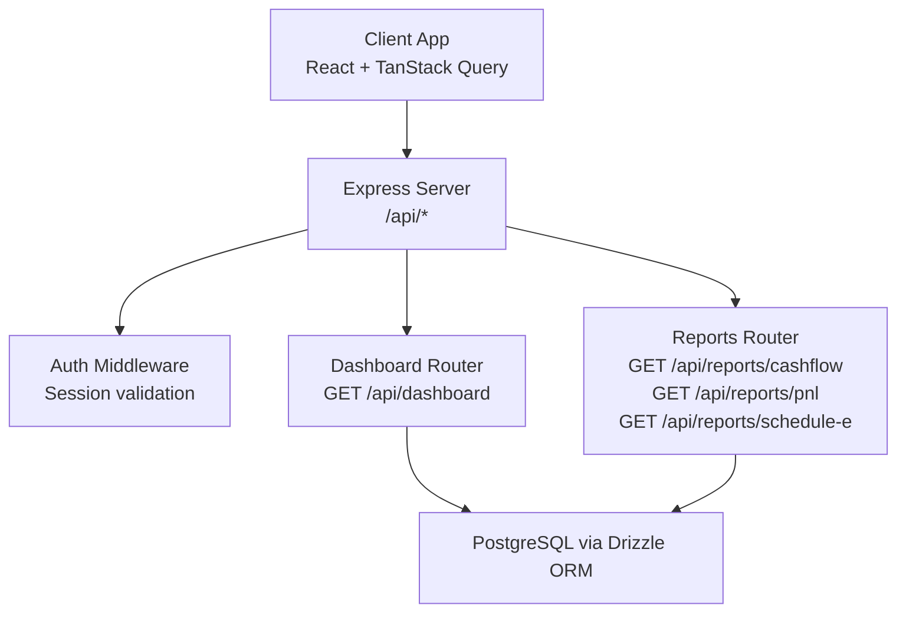
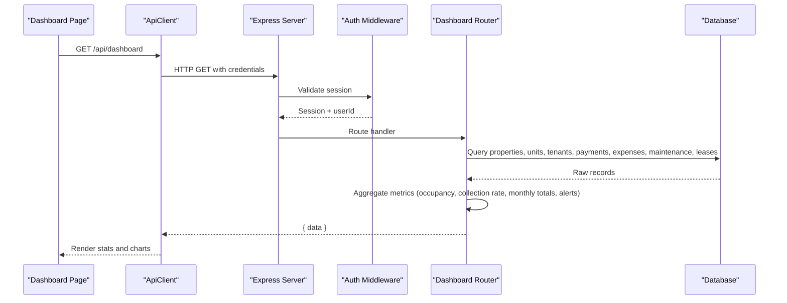
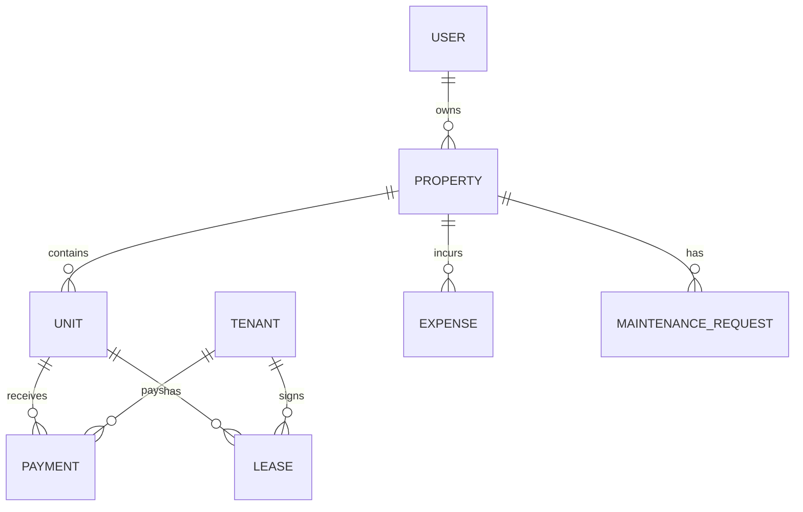
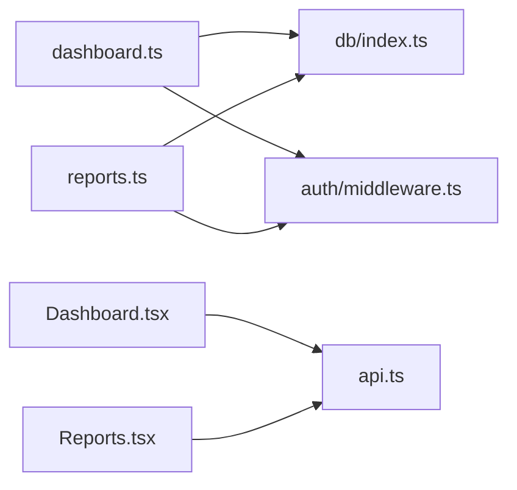

# Dashboard & Reports API

<cite>
**Referenced Files in This Document**
- [server/src/index.ts](file://server/src/index.ts)
- [server/src/routes/dashboard.ts](file://server/src/routes/dashboard.ts)
- [server/src/routes/reports.ts](file://server/src/routes/reports.ts)
- [server/src/auth/middleware.ts](file://server/src/auth/middleware.ts)
- [server/src/db/schema.ts](file://server/src/db/schema.ts)
- [client/src/pages/Dashboard.tsx](file://client/src/pages/Dashboard.tsx)
- [client/src/pages/Reports.tsx](file://client/src/pages/Reports.tsx)
- [client/src/lib/api.ts](file://client/src/lib/api.ts)
</cite>

## Table of Contents
1. [Introduction](#introduction)
2. [Project Structure](#project-structure)
3. [Core Components](#core-components)
4. [Architecture Overview](#architecture-overview)
5. [Detailed Component Analysis](#detailed-component-analysis)
6. [Dependency Analysis](#dependency-analysis)
7. [Performance Considerations](#performance-considerations)
8. [Troubleshooting Guide](#troubleshooting-guide)
9. [Conclusion](#conclusion)
10. [Appendices](#appendices)

## Introduction
This document provides detailed API documentation for dashboard analytics and reporting endpoints. It covers:
- HTTP methods for accessing dashboard data, financial metrics, and reports
- Data aggregation endpoints for property performance, cash flow analysis, and occupancy rates
- Report generation endpoints for Schedule E tax forms, profit & loss statements, and custom CSV exports
- Examples of querying dashboard metrics, exporting data, and interpreting results
- Caching strategies, performance optimizations, and recommended refresh intervals for analytical queries

All endpoints are protected by authentication middleware and return JSON responses.

## Project Structure
The backend is an Express application that mounts routers for different feature areas. The dashboard and reports features are implemented as separate route modules and mounted under /api/dashboard and /api/reports respectively. Authentication is enforced via a shared middleware.

**Diagram sources**
- [server/src/index.ts:51-62](file://server/src/index.ts#L51-L62)
- [server/src/routes/dashboard.ts:1-124](file://server/src/routes/dashboard.ts#L1-L124)
- [server/src/routes/reports.ts:1-186](file://server/src/routes/reports.ts#L1-L186)
- [server/src/auth/middleware.ts:9-27](file://server/src/auth/middleware.ts#L9-L27)

**Section sources**
- [server/src/index.ts:34-62](file://server/src/index.ts#L34-L62)

## Core Components
- Authentication middleware validates sessions and attaches user context to requests.
- Dashboard endpoint aggregates portfolio-wide metrics including properties, units, tenants, rent collection, financials, and alerts.
- Reports endpoints provide:
  - Monthly cash flow per property
  - Profit & Loss (P&L) per property with optional quarterly filtering
  - Schedule E helper with line-item mapping and totals

**Section sources**
- [server/src/auth/middleware.ts:9-27](file://server/src/auth/middleware.ts#L9-L27)
- [server/src/routes/dashboard.ts:10-121](file://server/src/routes/dashboard.ts#L10-L121)
- [server/src/routes/reports.ts:28-183](file://server/src/routes/reports.ts#L28-L183)

## Architecture Overview
The client uses React Query to fetch dashboard and report data from the server. Each request includes credentials so the session cookie is sent to the server. The server validates the session and returns aggregated analytics or report data.

**Diagram sources**
- [client/src/pages/Dashboard.tsx:23-27](file://client/src/pages/Dashboard.tsx#L23-L27)
- [client/src/lib/api.ts:26-54](file://client/src/lib/api.ts#L26-L54)
- [server/src/auth/middleware.ts:9-27](file://server/src/auth/middleware.ts#L9-L27)
- [server/src/routes/dashboard.ts:11-121](file://server/src/routes/dashboard.ts#L11-L121)

## Detailed Component Analysis

### Dashboard Endpoint
- Method: GET
- Path: /api/dashboard
- Authentication: Required (session-based)
- Response structure:
  - properties: total, active
  - units: total, occupied, vacant, occupancyRate
  - tenants: total
  - rent: monthlyExpected, monthlyCollected, monthlyOutstanding, collectionRate
  - financials: monthlyIncome, monthlyExpenses, monthlyNet, yearIncome, yearExpenses
  - alerts: openMaintenance, expiringLeases, latePayments

Notes:
- Aggregates current month’s payments and expenses based on dueDate/date fields.
- Occupancy rate computed from unit status.
- Expiring leases filtered within next 90 days for active leases.

Example usage (client):
- The dashboard page calls GET /api/dashboard and renders key metrics and alerts.

**Section sources**
- [server/src/routes/dashboard.ts:10-121](file://server/src/routes/dashboard.ts#L10-L121)
- [client/src/pages/Dashboard.tsx:23-27](file://client/src/pages/Dashboard.tsx#L23-L27)

### Cash Flow Report
- Method: GET
- Path: /api/reports/cashflow
- Query parameters:
  - year: integer (defaults to current year)
- Authentication: Required
- Response structure: Array of objects per property with:
  - propertyId, propertyName
  - monthly: array of 12 entries with month (ISO YYYY-MM), income, expenses, net
  - totalIncome, totalExpenses, netIncome

Notes:
- Income derived from payments linked to units belonging to the property.
- Expenses filtered by propertyId and date.

Example usage (client):
- Reports page fetches cashflow with selected year and visualizes monthly income/expenses and net trend.

**Section sources**
- [server/src/routes/reports.ts:28-77](file://server/src/routes/reports.ts#L28-L77)
- [client/src/pages/Reports.tsx:64-100](file://client/src/pages/Reports.tsx#L64-L100)

### Profit & Loss (P&L) Report
- Method: GET
- Path: /api/reports/pnl
- Query parameters:
  - year: integer (defaults to current year)
  - quarter: integer 1–4 (optional; filters by quarter)
- Authentication: Required
- Response structure: Array of objects per property with:
  - propertyId, propertyName
  - totalIncome, totalExpenses, netIncome
  - period: “YYYY” or “YYYY Qn”

Notes:
- Payments considered using paidDate if available, otherwise dueDate.
- Expenses filtered by propertyId and date.

Example usage (client):
- Reports page fetches P&L with selected year and optionally quarter, then displays per-property summaries.

**Section sources**
- [server/src/routes/reports.ts:131-183](file://server/src/routes/reports.ts#L131-L183)
- [client/src/pages/Reports.tsx:70-74](file://client/src/pages/Reports.tsx#L70-L74)

### Schedule E Report
- Method: GET
- Path: /api/reports/schedule-e
- Query parameters:
  - year: integer (defaults to current year)
- Authentication: Required
- Response structure: Array of objects per property with:
  - propertyId, propertyName, address
  - rentReceived: sum of payments in year
  - lineItems: sorted by mapped line number with category, description, amount
  - totalExpenses, netIncome

Notes:
- Expense categories are mapped to Schedule E lines via a built-in mapping.
- Rent received uses paidDate if present, else dueDate.

Example usage (client):
- Reports page fetches Schedule E with selected year and renders line items table.

**Section sources**
- [server/src/routes/reports.ts:79-129](file://server/src/routes/reports.ts#L79-L129)
- [client/src/pages/Reports.tsx:76-80](file://client/src/pages/Reports.tsx#L76-L80)

### Data Models Used by Analytics
Key tables referenced by these endpoints include property, unit, tenant, lease, payment, expense, and maintenanceRequest. Relationships and enums are defined in the schema.

**Diagram sources**
- [server/src/db/schema.ts:189-348](file://server/src/db/schema.ts#L189-L348)

**Section sources**
- [server/src/db/schema.ts:189-348](file://server/src/db/schema.ts#L189-L348)

## Dependency Analysis
- All dashboard and report routes depend on:
  - Authentication middleware for session validation
  - Database module for querying entities
  - Schema definitions for types and relations
- Client-side dependencies:
  - ApiClient handles base URL, query params, credentials, and error handling
  - React Query caches and refetches data based on query keys

**Diagram sources**
- [server/src/routes/dashboard.ts:1-124](file://server/src/routes/dashboard.ts#L1-L124)
- [server/src/routes/reports.ts:1-186](file://server/src/routes/reports.ts#L1-L186)
- [server/src/auth/middleware.ts:9-27](file://server/src/auth/middleware.ts#L9-L27)
- [client/src/pages/Dashboard.tsx:23-27](file://client/src/pages/Dashboard.tsx#L23-L27)
- [client/src/pages/Reports.tsx:64-80](file://client/src/pages/Reports.tsx#L64-L80)
- [client/src/lib/api.ts:26-54](file://client/src/lib/api.ts#L26-L54)

**Section sources**
- [server/src/index.ts:51-62](file://server/src/index.ts#L51-L62)
- [client/src/lib/api.ts:1-82](file://client/src/lib/api.ts#L1-L82)

## Performance Considerations
Current implementation performs in-memory aggregations after fetching full datasets. For large portfolios, consider:
- Server-side aggregation:
  - Use SQL GROUP BY and date filters to compute monthly totals and occupancy directly in the database
  - Add indexes on frequently filtered columns such as dueDate, date, propertyId, unitId, userId
- Pagination and filtering:
  - Introduce query parameters like startDate, endDate, propertyId, unitId to limit dataset size
- Caching:
  - Implement response caching at the API layer (e.g., in-memory cache with TTL) keyed by query parameters
  - Use client-side caching via React Query with appropriate staleTime and refetchOnWindowFocus settings
- Background jobs:
  - Precompute daily or monthly snapshots for heavy metrics (e.g., occupancy, collection rate) and serve from materialized views
- Connection pooling:
  - Ensure PostgreSQL connection pool is sized appropriately for concurrent analytical queries

[No sources needed since this section provides general guidance]

## Troubleshooting Guide
Common issues and resolutions:
- Unauthorized errors:
  - Ensure the client sends credentials with requests and that the session is valid
  - Verify CORS configuration allows credentials and correct origin
- Empty or unexpected data:
  - Confirm that payments and expenses have correct dates and belong to the requested year
  - Check that units are associated with properties and payments reference valid units
- Export failures:
  - CSV export is performed client-side; ensure browser supports Blob downloads and no ad blockers interfere

Error handling highlights:
- Authentication middleware returns 401 when no session is found
- Client redirects to login on 401 responses

**Section sources**
- [server/src/auth/middleware.ts:14-26](file://server/src/auth/middleware.ts#L14-L26)
- [client/src/lib/api.ts:39-51](file://client/src/lib/api.ts#L39-L51)

## Conclusion
The Dashboard & Reports API provides essential analytics for landlords:
- A unified dashboard endpoint for high-level metrics
- Financial reports for cash flow, P&L, and Schedule E preparation
- Client-side visualization and CSV export capabilities
For production-scale deployments, adopt server-side aggregation, indexing, and caching to optimize performance and reliability.

[No sources needed since this section summarizes without analyzing specific files]

## Appendices

### API Endpoints Summary
- GET /api/dashboard
  - Returns portfolio overview, occupancy, rent collection, financials, and alerts
- GET /api/reports/cashflow?year=YYYY
  - Returns monthly cash flow per property for the specified year
- GET /api/reports/pnl?year=YYYY&quarter=N
  - Returns profit & loss per property for the specified year and optional quarter
- GET /api/reports/schedule-e?year=YYYY
  - Returns Schedule E line items and totals per property for the specified year

Authentication:
- All endpoints require a valid session via cookies set by the auth system

Response format:
- JSON payloads wrapped in a data field where applicable

**Section sources**
- [server/src/routes/dashboard.ts:10-121](file://server/src/routes/dashboard.ts#L10-L121)
- [server/src/routes/reports.ts:28-183](file://server/src/routes/reports.ts#L28-L183)
- [server/src/auth/middleware.ts:9-27](file://server/src/auth/middleware.ts#L9-L27)

### Example Workflows

#### Querying Dashboard Metrics
- Client calls GET /api/dashboard
- Server validates session, aggregates metrics, and returns summary data
- Client renders stat cards, alerts, and quick actions

**Section sources**
- [client/src/pages/Dashboard.tsx:23-27](file://client/src/pages/Dashboard.tsx#L23-L27)
- [server/src/routes/dashboard.ts:11-121](file://server/src/routes/dashboard.ts#L11-L121)

#### Generating Reports and Exporting CSV
- Client selects year and tab (cashflow, pnl, schedule-e)
- Client calls corresponding GET endpoint with query parameters
- Client renders charts and tables
- Client builds CSV locally and triggers download

**Section sources**
- [client/src/pages/Reports.tsx:64-80](file://client/src/pages/Reports.tsx#L64-L80)
- [client/src/pages/Reports.tsx:102-135](file://client/src/pages/Reports.tsx#L102-L135)

### Data Refresh and Caching Strategy
- Client-side caching:
  - React Query caches responses by query key; adjust staleTime to balance freshness and performance
- Server-side caching:
  - Consider adding an in-memory cache with TTL for report endpoints, keyed by user and query parameters
- Recommended refresh intervals:
  - Dashboard: every 5–10 minutes during active sessions
  - Reports: on tab change or explicit refresh; avoid frequent auto-refresh for heavy queries

[No sources needed since this section provides general guidance]