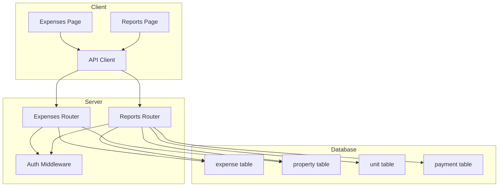
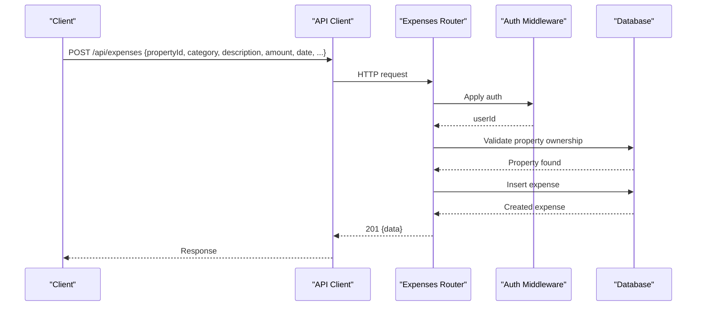
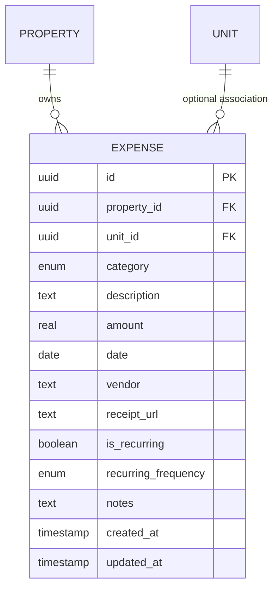
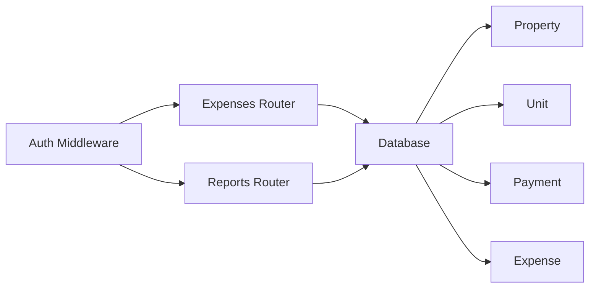

# Expenses API

<cite>
**Referenced Files in This Document**
- [expenses.ts](file://server/src/routes/expenses.ts)
- [reports.ts](file://server/src/routes/reports.ts)
- [schema.ts](file://server/src/db/schema.ts)
- [types.ts](file://shared/src/types.ts)
- [api.ts](file://client/src/lib/api.ts)
- [Expenses.tsx](file://client/src/pages/Expenses.tsx)
- [Reports.tsx](file://client/src/pages/Reports.tsx)
</cite>

## Table of Contents
1. Introduction
2. Project Structure
3. Core Components
4. Architecture Overview
5. Detailed Component Analysis
6. Dependency Analysis
7. Performance Considerations
8. Troubleshooting Guide
9. Conclusion
10. Appendices

## Introduction
This document provides comprehensive API documentation for expense management endpoints, including CRUD operations, categorization systems, validation rules, recurring expense setup, and reporting capabilities. It also outlines the expense data model, tax-related reporting (Schedule E), and guidance for integrating with accounting systems and meeting tax reporting requirements.

## Project Structure
The expense feature spans server routes, database schema, shared types, and client UI:
- Server routes expose REST endpoints for expenses and reports.
- Database schema defines tables and enums used by expenses and related entities.
- Shared types define TypeScript interfaces for clients and servers to share contracts.
- Client pages implement user interactions for recording, filtering, and reporting expenses.

**Diagram sources**
- [expenses.ts:1-106](file://server/src/routes/expenses.ts#L1-L106)
- [reports.ts:1-186](file://server/src/routes/reports.ts#L1-L186)
- [schema.ts:329-348](file://server/src/db/schema.ts#L329-L348)
- [schema.ts:191-226](file://server/src/db/schema.ts#L191-L226)
- [schema.ts:270-289](file://server/src/db/schema.ts#L270-L289)
- [api.ts:1-82](file://client/src/lib/api.ts#L1-L82)
- [Expenses.tsx:1-360](file://client/src/pages/Expenses.tsx#L1-L360)
- [Reports.tsx:1-382](file://client/src/pages/Reports.tsx#L1-L382)

**Section sources**
- [expenses.ts:1-106](file://server/src/routes/expenses.ts#L1-L106)
- [reports.ts:1-186](file://server/src/routes/reports.ts#L1-L186)
- [schema.ts:329-348](file://server/src/db/schema.ts#L329-L348)
- [types.ts:116-149](file://shared/src/types.ts#L116-L149)
- [api.ts:1-82](file://client/src/lib/api.ts#L1-L82)
- [Expenses.tsx:1-360](file://client/src/pages/Expenses.tsx#L1-L360)
- [Reports.tsx:1-382](file://client/src/pages/Reports.tsx#L1-L382)

## Core Components
- Expense CRUD endpoints under /api/expenses with authentication middleware.
- Validation using a schema that enforces required fields, category enum, numeric amount, date format, and optional vendor/receipt/recurring fields.
- Reporting endpoints for cash flow, profit & loss, and Schedule E aggregation per property and year.
- Data model includes categories, amounts, dates, descriptions, vendors, receipts, and recurring flags.

Key responsibilities:
- Expenses route: list, get, create, update, delete; filter by property, category, year, month; enforce ownership via property lookup.
- Reports route: aggregate income and expenses across properties and units; map categories to Schedule E lines; export-friendly structures.
- Schema: defines expense table columns, enums, and relationships to property/unit.
- Types: shared TypeScript definitions for Expense, ExpenseCategory, and report shapes.

**Section sources**
- [expenses.ts:11-28](file://server/src/routes/expenses.ts#L11-L28)
- [expenses.ts:31-103](file://server/src/routes/expenses.ts#L31-L103)
- [reports.ts:10-26](file://server/src/routes/reports.ts#L10-L26)
- [reports.ts:29-183](file://server/src/routes/reports.ts#L29-L183)
- [schema.ts:73-88](file://server/src/db/schema.ts#L73-L88)
- [schema.ts:329-348](file://server/src/db/schema.ts#L329-L348)
- [types.ts:116-149](file://shared/src/types.ts#L116-L149)

## Architecture Overview
The system follows a standard layered architecture:
- Client UI calls REST APIs via an HTTP client.
- Server routes apply authentication and validate requests.
- Data access uses an ORM against a PostgreSQL database.
- Reports compute aggregates from payments and expenses, mapping categories to tax lines.

**Diagram sources**
- [expenses.ts:66-79](file://server/src/routes/expenses.ts#L66-L79)
- [schema.ts:329-348](file://server/src/db/schema.ts#L329-L348)
- [api.ts:26-54](file://client/src/lib/api.ts#L26-L54)

## Detailed Component Analysis

### Expense Data Model
- Fields include identifiers, property and unit associations, category, description, amount, date, vendor, receipt URL, recurring flag, recurring frequency, notes, and timestamps.
- Categories are constrained to a fixed set aligned with common rental expense classifications.
- Recurring support is modeled with a boolean flag and an optional frequency field.

**Diagram sources**
- [schema.ts:191-226](file://server/src/db/schema.ts#L191-L226)
- [schema.ts:329-348](file://server/src/db/schema.ts#L329-L348)

**Section sources**
- [schema.ts:329-348](file://server/src/db/schema.ts#L329-L348)
- [types.ts:116-149](file://shared/src/types.ts#L116-L149)

### Expense Endpoints

#### List Expenses
- Method: GET
- Path: /api/expenses
- Query parameters:
  - propertyId: string (UUID) — filter by property
  - category: string — filter by category
  - year: number — filter by expense date year
  - month: number — filter by expense date month (1–12)
- Behavior:
  - Requires authentication.
  - Returns only expenses belonging to properties owned by the authenticated user.
  - Applies filters sequentially if provided.
- Response:
  - 200 OK: JSON object with data array of expenses.
  - 401 Unauthorized: handled by client-side redirect on 401 responses.
  - 404 Not Found: not returned by this endpoint; individual item retrieval returns 404.

**Section sources**
- [expenses.ts:31-54](file://server/src/routes/expenses.ts#L31-L54)
- [api.ts:39-54](file://client/src/lib/api.ts#L39-L54)

#### Get Expense by ID
- Method: GET
- Path: /api/expenses/:id
- Response:
  - 200 OK: JSON object with data containing the expense.
  - 404 Not Found: when the expense does not exist.

**Section sources**
- [expenses.ts:56-63](file://server/src/routes/expenses.ts#L56-L63)

#### Create Expense
- Method: POST
- Path: /api/expenses
- Request body fields:
  - propertyId: string (UUID) — required
  - unitId: string (UUID) — optional
  - category: enum — required
  - description: string — required, non-empty
  - amount: number — required, >= 0
  - date: string — required, non-empty
  - vendor: string — optional
  - receiptUrl: string — optional
  - isRecurring: boolean — default false
  - recurringFrequency: enum monthly|quarterly|annually — optional
  - notes: string — optional
- Behavior:
  - Validates request body against schema.
  - Verifies property ownership by matching propertyId with authenticated user’s properties.
  - Inserts expense and returns created record.
- Response:
  - 201 Created: JSON object with data containing the created expense.
  - 400 Bad Request: validation error with details.
  - 404 Not Found: property not found or not owned.

**Section sources**
- [expenses.ts:11-28](file://server/src/routes/expenses.ts#L11-L28)
- [expenses.ts:66-79](file://server/src/routes/expenses.ts#L66-L79)

#### Update Expense
- Method: PUT
- Path: /api/expenses/:id
- Request body: partial schema allowed; updatedAt is automatically refreshed.
- Behavior:
  - Validates provided fields.
  - Updates existing expense if found.
- Response:
  - 200 OK: JSON object with data containing the updated expense.
  - 400 Bad Request: validation error.
  - 404 Not Found: expense not found.

**Section sources**
- [expenses.ts:81-95](file://server/src/routes/expenses.ts#L81-L95)

#### Delete Expense
- Method: DELETE
- Path: /api/expenses/:id
- Behavior:
  - Deletes expense if it exists.
- Response:
  - 200 OK: JSON message confirming deletion.
  - 404 Not Found: expense not found.

**Section sources**
- [expenses.ts:97-103](file://server/src/routes/expenses.ts#L97-L103)

### Reporting Endpoints

#### Cash Flow Report
- Method: GET
- Path: /api/reports/cashflow
- Query parameters:
  - year: number — defaults to current year
- Behavior:
  - Aggregates monthly income (from payments) and expenses per property.
  - Computes net income per month and totals.
- Response:
  - 200 OK: JSON object with data array of per-property monthly summaries.

**Section sources**
- [reports.ts:29-77](file://server/src/routes/reports.ts#L29-L77)

#### Profit & Loss Report
- Method: GET
- Path: /api/reports/pnl
- Query parameters:
  - year: number — defaults to current year
  - quarter: number — optional (1–4)
- Behavior:
  - Filters payments and expenses by property, year, and optionally quarter.
  - Sums income and expenses to compute net income per property.
- Response:
  - 200 OK: JSON object with data array of per-property P&L summaries.

**Section sources**
- [reports.ts:131-183](file://server/src/routes/reports.ts#L131-L183)

#### Schedule E Report
- Method: GET
- Path: /api/reports/schedule-e
- Query parameters:
  - year: number — defaults to current year
- Behavior:
  - Groups expenses by category and maps to Schedule E line numbers and descriptions.
  - Calculates total rent received and net income per property.
- Response:
  - 200 OK: JSON object with data array of per-property line items and totals.

**Section sources**
- [reports.ts:10-26](file://server/src/routes/reports.ts#L10-L26)
- [reports.ts:79-129](file://server/src/routes/reports.ts#L79-L129)

### Client Integration

#### Recording Expenses
- The Expenses page allows users to add expenses via a form that posts to /api/expenses.
- Supports selecting property, category, amount, date, vendor, and marking as recurring.
- Displays filtered lists and totals, with delete actions.

**Section sources**
- [Expenses.tsx:47-112](file://client/src/pages/Expenses.tsx#L47-L112)
- [Expenses.tsx:157-359](file://client/src/pages/Expenses.tsx#L157-L359)

#### Generating Reports
- The Reports page fetches cash flow, P&L, and Schedule E data based on selected year.
- Provides visual charts and CSV export functionality.

**Section sources**
- [Reports.tsx:60-135](file://client/src/pages/Reports.tsx#L60-L135)
- [Reports.tsx:184-378](file://client/src/pages/Reports.tsx#L184-L378)

## Dependency Analysis
- Authentication: All expense and report routes require authentication via middleware.
- Ownership checks: Creating expenses validates property ownership before insertion.
- Data relationships: Expenses reference properties and optionally units; reports join with payments and units to compute metrics.
- Category mapping: Reports map expense categories to Schedule E lines for tax reporting.

**Diagram sources**
- [expenses.ts:1-9](file://server/src/routes/expenses.ts#L1-L9)
- [reports.ts:1-8](file://server/src/routes/reports.ts#L1-L8)
- [schema.ts:191-226](file://server/src/db/schema.ts#L191-L226)
- [schema.ts:270-289](file://server/src/db/schema.ts#L270-L289)
- [schema.ts:329-348](file://server/src/db/schema.ts#L329-L348)

**Section sources**
- [expenses.ts:1-9](file://server/src/routes/expenses.ts#L1-L9)
- [reports.ts:1-8](file://server/src/routes/reports.ts#L1-L8)

## Performance Considerations
- Filtering is performed in-memory after fetching all expenses and related records. For large datasets, consider server-side pagination and indexed queries on date, propertyId, and category.
- Report endpoints load all payments and expenses into memory to compute aggregates. Indexing payment.dueDate, payment.paidDate, and expense.date can improve performance.
- Avoid unnecessary full-table scans by adding database indexes for frequently filtered columns (e.g., propertyId, date).
- Consider caching report results per user and year to reduce repeated computation.

[No sources needed since this section provides general guidance]

## Troubleshooting Guide
Common issues and resolutions:
- Validation errors: Ensure request bodies match the expense schema (required fields, correct types, valid category enum). Check response details for specific field errors.
- Not found errors: Verify IDs exist and belong to the authenticated user; creating expenses requires owning the referenced property.
- Unauthorized: The client redirects to login on 401 responses; ensure sessions are active and credentials are included.
- Date filtering: Confirm date formats and timezone handling; month values are 1-based in queries.

**Section sources**
- [expenses.ts:66-79](file://server/src/routes/expenses.ts#L66-L79)
- [expenses.ts:56-63](file://server/src/routes/expenses.ts#L56-L63)
- [api.ts:39-54](file://client/src/lib/api.ts#L39-L54)

## Conclusion
The Expenses API provides robust CRUD operations with strong validation and ownership enforcement, alongside comprehensive reporting for financial analysis and tax preparation. By leveraging categorized expenses, recurring flags, and Schedule E mappings, landlords can track costs effectively and generate accurate reports for accounting and compliance.

[No sources needed since this section summarizes without analyzing specific files]

## Appendices

### Expense Categories
Supported categories align with common rental expense classifications:
- advertising, auto_travel, cleaning, insurance, legal_professional, management, mortgage_interest, other_interest, repairs, supplies, taxes, utilities, depreciation, other

**Section sources**
- [expenses.ts:14-19](file://server/src/routes/expenses.ts#L14-L19)
- [schema.ts:73-88](file://server/src/db/schema.ts#L73-L88)
- [types.ts:118-132](file://shared/src/types.ts#L118-L132)

### Recurring Expense Setup
- Mark an expense as recurring by setting isRecurring to true.
- Optionally specify recurringFrequency as monthly, quarterly, or annually.
- Use these flags to identify and potentially automate future entries in downstream processes.

**Section sources**
- [expenses.ts:25-27](file://server/src/routes/expenses.ts#L25-L27)
- [schema.ts:343-344](file://server/src/db/schema.ts#L343-L344)
- [types.ts:144-146](file://shared/src/types.ts#L144-L146)

### Tax Reporting Requirements
- Schedule E mapping associates each expense category with IRS Schedule E line numbers and descriptions for tax filing.
- Use the Schedule E report endpoint to obtain grouped totals per property and year, suitable for exporting to spreadsheets or accounting software.

**Section sources**
- [reports.ts:10-26](file://server/src/routes/reports.ts#L10-L26)
- [reports.ts:79-129](file://server/src/routes/reports.ts#L79-L129)

### Integration with Accounting Systems
- Exportable formats:
  - CSV exports available from the Reports page for cash flow, P&L, and Schedule E data.
- Recommended integration steps:
  - Map expense categories to your accounting software’s chart of accounts.
  - Use vendor fields to reconcile transactions with bank feeds.
  - Leverage recurring flags to schedule automated entries in your accounting system.
  - Periodically export Schedule E reports for tax preparation and auditor review.

**Section sources**
- [Reports.tsx:47-58](file://client/src/pages/Reports.tsx#L47-L58)
- [Reports.tsx:102-135](file://client/src/pages/Reports.tsx#L102-L135)