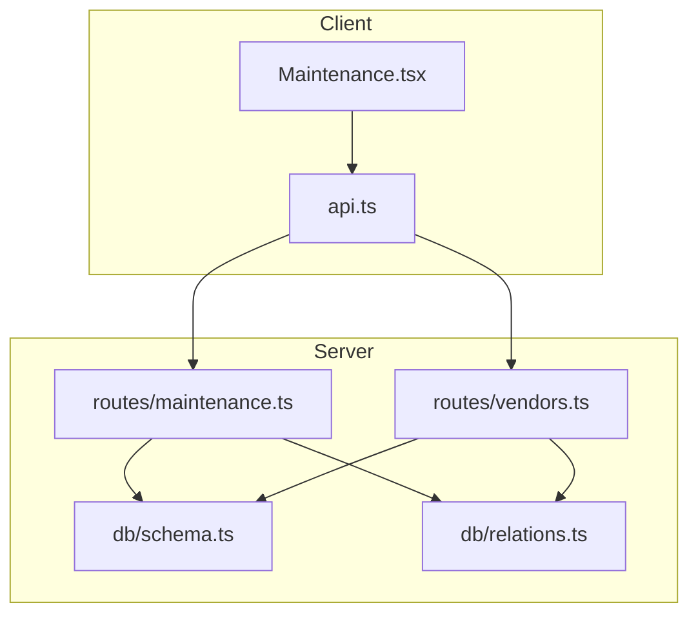
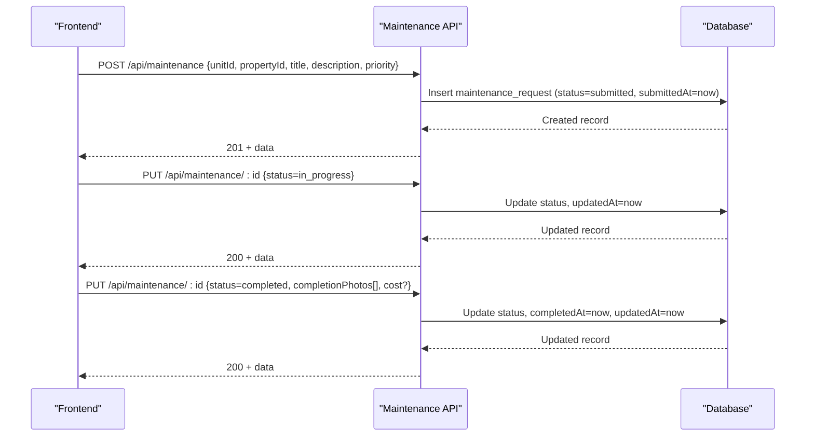
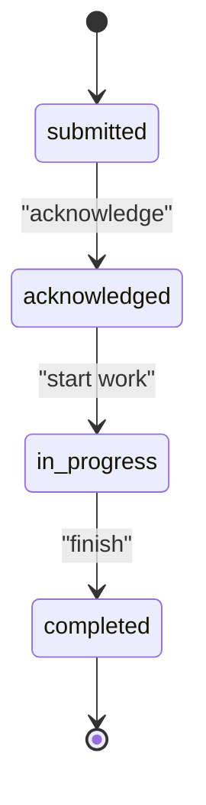
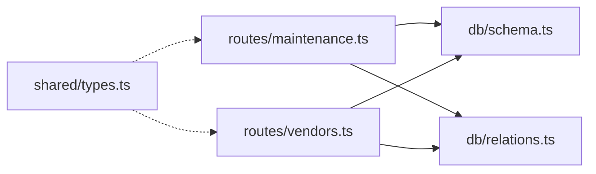

# Maintenance API

<cite>
**Referenced Files in This Document**
- [maintenance.ts](file://server/src/routes/maintenance.ts)
- [schema.ts](file://server/src/db/schema.ts)
- [relations.ts](file://server/src/db/relations.ts)
- [types.ts](file://shared/src/types.ts)
- [Maintenance.tsx](file://client/src/pages/Maintenance.tsx)
- [api.ts](file://client/src/lib/api.ts)
</cite>

## Table of Contents
1. [Introduction](#introduction)
2. [Project Structure](#project-structure)
3. [Core Components](#core-components)
4. [Architecture Overview](#architecture-overview)
5. [Detailed Component Analysis](#detailed-component-analysis)
6. [Dependency Analysis](#dependency-analysis)
7. [Performance Considerations](#performance-considerations)
8. [Troubleshooting Guide](#troubleshooting-guide)
9. [Conclusion](#conclusion)
10. [Appendices](#appendices)

## Introduction
This document provides detailed API documentation for maintenance request management endpoints. It covers HTTP methods, URL patterns, request/response schemas, workflow states, and the complete lifecycle from submission to completion and billing. It also explains vendor assignment, cost tracking, priority levels, and status transitions with validation rules and notification triggers.

## Project Structure
The maintenance feature spans server routes, database schema, shared types, and a client page that exercises the API.

**Diagram sources**
- [maintenance.ts:1-103](file://server/src/routes/maintenance.ts#L1-L103)
- [vendors.ts:1-71](file://server/src/routes/vendors.ts#L1-L71)
- [schema.ts:291-325](file://server/src/db/schema.ts#L291-L325)
- [relations.ts:74-80](file://server/src/db/relations.ts#L74-L80)

**Section sources**
- [maintenance.ts:1-103](file://server/src/routes/maintenance.ts#L1-L103)
- [schema.ts:291-325](file://server/src/db/schema.ts#L291-L325)
- [relations.ts:74-80](file://server/src/db/relations.ts#L74-L80)
- [Maintenance.tsx:61-368](file://client/src/pages/Maintenance.tsx#L61-L368)
- [api.ts:1-82](file://client/src/lib/api.ts#L1-L82)

## Core Components
- Maintenance Request CRUD endpoints under /api/maintenance
- Vendor management endpoints under /api/vendors
- Data model defined in schema with enums for priority and status
- Shared TypeScript types for frontend/backend alignment
- Client UI for creating requests and advancing status

Key responsibilities:
- Validate payloads using Zod
- Enforce ownership filtering for listing
- Manage lifecycle timestamps (submittedAt, completedAt)
- Support optional vendor assignment and cost tracking

**Section sources**
- [maintenance.ts:11-23](file://server/src/routes/maintenance.ts#L11-L23)
- [schema.ts:60-71](file://server/src/db/schema.ts#L60-L71)
- [schema.ts:291-325](file://server/src/db/schema.ts#L291-L325)
- [types.ts:92-114](file://shared/src/types.ts#L92-L114)

## Architecture Overview
The maintenance workflow is driven by a state machine with four statuses: submitted → acknowledged → in_progress → completed. The PUT endpoint updates status and sets completion timestamp when moving to completed. Listing filters by user-owned properties and supports query parameters for status and priority.

**Diagram sources**
- [maintenance.ts:57-90](file://server/src/routes/maintenance.ts#L57-L90)
- [schema.ts:291-325](file://server/src/db/schema.ts#L291-L325)

## Detailed Component Analysis

### Endpoints

#### List Maintenance Requests
- Method: GET
- URL: /api/maintenance
- Query params:
  - status: filter by maintenance status
  - priority: filter by maintenance priority
- Response: { data: MaintenanceRequest[] }
- Notes:
  - Requires authentication
  - Filters results to requests belonging to properties owned by the authenticated user

**Section sources**
- [maintenance.ts:25-45](file://server/src/routes/maintenance.ts#L25-L45)
- [schema.ts:291-325](file://server/src/db/schema.ts#L291-L325)

#### Get Single Maintenance Request
- Method: GET
- URL: /api/maintenance/:id
- Response: { data: MaintenanceRequest }
- Error: 404 if not found

**Section sources**
- [maintenance.ts:47-55](file://server/src/routes/maintenance.ts#L47-L55)

#### Create Maintenance Request
- Method: POST
- URL: /api/maintenance
- Request body:
  - unitId: string (UUID)
  - propertyId: string (UUID)
  - tenantId: string (UUID, optional)
  - title: string (min length 1)
  - description: string (min length 1)
  - priority: enum ["emergency", "urgent", "routine"], default "routine"
  - status: enum ["submitted", "acknowledged", "in_progress", "completed"], default "submitted"
  - photos: string[], default []
  - completionPhotos: string[], default []
  - vendorId: string (UUID, optional)
  - cost: number (optional)
- Response: { data: MaintenanceRequest }
- Status: 201 on success
- Validation: Zod schema enforced; returns 400 with details on failure

**Section sources**
- [maintenance.ts:11-23](file://server/src/routes/maintenance.ts#L11-L23)
- [maintenance.ts:57-67](file://server/src/routes/maintenance.ts#L57-L67)
- [schema.ts:291-325](file://server/src/db/schema.ts#L291-L325)

#### Update Maintenance Request
- Method: PUT
- URL: /api/maintenance/:id
- Request body: Partial of create payload
- Behavior:
  - Updates provided fields and sets updatedAt
  - If status becomes "completed", sets completedAt
- Response: { data: MaintenanceRequest }
- Error: 404 if not found; 400 on validation error

**Section sources**
- [maintenance.ts:69-90](file://server/src/routes/maintenance.ts#L69-L90)
- [schema.ts:291-325](file://server/src/db/schema.ts#L291-L325)

#### Delete Maintenance Request
- Method: DELETE
- URL: /api/maintenance/:id
- Response: { message: "Deleted" }
- Error: 404 if not found

**Section sources**
- [maintenance.ts:92-100](file://server/src/routes/maintenance.ts#L92-L100)

### Vendor Management Endpoints

#### List Vendors
- Method: GET
- URL: /api/vendors
- Response: { data: Vendor[] }
- Notes: Returns vendors owned by the authenticated user

**Section sources**
- [vendors.ts:20-28](file://server/src/routes/vendors.ts#L20-L28)

#### Create Vendor
- Method: POST
- URL: /api/vendors
- Request body: name, trade, phone?, email?, insuranceExpiry?, notes?
- Response: { data: Vendor }
- Status: 201 on success

**Section sources**
- [vendors.ts:30-38](file://server/src/routes/vendors.ts#L30-L38)

#### Update Vendor
- Method: PUT
- URL: /api/vendors/:id
- Request body: Partial of create payload
- Response: { data: Vendor }
- Error: 404 if not found or not owned

**Section sources**
- [vendors.ts:40-57](file://server/src/routes/vendors.ts#L40-L57)

#### Delete Vendor
- Method: DELETE
- URL: /api/vendors/:id
- Response: { message: "Deleted" }
- Error: 404 if not found or not owned

**Section sources**
- [vendors.ts:59-68](file://server/src/routes/vendors.ts#L59-L68)

### Data Model

#### MaintenanceRequest
- id: UUID
- unitId: UUID (FK to unit)
- tenantId: UUID (nullable FK to tenant)
- propertyId: UUID (FK to property)
- title: text
- description: text
- priority: enum ["emergency", "urgent", "routine"]
- status: enum ["submitted", "acknowledged", "in_progress", "completed"]
- photos: string[]
- completionPhotos: string[]
- vendorId: UUID (nullable FK to vendor)
- cost: number (nullable)
- submittedAt: timestamp
- completedAt: timestamp (nullable)
- createdAt: timestamp
- updatedAt: timestamp

**Section sources**
- [schema.ts:291-325](file://server/src/db/schema.ts#L291-L325)
- [types.ts:92-114](file://shared/src/types.ts#L92-L114)

#### Vendor
- id: UUID
- userId: UUID (FK to user)
- name: text
- trade: text
- phone: text (nullable)
- email: text (nullable)
- insuranceExpiry: date (nullable)
- notes: text (nullable)
- createdAt: timestamp
- updatedAt: timestamp

**Section sources**
- [schema.ts:350-365](file://server/src/db/schema.ts#L350-L365)
- [types.ts:151-164](file://shared/src/types.ts#L151-L164)

### Workflow States and Transitions

Statuses:
- submitted
- acknowledged
- in_progress
- completed

Allowed transitions:
- submitted → acknowledged
- acknowledged → in_progress
- in_progress → completed

Completion behavior:
- When status is set to "completed", completedAt is automatically set to current time.

Validation rules:
- Creation enforces required fields and defaults via Zod schema.
- Updates allow partial fields; invalid values return 400.

Notification triggers:
- A notification type exists for maintenance updates; however, no explicit trigger is implemented in the maintenance route. Integration points exist via the notification schema and types.

**Diagram sources**
- [maintenance.ts:69-90](file://server/src/routes/maintenance.ts#L69-L90)
- [schema.ts:60-71](file://server/src/db/schema.ts#L60-L71)

**Section sources**
- [maintenance.ts:69-90](file://server/src/routes/maintenance.ts#L69-L90)
- [schema.ts:60-71](file://server/src/db/schema.ts#L60-L71)

### Examples

#### Create a Maintenance Request
- Endpoint: POST /api/maintenance
- Body includes unitId, propertyId, title, description, priority (default routine), and optional tenantId, photos, vendorId, cost.
- Success returns 201 with created request including status "submitted" and submittedAt.

**Section sources**
- [maintenance.ts:57-67](file://server/src/routes/maintenance.ts#L57-L67)
- [schema.ts:291-325](file://server/src/db/schema.ts#L291-L325)

#### Assign a Vendor
- First list vendors: GET /api/vendors
- Then update the request: PUT /api/maintenance/:id with vendorId and optionally cost.

**Section sources**
- [vendors.ts:20-28](file://server/src/routes/vendors.ts#L20-L28)
- [maintenance.ts:69-90](file://server/src/routes/maintenance.ts#L69-L90)

#### Update Progress
- Advance status sequentially:
  - PUT /api/maintenance/:id { status: "acknowledged" }
  - PUT /api/maintenance/:id { status: "in_progress" }
- Each update sets updatedAt; final step sets completedAt when moving to "completed".

**Section sources**
- [maintenance.ts:69-90](file://server/src/routes/maintenance.ts#L69-L90)

#### Complete a Request
- PUT /api/maintenance/:id { status: "completed", completionPhotos?: [], cost?: number }
- Server sets completedAt automatically.

**Section sources**
- [maintenance.ts:69-90](file://server/src/routes/maintenance.ts#L69-L90)

### Client Interaction
The Maintenance page demonstrates:
- Fetching all requests and filtering by status/priority
- Creating new requests via POST
- Advancing status via PUT
- Visualizing status columns and priorities

**Section sources**
- [Maintenance.tsx:61-368](file://client/src/pages/Maintenance.tsx#L61-L368)
- [api.ts:1-82](file://client/src/lib/api.ts#L1-L82)

## Dependency Analysis
- Routes depend on Drizzle ORM and schema definitions for queries and inserts.
- Maintenance route uses auth middleware to enforce user context.
- Relations define how maintenance requests relate to units, tenants, properties, and vendors.

**Diagram sources**
- [maintenance.ts:1-103](file://server/src/routes/maintenance.ts#L1-L103)
- [vendors.ts:1-71](file://server/src/routes/vendors.ts#L1-L71)
- [schema.ts:291-325](file://server/src/db/schema.ts#L291-L325)
- [relations.ts:74-80](file://server/src/db/relations.ts#L74-L80)
- [types.ts:92-114](file://shared/src/types.ts#L92-L114)

**Section sources**
- [maintenance.ts:1-103](file://server/src/routes/maintenance.ts#L1-L103)
- [vendors.ts:1-71](file://server/src/routes/vendors.ts#L1-L71)
- [schema.ts:291-325](file://server/src/db/schema.ts#L291-L325)
- [relations.ts:74-80](file://server/src/db/relations.ts#L74-L80)
- [types.ts:92-114](file://shared/src/types.ts#L92-L114)

## Performance Considerations
- Listing filters by user-owned properties to reduce dataset size.
- Use query parameters to filter by status and priority on the client side to avoid unnecessary network calls.
- Avoid fetching full relations unless needed; the GET single endpoint includes related unit, tenant, and vendor which may increase payload size.

[No sources needed since this section provides general guidance]

## Troubleshooting Guide
Common errors and handling:
- Validation errors: 400 with code "VALIDATION" and details array from Zod.
- Not found: 404 with code "NOT_FOUND" when requesting non-existent records.
- Unauthorized: Frontend redirects to login on 401 responses.

Recommendations:
- Inspect response codes and messages.
- For creation failures, review Zod validation details to correct input.
- Ensure proper authentication headers are included when calling endpoints.

**Section sources**
- [maintenance.ts:57-100](file://server/src/routes/maintenance.ts#L57-L100)
- [api.ts:39-51](file://client/src/lib/api.ts#L39-L51)

## Conclusion
The maintenance API provides a robust, validated, and secure interface for managing maintenance requests across properties. It supports a clear workflow with status transitions, vendor assignments, and cost tracking. While notifications infrastructure exists, explicit triggers for maintenance events are not implemented in the current routes.

[No sources needed since this section summarizes without analyzing specific files]

## Appendices

### Request/Response Schemas Summary

- Create/Update Payload Fields:
  - unitId: string (UUID)
  - propertyId: string (UUID)
  - tenantId: string (UUID, optional)
  - title: string (required)
  - description: string (required)
  - priority: enum ["emergency", "urgent", "routine"] (default "routine")
  - status: enum ["submitted", "acknowledged", "in_progress", "completed"] (default "submitted")
  - photos: string[] (default [])
  - completionPhotos: string[] (default [])
  - vendorId: string (UUID, optional)
  - cost: number (optional)

- Responses:
  - Success: { data: MaintenanceRequest | Vendor }
  - Errors: { message: string, code: string, details?: Record }

**Section sources**
- [maintenance.ts:11-23](file://server/src/routes/maintenance.ts#L11-L23)
- [schema.ts:291-325](file://server/src/db/schema.ts#L291-L325)
- [types.ts:92-114](file://shared/src/types.ts#L92-L114)

### Notification Types
- maintenance_update is available as a notification type for future integration.

**Section sources**
- [schema.ts:90-98](file://server/src/db/schema.ts#L90-L98)
- [types.ts:166-190](file://shared/src/types.ts#L166-L190)