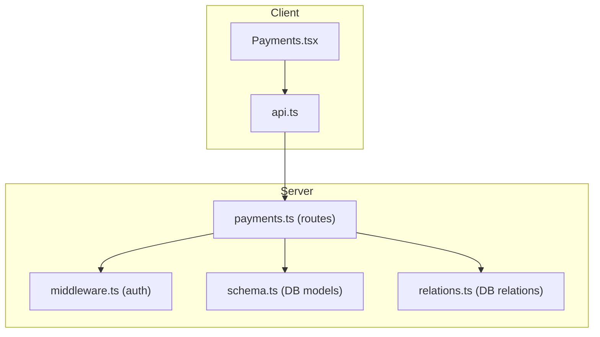
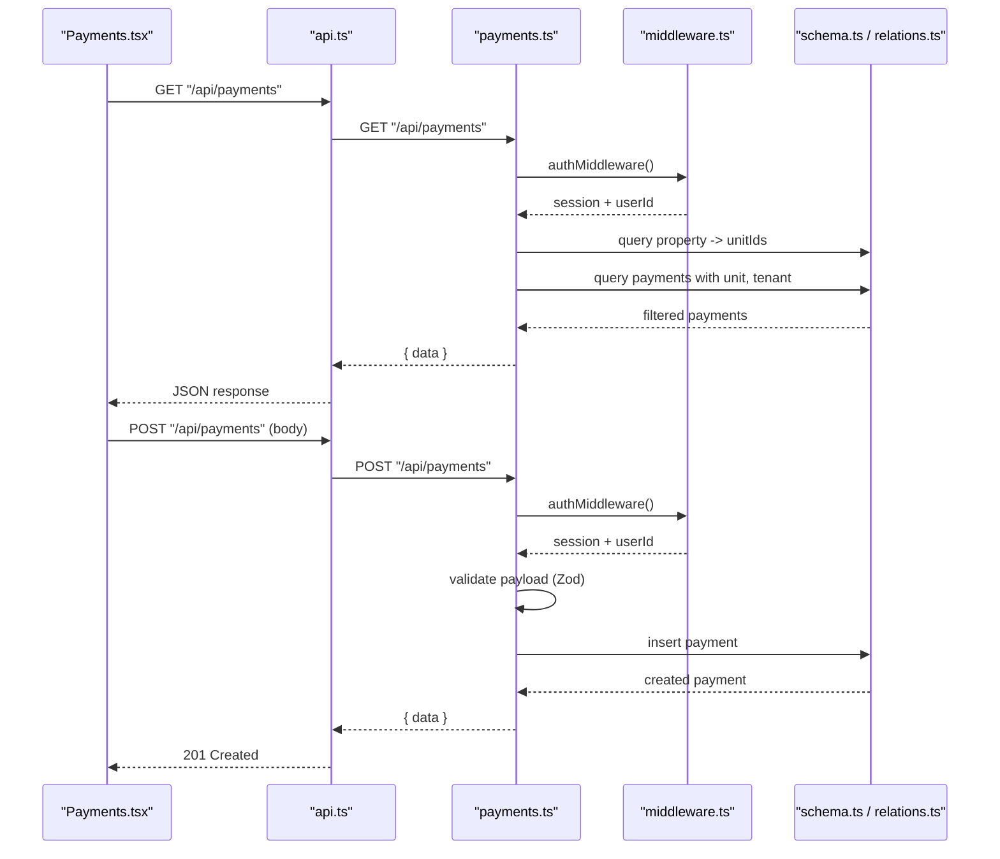
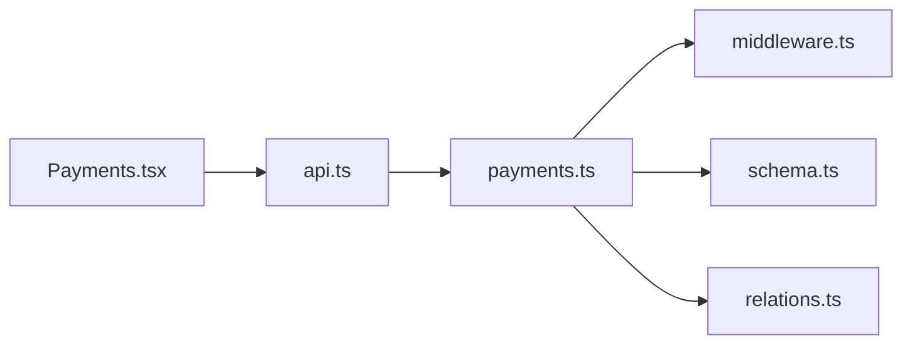
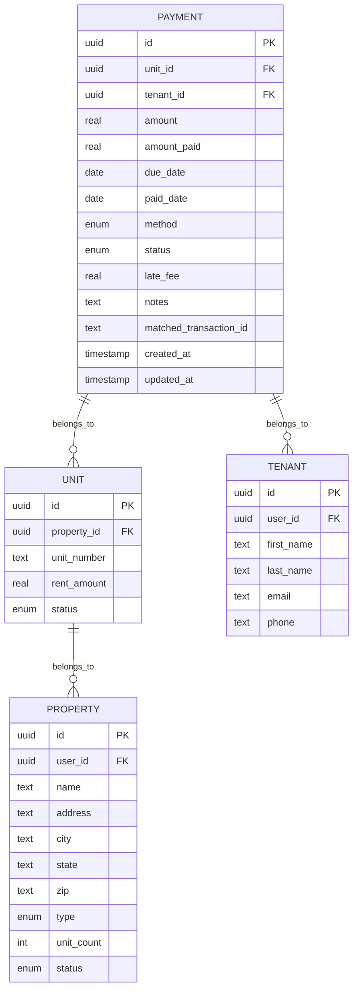

# Payments API

<cite>
**Referenced Files in This Document**
- [payments.ts](file://server/src/routes/payments.ts)
- [schema.ts](file://server/src/db/schema.ts)
- [relations.ts](file://server/src/db/relations.ts)
- [types.ts](file://shared/src/types.ts)
- [middleware.ts](file://server/src/auth/middleware.ts)
- [api.ts](file://client/src/lib/api.ts)
- [Payments.tsx](file://client/src/pages/Payments.tsx)
</cite>

## Table of Contents
1. Introduction
2. Project Structure
3. Core Components
4. Architecture Overview
5. Detailed Component Analysis
6. Dependency Analysis
7. Performance Considerations
8. Troubleshooting Guide
9. Conclusion
10. Appendices

## Introduction
This document provides comprehensive API documentation for payment processing and tracking endpoints. It covers HTTP methods for creating, reading, updating, and deleting payments; recording rent payments; handling late fees; querying payment histories; generating summaries; and outlines integration points for external payment processors and reconciliation workflows. The data model includes amount, date, method, status, and associated tenant/unit information. Validation rules, status transitions, and financial calculations are detailed with examples for recording payments, generating receipts, and querying histories.

## Project Structure
The payment system is implemented as a RESTful API on the server with a React client that consumes it. Key files:
- Server routes define endpoints for payments and summary
- Database schema defines the payment entity and related entities
- Relations define how payments link to units and tenants
- Shared types define Payment, PaymentMethod, and PaymentStatus
- Auth middleware secures endpoints
- Client API client handles HTTP requests and error handling
- Client page demonstrates usage and UI interactions

**Diagram sources**
- [Payments.tsx:63-85](file://client/src/pages/Payments.tsx#L63-L85)
- [api.ts:26-78](file://client/src/lib/api.ts#L26-L78)
- [payments.ts:1-137](file://server/src/routes/payments.ts#L1-L137)
- [middleware.ts:9-27](file://server/src/auth/middleware.ts#L9-L27)
- [schema.ts:270-289](file://server/src/db/schema.ts#L270-L289)
- [relations.ts:68-72](file://server/src/db/relations.ts#L68-L72)

**Section sources**
- [payments.ts:1-137](file://server/src/routes/payments.ts#L1-L137)
- [schema.ts:270-289](file://server/src/db/schema.ts#L270-L289)
- [relations.ts:68-72](file://server/src/db/relations.ts#L68-L72)
- [types.ts:72-90](file://shared/src/types.ts#L72-L90)
- [middleware.ts:9-27](file://server/src/auth/middleware.ts#L9-L27)
- [api.ts:26-78](file://client/src/lib/api.ts#L26-L78)
- [Payments.tsx:63-107](file://client/src/pages/Payments.tsx#L63-L107)

## Core Components
- Payments route module exposes CRUD endpoints and a monthly summary endpoint
- Payment data model defines fields for amounts, dates, method, status, late fee, and notes
- Relations connect payments to units and tenants for rich queries
- Shared types enforce consistent contracts between client and server
- Auth middleware ensures all payment endpoints require authentication
- Client API client standardizes HTTP calls and error handling
- Client page demonstrates recording payments and viewing summaries

Key responsibilities:
- Validate incoming payloads using Zod schemas
- Enforce user-scoped access by filtering payments based on user-owned properties
- Provide monthly collection metrics and counts
- Support partial updates for payment status and amounts

**Section sources**
- [payments.ts:11-22](file://server/src/routes/payments.ts#L11-L22)
- [payments.ts:25-134](file://server/src/routes/payments.ts#L25-L134)
- [schema.ts:270-289](file://server/src/db/schema.ts#L270-L289)
- [relations.ts:68-72](file://server/src/db/relations.ts#L68-L72)
- [types.ts:72-90](file://shared/src/types.ts#L72-L90)
- [middleware.ts:9-27](file://server/src/auth/middleware.ts#L9-L27)
- [api.ts:26-78](file://client/src/lib/api.ts#L26-L78)
- [Payments.tsx:63-107](file://client/src/pages/Payments.tsx#L63-L107)

## Architecture Overview
The Payments API follows a layered architecture:
- Client layer: React components call the API via a typed client
- Route layer: Express router enforces auth and validates inputs
- Data layer: Drizzle ORM queries interact with PostgreSQL tables
- Relations: Payments relate to Units and Tenants for enriched responses

**Diagram sources**
- [Payments.tsx:63-107](file://client/src/pages/Payments.tsx#L63-L107)
- [api.ts:26-78](file://client/src/lib/api.ts#L26-L78)
- [payments.ts:25-134](file://server/src/routes/payments.ts#L25-L134)
- [middleware.ts:9-27](file://server/src/auth/middleware.ts#L9-L27)
- [schema.ts:270-289](file://server/src/db/schema.ts#L270-L289)
- [relations.ts:68-72](file://server/src/db/relations.ts#L68-L72)

## Detailed Component Analysis

### Payments Endpoints
- GET /api/payments
  - Purpose: List payments with optional filters
  - Query parameters: month, year, status, unitId
  - Behavior:
    - Requires authentication
    - Filters payments to only those belonging to units under user-owned properties
    - Supports filtering by due date month/year, status, and unitId
    - Returns payments with associated unit and tenant
  - Response: { data: Payment[] }

- GET /api/payments/summary
  - Purpose: Monthly rent collection summary
  - Query parameters: month, year (defaults to current month/year)
  - Behavior:
    - Requires authentication
    - Computes totals for expected, collected, outstanding, and collection rate
    - Counts received, late, and pending payments for the month
  - Response: { data: { totalExpected, totalCollected, totalOutstanding, collectionRate, paymentCount, receivedCount, lateCount, pendingCount } }

- POST /api/payments
  - Purpose: Create a new payment record
  - Body validation:
    - unitId: UUID string
    - tenantId: UUID string
    - amount: number >= 0
    - amountPaid: number >= 0, default 0
    - dueDate: non-empty string
    - paidDate: nullable string
    - method: enum or null
    - status: enum, default "pending"
    - lateFee: number >= 0, default 0
    - notes: nullable string
  - Behavior:
    - Requires authentication
    - Validates payload with Zod
    - Inserts into database and returns created record
  - Response: { data: Payment }

- PUT /api/payments/:id
  - Purpose: Update an existing payment (partial update)
  - Body validation: same fields as create but all optional
  - Behavior:
    - Requires authentication
    - Validates payload
    - Updates matching payment and sets updatedAt timestamp
  - Response: { data: Payment }

- DELETE /api/payments/:id
  - Purpose: Delete a payment record
  - Behavior:
    - Requires authentication
    - Deletes matching payment if exists
  - Response: { message: "Deleted" }

Validation rules:
- All numeric amounts must be non-negative
- Status must be one of: pending, received, late, partial
- Method must be one of: cash, check, zelle, venmo, ach, card, bank_transfer, other
- Dates must be valid strings representing due/paid dates

Status transitions:
- Default status on creation is "pending"
- Updates can transition to "received", "late", or "partial"
- Late fee field supports additional charges beyond base amount

Financial calculations:
- Summary computes:
  - totalExpected = sum of amount for month’s payments
  - totalCollected = sum of amountPaid for month’s payments
  - totalOutstanding = totalExpected - totalCollected
  - collectionRate = (totalCollected / totalExpected) * 100 (rounded to two decimals)

Examples:
- Recording a payment:
  - Send POST /api/payments with required fields including unitId, tenantId, amount, dueDate, and optional method/status
  - See request body structure in shared types and Zod schema
- Generating a receipt:
  - Use GET /api/payments/:id (if supported) or construct from stored payment data returned by POST/PUT
  - Include tenant name, unit number, amount, amountPaid, method, status, dueDate, paidDate, lateFee, and notes
- Querying payment history:
  - Use GET /api/payments?month=...&year=...&status=...&unitId=...
  - Use GET /api/payments/summary?month=...&year=... for monthly metrics

Integration points:
- External payment processors:
  - Add webhook handlers to reconcile matchedTransactionId with processor records
  - On successful payment confirmation, update status to "received" and set paidDate
  - For partial payments, set status to "partial" and adjust amountPaid accordingly
- Reconciliation workflow:
  - Periodically match bank statements or processor exports to matchedTransactionId
  - Flag discrepancies for review and update payment records accordingly

**Section sources**
- [payments.ts:25-134](file://server/src/routes/payments.ts#L25-L134)
- [payments.ts:11-22](file://server/src/routes/payments.ts#L11-L22)
- [schema.ts:270-289](file://server/src/db/schema.ts#L270-L289)
- [types.ts:72-90](file://shared/src/types.ts#L72-L90)

### Payment Data Model
Fields:
- id: unique identifier
- unitId: links to unit
- tenantId: links to tenant
- amount: total rent due
- amountPaid: amount already paid
- dueDate: due date string
- paidDate: payment date (nullable)
- method: payment method (enum or null)
- status: payment status (enum)
- lateFee: late fee amount
- notes: free-form notes
- matchedTransactionId: external transaction reference (nullable)
- createdAt, updatedAt: timestamps

Relationships:
- Unit: many payments per unit
- Tenant: many payments per tenant

Complexity:
- Queries filter by user-owned properties and units to ensure data isolation
- Filtering uses in-memory Set lookups for performance

**Section sources**
- [schema.ts:270-289](file://server/src/db/schema.ts#L270-L289)
- [relations.ts:68-72](file://server/src/db/relations.ts#L68-L72)
- [types.ts:72-90](file://shared/src/types.ts#L72-L90)

### Authentication and Authorization
- All payment endpoints are protected by authMiddleware
- Middleware extracts session and attaches userId to request
- Unauthorized requests receive 401 with code "UNAUTHORIZED"

Security considerations:
- Ensure sessions are properly managed by Better-Auth
- Validate user ownership of properties before exposing payment data

**Section sources**
- [middleware.ts:9-27](file://server/src/auth/middleware.ts#L9-L27)
- [payments.ts:1-9](file://server/src/routes/payments.ts#L1-L9)

### Client Integration
- ApiClient handles base URL, params, credentials, and error handling
- Redirects to login on 401 responses
- Provides get/post/put/delete convenience methods

Usage in Payments page:
- Fetches payments and summary
- Submits new payments and invalidates queries on success
- Displays stats and table with unit, tenant, amounts, dates, status, method

**Section sources**
- [api.ts:26-78](file://client/src/lib/api.ts#L26-L78)
- [Payments.tsx:63-107](file://client/src/pages/Payments.tsx#L63-L107)
- [Payments.tsx:126-209](file://client/src/pages/Payments.tsx#L126-L209)

## Dependency Analysis
The payment system depends on:
- Express router for HTTP handling
- Drizzle ORM for database operations
- Zod for input validation
- Better-Auth for session management
- Shared types for contract consistency
- Client API client for standardized HTTP calls

**Diagram sources**
- [payments.ts:1-137](file://server/src/routes/payments.ts#L1-L137)
- [middleware.ts:9-27](file://server/src/auth/middleware.ts#L9-L27)
- [schema.ts:270-289](file://server/src/db/schema.ts#L270-L289)
- [relations.ts:68-72](file://server/src/db/relations.ts#L68-L72)
- [api.ts:26-78](file://client/src/lib/api.ts#L26-L78)
- [Payments.tsx:63-107](file://client/src/pages/Payments.tsx#L63-L107)

**Section sources**
- [payments.ts:1-137](file://server/src/routes/payments.ts#L1-L137)
- [middleware.ts:9-27](file://server/src/auth/middleware.ts#L9-L27)
- [schema.ts:270-289](file://server/src/db/schema.ts#L270-L289)
- [relations.ts:68-72](file://server/src/db/relations.ts#L68-L72)
- [api.ts:26-78](file://client/src/lib/api.ts#L26-L78)
- [Payments.tsx:63-107](file://client/src/pages/Payments.tsx#L63-L107)

## Performance Considerations
- Filtering by user-owned properties reduces dataset size
- Using Sets for unitId checks improves lookup performance
- Summary computation aggregates in-memory arrays; consider pagination for large datasets
- Avoid unnecessary joins; load related data selectively when needed
- Cache summary results for short periods to reduce repeated aggregation

[No sources needed since this section provides general guidance]

## Troubleshooting Guide
Common issues and resolutions:
- Unauthorized errors:
  - Ensure session is valid and headers include credentials
  - Check authMiddleware behavior and session retrieval
- Validation errors:
  - Verify payload matches Zod schema constraints
  - Inspect error details for specific field violations
- Not found errors:
  - Confirm payment ID exists before update/delete
- Data isolation:
  - Ensure user owns properties linked to units referenced in payments
- Financial discrepancies:
  - Review amount vs amountPaid and lateFee fields
  - Check status transitions and paidDate accuracy

Error responses:
- 400: Validation error with details
- 401: Unauthorized
- 404: Not found

**Section sources**
- [payments.ts:104-134](file://server/src/routes/payments.ts#L104-L134)
- [middleware.ts:9-27](file://server/src/auth/middleware.ts#L9-L27)
- [api.ts:39-51](file://client/src/lib/api.ts#L39-L51)

## Conclusion
The Payments API provides robust CRUD operations for rent payments, late fees, and payment history, along with a monthly summary for collection metrics. It enforces strict validation, user-scoped access, and clear status transitions. Integration points for external processors and reconciliation workflows are supported through matchedTransactionId and status updates. The client integrates seamlessly via a typed API client and offers a user-friendly interface for recording and reviewing payments.

[No sources needed since this section summarizes without analyzing specific files]

## Appendices

### API Reference Tables

- GET /api/payments
  - Query parameters: month, year, status, unitId
  - Response: { data: Payment[] }

- GET /api/payments/summary
  - Query parameters: month, year
  - Response: { data: { totalExpected, totalCollected, totalOutstanding, collectionRate, paymentCount, receivedCount, lateCount, pendingCount } }

- POST /api/payments
  - Request body fields: unitId, tenantId, amount, amountPaid, dueDate, paidDate, method, status, lateFee, notes
  - Response: { data: Payment }

- PUT /api/payments/:id
  - Request body fields: same as POST but all optional
  - Response: { data: Payment }

- DELETE /api/payments/:id
  - Response: { message: "Deleted" }

**Section sources**
- [payments.ts:25-134](file://server/src/routes/payments.ts#L25-L134)
- [types.ts:72-90](file://shared/src/types.ts#L72-L90)

### Data Model Diagram

**Diagram sources**
- [schema.ts:191-289](file://server/src/db/schema.ts#L191-L289)
- [relations.ts:45-72](file://server/src/db/relations.ts#L45-L72)