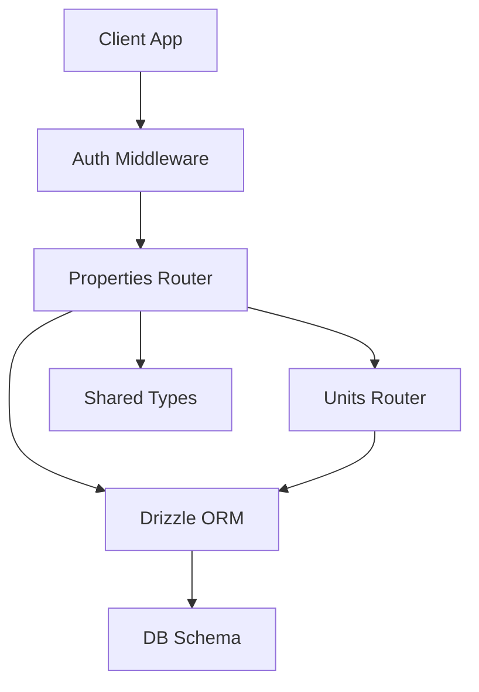
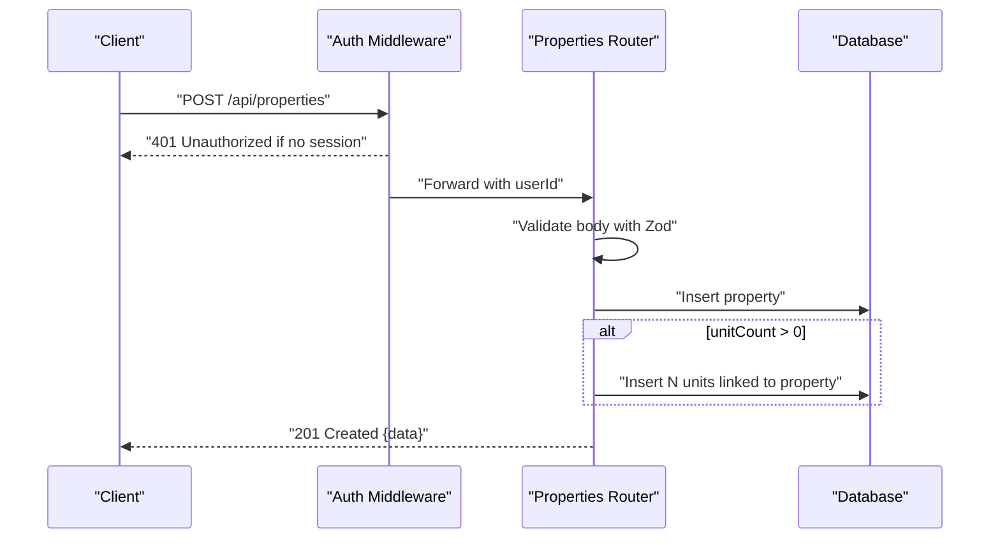
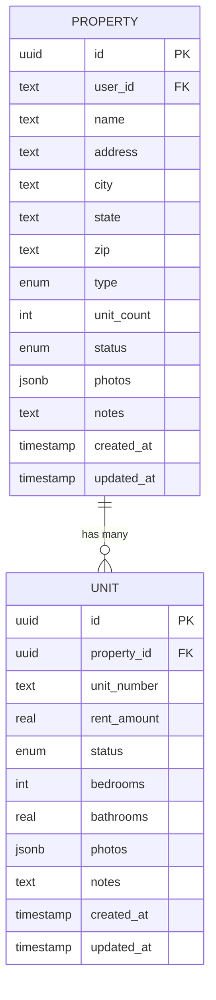
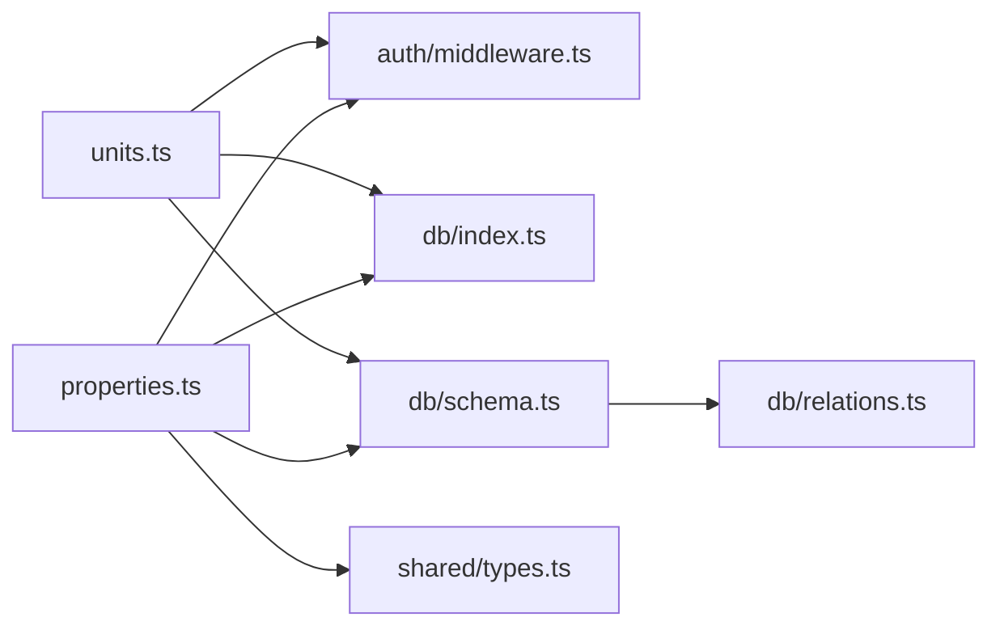

# Properties API

<cite>
**Referenced Files in This Document**
- [properties.ts](file://server/src/routes/properties.ts)
- [units.ts](file://server/src/routes/units.ts)
- [schema.ts](file://server/src/db/schema.ts)
- [relations.ts](file://server/src/db/relations.ts)
- [types.ts](file://shared/src/types.ts)
- [middleware.ts](file://server/src/auth/middleware.ts)
</cite>

## Table of Contents
1. [Introduction](#introduction)
2. [Project Structure](#project-structure)
3. [Core Components](#core-components)
4. [Architecture Overview](#architecture-overview)
5. [Detailed Component Analysis](#detailed-component-analysis)
6. [Dependency Analysis](#dependency-analysis)
7. [Performance Considerations](#performance-considerations)
8. [Troubleshooting Guide](#troubleshooting-guide)
9. [Conclusion](#conclusion)
10. [Appendices](#appendices)

## Introduction
This document provides comprehensive API documentation for the Properties management endpoints, including all HTTP methods (GET, POST, PUT, DELETE) for property CRUD operations. It details URL patterns, request parameters, response schemas, validation rules using Zod schemas, error responses, and authentication requirements. It also documents the relationship between properties and units, including automatic unit creation when specifying unitCount during property creation.

## Project Structure
The Properties API is implemented as an Express router with middleware-based authentication and Drizzle ORM for database access. The data model is defined in a schema file, and relationships are declared separately. Shared TypeScript types define the contract for clients.

**Diagram sources**
- [properties.ts:1-106](file://server/src/routes/properties.ts#L1-L106)
- [units.ts:1-123](file://server/src/routes/units.ts#L1-L123)
- [schema.ts:189-226](file://server/src/db/schema.ts#L189-L226)
- [types.ts:7-36](file://shared/src/types.ts#L7-L36)
- [middleware.ts:9-27](file://server/src/auth/middleware.ts#L9-L27)

**Section sources**
- [properties.ts:1-106](file://server/src/routes/properties.ts#L1-L106)
- [units.ts:1-123](file://server/src/routes/units.ts#L1-L123)
- [schema.ts:189-226](file://server/src/db/schema.ts#L189-L226)
- [relations.ts:37-52](file://server/src/db/relations.ts#L37-L52)
- [types.ts:7-36](file://shared/src/types.ts#L7-L36)
- [middleware.ts:9-27](file://server/src/auth/middleware.ts#L9-L27)

## Core Components
- Authentication: All routes are protected by an auth middleware that validates sessions and attaches user context to requests.
- Validation: Request bodies are validated using Zod schemas before processing.
- Data Model: Property and Unit entities are defined with enums and constraints; relationships are declared for querying nested data.
- Endpoints: Full CRUD for properties and units, with automatic unit creation on property creation based on unitCount.

**Section sources**
- [middleware.ts:9-27](file://server/src/auth/middleware.ts#L9-L27)
- [properties.ts:11-23](file://server/src/routes/properties.ts#L11-L23)
- [schema.ts:189-226](file://server/src/db/schema.ts#L189-L226)
- [relations.ts:37-52](file://server/src/db/relations.ts#L37-L52)

## Architecture Overview
The Properties API follows a layered architecture:
- Client sends authenticated requests to Express routes.
- Routes validate input via Zod, enforce ownership checks, and interact with the database through Drizzle ORM.
- Responses include standardized success payloads or structured errors.

**Diagram sources**
- [properties.ts:48-71](file://server/src/routes/properties.ts#L48-L71)
- [middleware.ts:9-27](file://server/src/auth/middleware.ts#L9-L27)

## Detailed Component Analysis

### Authentication Requirements
- All Properties endpoints require a valid session. If missing, the middleware returns a 401 Unauthorized response.
- The middleware attaches the authenticated user ID to the request for ownership checks.

**Section sources**
- [middleware.ts:9-27](file://server/src/auth/middleware.ts#L9-L27)

### Property Data Model
- Fields: id, userId, name, address, city, state, zip, type, unitCount, status, photos, notes, createdAt, updatedAt.
- Enums:
  - Type: single_family, duplex, multifamily, condo, townhouse
  - Status: active, vacant, under_renovation
- Constraints: Non-empty strings for core fields; numeric unitCount defaults to 1; timestamps auto-populated.

**Section sources**
- [schema.ts:189-208](file://server/src/db/schema.ts#L189-L208)
- [types.ts:7-22](file://shared/src/types.ts#L7-L22)

### Property Relationships
- A Property has many Units.
- When creating a property with unitCount > 0, the system automatically creates N units linked to the new property, each with default values (unitNumber as sequential string, rentAmount 0, status vacant).

**Diagram sources**
- [schema.ts:189-226](file://server/src/db/schema.ts#L189-L226)
- [relations.ts:37-52](file://server/src/db/relations.ts#L37-L52)

### Endpoints

#### GET /api/properties
- Purpose: List all properties owned by the authenticated user, including associated units.
- Query Parameters: None.
- Response:
  - Success: 200 OK with JSON object containing data array of properties with nested units.
  - Error: 401 Unauthorized if not authenticated.

**Section sources**
- [properties.ts:25-34](file://server/src/routes/properties.ts#L25-L34)

#### GET /api/properties/:id
- Purpose: Retrieve a single property by ID, including its units. Ownership is enforced.
- Path Parameters:
  - id: UUID of the property.
- Response:
  - Success: 200 OK with JSON object containing data property.
  - Not Found: 404 with message and code NOT_FOUND if property does not exist or is not owned by the user.
  - Unauthorized: 401 if not authenticated.

**Section sources**
- [properties.ts:36-46](file://server/src/routes/properties.ts#L36-L46)

#### POST /api/properties
- Purpose: Create a new property and optionally create units automatically.
- Request Body:
  - name: string (required)
  - address: string (required)
  - city: string (required)
  - state: string (required)
  - zip: string (required)
  - type: enum (single_family | duplex | multifamily | condo | townhouse)
  - unitCount: number (integer, min 1, default 1)
  - status: enum (active | vacant | under_renovation, default active)
  - notes: string (nullable, optional)
- Validation:
  - Uses Zod schema; invalid input returns 400 with VALIDATION error and flattened details.
- Behavior:
  - Creates property and inserts N units if unitCount > 0.
- Response:
  - Success: 201 Created with JSON object containing data property.
  - Validation Error: 400 with VALIDATION details.
  - Unauthorized: 401 if not authenticated.

**Section sources**
- [properties.ts:11-23](file://server/src/routes/properties.ts#L11-L23)
- [properties.ts:48-71](file://server/src/routes/properties.ts#L48-L71)

#### PUT /api/properties/:id
- Purpose: Update an existing property’s details. Only owner can update.
- Path Parameters:
  - id: UUID of the property.
- Request Body:
  - Partial fields from the create schema are allowed.
- Validation:
  - Uses partial Zod schema; invalid input returns 400 with VALIDATION error and details.
- Behavior:
  - Updates matching fields and sets updatedAt timestamp.
- Response:
  - Success: 200 OK with JSON object containing updated data property.
  - Not Found: 404 if property does not exist or is not owned by the user.
  - Validation Error: 400 with VALIDATION details.
  - Unauthorized: 401 if not authenticated.

**Section sources**
- [properties.ts:73-91](file://server/src/routes/properties.ts#L73-L91)

#### DELETE /api/properties/:id
- Purpose: Delete a property. Ownership is enforced.
- Path Parameters:
  - id: UUID of the property.
- Response:
  - Success: 200 OK with message Deleted.
  - Not Found: 404 if property does not exist or is not owned by the user.
  - Unauthorized: 401 if not authenticated.

**Section sources**
- [properties.ts:93-103](file://server/src/routes/properties.ts#L93-L103)

### Unit Management Endpoints (Related)
While the focus is on properties, units are closely related and may be managed independently.

- GET /api/units?propertyId=xxx: List units, optionally filtered by property. Filters to user-owned properties.
- GET /api/units/:id: Get a specific unit with its property.
- POST /api/units: Create a unit linked to a verified property.
- PUT /api/units/:id: Update unit details.
- DELETE /api/units/:id: Delete a unit.

These endpoints enforce ownership and use similar validation and error patterns.

**Section sources**
- [units.ts:23-50](file://server/src/routes/units.ts#L23-L50)
- [units.ts:52-65](file://server/src/routes/units.ts#L52-L65)
- [units.ts:67-82](file://server/src/routes/units.ts#L67-L82)
- [units.ts:84-105](file://server/src/routes/units.ts#L84-L105)
- [units.ts:107-120](file://server/src/routes/units.ts#L107-L120)

### Validation Rules (Zod Schemas)
- Create Property Schema:
  - name, address, city, state, zip: non-empty strings
  - type: one of the allowed property types
  - unitCount: integer >= 1, default 1
  - status: one of allowed statuses, default active
  - notes: nullable string, optional
- Update Property Schema:
  - Partial version of create schema allowing selective updates.

**Section sources**
- [properties.ts:11-23](file://server/src/routes/properties.ts#L11-L23)

### Error Responses
- 400 Validation Error:
  - message: "Validation error"
  - code: "VALIDATION"
  - details: flattened Zod error object
- 401 Unauthorized:
  - message: "Unauthorized"
  - code: "UNAUTHORIZED"
- 404 Not Found:
  - message: "Not found"
  - code: "NOT_FOUND"

**Section sources**
- [properties.ts:51-52](file://server/src/routes/properties.ts#L51-L52)
- [properties.ts:44-45](file://server/src/routes/properties.ts#L44-L45)
- [properties.ts:76-77](file://server/src/routes/properties.ts#L76-L77)
- [properties.ts:99-100](file://server/src/routes/properties.ts#L99-L100)
- [middleware.ts:18-20](file://server/src/auth/middleware.ts#L18-L20)

### Concrete Examples

#### Creating a Property with Auto-Generated Units
- Endpoint: POST /api/properties
- Request Body:
  - name: "Sunset Apartments"
  - address: "123 Main St"
  - city: "Springfield"
  - state: "IL"
  - zip: "62704"
  - type: "multifamily"
  - unitCount: 3
  - status: "active"
  - notes: "Newly acquired building"
- Behavior:
  - Creates property and three units with unitNumber "1", "2", "3", rentAmount 0, status "vacant".
- Response:
  - 201 Created with data property.

**Section sources**
- [properties.ts:48-71](file://server/src/routes/properties.ts#L48-L71)

#### Updating Property Details
- Endpoint: PUT /api/properties/:id
- Request Body:
  - status: "under_renovation"
  - notes: "Renovation in progress"
- Behavior:
  - Updates specified fields and sets updatedAt timestamp.
- Response:
  - 200 OK with updated data property.

**Section sources**
- [properties.ts:73-91](file://server/src/routes/properties.ts#L73-L91)

#### Retrieving Property Listings with Associated Units
- Endpoint: GET /api/properties
- Response:
  - 200 OK with data array of properties, each including nested units.

**Section sources**
- [properties.ts:25-34](file://server/src/routes/properties.ts#L25-L34)

## Dependency Analysis
- Routes depend on:
  - Auth middleware for session validation and user context.
  - Drizzle ORM for database queries and mutations.
  - Zod for request validation.
  - Shared types for client contracts.
- Database schema defines tables and constraints.
- Relations enable nested queries (e.g., property with units).

**Diagram sources**
- [properties.ts:1-106](file://server/src/routes/properties.ts#L1-L106)
- [units.ts:1-123](file://server/src/routes/units.ts#L1-L123)
- [schema.ts:189-226](file://server/src/db/schema.ts#L189-L226)
- [relations.ts:37-52](file://server/src/db/relations.ts#L37-L52)
- [middleware.ts:9-27](file://server/src/auth/middleware.ts#L9-L27)
- [types.ts:7-36](file://shared/src/types.ts#L7-L36)

**Section sources**
- [properties.ts:1-106](file://server/src/routes/properties.ts#L1-L106)
- [units.ts:1-123](file://server/src/routes/units.ts#L1-L123)
- [schema.ts:189-226](file://server/src/db/schema.ts#L189-L226)
- [relations.ts:37-52](file://server/src/db/relations.ts#L37-L52)
- [middleware.ts:9-27](file://server/src/auth/middleware.ts#L9-L27)
- [types.ts:7-36](file://shared/src/types.ts#L7-L36)

## Performance Considerations
- Batch Unit Creation: When unitCount > 0, units are inserted in a single batch operation to reduce database round trips.
- Nested Queries: Using with: { units: true } leverages relational queries to fetch properties with units efficiently.
- Indexing: Ensure indexes on frequently queried fields like userId and propertyId for performance at scale.
- Validation: Zod validation occurs server-side to prevent unnecessary database writes with invalid data.

[No sources needed since this section provides general guidance]

## Troubleshooting Guide
- 401 Unauthorized:
  - Ensure a valid session is provided in request headers.
  - Check that the auth middleware is correctly mounted and session handling is configured.
- 400 Validation Error:
  - Review the details field in the response to identify which fields failed validation.
  - Ensure required fields are present and enums match allowed values.
- 404 Not Found:
  - Verify the resource exists and belongs to the authenticated user.
  - Check ownership logic in route handlers.

**Section sources**
- [middleware.ts:18-20](file://server/src/auth/middleware.ts#L18-L20)
- [properties.ts:51-52](file://server/src/routes/properties.ts#L51-L52)
- [properties.ts:44-45](file://server/src/routes/properties.ts#L44-L45)

## Conclusion
The Properties API provides a robust, secure, and well-validated interface for managing rental properties and their units. It enforces ownership, supports automatic unit generation, and integrates seamlessly with shared types and database relations. Clients can confidently perform CRUD operations while relying on consistent error handling and authentication.

[No sources needed since this section summarizes without analyzing specific files]

## Appendices

### API Response Schemas
- Success Response:
  - data: Property or Unit object
- Error Response:
  - message: string
  - code: string
  - details: Record<string, unknown> (for validation errors)

**Section sources**
- [types.ts:238-242](file://shared/src/types.ts#L238-L242)

### Property and Unit Field Reference
- Property:
  - id: string (UUID)
  - userId: string
  - name: string
  - address: string
  - city: string
  - state: string
  - zip: string
  - type: enum
  - unitCount: number
  - status: enum
  - photos: string[]
  - notes: string | null
  - createdAt: string
  - updatedAt: string
- Unit:
  - id: string (UUID)
  - propertyId: string
  - unitNumber: string
  - rentAmount: number
  - status: enum
  - bedrooms: number | null
  - bathrooms: number | null
  - photos: string[]
  - notes: string | null
  - createdAt: string
  - updatedAt: string

**Section sources**
- [types.ts:7-36](file://shared/src/types.ts#L7-L36)