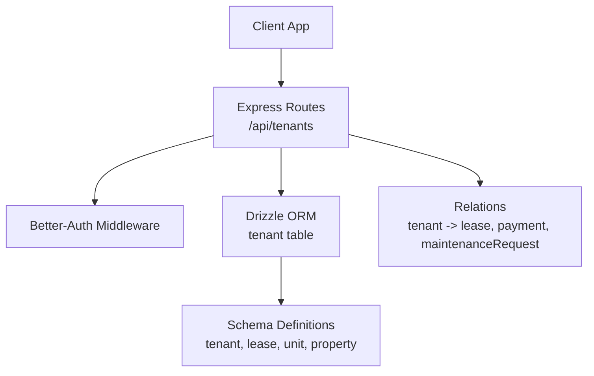
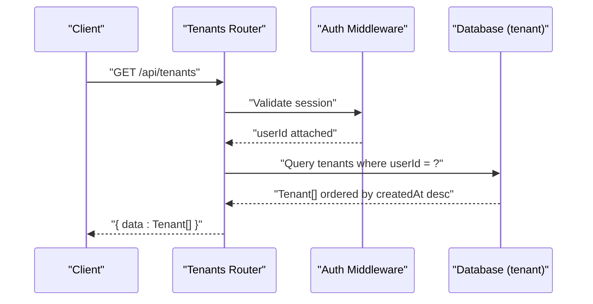
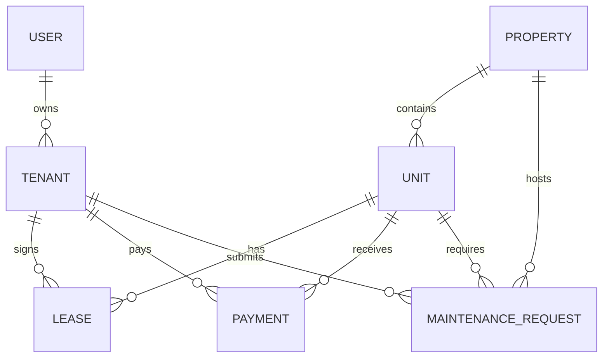
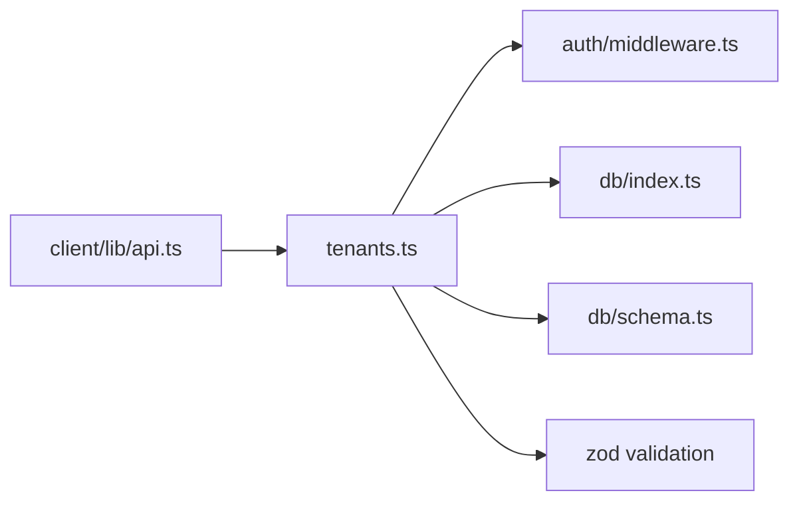

# Tenants API

<cite>
**Referenced Files in This Document**
- [tenants.ts](file://server/src/routes/tenants.ts)
- [schema.ts](file://server/src/db/schema.ts)
- [relations.ts](file://server/src/db/relations.ts)
- [middleware.ts](file://server/src/auth/middleware.ts)
- [api.ts](file://client/src/lib/api.ts)
- [leases.ts](file://server/src/routes/leases.ts)
- [properties.ts](file://server/src/routes/properties.ts)
- [types.ts](file://shared/src/types.ts)
</cite>

## Table of Contents
1. [Introduction](#introduction)
2. [Project Structure](#project-structure)
3. [Core Components](#core-components)
4. [Architecture Overview](#architecture-overview)
5. [Detailed Component Analysis](#detailed-component-analysis)
6. [Dependency Analysis](#dependency-analysis)
7. [Performance Considerations](#performance-considerations)
8. [Troubleshooting Guide](#troubleshooting-guide)
9. [Conclusion](#conclusion)
10. [Appendices](#appendices)

## Introduction
This document provides detailed API documentation for tenant management endpoints, including HTTP methods, URL patterns, request/response schemas, validation rules, authentication and authorization requirements, error handling patterns, and examples for common operations such as registration, profile updates, and listing tenants with property associations. It also documents the relationships between tenants, leases, and properties, including data integrity constraints and cascading behaviors.

## Project Structure
The tenant-related functionality is implemented on the server side using Express routes, Drizzle ORM schema definitions, and Better-Auth middleware for session-based authentication. The client uses a typed API client to call these endpoints.

**Diagram sources**
- [tenants.ts:1-83](file://server/src/routes/tenants.ts#L1-L83)
- [middleware.ts:1-45](file://server/src/auth/middleware.ts#L1-L45)
- [schema.ts:228-266](file://server/src/db/schema.ts#L228-L266)
- [relations.ts:54-66](file://server/src/db/relations.ts#L54-L66)

**Section sources**
- [tenants.ts:1-83](file://server/src/routes/tenants.ts#L1-L83)
- [schema.ts:228-266](file://server/src/db/schema.ts#L228-L266)
- [relations.ts:54-66](file://server/src/db/relations.ts#L54-L66)
- [middleware.ts:1-45](file://server/src/auth/middleware.ts#L1-L45)

## Core Components
- Tenant CRUD endpoints under /api/tenants with full authentication and per-user scoping.
- Validation via Zod schema for create/update payloads.
- Data model defined in Drizzle schema with timestamps and user ownership.
- Relationships to leases, payments, and maintenance requests are declared for querying and referential integrity.

Key responsibilities:
- Authentication: All tenant endpoints require an authenticated session; unauthorized requests receive a 401 response.
- Authorization: Endpoints scope queries by the authenticated user’s ID to ensure tenants belong to the requester.
- Validation: Create requires required fields; update accepts partial fields.

**Section sources**
- [tenants.ts:8-20](file://server/src/routes/tenants.ts#L8-L20)
- [tenants.ts:22-80](file://server/src/routes/tenants.ts#L22-L80)
- [schema.ts:228-245](file://server/src/db/schema.ts#L228-L245)
- [middleware.ts:9-27](file://server/src/auth/middleware.ts#L9-L27)

## Architecture Overview
The tenant API follows a standard RESTful pattern with JSON payloads and consistent error responses. Requests flow through authentication middleware, which validates sessions and attaches user context. Route handlers validate inputs, enforce ownership, and interact with the database via Drizzle ORM. Responses wrap data in a uniform envelope.

**Diagram sources**
- [tenants.ts:22-30](file://server/src/routes/tenants.ts#L22-L30)
- [middleware.ts:9-27](file://server/src/auth/middleware.ts#L9-L27)

**Section sources**
- [tenants.ts:22-30](file://server/src/routes/tenants.ts#L22-L30)
- [middleware.ts:9-27](file://server/src/auth/middleware.ts#L9-L27)

## Detailed Component Analysis

### Authentication and Authorization
- All tenant endpoints are protected by session-based authentication. If no valid session is present, the middleware returns a 401 Unauthorized response with a standardized error shape.
- Each endpoint scopes data to the authenticated user’s ID, ensuring tenants can only be accessed by their owner.

Error behavior:
- 401 Unauthorized when session is missing or invalid.

**Section sources**
- [middleware.ts:9-27](file://server/src/auth/middleware.ts#L9-L27)
- [tenants.ts:8-9](file://server/src/routes/tenants.ts#L8-L9)

### Tenant Data Model
The tenant entity includes personal information, contact details, emergency contacts, employment information, notes, and timestamps. Ownership is enforced via a user reference.

Fields:
- id: UUID primary key
- userId: Owner reference (cascading delete)
- firstName: Required string
- lastName: Required string
- email: Optional string
- phone: Optional string
- emergencyContactName: Optional string
- emergencyContactPhone: Optional string
- employer: Optional string
- notes: Optional string
- createdAt: Timestamp
- updatedAt: Timestamp

Relationships:
- One-to-many leases
- One-to-many payments
- One-to-many maintenance requests

Constraints:
- onDelete cascade on user reference
- Not-null constraints on core identity fields

**Section sources**
- [schema.ts:228-245](file://server/src/db/schema.ts#L228-L245)
- [relations.ts:54-60](file://server/src/db/relations.ts#L54-L60)

### Tenant Endpoints

#### List Tenants
- Method: GET
- URL: /api/tenants
- Authentication: Required
- Authorization: Returns tenants owned by the authenticated user
- Response: Array of tenant objects wrapped in { data }
- Ordering: Newest first (createdAt descending)

Example response envelope:
{
  "data": [ /* Tenant[] */ ]
}

**Section sources**
- [tenants.ts:22-30](file://server/src/routes/tenants.ts#L22-L30)

#### Get Tenant by ID
- Method: GET
- URL: /api/tenants/:id
- Authentication: Required
- Authorization: Ensures tenant belongs to the authenticated user
- Success Response: Single tenant object wrapped in { data }
- Error: 404 Not Found if tenant does not exist or is not owned

Error response envelope:
{
  "message": "Not found",
  "code": "NOT_FOUND"
}

**Section sources**
- [tenants.ts:32-40](file://server/src/routes/tenants.ts#L32-L40)

#### Create Tenant
- Method: POST
- URL: /api/tenants
- Authentication: Required
- Request body schema (Zod validated):
  - firstName: string, required
  - lastName: string, required
  - email: string or null, optional
  - phone: string or null, optional
  - emergencyContactName: string or null, optional
  - emergencyContactPhone: string or null, optional
  - employer: string or null, optional
  - notes: string or null, optional
- Success Response: Created tenant object wrapped in { data }, status 201
- Validation Errors: 400 with structured details

Validation error envelope:
{
  "message": "Validation error",
  "code": "VALIDATION",
  "details": { ... }
}

**Section sources**
- [tenants.ts:11-20](file://server/src/routes/tenants.ts#L11-L20)
- [tenants.ts:42-50](file://server/src/routes/tenants.ts#L42-L50)

#### Update Tenant
- Method: PUT
- URL: /api/tenants/:id
- Authentication: Required
- Authorization: Ensures tenant belongs to the authenticated user
- Request body schema: Partial of create schema (any subset allowed)
- Success Response: Updated tenant object wrapped in { data }
- Validation Errors: 400 with structured details
- Not Found: 404 if tenant does not exist or is not owned

**Section sources**
- [tenants.ts:52-69](file://server/src/routes/tenants.ts#L52-L69)

#### Delete Tenant
- Method: DELETE
- URL: /api/tenants/:id
- Authentication: Required
- Authorization: Ensures tenant belongs to the authenticated user
- Success Response: { message: "Deleted" }
- Not Found: 404 if tenant does not exist or is not owned

**Section sources**
- [tenants.ts:71-80](file://server/src/routes/tenants.ts#L71-L80)

### Request and Response Schemas

Tenant object (response):
- id: string (UUID)
- userId: string
- firstName: string
- lastName: string
- email: string | null
- phone: string | null
- emergencyContactName: string | null
- emergencyContactPhone: string | null
- employer: string | null
- notes: string | null
- createdAt: string (ISO timestamp)
- updatedAt: string (ISO timestamp)

Create request body:
- firstName: string (required)
- lastName: string (required)
- email: string | null (optional)
- phone: string | null (optional)
- emergencyContactName: string | null (optional)
- emergencyContactPhone: string | null (optional)
- employer: string | null (optional)
- notes: string | null (optional)

Update request body:
- Any subset of create fields (partial)

Response envelopes:
- Success: { data: Tenant | Tenant[] }
- Not Found: { message: "Not found", code: "NOT_FOUND" }
- Validation Error: { message: "Validation error", code: "VALIDATION", details: {...} }
- Unauthorized: { message: "Unauthorized", code: "UNAUTHORIZED" }

**Section sources**
- [schema.ts:228-245](file://server/src/db/schema.ts#L228-L245)
- [tenants.ts:11-20](file://server/src/routes/tenants.ts#L11-L20)
- [tenants.ts:22-80](file://server/src/routes/tenants.ts#L22-L80)
- [middleware.ts:9-27](file://server/src/auth/middleware.ts#L9-L27)

### Examples

- Tenant Registration (Create)
  - Endpoint: POST /api/tenants
  - Body: Provide firstName, lastName, and any optional fields
  - Expected: 201 with created tenant in { data }

- Profile Update (Partial Update)
  - Endpoint: PUT /api/tenants/:id
  - Body: Send only fields to update (e.g., email, phone)
  - Expected: 200 with updated tenant in { data }

- Tenant Listing with Property Associations
  - While the tenant list endpoint returns tenant records, you can associate tenants with properties via leases. Use the leases endpoints to retrieve leases that include tenant and unit data, then map units to properties.
  - Example flow:
    - GET /api/leases to get leases with unit and tenant
    - For each lease, resolve unit to property via unit.propertyId
    - Filter results to your user’s properties

Note: The client calls these endpoints using an API client that handles credentials and errors.

**Section sources**
- [tenants.ts:42-69](file://server/src/routes/tenants.ts#L42-L69)
- [leases.ts:23-46](file://server/src/routes/leases.ts#L23-L46)
- [api.ts:26-54](file://client/src/lib/api.ts#L26-L54)

### Relationships Between Tenants, Leases, and Properties
- Tenant to Lease: One-to-many; a tenant can have multiple leases. Deleting a tenant cascades to related leases.
- Lease to Unit: Many-to-one; a lease references a specific unit. Deleting a unit cascades to related leases.
- Unit to Property: Many-to-one; a unit belongs to a property. Deleting a property cascades to related units.
- Payment and Maintenance: Both reference tenant and unit/property, enabling reporting and history.

Data integrity constraints:
- Foreign keys enforce referential integrity.
- Cascading deletes propagate from parent entities (user, property, unit) to child entities (tenant, lease, payment, etc.).
- Status fields maintain state consistency (e.g., unit status changes when leases are created/updated).

**Diagram sources**
- [schema.ts:191-266](file://server/src/db/schema.ts#L191-L266)
- [relations.ts:37-66](file://server/src/db/relations.ts#L37-L66)

**Section sources**
- [schema.ts:191-266](file://server/src/db/schema.ts#L191-L266)
- [relations.ts:37-66](file://server/src/db/relations.ts#L37-L66)

## Dependency Analysis
- Tenants route depends on:
  - Authentication middleware for session validation and user context
  - Drizzle ORM for database access
  - Zod for input validation
  - Tenant schema definition for table structure
  - Relations for potential joins and queries

- Client API client:
  - Uses fetch with credentials included
  - Handles 401 by redirecting to login
  - Wraps errors into a consistent error shape

**Diagram sources**
- [tenants.ts:1-83](file://server/src/routes/tenants.ts#L1-L83)
- [middleware.ts:1-45](file://server/src/auth/middleware.ts#L1-L45)
- [api.ts:1-82](file://client/src/lib/api.ts#L1-L82)

**Section sources**
- [tenants.ts:1-83](file://server/src/routes/tenants.ts#L1-L83)
- [api.ts:1-82](file://client/src/lib/api.ts#L1-L82)

## Performance Considerations
- Indexing: Ensure indexes on frequently queried columns such as userId, tenant.id, lease.tenantId, lease.unitId, and unit.propertyId to optimize lookups and joins.
- Query optimization: When listing tenants, avoid unnecessary joins unless needed. For tenant listings with property associations, consider fetching leases separately and mapping in application logic to reduce payload size.
- Pagination: Current tenant listing does not implement pagination. For large datasets, add pagination parameters (page, pageSize) to limit response size and improve performance.
- Caching: Consider caching tenant lists per user for read-heavy scenarios to reduce database load.

[No sources needed since this section provides general guidance]

## Troubleshooting Guide
Common issues and resolutions:
- 401 Unauthorized:
  - Cause: Missing or invalid session
  - Resolution: Ensure the client sends cookies with credentials and that the session is active. The client redirects to login on 401.

- 404 Not Found:
  - Cause: Tenant does not exist or does not belong to the authenticated user
  - Resolution: Verify tenant ID and ownership checks. Ensure the tenant was created under the current user.

- 400 Validation Error:
  - Cause: Invalid or missing required fields in create/update
  - Resolution: Check the validation error details in the response and correct the payload.

- Cascading Deletes:
  - Deleting a tenant will cascade to related leases and payments depending on configuration. Confirm business logic before deletion.

- Ownership Scoping:
  - All tenant endpoints scope by userId. If you cannot access a tenant, verify it belongs to the authenticated user.

**Section sources**
- [middleware.ts:9-27](file://server/src/auth/middleware.ts#L9-L27)
- [tenants.ts:32-80](file://server/src/routes/tenants.ts#L32-L80)
- [api.ts:39-54](file://client/src/lib/api.ts#L39-L54)

## Conclusion
The tenant management API provides secure, user-scoped CRUD operations with robust validation and consistent error handling. The data model supports comprehensive tenant profiles and integrates with leases, payments, and maintenance workflows. By following the documented endpoints and schemas, clients can reliably manage tenants and associate them with properties through leases while maintaining data integrity and security.

[No sources needed since this section summarizes without analyzing specific files]

## Appendices

### Tenant Data Model Reference
- Fields and types align with the shared type definitions and database schema.
- Timestamps are managed automatically by the schema defaults.

**Section sources**
- [schema.ts:228-245](file://server/src/db/schema.ts#L228-L245)
- [types.ts:40-53](file://shared/src/types.ts#L40-L53)

### Lease Integration Notes
- Creating a lease sets the unit status to occupied.
- Updating a lease to terminated or expired reverts the unit status to vacant.
- Leases include tenant and unit details for enriched responses.

**Section sources**
- [leases.ts:88-136](file://server/src/routes/leases.ts#L88-L136)

### Property Association Workflow
- To list tenants associated with properties:
  - Retrieve leases for your user’s properties
  - Map leases to tenants and units
  - Resolve units to properties for association context

**Section sources**
- [leases.ts:23-46](file://server/src/routes/leases.ts#L23-L46)
- [properties.ts:25-34](file://server/src/routes/properties.ts#L25-L34)