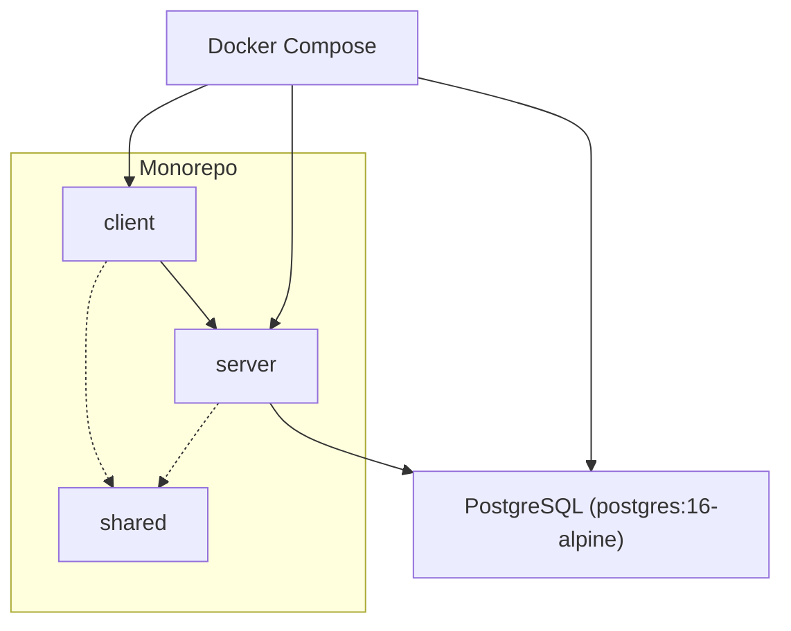
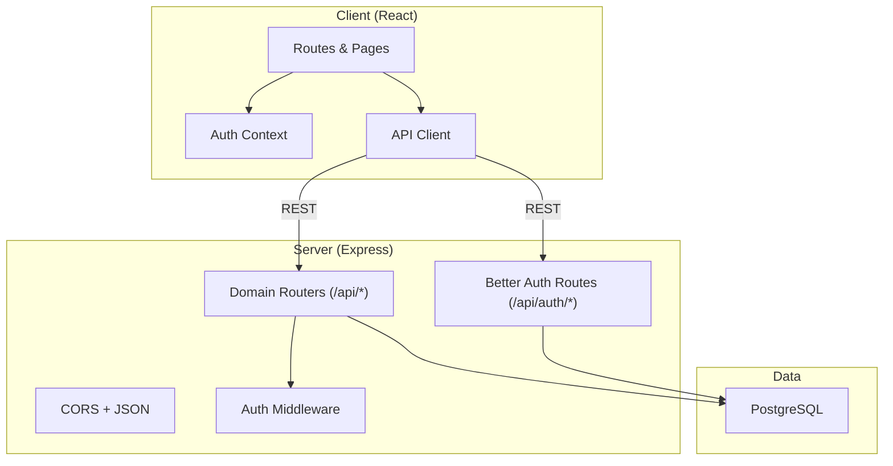
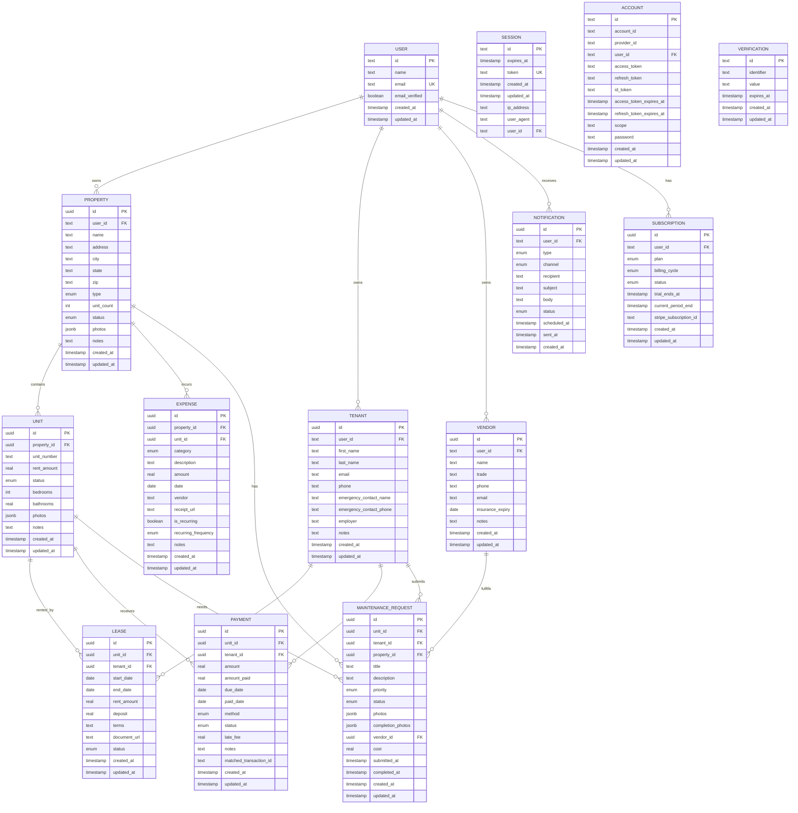
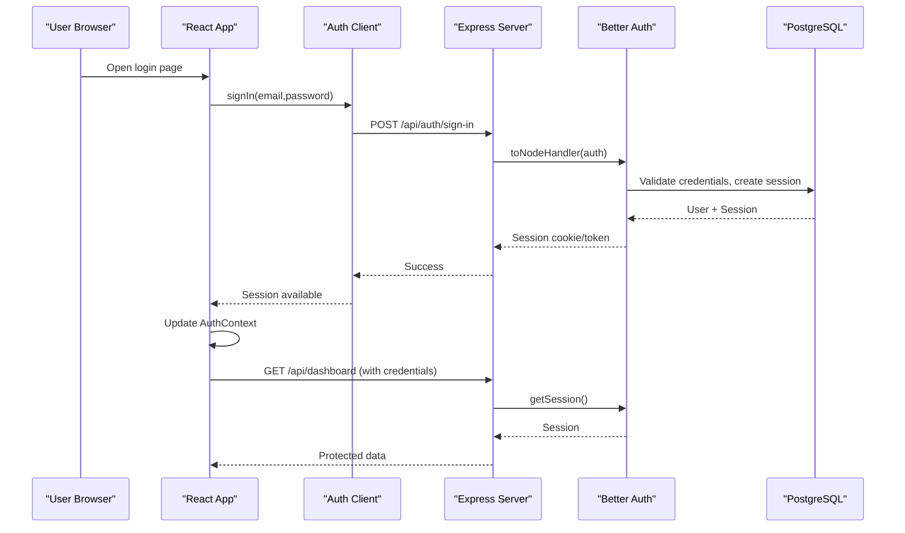
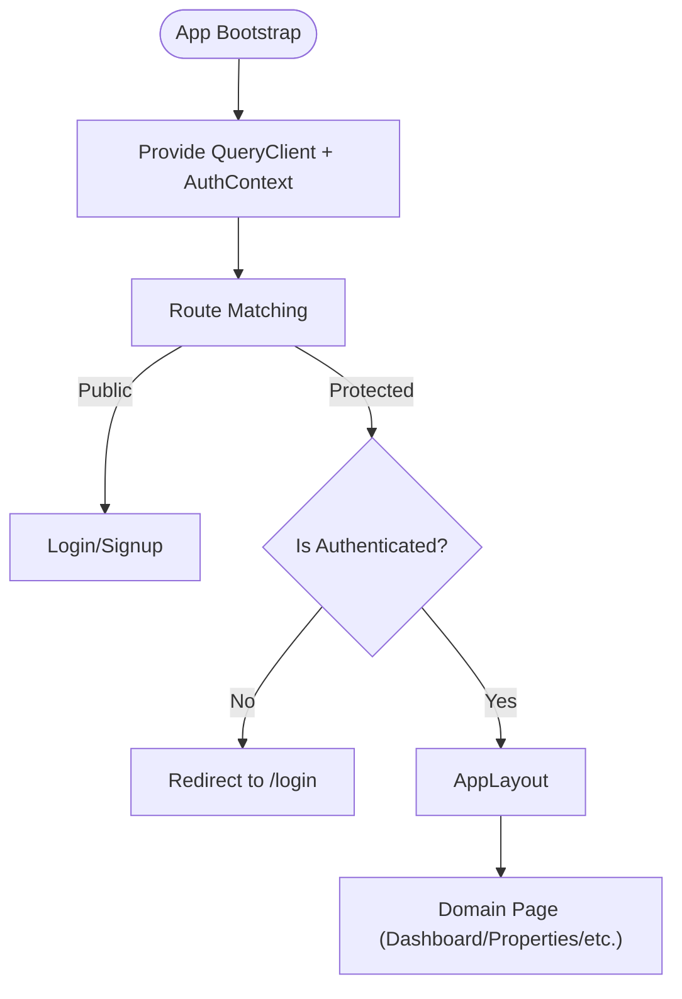
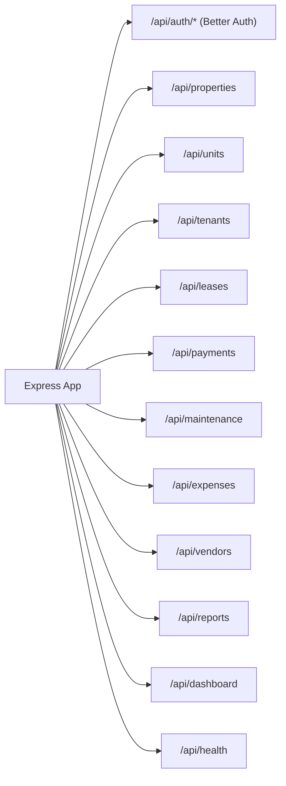
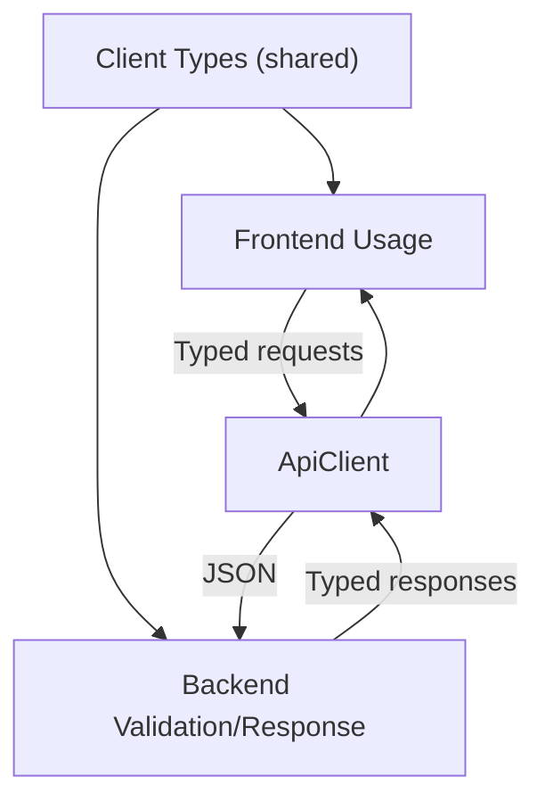
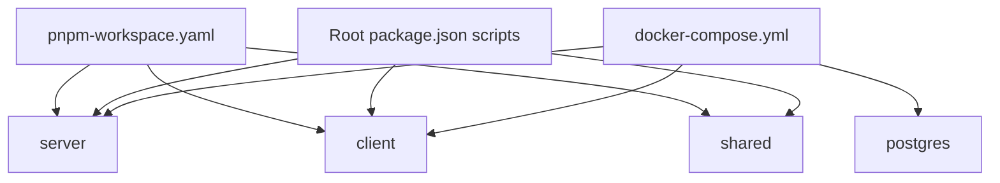

# Architecture Overview

<cite>
**Referenced Files in This Document**
- [package.json](file://package.json)
- [pnpm-workspace.yaml](file://pnpm-workspace.yaml)
- [docker-compose.yml](file://docker-compose.yml)
- [server/src/index.ts](file://server/src/index.ts)
- [server/src/auth/index.ts](file://server/src/auth/index.ts)
- [server/src/auth/middleware.ts](file://server/src/auth/middleware.ts)
- [server/src/db/index.ts](file://server/src/db/index.ts)
- [server/src/db/schema.ts](file://server/src/db/schema.ts)
- [shared/src/types.ts](file://shared/src/types.ts)
- [client/src/main.tsx](file://client/src/main.tsx)
- [client/src/App.tsx](file://client/src/App.tsx)
- [client/src/contexts/auth-context.tsx](file://client/src/contexts/auth-context.tsx)
- [client/src/lib/api.ts](file://client/src/lib/api.ts)
- [client/src/lib/auth-client.ts](file://client/src/lib/auth-client.ts)
</cite>

## Table of Contents
1. Introduction
2. Project Structure
3. Core Components
4. Architecture Overview
5. Detailed Component Analysis
6. Dependency Analysis
7. Performance Considerations
8. Troubleshooting Guide
9. Conclusion

## Introduction
RentLite is a full-stack property management application for small landlords. It uses a monorepo with separate client, server, and shared packages to provide a clean separation of concerns while enabling end-to-end type safety. The frontend is a React application that communicates with an Express.js backend via REST APIs. Authentication is handled by Better Auth with JWT-based sessions stored in PostgreSQL using Drizzle ORM. Infrastructure is containerized with Docker Compose for local development and consistent deployment.

## Project Structure
The repository is organized as a pnpm workspace containing three primary packages:
- client: React + Vite frontend with routing, context-based auth state, and API client utilities
- server: Express.js API with domain routes, Better Auth integration, and Drizzle ORM database access
- shared: TypeScript types shared between client and server to ensure end-to-end type safety

**Diagram sources**
- [pnpm-workspace.yaml:1-5](file://pnpm-workspace.yaml#L1-L5)
- [docker-compose.yml:1-64](file://docker-compose.yml#L1-L64)

**Section sources**
- [pnpm-workspace.yaml:1-5](file://pnpm-workspace.yaml#L1-L5)
- [package.json:1-21](file://package.json#L1-L21)

## Core Components
- Client entrypoint initializes React Query, Toaster notifications, and the authentication context provider before rendering the app shell and routes.
- Server bootstraps Express with CORS, JSON parsing, mounts Better Auth routes under /api/auth/*, and registers domain routers under /api/* plus a health endpoint.
- Shared package exports TypeScript types used across client and server for consistent contracts.

Key responsibilities:
- Frontend: Routing, protected routes, auth context, typed API calls, UI components
- Backend: Domain-scoped routes, session middleware, DB access via Drizzle, email and integrations hooks
- Shared: Domain models, enums, API response shapes

**Section sources**
- [client/src/main.tsx:1-29](file://client/src/main.tsx#L1-L29)
- [server/src/index.ts:1-59](file://server/src/index.ts#L1-L59)
- [shared/src/types.ts:1-251](file://shared/src/types.ts#L1-L251)

## Architecture Overview
The system follows a layered architecture:
- Presentation layer: React SPA with TanStack Query for data fetching and caching
- API layer: Express routes grouped by domain (properties, tenants, leases, payments, maintenance, expenses, vendors, reports, dashboard)
- Persistence layer: PostgreSQL accessed through Drizzle ORM with strongly-typed schema and relations
- Authentication: Better Auth provides session management and route protection; client uses the Better Auth React client

**Diagram sources**
- [server/src/index.ts:19-44](file://server/src/index.ts#L19-L44)
- [server/src/auth/middleware.ts:8-27](file://server/src/auth/middleware.ts#L8-L27)
- [server/src/db/index.ts:1-11](file://server/src/db/index.ts#L1-L11)
- [client/src/lib/api.ts:26-54](file://client/src/lib/api.ts#L26-L54)

## Detailed Component Analysis

### Database Design with Drizzle ORM
The database schema defines core entities for property management:
- user, session, account, verification tables managed by Better Auth
- property, unit, tenant, lease, payment, maintenance_request, expense, vendor, notification, subscription

Relationships:
- user 1..* property, tenant, vendor, notification, subscription
- property 1..* unit, expense, maintenance_request
- unit 1..* lease, payment, maintenance_request
- tenant 1..* lease, payment, maintenance_request
- vendor 1..* maintenance_request

**Diagram sources**
- [server/src/db/schema.ts:139-403](file://server/src/db/schema.ts#L139-L403)

**Section sources**
- [server/src/db/schema.ts:1-403](file://server/src/db/schema.ts#L1-L403)
- [server/src/db/index.ts:1-11](file://server/src/db/index.ts#L1-L11)

### Authentication System (Better Auth + JWT Sessions)
- Server configures Better Auth with a Drizzle adapter and email/password flow, sets session lifetime and trusted origins from environment variables.
- Express mounts Better Auth handlers at /api/auth/* and exposes optional and required auth middleware to protect routes.
- Client uses the Better Auth React client to sign in/out and retrieve sessions, exposing them through a React context for global auth state.

**Diagram sources**
- [server/src/auth/index.ts:1-23](file://server/src/auth/index.ts#L1-L23)
- [server/src/auth/middleware.ts:1-45](file://server/src/auth/middleware.ts#L1-L45)
- [client/src/lib/auth-client.ts:1-13](file://client/src/lib/auth-client.ts#L1-L13)
- [client/src/contexts/auth-context.tsx:1-38](file://client/src/contexts/auth-context.tsx#L1-L38)

**Section sources**
- [server/src/auth/index.ts:1-23](file://server/src/auth/index.ts#L1-L23)
- [server/src/auth/middleware.ts:1-45](file://server/src/auth/middleware.ts#L1-L45)
- [client/src/lib/auth-client.ts:1-13](file://client/src/lib/auth-client.ts#L1-L13)
- [client/src/contexts/auth-context.tsx:1-38](file://client/src/contexts/auth-context.tsx#L1-L38)

### Client-Side Architecture (React + Context + Routing)
- Application bootstrap wraps the app with QueryClientProvider and AuthProvider, enabling global data caching and authenticated state.
- Routing uses wouter with protected routes that redirect unauthenticated users to login and render pages within AppLayout.
- Pages are modular per domain (Dashboard, Properties, Tenants, Payments, Maintenance, Expenses, Reports).

**Diagram sources**
- [client/src/main.tsx:1-29](file://client/src/main.tsx#L1-L29)
- [client/src/App.tsx:1-78](file://client/src/App.tsx#L1-L78)

**Section sources**
- [client/src/main.tsx:1-29](file://client/src/main.tsx#L1-L29)
- [client/src/App.tsx:1-78](file://client/src/App.tsx#L1-L78)

### Backend API Design (Express Routes by Domain)
- Central server file configures CORS, JSON parsing, mounts Better Auth routes, and registers domain routers under /api/{domain}.
- Each domain router encapsulates CRUD operations for its entity (e.g., properties, units, tenants, leases, payments, maintenance, expenses, vendors, reports, dashboard).
- Health check endpoint supports service readiness probes.

**Diagram sources**
- [server/src/index.ts:19-50](file://server/src/index.ts#L19-L50)

**Section sources**
- [server/src/index.ts:1-59](file://server/src/index.ts#L1-L59)

### End-to-End Type Safety
- Shared package exports domain types, enums, and API response shapes used by both client and server to maintain consistency.
- Client API client performs fetch with credentials and handles unauthorized responses by redirecting to login.

**Diagram sources**
- [shared/src/types.ts:1-251](file://shared/src/types.ts#L1-L251)
- [client/src/lib/api.ts:1-82](file://client/src/lib/api.ts#L1-L82)

**Section sources**
- [shared/src/types.ts:1-251](file://shared/src/types.ts#L1-L251)
- [client/src/lib/api.ts:1-82](file://client/src/lib/api.ts#L1-L82)

## Dependency Analysis
- Workspace configuration declares shared, server, and client packages.
- Root scripts orchestrate build, dev, and database tasks across packages.
- Docker Compose defines services for Postgres, server, and client with environment variables and volume mounts.

**Diagram sources**
- [pnpm-workspace.yaml:1-5](file://pnpm-workspace.yaml#L1-L5)
- [package.json:1-21](file://package.json#L1-L21)
- [docker-compose.yml:1-64](file://docker-compose.yml#L1-L64)

**Section sources**
- [pnpm-workspace.yaml:1-5](file://pnpm-workspace.yaml#L1-L5)
- [package.json:1-21](file://package.json#L1-L21)
- [docker-compose.yml:1-64](file://docker-compose.yml#L1-L64)

## Performance Considerations
- Use TanStack Query with sensible stale times and minimal retries to reduce network load and improve perceived performance.
- Keep request payloads reasonable; server accepts up to 10mb JSON bodies to support media uploads if needed.
- Leverage PostgreSQL indexes on foreign keys and frequently filtered columns (e.g., user_id, property_id, unit_id) to optimize queries.
- Consider pagination and filtering on list endpoints to avoid large result sets.
- Cache static assets and enable compression in production deployments.

[No sources needed since this section provides general guidance]

## Troubleshooting Guide
Common issues and strategies:
- Unauthorized access: Client redirects to login on 401 responses; verify credentials and session cookies are included in requests.
- CORS errors: Ensure CLIENT_URL matches the browser origin and server CORS settings allow credentials.
- Database connectivity: Confirm DATABASE_URL and Postgres service health; use healthcheck in compose to wait for readiness.
- Environment misconfiguration: Verify all required env vars (BETTER_AUTH_SECRET, BETTER_AUTH_URL, RESEND_API_KEY, etc.) are set in docker-compose or host environment.

Operational checks:
- Health endpoint returns status ok for service readiness.
- Use db:studio and db:push scripts to inspect and sync schema during development.

**Section sources**
- [client/src/lib/api.ts:26-54](file://client/src/lib/api.ts#L26-L54)
- [server/src/index.ts:19-50](file://server/src/index.ts#L19-L50)
- [docker-compose.yml:1-64](file://docker-compose.yml#L1-L64)

## Conclusion
RentLite’s architecture separates concerns across client, server, and shared packages while maintaining end-to-end type safety. Better Auth secures the application with JWT sessions, and Drizzle ORM provides a robust, type-safe data layer over PostgreSQL. The modular domain-based API design scales well as features grow. Containerization with Docker Compose simplifies local development and deployment consistency. Security patterns include CORS, credential handling, and session validation, while error handling is centralized in the client API layer and server middleware.

[No sources needed since this section summarizes without analyzing specific files]