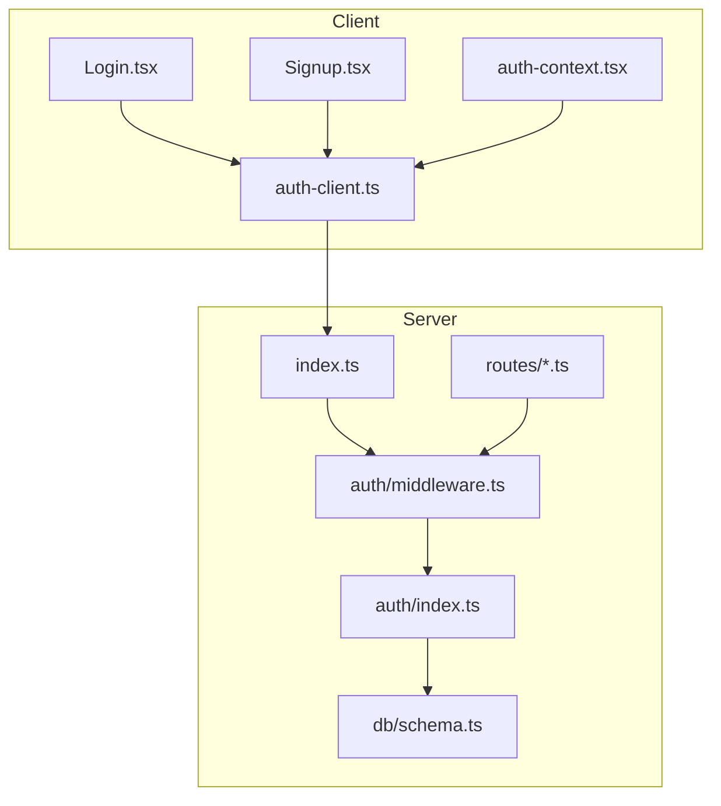
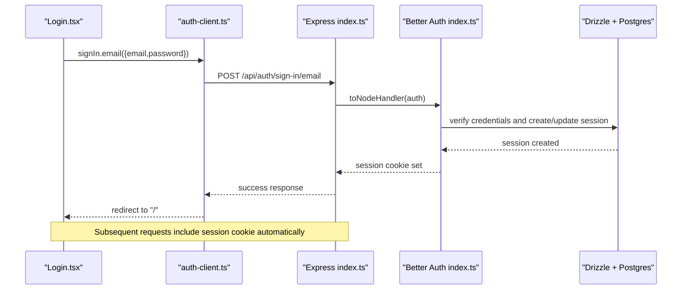
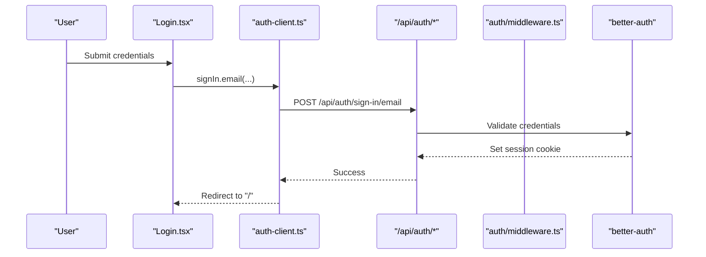
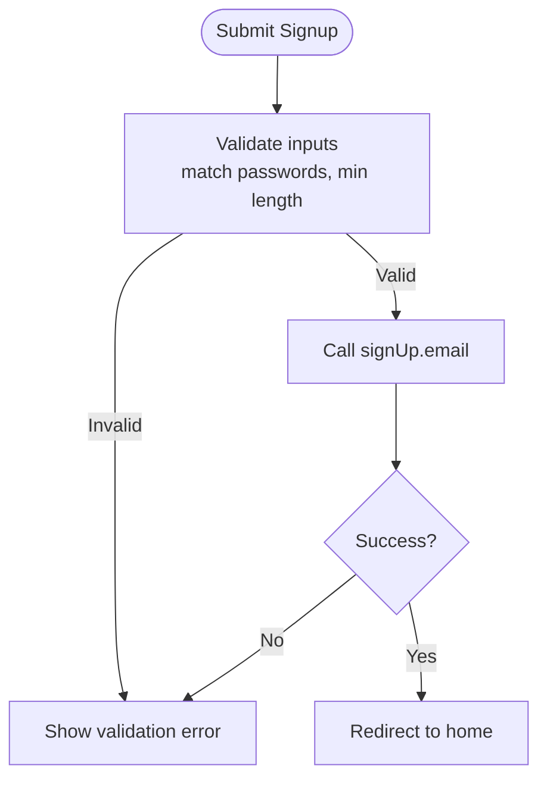
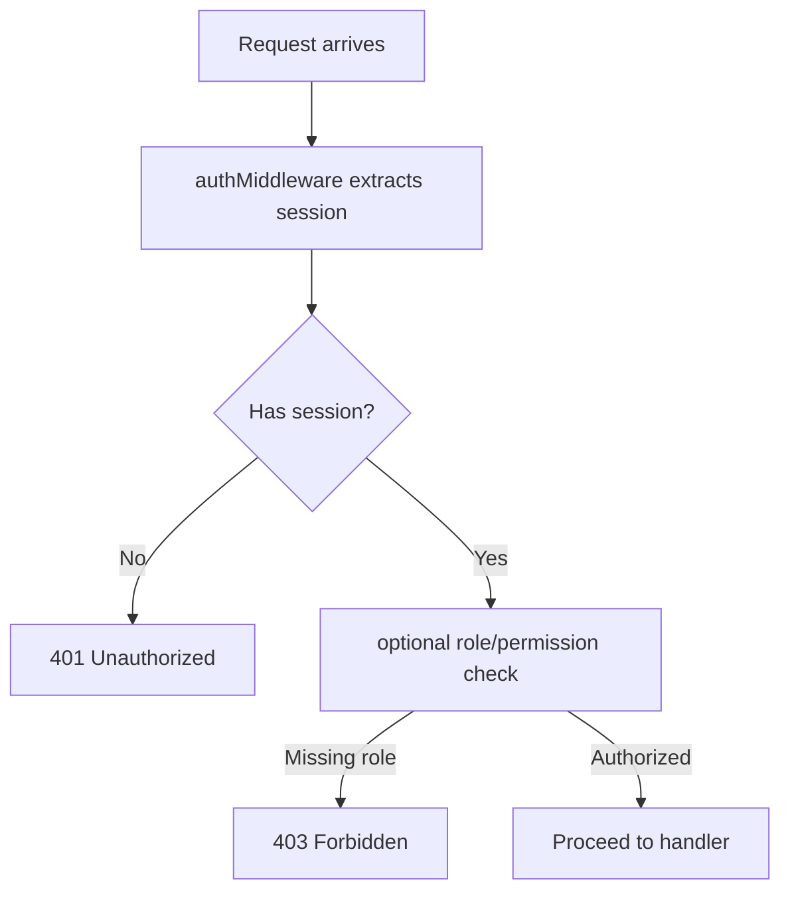
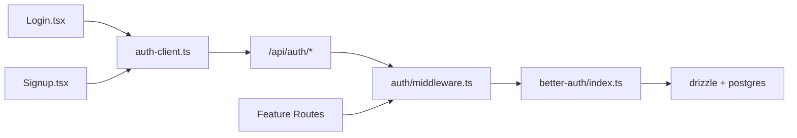

# Authentication Flow

<cite>
**Referenced Files in This Document**
- [server/src/auth/index.ts](file://server/src/auth/index.ts)
- [server/src/auth/middleware.ts](file://server/src/auth/middleware.ts)
- [server/src/index.ts](file://server/src/index.ts)
- [server/src/db/schema.ts](file://server/src/db/schema.ts)
- [client/src/lib/auth-client.ts](file://client/src/lib/auth-client.ts)
- [client/src/contexts/auth-context.tsx](file://client/src/contexts/auth-context.tsx)
- [client/src/pages/Login.tsx](file://client/src/pages/Login.tsx)
- [client/src/pages/Signup.tsx](file://client/src/pages/Signup.tsx)
- [server/src/routes/properties.ts](file://server/src/routes/properties.ts)
- [server/src/routes/dashboard.ts](file://server/src/routes/dashboard.ts)
</cite>

## Table of Contents
1. Introduction
2. Project Structure
3. Core Components
4. Architecture Overview
5. Detailed Component Analysis
6. Dependency Analysis
7. Performance Considerations
8. Troubleshooting Guide
9. Conclusion

## Introduction
This document explains the authentication and authorization system implemented with Better Auth. It covers:
- Server-side configuration for email/password authentication, sessions, and CORS/trusted origins
- Express middleware that validates sessions and attaches user context to requests
- Client-side authentication client and React context for managing user state
- Login and signup flows, including token/session handling via Better Auth
- Current role-based access control status and recommended patterns
- Security best practices for session lifetime, storage, and secure communication
- Password hashing and registration workflow
- Guidance for password reset and multi-factor authentication (MFA) setup

## Project Structure
The authentication system spans server and client layers:
- Server: Better Auth configured with Drizzle adapter; Express routes protected by middleware; database schema includes user, session, account, and verification tables
- Client: Better Auth React client exposes signIn, signUp, signOut, useSession; a React context provides typed user state to components

**Diagram sources**
- [client/src/pages/Login.tsx:1-40](file://client/src/pages/Login.tsx#L1-L40)
- [client/src/pages/Signup.tsx:1-48](file://client/src/pages/Signup.tsx#L1-L48)
- [client/src/contexts/auth-context.tsx:1-38](file://client/src/contexts/auth-context.tsx#L1-L38)
- [client/src/lib/auth-client.ts:1-13](file://client/src/lib/auth-client.ts#L1-L13)
- [server/src/index.ts:20-62](file://server/src/index.ts#L20-L62)
- [server/src/auth/index.ts:1-23](file://server/src/auth/index.ts#L1-L23)
- [server/src/auth/middleware.ts:1-45](file://server/src/auth/middleware.ts#L1-L45)
- [server/src/db/schema.ts:137-187](file://server/src/db/schema.ts#L137-L187)

**Section sources**
- [server/src/index.ts:20-62](file://server/src/index.ts#L20-L62)
- [server/src/auth/index.ts:1-23](file://server/src/auth/index.ts#L1-L23)
- [server/src/auth/middleware.ts:1-45](file://server/src/auth/middleware.ts#L1-L45)
- [client/src/lib/auth-client.ts:1-13](file://client/src/lib/auth-client.ts#L1-L13)
- [client/src/contexts/auth-context.tsx:1-38](file://client/src/contexts/auth-context.tsx#L1-L38)
- [client/src/pages/Login.tsx:1-40](file://client/src/pages/Login.tsx#L1-L40)
- [client/src/pages/Signup.tsx:1-48](file://client/src/pages/Signup.tsx#L1-L48)
- [server/src/db/schema.ts:137-187](file://server/src/db/schema.ts#L137-L187)

## Core Components
- Better Auth server configuration:
  - Email/password enabled without mandatory email verification in current config
  - Session settings: expiration and update age
  - Trusted origins set from environment
- Express integration:
  - Mounts Better Auth at /api/auth/*
  - Uses CORS with credentials enabled for cross-origin sessions
- Middleware:
  - authMiddleware: validates session and attaches userId to request
  - optionalAuth: allows unauthenticated access but enriches request if session exists
- Client SDK:
  - createAuthClient with baseURL
  - Exposes signIn.email, signUp.email, signOut, useSession
- React Context:
  - Provides user, loading, and isAuthenticated to app components

**Section sources**
- [server/src/auth/index.ts:1-23](file://server/src/auth/index.ts#L1-L23)
- [server/src/index.ts:37-49](file://server/src/index.ts#L37-L49)
- [server/src/auth/middleware.ts:8-44](file://server/src/auth/middleware.ts#L8-L44)
- [client/src/lib/auth-client.ts:1-13](file://client/src/lib/auth-client.ts#L1-L13)
- [client/src/contexts/auth-context.tsx:1-38](file://client/src/contexts/auth-context.tsx#L1-L38)

## Architecture Overview
The flow uses Better Auth’s built-in session management over cookies. The client calls signIn or signUp, which interact with the server’s /api/auth endpoints. On success, Better Auth sets an HTTP-only session cookie. Subsequent requests include this cookie automatically when credentials are enabled in CORS. Protected routes enforce authentication via middleware.

**Diagram sources**
- [client/src/pages/Login.tsx:16-35](file://client/src/pages/Login.tsx#L16-L35)
- [client/src/lib/auth-client.ts:1-13](file://client/src/lib/auth-client.ts#L1-L13)
- [server/src/index.ts:47-49](file://server/src/index.ts#L47-L49)
- [server/src/auth/index.ts:1-23](file://server/src/auth/index.ts#L1-L23)
- [server/src/db/schema.ts:137-187](file://server/src/db/schema.ts#L137-L187)

## Detailed Component Analysis

### Server-Side Authentication Configuration
- Email/password is enabled; email verification is disabled by default
- Session duration and refresh behavior configured
- Trusted origins allow cross-origin session cookies from the client URL

Security notes:
- Ensure production enables email verification and strong secrets
- Keep CLIENT_URL aligned with deployed frontend origin

**Section sources**
- [server/src/auth/index.ts:5-20](file://server/src/auth/index.ts#L5-L20)

### Express Integration and Protected Routes
- All /api/auth/* routes are handled by Better Auth
- CORS enabled with credentials for cookie-based sessions
- Feature routes protect endpoints using authMiddleware

Examples:
- Properties router applies authMiddleware globally
- Dashboard router applies authMiddleware globally

**Section sources**
- [server/src/index.ts:37-62](file://server/src/index.ts#L37-L62)
- [server/src/routes/properties.ts:1-10](file://server/src/routes/properties.ts#L1-L10)
- [server/src/routes/dashboard.ts:1-8](file://server/src/routes/dashboard.ts#L1-L8)

### Session Middleware
- authMiddleware retrieves session via Better Auth API
- If no session, returns 401 Unauthorized
- Attaches session and userId to request for downstream handlers
- optionalAuth allows public routes to optionally read session

**Section sources**
- [server/src/auth/middleware.ts:8-44](file://server/src/auth/middleware.ts#L8-L44)

### Client-Side Authentication Client
- Creates a Better Auth client pointing to the backend base URL
- Exposes signIn, signUp, signOut, useSession
- Cookies are managed automatically by the browser when credentials are allowed

**Section sources**
- [client/src/lib/auth-client.ts:1-13](file://client/src/lib/auth-client.ts#L1-L13)

### React Authentication Context
- Wraps app with AuthProvider to expose user, isLoading, isAuthenticated
- Uses useSession hook to keep UI in sync with server session state

**Section sources**
- [client/src/contexts/auth-context.tsx:1-38](file://client/src/contexts/auth-context.tsx#L1-L38)

### Login Flow
- User submits email/password
- Client calls signIn.email
- On success, navigates to home
- On error, shows toast

**Diagram sources**
- [client/src/pages/Login.tsx:16-35](file://client/src/pages/Login.tsx#L16-L35)
- [client/src/lib/auth-client.ts:1-13](file://client/src/lib/auth-client.ts#L1-L13)
- [server/src/index.ts:47-49](file://server/src/index.ts#L47-L49)
- [server/src/auth/index.ts:1-23](file://server/src/auth/index.ts#L1-L23)

**Section sources**
- [client/src/pages/Login.tsx:16-35](file://client/src/pages/Login.tsx#L16-L35)

### Signup Flow
- Validates password match and minimum length on client
- Calls signUp.email with name, email, password
- On success, redirects to home

**Diagram sources**
- [client/src/pages/Signup.tsx:18-48](file://client/src/pages/Signup.tsx#L18-L48)

**Section sources**
- [client/src/pages/Signup.tsx:18-48](file://client/src/pages/Signup.tsx#L18-L48)

### Role-Based Access Control and Permissions
Current implementation:
- Enforces per-user data isolation by attaching userId from session and filtering queries by userId
- No explicit roles or permissions are defined in the schema or middleware

Recommended pattern:
- Add a role field to the user table and validate it in middleware or route handlers
- Create a role-checking middleware that enforces required roles before business logic
- Scope resources by userId plus role where appropriate

[No sources needed since this diagram shows conceptual workflow, not actual code structure]

**Section sources**
- [server/src/routes/properties.ts:26-34](file://server/src/routes/properties.ts#L26-L34)
- [server/src/routes/dashboard.ts:11-16](file://server/src/routes/dashboard.ts#L11-L16)

### Session Management and Token Storage
- Sessions are managed by Better Auth using HTTP-only cookies
- Session expiration and update age are configured on the server
- CORS must allow credentials for cookies to be sent cross-origin

Best practices:
- Use HTTPS in production
- Keep CLIENT_URL accurate to avoid CORS issues
- Configure session expiry based on security requirements
- Rotate secrets regularly

**Section sources**
- [server/src/auth/index.ts:13-19](file://server/src/auth/index.ts#L13-L19)
- [server/src/index.ts:37-44](file://server/src/index.ts#L37-L44)

### Password Hashing and Registration Workflow
- Better Auth handles password hashing internally when email/password is enabled
- Account and user tables exist for storing credentials and metadata
- Verification table supports email verification workflows

Implementation notes:
- Do not store plaintext passwords
- Enable email verification in production for stronger security posture

**Section sources**
- [server/src/auth/index.ts:9-12](file://server/src/auth/index.ts#L9-L12)
- [server/src/db/schema.ts:137-187](file://server/src/db/schema.ts#L137-L187)

### Password Reset and Multi-Factor Authentication (MFA)
Current state:
- Password reset and MFA are not explicitly wired in the provided files
- Better Auth supports these features; they can be enabled and integrated

Recommendations:
- Enable email verification and configure password reset flows through Better Auth
- For MFA, enable TOTP or SMS providers supported by Better Auth and integrate into login/signup flows
- Update client to handle additional steps (e.g., verifying codes)

[No sources needed since this section provides general guidance]

## Dependency Analysis
Key dependencies and relationships:
- Client pages depend on the auth client for sign-in/sign-up
- Auth client depends on the server’s /api/auth endpoints
- Server routes depend on middleware to ensure authenticated users
- Middleware depends on Better Auth to resolve sessions
- Better Auth depends on Drizzle adapter and Postgres for persistence

**Diagram sources**
- [client/src/pages/Login.tsx:16-35](file://client/src/pages/Login.tsx#L16-L35)
- [client/src/pages/Signup.tsx:18-48](file://client/src/pages/Signup.tsx#L18-L48)
- [client/src/lib/auth-client.ts:1-13](file://client/src/lib/auth-client.ts#L1-L13)
- [server/src/index.ts:47-62](file://server/src/index.ts#L47-L62)
- [server/src/auth/middleware.ts:8-44](file://server/src/auth/middleware.ts#L8-L44)
- [server/src/auth/index.ts:1-23](file://server/src/auth/index.ts#L1-L23)
- [server/src/db/schema.ts:137-187](file://server/src/db/schema.ts#L137-L187)

**Section sources**
- [server/src/index.ts:47-62](file://server/src/index.ts#L47-L62)
- [server/src/auth/middleware.ts:8-44](file://server/src/auth/middleware.ts#L8-L44)
- [server/src/auth/index.ts:1-23](file://server/src/auth/index.ts#L1-L23)
- [client/src/lib/auth-client.ts:1-13](file://client/src/lib/auth-client.ts#L1-L13)

## Performance Considerations
- Session lookup occurs per request via middleware; keep session payload minimal
- Avoid heavy operations in middleware; delegate to route handlers
- Use database indexes on frequently queried fields like userId
- Cache dashboard aggregates if needed, considering freshness requirements

[No sources needed since this section provides general guidance]

## Troubleshooting Guide
Common issues and checks:
- 401 Unauthorized on protected routes:
  - Verify session exists and cookies are sent with credentials
  - Ensure CORS allows credentials and correct origin
- Cross-origin cookie not set:
  - Confirm CLIENT_URL matches the frontend origin
  - Check trustedOrigins configuration
- Sign-in/sign-up errors:
  - Validate input constraints on the client
  - Review server logs for credential validation failures

Relevant behaviors:
- Middleware returns 401 when no session is present
- Client displays toast messages for errors and success

**Section sources**
- [server/src/auth/middleware.ts:14-26](file://server/src/auth/middleware.ts#L14-L26)
- [client/src/pages/Login.tsx:20-35](file://client/src/pages/Login.tsx#L20-L35)
- [client/src/pages/Signup.tsx:18-48](file://client/src/pages/Signup.tsx#L18-L48)
- [server/src/index.ts:37-49](file://server/src/index.ts#L37-L49)

## Conclusion
This project implements a robust, cookie-based session authentication system using Better Auth. Protected routes enforce authentication via middleware, and the client maintains user state through a React context. While role-based access control is not yet implemented, the architecture supports adding roles and permissions with minimal changes. Follow the recommended security practices to harden the system for production, including enabling email verification, securing secrets, and configuring CORS correctly. Password reset and MFA can be added by leveraging Better Auth’s capabilities and updating client flows accordingly.