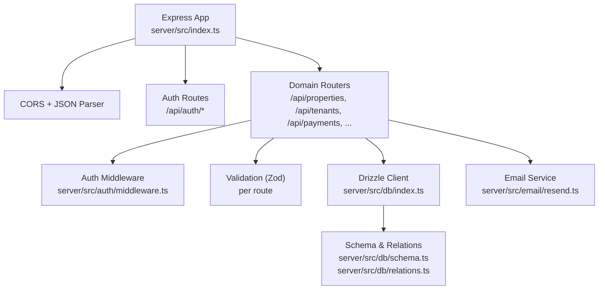
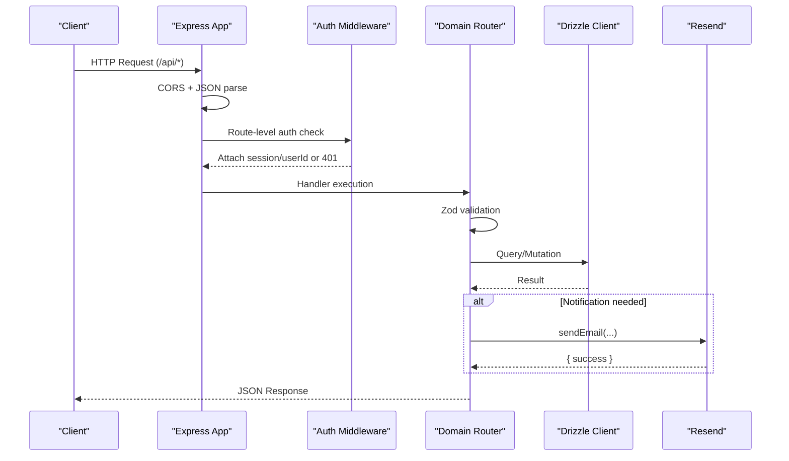
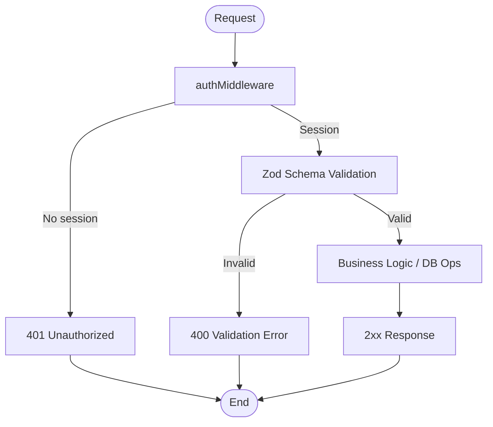
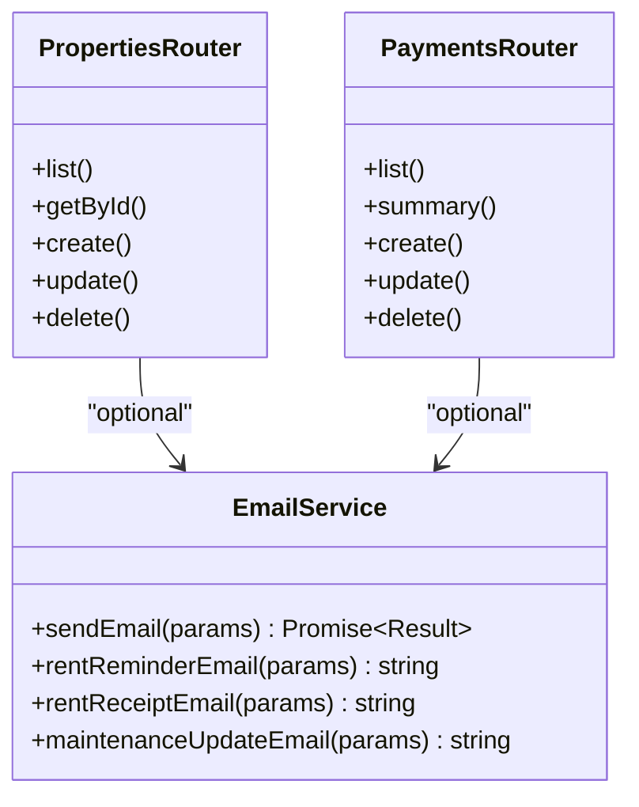
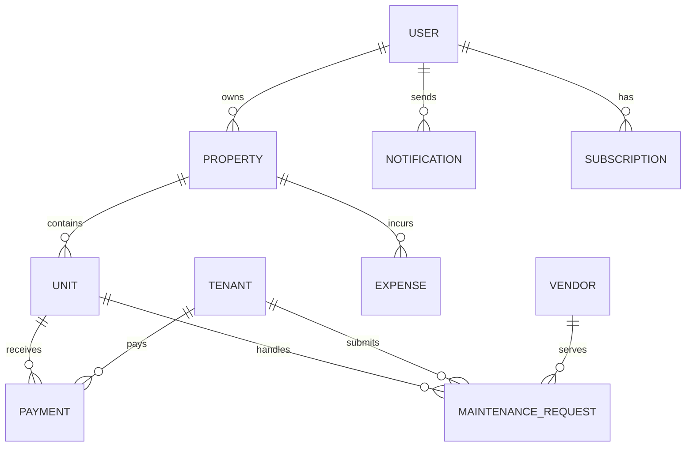
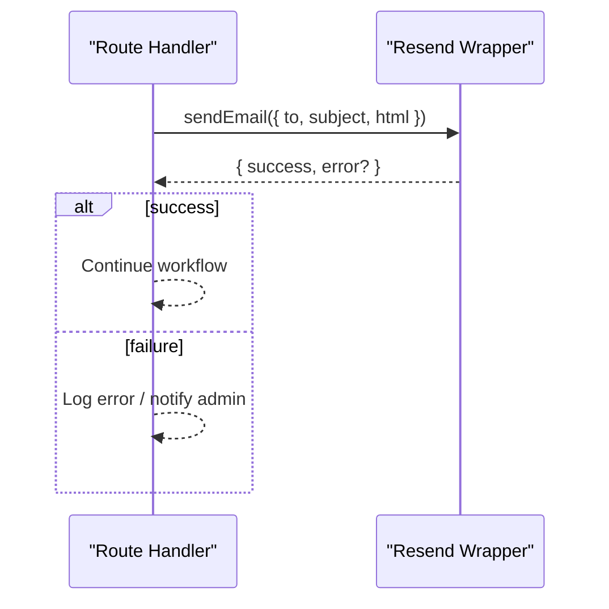
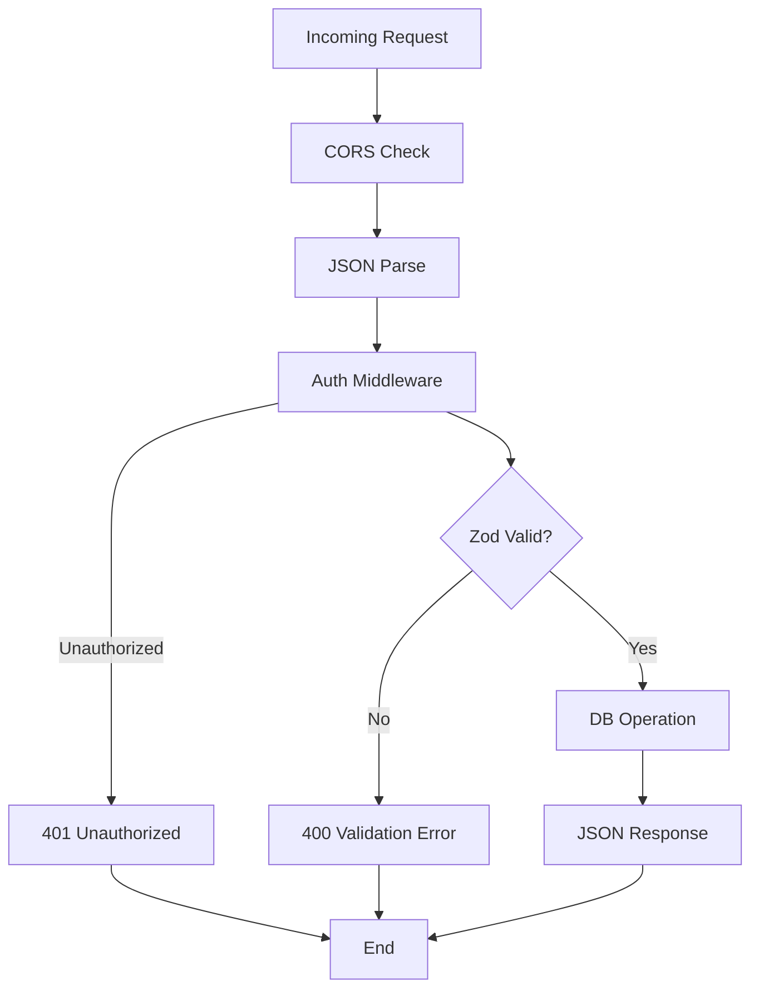
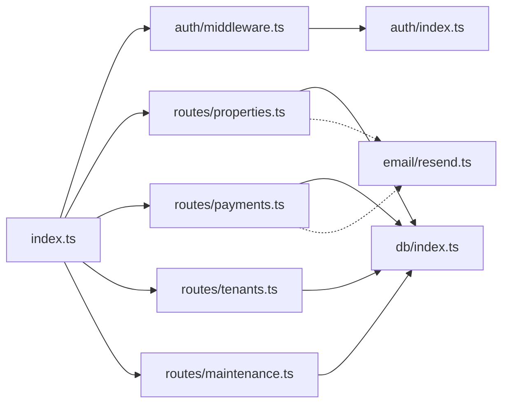

# Backend Architecture

<cite>
**Referenced Files in This Document**
- [server/src/index.ts](file://server/src/index.ts)
- [server/src/auth/middleware.ts](file://server/src/auth/middleware.ts)
- [server/src/auth/index.ts](file://server/src/auth/index.ts)
- [server/src/db/index.ts](file://server/src/db/index.ts)
- [server/src/db/schema.ts](file://server/src/db/schema.ts)
- [server/src/db/relations.ts](file://server/src/db/relations.ts)
- [server/src/email/resend.ts](file://server/src/email/resend.ts)
- [server/src/routes/properties.ts](file://server/src/routes/properties.ts)
- [server/src/routes/payments.ts](file://server/src/routes/payments.ts)
- [server/src/routes/tenants.ts](file://server/src/routes/tenants.ts)
- [server/src/routes/maintenance.ts](file://server/src/routes/maintenance.ts)
</cite>

## Table of Contents
1. [Introduction](#introduction)
2. [Project Structure](#project-structure)
3. [Core Components](#core-components)
4. [Architecture Overview](#architecture-overview)
5. [Detailed Component Analysis](#detailed-component-analysis)
6. [Dependency Analysis](#dependency-analysis)
7. [Performance Considerations](#performance-considerations)
8. [Troubleshooting Guide](#troubleshooting-guide)
9. [Conclusion](#conclusion)

## Introduction
This document explains the Express.js backend architecture for a landlord management application. It covers modular route organization by domain, middleware patterns for authentication and validation, service-like patterns within routes, database abstraction with Drizzle ORM, email integration via Resend, request/response lifecycle, error propagation, and security measures including CORS and input validation.

## Project Structure
The server is organized into clear layers:
- Entry point mounts global middleware and registers domain routers under /api/*
- Authentication uses Better-Auth with a Drizzle adapter; session extraction is provided as middleware
- Database layer defines schema, relations, and a typed client
- Domain routes implement CRUD and business logic per feature (properties, tenants, payments, maintenance, etc.)
- Email module provides a send function and templates for notifications

**Diagram sources**
- [server/src/index.ts:21-49](file://server/src/index.ts#L21-L49)
- [server/src/auth/middleware.ts:9-27](file://server/src/auth/middleware.ts#L9-L27)
- [server/src/db/index.ts:1-10](file://server/src/db/index.ts#L1-L10)
- [server/src/db/schema.ts:1-403](file://server/src/db/schema.ts#L1-L403)
- [server/src/db/relations.ts:1-103](file://server/src/db/relations.ts#L1-L103)
- [server/src/email/resend.ts:1-113](file://server/src/email/resend.ts#L1-L113)

**Section sources**
- [server/src/index.ts:21-49](file://server/src/index.ts#L21-L49)

## Core Components
- Application bootstrap and routing:
  - Global middleware: CORS configured to allow credentials and a specific origin; JSON body parser with size limit
  - Mounts Better-Auth handler at /api/auth/*
  - Registers domain routers under /api/*
- Authentication:
  - Better-Auth configured with Drizzle adapter, email/password enabled, session settings, trusted origins
  - Session extraction middleware attaches session and userId to requests
- Database:
  - Drizzle client initialized with Postgres driver and merged schema/relations
  - Strongly typed tables and enums define domain model
- Email:
  - Resend client wrapper with send function and templates for rent reminders, receipts, and maintenance updates

**Section sources**
- [server/src/index.ts:21-49](file://server/src/index.ts#L21-L49)
- [server/src/auth/index.ts:1-23](file://server/src/auth/index.ts#L1-L23)
- [server/src/auth/middleware.ts:1-45](file://server/src/auth/middleware.ts#L1-L45)
- [server/src/db/index.ts:1-10](file://server/src/db/index.ts#L1-L10)
- [server/src/db/schema.ts:1-403](file://server/src/db/schema.ts#L1-L403)
- [server/src/email/resend.ts:1-113](file://server/src/email/resend.ts#L1-L113)

## Architecture Overview
The request flows through global middleware, optional auth middleware, then into domain routers that validate inputs, perform DB operations using Drizzle, and return standardized responses. Optional email triggers can be invoked from routes or services.

**Diagram sources**
- [server/src/index.ts:21-49](file://server/src/index.ts#L21-L49)
- [server/src/auth/middleware.ts:9-27](file://server/src/auth/middleware.ts#L9-L27)
- [server/src/routes/properties.ts:26-71](file://server/src/routes/properties.ts#L26-L71)
- [server/src/routes/payments.ts:25-133](file://server/src/routes/payments.ts#L25-L133)
- [server/src/email/resend.ts:7-30](file://server/src/email/resend.ts#L7-L30)

## Detailed Component Analysis

### Modular Route Organization by Domain
Each domain has its own router file under server/src/routes, mounted on a dedicated path prefix. Common patterns:
- Apply authMiddleware at the top of each router
- Define Zod schemas for create/update payloads
- Use Drizzle query builder with user-scoped filters (e.g., property.userId === req.userId)
- Return consistent JSON envelopes with data/message fields and status codes

Examples:
- Properties: list, get, create (auto-generates units), update, delete
- Payments: list with filtering, summary aggregation, create, update, delete
- Tenants: full CRUD scoped to user
- Maintenance: list filtered by user properties, create, update status, delete

**Section sources**
- [server/src/routes/properties.ts:1-106](file://server/src/routes/properties.ts#L1-L106)
- [server/src/routes/payments.ts:1-137](file://server/src/routes/payments.ts#L1-L137)
- [server/src/routes/tenants.ts:1-83](file://server/src/routes/tenants.ts#L1-L83)
- [server/src/routes/maintenance.ts:1-103](file://server/src/routes/maintenance.ts#L1-L103)

### Middleware Pattern: Authentication, Validation, Error Handling
- Authentication:
  - Better-Auth handler mounted at /api/auth/*
  - authMiddleware extracts session and attaches userId to request; returns 401 if unauthorized
  - optionalAuth allows reading session when present without blocking unauthenticated access
- Validation:
  - Each route defines Zod schemas for inputs and validates with safeParse, returning structured validation errors
- Error handling:
  - Handlers return explicit status codes and messages for not found and validation failures
  - Centralized error handling could be added later as an Express error-handling middleware

**Diagram sources**
- [server/src/auth/middleware.ts:9-27](file://server/src/auth/middleware.ts#L9-L27)
- [server/src/routes/properties.ts:49-71](file://server/src/routes/properties.ts#L49-L71)
- [server/src/routes/payments.ts:104-133](file://server/src/routes/payments.ts#L104-L133)

**Section sources**
- [server/src/auth/middleware.ts:1-45](file://server/src/auth/middleware.ts#L1-L45)
- [server/src/routes/properties.ts:11-23](file://server/src/routes/properties.ts#L11-L23)
- [server/src/routes/payments.ts:11-22](file://server/src/routes/payments.ts#L11-L22)

### Service Layer Architecture and External Integrations
- The current implementation embeds business logic directly in route handlers. This is acceptable for small apps but can be refactored into a service layer to separate concerns:
  - Extract reusable queries and mutations into service functions
  - Keep routes thin: validate, call service, format response
- External integrations:
  - Email via Resend: sendEmail wraps API calls and returns a result object; templates provide HTML content for common notifications
  - Future integrations (payments, SMS, storage) can follow the same pattern: dedicated module with typed interfaces and error handling

**Diagram sources**
- [server/src/routes/properties.ts:1-106](file://server/src/routes/properties.ts#L1-L106)
- [server/src/routes/payments.ts:1-137](file://server/src/routes/payments.ts#L1-L137)
- [server/src/email/resend.ts:1-113](file://server/src/email/resend.ts#L1-L113)

**Section sources**
- [server/src/email/resend.ts:1-113](file://server/src/email/resend.ts#L1-L113)

### Database Abstraction with Drizzle ORM and Query Patterns
- Schema and relations:
  - Tables defined with pg-core types and enums for constrained values
  - Relations declared to enable nested queries and type safety
- Client initialization:
  - Drizzle client created with postgres-js and merged schema/relations
- Query patterns observed:
  - User-scoped filtering using eq(property.userId, userId)
  - Nested loading with .with({ units: true })
  - Aggregations computed in-memory after fetching sets (e.g., payment summaries)
  - Conditional updates setting timestamps and derived fields

**Diagram sources**
- [server/src/db/schema.ts:139-403](file://server/src/db/schema.ts#L139-L403)
- [server/src/db/relations.ts:18-103](file://server/src/db/relations.ts#L18-L103)

**Section sources**
- [server/src/db/index.ts:1-10](file://server/src/db/index.ts#L1-L10)
- [server/src/db/schema.ts:1-403](file://server/src/db/schema.ts#L1-L403)
- [server/src/db/relations.ts:1-103](file://server/src/db/relations.ts#L1-L103)

### Email Service Integration and Notification Patterns
- Resend client is initialized with an API key and a default sender address
- sendEmail accepts recipient, subject, and HTML content; returns a success flag and optional error message
- Templates are provided for rent reminders, receipts, and maintenance updates
- Usage pattern:
  - Build HTML template with dynamic data
  - Call sendEmail and handle success/failure
  - Optionally persist notification records using the notification table

**Diagram sources**
- [server/src/email/resend.ts:7-30](file://server/src/email/resend.ts#L7-L30)

**Section sources**
- [server/src/email/resend.ts:1-113](file://server/src/email/resend.ts#L1-L113)

### Request/Response Lifecycle and Error Propagation
Lifecycle:
- Request enters Express app
- CORS and JSON parsing run globally
- Auth middleware checks session and attaches userId
- Route handler validates input with Zod
- Handler performs DB operations via Drizzle
- Handler returns JSON responses with appropriate status codes
- Errors:
  - Validation errors return 400 with details
  - Not found returns 404 with code
  - Unauthorized returns 401

**Diagram sources**
- [server/src/index.ts:26-33](file://server/src/index.ts#L26-L33)
- [server/src/auth/middleware.ts:9-27](file://server/src/auth/middleware.ts#L9-L27)
- [server/src/routes/properties.ts:49-71](file://server/src/routes/properties.ts#L49-L71)

**Section sources**
- [server/src/index.ts:21-55](file://server/src/index.ts#L21-L55)
- [server/src/auth/middleware.ts:9-27](file://server/src/auth/middleware.ts#L9-L27)
- [server/src/routes/properties.ts:26-103](file://server/src/routes/properties.ts#L26-L103)

### Security Measures
- Input validation:
  - Zod schemas enforce types, ranges, and allowed enums for all mutable endpoints
- CORS configuration:
  - Configured to allow credentials and restrict origins to CLIENT_URL or localhost
- Rate limiting:
  - No rate limiting middleware is currently applied; consider adding a strategy such as express-rate-limit to protect endpoints
- Authentication:
  - Better-Auth manages sessions and tokens; authMiddleware enforces authorization on protected routes

Recommendations:
- Add rate limiting to sensitive endpoints (auth, payments)
- Implement centralized error handling middleware to standardize error shapes
- Consider adding request logging and audit trails for compliance

**Section sources**
- [server/src/index.ts:26-33](file://server/src/index.ts#L26-L33)
- [server/src/auth/index.ts:1-23](file://server/src/auth/index.ts#L1-L23)
- [server/src/routes/properties.ts:11-23](file://server/src/routes/properties.ts#L11-L23)
- [server/src/routes/payments.ts:11-22](file://server/src/routes/payments.ts#L11-L22)

## Dependency Analysis
High-level dependencies between modules:
- index.ts depends on auth middleware and domain routers
- Domain routers depend on auth middleware, Drizzle client, and schema
- Email module is independent and optionally used by routes
- Auth module depends on Drizzle adapter

**Diagram sources**
- [server/src/index.ts:21-49](file://server/src/index.ts#L21-L49)
- [server/src/auth/middleware.ts:1-45](file://server/src/auth/middleware.ts#L1-L45)
- [server/src/auth/index.ts:1-23](file://server/src/auth/index.ts#L1-L23)
- [server/src/db/index.ts:1-10](file://server/src/db/index.ts#L1-L10)
- [server/src/email/resend.ts:1-113](file://server/src/email/resend.ts#L1-L113)

**Section sources**
- [server/src/index.ts:21-49](file://server/src/index.ts#L21-L49)
- [server/src/auth/middleware.ts:1-45](file://server/src/auth/middleware.ts#L1-L45)
- [server/src/auth/index.ts:1-23](file://server/src/auth/index.ts#L1-L23)
- [server/src/db/index.ts:1-10](file://server/src/db/index.ts#L1-L10)
- [server/src/email/resend.ts:1-113](file://server/src/email/resend.ts#L1-L113)

## Performance Considerations
- N+1 queries:
  - Some routes fetch related entities in memory; prefer using Drizzle’s .with() to eagerly load relations where possible
- Filtering:
  - Prefer server-side filtering using Drizzle conditions instead of client-side array filters for large datasets
- Pagination:
  - Add pagination to list endpoints to reduce payload sizes
- Caching:
  - Consider caching read-heavy endpoints (e.g., reports, dashboard) with Redis or in-memory cache
- Email:
  - Queue emails asynchronously to avoid blocking request-response cycles

[No sources needed since this section provides general guidance]

## Troubleshooting Guide
Common issues and resolutions:
- Unauthorized access:
  - Ensure cookies/headers include credentials and match trusted origins; verify session exists
- Validation errors:
  - Check Zod schema constraints and ensure request bodies conform to expected types
- Not found:
  - Verify resource ownership checks (e.g., userId filters) and correct IDs
- Email delivery:
  - Confirm RESEND_API_KEY is set; inspect sendEmail result for errors

**Section sources**
- [server/src/auth/middleware.ts:9-27](file://server/src/auth/middleware.ts#L9-L27)
- [server/src/routes/properties.ts:49-71](file://server/src/routes/properties.ts#L49-L71)
- [server/src/routes/payments.ts:104-133](file://server/src/routes/payments.ts#L104-L133)
- [server/src/email/resend.ts:7-30](file://server/src/email/resend.ts#L7-L30)

## Conclusion
The backend follows a clean, modular structure with domain-based routers, robust authentication via Better-Auth, strict input validation with Zod, and a strongly-typed database layer using Drizzle ORM. Email notifications are integrated via Resend with reusable templates. To scale further, introduce a service layer, centralized error handling, pagination, caching, and rate limiting. This foundation supports reliable, maintainable growth for the landlord management platform.