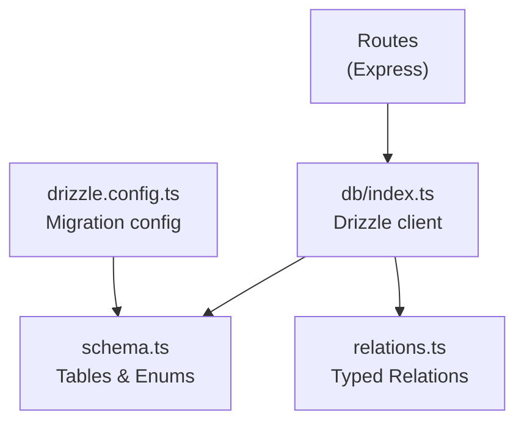
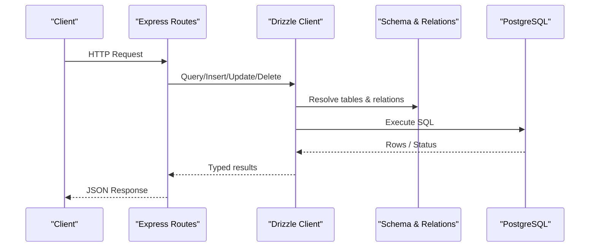
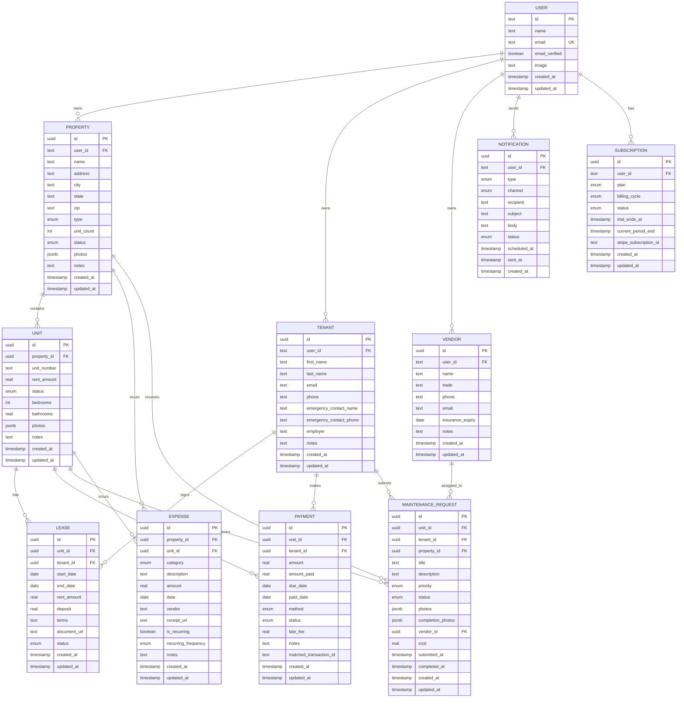
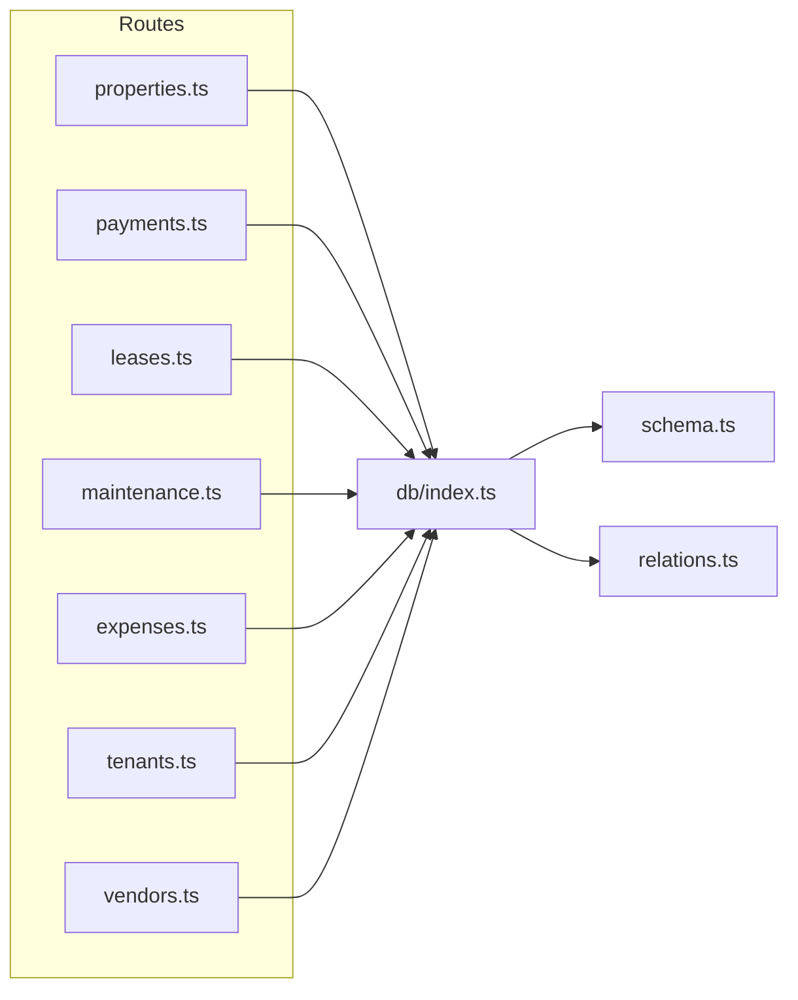
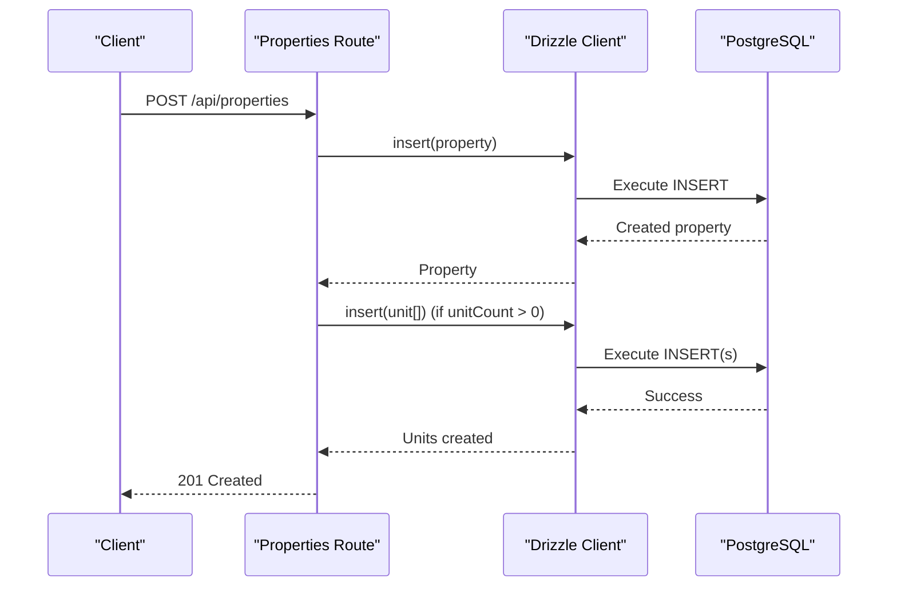
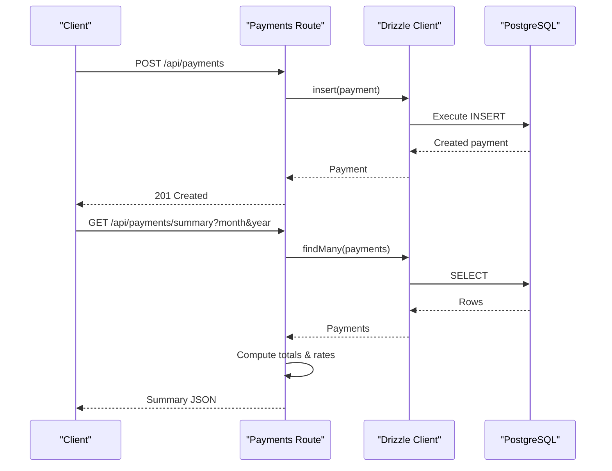

# Database Layer

<cite>
**Referenced Files in This Document**
- [schema.ts](file://server/src/db/schema.ts)
- [relations.ts](file://server/src/db/relations.ts)
- [index.ts](file://server/src/db/index.ts)
- [drizzle.config.ts](file://server/drizzle.config.ts)
- [properties.ts](file://server/src/routes/properties.ts)
- [payments.ts](file://server/src/routes/payments.ts)
- [leases.ts](file://server/src/routes/leases.ts)
- [maintenance.ts](file://server/src/routes/maintenance.ts)
- [expenses.ts](file://server/src/routes/expenses.ts)
- [tenants.ts](file://server/src/routes/tenants.ts)
- [vendors.ts](file://server/src/routes/vendors.ts)
</cite>

## Table of Contents
1. [Introduction](#introduction)
2. [Project Structure](#project-structure)
3. [Core Components](#core-components)
4. [Architecture Overview](#architecture-overview)
5. [Detailed Component Analysis](#detailed-component-analysis)
6. [Dependency Analysis](#dependency-analysis)
7. [Performance Considerations](#performance-considerations)
8. [Troubleshooting Guide](#troubleshooting-guide)
9. [Conclusion](#conclusion)
10. [Appendices](#appendices)

## Introduction
This document explains the database layer architecture built with Drizzle ORM for a landlord application. It covers schema definitions, relational model and constraints, query patterns, connection management, migrations, performance considerations, and data integrity enforcement. The goal is to help developers understand how entities like properties, units, tenants, leases, payments, expenses, maintenance requests, and vendors are modeled and accessed safely and efficiently.

## Project Structure
The database layer resides under server/src/db with three primary files:
- schema.ts: Defines all tables, enums, and columns using Drizzle’s PostgreSQL dialect.
- relations.ts: Declares typed relationships between tables for convenient querying with joins.
- index.ts: Creates the Drizzle client, loads environment configuration, and exports a typed db instance.

Configuration for Drizzle Kit (migrations and introspection) lives in drizzle.config.ts at the server root.

**Diagram sources**
- [index.ts:1-26](file://server/src/db/index.ts#L1-L26)
- [schema.ts:1-403](file://server/src/db/schema.ts#L1-L403)
- [relations.ts:1-103](file://server/src/db/relations.ts#L1-L103)
- [drizzle.config.ts:1-16](file://server/drizzle.config.ts#L1-L16)

**Section sources**
- [index.ts:1-26](file://server/src/db/index.ts#L1-L26)
- [drizzle.config.ts:1-16](file://server/drizzle.config.ts#L1-L16)

## Core Components
- Schema and types: All domain entities are defined as Drizzle tables with explicit column types, defaults, and foreign keys. Enumerations constrain status fields and categories.
- Relationships: Typed relations enable rich queries with nested includes (e.g., property.units, lease.tenant).
- Client: A single Drizzle client is created from DATABASE_URL and exported for use across routes.

Key responsibilities by file:
- schema.ts: Entity definitions, enums, timestamps, JSONB arrays, and FK constraints.
- relations.ts: One-to-many and many-to-one relationships used by findMany/findFirst with include.
- index.ts: Environment loading, connection creation, and db export.

**Section sources**
- [schema.ts:14-136](file://server/src/db/schema.ts#L14-L136)
- [schema.ts:139-403](file://server/src/db/schema.ts#L139-L403)
- [relations.ts:18-103](file://server/src/db/relations.ts#L18-L103)
- [index.ts:10-26](file://server/src/db/index.ts#L10-L26)

## Architecture Overview
The application uses an Express API where each route module imports the shared db client and interacts with Drizzle ORM. Queries leverage typed relations to fetch related records efficiently. Data validation is performed with Zod before writes.

**Diagram sources**
- [index.ts:18-26](file://server/src/db/index.ts#L18-L26)
- [schema.ts:189-403](file://server/src/db/schema.ts#L189-L403)
- [relations.ts:37-103](file://server/src/db/relations.ts#L37-L103)

## Detailed Component Analysis

### Entities and Relational Model
The following table summarizes core entities, key fields, and relationships.

- user: Authentication identity managed by Better-Auth; referenced by sessions, accounts, properties, tenants, vendors, notifications, subscriptions.
- property: Owned by user; contains address, type, status, unitCount, photos, notes.
- unit: Belongs to property; tracks unitNumber, rentAmount, status, bedrooms, bathrooms, photos, notes.
- tenant: Belongs to user; stores contact and employer info.
- lease: Links unit and tenant; captures dates, rent amount, deposit, terms, documentUrl, status.
- payment: Links unit and tenant; captures amount, amountPaid, dueDate, paidDate, method, status, lateFee, notes.
- maintenanceRequest: Links unit, tenant, property, vendor; captures title, description, priority, status, media, cost, timestamps.
- expense: Links property and optionally unit; captures category, description, amount, date, vendor, receiptUrl, recurrence flags.
- vendor: Belongs to user; trade, contact, insurance expiry, notes.
- notification: Belongs to user; type, channel, recipient, subject, body, status, scheduling/sent times.
- subscription: Belongs to user; plan tier, billing cycle, status, periods, Stripe id.

Foreign key highlights:
- Many entities reference user.id with cascade delete.
- unit.propertyId references property.id with cascade delete.
- lease.unitId references unit.id with cascade delete; lease.tenantId references tenant.id with cascade delete.
- payment.unitId references unit.id with cascade delete; payment.tenantId references tenant.id with cascade delete.
- maintenanceRequest.unitId references unit.id with cascade delete; maintenanceRequest.propertyId references property.id with cascade delete; maintenanceRequest.tenantId references tenant.id with set null; maintenanceRequest.vendorId references vendor.id with set null.
- expense.propertyId references property.id with cascade delete; expense.unitId references unit.id with set null.
- notification.userId references user.id (no cascade specified).
- subscription.userId references user.id (no cascade specified).

**Diagram sources**
- [schema.ts:139-403](file://server/src/db/schema.ts#L139-L403)

**Section sources**
- [schema.ts:139-403](file://server/src/db/schema.ts#L139-L403)

### Query Patterns and Best Practices
- Ownership scoping: Most routes scope queries by userId to ensure multi-tenant isolation. Examples:
  - Properties list filtered by owner.
  - Payments and maintenance lists filtered via derived sets of valid unitIds or propertyIds owned by the user.
- Joins via relations: Use with clauses to eagerly load related data (e.g., property.units, payment.unit, payment.tenant, maintenanceRequest.unit, maintenanceRequest.tenant, maintenanceRequest.vendor).
- Filtering and ordering: Apply orderBy on createdAt for consistent listing; filter by status, priority, month/year when needed.
- Validation-first: Validate inputs with Zod before any DB write to prevent invalid states.

Examples in code:
- Listing with includes and ordering: [properties.ts:26-33](file://server/src/routes/properties.ts#L26-L33)
- Scoped reads with composite conditions: [properties.ts:37-46](file://server/src/routes/properties.ts#L37-L46)
- Creating with side effects (auto-create units): [properties.ts:49-71](file://server/src/routes/properties.ts#L49-L71)
- Payment summary aggregation in application layer: [payments.ts:62-101](file://server/src/routes/payments.ts#L62-L101)
- Lease lifecycle updates affecting unit status: [leases.ts:88-114](file://server/src/routes/leases.ts#L88-L114), [leases.ts:116-136](file://server/src/routes/leases.ts#L116-L136)

Best practices:
- Prefer filtering at the database level where possible (e.g., add WHERE clauses for userId, propertyId, unitId) instead of fetching all rows and filtering in memory.
- Use relations to reduce N+1 queries when displaying related data.
- Keep transactions around multi-step operations that must succeed together (see Transaction Handling below).

**Section sources**
- [properties.ts:26-71](file://server/src/routes/properties.ts#L26-L71)
- [payments.ts:25-101](file://server/src/routes/payments.ts#L25-L101)
- [leases.ts:23-136](file://server/src/routes/leases.ts#L23-L136)
- [maintenance.ts:25-90](file://server/src/routes/maintenance.ts#L25-L90)
- [expenses.ts:30-95](file://server/src/routes/expenses.ts#L30-L95)
- [tenants.ts:23-69](file://server/src/routes/tenants.ts#L23-L69)
- [vendors.ts:20-57](file://server/src/routes/vendors.ts#L20-L57)

### CRUD Operations and Advanced Queries
- Create:
  - Property creation with optional auto-generation of units based on unitCount: [properties.ts:49-71](file://server/src/routes/properties.ts#L49-L71)
  - Tenant, Vendor, Expense, Payment, Maintenance, Lease creation with validation and returning inserted rows: [tenants.ts:42-49](file://server/src/routes/tenants.ts#L42-L49), [vendors.ts:30-38](file://server/src/routes/vendors.ts#L30-L38), [expenses.ts:65-79](file://server/src/routes/expenses.ts#L65-L79), [payments.ts:103-110](file://server/src/routes/payments.ts#L103-L110), [maintenance.ts:57-67](file://server/src/routes/maintenance.ts#L57-L67), [leases.ts:88-114](file://server/src/routes/leases.ts#L88-L114)
- Read:
  - List with filters and includes: [properties.ts:26-33](file://server/src/routes/properties.ts#L26-L33), [payments.ts:25-59](file://server/src/routes/payments.ts#L25-L59), [maintenance.ts:25-45](file://server/src/routes/maintenance.ts#L25-L45), [expenses.ts:30-54](file://server/src/routes/expenses.ts#L30-L54), [tenants.ts:23-30](file://server/src/routes/tenants.ts#L23-L30), [vendors.ts:20-28](file://server/src/routes/vendors.ts#L20-L28)
  - Single entity retrieval with ownership checks: [properties.ts:37-46](file://server/src/routes/properties.ts#L37-L46), [tenants.ts:32-40](file://server/src/routes/tenants.ts#L32-L40), [expenses.ts:56-63](file://server/src/routes/expenses.ts#L56-L63)
- Update:
  - Partial updates with updatedAt refresh and conditional logic (e.g., marking maintenance completed): [maintenance.ts:69-90](file://server/src/routes/maintenance.ts#L69-L90), [expenses.ts:81-95](file://server/src/routes/expenses.ts#L81-L95), [payments.ts:112-126](file://server/src/routes/payments.ts#L112-L126), [tenants.ts:52-69](file://server/src/routes/tenants.ts#L52-L69), [vendors.ts:40-57](file://server/src/routes/vendors.ts#L40-L57), [properties.ts:73-91](file://server/src/routes/properties.ts#L73-L91), [leases.ts:116-136](file://server/src/routes/leases.ts#L116-L136)
- Delete:
  - Soft deletes not implemented; hard deletes guarded by existence checks: [properties.ts:93-103](file://server/src/routes/properties.ts#L93-L103), [payments.ts:128-134](file://server/src/routes/payments.ts#L128-L134), [maintenance.ts:92-100](file://server/src/routes/maintenance.ts#L92-L100), [expenses.ts:97-103](file://server/src/routes/expenses.ts#L97-L103), [tenants.ts:71-80](file://server/src/routes/tenants.ts#L71-L80), [vendors.ts:59-68](file://server/src/routes/vendors.ts#L59-L68), [leases.ts:138-144](file://server/src/routes/leases.ts#L138-L144)

Advanced queries:
- Aggregations currently computed in application layer (e.g., payment summary totals and collection rate): [payments.ts:62-101](file://server/src/routes/payments.ts#L62-L101)
- Cross-entity filtering using sets/maps to enforce ownership boundaries before applying filters: [payments.ts:25-59](file://server/src/routes/payments.ts#L25-L59), [leases.ts:23-46](file://server/src/routes/leases.ts#L23-L46), [maintenance.ts:25-45](file://server/src/routes/maintenance.ts#L25-L45), [expenses.ts:30-54](file://server/src/routes/expenses.ts#L30-L54)

**Section sources**
- [properties.ts:26-103](file://server/src/routes/properties.ts#L26-L103)
- [payments.ts:25-134](file://server/src/routes/payments.ts#L25-L134)
- [leases.ts:23-144](file://server/src/routes/leases.ts#L23-L144)
- [maintenance.ts:25-100](file://server/src/routes/maintenance.ts#L25-L100)
- [expenses.ts:30-103](file://server/src/routes/expenses.ts#L30-L103)
- [tenants.ts:23-80](file://server/src/routes/tenants.ts#L23-L80)
- [vendors.ts:20-68](file://server/src/routes/vendors.ts#L20-L68)

### Transaction Handling
- Current state: No explicit transaction blocks are used in the examined routes. Multi-step operations (e.g., creating a property and then creating multiple units) execute separate statements without atomic rollback guarantees.
- Recommendation: Wrap multi-step writes in a transaction to ensure consistency. For example, create a property and its units within a single transaction so partial failures do not leave inconsistent state.

[No sources needed since this section provides general guidance]

### Database Connection Management and Configuration
- Connection source: DATABASE_URL environment variable is required; if missing, initialization throws an error to fail fast.
- Client creation: Uses postgres-js driver with drizzle() to produce a typed client including schema and relations.
- Environment loading: Loads .env from the project root before starting the app to ensure DATABASE_URL is available.
- Drizzle Kit configuration: Points to schema path and output directory; supports local dev URL fallback.

Operational notes:
- Ensure DATABASE_URL is configured in production and development environments.
- Use connection pooling settings provided by postgres-js if needed for high concurrency.

**Section sources**
- [index.ts:10-26](file://server/src/db/index.ts#L10-L26)
- [drizzle.config.ts:1-16](file://server/drizzle.config.ts#L1-L16)

### Migration Strategies and Version Control
- Tooling: Drizzle Kit is configured to read schema.ts and generate migrations into ./drizzle.
- Workflow:
  - Define schema changes in schema.ts.
  - Generate migrations using Drizzle Kit commands (not shown here).
  - Apply migrations to target databases (dev/staging/prod) in order.
  - Commit migration files alongside schema changes for version control.
- Safety:
  - Test migrations locally against a copy of production-like data.
  - Back up databases before applying migrations in production.
  - Rollback strategy: keep previous migration versions and be prepared to revert if necessary.

**Section sources**
- [drizzle.config.ts:1-16](file://server/drizzle.config.ts#L1-L16)

### Performance Considerations
- Indexing strategies:
  - Add indexes on frequently filtered columns such as property.userId, unit.propertyId, lease.unitId, payment.unitId, expense.propertyId, maintenanceRequest.propertyId, and tenant.userId to speed up scoped queries.
  - Consider composite indexes for common query patterns (e.g., property.userId + createdAt for ordered listings).
- Query optimization:
  - Move filtering to the database layer (WHERE clauses) rather than fetching all rows and filtering in JavaScript.
  - Use relations to avoid N+1 queries when rendering related data.
  - Select only needed columns (columns option) for large result sets.
- Application-layer aggregation:
  - Payment summary aggregates are computed in JS; consider moving heavy aggregations to SQL using GROUP BY and SUM/COUNT for better performance at scale.

[No sources needed since this section provides general guidance]

### Data Integrity Enforcement and Constraint Validation
- Database-level constraints:
  - Foreign keys enforce referential integrity with appropriate onDelete behaviors (cascade vs set null).
  - Enums restrict allowed values for status/category/type fields.
  - NotNull constraints ensure required fields are present.
  - Unique constraints on identifiers (e.g., user.email) prevent duplicates.
- Application-level validation:
  - Zod schemas validate request payloads before writes, preventing invalid states early.
  - Ownership checks in routes ensure users can only access their own resources.

Recommendations:
- Enforce business rules at the database level wherever possible (constraints, triggers).
- Keep application validation aligned with schema constraints to provide clear error messages.

**Section sources**
- [schema.ts:14-136](file://server/src/db/schema.ts#L14-L136)
- [schema.ts:139-403](file://server/src/db/schema.ts#L139-L403)
- [properties.ts:11-23](file://server/src/routes/properties.ts#L11-L23)
- [payments.ts:11-22](file://server/src/routes/payments.ts#L11-L22)
- [leases.ts:11-21](file://server/src/routes/leases.ts#L11-L21)
- [maintenance.ts:11-23](file://server/src/routes/maintenance.ts#L11-L23)
- [expenses.ts:11-28](file://server/src/routes/expenses.ts#L11-L28)
- [tenants.ts:11-20](file://server/src/routes/tenants.ts#L11-L20)
- [vendors.ts:11-18](file://server/src/routes/vendors.ts#L11-L18)

## Dependency Analysis
The routes depend on the db client and schema/relations to perform data operations. The db client depends on environment configuration and the postgres driver.

**Diagram sources**
- [index.ts:1-26](file://server/src/db/index.ts#L1-L26)
- [schema.ts:189-403](file://server/src/db/schema.ts#L189-L403)
- [relations.ts:18-103](file://server/src/db/relations.ts#L18-L103)
- [properties.ts:1-106](file://server/src/routes/properties.ts#L1-L106)
- [payments.ts:1-137](file://server/src/routes/payments.ts#L1-L137)
- [leases.ts:1-147](file://server/src/routes/leases.ts#L1-L147)
- [maintenance.ts:1-103](file://server/src/routes/maintenance.ts#L1-L103)
- [expenses.ts:1-106](file://server/src/routes/expenses.ts#L1-L106)
- [tenants.ts:1-83](file://server/src/routes/tenants.ts#L1-L83)
- [vendors.ts:1-71](file://server/src/routes/vendors.ts#L1-L71)

**Section sources**
- [index.ts:1-26](file://server/src/db/index.ts#L1-L26)
- [schema.ts:189-403](file://server/src/db/schema.ts#L189-L403)
- [relations.ts:18-103](file://server/src/db/relations.ts#L18-L103)

## Performance Considerations
- Indexing:
  - Add indexes on foreign keys and commonly filtered columns (userId, propertyId, unitId).
  - Consider covering indexes for frequent select projections.
- Query patterns:
  - Replace in-memory filtering with SQL WHERE clauses.
  - Use relations judiciously to avoid over-fetching.
  - Paginate large lists to reduce payload size.
- Aggregation:
  - Move heavy aggregations (totals, counts) to SQL using GROUP BY and aggregate functions.
- Connection tuning:
  - Adjust pool size and timeouts in postgres-js based on workload.

[No sources needed since this section provides general guidance]

## Troubleshooting Guide
Common issues and resolutions:
- Missing DATABASE_URL: Initialization fails with an error; ensure .env is loaded and DATABASE_URL is set.
- Validation errors: Zod returns structured errors; inspect details to fix input payloads.
- Not found responses: Occur when requested entities do not exist or ownership checks fail; verify IDs and user context.
- Inconsistent state after multi-step writes: Since transactions are not used in current routes, wrap critical sequences in transactions to ensure atomicity.

**Section sources**
- [index.ts:18-21](file://server/src/db/index.ts#L18-L21)
- [properties.ts:51-52](file://server/src/routes/properties.ts#L51-L52)
- [payments.ts:105-106](file://server/src/routes/payments.ts#L105-L106)
- [leases.ts:91-92](file://server/src/routes/leases.ts#L91-L92)
- [maintenance.ts:59-60](file://server/src/routes/maintenance.ts#L59-L60)
- [expenses.ts:67-68](file://server/src/routes/expenses.ts#L67-L68)
- [tenants.ts:45-46](file://server/src/routes/tenants.ts#L45-L46)
- [vendors.ts:33-34](file://server/src/routes/vendors.ts#L33-L34)

## Conclusion
The database layer leverages Drizzle ORM to define a robust, typed schema with strong relational modeling and constraint enforcement. Routes demonstrate practical usage patterns for CRUD operations, filtering, and inclusion of related data. To improve reliability and performance, adopt transactional writes for multi-step operations, move aggregations to SQL, and add targeted indexes. Maintain strict validation at both application and database layers to ensure data integrity.

## Appendices

### Example Workflows

#### Create Property and Units

**Diagram sources**
- [properties.ts:49-71](file://server/src/routes/properties.ts#L49-L71)

#### Record Payment and Update Summary

**Diagram sources**
- [payments.ts:103-110](file://server/src/routes/payments.ts#L103-L110)
- [payments.ts:62-101](file://server/src/routes/payments.ts#L62-L101)