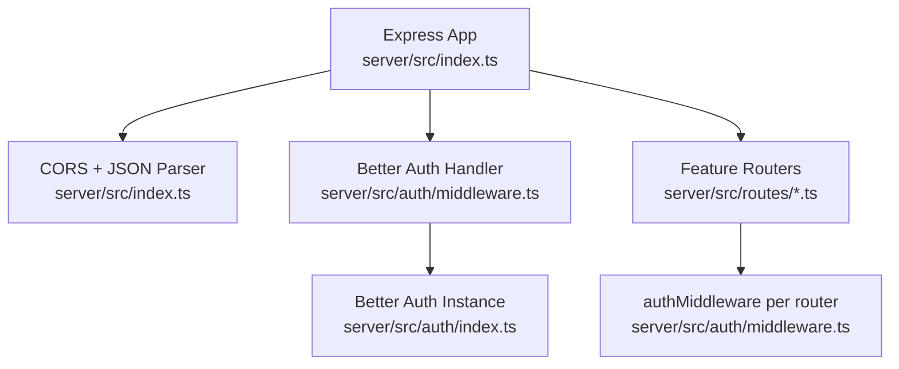
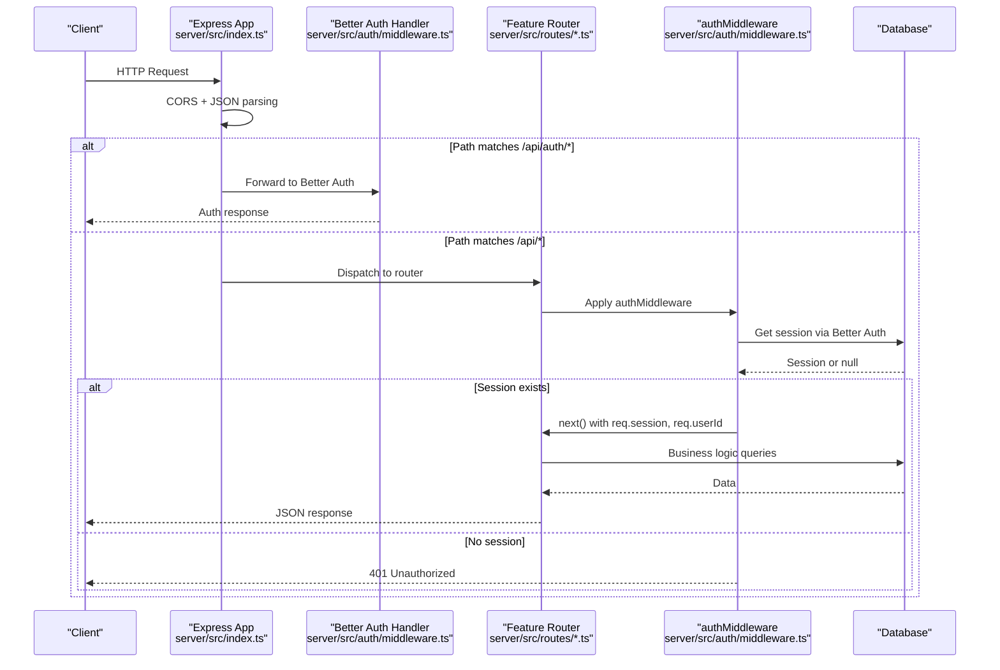
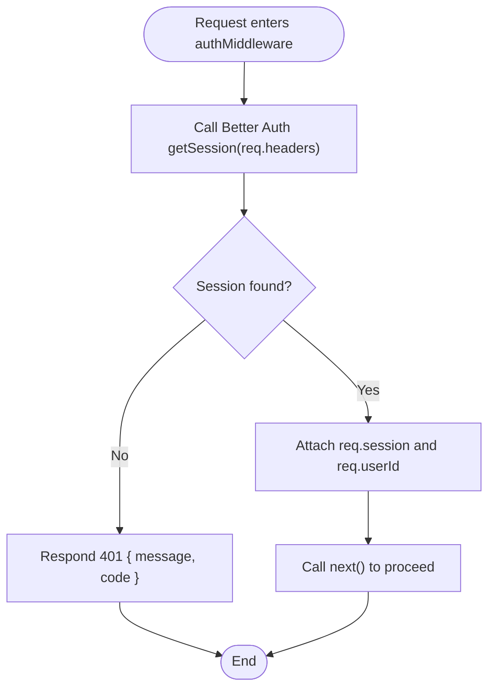
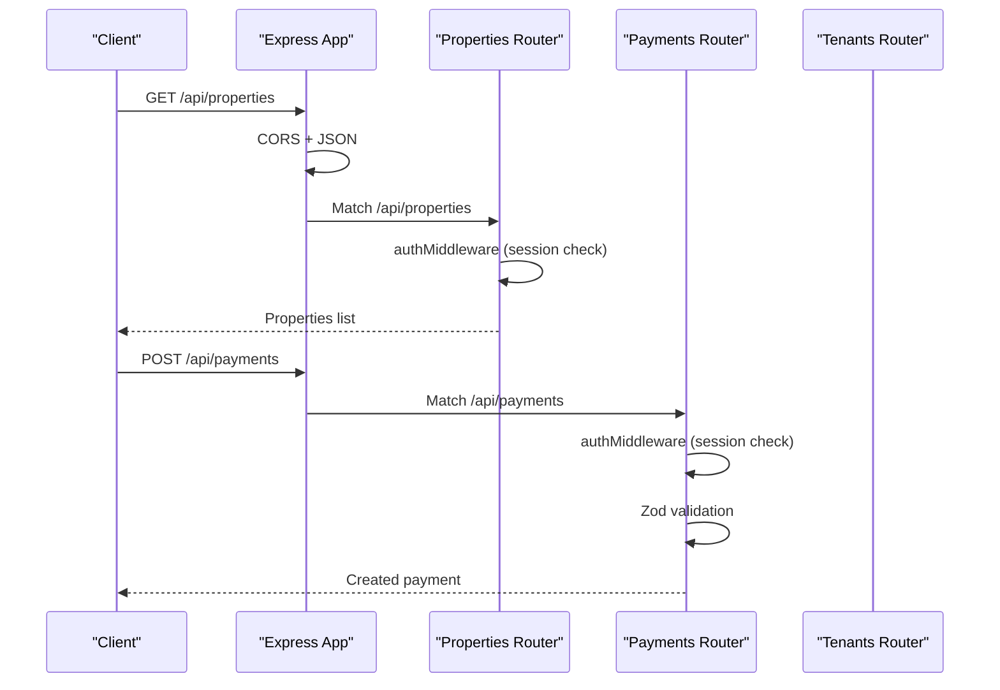
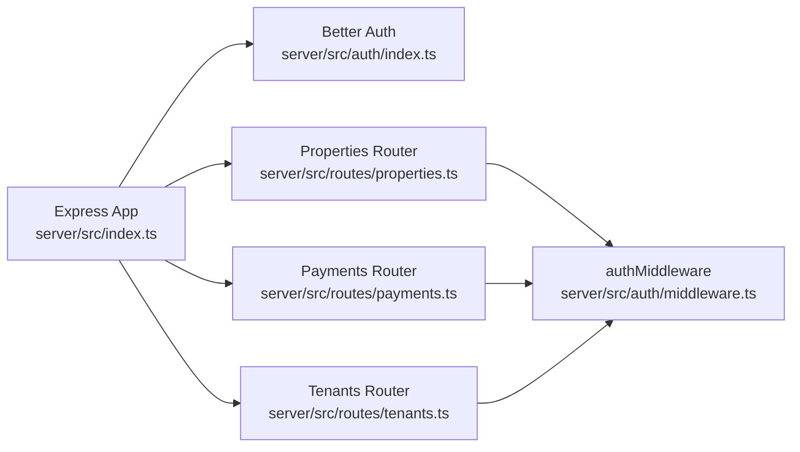

# Middleware Layer

<cite>
**Referenced Files in This Document**
- [server/src/index.ts](file://server/src/index.ts)
- [server/src/auth/index.ts](file://server/src/auth/index.ts)
- [server/src/auth/middleware.ts](file://server/src/auth/middleware.ts)
- [server/src/routes/properties.ts](file://server/src/routes/properties.ts)
- [server/src/routes/payments.ts](file://server/src/routes/payments.ts)
- [server/src/routes/dashboard.ts](file://server/src/routes/dashboard.ts)
- [server/src/routes/tenants.ts](file://server/src/routes/tenants.ts)
- [server/package.json](file://server/package.json)
</cite>

## Table of Contents
1. Introduction
2. Project Structure
3. Core Components
4. Architecture Overview
5. Detailed Component Analysis
6. Dependency Analysis
7. Performance Considerations
8. Troubleshooting Guide
9. Conclusion

## Introduction
This document explains the Express.js middleware layer architecture for the server, focusing on authentication using Better Auth, session management, user context injection, and request flow through the middleware chain. It also covers security-related middleware (CORS), input validation with Zod, and guidance for error handling and performance optimization. Where applicable, diagrams map directly to source files to help you understand how requests are processed end-to-end.

## Project Structure
The server is an Express application that:
- Loads environment configuration
- Applies global middleware (CORS, JSON parsing)
- Mounts Better Auth routes under /api/auth/*
- Mounts feature routers under /api/*, each protected by authMiddleware
- Exposes a health check endpoint

**Diagram sources**
- [server/src/index.ts:34-62](file://server/src/index.ts#L34-L62)
- [server/src/auth/middleware.ts:1-6](file://server/src/auth/middleware.ts#L1-L6)
- [server/src/auth/index.ts:5-20](file://server/src/auth/index.ts#L5-L20)

**Section sources**
- [server/src/index.ts:1-77](file://server/src/index.ts#L1-L77)

## Core Components
- Global middleware: CORS and JSON body parser configured at app level.
- Authentication integration: Better Auth handler mounted at /api/auth/*; custom authMiddleware extracts sessions and injects userId into the request.
- Feature routers: Each domain router mounts its own authMiddleware to protect endpoints.
- Input validation: Route handlers validate payloads with Zod before database operations.

Key responsibilities:
- Enforce cross-origin policy and parse JSON bodies globally.
- Provide a unified way to authenticate requests via Better Auth sessions.
- Inject authenticated user identity into route handlers.
- Validate incoming data consistently using schemas.

**Section sources**
- [server/src/index.ts:37-62](file://server/src/index.ts#L37-L62)
- [server/src/auth/middleware.ts:8-44](file://server/src/auth/middleware.ts#L8-L44)
- [server/src/routes/properties.ts:11-23](file://server/src/routes/properties.ts#L11-L23)
- [server/src/routes/payments.ts:11-22](file://server/src/routes/payments.ts#L11-L22)
- [server/src/routes/tenants.ts:11-20](file://server/src/routes/tenants.ts#L11-L20)

## Architecture Overview
The request lifecycle flows through global middleware first, then either the Better Auth handler or a feature router. Feature routers apply their own authMiddleware to ensure only authenticated users can access protected endpoints.

**Diagram sources**
- [server/src/index.ts:39-62](file://server/src/index.ts#L39-L62)
- [server/src/auth/middleware.ts:9-27](file://server/src/auth/middleware.ts#L9-L27)
- [server/src/routes/properties.ts:8-9](file://server/src/routes/properties.ts#L8-L9)

## Detailed Component Analysis

### Authentication Middleware (Better Auth Integration)
- The Better Auth instance is created with Drizzle adapter and session settings.
- The Better Auth handler is mounted at /api/auth/* to handle sign-in, sign-out, and session management.
- Custom authMiddleware uses Better Auth’s getSession API to validate the current session from request headers and attaches session and userId to the request object.
- optionalAuth allows read-only or public endpoints to optionally attach a session if present.

**Diagram sources**
- [server/src/auth/middleware.ts:9-27](file://server/src/auth/middleware.ts#L9-L27)
- [server/src/auth/index.ts:5-20](file://server/src/auth/index.ts#L5-L20)

**Section sources**
- [server/src/auth/index.ts:1-23](file://server/src/auth/index.ts#L1-L23)
- [server/src/auth/middleware.ts:1-45](file://server/src/auth/middleware.ts#L1-L45)

### Request Flow Through Middleware Chain
- Global middleware runs first: CORS and JSON parsing.
- Routes under /api/auth/* are handled by Better Auth.
- Other /api/* routes are delegated to feature routers, which apply authMiddleware to enforce authentication.
- Route handlers perform input validation with Zod and interact with the database.

**Diagram sources**
- [server/src/index.ts:39-62](file://server/src/index.ts#L39-L62)
- [server/src/routes/properties.ts:8-9](file://server/src/routes/properties.ts#L8-L9)
- [server/src/routes/payments.ts:8-9](file://server/src/routes/payments.ts#L8-L9)
- [server/src/routes/tenants.ts:8-9](file://server/src/routes/tenants.ts#L8-L9)

**Section sources**
- [server/src/index.ts:39-62](file://server/src/index.ts#L39-L62)
- [server/src/routes/properties.ts:8-9](file://server/src/routes/properties.ts#L8-L9)
- [server/src/routes/payments.ts:8-9](file://server/src/routes/payments.ts#L8-L9)
- [server/src/routes/tenants.ts:8-9](file://server/src/routes/tenants.ts#L8-L9)

### Security-Related Middleware
- CORS: Configured globally to allow the client origin and enable credentials.
- Input validation: Each route validates payloads with Zod before processing, returning structured validation errors.
- Rate limiting: Not currently implemented; recommended to add rate limiting middleware for sensitive endpoints (e.g., login, password reset).

Best practices:
- Keep CORS origins explicit and restrict to known domains.
- Use Zod schemas consistently for all inputs.
- Add rate limiting and IP-based throttling for auth endpoints.

**Section sources**
- [server/src/index.ts:39-45](file://server/src/index.ts#L39-L45)
- [server/src/routes/properties.ts:11-23](file://server/src/routes/properties.ts#L11-L23)
- [server/src/routes/payments.ts:11-22](file://server/src/routes/payments.ts#L11-L22)
- [server/src/routes/tenants.ts:11-20](file://server/src/routes/tenants.ts#L11-L20)

### Error Handling Middleware
- Current behavior: Route handlers return consistent JSON error shapes with message and code fields (e.g., VALIDATION, NOT_FOUND).
- Missing: A centralized Express error-handling middleware is not present. Adding one would standardize error responses and logging across the app.

Recommendation:
- Implement a top-level error-handling middleware that catches thrown errors and unhandled rejections, formats them uniformly, and logs them with context.

**Section sources**
- [server/src/routes/properties.ts:51-52](file://server/src/routes/properties.ts#L51-L52)
- [server/src/routes/payments.ts:105-106](file://server/src/routes/payments.ts#L105-L106)
- [server/src/routes/tenants.ts:45-46](file://server/src/routes/tenants.ts#L45-L46)

### Custom Middleware Creation Examples
- Optional authentication: Use optionalAuth to allow endpoints to work both for authenticated and anonymous users, attaching session when available.
- Role-based guard: Create a middleware that checks roles or permissions on req.session.user and denies access for insufficient privileges.
- Audit logging: Create middleware to log method, path, userId, and timestamp for compliance and debugging.
- Request timing: Measure and log request duration per route for performance insights.

Integration tips:
- Place generic middleware early in the chain (CORS, logging, timing).
- Apply feature-specific guards immediately before route handlers.
- Ensure async middleware properly handles errors and calls next().

[No sources needed since this section provides conceptual examples]

## Dependency Analysis
The server depends on Express, Better Auth, Drizzle ORM, and Zod. Feature routers depend on the shared auth middleware and database schema.

**Diagram sources**
- [server/src/index.ts:34-62](file://server/src/index.ts#L34-L62)
- [server/src/auth/middleware.ts:1-6](file://server/src/auth/middleware.ts#L1-L6)
- [server/src/auth/index.ts:1-23](file://server/src/auth/index.ts#L1-L23)
- [server/src/routes/properties.ts:1-9](file://server/src/routes/properties.ts#L1-L9)
- [server/src/routes/payments.ts:1-9](file://server/src/routes/payments.ts#L1-L9)
- [server/src/routes/tenants.ts:1-9](file://server/src/routes/tenants.ts#L1-L9)

**Section sources**
- [server/package.json:15-25](file://server/package.json#L15-L25)
- [server/src/index.ts:34-62](file://server/src/index.ts#L34-L62)

## Performance Considerations
- JSON payload size: Body parser limit is set to 10mb; adjust based on expected uploads.
- Database queries: Prefer selecting only needed columns and using indexes on frequently filtered fields (e.g., userId, unitId).
- Session retrieval: getSession is called per request; consider caching strategies if session lookups become a bottleneck.
- Logging overhead: Avoid heavy synchronous logging in hot paths; use async logging where possible.
- Connection pooling: Ensure database connection pool size matches workload.

[No sources needed since this section provides general guidance]

## Troubleshooting Guide
Common issues and resolutions:
- 401 Unauthorized on protected routes:
  - Ensure the client sends cookies or headers required by Better Auth session resolution.
  - Verify CORS allows credentials and the correct origin.
- Validation errors:
  - Check Zod schemas and ensure request bodies match expected types and constraints.
- Not found errors:
  - Confirm resource IDs exist and belong to the authenticated user.
- CORS failures:
  - Set CLIENT_URL correctly and ensure it matches the browser’s origin.
- Rate limiting:
  - If adding rate limiting, configure appropriate thresholds for auth endpoints to prevent abuse.

**Section sources**
- [server/src/auth/middleware.ts:18-21](file://server/src/auth/middleware.ts#L18-L21)
- [server/src/index.ts:39-45](file://server/src/index.ts#L39-L45)
- [server/src/routes/properties.ts:51-52](file://server/src/routes/properties.ts#L51-L52)
- [server/src/routes/payments.ts:105-106](file://server/src/routes/payments.ts#L105-L106)
- [server/src/routes/tenants.ts:45-46](file://server/src/routes/tenants.ts#L45-L46)

## Conclusion
The middleware layer combines global security (CORS), robust authentication (Better Auth), and consistent input validation (Zod) to protect endpoints and provide a reliable request pipeline. Feature routers apply authMiddleware to enforce access control and validate inputs before performing business logic. To further improve resilience and observability, consider adding centralized error handling, rate limiting, and performance monitoring.

[No sources needed since this section summarizes without analyzing specific files]