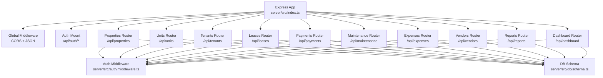
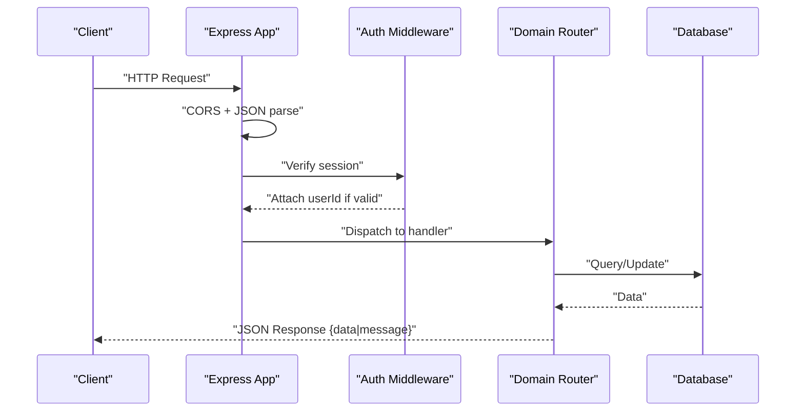
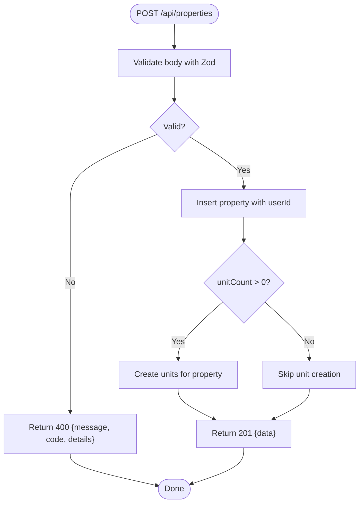
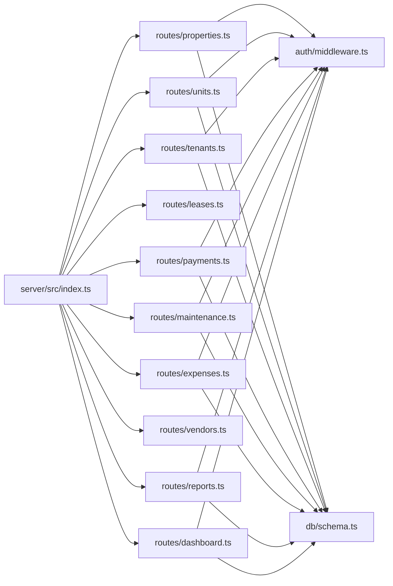

# Routing System

<cite>
**Referenced Files in This Document**
- [server/src/index.ts](file://server/src/index.ts)
- [server/src/auth/middleware.ts](file://server/src/auth/middleware.ts)
- [server/src/routes/properties.ts](file://server/src/routes/properties.ts)
- [server/src/routes/tenants.ts](file://server/src/routes/tenants.ts)
- [server/src/routes/payments.ts](file://server/src/routes/payments.ts)
- [server/src/routes/expenses.ts](file://server/src/routes/expenses.ts)
- [server/src/routes/maintenance.ts](file://server/src/routes/maintenance.ts)
- [server/src/routes/dashboard.ts](file://server/src/routes/dashboard.ts)
- [server/src/routes/reports.ts](file://server/src/routes/reports.ts)
- [server/src/routes/units.ts](file://server/src/routes/units.ts)
- [server/src/db/schema.ts](file://server/src/db/schema.ts)
</cite>

## Table of Contents
1. Introduction
2. Project Structure
3. Core Components
4. Architecture Overview
5. Detailed Component Analysis
6. Dependency Analysis
7. Performance Considerations
8. Troubleshooting Guide
9. Conclusion
10. Appendices

## Introduction
This document explains the Express.js routing system architecture used by the server. It focuses on the modular route organization pattern where each domain (properties, tenants, payments, expenses, maintenance, units, reports, dashboard) has its own dedicated route file. It also documents RESTful API design principles, request handling flow from incoming requests to response generation, common CRUD operations across domains, error handling patterns, validation strategies, response formatting conventions, integration with authentication middleware and the database layer, and guidance for adding new routes following established patterns.

## Project Structure
The server is organized around a central application bootstrap that mounts global middleware and registers domain-specific routers under a consistent base path. Each router encapsulates HTTP endpoints for a single resource or feature area. Authentication is enforced via middleware at the router level. Data access uses Drizzle ORM against a PostgreSQL schema defined centrally.

**Diagram sources**
- [server/src/index.ts:20-62](file://server/src/index.ts#L20-L62)
- [server/src/auth/middleware.ts:1-45](file://server/src/auth/middleware.ts#L1-L45)
- [server/src/db/schema.ts:140-403](file://server/src/db/schema.ts#L140-L403)

**Section sources**
- [server/src/index.ts:20-68](file://server/src/index.ts#L20-L68)

## Core Components
- Application bootstrap and route mounting: Central entry point initializes Express, applies CORS and JSON parsing, mounts Better-Auth handler for authentication endpoints, and mounts all domain routers under /api.
- Authentication middleware: Extracts session using Better-Auth, attaches user identity to the request, and enforces authorization on protected routes.
- Domain routers: Each domain file defines a Router instance, applies auth middleware, implements CRUD endpoints, validates input with Zod, queries/updates data via Drizzle ORM, and returns standardized responses.
- Database schema: Centralized type-safe schema and enums define entities such as property, unit, tenant, lease, payment, maintenanceRequest, expense, vendor, and more.

Key responsibilities:
- Route mounting and URL prefixing ensure clean, resource-based URLs.
- Auth middleware ensures only authenticated users can access protected resources.
- Validation schemas enforce input correctness before persistence.
- Consistent response shape simplifies client consumption.

**Section sources**
- [server/src/index.ts:20-68](file://server/src/index.ts#L20-L68)
- [server/src/auth/middleware.ts:1-45](file://server/src/auth/middleware.ts#L1-L45)
- [server/src/db/schema.ts:140-403](file://server/src/db/schema.ts#L140-L403)

## Architecture Overview
The request lifecycle follows a predictable path:
1. Client sends an HTTP request to /api/<domain>/<resource>.
2. Global middleware parses JSON and handles CORS.
3. For protected routes, auth middleware verifies session and attaches userId to the request.
4. The domain router matches the endpoint and executes handler logic.
5. Handlers validate inputs, query/update the database, and return structured JSON responses.
6. Errors are returned with consistent status codes and message shapes.

**Diagram sources**
- [server/src/index.ts:37-62](file://server/src/index.ts#L37-L62)
- [server/src/auth/middleware.ts:9-27](file://server/src/auth/middleware.ts#L9-L27)
- [server/src/routes/properties.ts:26-103](file://server/src/routes/properties.ts#L26-L103)

## Detailed Component Analysis

### Properties Router
- Purpose: Manage properties and auto-create associated units upon creation.
- Endpoints:
  - GET /api/properties — list properties owned by the current user, including related units.
  - GET /api/properties/:id — retrieve a specific property with ownership check.
  - POST /api/properties — create a property; optionally creates multiple units based on unitCount.
  - PUT /api/properties/:id — update fields with partial payload.
  - DELETE /api/properties/:id — delete property after ownership verification.
- Validation: Uses Zod schemas for create and update payloads.
- Authorization: Enforced via router-level authMiddleware; queries filter by userId.
- Response format: Success returns { data: ... }, not found returns { message, code }.

**Diagram sources**
- [server/src/routes/properties.ts:48-71](file://server/src/routes/properties.ts#L48-L71)

**Section sources**
- [server/src/routes/properties.ts:1-106](file://server/src/routes/properties.ts#L1-L106)

### Tenants Router
- Purpose: Manage tenant records scoped to the authenticated user.
- Endpoints:
  - GET /api/tenants — list tenants for the user.
  - GET /api/tenants/:id — get tenant by id with ownership check.
  - POST /api/tenants — create tenant with validated payload.
  - PUT /api/tenants/:id — update tenant fields partially.
  - DELETE /api/tenants/:id — delete tenant after ownership verification.
- Validation: Zod schema for create and partial updates.
- Authorization: All handlers enforce ownership via userId.

**Section sources**
- [server/src/routes/tenants.ts:1-83](file://server/src/routes/tenants.ts#L1-L83)

### Payments Router
- Purpose: Record and manage rent payments, provide monthly summaries.
- Endpoints:
  - GET /api/payments — list payments filtered by month/year/status/unitId, scoped to user’s properties.
  - GET /api/payments/summary — compute expected, collected, outstanding amounts and collection rate for a given month/year.
  - POST /api/payments — create payment record with validation.
  - PUT /api/payments/:id — update payment fields (e.g., mark received).
  - DELETE /api/payments/:id — delete payment after existence check.
- Validation: Zod schema for create and partial updates.
- Authorization: List endpoints scope results to user’s properties.

**Section sources**
- [server/src/routes/payments.ts:1-137](file://server/src/routes/payments.ts#L1-L137)

### Expenses Router
- Purpose: Track property-related expenses with categorization and optional unit association.
- Endpoints:
  - GET /api/expenses — list expenses filtered by property/category/year/month, scoped to user’s properties.
  - GET /api/expenses/:id — get expense by id.
  - POST /api/expenses — create expense with validation and property ownership verification.
  - PUT /api/expenses/:id — update expense fields partially.
  - DELETE /api/expenses/:id — delete expense after existence check.
- Validation: Zod schema for create and partial updates.
- Authorization: Ownership checks ensure users cannot modify others’ properties’ expenses.

**Section sources**
- [server/src/routes/expenses.ts:1-106](file://server/src/routes/expenses.ts#L1-L106)

### Maintenance Router
- Purpose: Manage maintenance requests linked to units, tenants, and properties.
- Endpoints:
  - GET /api/maintenance — list requests scoped to user’s properties with optional filters.
  - GET /api/maintenance/:id — get request details with related unit/tenant/vendor.
  - POST /api/maintenance — submit a request with validation.
  - PUT /api/maintenance/:id — update status and completion photos; set completedAt when marked completed.
  - DELETE /api/maintenance/:id — delete request after existence check.
- Validation: Zod schema for create and partial updates.
- Authorization: Scoped to user’s properties on list; individual endpoints verify existence.

**Section sources**
- [server/src/routes/maintenance.ts:1-103](file://server/src/routes/maintenance.ts#L1-L103)

### Units Router
- Purpose: Manage rental units tied to properties.
- Endpoints:
  - GET /api/units — list units, optionally filtered by propertyId, scoped to user’s properties.
  - GET /api/units/:id — get unit with property relation and ownership check.
  - POST /api/units — create unit with validation and property ownership verification.
  - PUT /api/units/:id — update unit fields partially with ownership check.
  - DELETE /api/units/:id — delete unit after ownership verification.
- Validation: Zod schemas for create and partial updates.
- Authorization: Ownership checks ensure users can only manage their own units.

**Section sources**
- [server/src/routes/units.ts:1-123](file://server/src/routes/units.ts#L1-L123)

### Dashboard Router
- Purpose: Provide aggregated landlord overview metrics.
- Endpoints:
  - GET /api/dashboard — compute occupancy, rent collection rates, financial totals, open maintenance, expiring leases, and alerts scoped to user’s properties.
- Authorization: Scopes all queries to the authenticated user.

**Section sources**
- [server/src/routes/dashboard.ts:1-124](file://server/src/routes/dashboard.ts#L1-L124)

### Reports Router
- Purpose: Generate financial and tax-oriented reports per property.
- Endpoints:
  - GET /api/reports/cashflow — monthly cash flow per property for a year.
  - GET /api/reports/schedule-e — Schedule E line-item mapping and totals per property for a year.
  - GET /api/reports/pnl — profit & loss per property for a year or quarter.
- Authorization: Scopes all queries to the authenticated user.

**Section sources**
- [server/src/routes/reports.ts:1-186](file://server/src/routes/reports.ts#L1-L186)

## Dependency Analysis
- Application mounts routers under /api prefixes, ensuring clear separation of concerns.
- Each router depends on:
  - Auth middleware for session extraction and user identity.
  - Drizzle ORM for type-safe queries and mutations.
  - Zod schemas for input validation.
  - Centralized schema definitions for entity types and enums.
- Cross-domain relationships are handled within handlers by querying related tables (e.g., payments scoped to units belonging to user’s properties).

**Diagram sources**
- [server/src/index.ts:20-62](file://server/src/index.ts#L20-L62)
- [server/src/auth/middleware.ts:1-45](file://server/src/auth/middleware.ts#L1-L45)
- [server/src/db/schema.ts:140-403](file://server/src/db/schema.ts#L140-L403)

**Section sources**
- [server/src/index.ts:20-62](file://server/src/index.ts#L20-L62)

## Performance Considerations
- Use query filtering at the database level where possible (e.g., filter by userId and propertyIds) to reduce client-side processing.
- Avoid loading entire datasets into memory when large result sets are possible; consider pagination for lists.
- Prefer selective column fetching (e.g., columns: { id: true }) when only identifiers are needed for scoping.
- Cache expensive aggregations (dashboard, reports) if accessed frequently, considering invalidation strategies.
- Keep validation schemas minimal and focused to reduce overhead.

[No sources needed since this section provides general guidance]

## Troubleshooting Guide
Common issues and resolutions:
- Unauthorized access: Ensure the client includes a valid session token; auth middleware returns 401 with { message, code } when no session is present.
- Validation errors: Check request payloads against Zod schemas; validation failures return 400 with { message, code, details }.
- Not found: When resources do not exist or ownership checks fail, handlers return 404 with { message, code }.
- Property ownership mismatches: Ensure userId is correctly attached by auth middleware and used in queries to scope data.

Error handling patterns:
- Input validation: Use safeParse to validate payloads and return structured error responses.
- Resource existence: Verify existence before updates/deletes and return appropriate 404 responses.
- Authorization: Always scope queries by userId and verify ownership for sensitive operations.

Response formatting conventions:
- Success responses wrap data in { data: ... }.
- Error responses include { message, code } and sometimes details for validation errors.
- Status codes follow REST conventions: 201 for created, 400 for validation, 401 for unauthorized, 404 for not found.

**Section sources**
- [server/src/auth/middleware.ts:9-27](file://server/src/auth/middleware.ts#L9-L27)
- [server/src/routes/properties.ts:26-103](file://server/src/routes/properties.ts#L26-L103)
- [server/src/routes/tenants.ts:23-80](file://server/src/routes/tenants.ts#L23-L80)
- [server/src/routes/payments.ts:25-134](file://server/src/routes/payments.ts#L25-L134)
- [server/src/routes/expenses.ts:31-103](file://server/src/routes/expenses.ts#L31-L103)
- [server/src/routes/maintenance.ts:26-100](file://server/src/routes/maintenance.ts#L26-L100)
- [server/src/routes/units.ts:24-120](file://server/src/routes/units.ts#L24-L120)

## Conclusion
The routing system follows a clean, modular pattern with one router per domain, consistent RESTful endpoint design, robust validation, and centralized authentication and database layers. This structure makes it straightforward to add new features while maintaining consistency in security, error handling, and response formats.

[No sources needed since this section summarizes without analyzing specific files]

## Appendices

### Adding New Routes: Step-by-Step Guidance
1. Create a new router file under server/src/routes named after your domain (e.g., invoices.ts).
2. Import Express Router, Zod, Drizzle ORM utilities, db, schema, and authMiddleware.
3. Define Zod schemas for create and update payloads.
4. Apply authMiddleware at the top of the router to protect endpoints.
5. Implement CRUD endpoints:
   - GET / — list items scoped to the authenticated user.
   - GET /:id — retrieve a single item with ownership verification.
   - POST / — create with validation and ownership checks where applicable.
   - PUT /:id — update with partial payload and ownership verification.
   - DELETE /:id — delete after existence and ownership checks.
6. Return standardized responses:
   - Success: { data: ... }
   - Validation error: 400 with { message, code, details }
   - Not found: 404 with { message, code }
7. Register the router in server/src/index.ts under /api/<domain>.
8. Add any necessary schema definitions in server/src/db/schema.ts if new entities are introduced.

Example references for patterns:
- Router setup and auth middleware usage: [server/src/routes/properties.ts:1-9](file://server/src/routes/properties.ts#L1-L9)
- Validation and CRUD implementation: [server/src/routes/tenants.ts:11-80](file://server/src/routes/tenants.ts#L11-L80)
- Registration in app: [server/src/index.ts:53-62](file://server/src/index.ts#L53-L62)

**Section sources**
- [server/src/routes/properties.ts:1-9](file://server/src/routes/properties.ts#L1-L9)
- [server/src/routes/tenants.ts:11-80](file://server/src/routes/tenants.ts#L11-L80)
- [server/src/index.ts:53-62](file://server/src/index.ts#L53-L62)