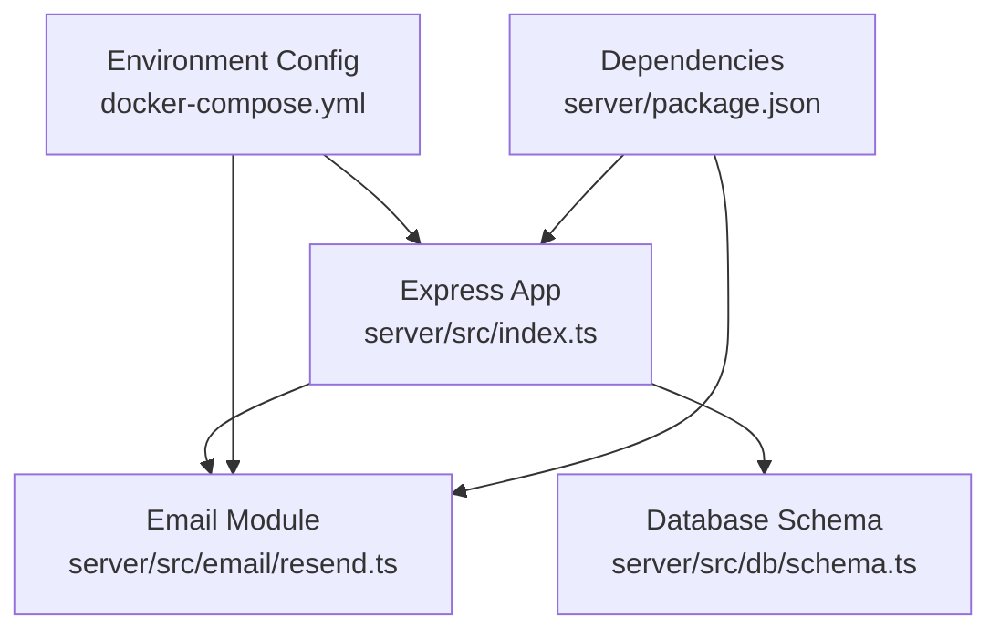
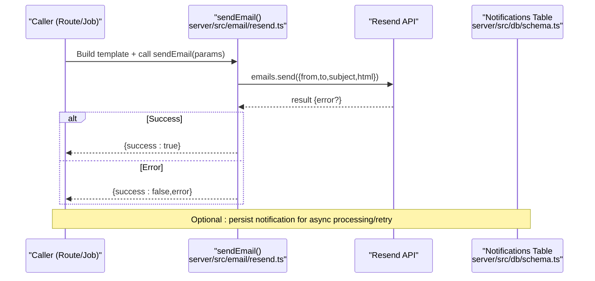
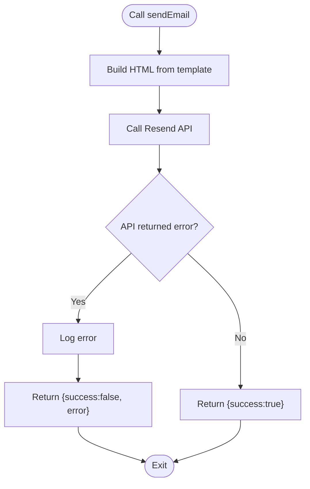
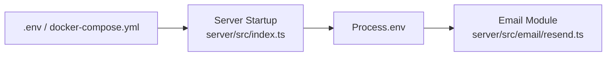
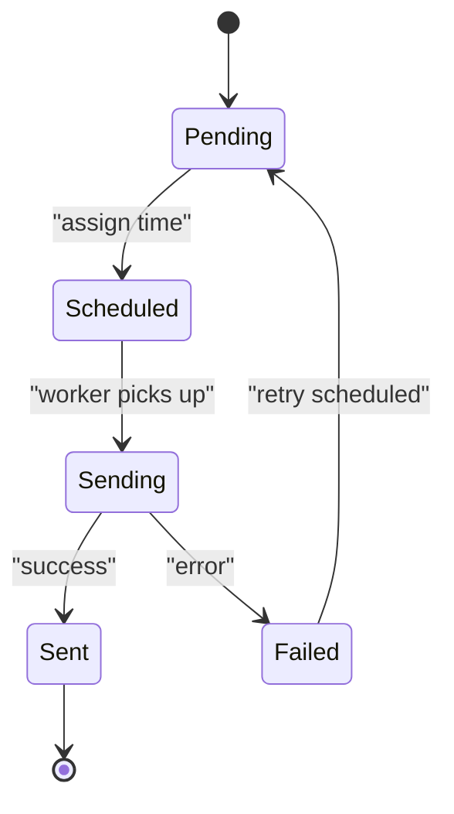
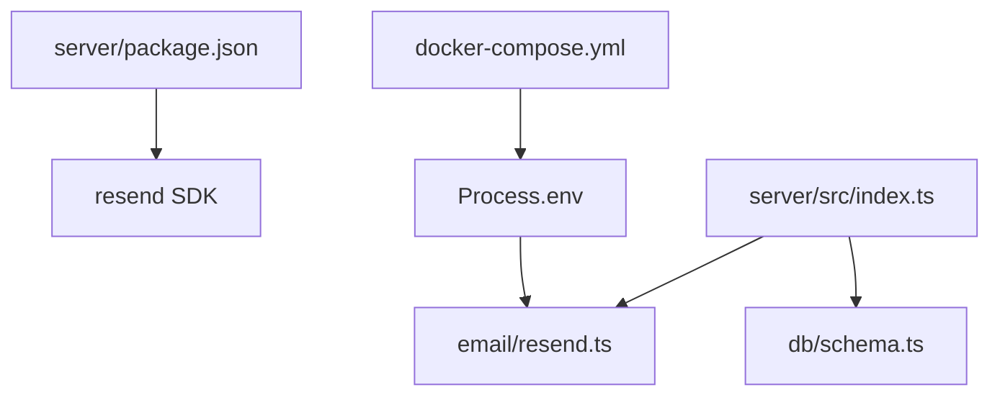

# Service Integrations

<cite>
**Referenced Files in This Document**
- [resend.ts](file://server/src/email/resend.ts)
- [index.ts](file://server/src/index.ts)
- [docker-compose.yml](file://docker-compose.yml)
- [package.json](file://server/package.json)
- [schema.ts](file://server/src/db/schema.ts)
</cite>

## Table of Contents
1. [Introduction](#introduction)
2. [Project Structure](#project-structure)
3. [Core Components](#core-components)
4. [Architecture Overview](#architecture-overview)
5. [Detailed Component Analysis](#detailed-component-analysis)
6. [Dependency Analysis](#dependency-analysis)
7. [Performance Considerations](#performance-considerations)
8. [Troubleshooting Guide](#troubleshooting-guide)
9. [Conclusion](#conclusion)
10. [Appendices](#appendices)

## Introduction
This document explains how external service integrations are implemented in the backend, with a focus on email delivery via Resend and the notification system design. It covers configuration, template management, sending patterns, error handling, retry and fallback strategies, environment-specific settings, monitoring/logging, security considerations, troubleshooting, and performance optimization. It also provides guidance for implementing new service integrations following established patterns.

## Project Structure
The backend is an Express application that wires routes and middleware at startup and loads environment variables from multiple locations. Email functionality is encapsulated in a dedicated module that exposes a send function and template builders. The database schema includes a notifications table to support asynchronous or queued notifications.

**Diagram sources**
- [index.ts:1-77](file://server/src/index.ts#L1-L77)
- [resend.ts:1-113](file://server/src/email/resend.ts#L1-L113)
- [docker-compose.yml:20-46](file://docker-compose.yml#L20-L46)
- [package.json:15-25](file://server/package.json#L15-L25)
- [schema.ts:367-383](file://server/src/db/schema.ts#L367-L383)

**Section sources**
- [index.ts:1-77](file://server/src/index.ts#L1-L77)
- [docker-compose.yml:20-46](file://docker-compose.yml#L20-L46)
- [package.json:15-25](file://server/package.json#L15-L25)

## Core Components
- Email integration module: Provides a single send function and template builders for rent reminders, receipts, and maintenance updates.
- Environment configuration: Loads .env files at startup and defines environment variables for services including Resend.
- Notification schema: Defines a persistent model for notifications with fields for type, channel, recipient, subject, body, status, scheduling, and timestamps.

Key responsibilities:
- Centralize external API client initialization and error handling.
- Provide reusable templates for consistent messaging.
- Persist notifications for tracking and potential retries.

**Section sources**
- [resend.ts:1-113](file://server/src/email/resend.ts#L1-L113)
- [index.ts:1-19](file://server/src/index.ts#L1-L19)
- [schema.ts:367-383](file://server/src/db/schema.ts#L367-L383)

## Architecture Overview
The email flow uses a thin abstraction over the Resend SDK. Routes or background jobs can call the send function with a prebuilt HTML template. Configuration is injected via environment variables. Notifications can be persisted to the database to enable queuing and retry workflows.

**Diagram sources**
- [resend.ts:7-30](file://server/src/email/resend.ts#L7-L30)
- [schema.ts:367-383](file://server/src/db/schema.ts#L367-L383)

## Detailed Component Analysis

### Email Integration (Resend)
- Client initialization: Reads the API key from environment with a test-time fallback.
- Sending pattern: A single exported function accepts recipient, subject, and HTML content, returns a structured success/error object, and logs errors.
- Templates: Separate functions generate HTML strings for common scenarios (rent reminder, receipt, maintenance update).

**Diagram sources**
- [resend.ts:7-30](file://server/src/email/resend.ts#L7-L30)
- [resend.ts:34-112](file://server/src/email/resend.ts#L34-L112)

**Section sources**
- [resend.ts:1-113](file://server/src/email/resend.ts#L1-L113)

### Configuration Management
- Environment loading: The server resolves .env from multiple paths at startup to support local and containerized runs.
- Service credentials: Docker Compose injects RESEND_API_KEY and other service keys into the server process.
- Runtime usage: The email module reads the API key directly from process environment.

**Diagram sources**
- [index.ts:1-19](file://server/src/index.ts#L1-L19)
- [docker-compose.yml:20-46](file://docker-compose.yml#L20-L46)
- [resend.ts:1-5](file://server/src/email/resend.ts#L1-L5)

**Section sources**
- [index.ts:1-19](file://server/src/index.ts#L1-L19)
- [docker-compose.yml:20-46](file://docker-compose.yml#L20-L46)
- [resend.ts:1-5](file://server/src/email/resend.ts#L1-L5)

### Notification System Design
- Schema: A notifications table supports different channels (e.g., email), recipients, subjects, bodies, statuses, and scheduling timestamps.
- Pattern: Create a notification record with status pending/scheduled; a worker or job processes it by calling the appropriate channel handler (e.g., email). On success, mark sent; on failure, mark failed and schedule retries.

**Diagram sources**
- [schema.ts:367-383](file://server/src/db/schema.ts#L367-L383)

**Section sources**
- [schema.ts:367-383](file://server/src/db/schema.ts#L367-L383)

### Implementing New Service Integrations
Follow these steps to integrate another external service (e.g., SMS, payments):
1. Add dependencies and environment variables in package.json and docker-compose.yml.
2. Create a dedicated module under src/services/<service>.ts:
   - Initialize the client using environment variables.
   - Export typed functions for each operation with clear return types.
   - Centralize error handling and logging.
3. Integrate with the notification system:
   - Persist a notification record when initiating an action.
   - Use a worker/job to execute and update status.
4. Expose through routes if needed, keeping business logic out of route handlers.

[No sources needed since this section provides general guidance]

## Dependency Analysis
- External libraries:
  - Resend SDK used by the email module.
  - Express app bootstraps routes and middleware.
- Environment-driven configuration:
  - Docker Compose supplies service credentials and runtime values.
- Database schema:
  - Notifications table enables durable queues and auditability.

**Diagram sources**
- [package.json:15-25](file://server/package.json#L15-L25)
- [docker-compose.yml:20-46](file://docker-compose.yml#L20-L46)
- [resend.ts:1-5](file://server/src/email/resend.ts#L1-L5)
- [index.ts:20-32](file://server/src/index.ts#L20-L32)
- [schema.ts:367-383](file://server/src/db/schema.ts#L367-L383)

**Section sources**
- [package.json:15-25](file://server/package.json#L15-L25)
- [docker-compose.yml:20-46](file://docker-compose.yml#L20-L46)
- [resend.ts:1-5](file://server/src/email/resend.ts#L1-L5)
- [index.ts:20-32](file://server/src/index.ts#L20-L32)
- [schema.ts:367-383](file://server/src/db/schema.ts#L367-L383)

## Performance Considerations
- Template rendering: Keep templates lightweight and avoid heavy computations inside them.
- Concurrency: For high-volume sends, consider batching and rate limiting at the service level.
- Retries: Implement exponential backoff for transient failures when building workers.
- Observability: Add metrics around send attempts, successes, and failures to detect degradation early.

[No sources needed since this section provides general guidance]

## Troubleshooting Guide
Common issues and resolutions:
- Missing or invalid API key:
  - Ensure RESEND_API_KEY is set in the environment and accessible to the server process.
  - Verify docker-compose environment mapping and .env file presence.
- Network or API errors:
  - Check logs for error messages returned by the email module.
  - Inspect network connectivity and DNS resolution in the deployment environment.
- Template issues:
  - Validate HTML output from template functions before sending.
  - Test with known-good recipients to isolate formatting problems.
- Notification backlog:
  - Review notification records for stuck statuses and reschedule or reprocess failed items.

Operational checks:
- Confirm environment variables are loaded at startup.
- Validate that the server listens on the expected port and routes are mounted.

**Section sources**
- [resend.ts:7-30](file://server/src/email/resend.ts#L7-L30)
- [index.ts:1-19](file://server/src/index.ts#L1-L19)
- [docker-compose.yml:20-46](file://docker-compose.yml#L20-L46)

## Conclusion
The backend centralizes external integrations behind clean modules, starting with email via Resend. Configuration is environment-driven, templates are isolated, and the notification schema supports robust, observable workflows. Following the established patterns makes it straightforward to add new services while maintaining reliability, security, and observability.

[No sources needed since this section summarizes without analyzing specific files]

## Appendices

### Security Considerations
- Never hardcode secrets; always use environment variables.
- Limit access to secrets at the platform level (container orchestration, secret managers).
- Avoid logging sensitive data; sanitize logs for tokens, keys, and personal information.
- Validate all inputs before passing to external APIs.

[No sources needed since this section provides general guidance]

### Monitoring and Logging Strategy
- Log structured events for send attempts, outcomes, and errors.
- Track per-template metrics to identify problematic flows.
- Persist notification lifecycle events for auditing and debugging.
- Set up alerts for sustained failure rates or latency spikes.

[No sources needed since this section provides general guidance]