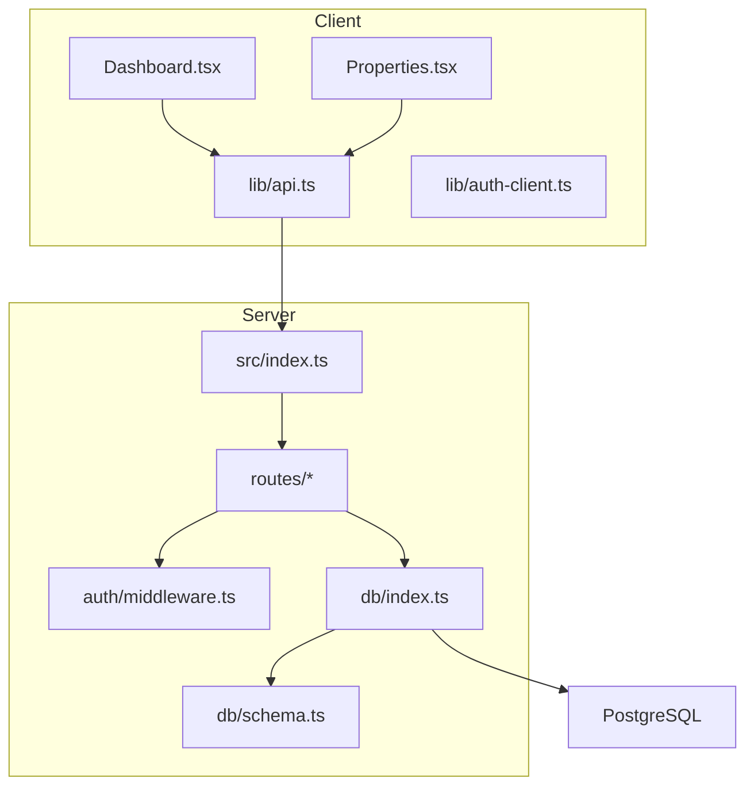
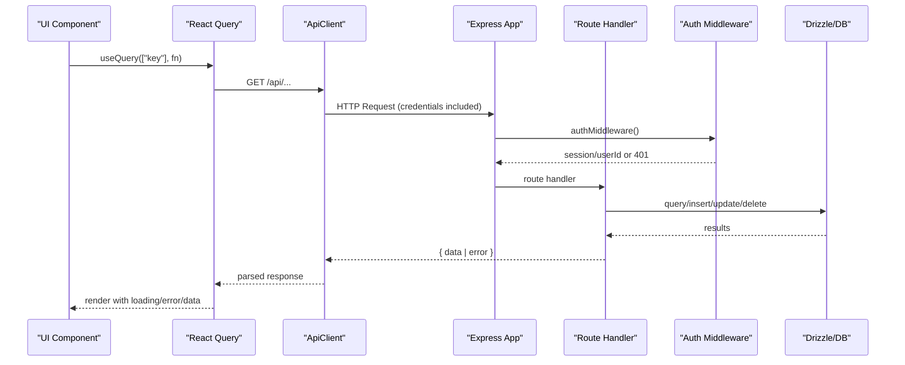
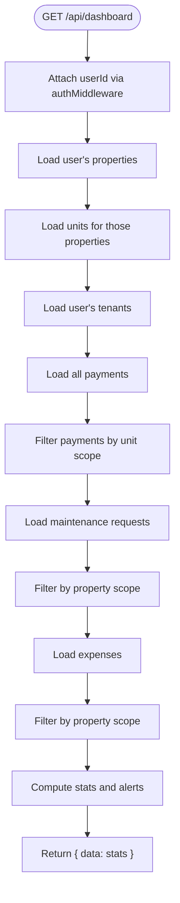
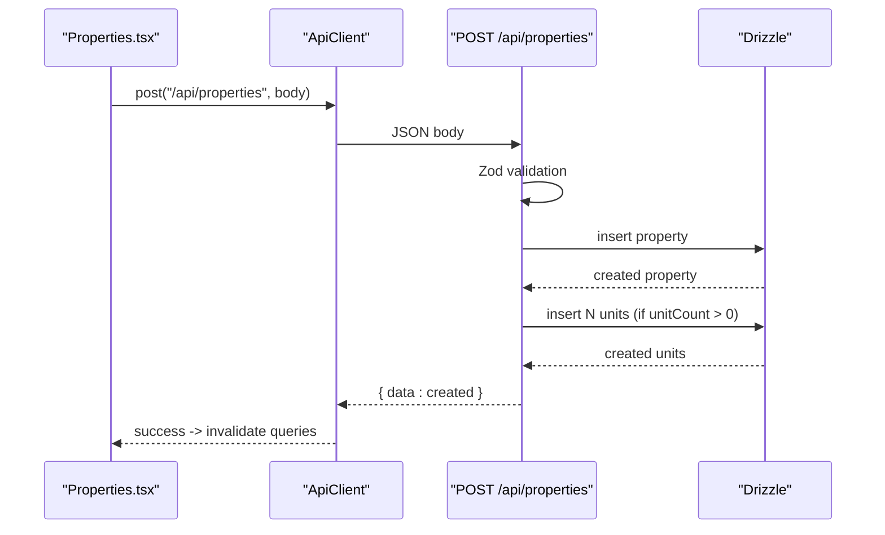
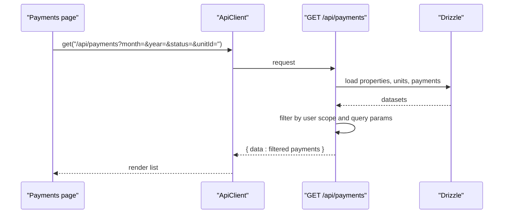
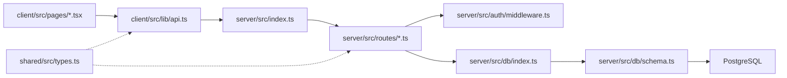

# Data Flow Patterns

<cite>
**Referenced Files in This Document**
- [api.ts](file://client/src/lib/api.ts)
- [auth-client.ts](file://client/src/lib/auth-client.ts)
- [auth-context.tsx](file://client/src/contexts/auth-context.tsx)
- [Dashboard.tsx](file://client/src/pages/Dashboard.tsx)
- [Properties.tsx](file://client/src/pages/Properties.tsx)
- [index.ts](file://server/src/index.ts)
- [middleware.ts](file://server/src/auth/middleware.ts)
- [schema.ts](file://server/src/db/schema.ts)
- [db/index.ts](file://server/src/db/index.ts)
- [dashboard.ts](file://server/src/routes/dashboard.ts)
- [properties.ts](file://server/src/routes/properties.ts)
- [payments.ts](file://server/src/routes/payments.ts)
- [tenants.ts](file://server/src/routes/tenants.ts)
- [expenses.ts](file://server/src/routes/expenses.ts)
- [types.ts](file://shared/src/types.ts)
</cite>

## Table of Contents
1. [Introduction](#introduction)
2. [Project Structure](#project-structure)
3. [Core Components](#core-components)
4. [Architecture Overview](#architecture-overview)
5. [Detailed Component Analysis](#detailed-component-analysis)
6. [Dependency Analysis](#dependency-analysis)
7. [Performance Considerations](#performance-considerations)
8. [Troubleshooting Guide](#troubleshooting-guide)
9. [Conclusion](#conclusion)

## Introduction
This document explains the end-to-end data flow patterns in RentLite, focusing on client-server communication via REST APIs with TypeScript type safety across the stack. It traces requests from UI components through API routes to database queries, documents error handling and status code conventions, outlines DTO-like response shapes, and discusses caching and performance strategies. Real-time updates are not implemented; the application uses React Query for caching and refetching, which can be combined with polling if needed.

## Project Structure
RentLite is a three-layer monorepo:
- Client (React + Vite): UI pages and a typed HTTP client that calls server endpoints.
- Server (Express): Routes with authentication, validation, and Drizzle ORM queries against PostgreSQL.
- Shared types: A shared package exporting TypeScript interfaces used by both client and server for consistent contracts.

**Diagram sources**
- [index.ts:34-62](file://server/src/index.ts#L34-L62)
- [api.ts:26-54](file://client/src/lib/api.ts#L26-L54)
- [db/index.ts:18-24](file://server/src/db/index.ts#L18-L24)
- [schema.ts:191-403](file://server/src/db/schema.ts#L191-L403)

**Section sources**
- [index.ts:34-62](file://server/src/index.ts#L34-L62)
- [api.ts:26-54](file://client/src/lib/api.ts#L26-L54)

## Core Components
- Client API client: Centralized fetch wrapper with base URL, parameter building, JSON serialization, credentials handling, and unified error handling including redirect on 401.
- Authentication: Better-Auth session middleware validates sessions and attaches user context to requests; client provides auth hooks for login state.
- Routes: Feature-scoped Express routers under /api/* with Zod validation, ownership checks, and Drizzle queries returning normalized responses.
- Database: Drizzle ORM models and relations mapped to PostgreSQL schema.

Key responsibilities:
- Client: Build URLs, send requests, handle errors, cache via React Query.
- Server: Authenticate, validate input, enforce authorization, query DB, return standardized payloads.
- Shared types: Define domain models and API response shapes for type safety.

**Section sources**
- [api.ts:1-82](file://client/src/lib/api.ts#L1-L82)
- [middleware.ts:9-27](file://server/src/auth/middleware.ts#L9-L27)
- [types.ts:236-251](file://shared/src/types.ts#L236-L251)

## Architecture Overview
The request lifecycle flows from UI components through a typed HTTP client to Express routes protected by authentication, then to Drizzle ORM queries against PostgreSQL. Responses are wrapped in a consistent shape for predictable consumption on the client.

**Diagram sources**
- [Dashboard.tsx:23-27](file://client/src/pages/Dashboard.tsx#L23-L27)
- [api.ts:26-54](file://client/src/lib/api.ts#L26-L54)
- [index.ts:34-62](file://server/src/index.ts#L34-L62)
- [middleware.ts:9-27](file://server/src/auth/middleware.ts#L9-L27)
- [dashboard.ts:11-121](file://server/src/routes/dashboard.ts#L11-L121)

## Detailed Component Analysis

### Client API Layer and Type Safety
- Base URL and parameters: The client constructs URLs using environment variables and appends query params safely.
- Request pipeline: Sets JSON content type, includes credentials, handles 401 by redirecting to login, parses non-ok responses into a uniform error object, and returns JSON for ok responses.
- Convenience methods: get/post/put/delete wrap the core request method with appropriate HTTP verbs and body serialization.

Type safety:
- The client returns generic T for typed responses.
- Shared types define domain entities and common response envelopes like ApiError and PaginatedResponse, enabling compile-time checks across client and server.

**Section sources**
- [api.ts:1-82](file://client/src/lib/api.ts#L1-L82)
- [types.ts:236-251](file://shared/src/types.ts#L236-L251)

### Authentication and Authorization
- Server-side: Auth middleware retrieves the session using Better-Auth, attaches userId to the request, and returns 401 when unauthorized.
- Client-side: Auth client exposes signIn/signUp/useSession; an AuthContext wraps the app to expose current user and loading state.

Authorization pattern:
- Each route enforces ownership by filtering queries with the authenticated userId (e.g., properties, tenants, expenses).

**Section sources**
- [middleware.ts:9-27](file://server/src/auth/middleware.ts#L9-L27)
- [auth-client.ts:1-13](file://client/src/lib/auth-client.ts#L1-L13)
- [auth-context.tsx:16-33](file://client/src/contexts/auth-context.tsx#L16-L33)
- [properties.ts:26-33](file://server/src/routes/properties.ts#L26-L33)

### Route Handlers and Data Access

#### Dashboard
- Aggregates metrics across properties, units, tenants, payments, maintenance, and expenses scoped to the current user.
- Computes occupancy rate, collection rate, monthly income/expenses, and alerts such as open maintenance and expiring leases.
- Returns a single aggregated payload under a data envelope.

**Diagram sources**
- [dashboard.ts:11-121](file://server/src/routes/dashboard.ts#L11-L121)

**Section sources**
- [dashboard.ts:11-121](file://server/src/routes/dashboard.ts#L11-L121)

#### Properties
- CRUD endpoints with Zod validation for create/update.
- Ownership enforcement ensures users only access their own properties.
- Auto-creates units based on unitCount when creating a property.

**Diagram sources**
- [Properties.tsx:49-77](file://client/src/pages/Properties.tsx#L49-L77)
- [properties.ts:48-71](file://server/src/routes/properties.ts#L48-L71)

**Section sources**
- [properties.ts:11-106](file://server/src/routes/properties.ts#L11-L106)
- [Properties.tsx:49-77](file://client/src/pages/Properties.tsx#L49-L77)

#### Payments
- List with optional filters (month, year, status, unitId).
- Summary endpoint computes totals and rates for the selected month.
- Create/update/delete with validation and existence checks.

**Diagram sources**
- [payments.ts:24-59](file://server/src/routes/payments.ts#L24-L59)

**Section sources**
- [payments.ts:24-137](file://server/src/routes/payments.ts#L24-L137)

#### Tenants and Expenses
- Tenants: CRUD with email/phone optional fields, ordered by creation date, scoped to user.
- Expenses: CRUD with category enums and optional unit association; listing supports property/category/year/month filters; creation verifies property ownership.

**Section sources**
- [tenants.ts:22-83](file://server/src/routes/tenants.ts#L22-L83)
- [expenses.ts:30-106](file://server/src/routes/expenses.ts#L30-L106)

### Data Transformation Layers and DTOs
- Response envelope: Most routes return { data: ... }, centralizing successful payloads.
- Error envelope: Errors include message and code, sometimes details for validation errors.
- Domain models: Shared types define entities like Property, Unit, Tenant, Lease, Payment, MaintenanceRequest, Expense, Vendor, Notification, Subscription, and report structures. These types ensure consistency between client and server contracts.

Best practices observed:
- Use Zod schemas at the route boundary to validate inputs before persistence.
- Normalize responses to a data envelope to simplify client consumption.
- Keep business logic in routes/services rather than in the database layer.

**Section sources**
- [properties.ts:25-46](file://server/src/routes/properties.ts#L25-L46)
- [payments.ts:89-100](file://server/src/routes/payments.ts#L89-L100)
- [types.ts:7-227](file://shared/src/types.ts#L7-L227)

### Caching Strategies and Performance Optimization
- Client-side caching: React Query caches queries by key, reduces network requests, and enables background refetches.
- Invalidation: Mutations trigger invalidation of related queries to keep UI in sync.
- Pagination: Shared PaginatedResponse type supports scalable lists; implement pagination in routes where large datasets are expected.
- Query optimization: Prefer selecting only needed columns and using indexes on frequently filtered fields (e.g., userId, propertyId, unitId).
- Avoid N+1 queries: When aggregating across multiple tables, consider batching or using joins where supported by your ORM setup.

[No sources needed since this section provides general guidance]

### Real-Time Updates and Polling
- No real-time transport (WebSocket/SSE) is present in the codebase.
- Recommended approach: Use React Query polling (refetchInterval) for dashboards or critical lists to approximate real-time behavior without server changes.
- Alternatively, integrate WebSockets or SSE for live updates if low-latency notifications are required.

[No sources needed since this section provides general guidance]

### Data Validation and Sanitization
- Input validation: Zod schemas enforce field presence, types, enums, and ranges at the API boundary.
- Output sanitization: Responses are constructed from ORM models; avoid exposing sensitive fields by selecting only necessary columns.
- Ownership checks: All write operations verify resource ownership using the authenticated userId.
- Error normalization: Validation failures return structured errors with message, code, and details.

**Section sources**
- [properties.ts:11-23](file://server/src/routes/properties.ts#L11-L23)
- [payments.ts:11-22](file://server/src/routes/payments.ts#L11-L22)
- [tenants.ts:11-20](file://server/src/routes/tenants.ts#L11-L20)
- [expenses.ts:11-28](file://server/src/routes/expenses.ts#L11-L28)

## Dependency Analysis
High-level dependencies:
- Client depends on the API client and React Query for data fetching and caching.
- Server depends on Express, Better-Auth middleware, Zod for validation, and Drizzle ORM for database access.
- Shared types provide a single source of truth for domain models and API contracts.

**Diagram sources**
- [index.ts:34-62](file://server/src/index.ts#L34-L62)
- [api.ts:26-54](file://client/src/lib/api.ts#L26-L54)
- [db/index.ts:18-24](file://server/src/db/index.ts#L18-L24)
- [schema.ts:191-403](file://server/src/db/schema.ts#L191-L403)
- [types.ts:7-227](file://shared/src/types.ts#L7-L227)

**Section sources**
- [index.ts:34-62](file://server/src/index.ts#L34-L62)
- [api.ts:26-54](file://client/src/lib/api.ts#L26-L54)
- [types.ts:7-227](file://shared/src/types.ts#L7-L227)

## Performance Considerations
- Minimize payload size: Select only required fields in queries; avoid fetching full relations unless needed.
- Indexing: Ensure indexes on foreign keys and frequently filtered columns (userId, propertyId, unitId, dueDate, date).
- Batch operations: Group inserts/updates where possible to reduce round trips.
- Caching: Leverage React Query caching and invalidation; consider server-side caching for heavy aggregation endpoints like dashboard.
- Compression: Enable gzip/br compression on the server for larger responses.
- Timezone handling: Store dates consistently and convert at boundaries to avoid misinterpretation.

[No sources needed since this section provides general guidance]

## Troubleshooting Guide
Common issues and resolutions:
- 401 Unauthorized: Occurs when session is missing or expired. The client redirects to login; ensure cookies are sent with credentials and CORS allows credentials.
- 400 Validation error: Check Zod error details returned in the response; fix input types and constraints.
- 404 Not found: Resource does not exist or ownership check failed; verify IDs and user scoping.
- Network errors: Inspect browser dev tools network tab; confirm base URL and environment variables.

Operational tips:
- Add logging around route handlers for failed validations and DB errors.
- Implement global error handling middleware to standardize error responses.
- Use health check endpoint to verify server availability.

**Section sources**
- [api.ts:39-51](file://client/src/lib/api.ts#L39-L51)
- [middleware.ts:14-21](file://server/src/auth/middleware.ts#L14-L21)
- [index.ts:66-68](file://server/src/index.ts#L66-L68)

## Conclusion
RentLite implements a clear, type-safe data flow from UI to database using React Query, a centralized API client, Express routes with authentication and validation, and Drizzle ORM. Responses follow a consistent envelope, errors are normalized, and ownership is enforced per resource. While real-time updates are not implemented, React Query’s caching and polling capabilities provide a solid foundation for near-real-time experiences. Further optimizations should focus on query efficiency, indexing, and selective data retrieval to scale effectively.