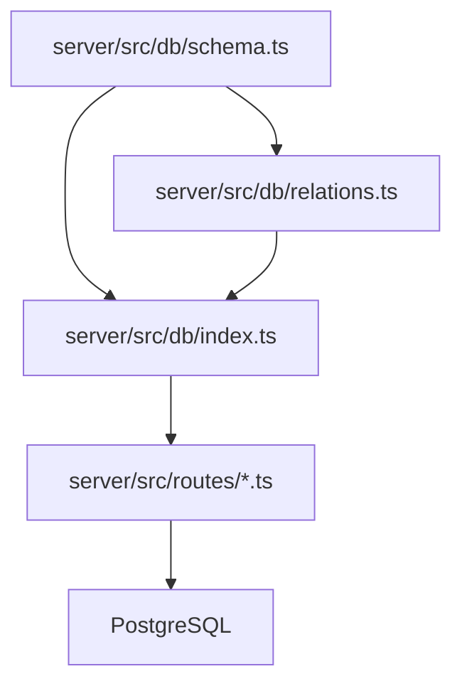
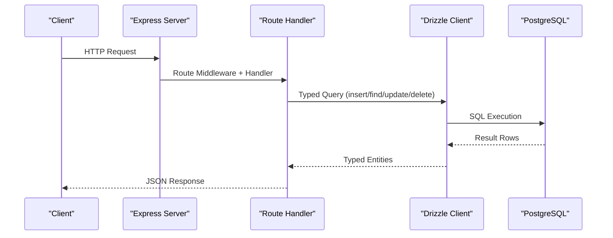
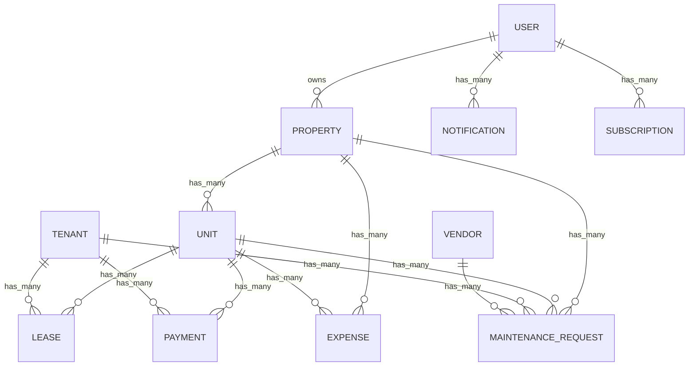
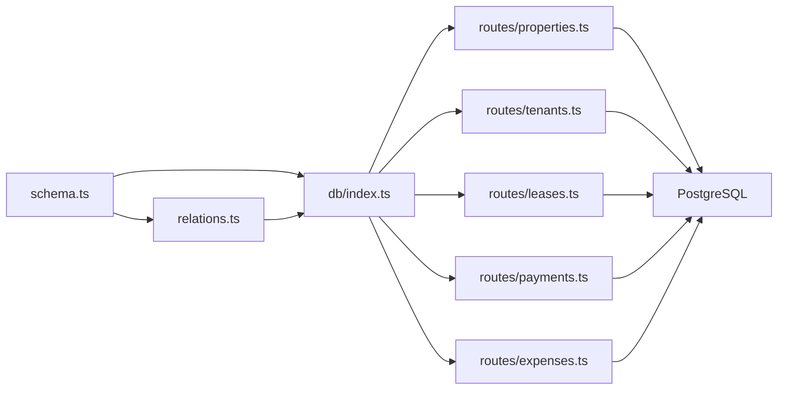
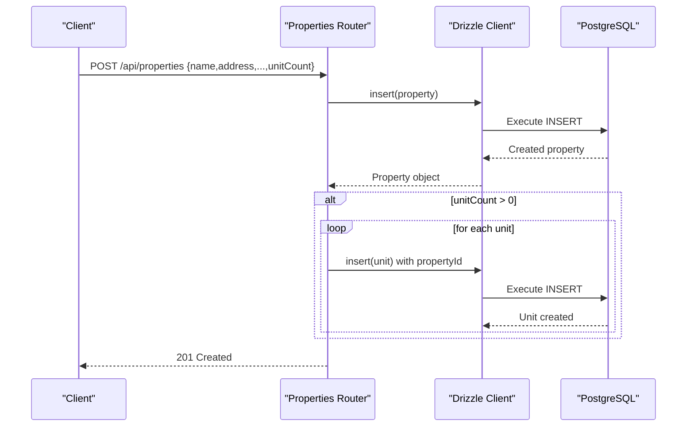
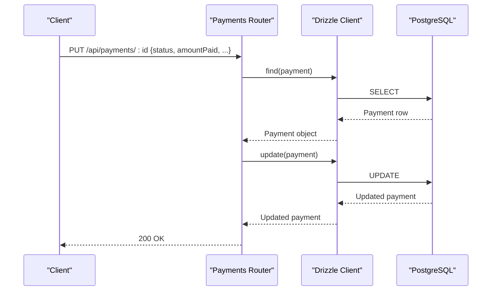

# Database Design

<cite>
**Referenced Files in This Document**
- [schema.ts](file://server/src/db/schema.ts)
- [relations.ts](file://server/src/db/relations.ts)
- [db/index.ts](file://server/src/db/index.ts)
- [drizzle.config.ts](file://server/drizzle.config.ts)
- [properties.ts](file://server/src/routes/properties.ts)
- [tenants.ts](file://server/src/routes/tenants.ts)
- [payments.ts](file://server/src/routes/payments.ts)
- [leases.ts](file://server/src/routes/leases.ts)
- [expenses.ts](file://server/src/routes/expenses.ts)
- [index.ts](file://server/src/index.ts)
</cite>

## Table of Contents
1. [Introduction](#introduction)
2. [Project Structure](#project-structure)
3. [Core Components](#core-components)
4. [Architecture Overview](#architecture-overview)
5. [Detailed Component Analysis](#detailed-component-analysis)
6. [Dependency Analysis](#dependency-analysis)
7. [Performance Considerations](#performance-considerations)
8. [Troubleshooting Guide](#troubleshooting-guide)
9. [Conclusion](#conclusion)
10. [Appendices](#appendices)

## Introduction
This document explains the PostgreSQL database design for the landlord application using Drizzle ORM with a TypeScript-first approach. It covers schema modeling, entity relationships (one-to-many and many-to-one), migration strategy, data integrity constraints, query optimization patterns, indexing recommendations, backup and recovery procedures, and performance considerations such as connection pooling and caching strategies.

## Project Structure
The database layer is implemented under server/src/db with three primary files:
- Schema definitions and enums
- Relationship definitions for Drizzle relations
- Database client initialization combining schema and relations

**Diagram sources**
- [schema.ts:1-403](file://server/src/db/schema.ts#L1-L403)
- [relations.ts:1-103](file://server/src/db/relations.ts#L1-L103)
- [db/index.ts:1-11](file://server/src/db/index.ts#L1-L11)

**Section sources**
- [schema.ts:1-403](file://server/src/db/schema.ts#L1-L403)
- [relations.ts:1-103](file://server/src/db/relations.ts#L1-L103)
- [db/index.ts:1-11](file://server/src/db/index.ts#L1-L11)

## Core Components
- Schema and Enums: Centralized type-safe definitions for all tables and enumerations used across the domain (property types, statuses, payment methods, maintenance priorities, expense categories, notifications, subscriptions).
- Relations: Declarative one-to-many and many-to-one relationships between entities to enable rich queries with joins and nested includes.
- DB Client: A single exported Drizzle instance that combines schema and relations, typed for full IntelliSense support.

Key highlights:
- All core entities use UUIDs as primary keys for scalability and security.
- Timestamps are managed via defaultNow() for created_at and updated_at fields.
- JSONB columns store flexible metadata like photos or notes arrays.
- Enumerations enforce valid values at the database level.

**Section sources**
- [schema.ts:14-136](file://server/src/db/schema.ts#L14-L136)
- [schema.ts:139-403](file://server/src/db/schema.ts#L139-L403)
- [relations.ts:18-103](file://server/src/db/relations.ts#L18-L103)
- [db/index.ts:1-11](file://server/src/db/index.ts#L1-L11)

## Architecture Overview
The application uses an Express server that mounts feature routers. Each router validates input with Zod and performs CRUD operations through the shared Drizzle client. The database client connects to PostgreSQL using postgres-js and exposes typed queries.

**Diagram sources**
- [index.ts:20-62](file://server/src/index.ts#L20-L62)
- [db/index.ts:1-11](file://server/src/db/index.ts#L1-L11)

## Detailed Component Analysis

### Entity Relationships
The following relationships model the landlord domain:

- User owns Properties; Property has many Units; Unit belongs to Property
- Property has many Expenses and Maintenance Requests
- Unit has many Leases, Payments, Maintenance Requests, and Expenses
- Tenant has many Leases, Payments, and Maintenance Requests
- Lease belongs to Unit and Tenant
- Payment belongs to Unit and Tenant
- Maintenance Request belongs to Unit, Tenant, Property, and optionally Vendor
- Expense belongs to Property and optionally Unit
- Notification belongs to User
- Subscription belongs to User

**Diagram sources**
- [schema.ts:189-403](file://server/src/db/schema.ts#L189-L403)
- [relations.ts:18-103](file://server/src/db/relations.ts#L18-L103)

**Section sources**
- [schema.ts:189-403](file://server/src/db/schema.ts#L189-L403)
- [relations.ts:18-103](file://server/src/db/relations.ts#L18-L103)

### Data Integrity Constraints and Validation Rules
- Primary Keys: All tables use UUID primary keys for uniqueness and distributed safety.
- Foreign Keys: Enforced via references() with onDelete behaviors:
  - Cascade deletes for ownership chains (e.g., property deletion cascades to units, expenses, maintenance requests).
  - Set null for optional associations (e.g., tenant or vendor can be detached from maintenance requests).
- Not Null: Critical fields like names, addresses, amounts, dates, and status fields are marked notNull().
- Unique: Email on user and token on session ensure uniqueness where required.
- Defaults: Status fields and timestamps have sensible defaults (active/vacant/pending, now()).
- Enumerations: Domain-specific enums constrain allowed values at the database level (e.g., property_type, unit_status, payment_method, payment_status, maintenance_priority/status, expense_category, notification_* enums, plan_tier, billing_cycle, subscription_status, recurring_frequency).

These constraints provide strong referential integrity and reduce the need for application-level validation for certain invariants.

**Section sources**
- [schema.ts:14-136](file://server/src/db/schema.ts#L14-L136)
- [schema.ts:189-403](file://server/src/db/schema.ts#L189-L403)

### Migration Strategy and Version Control
- Drizzle Kit Configuration: The project configures Drizzle Kit to target PostgreSQL, reads schema from schema.ts, and outputs migrations to a dedicated directory.
- Environment: DATABASE_URL is loaded via dotenv for local development and CI environments.
- Commands: Scripts expose db:push, db:studio, and db:seed for development workflows.

Recommended workflow:
- Use drizzle-kit generate to create versioned migration files when schema changes.
- Apply migrations in CI/CD before deployment using drizzle-kit migrate.
- Keep migration files under version control alongside schema changes.
- For production, prefer explicit migration execution over push to avoid accidental drift.

**Section sources**
- [drizzle.config.ts:1-16](file://server/drizzle.config.ts#L1-L16)
- [package.json:6-14](file://server/package.json#L6-L14)

### Query Optimization Patterns and Indexing Strategies
Observed patterns:
- Filtering by ownership: Routes frequently filter by userId or propertyId to enforce multi-tenant isolation.
- Joins and includes: Queries often include related entities (e.g., payments with unit and tenant) to minimize N+1 calls.
- Date-based filtering: Monthly/yearly filters are applied in-memory after fetching; consider moving these to the database for large datasets.

Recommended indexes:
- property(userId): Speeds up tenant-scoped queries for properties.
- unit(propertyId): Optimizes lookups of units per property.
- lease(unitId), lease(tenantId): Improves join performance for leases.
- payment(unitId), payment(tenantId), payment(dueDate), payment(status): Enhances filtering and reporting.
- expense(propertyId), expense(date), expense(category): Supports reporting and aggregation.
- maintenance_request(unitId), maintenance_request(propertyId), maintenance_request(status), maintenance_request(priority): Improves dashboard and queue queries.
- tenant(userId): Enables fast tenant listing per owner.
- vendor(userId): Supports vendor management per owner.
- notification(userId, scheduledAt): Optimizes delivery queues and user notifications.

Query improvements:
- Move date range filters into SQL using drizzle’s date functions to avoid loading entire tables into memory.
- Use select projections to fetch only needed columns for list endpoints.
- Paginate large result sets to reduce payload size and improve latency.

**Section sources**
- [payments.ts:24-101](file://server/src/routes/payments.ts#L24-L101)
- [leases.ts:23-76](file://server/src/routes/leases.ts#L23-L76)
- [expenses.ts:30-54](file://server/src/routes/expenses.ts#L30-L54)

### Backup and Recovery Procedures
While not defined in code, recommended practices for this PostgreSQL setup:
- Automated daily logical backups using pg_dump or cloud provider snapshots.
- Retain multiple retention periods (daily, weekly, monthly) for compliance and recovery flexibility.
- Test restore procedures regularly in staging environments.
- Store backups securely with encryption at rest and in transit.
- For point-in-time recovery, enable WAL archiving and configure PITR windows.
- Document RPO/RTO targets and validate them against actual restore tests.

[No sources needed since this section provides general guidance]

### Performance Considerations
Connection Pooling:
- The current client uses a single postgres connection string without explicit pool configuration. For production workloads, configure connection pooling parameters (min/max connections, idle timeout) in the postgres driver options to handle concurrent requests efficiently.

Caching Strategies:
- Introduce read replicas for heavy reporting queries if supported by your hosting environment.
- Cache frequent read-only aggregates (e.g., monthly collection summaries) using an in-memory cache (e.g., Redis) with appropriate TTLs.
- Avoid unnecessary joins in high-frequency endpoints; denormalize where appropriate for dashboards.

Indexing:
- Add the recommended indexes above based on observed query patterns and growth projections.
- Monitor index usage and remove unused indexes to reduce write overhead.

Query Efficiency:
- Prefer server-side pagination and selective column projection.
- Push filters (date ranges, status) into SQL rather than post-fetch filtering.

**Section sources**
- [db/index.ts:1-11](file://server/src/db/index.ts#L1-L11)
- [payments.ts:61-101](file://server/src/routes/payments.ts#L61-L101)

## Dependency Analysis
The database layer depends on Drizzle ORM and postgres-js. Routes depend on the shared db client and schema/relations exports.

**Diagram sources**
- [schema.ts:1-403](file://server/src/db/schema.ts#L1-L403)
- [relations.ts:1-103](file://server/src/db/relations.ts#L1-L103)
- [db/index.ts:1-11](file://server/src/db/index.ts#L1-L11)
- [properties.ts:1-106](file://server/src/routes/properties.ts#L1-L106)
- [tenants.ts:1-83](file://server/src/routes/tenants.ts#L1-L83)
- [leases.ts:1-147](file://server/src/routes/leases.ts#L1-L147)
- [payments.ts:1-137](file://server/src/routes/payments.ts#L1-L137)
- [expenses.ts:1-106](file://server/src/routes/expenses.ts#L1-L106)

**Section sources**
- [db/index.ts:1-11](file://server/src/db/index.ts#L1-L11)
- [properties.ts:1-106](file://server/src/routes/properties.ts#L1-L106)
- [tenants.ts:1-83](file://server/src/routes/tenants.ts#L1-L83)
- [leases.ts:1-147](file://server/src/routes/leases.ts#L1-L147)
- [payments.ts:1-137](file://server/src/routes/payments.ts#L1-L137)
- [expenses.ts:1-106](file://server/src/routes/expenses.ts#L1-L106)

## Performance Considerations
- Connection Pooling: Configure postgres connection pool settings for production to manage concurrency and resource usage effectively.
- Query Caching: Cache expensive aggregations and report endpoints with short TTLs to reduce database load.
- Indexing: Implement recommended indexes aligned with access patterns to optimize read-heavy workloads.
- Pagination and Projections: Always paginate lists and select only necessary columns to reduce network and processing overhead.

[No sources needed since this section provides general guidance]

## Troubleshooting Guide
Common issues and remedies:
- Missing DATABASE_URL: Ensure .env is present and DATABASE_URL is set; Drizzle config loads it for migrations.
- Migration failures: Verify dialect and credentials in drizzle.config.ts; run migrations in the correct order.
- Constraint violations: Check foreign key references and enum values; ensure referential integrity before inserts/updates.
- Slow queries: Review missing indexes and move filters into SQL; add pagination and projections.
- Multi-tenant leaks: Validate userId filters in routes to prevent cross-tenant data exposure.

**Section sources**
- [drizzle.config.ts:1-16](file://server/drizzle.config.ts#L1-L16)
- [schema.ts:14-136](file://server/src/db/schema.ts#L14-L136)
- [schema.ts:189-403](file://server/src/db/schema.ts#L189-L403)

## Conclusion
The database design leverages Drizzle ORM with a TypeScript-first schema, robust constraints, and clear relationships to model properties, units, tenants, leases, payments, expenses, vendors, notifications, and subscriptions. With careful migration management, strategic indexing, and performance tuning (pooling and caching), the system can scale reliably while maintaining data integrity and developer productivity.

[No sources needed since this section summarizes without analyzing specific files]

## Appendices

### Example Workflows

#### Create Property and Auto-Generate Units

**Diagram sources**
- [properties.ts:48-71](file://server/src/routes/properties.ts#L48-L71)

#### Record Payment and Update Status

**Diagram sources**
- [payments.ts:112-126](file://server/src/routes/payments.ts#L112-L126)