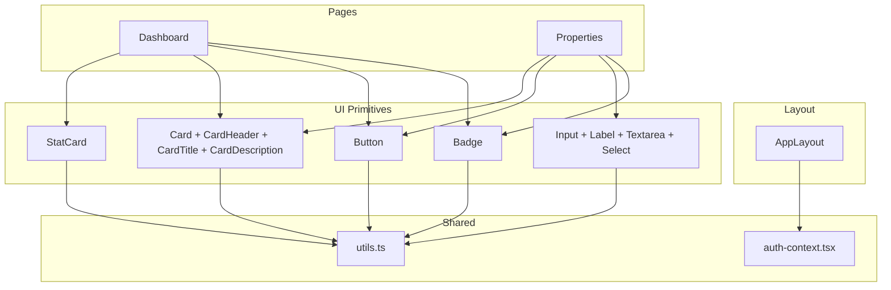
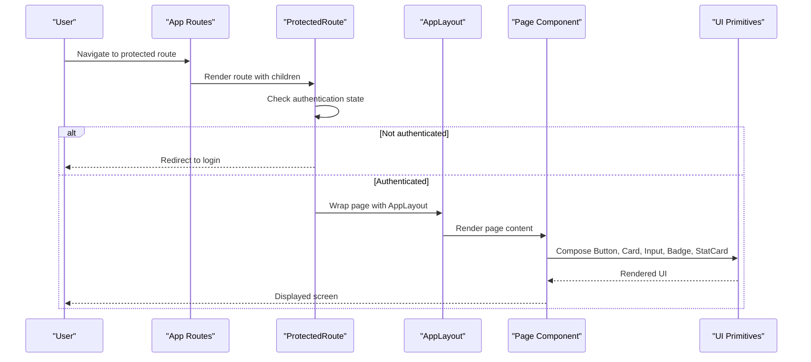
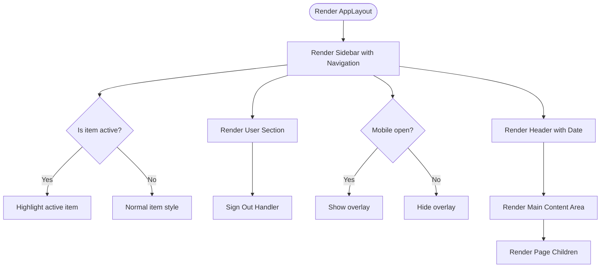
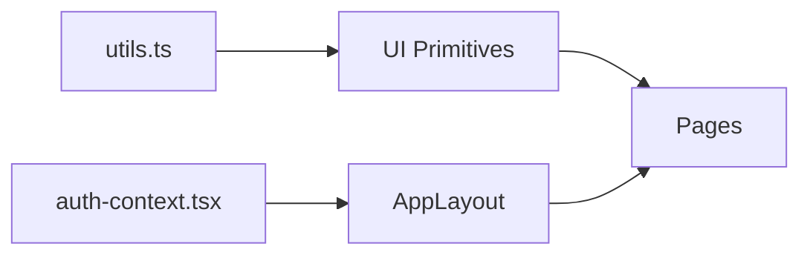

# Component System

<cite>
**Referenced Files in This Document**
- [Button.tsx](file://client/src/components/ui/Button.tsx)
- [Card.tsx](file://client/src/components/ui/Card.tsx)
- [Input.tsx](file://client/src/components/ui/Input.tsx)
- [Badge.tsx](file://client/src/components/ui/Badge.tsx)
- [StatCard.tsx](file://client/src/components/ui/StatCard.tsx)
- [AppLayout.tsx](file://client/src/components/layout/AppLayout.tsx)
- [utils.ts](file://client/src/lib/utils.ts)
- [auth-context.tsx](file://client/src/contexts/auth-context.tsx)
- [Dashboard.tsx](file://client/src/pages/Dashboard.tsx)
- [Properties.tsx](file://client/src/pages/Properties.tsx)
- [App.tsx](file://client/src/App.tsx)
</cite>

## Table of Contents
1. [Introduction](#introduction)
2. [Project Structure](#project-structure)
3. [Core Components](#core-components)
4. [Architecture Overview](#architecture-overview)
5. [Detailed Component Analysis](#detailed-component-analysis)
6. [Dependency Analysis](#dependency-analysis)
7. [Performance Considerations](#performance-considerations)
8. [Troubleshooting Guide](#troubleshooting-guide)
9. [Conclusion](#conclusion)
10. [Appendices](#appendices)

## Introduction
This document describes the React component system built with Tailwind CSS. It covers the modular UI components (Button, Card, Input, Badge, StatCard), their composition patterns, prop interfaces, and styling approaches. It also explains the layout system centered around AppLayout as the main container and demonstrates how pages compose these components to build responsive, accessible user interfaces.

## Project Structure
The UI is organized into a clear separation of concerns:
- Layout: AppLayout provides the application shell (sidebar navigation, header, and content area).
- UI primitives: Button, Card, Input (including Label, Textarea, Select), Badge, and StatCard are reusable building blocks.
- Pages: Feature pages (Dashboard, Properties, etc.) compose UI primitives to implement business screens.
- Utilities: Shared helpers like cn for class merging and formatting utilities.
- Context: Auth context supplies user state used by layout and protected routes.

**Diagram sources**
- [AppLayout.tsx:1-158](file://client/src/components/layout/AppLayout.tsx#L1-L158)
- [Button.tsx:1-50](file://client/src/components/ui/Button.tsx#L1-L50)
- [Card.tsx:1-42](file://client/src/components/ui/Card.tsx#L1-L42)
- [Input.tsx:1-86](file://client/src/components/ui/Input.tsx#L1-L86)
- [Badge.tsx:1-28](file://client/src/components/ui/Badge.tsx#L1-L28)
- [StatCard.tsx:1-54](file://client/src/components/ui/StatCard.tsx#L1-L54)
- [Dashboard.tsx:1-233](file://client/src/pages/Dashboard.tsx#L1-L233)
- [Properties.tsx:1-280](file://client/src/pages/Properties.tsx#L1-L280)
- [utils.ts:1-35](file://client/src/lib/utils.ts#L1-L35)
- [auth-context.tsx:1-38](file://client/src/contexts/auth-context.tsx#L1-L38)

**Section sources**
- [AppLayout.tsx:1-158](file://client/src/components/layout/AppLayout.tsx#L1-L158)
- [Dashboard.tsx:1-233](file://client/src/pages/Dashboard.tsx#L1-L233)
- [Properties.tsx:1-280](file://client/src/pages/Properties.tsx#L1-L280)
- [utils.ts:1-35](file://client/src/lib/utils.ts#L1-L35)
- [auth-context.tsx:1-38](file://client/src/contexts/auth-context.tsx#L1-L38)

## Core Components
- Button: A versatile button supporting multiple variants, sizes, loading state, and optional composition via a slot pattern.
- Card: A container with configurable padding and companion components for headers, titles, and descriptions.
- Input: A set of form controls including Input, Label, Textarea, and Select with consistent focus and disabled states.
- Badge: A small status indicator with semantic color variants.
- StatCard: A metric card that displays a label, value, icon, optional trend, and color-coded accent.

Styling approach:
- All components use a shared utility function to merge classes safely and consistently.
- Visual tokens are applied through Tailwind classes; colors and spacing follow a cohesive design system.
- Responsive behavior is achieved using Tailwind’s responsive prefixes and grid utilities in composing pages.

Accessibility:
- Inputs and labels are properly associated.
- Focus rings and keyboard interactions are standardized across inputs and buttons.
- Disabled states are visually and semantically indicated.

**Section sources**
- [Button.tsx:1-50](file://client/src/components/ui/Button.tsx#L1-L50)
- [Card.tsx:1-42](file://client/src/components/ui/Card.tsx#L1-L42)
- [Input.tsx:1-86](file://client/src/components/ui/Input.tsx#L1-L86)
- [Badge.tsx:1-28](file://client/src/components/ui/Badge.tsx#L1-L28)
- [StatCard.tsx:1-54](file://client/src/components/ui/StatCard.tsx#L1-L54)
- [utils.ts:1-35](file://client/src/lib/utils.ts#L1-L35)

## Architecture Overview
The application uses a layout-first architecture where AppLayout wraps all protected routes and provides navigation, user info, and a content area. Pages compose UI primitives to present data and actions. The auth context drives protected routing and user display in the layout.

**Diagram sources**
- [App.tsx:1-78](file://client/src/App.tsx#L1-L78)
- [AppLayout.tsx:1-158](file://client/src/components/layout/AppLayout.tsx#L1-L158)
- [Dashboard.tsx:1-233](file://client/src/pages/Dashboard.tsx#L1-L233)
- [Properties.tsx:1-280](file://client/src/pages/Properties.tsx#L1-L280)

## Detailed Component Analysis

### Button
- Purpose: Primary interactive element with consistent styling and behavior.
- Props:
  - variant: Controls visual theme (e.g., primary, secondary, signal, ghost, danger).
  - size: Controls dimensions and typography (sm, md, lg).
  - asChild: Enables composition with external components via a slot.
  - loading: Shows an inline spinner and disables interaction while loading.
  - Standard HTML button attributes are supported via forwarding.
- Styling: Uses a class merger utility to combine base styles, variant-specific styles, size-specific styles, and any additional className overrides.
- Composition: When asChild is true, renders as a child-provided component rather than a native button.

Usage examples in pages:
- Dashboard uses Button for quick actions with icons and secondary variant.
- Properties uses Button for creating properties and canceling forms, including loading state during mutations.

**Section sources**
- [Button.tsx:1-50](file://client/src/components/ui/Button.tsx#L1-L50)
- [Dashboard.tsx:121-233](file://client/src/pages/Dashboard.tsx#L121-L233)
- [Properties.tsx:104-280](file://client/src/pages/Properties.tsx#L104-L280)

### Card
- Purpose: Content container with consistent border, background, shadow, and rounded corners.
- Props:
  - padding: Configurable internal spacing (none, sm, md, lg).
  - Additional div attributes forwarded.
- Companion components:
  - CardHeader: Section wrapper for header content.
  - CardTitle: Semantic heading styled for hierarchy.
  - CardDescription: Subtext styled for secondary information.
- Usage examples in pages:
  - Dashboard groups alerts, rent summary, unit status, and quick actions inside Cards.
  - Properties uses Card for empty state and property cards.

**Section sources**
- [Card.tsx:1-42](file://client/src/components/ui/Card.tsx#L1-L42)
- [Dashboard.tsx:136-229](file://client/src/pages/Dashboard.tsx#L136-L229)
- [Properties.tsx:120-170](file://client/src/pages/Properties.tsx#L120-L170)

### Input
- Purpose: Consistent form controls with accessible labels and focus states.
- Exports:
  - Input: Styled input with placeholder, focus ring, and disabled state.
  - Label: Accessible label component.
  - Textarea: Multi-line input with consistent styling.
  - Select: Dropdown with options array and optional placeholder.
- Props:
  - Input/Textarea/Select accept standard HTML attributes plus specific props (e.g., Select.options, Select.placeholder).
- Usage examples in pages:
  - Properties modal uses Input, Label, and Select to collect property details.

**Section sources**
- [Input.tsx:1-86](file://client/src/components/ui/Input.tsx#L1-L86)
- [Properties.tsx:172-276](file://client/src/pages/Properties.tsx#L172-L276)

### Badge
- Purpose: Small status or category indicators with semantic color variants.
- Props:
  - variant: default, success, warning, danger, signal, outline.
- Usage examples in pages:
  - Dashboard shows counts for alerts using different variants.
  - Properties displays type and status badges on property cards.

**Section sources**
- [Badge.tsx:1-28](file://client/src/components/ui/Badge.tsx#L1-L28)
- [Dashboard.tsx:136-156](file://client/src/pages/Dashboard.tsx#L136-L156)
- [Properties.tsx:133-170](file://client/src/pages/Properties.tsx#L133-L170)

### StatCard
- Purpose: Metric display with label, value, icon, optional trend, and color accent.
- Props:
  - label: Descriptive title for the metric.
  - value: Numeric or string value displayed prominently.
  - icon: React node rendered in an accent-colored box.
  - trend: Optional percentage change with label; positive values are green, negative are red.
  - color: Accent color for the icon box (signal, success, blue, violet, deep).
- Usage examples in pages:
  - Dashboard renders a grid of StatCards to show key metrics such as total properties, units, occupancy rate, monthly income/expenses, and collection rate.

**Section sources**
- [StatCard.tsx:1-54](file://client/src/components/ui/StatCard.tsx#L1-L54)
- [Dashboard.tsx:49-134](file://client/src/pages/Dashboard.tsx#L49-L134)

### AppLayout
- Purpose: Application shell providing sidebar navigation, top bar, and main content area.
- Features:
  - Sidebar with navigation items and active state based on current location.
  - Mobile-responsive drawer with overlay toggle.
  - User section showing initials, name, email, and sign-out action.
  - Top bar with date display and mobile menu toggle.
  - Main content area that renders page children.
- Integration:
  - Uses auth context to display user info.
  - Integrates with routing library for navigation and active link highlighting.

**Diagram sources**
- [AppLayout.tsx:21-158](file://client/src/components/layout/AppLayout.tsx#L21-L158)

**Section sources**
- [AppLayout.tsx:1-158](file://client/src/components/layout/AppLayout.tsx#L1-L158)
- [auth-context.tsx:1-38](file://client/src/contexts/auth-context.tsx#L1-L38)

## Dependency Analysis
- UI primitives depend on a shared class merger utility to ensure consistent and conflict-free styling.
- Pages depend on UI primitives to compose feature screens.
- AppLayout depends on auth context for user state and routing integration for navigation.
- Routing and protection logic wrap pages with AppLayout when authenticated.

**Diagram sources**
- [utils.ts:1-35](file://client/src/lib/utils.ts#L1-L35)
- [auth-context.tsx:1-38](file://client/src/contexts/auth-context.tsx#L1-L38)
- [AppLayout.tsx:1-158](file://client/src/components/layout/AppLayout.tsx#L1-L158)
- [Dashboard.tsx:1-233](file://client/src/pages/Dashboard.tsx#L1-L233)
- [Properties.tsx:1-280](file://client/src/pages/Properties.tsx#L1-L280)

**Section sources**
- [utils.ts:1-35](file://client/src/lib/utils.ts#L1-L35)
- [auth-context.tsx:1-38](file://client/src/contexts/auth-context.tsx#L1-L38)
- [AppLayout.tsx:1-158](file://client/src/components/layout/AppLayout.tsx#L1-L158)
- [Dashboard.tsx:1-233](file://client/src/pages/Dashboard.tsx#L1-L233)
- [Properties.tsx:1-280](file://client/src/pages/Properties.tsx#L1-L280)

## Performance Considerations
- Class merging: Using a dedicated utility prevents redundant or conflicting Tailwind classes, reducing CSS bloat and improving rendering performance.
- Conditional rendering: Loading and error states prevent unnecessary re-renders and improve perceived performance.
- List rendering: Keys are provided for dynamic lists to optimize reconciliation.
- Icons: Lightweight SVG icons are used to minimize bundle size and improve load times.

[No sources needed since this section provides general guidance]

## Troubleshooting Guide
- Authentication issues:
  - If protected routes redirect unexpectedly, verify the auth context state and session retrieval.
  - Ensure sign-out clears session and redirects to login.
- Form inputs not updating:
  - Confirm controlled components are bound to state and onChange handlers are wired correctly.
  - Verify Label associations with inputs via htmlFor/id pairs.
- Styling conflicts:
  - Use the class merger utility to avoid Tailwind class conflicts.
  - Prefer component props (e.g., variant, size) over ad-hoc overrides when possible.
- Navigation highlights:
  - Active link detection relies on current location; ensure routing setup matches expected paths.

**Section sources**
- [auth-context.tsx:1-38](file://client/src/contexts/auth-context.tsx#L1-L38)
- [AppLayout.tsx:60-90](file://client/src/components/layout/AppLayout.tsx#L60-L90)
- [Input.tsx:1-86](file://client/src/components/ui/Input.tsx#L1-L86)
- [utils.ts:1-35](file://client/src/lib/utils.ts#L1-L35)

## Conclusion
The component system provides a robust, composable foundation for building the application’s UI. Reusable primitives ensure consistency, while AppLayout offers a scalable layout structure. Pages compose these components to deliver responsive, accessible experiences. The design leverages Tailwind CSS for styling, with a shared utility for safe class merging, and integrates seamlessly with authentication and routing to protect and navigate between features.

[No sources needed since this section summarizes without analyzing specific files]

## Appendices

### Component Prop Interfaces Summary
- Button:
  - variant: "primary" | "secondary" | "signal" | "ghost" | "danger"
  - size: "sm" | "md" | "lg"
  - asChild: boolean
  - loading: boolean
  - Inherits standard button attributes
- Card:
  - padding: "none" | "sm" | "md" | "lg"
  - Inherits standard div attributes
- Input:
  - Inherits standard input attributes
- Label:
  - Inherits standard label attributes
- Textarea:
  - Inherits standard textarea attributes
- Select:
  - options: array of { value: string; label: string }
  - placeholder?: string
  - Inherits standard select attributes
- Badge:
  - variant: "default" | "success" | "warning" | "danger" | "signal" | "outline"
  - Inherits standard span attributes
- StatCard:
  - label: string
  - value: string | number
  - icon: React.ReactNode
  - trend?: { value: number; label: string }
  - color?: "signal" | "success" | "blue" | "violet" | "deep"

**Section sources**
- [Button.tsx:6-11](file://client/src/components/ui/Button.tsx#L6-L11)
- [Card.tsx:4-6](file://client/src/components/ui/Card.tsx#L4-L6)
- [Input.tsx:4-56](file://client/src/components/ui/Input.tsx#L4-L56)
- [Badge.tsx:3-5](file://client/src/components/ui/Badge.tsx#L3-L5)
- [StatCard.tsx:3-9](file://client/src/components/ui/StatCard.tsx#L3-L9)

### Example Usage References
- Dashboard:
  - Composes StatCard, Card, Button, Badge to display metrics, alerts, and quick actions.
- Properties:
  - Composes Card, Button, Input, Label, Select, Badge to manage property listings and creation.

**Section sources**
- [Dashboard.tsx:121-233](file://client/src/pages/Dashboard.tsx#L121-L233)
- [Properties.tsx:104-280](file://client/src/pages/Properties.tsx#L104-L280)