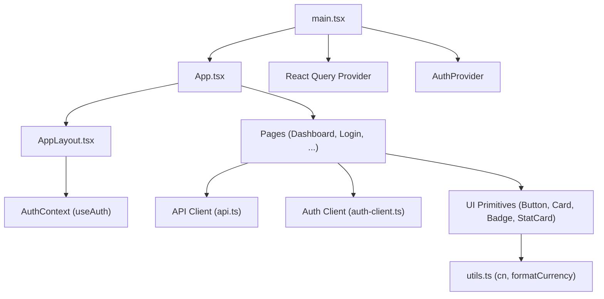
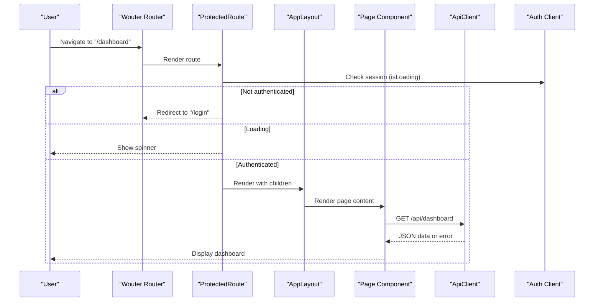
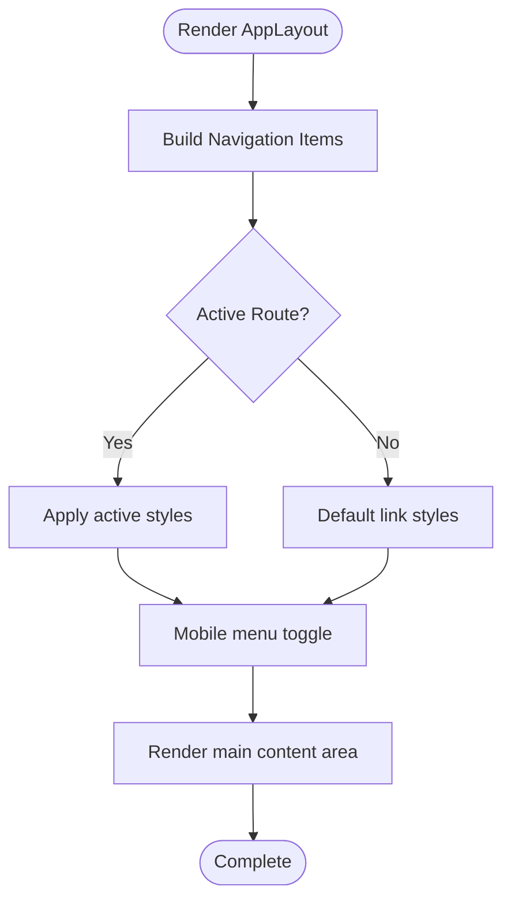
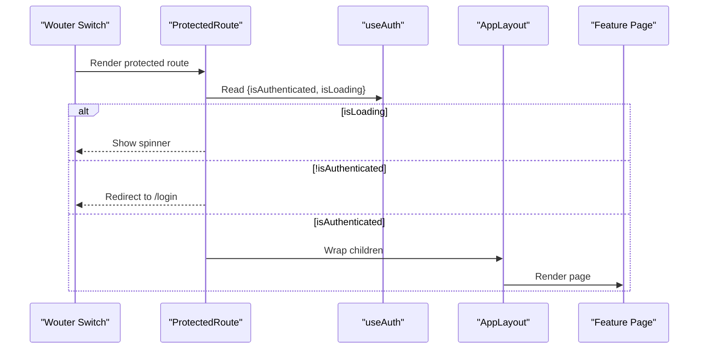
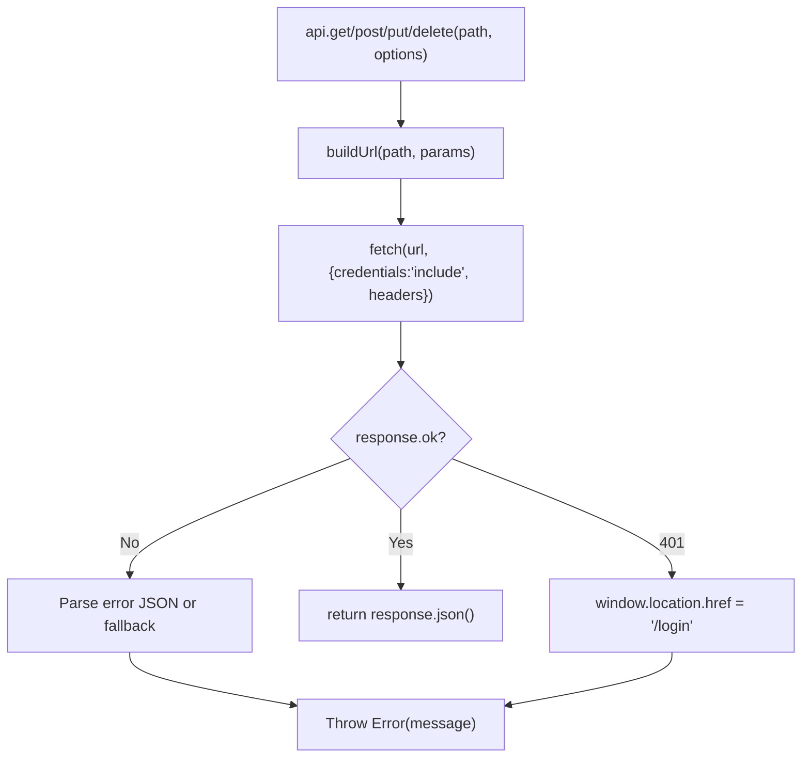
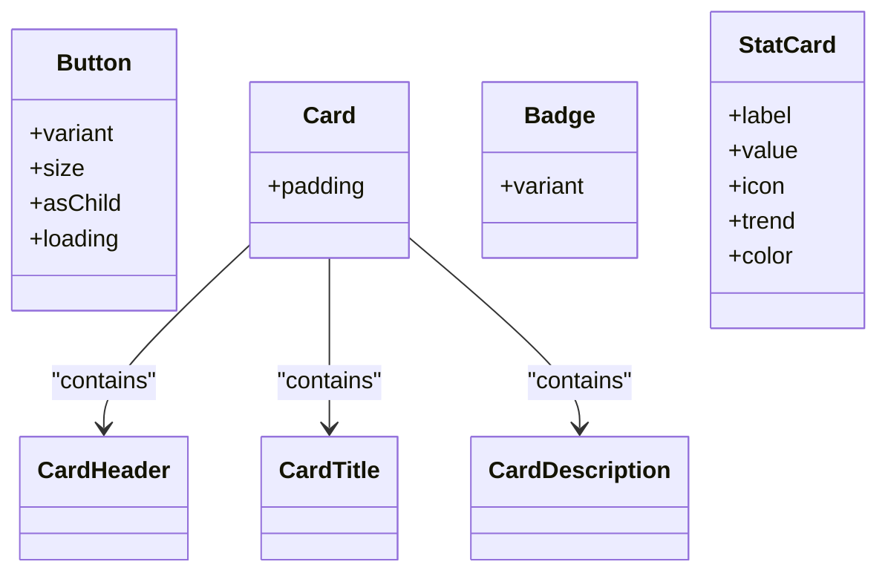
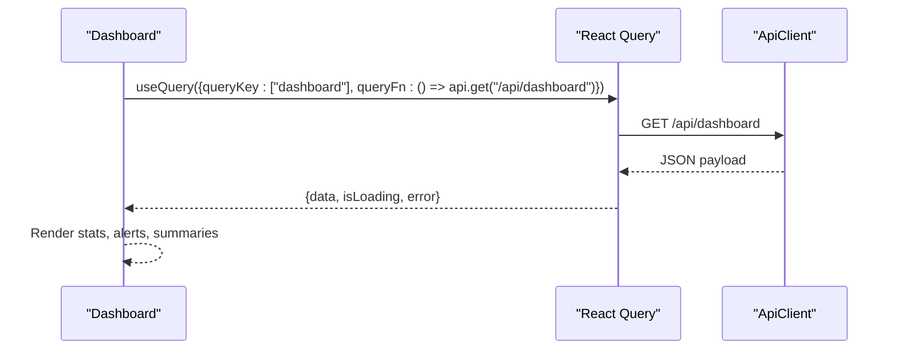
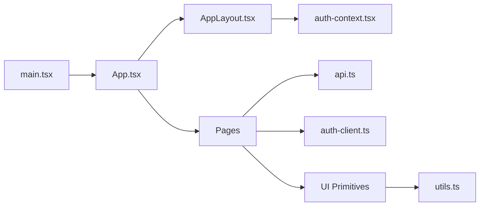

# Frontend Architecture

<cite>
**Referenced Files in This Document**
- [main.tsx](file://client/src/main.tsx)
- [App.tsx](file://client/src/App.tsx)
- [AppLayout.tsx](file://client/src/components/layout/AppLayout.tsx)
- [auth-context.tsx](file://client/src/contexts/auth-context.tsx)
- [api.ts](file://client/src/lib/api.ts)
- [auth-client.ts](file://client/src/lib/auth-client.ts)
- [utils.ts](file://client/src/lib/utils.ts)
- [Dashboard.tsx](file://client/src/pages/Dashboard.tsx)
- [Login.tsx](file://client/src/pages/Login.tsx)
- [Button.tsx](file://client/src/components/ui/Button.tsx)
- [Card.tsx](file://client/src/components/ui/Card.tsx)
- [Badge.tsx](file://client/src/components/ui/Badge.tsx)
- [StatCard.tsx](file://client/src/components/ui/StatCard.tsx)
- [index.css](file://client/src/index.css)
</cite>

## Table of Contents
1. [Introduction](#introduction)
2. [Project Structure](#project-structure)
3. [Core Components](#core-components)
4. [Architecture Overview](#architecture-overview)
5. [Detailed Component Analysis](#detailed-component-analysis)
6. [Dependency Analysis](#dependency-analysis)
7. [Performance Considerations](#performance-considerations)
8. [Troubleshooting Guide](#troubleshooting-guide)
9. [Conclusion](#conclusion)

## Introduction
This document explains the React frontend architecture for the landlord application. It covers the component hierarchy starting from AppLayout and page components, context-based state management with auth-context, a centralized API client with error handling, routing using Wouter with protected routes, a modular UI system built with Tailwind CSS, page organization patterns, styling and responsive design, and performance considerations including code splitting and lazy loading strategies.

## Project Structure
The frontend is organized into clear layers:
- Entry and providers: main.tsx sets up React Query and AuthProvider, then renders App.
- Routing and layout: App.tsx defines routes with Wouter and wraps protected routes with AppLayout.
- Layout: AppLayout.tsx provides sidebar navigation, top bar, and content area.
- Pages: Feature pages live under pages (e.g., Dashboard, Login).
- Context: Global user state via auth-context.tsx.
- API layer: Centralized HTTP client in api.ts and auth client in auth-client.ts.
- UI primitives: Reusable components under components/ui (Button, Card, Badge, StatCard, Input).
- Utilities and styles: utils.ts for class merging and formatting; index.css for theme tokens and base styles.



**Diagram sources**
- [main.tsx:1-29](file://client/src/main.tsx#L1-L29)
- [App.tsx:1-78](file://client/src/App.tsx#L1-L78)
- [AppLayout.tsx:1-158](file://client/src/components/layout/AppLayout.tsx#L1-L158)
- [auth-context.tsx:1-38](file://client/src/contexts/auth-context.tsx#L1-L38)
- [api.ts:1-82](file://client/src/lib/api.ts#L1-L82)
- [auth-client.ts:1-13](file://client/src/lib/auth-client.ts#L1-L13)
- [utils.ts:1-35](file://client/src/lib/utils.ts#L1-L35)

**Section sources**
- [main.tsx:1-29](file://client/src/main.tsx#L1-L29)
- [App.tsx:1-78](file://client/src/App.tsx#L1-L78)

## Core Components
- AppLayout: Provides a responsive sidebar with navigation items, a top bar with date display, and a scrollable main content area. It uses wouter’s Link and useLocation to highlight active routes and toggles mobile menu visibility. Sign-out triggers signOut from the auth client and redirects to login.
- ProtectedRoute: In App.tsx, ensures users are authenticated before rendering protected pages. Shows a spinner while checking session status and redirects unauthenticated users to /login.
- AuthProvider: Wraps the app to expose global user state (user, isLoading, isAuthenticated) derived from the auth client’s session hook.
- API Client: A centralized ApiClient class that builds URLs, attaches credentials, handles 401 by redirecting to login, parses errors, and exposes get/post/put/delete helpers.
- UI Primitives: Button, Card, Badge, StatCard provide consistent styling via Tailwind classes and utility functions like cn for class composition.

**Section sources**
- [AppLayout.tsx:1-158](file://client/src/components/layout/AppLayout.tsx#L1-L158)
- [App.tsx:16-32](file://client/src/App.tsx#L16-L32)
- [auth-context.tsx:1-38](file://client/src/contexts/auth-context.tsx#L1-L38)
- [api.ts:1-82](file://client/src/lib/api.ts#L1-L82)
- [Button.tsx:1-50](file://client/src/components/ui/Button.tsx#L1-L50)
- [Card.tsx:1-42](file://client/src/components/ui/Card.tsx#L1-L42)
- [Badge.tsx:1-28](file://client/src/components/ui/Badge.tsx#L1-L28)
- [StatCard.tsx:1-54](file://client/src/components/ui/StatCard.tsx#L1-L54)

## Architecture Overview
The application follows a layered architecture:
- Providers at the root: React Query and AuthProvider set up data fetching and authentication context.
- Router layer: Wouter manages client-side routing with protected routes wrapping feature pages.
- Layout layer: AppLayout composes shared chrome (sidebar, header) around page content.
- Feature pages: Each page encapsulates its own data fetching and UI logic, reusing UI primitives.
- Data layer: api.ts centralizes HTTP requests and error handling; auth-client.ts integrates with the backend auth service.



**Diagram sources**
- [App.tsx:16-78](file://client/src/App.tsx#L16-L78)
- [AppLayout.tsx:1-158](file://client/src/components/layout/AppLayout.tsx#L1-L158)
- [api.ts:1-82](file://client/src/lib/api.ts#L1-L82)
- [auth-client.ts:1-13](file://client/src/lib/auth-client.ts#L1-L13)

## Detailed Component Analysis

### AppLayout
- Responsibilities:
  - Renders a fixed sidebar with navigation links and active state detection based on current location.
  - Displays user info and a sign-out action that calls the auth client and navigates to login.
  - Provides a top bar with a hamburger toggle for mobile and a formatted date.
  - Wraps page content in a scrollable main area.
- Responsive behavior:
  - Sidebar is off-canvas on small screens and slides in when toggled; becomes static on larger screens.
  - Mobile overlay dismisses the sidebar when clicked.
- Integration points:
  - Uses wouter’s Link and useLocation for navigation and active highlighting.
  - Consumes auth context for user details and sign-out flow.



**Diagram sources**
- [AppLayout.tsx:21-158](file://client/src/components/layout/AppLayout.tsx#L21-L158)

**Section sources**
- [AppLayout.tsx:1-158](file://client/src/components/layout/AppLayout.tsx#L1-L158)

### ProtectedRoute and Routing
- ProtectedRoute checks authentication state via useAuth and shows a spinner during load. If not authenticated, it redirects to /login. Otherwise, it renders the wrapped page inside AppLayout.
- Routes:
  - Public: /login, /signup.
  - Protected: /, /properties, /tenants, /payments, /maintenance, /expenses, /reports.
  - Fallback: NotFound.



**Diagram sources**
- [App.tsx:16-78](file://client/src/App.tsx#L16-L78)
- [auth-context.tsx:1-38](file://client/src/contexts/auth-context.tsx#L1-L38)

**Section sources**
- [App.tsx:1-78](file://client/src/App.tsx#L1-L78)

### Auth Context and Session Management
- AuthProvider derives user, isLoading, and isAuthenticated from the auth client’s session hook and exposes them via useAuth.
- Consumers can guard routes, show loading states, and render user-specific UI.

```mermaid
classDiagram
class AuthContextType {
+user
+isLoading
+isAuthenticated
}
class AuthProvider {
+children
}
class useAuth()
AuthProvider --> AuthContextType : "provides"
useAuth --> AuthContextType : "consumes"
```

**Diagram sources**
- [auth-context.tsx:1-38](file://client/src/contexts/auth-context.tsx#L1-L38)

**Section sources**
- [auth-context.tsx:1-38](file://client/src/contexts/auth-context.tsx#L1-L38)

### API Client Architecture
- Centralized ApiClient:
  - Builds URLs with query parameters and base URL from environment.
  - Sends fetch requests with credentials included and JSON content type.
  - Handles 401 by redirecting to /login and throwing an error.
  - Parses error responses into a message and code, otherwise returns JSON.
  - Exposes convenience methods: get, post, put, delete.
- Usage pattern:
  - Pages call api.get/post/etc. within React Query queries or event handlers.
  - Errors bubble up to components for user feedback or fallback states.



**Diagram sources**
- [api.ts:1-82](file://client/src/lib/api.ts#L1-L82)

**Section sources**
- [api.ts:1-82](file://client/src/lib/api.ts#L1-L82)

### UI Component System
- Button:
  - Variants: primary, secondary, signal, ghost, danger.
  - Sizes: sm, md, lg.
  - Supports loading state with spinner and asChild composition via Radix Slot.
- Card:
  - Padding variants and composed subcomponents: CardHeader, CardTitle, CardDescription.
- Badge:
  - Variants for semantic coloring: default, success, warning, danger, signal, outline.
- StatCard:
  - Displays label, value, optional trend, and icon with color-coded backgrounds.
- Styling approach:
  - Consistent use of Tailwind utility classes.
  - Class composition via cn utility for dynamic classes.
  - Theme tokens defined in index.css for colors and fonts.



**Diagram sources**
- [Button.tsx:1-50](file://client/src/components/ui/Button.tsx#L1-L50)
- [Card.tsx:1-42](file://client/src/components/ui/Card.tsx#L1-L42)
- [Badge.tsx:1-28](file://client/src/components/ui/Badge.tsx#L1-L28)
- [StatCard.tsx:1-54](file://client/src/components/ui/StatCard.tsx#L1-L54)

**Section sources**
- [Button.tsx:1-50](file://client/src/components/ui/Button.tsx#L1-L50)
- [Card.tsx:1-42](file://client/src/components/ui/Card.tsx#L1-L42)
- [Badge.tsx:1-28](file://client/src/components/ui/Badge.tsx#L1-L28)
- [StatCard.tsx:1-54](file://client/src/components/ui/StatCard.tsx#L1-L54)

### Page Organization and Features
- Pages are feature-focused modules under pages/:
  - Dashboard aggregates stats, alerts, rent summary, unit status, and quick actions.
  - Login demonstrates form handling, auth integration, and toast notifications.
- Data fetching:
  - Pages use React Query hooks (e.g., useQuery) with api methods to fetch data.
  - Loading and error states are handled inline to improve UX.
- Composition:
  - Pages compose UI primitives (Button, Card, Badge, StatCard) and utilities (formatCurrency).



**Diagram sources**
- [Dashboard.tsx:1-233](file://client/src/pages/Dashboard.tsx#L1-L233)
- [api.ts:1-82](file://client/src/lib/api.ts#L1-L82)

**Section sources**
- [Dashboard.tsx:1-233](file://client/src/pages/Dashboard.tsx#L1-L233)
- [Login.tsx:1-148](file://client/src/pages/Login.tsx#L1-L148)

### Styling Approach and Responsive Design
- Theme tokens:
  - Colors and fonts are defined in index.css using @theme variables for consistency across components.
- Utility-first styling:
  - Tailwind classes applied directly in JSX for layout, spacing, typography, and interactive states.
- Responsive patterns:
  - Sidebar collapses into an off-canvas drawer on small screens with a toggle button and overlay.
  - Grid layouts adapt from single column to multi-column using responsive breakpoints.
- Accessibility and motion:
  - Focus rings and reduced-motion media queries ensure accessibility and performance.

**Section sources**
- [index.css:1-102](file://client/src/index.css#L1-L102)
- [AppLayout.tsx:41-158](file://client/src/components/layout/AppLayout.tsx#L41-L158)
- [Dashboard.tsx:121-233](file://client/src/pages/Dashboard.tsx#L121-L233)

## Dependency Analysis
- Root providers:
  - main.tsx initializes React Query and AuthProvider, ensuring all components have access to data caching and auth state.
- Routing dependencies:
  - App.tsx depends on Wouter for routing and on AuthProvider for protected route guards.
- Layout dependencies:
  - AppLayout depends on wouter for navigation and on auth-client for sign-out.
- Page dependencies:
  - Pages depend on api.ts for data fetching and on UI primitives for presentation.
- Shared utilities:
  - utils.ts provides class merging and formatting used across UI components and pages.



**Diagram sources**
- [main.tsx:1-29](file://client/src/main.tsx#L1-L29)
- [App.tsx:1-78](file://client/src/App.tsx#L1-L78)
- [AppLayout.tsx:1-158](file://client/src/components/layout/AppLayout.tsx#L1-L158)
- [auth-context.tsx:1-38](file://client/src/contexts/auth-context.tsx#L1-L38)
- [api.ts:1-82](file://client/src/lib/api.ts#L1-L82)
- [auth-client.ts:1-13](file://client/src/lib/auth-client.ts#L1-L13)
- [utils.ts:1-35](file://client/src/lib/utils.ts#L1-L35)

**Section sources**
- [main.tsx:1-29](file://client/src/main.tsx#L1-L29)
- [App.tsx:1-78](file://client/src/App.tsx#L1-L78)

## Performance Considerations
- Code splitting and lazy loading:
  - While the current routing imports pages eagerly, consider lazy-loading heavy pages (e.g., Reports, Properties) using React.lazy and Suspense to reduce initial bundle size.
  - Example strategy: wrap page components with React.lazy and render a fallback loader until chunks load.
- Data fetching optimization:
  - React Query is configured with staleTime and retry settings to minimize unnecessary refetches and network calls.
  - Use specific query keys per feature to enable granular cache invalidation.
- UI performance:
  - Prefer memoization for expensive computations in pages if needed.
  - Avoid re-renders by keeping state local to components and lifting only necessary state.
- Network efficiency:
  - The API client includes credentials and JSON headers centrally, reducing duplication and potential inconsistencies.
  - Handle 401 errors globally by redirecting to login, preventing repeated failed requests.

[No sources needed since this section provides general guidance]

## Troubleshooting Guide
- Authentication issues:
  - If users are stuck on login or redirected unexpectedly, verify that the auth client baseURL is correctly set and that the server responds with proper session cookies.
  - Check that ProtectedRoute reads isLoading correctly to avoid premature redirects.
- API errors:
  - Non-2xx responses throw errors with parsed messages; ensure pages handle error states gracefully and surface user-friendly messages.
  - 401 responses trigger a redirect to /login; confirm that the environment variable for API URL is correct.
- UI state:
  - Ensure loading indicators are shown during async operations to prevent confusing UI states.
  - Validate that form submissions disable buttons during loading to prevent duplicate submissions.

**Section sources**
- [api.ts:26-54](file://client/src/lib/api.ts#L26-L54)
- [App.tsx:16-32](file://client/src/App.tsx#L16-L32)
- [Login.tsx:16-35](file://client/src/pages/Login.tsx#L16-L35)

## Conclusion
The frontend architecture is structured around clear separation of concerns: providers at the root, routing with protected guards, a reusable layout, feature-focused pages, a centralized API client, and a modular UI system styled with Tailwind CSS. Context-based state management simplifies global user state, while React Query streamlines data fetching and caching. Responsive design and consistent theming ensure a cohesive user experience across devices. Future enhancements can include lazy-loaded pages and further optimizations to reduce bundle size and improve perceived performance.