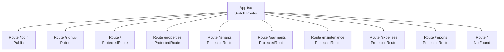
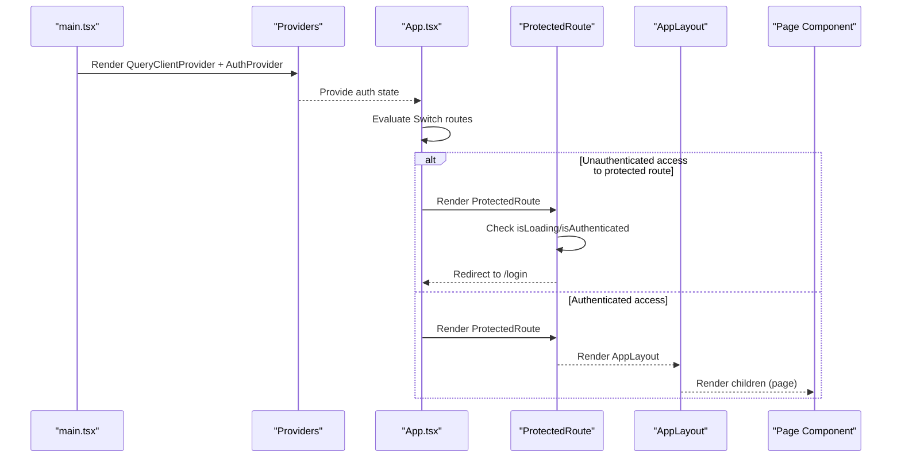
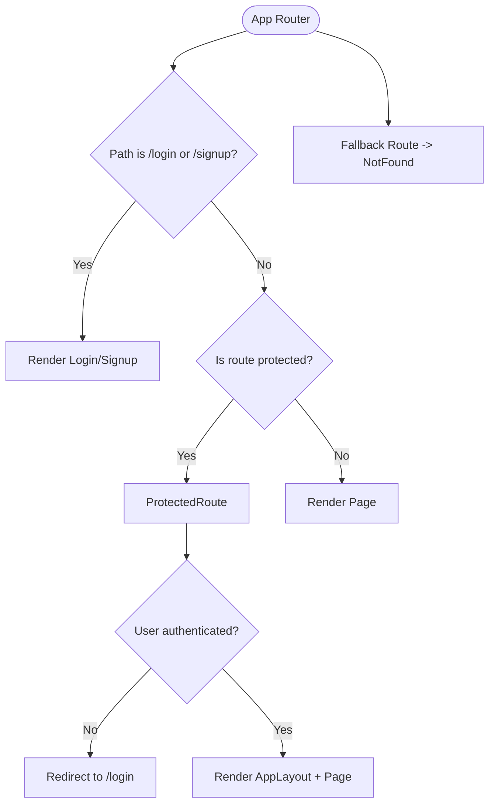
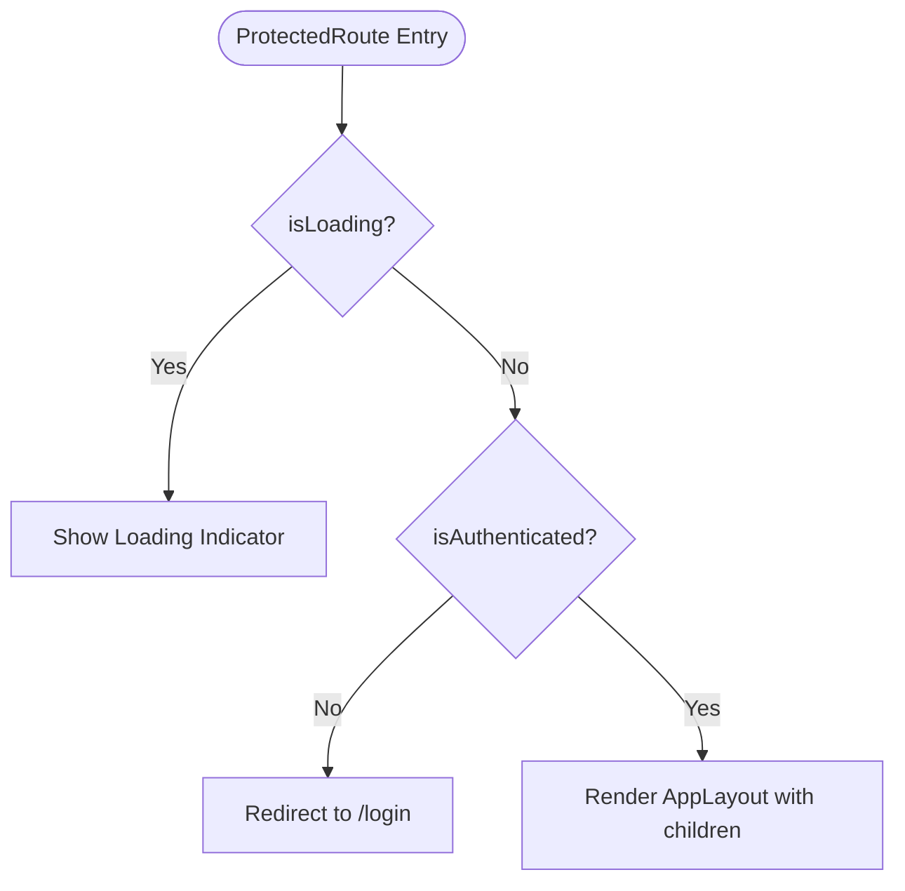
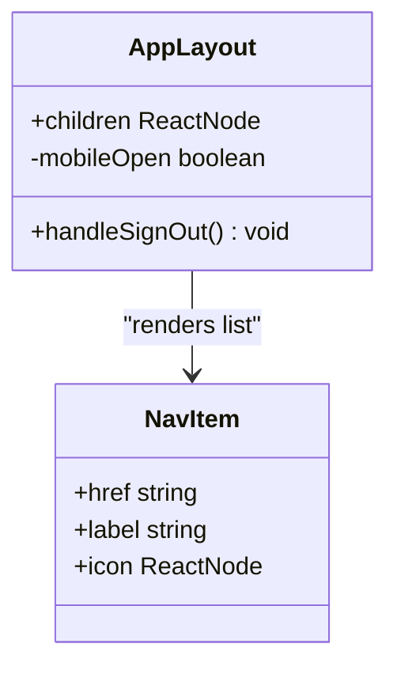
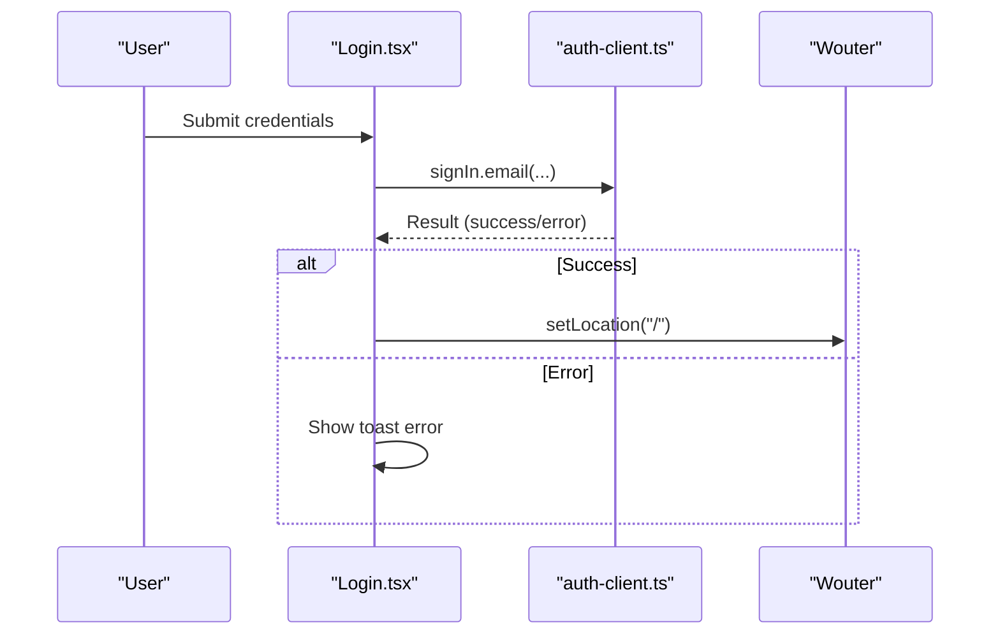
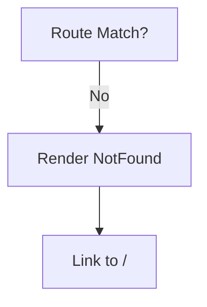
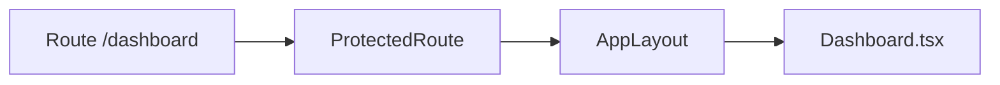
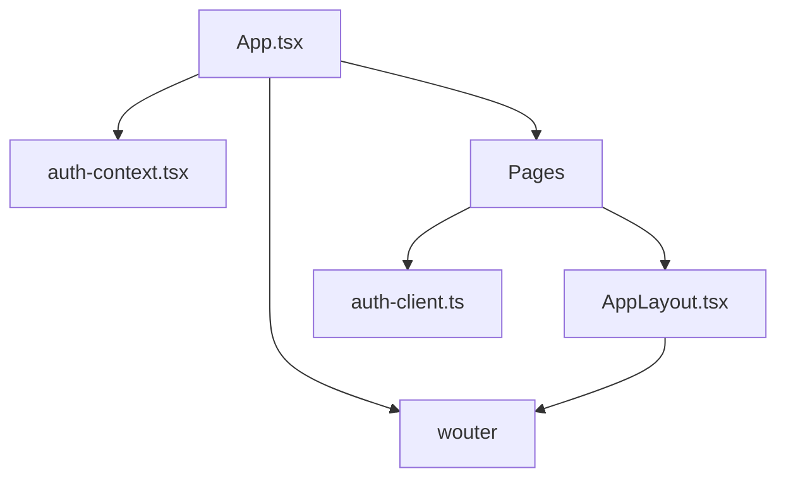

# Routing & Navigation

<cite>
**Referenced Files in This Document**
- [App.tsx](file://client/src/App.tsx)
- [main.tsx](file://client/src/main.tsx)
- [auth-context.tsx](file://client/src/contexts/auth-context.tsx)
- [AppLayout.tsx](file://client/src/components/layout/AppLayout.tsx)
- [Login.tsx](file://client/src/pages/Login.tsx)
- [Signup.tsx](file://client/src/pages/Signup.tsx)
- [NotFound.tsx](file://client/src/pages/NotFound.tsx)
- [Dashboard.tsx](file://client/src/pages/Dashboard.tsx)
- [auth-client.ts](file://client/src/lib/auth-client.ts)
</cite>

## Table of Contents
1. Introduction
2. Project Structure
3. Core Components
4. Architecture Overview
5. Detailed Component Analysis
6. Dependency Analysis
7. Performance Considerations
8. Troubleshooting Guide
9. Conclusion

## Introduction
This document explains the routing and navigation system built with Wouter for the client application. It covers route definitions, protected routes for authenticated users, public routes for authentication flows, programmatic navigation, URL handling patterns, nested routing via layout wrapping, and 404 error handling. It also describes how navigation state is managed through Wouter’s hooks and how authentication state integrates with route guards.

## Project Structure
The routing configuration is centralized in the root App component using a Switch-based router. Public routes (login/signup) are exposed directly, while all other routes are wrapped with a ProtectedRoute that enforces authentication before rendering the main application layout and page content. A catch-all Route renders a 404 page for unmatched paths.

**Diagram sources**
- [App.tsx:34-76](file://client/src/App.tsx#L34-L76)

**Section sources**
- [App.tsx:1-78](file://client/src/App.tsx#L1-L78)

## Core Components
- Root Router and Routes: The root component defines all top-level routes and applies protection to app pages.
- ProtectedRoute: A guard that checks authentication status and redirects unauthenticated users to login.
- AppLayout: Wraps protected pages with sidebar navigation, user info, and sign-out actions.
- Auth Context: Provides current session state and loading flags to components and guards.
- Public Pages: Login and Signup use programmatic navigation after successful auth flows.
- 404 Page: Handles unmatched routes with a friendly UI and link back to home.

Key responsibilities:
- Route registration and order matter; ensure public routes precede protected ones.
- Guard logic uses context to avoid rendering protected UI until session is resolved.
- Layout encapsulates shared chrome and navigation links for consistent UX.

**Section sources**
- [App.tsx:16-32](file://client/src/App.tsx#L16-L32)
- [App.tsx:34-76](file://client/src/App.tsx#L34-L76)
- [auth-context.tsx:16-33](file://client/src/contexts/auth-context.tsx#L16-L33)
- [AppLayout.tsx:31-158](file://client/src/components/layout/AppLayout.tsx#L31-L158)
- [Login.tsx:9-35](file://client/src/pages/Login.tsx#L9-L35)
- [Signup.tsx:9-48](file://client/src/pages/Signup.tsx#L9-L48)
- [NotFound.tsx:5-32](file://client/src/pages/NotFound.tsx#L5-L32)

## Architecture Overview
The application bootstraps providers for data fetching and authentication, then mounts the router. Authentication state drives route protection. Protected routes render a layout that includes persistent navigation and a content outlet.

**Diagram sources**
- [main.tsx:19-28](file://client/src/main.tsx#L19-L28)
- [App.tsx:34-76](file://client/src/App.tsx#L34-L76)
- [App.tsx:16-32](file://client/src/App.tsx#L16-L32)
- [AppLayout.tsx:31-158](file://client/src/components/layout/AppLayout.tsx#L31-L158)

## Detailed Component Analysis

### Root Router and Route Definitions
- Uses a Switch to match routes in order.
- Public routes: /login and /signup are directly mapped to their page components.
- Protected routes: All dashboard and feature routes are wrapped with ProtectedRoute to enforce authentication.
- Catch-all: A final Route without a path renders NotFound for any unmatched URL.

Navigation patterns:
- Declarative navigation via Link components in layouts and pages.
- Programmatic navigation via useLocation setter after successful login/signup.

**Diagram sources**
- [App.tsx:34-76](file://client/src/App.tsx#L34-L76)
- [App.tsx:16-32](file://client/src/App.tsx#L16-L32)

**Section sources**
- [App.tsx:34-76](file://client/src/App.tsx#L34-L76)

### ProtectedRoute Guard
- Reads authentication state from context.
- While loading, shows a spinner to prevent flicker.
- If not authenticated, redirects to /login.
- If authenticated, renders the provided children inside AppLayout.

**Diagram sources**
- [App.tsx:16-32](file://client/src/App.tsx#L16-L32)

**Section sources**
- [App.tsx:16-32](file://client/src/App.tsx#L16-L32)
- [auth-context.tsx:16-33](file://client/src/contexts/auth-context.tsx#L16-L33)

### AppLayout and Navigation
- Provides a persistent sidebar with navigation items.
- Highlights active item based on current location.
- Displays user info and offers sign-out action.
- Renders page content in a main area.

**Diagram sources**
- [AppLayout.tsx:21-29](file://client/src/components/layout/AppLayout.tsx#L21-L29)
- [AppLayout.tsx:31-158](file://client/src/components/layout/AppLayout.tsx#L31-L158)

**Section sources**
- [AppLayout.tsx:21-29](file://client/src/components/layout/AppLayout.tsx#L21-L29)
- [AppLayout.tsx:31-158](file://client/src/components/layout/AppLayout.tsx#L31-L158)

### Public Routes: Login and Signup
- Both pages use programmatic navigation to redirect to the dashboard after successful authentication.
- They integrate with an auth client to perform sign-in/sign-up and display feedback via toasts.

**Diagram sources**
- [Login.tsx:9-35](file://client/src/pages/Login.tsx#L9-L35)
- [auth-client.ts:1-13](file://client/src/lib/auth-client.ts#L1-L13)

**Section sources**
- [Login.tsx:9-35](file://client/src/pages/Login.tsx#L9-L35)
- [Signup.tsx:9-48](file://client/src/pages/Signup.tsx#L9-L48)
- [auth-client.ts:1-13](file://client/src/lib/auth-client.ts#L1-L13)

### 404 Handling
- A catch-all route renders a NotFound page when no route matches.
- The page provides a clear message and a link back to the home route.

**Diagram sources**
- [App.tsx:74-75](file://client/src/App.tsx#L74-L75)
- [NotFound.tsx:5-32](file://client/src/pages/NotFound.tsx#L5-L32)

**Section sources**
- [App.tsx:74-75](file://client/src/App.tsx#L74-L75)
- [NotFound.tsx:5-32](file://client/src/pages/NotFound.tsx#L5-L32)

### Nested Routing and Layout Wrapping
- While there are no deeply nested Wouter routes defined, nested behavior is achieved by wrapping protected routes with AppLayout, which acts as a layout shell around page components.
- This pattern keeps navigation and user controls consistent across all protected pages.

**Diagram sources**
- [App.tsx:39-43](file://client/src/App.tsx#L39-L43)
- [AppLayout.tsx:31-158](file://client/src/components/layout/AppLayout.tsx#L31-L158)
- [Dashboard.tsx:23-47](file://client/src/pages/Dashboard.tsx#L23-L47)

**Section sources**
- [App.tsx:39-43](file://client/src/App.tsx#L39-L43)
- [AppLayout.tsx:31-158](file://client/src/components/layout/AppLayout.tsx#L31-L158)
- [Dashboard.tsx:23-47](file://client/src/pages/Dashboard.tsx#L23-L47)

### URL Parameter Handling
- No dynamic segments or query parameters are used in the current routes.
- Navigation is primarily handled via static paths and programmatic redirections.

[No sources needed since this section summarizes current behavior]

## Dependency Analysis
- App depends on Wouter for routing primitives and on the auth context for guard logic.
- ProtectedRoute depends on the auth context to determine access.
- AppLayout depends on Wouter for Link and useLocation to manage active states and navigation.
- Public pages depend on the auth client for authentication flows and use programmatic navigation.

**Diagram sources**
- [App.tsx:1-14](file://client/src/App.tsx#L1-L14)
- [App.tsx:16-32](file://client/src/App.tsx#L16-L32)
- [AppLayout.tsx:1-5](file://client/src/components/layout/AppLayout.tsx#L1-L5)
- [Login.tsx:1-7](file://client/src/pages/Login.tsx#L1-L7)
- [auth-client.ts:1-13](file://client/src/lib/auth-client.ts#L1-L13)

**Section sources**
- [App.tsx:1-14](file://client/src/App.tsx#L1-L14)
- [App.tsx:16-32](file://client/src/App.tsx#L16-L32)
- [AppLayout.tsx:1-5](file://client/src/components/layout/AppLayout.tsx#L1-L5)
- [Login.tsx:1-7](file://client/src/pages/Login.tsx#L1-L7)
- [auth-client.ts:1-13](file://client/src/lib/auth-client.ts#L1-L13)

## Performance Considerations
- Keep route order efficient: place more specific routes before general ones.
- Avoid heavy computations inside guards; rely on lightweight context checks.
- Use Suspense or loading indicators where appropriate to improve perceived performance during authentication checks.
- Minimize re-renders by keeping layout stable and only updating necessary parts.

[No sources needed since this section provides general guidance]

## Troubleshooting Guide
- Infinite redirect loops: Ensure public routes (/login, /signup) are not wrapped with ProtectedRoute and that redirects only occur for protected routes.
- Blank screen on load: Verify that the auth context resolves correctly and that loading states are handled in guards.
- 404 unexpectedly: Confirm that the catch-all route is last in the Switch and that no typos exist in route paths.
- Navigation not working: Ensure Link components are used within Wouter’s context and that programmatic setLocation calls target valid routes.

**Section sources**
- [App.tsx:34-76](file://client/src/App.tsx#L34-L76)
- [App.tsx:16-32](file://client/src/App.tsx#L16-L32)
- [NotFound.tsx:5-32](file://client/src/pages/NotFound.tsx#L5-L32)

## Conclusion
The application uses a simple, effective routing setup with Wouter. Protected routes are enforced via a reusable guard that leverages global authentication state. Public routes handle authentication flows and navigate programmatically to protected areas. A consistent layout wraps all protected pages, providing unified navigation and user controls. A catch-all route ensures a graceful 404 experience. This structure scales well for adding new features while maintaining clear separation between public and protected areas.

[No sources needed since this section summarizes without analyzing specific files]