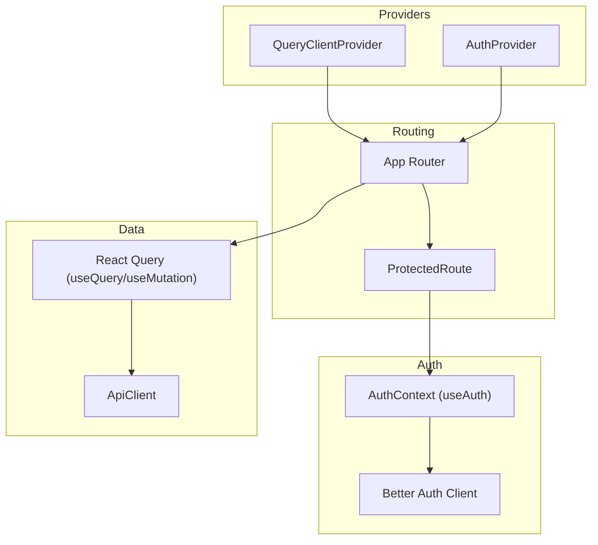
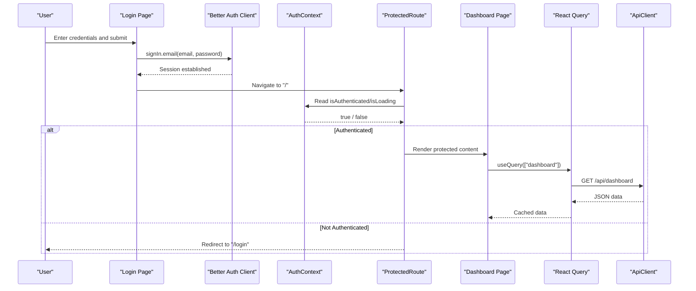
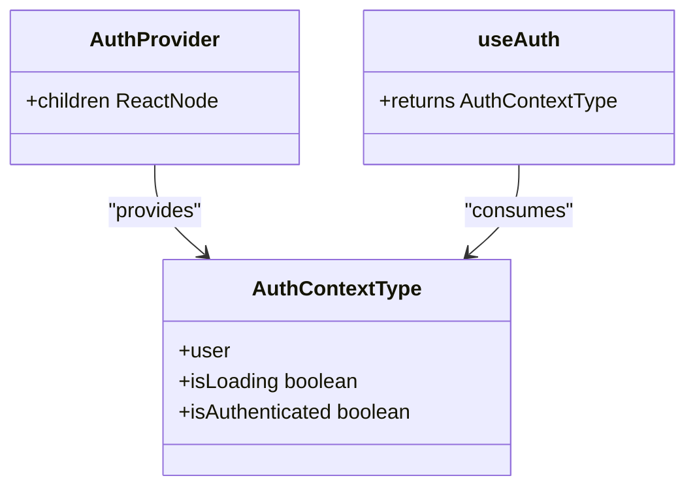
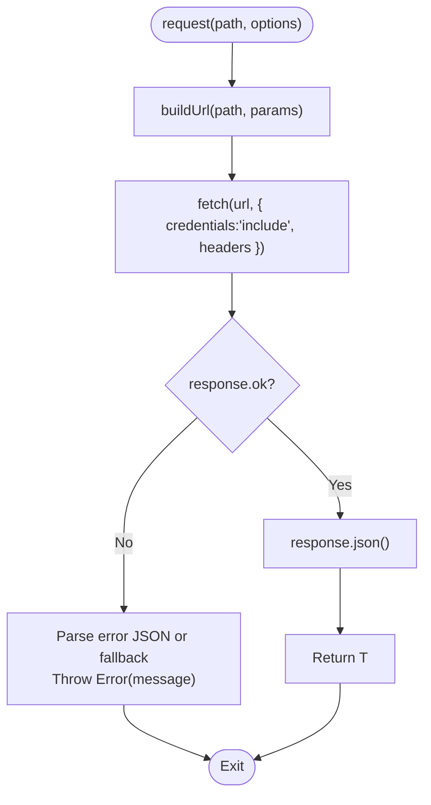
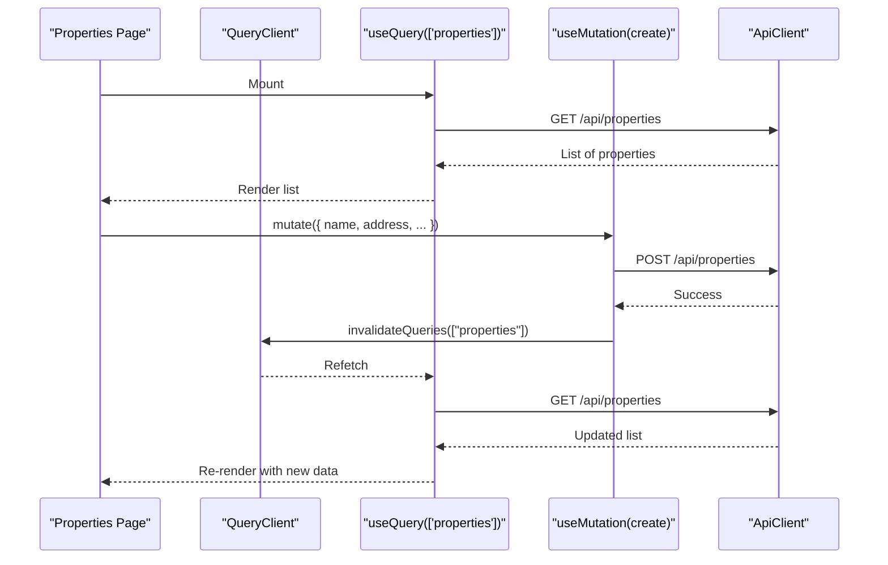
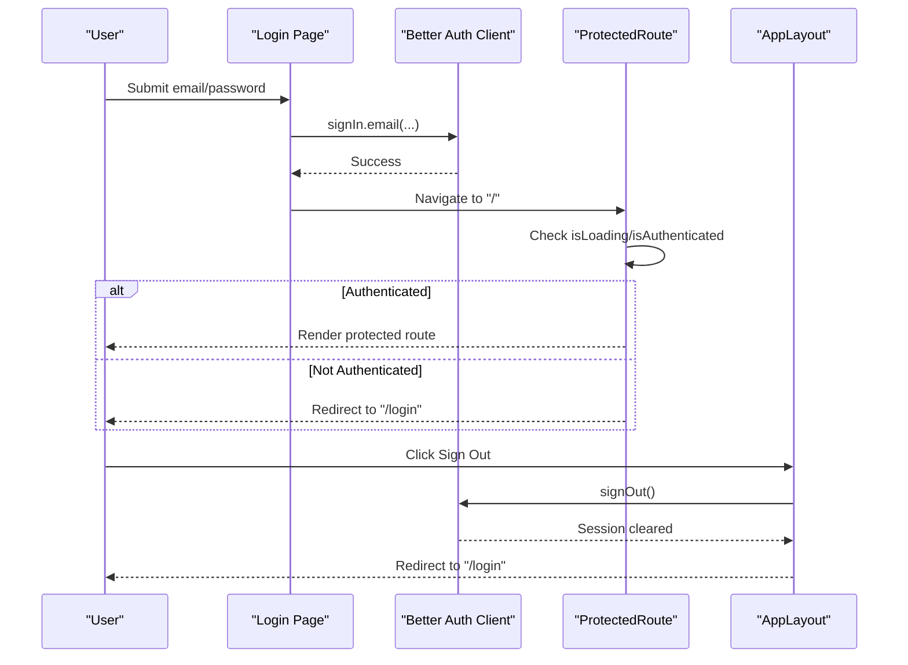
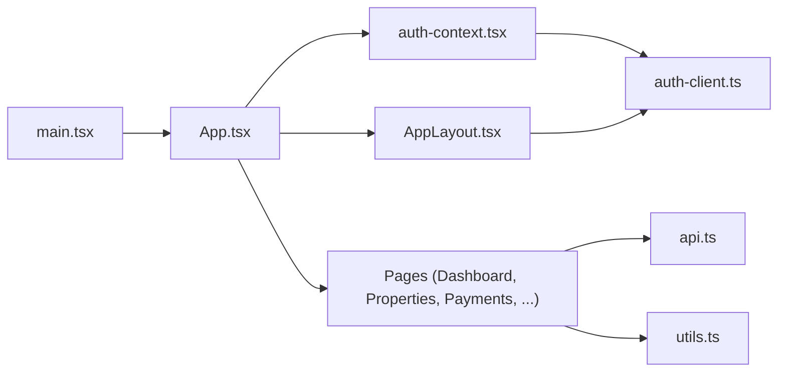

# State Management

<cite>
**Referenced Files in This Document**
- [main.tsx](file://client/src/main.tsx)
- [App.tsx](file://client/src/App.tsx)
- [auth-context.tsx](file://client/src/contexts/auth-context.tsx)
- [auth-client.ts](file://client/src/lib/auth-client.ts)
- [api.ts](file://client/src/lib/api.ts)
- [utils.ts](file://client/src/lib/utils.ts)
- [Login.tsx](file://client/src/pages/Login.tsx)
- [Dashboard.tsx](file://client/src/pages/Dashboard.tsx)
- [Properties.tsx](file://client/src/pages/Properties.tsx)
- [Payments.tsx](file://client/src/pages/Payments.tsx)
- [AppLayout.tsx](file://client/src/components/layout/AppLayout.tsx)
</cite>

## Table of Contents
1. Introduction
2. Project Structure
3. Core Components
4. Architecture Overview
5. Detailed Component Analysis
6. Dependency Analysis
7. Performance Considerations
8. Troubleshooting Guide
9. Conclusion

## Introduction
This document explains the client-side state management architecture with a focus on:
- Context-based global state using React Context for authentication
- Centralized API client for HTTP requests, response handling, and error management
- Utility functions used across the application
- Examples of state synchronization between components, authentication flow management, and data caching strategies
- Performance considerations and best practices for state updates

The application uses:
- React Context to expose authenticated user state globally
- Better Auth client for session management
- TanStack Query (React Query) for server-state caching, background refetching, and mutation invalidation
- A centralized ApiClient class for consistent HTTP behavior and error handling

## Project Structure
Key directories and files relevant to state management:
- contexts/auth-context.tsx: Provides global auth context via React Context
- lib/auth-client.ts: Wraps Better Auth client for sign-in, sign-up, sign-out, and session hooks
- lib/api.ts: Centralized HTTP client with base URL configuration, parameter building, and unified error handling
- lib/utils.ts: Shared utilities for formatting and styling
- pages/*: Feature pages that consume auth context and use react-query for data fetching/mutations
- App.tsx: Route-level protected routes using auth context
- main.tsx: Application bootstrap with QueryClient and AuthProvider setup

**Diagram sources**
- [main.tsx:9-27](file://client/src/main.tsx#L9-L27)
- [App.tsx:16-32](file://client/src/App.tsx#L16-L32)
- [auth-context.tsx:10-37](file://client/src/contexts/auth-context.tsx#L10-L37)
- [auth-client.ts:1-13](file://client/src/lib/auth-client.ts#L1-L13)
- [api.ts:7-81](file://client/src/lib/api.ts#L7-L81)

**Section sources**
- [main.tsx:1-29](file://client/src/main.tsx#L1-L29)
- [App.tsx:1-78](file://client/src/App.tsx#L1-L78)

## Core Components
- Authentication Context: Exposes user, loading, and authentication status to all components via React Context. It derives values from the Better Auth session hook.
- Better Auth Client: Provides signIn, signUp, signOut, and useSession hooks configured with the API base URL.
- ApiClient: Centralized HTTP layer that builds URLs, attaches credentials, handles 401 redirects, normalizes errors, and exposes typed get/post/put/delete helpers.
- React Query Integration: Pages use useQuery for data fetching and useMutation for writes, leveraging query invalidation to keep UI in sync.
- Utilities: Formatting helpers for currency and dates, plus a className merger utility.

**Section sources**
- [auth-context.tsx:4-37](file://client/src/contexts/auth-context.tsx#L4-L37)
- [auth-client.ts:1-13](file://client/src/lib/auth-client.ts#L1-L13)
- [api.ts:1-82](file://client/src/lib/api.ts#L1-L82)
- [Dashboard.tsx:24-27](file://client/src/pages/Dashboard.tsx#L24-L27)
- [Properties.tsx:49-72](file://client/src/pages/Properties.tsx#L49-L72)
- [Payments.tsx:63-94](file://client/src/pages/Payments.tsx#L63-L94)
- [utils.ts:4-34](file://client/src/lib/utils.ts#L4-L34)

## Architecture Overview
The application bootstraps providers at the root level:
- QueryClientProvider wraps the app to enable React Query caching and mutations
- AuthProvider wraps the app to provide global authentication state
- Routes protect non-public pages by checking authentication status from the context

Authentication flow:
- Login page calls signIn.email; upon success, navigation proceeds to the dashboard
- ProtectedRoute checks isLoading and isAuthenticated; while loading, it shows a spinner; if not authenticated, it redirects to login
- On sign out, the layout calls signOut and navigates back to login

Data flow:
- Pages fetch data via react-query queries bound to stable keys
- Mutations perform writes through ApiClient and invalidate related queries to synchronize UI
- ApiClient centralizes error handling and redirects on 401

**Diagram sources**
- [Login.tsx:16-35](file://client/src/pages/Login.tsx#L16-L35)
- [App.tsx:16-32](file://client/src/App.tsx#L16-L32)
- [auth-context.tsx:16-32](file://client/src/contexts/auth-context.tsx#L16-L32)
- [Dashboard.tsx:24-27](file://client/src/pages/Dashboard.tsx#L24-L27)
- [api.ts:26-54](file://client/src/lib/api.ts#L26-L54)

## Detailed Component Analysis

### Authentication Context Pattern
- The context provides a normalized user object, an isLoading flag, and an isAuthenticated boolean derived from the Better Auth session.
- Components consume this via a custom useAuth hook to avoid direct context usage.
- The provider wraps the entire app in main.tsx so any component can access auth state.

**Diagram sources**
- [auth-context.tsx:4-37](file://client/src/contexts/auth-context.tsx#L4-L37)

**Section sources**
- [auth-context.tsx:1-37](file://client/src/contexts/auth-context.tsx#L1-L37)
- [main.tsx:20-26](file://client/src/main.tsx#L20-L26)

### Centralized API Client
- Base URL is read from environment variables or defaults to empty string when running relative to origin.
- buildUrl constructs full URLs and serializes query parameters.
- request performs fetch with credentials included, sets JSON content type, handles 401 by redirecting to login, and throws normalized errors for non-ok responses.
- Convenience methods wrap common HTTP verbs with proper body serialization.

**Diagram sources**
- [api.ts:14-54](file://client/src/lib/api.ts#L14-L54)

**Section sources**
- [api.ts:1-82](file://client/src/lib/api.ts#L1-L82)

### React Query Data Caching and Synchronization
- Queries are keyed by stable strings (e.g., ["dashboard"], ["properties"], ["payments"]).
- Stale time and retry policies are set at the QueryClient level to reduce network calls and improve UX.
- Mutations trigger query invalidation to refresh lists after create/update/delete operations.

Examples:
- Dashboard fetches aggregated metrics once per key and displays them with loading/error states.
- Properties page lists properties, creates new ones, and deletes existing ones, invalidating the list on success.
- Payments page records payments and invalidates both the payment list and summary queries.

**Diagram sources**
- [Properties.tsx:49-72](file://client/src/pages/Properties.tsx#L49-L72)
- [api.ts:26-78](file://client/src/lib/api.ts#L26-L78)
- [main.tsx:9-17](file://client/src/main.tsx#L9-L17)

**Section sources**
- [Dashboard.tsx:24-47](file://client/src/pages/Dashboard.tsx#L24-L47)
- [Properties.tsx:49-83](file://client/src/pages/Properties.tsx#L49-L83)
- [Payments.tsx:63-94](file://client/src/pages/Payments.tsx#L63-L94)
- [main.tsx:9-17](file://client/src/main.tsx#L9-L17)

### Authentication Flow Management
- Login page calls signIn.email and navigates on success; errors are surfaced via toast notifications.
- ProtectedRoute guards routes by reading auth context; while loading, it renders a spinner; otherwise, it redirects unauthenticated users to login.
- Layout provides sign-out functionality that clears session and redirects to login.

**Diagram sources**
- [Login.tsx:16-35](file://client/src/pages/Login.tsx#L16-L35)
- [App.tsx:16-32](file://client/src/App.tsx#L16-L32)
- [AppLayout.tsx:36-39](file://client/src/components/layout/AppLayout.tsx#L36-L39)

**Section sources**
- [Login.tsx:16-35](file://client/src/pages/Login.tsx#L16-L35)
- [App.tsx:16-32](file://client/src/App.tsx#L16-L32)
- [AppLayout.tsx:31-39](file://client/src/components/layout/AppLayout.tsx#L31-L39)

### Utility Functions and Helpers
- cn merges Tailwind classes safely using clsx and tailwind-merge.
- formatCurrency formats numbers as USD currency without fractional digits.
- formatDate and formatDateShort format dates using Intl.DateTimeFormat.
- capitalize converts snake_case-like strings to Title Case with spaces.

These utilities are used throughout pages and components to ensure consistent formatting and styling.

**Section sources**
- [utils.ts:4-34](file://client/src/lib/utils.ts#L4-L34)
- [Dashboard.tsx:70-76](file://client/src/pages/Dashboard.tsx#L70-L76)
- [Payments.tsx:196-202](file://client/src/pages/Payments.tsx#L196-L202)

## Dependency Analysis
High-level dependencies among core modules:
- main.tsx initializes QueryClient and AuthProvider, making them available to the entire tree
- App.tsx defines routing and protected routes that depend on auth context
- auth-context.tsx depends on better-auth’s useSession hook
- Pages depend on react-query for data fetching and mutations, and on api.ts for HTTP requests
- AppLayout consumes auth context and triggers sign-out via auth-client

**Diagram sources**
- [main.tsx:9-27](file://client/src/main.tsx#L9-L27)
- [App.tsx:1-78](file://client/src/App.tsx#L1-L78)
- [auth-context.tsx:1-37](file://client/src/contexts/auth-context.tsx#L1-L37)
- [auth-client.ts:1-13](file://client/src/lib/auth-client.ts#L1-L13)
- [api.ts:1-82](file://client/src/lib/api.ts#L1-L82)
- [utils.ts:1-35](file://client/src/lib/utils.ts#L1-L35)
- [AppLayout.tsx:1-158](file://client/src/components/layout/AppLayout.tsx#L1-L158)

**Section sources**
- [main.tsx:1-29](file://client/src/main.tsx#L1-L29)
- [App.tsx:1-78](file://client/src/App.tsx#L1-L78)
- [auth-context.tsx:1-37](file://client/src/contexts/auth-context.tsx#L1-L37)
- [api.ts:1-82](file://client/src/lib/api.ts#L1-L82)
- [utils.ts:1-35](file://client/src/lib/utils.ts#L1-L35)
- [AppLayout.tsx:1-158](file://client/src/components/layout/AppLayout.tsx#L1-L158)

## Performance Considerations
- Use stable query keys to maximize cache hits and minimize redundant network requests.
- Configure staleTime and refetchOnWindowFocus appropriately to balance freshness and performance.
- Prefer query invalidation over manual cache updates to keep UI synchronized efficiently.
- Avoid unnecessary re-renders by keeping local form state separate from server state managed by react-query.
- Centralize error handling in ApiClient to prevent scattered try/catch blocks and reduce overhead.
- Use conditional rendering for loading and error states to improve perceived performance.

[No sources needed since this section provides general guidance]

## Troubleshooting Guide
Common issues and how they are handled:
- Unauthorized requests: ApiClient redirects to login on 401 responses and throws a standardized error. Ensure your backend enforces sessions correctly and that credentials are included.
- Network errors: Non-ok responses are parsed into a message and thrown; pages display friendly error messages and icons.
- Session loading: ProtectedRoute shows a spinner while auth state is pending; ensure the auth provider is mounted before accessing auth context.
- Mutation side effects: Always invalidate affected queries after successful mutations to reflect changes immediately.

**Section sources**
- [api.ts:39-51](file://client/src/lib/api.ts#L39-L51)
- [App.tsx:16-32](file://client/src/App.tsx#L16-L32)
- [Dashboard.tsx:29-47](file://client/src/pages/Dashboard.tsx#L29-L47)
- [Properties.tsx:54-72](file://client/src/pages/Properties.tsx#L54-L72)
- [Payments.tsx:84-94](file://client/src/pages/Payments.tsx#L84-L94)

## Conclusion
The application employs a clean separation of concerns:
- React Context provides global authentication state
- Better Auth manages sessions and user identity
- React Query handles server-state caching, background refetching, and mutation-driven synchronization
- A centralized ApiClient standardizes HTTP interactions and error handling
- Utilities ensure consistent formatting and styling

This architecture yields predictable state flows, robust error handling, and efficient data caching, resulting in a responsive and maintainable client experience.

[No sources needed since this section summarizes without analyzing specific files]