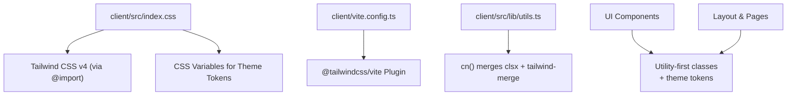
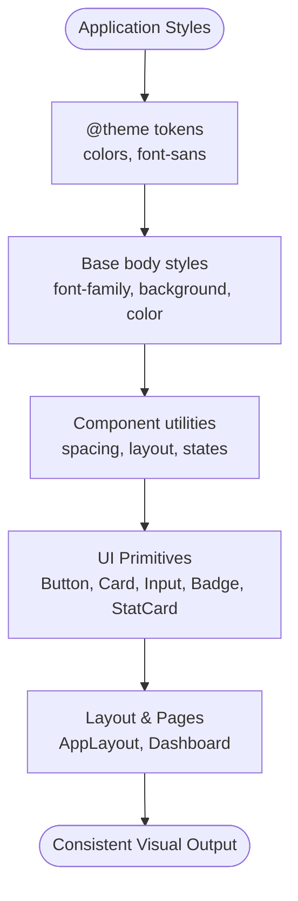
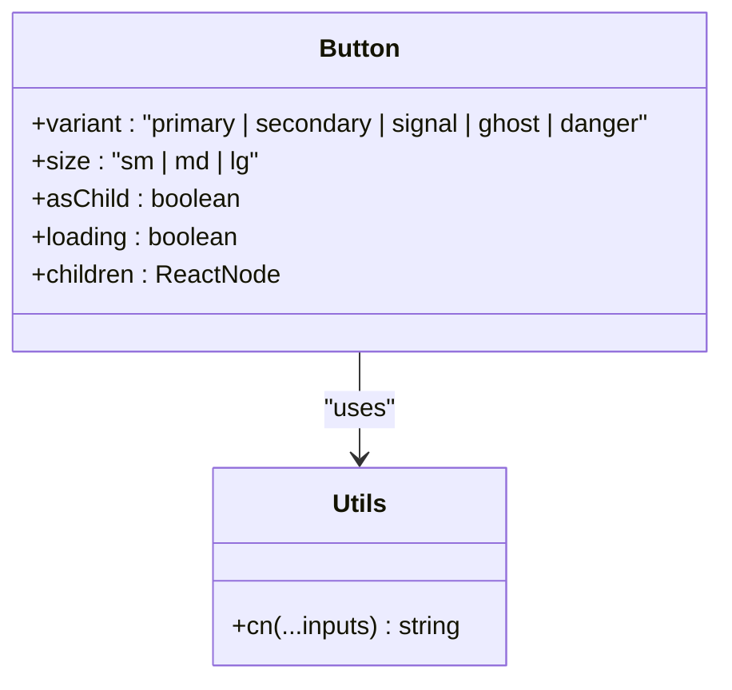
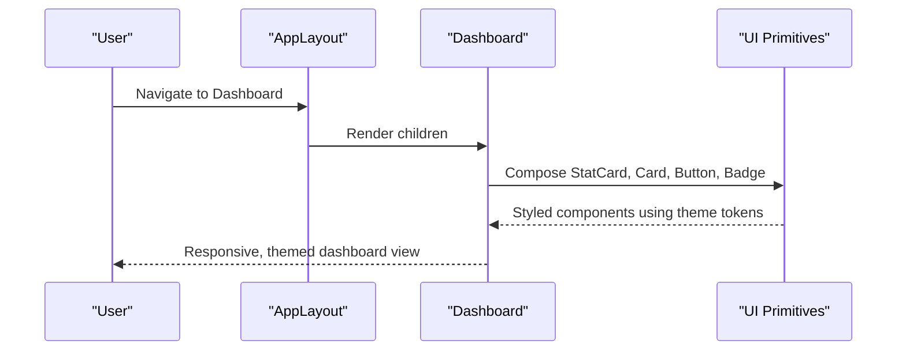
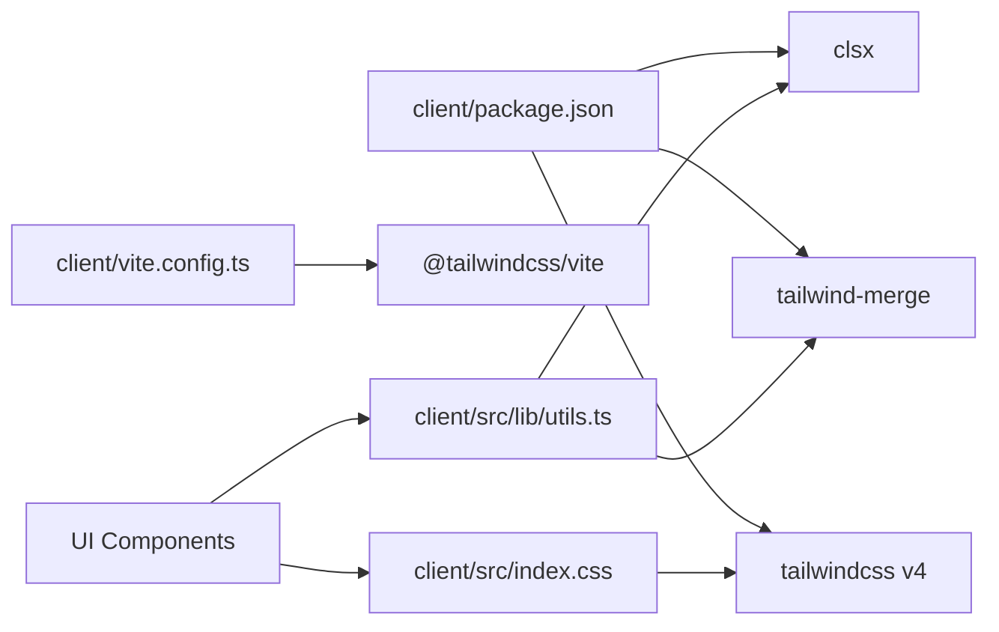

# Styling & Theming

<cite>
**Referenced Files in This Document**
- [index.css](file://client/src/index.css)
- [vite.config.ts](file://client/vite.config.ts)
- [package.json](file://client/package.json)
- [utils.ts](file://client/src/lib/utils.ts)
- [Button.tsx](file://client/src/components/ui/Button.tsx)
- [Card.tsx](file://client/src/components/ui/Card.tsx)
- [Input.tsx](file://client/src/components/ui/Input.tsx)
- [Badge.tsx](file://client/src/components/ui/Badge.tsx)
- [StatCard.tsx](file://client/src/components/ui/StatCard.tsx)
- [AppLayout.tsx](file://client/src/components/layout/AppLayout.tsx)
- [Dashboard.tsx](file://client/src/pages/Dashboard.tsx)
</cite>

## Table of Contents
1. Introduction
2. Project Structure
3. Core Components
4. Architecture Overview
5. Detailed Component Analysis
6. Dependency Analysis
7. Performance Considerations
8. Troubleshooting Guide
9. Conclusion

## Introduction
This document explains the styling and theming approach used across the application. It covers Tailwind CSS integration, utility-first patterns, global styles, component-specific styles, responsive design, color scheme, typography system, spacing conventions, theme customization, cross-browser considerations, and strategies for maintaining a consistent visual design across components and pages.

## Project Structure
The styling system is centered around:
- A single global stylesheet that imports Tailwind and defines the theme tokens, base styles, animations, and accessibility preferences.
- Vite configuration that enables Tailwind via a plugin.
- Reusable UI components that compose Tailwind utilities with a small helper to merge class names safely.
- Layout and page components that apply consistent spacing, colors, and responsive behavior using the shared tokens and utilities.

**Diagram sources**
- [index.css:1-19](file://client/src/index.css#L1-L19)
- [vite.config.ts:1-7](file://client/vite.config.ts#L1-L7)
- [utils.ts:1-6](file://client/src/lib/utils.ts#L1-L6)

**Section sources**
- [index.css:1-101](file://client/src/index.css#L1-L101)
- [vite.config.ts:1-24](file://client/vite.config.ts#L1-L24)
- [package.json:12-41](file://client/package.json#L12-L41)

## Core Components
The UI library provides composable primitives built with Tailwind utilities and theme tokens:
- Button: variants and sizes driven by semantic color tokens and spacing utilities; includes loading state and focus ring.
- Card: surface styling with border, background, and padding options; paired header/title/description subcomponents.
- Input, Textarea, Select: form controls with consistent borders, focus rings, disabled states, and transitions.
- Badge: semantic status indicators mapped to palette tokens.
- StatCard: dashboard metric cards with icon backgrounds and trend text using success/danger tokens.

These components rely on:
- The cn() helper to combine and deduplicate classes deterministically.
- Theme tokens defined in the global stylesheet for colors, fonts, and surfaces.
- Utility-first composition for layout, spacing, and responsive behavior.

**Section sources**
- [Button.tsx:1-50](file://client/src/components/ui/Button.tsx#L1-L50)
- [Card.tsx:1-42](file://client/src/components/ui/Card.tsx#L1-L42)
- [Input.tsx:1-86](file://client/src/components/ui/Input.tsx#L1-L86)
- [Badge.tsx:1-28](file://client/src/components/ui/Badge.tsx#L1-L28)
- [StatCard.tsx:1-54](file://client/src/components/ui/StatCard.tsx#L1-L54)
- [utils.ts:1-6](file://client/src/lib/utils.ts#L1-L6)

## Architecture Overview
The styling architecture follows a layered approach:
- Global layer: Tailwind import and @theme block define semantic tokens (colors, font). Base body styles set default font and colors. Animations, button transitions, scrollbar styling, and reduced-motion rules are centralized here.
- Utility layer: Components use Tailwind utilities for layout, spacing, typography, and state-driven styles (hover, focus, disabled).
- Composition layer: Higher-level components (layout, pages) assemble primitives into screens while reusing tokens and utilities consistently.

**Diagram sources**
- [index.css:1-29](file://client/src/index.css#L1-L29)
- [Button.tsx:13-25](file://client/src/components/ui/Button.tsx#L13-L25)
- [Card.tsx:8-25](file://client/src/components/ui/Card.tsx#L8-L25)
- [Input.tsx:4-18](file://client/src/components/ui/Input.tsx#L4-L18)
- [Badge.tsx:7-14](file://client/src/components/ui/Badge.tsx#L7-L14)
- [StatCard.tsx:11-17](file://client/src/components/ui/StatCard.tsx#L11-L17)
- [AppLayout.tsx:41-155](file://client/src/components/layout/AppLayout.tsx#L41-L155)
- [Dashboard.tsx:121-229](file://client/src/pages/Dashboard.tsx#L121-L229)

## Detailed Component Analysis

### Global Theme and Base Styles
- Theme tokens: Semantic color variables (ink, muted, canvas, surface, line, signal, signal-soft, deep, success, danger, warning, violet, blue) and a sans-serif font stack are declared in the @theme block. These become available as Tailwind utilities (e.g., bg-surface, text-ink, border-line).
- Base styles: Body sets the font family, background, and text color, plus font smoothing for crisp rendering on different platforms.
- Typography helpers: Utility-like classes for hero titles and eyebrow labels provide consistent typographic scale and letter-spacing.
- Motion and accessibility: A rise-in animation is provided for entrance effects; a global prefers-reduced-motion rule disables animations/transitions when users prefer reduced motion.

**Section sources**
- [index.css:3-19](file://client/src/index.css#L3-L19)
- [index.css:21-29](file://client/src/index.css#L21-L29)
- [index.css:33-45](file://client/src/index.css#L33-L45)
- [index.css:49-62](file://client/src/index.css#L49-L62)
- [index.css:94-101](file://client/src/index.css#L94-L101)

### Button Component
- Variants: primary, secondary, signal, ghost, danger map to specific combinations of background, text, and hover states using theme tokens and Tailwind utilities.
- Sizes: sm, md, lg control height, padding, and font size.
- States: Focus-visible ring uses the signal token; disabled state reduces opacity and pointer events; loading state shows a spinner.
- Composition: Uses the cn() helper to merge variant, size, and user-provided classes without conflicts.

**Diagram sources**
- [Button.tsx:6-25](file://client/src/components/ui/Button.tsx#L6-L25)
- [Button.tsx:27-47](file://client/src/components/ui/Button.tsx#L27-L47)
- [utils.ts:1-6](file://client/src/lib/utils.ts#L1-L6)

**Section sources**
- [Button.tsx:1-50](file://client/src/components/ui/Button.tsx#L1-L50)

### Card and Subcomponents
- Surface: Rounded corners, subtle border, white surface background, and shadow create a consistent card look.
- Padding: Configurable padding levels (none, sm, md, lg) applied via utility classes.
- Subcomponents: Header, Title, and Description provide consistent spacing and typography tied to theme tokens.

**Section sources**
- [Card.tsx:1-42](file://client/src/components/ui/Card.tsx#L1-L42)

### Form Controls (Input, Textarea, Select)
- Consistent appearance: Uniform height, rounded corners, border, background, and text color using theme tokens.
- Focus states: Highlighted border and soft ring using the signal token.
- Disabled state: Cursor and opacity changes for clarity.
- Transitions: Smooth transitions for focus and state changes.

**Section sources**
- [Input.tsx:1-86](file://client/src/components/ui/Input.tsx#L1-L86)

### Badge Component
- Variants: default, success, warning, danger, signal, outline map to semantic color palettes.
- Usage: Compact inline elements for statuses and counts, styled with consistent typography and spacing.

**Section sources**
- [Badge.tsx:1-28](file://client/src/components/ui/Badge.tsx#L1-L28)

### StatCard Component
- Icon background: Color-coded backgrounds per semantic token (signal, success, blue, violet, deep).
- Typography: Uppercase label, large value, and optional trend indicator using success/danger tokens.
- Interaction: Hover lift and shadow transition for feedback.

**Section sources**
- [StatCard.tsx:1-54](file://client/src/components/ui/StatCard.tsx#L1-L54)

### Layout and Page-Level Styling
- AppLayout: Uses theme tokens for background and borders; responsive sidebar with mobile overlay; consistent header and main content area spacing.
- Dashboard: Demonstrates responsive grids, consistent spacing, and usage of primitives (StatCard, Card, Button, Badge) to build a cohesive screen.

**Diagram sources**
- [AppLayout.tsx:41-155](file://client/src/components/layout/AppLayout.tsx#L41-L155)
- [Dashboard.tsx:121-229](file://client/src/pages/Dashboard.tsx#L121-L229)
- [StatCard.tsx:19-52](file://client/src/components/ui/StatCard.tsx#L19-L52)
- [Card.tsx:15-25](file://client/src/components/ui/Card.tsx#L15-L25)
- [Button.tsx:27-47](file://client/src/components/ui/Button.tsx#L27-L47)
- [Badge.tsx:16-26](file://client/src/components/ui/Badge.tsx#L16-L26)

**Section sources**
- [AppLayout.tsx:1-158](file://client/src/components/layout/AppLayout.tsx#L1-L158)
- [Dashboard.tsx:1-233](file://client/src/pages/Dashboard.tsx#L1-L233)

## Dependency Analysis
Styling dependencies are intentionally minimal and focused:
- Tailwind CSS v4 is imported directly in the stylesheet and enabled via the Vite plugin.
- Class merging relies on clsx and tailwind-merge through the cn() helper to avoid conflicting utilities.
- UI components depend on theme tokens and utilities rather than custom CSS modules or heavy style libraries.

**Diagram sources**
- [package.json:12-41](file://client/package.json#L12-L41)
- [vite.config.ts:1-7](file://client/vite.config.ts#L1-L7)
- [index.css:1-1](file://client/src/index.css#L1-L1)
- [utils.ts:1-6](file://client/src/lib/utils.ts#L1-L6)

**Section sources**
- [package.json:12-41](file://client/package.json#L12-L41)
- [vite.config.ts:1-7](file://client/vite.config.ts#L1-L7)
- [index.css:1-1](file://client/src/index.css#L1-L1)
- [utils.ts:1-6](file://client/src/lib/utils.ts#L1-L6)

## Performance Considerations
- Utility-first with Tailwind v4 minimizes custom CSS and leverages efficient compilation.
- Centralized theme tokens reduce duplication and ensure consistent values across components.
- Reduced-motion media query respects user preferences, improving performance and accessibility for sensitive users.
- Avoid animating layout-affecting properties; current animations use transform and opacity for smooth, GPU-friendly transitions.

[No sources needed since this section provides general guidance]

## Troubleshooting Guide
- Missing theme tokens: If a color or font appears incorrect, verify it is defined in the @theme block and referenced via Tailwind utilities (e.g., bg-surface, text-ink).
- Conflicting classes: Use the cn() helper to merge classes; it resolves duplicates and ensures predictable output.
- Focus visibility: Ensure focus-visible styles are present for interactive elements; the Button and form controls include focus rings using the signal token.
- Reduced motion: If animations feel disruptive, confirm the prefers-reduced-motion rule is active and consider disabling custom animations where necessary.
- Build issues: Confirm the Tailwind plugin is registered in Vite and that the stylesheet imports Tailwind at the top.

**Section sources**
- [index.css:3-19](file://client/src/index.css#L3-L19)
- [index.css:94-101](file://client/src/index.css#L94-L101)
- [utils.ts:1-6](file://client/src/lib/utils.ts#L1-L6)
- [Button.tsx:27-47](file://client/src/components/ui/Button.tsx#L27-L47)
- [Input.tsx:4-18](file://client/src/components/ui/Input.tsx#L4-L18)
- [vite.config.ts:1-7](file://client/vite.config.ts#L1-L7)

## Conclusion
The application employs a clean, scalable styling system based on Tailwind CSS v4 and a well-defined theme. Global tokens establish a consistent color and typography foundation, while utility-first patterns in reusable components ensure maintainability and consistency. Responsive layouts, accessible interactions, and thoughtful motion contribute to a polished user experience. By centralizing theme definitions and composing UI with utilities, the codebase remains easy to extend and customize while preserving visual coherence across all components and pages.