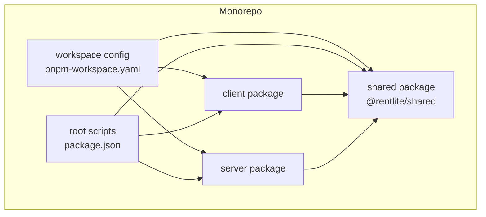
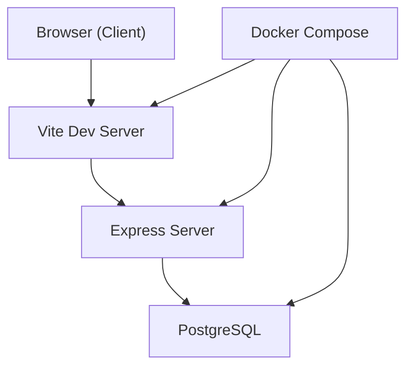
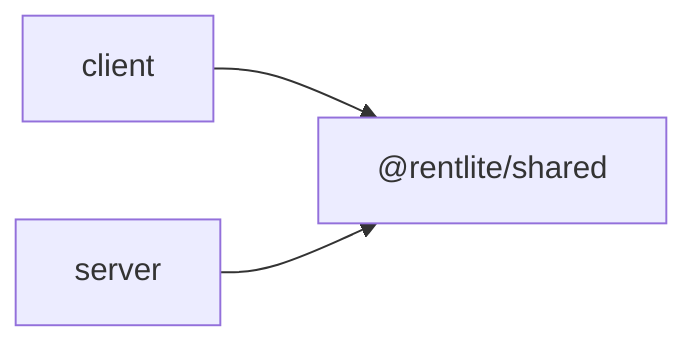

# Monorepo Structure

<cite>
**Referenced Files in This Document**
- [package.json](file://package.json)
- [pnpm-workspace.yaml](file://pnpm-workspace.yaml)
- [client/package.json](file://client/package.json)
- [server/package.json](file://server/package.json)
- [shared/package.json](file://shared/package.json)
- [shared/src/index.ts](file://shared/src/index.ts)
- [shared/src/types.ts](file://shared/src/types.ts)
- [tsconfig.json](file://tsconfig.json)
- [client/tsconfig.json](file://client/tsconfig.json)
- [server/tsconfig.json](file://server/tsconfig.json)
- [client/src/lib/api.ts](file://client/src/lib/api.ts)
- [server/src/index.ts](file://server/src/index.ts)
- [server/src/db/schema.ts](file://server/src/db/schema.ts)
- [docker-compose.yml](file://docker-compose.yml)
</cite>

## Table of Contents
1. [Introduction](#introduction)
2. [Project Structure](#project-structure)
3. [Core Components](#core-components)
4. [Architecture Overview](#architecture-overview)
5. [Detailed Component Analysis](#detailed-component-analysis)
6. [Dependency Analysis](#dependency-analysis)
7. [Performance Considerations](#performance-considerations)
8. [Troubleshooting Guide](#troubleshooting-guide)
9. [Conclusion](#conclusion)
10. [Appendices](#appendices)

## Introduction
This document explains the RentLite monorepo architecture built with pnpm workspaces. It covers how the workspace is organized into separate client, server, and shared packages; how TypeScript end-to-end type safety is achieved via shared types; how builds and dependencies are managed across packages; and how packages reference each other while maintaining version consistency. It also outlines benefits for development workflow, code sharing, deployment strategies, and provides guidance on adding new packages and maintaining cross-package dependencies.

## Project Structure
RentLite uses a three-package monorepo:
- shared: A pure TypeScript package that centralizes domain types and API contracts used by both client and server.
- client: A Vite-based React frontend that consumes shared types to ensure UI models match server responses.
- server: An Express backend with Drizzle ORM and PostgreSQL, which defines database schema and exposes REST endpoints.

Workspace configuration declares all packages so pnpm can resolve local dependencies and run commands per package. The root package.json provides unified scripts to build, check, and manage the database across the workspace.

**Diagram sources**
- [pnpm-workspace.yaml:1-5](file://pnpm-workspace.yaml#L1-L5)
- [package.json:6-14](file://package.json#L6-L14)

**Section sources**
- [pnpm-workspace.yaml:1-5](file://pnpm-workspace.yaml#L1-L5)
- [package.json:1-21](file://package.json#L1-L21)

## Core Components
- Shared types package (@rentlite/shared): Exposes domain interfaces and enums (e.g., Property, Tenant, Payment, MaintenanceRequest, Expense, Vendor, Notification, Subscription, PaginatedResponse). Both client and server import these types to keep contracts consistent.
- Client: Uses a typed fetch wrapper to call server endpoints and returns strongly-typed responses based on shared types.
- Server: Defines Drizzle schema and routes that operate on the same domain model as the shared types.

Benefits:
- End-to-end type safety: Changes to shared types propagate compile-time errors across client and server if they break usage.
- Single source of truth: Domain vocabulary lives in one place, reducing drift between UI and API.
- Simplified testing and mocking: Shared types enable consistent mocks and fixtures.

**Section sources**
- [shared/src/types.ts:1-251](file://shared/src/types.ts#L1-L251)
- [shared/src/index.ts:1-2](file://shared/src/index.ts#L1-L2)
- [client/src/lib/api.ts:1-82](file://client/src/lib/api.ts#L1-L82)
- [server/src/db/schema.ts:1-403](file://server/src/db/schema.ts#L1-L403)

## Architecture Overview
The runtime architecture consists of a browser-based client communicating over HTTP with an Express server backed by PostgreSQL. Docker Compose orchestrates services for local development.

**Diagram sources**
- [docker-compose.yml:1-64](file://docker-compose.yml#L1-L64)
- [server/src/index.ts:16-58](file://server/src/index.ts#L16-L58)

## Detailed Component Analysis

### Workspace Configuration and Scripts
- pnpm-workspace.yaml lists shared, server, and client as workspace packages.
- Root package.json defines:
  - dev: starts all services via docker compose
  - dev:server and dev:client: run individual packages in watch mode
  - build: builds shared first, then server, then client
  - check: runs type checks across packages
  - db:*: delegates to server’s drizzle scripts

These scripts enable consistent workflows across environments and simplify multi-package operations.

**Section sources**
- [pnpm-workspace.yaml:1-5](file://pnpm-workspace.yaml#L1-L5)
- [package.json:6-14](file://package.json#L6-L14)

### Shared Package: Centralized Types
- Exports all types from a single entry point.
- Includes domain models for properties, units, tenants, leases, payments, maintenance requests, expenses, vendors, notifications, subscriptions, reports, and common API response shapes.
- Published as a module with explicit exports and types fields for IDE support.

Impact:
- Enforces consistent data contracts between client and server.
- Enables compile-time validation when either side changes the contract.

**Section sources**
- [shared/package.json:1-22](file://shared/package.json#L1-L22)
- [shared/src/index.ts:1-2](file://shared/src/index.ts#L1-L2)
- [shared/src/types.ts:1-251](file://shared/src/types.ts#L1-L251)

### Client Package: Typed API Layer
- Provides a typed fetch wrapper that supports GET/POST/PUT/DELETE with generic return types.
- Uses environment variables for API base URL and handles auth redirects and error parsing.
- Imports shared types to type request bodies and responses, ensuring UI components receive correctly shaped data.

Example usage pattern:
- Call api.get<T>(path) or api.post<T>(path, body) where T is a shared type like PaginatedResponse<Property>.

**Section sources**
- [client/package.json:1-44](file://client/package.json#L1-L44)
- [client/src/lib/api.ts:1-82](file://client/src/lib/api.ts#L1-L82)

### Server Package: Routes, Schema, and Entrypoint
- Express app sets up CORS, JSON parsing, mounts route modules, and exposes a health endpoint.
- Drizzle schema defines tables and enums aligned with shared domain types.
- Environment-driven configuration for database, auth, and client origins.

Build and run:
- Build compiles TypeScript to dist.
- Start runs compiled output.
- Database migrations and seeding are delegated to drizzle-kit scripts.

**Section sources**
- [server/package.json:1-37](file://server/package.json#L1-L37)
- [server/src/index.ts:1-59](file://server/src/index.ts#L1-L59)
- [server/src/db/schema.ts:1-403](file://server/src/db/schema.ts#L1-L403)

### TypeScript Configuration and Cross-Package References
- Root tsconfig.json sets strict compilation options, ES target, bundler module resolution, and declaration generation.
- Client extends root config and adds DOM libs, JSX settings, path aliases, and Vite client types.
- Server extends root config, targets Node, disables declarations for runtime build, and references the shared package to include its types during compilation.

Result:
- Consistent compiler behavior across packages.
- Strong typing across boundaries without duplicating types.

**Section sources**
- [tsconfig.json:1-17](file://tsconfig.json#L1-L17)
- [client/tsconfig.json:1-16](file://client/tsconfig.json#L1-L16)
- [server/tsconfig.json:1-14](file://server/tsconfig.json#L1-L14)

### Dependency Management and Version Consistency
- Both client and server depend on @rentlite/shared using workspace:* protocol, which resolves to the local shared package without publishing.
- This ensures client and server always consume the exact same types defined in shared.
- Root scripts coordinate builds and checks to maintain consistency across packages.

Versioning strategy:
- For internal development, workspace:* keeps versions in sync automatically.
- If you later publish shared to a registry, switch to semantic versioning and pin versions in client/server to ensure reproducible builds.

**Section sources**
- [client/package.json:12-14](file://client/package.json#L12-L14)
- [server/package.json:15-17](file://server/package.json#L15-L17)
- [package.json:6-14](file://package.json#L6-L14)

### Build Process Across Packages
- Build order: shared → server → client.
- Shared build emits JavaScript and type declarations consumed by client and server.
- Client build produces static assets served by a web server or CDN.
- Server build outputs Node.js application files.

Operational notes:
- Use root build script to produce a fully consistent artifact set.
- Use root check script to validate types across packages before committing.

**Section sources**
- [package.json:6-14](file://package.json#L6-L14)
- [shared/package.json:14-17](file://shared/package.json#L14-L17)
- [server/package.json:6-13](file://server/package.json#L6-L13)
- [client/package.json:6-10](file://client/package.json#L6-L10)

### Development Workflow and Local Services
- docker-compose.yml defines Postgres, server, and client services with environment variables and port mappings.
- Root dev script starts all services together for local development.
- Individual dev scripts allow running only the client or server in watch mode.

**Section sources**
- [docker-compose.yml:1-64](file://docker-compose.yml#L1-L64)
- [package.json:6-14](file://package.json#L6-L14)

## Dependency Analysis
The dependency graph shows clear separation and controlled coupling:
- client depends on @rentlite/shared for types.
- server depends on @rentlite/shared for types.
- No direct client-server imports at build time; communication happens over HTTP.

**Diagram sources**
- [client/package.json:12-14](file://client/package.json#L12-L14)
- [server/package.json:15-17](file://server/package.json#L15-L17)
- [shared/package.json:1-22](file://shared/package.json#L1-L22)

**Section sources**
- [client/package.json:12-14](file://client/package.json#L12-L14)
- [server/package.json:15-17](file://server/package.json#L15-L17)

## Performance Considerations
- Keep shared package lean: export only necessary types to minimize bundle impact and improve IDE performance.
- Prefer incremental builds: use workspace-aware scripts to rebuild only affected packages.
- Avoid heavy runtime logic in shared; keep it type-only to reduce overhead.
- Cache node_modules with pnpm store to speed up installs across packages.

[No sources needed since this section provides general guidance]

## Troubleshooting Guide
Common issues and resolutions:
- Type mismatches between client and server:
  - Update shared types and re-run type checks across packages to catch inconsistencies early.
- Build order problems:
  - Ensure shared builds before client/server; use root build script to enforce order.
- Workspace resolution errors:
  - Verify pnpm-workspace.yaml includes all packages and that workspace:* is used consistently.
- Docker networking:
  - Confirm CLIENT_URL and VITE_API_URL align with container hostnames and ports.

**Section sources**
- [package.json:6-14](file://package.json#L6-L14)
- [pnpm-workspace.yaml:1-5](file://pnpm-workspace.yaml#L1-L5)
- [docker-compose.yml:20-60](file://docker-compose.yml#L20-L60)

## Conclusion
RentLite’s monorepo structure leverages pnpm workspaces to unify client, server, and shared packages under a single repository. Shared types provide end-to-end TypeScript safety, while root scripts standardize builds, checks, and database operations. This setup improves developer productivity, reduces integration friction, and simplifies deployment through consistent artifacts and container orchestration.

[No sources needed since this section summarizes without analyzing specific files]

## Appendices

### How to Add a New Package to the Workspace
Steps:
1. Create a new directory at the repo root (e.g., features/auth-client).
2. Add a package.json with name, version, type, scripts, and dependencies.
3. Register the package in pnpm-workspace.yaml under packages.
4. Reference the new package from other packages using workspace:* if needed.
5. Add any required TypeScript configuration extending the root tsconfig.
6. Update root scripts if the new package needs to be built or checked alongside others.

Best practices:
- Keep packages focused and cohesive.
- Prefer importing shared types rather than duplicating them.
- Use workspace:* for internal dependencies to avoid version drift.

[No sources needed since this section provides general guidance]

### Maintaining Cross-Package Dependencies
Guidelines:
- Centralize shared contracts in @rentlite/shared.
- Pin workspace dependencies to workspace:* to ensure local parity.
- Run root check and build scripts before merging changes that affect multiple packages.
- When publishing shared to a registry, adopt semantic versioning and update consumers accordingly.

[No sources needed since this section provides general guidance]