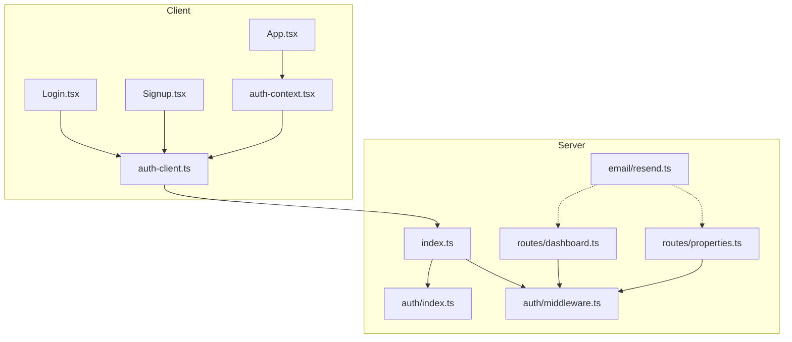
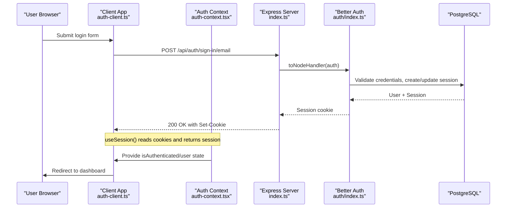
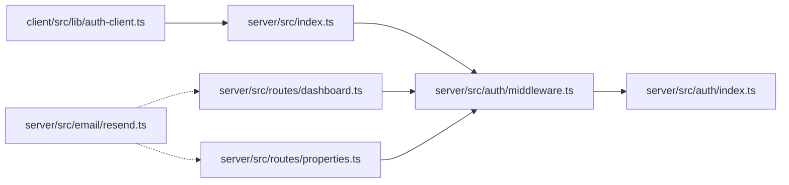

# Authentication & Security

<cite>
**Referenced Files in This Document**
- [server/src/auth/index.ts](file://server/src/auth/index.ts)
- [server/src/auth/middleware.ts](file://server/src/auth/middleware.ts)
- [server/src/index.ts](file://server/src/index.ts)
- [client/src/lib/auth-client.ts](file://client/src/lib/auth-client.ts)
- [client/src/contexts/auth-context.tsx](file://client/src/contexts/auth-context.tsx)
- [client/src/pages/Login.tsx](file://client/src/pages/Login.tsx)
- [client/src/pages/Signup.tsx](file://client/src/pages/Signup.tsx)
- [client/src/App.tsx](file://client/src/App.tsx)
- [server/src/routes/dashboard.ts](file://server/src/routes/dashboard.ts)
- [server/src/routes/properties.ts](file://server/src/routes/properties.ts)
- [server/src/email/resend.ts](file://server/src/email/resend.ts)
- [RentLite-Product-Spec-Sheet.md](file://RentLite-Product-Spec-Sheet.md)
</cite>

## Table of Contents
1. Introduction
2. Project Structure
3. Core Components
4. Architecture Overview
5. Detailed Component Analysis
6. Dependency Analysis
7. Performance Considerations
8. Troubleshooting Guide
9. Conclusion
10. Appendices

## Introduction
This document explains the authentication and security design for RentLite, focusing on Better Auth integration, session management, route protection, client-side state, input validation, secure communication, role-based access control guidance, data encryption strategy, and compliance considerations for tenant personal information and financial data. It also provides testing and vulnerability assessment recommendations to strengthen the application’s security posture.

## Project Structure
RentLite is a full-stack TypeScript application with:
- A Node/Express server that exposes API routes and mounts Better Auth endpoints under /api/auth/*
- A React client that manages user sessions via a Better Auth client and protects routes using an auth context
- Shared database schema (Drizzle ORM) including tables for users, sessions, accounts, verifications, and domain entities

**Diagram sources**
- [server/src/index.ts:1-59](file://server/src/index.ts#L1-L59)
- [server/src/auth/index.ts:1-23](file://server/src/auth/index.ts#L1-L23)
- [server/src/auth/middleware.ts:1-45](file://server/src/auth/middleware.ts#L1-L45)
- [client/src/lib/auth-client.ts:1-13](file://client/src/lib/auth-client.ts#L1-L13)
- [client/src/contexts/auth-context.tsx:1-38](file://client/src/contexts/auth-context.tsx#L1-L38)
- [client/src/pages/Login.tsx:1-148](file://client/src/pages/Login.tsx#L1-L148)
- [client/src/pages/Signup.tsx:1-185](file://client/src/pages/Signup.tsx#L1-L185)
- [client/src/App.tsx:1-78](file://client/src/App.tsx#L1-L78)
- [server/src/routes/dashboard.ts:1-124](file://server/src/routes/dashboard.ts#L1-L124)
- [server/src/routes/properties.ts:1-106](file://server/src/routes/properties.ts#L1-L106)
- [server/src/email/resend.ts:1-113](file://server/src/email/resend.ts#L1-L113)

**Section sources**
- [server/src/index.ts:1-59](file://server/src/index.ts#L1-L59)
- [client/src/App.tsx:1-78](file://client/src/App.tsx#L1-L78)

## Core Components
- Better Auth server configuration: email/password enabled, session lifetime, trusted origins, Drizzle adapter for PostgreSQL
- Express middleware to mount Better Auth handlers and protect routes by extracting sessions
- Client-side auth client and React context for session state and protected routing
- Route-level authorization using per-route middleware and user-scoped queries
- Email service for notifications and future password reset flows

Key responsibilities:
- Server: authenticate users, manage sessions, enforce authorization at route boundaries, validate inputs, query data scoped to the authenticated user
- Client: collect credentials, call auth endpoints, maintain session state, guard UI routes

**Section sources**
- [server/src/auth/index.ts:1-23](file://server/src/auth/index.ts#L1-L23)
- [server/src/auth/middleware.ts:1-45](file://server/src/auth/middleware.ts#L1-L45)
- [client/src/lib/auth-client.ts:1-13](file://client/src/lib/auth-client.ts#L1-L13)
- [client/src/contexts/auth-context.tsx:1-38](file://client/src/contexts/auth-context.tsx#L1-L38)
- [server/src/routes/properties.ts:1-106](file://server/src/routes/properties.ts#L1-L106)
- [server/src/routes/dashboard.ts:1-124](file://server/src/routes/dashboard.ts#L1-L124)

## Architecture Overview
The authentication flow uses Better Auth with cookie-based sessions and Express middleware. The client calls the Better Auth client methods which communicate over HTTPS with the server. Routes are protected by middleware that validates sessions and attaches user identity.

**Diagram sources**
- [client/src/pages/Login.tsx:16-35](file://client/src/pages/Login.tsx#L16-L35)
- [client/src/lib/auth-client.ts:1-13](file://client/src/lib/auth-client.ts#L1-L13)
- [client/src/contexts/auth-context.tsx:16-33](file://client/src/contexts/auth-context.tsx#L16-L33)
- [server/src/index.ts:29-32](file://server/src/index.ts#L29-L32)
- [server/src/auth/middleware.ts:1-7](file://server/src/auth/middleware.ts#L1-L7)
- [server/src/auth/index.ts:5-20](file://server/src/auth/index.ts#L5-L20)

## Detailed Component Analysis

### Better Auth Configuration
- Enables email/password authentication without mandatory email verification (recommended to enable in production)
- Configures session expiration and update intervals
- Sets trusted origins to restrict cross-origin requests to the configured client URL
- Uses Drizzle adapter to persist sessions and accounts in PostgreSQL

Security notes:
- Ensure CLIENT_URL matches your deployed frontend origin
- Consider enabling email verification for stronger account assurance
- Review session duration and updateAge based on risk tolerance

**Section sources**
- [server/src/auth/index.ts:5-20](file://server/src/auth/index.ts#L5-L20)

### Route Protection Middleware
- Mounts Better Auth endpoints under /api/auth/*
- Provides authMiddleware to require a valid session; returns 401 if missing
- Provides optionalAuth for routes that allow both authenticated and unauthenticated access
- Attaches session and userId to the request for downstream handlers

Authorization pattern:
- Apply router.use(authMiddleware) at the top of each protected route module
- Use req.userId to scope queries to the current user’s data

**Section sources**
- [server/src/index.ts:29-32](file://server/src/index.ts#L29-L32)
- [server/src/auth/middleware.ts:8-45](file://server/src/auth/middleware.ts#L8-L45)
- [server/src/routes/dashboard.ts:1-12](file://server/src/routes/dashboard.ts#L1-L12)
- [server/src/routes/properties.ts:1-10](file://server/src/routes/properties.ts#L1-L10)

### Client-Side Authentication Context
- Creates a Better Auth client pointing to the backend base URL
- Exposes signIn, signUp, signOut, and useSession hooks
- React context wraps the app to provide user, loading state, and isAuthenticated flag
- ProtectedRoute guards routes by redirecting to /login when not authenticated

Best practices:
- Always use HTTPS in production
- Keep VITE_API_URL aligned with the deployed server URL
- Handle errors gracefully and show user-friendly messages

**Section sources**
- [client/src/lib/auth-client.ts:1-13](file://client/src/lib/auth-client.ts#L1-L13)
- [client/src/contexts/auth-context.tsx:1-38](file://client/src/contexts/auth-context.tsx#L1-L38)
- [client/src/App.tsx:16-32](file://client/src/App.tsx#L16-L32)

### Login Flow
- Collects email and password
- Calls signIn.email from the auth client
- On success, navigates to the dashboard; on error, shows toast feedback

Security considerations:
- Enforce minimum password length on the client
- Avoid logging sensitive fields
- Use CSRF-safe cookies (handled by Better Auth + CORS config)

**Section sources**
- [client/src/pages/Login.tsx:16-35](file://client/src/pages/Login.tsx#L16-L35)

### Signup Flow
- Validates matching passwords and minimum length
- Calls signUp.email to create the account
- Navigates to dashboard on success

Security considerations:
- Enforce strong password policies on the client
- Consider adding server-side validation for additional constraints
- Enable email verification in production for improved security

**Section sources**
- [client/src/pages/Signup.tsx:18-48](file://client/src/pages/Signup.tsx#L18-L48)

### Protected Routes and Data Scoping
- Dashboard and Properties routers apply authMiddleware to ensure only authenticated users can access them
- Queries filter by userId to prevent horizontal privilege escalation
- Input validation via Zod ensures safe and well-formed payloads before DB writes

Example patterns:
- List properties scoped to the current user
- Create property with validated payload and auto-create units
- Update/delete operations verify ownership before mutating data

**Section sources**
- [server/src/routes/dashboard.ts:1-16](file://server/src/routes/dashboard.ts#L1-L16)
- [server/src/routes/properties.ts:11-23](file://server/src/routes/properties.ts#L11-L23)
- [server/src/routes/properties.ts:26-71](file://server/src/routes/properties.ts#L26-L71)
- [server/src/routes/properties.ts:73-103](file://server/src/routes/properties.ts#L73-L103)

### Email Service and Password Reset Guidance
- Resend integration sends transactional emails with templates for reminders, receipts, and maintenance updates
- Password reset functionality is not implemented yet; recommended approach:
  - Use Better Auth’s built-in password reset capabilities or implement a token-based flow
  - Generate short-lived, single-use tokens stored securely
  - Send reset links via the email service
  - Validate token expiry and usage once

**Section sources**
- [server/src/email/resend.ts:1-30](file://server/src/email/resend.ts#L1-L30)
- [server/src/email/resend.ts:32-113](file://server/src/email/resend.ts#L32-L113)

## Dependency Analysis
- Client depends on Better Auth React client for auth APIs and session retrieval
- Server depends on Better Auth for auth logic and Drizzle adapter for persistence
- Routes depend on middleware for session extraction and authorization
- Email service is decoupled and used by business logic for notifications

**Diagram sources**
- [client/src/lib/auth-client.ts:1-13](file://client/src/lib/auth-client.ts#L1-L13)
- [server/src/index.ts:1-59](file://server/src/index.ts#L1-L59)
- [server/src/auth/middleware.ts:1-45](file://server/src/auth/middleware.ts#L1-L45)
- [server/src/auth/index.ts:1-23](file://server/src/auth/index.ts#L1-L23)
- [server/src/routes/dashboard.ts:1-124](file://server/src/routes/dashboard.ts#L1-L124)
- [server/src/routes/properties.ts:1-106](file://server/src/routes/properties.ts#L1-L106)
- [server/src/email/resend.ts:1-113](file://server/src/email/resend.ts#L1-L113)

**Section sources**
- [server/src/index.ts:1-59](file://server/src/index.ts#L1-L59)
- [server/src/auth/middleware.ts:1-45](file://server/src/auth/middleware.ts#L1-L45)
- [server/src/routes/dashboard.ts:1-124](file://server/src/routes/dashboard.ts#L1-L124)
- [server/src/routes/properties.ts:1-106](file://server/src/routes/properties.ts#L1-L106)

## Performance Considerations
- Session handling: Configure session expiresIn and updateAge to balance security and performance
- Database queries: Scope all queries by userId to avoid unnecessary scans and reduce data exposure
- Input validation: Use Zod schemas to fail fast and reduce processing overhead
- Email sending: Queue asynchronous email jobs to avoid blocking request threads
- CORS: Restrict origins to known clients to reduce attack surface and improve response times

[No sources needed since this section provides general guidance]

## Troubleshooting Guide
Common issues and resolutions:
- Unauthorized responses (401): Ensure the client includes cookies and that CORS allows credentials and the correct origin
- Cross-origin failures: Verify CLIENT_URL and cors settings match between client and server
- Session not found: Check browser cookie storage and that the client base URL points to the correct server
- Validation errors: Inspect Zod error details returned by endpoints to fix malformed payloads
- Email delivery: Confirm RESEND_API_KEY is set and check logs for send errors

Operational checks:
- Health endpoint confirms server is running
- Review server logs for auth and DB errors
- Validate environment variables for secrets and URLs

**Section sources**
- [server/src/auth/middleware.ts:14-26](file://server/src/auth/middleware.ts#L14-L26)
- [server/src/index.ts:21-27](file://server/src/index.ts#L21-L27)
- [server/src/index.ts:46-50](file://server/src/index.ts#L46-L50)
- [server/src/email/resend.ts:12-30](file://server/src/email/resend.ts#L12-L30)

## Conclusion
RentLite implements a robust authentication foundation using Better Auth with Express middleware for route protection and client-side session management. Input validation, user-scoped queries, and CORS hardening contribute to a secure baseline. To reach production-grade security, add password reset, role-based access control, comprehensive input sanitization, XSS protections, CSRF mitigation strategies, encryption at rest/in transit, and thorough security testing aligned with compliance requirements.

[No sources needed since this section summarizes without analyzing specific files]

## Appendices

### Security Best Practices Checklist
- Input validation: Use Zod schemas for all incoming payloads; reject invalid data early
- SQL injection prevention: Use parameterized queries via Drizzle ORM; never concatenate user input into SQL
- XSS protection: Sanitize any user-generated content rendered in HTML; prefer JSON APIs and safe rendering
- CSRF mitigation: Use SameSite cookies and validate Referer/Origin where applicable; rely on Better Auth’s cookie handling
- Rate limiting: Add rate limits on auth endpoints to mitigate brute-force attacks
- Logging: Log security events without sensitive data; mask tokens and PII
- Secrets management: Store API keys and DB credentials in environment variables; never commit secrets

[No sources needed since this section provides general guidance]

### Role-Based Access Control (RBAC) Guidelines
- Extend the user model to include roles and permissions
- Implement middleware to check roles before allowing actions
- Enforce least privilege: default deny, explicit allow per action
- Audit changes to permissions and log access to sensitive resources
- Periodically review and rotate access rights

[No sources needed since this section provides general guidance]

### Data Encryption and Secure Communication
- Encryption in transit: Enforce HTTPS/TLS 1.3 across all endpoints
- Encryption at rest: Encrypt sensitive fields (e.g., payment info) using AES-256; consider field-level encryption for highly sensitive data
- PCI-DSS: Offload card payments to Stripe; do not store raw card data
- Key management: Use a secrets manager and rotate keys regularly

Compliance reference:
- SOC 2 Type I at launch; Type II within 12 months
- Encryption at rest AES-256 and TLS 1.3 in transit
- PII handling compliant with CCPA/VCDPA
- PCI-DSS via Stripe
- Backups with retention policy

**Section sources**
- [RentLite-Product-Spec-Sheet.md:333-347](file://RentLite-Product-Spec-Sheet.md#L333-L347)

### Security Testing and Vulnerability Assessment
- Unit tests: Validate auth middleware behavior, session handling, and authorization decisions
- Integration tests: Test login/signup flows, session creation, and protected route access
- End-to-end tests: Simulate user journeys across login, navigation, and data access
- Static analysis: Run linters and security-focused tools to detect vulnerabilities
- Dynamic scanning: Use automated scanners to identify common web vulnerabilities
- Penetration testing: Conduct periodic assessments focusing on auth bypass, IDOR, and injection flaws
- Compliance audits: Prepare evidence for SOC 2 and privacy regulations

[No sources needed since this section provides general guidance]