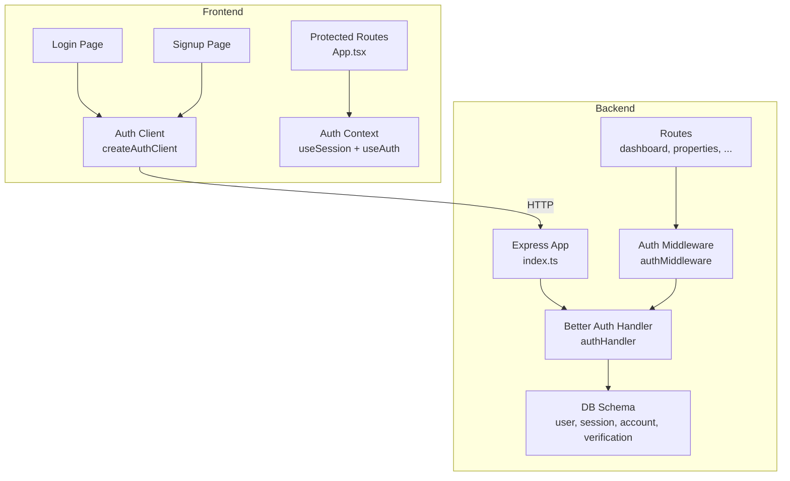
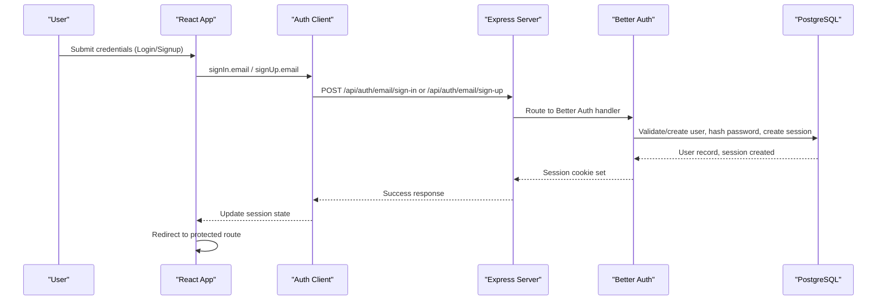
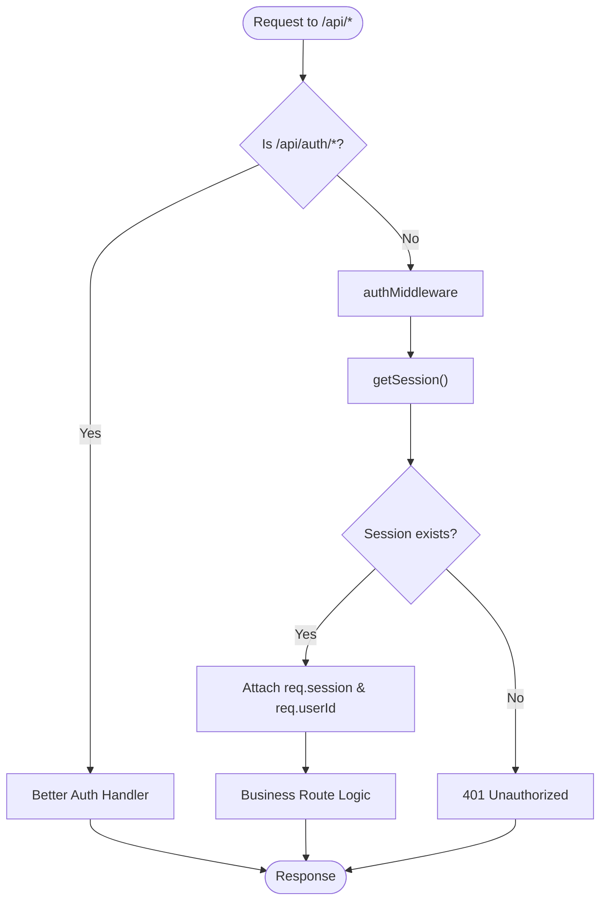
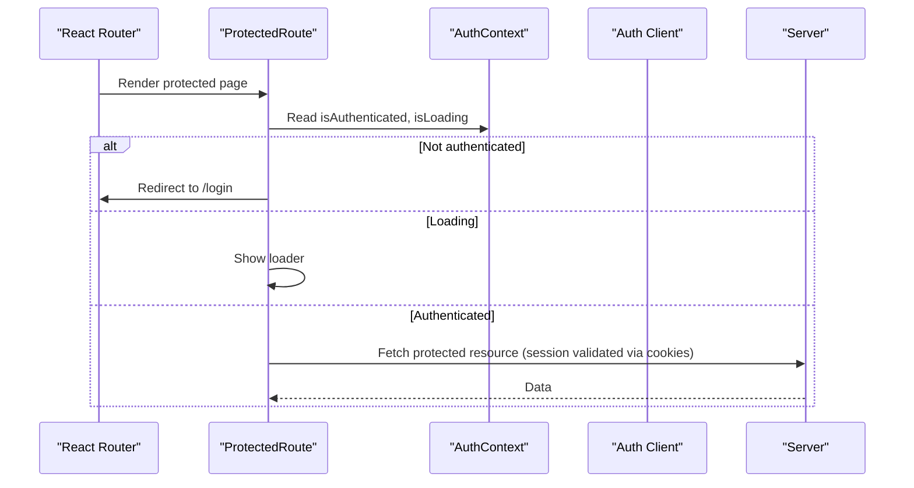
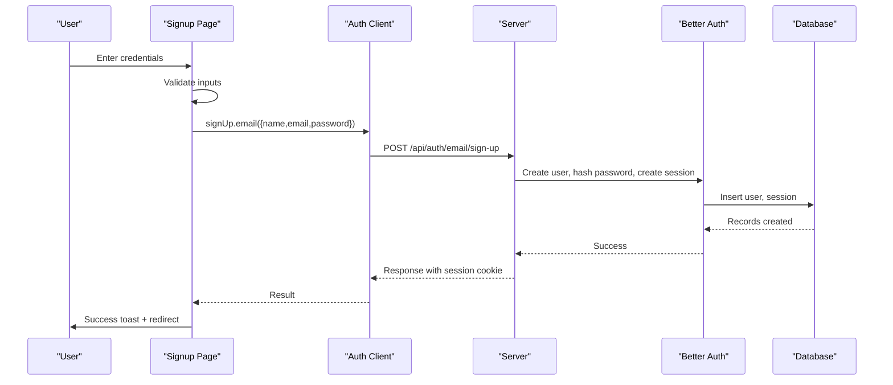
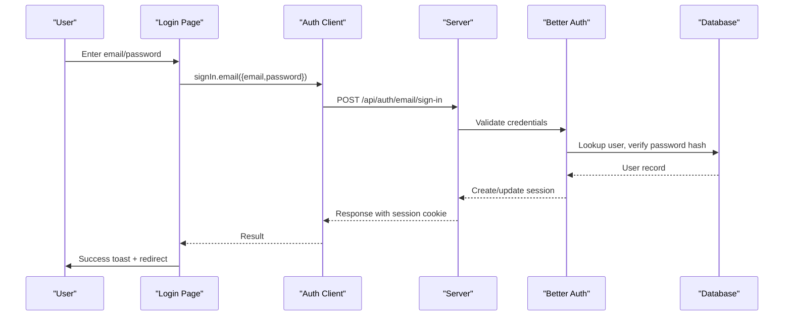
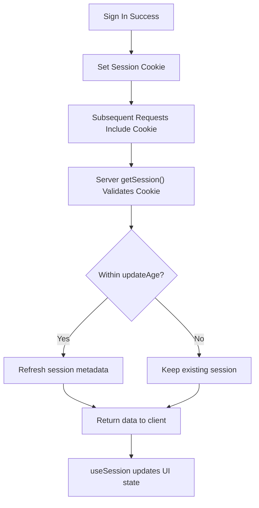
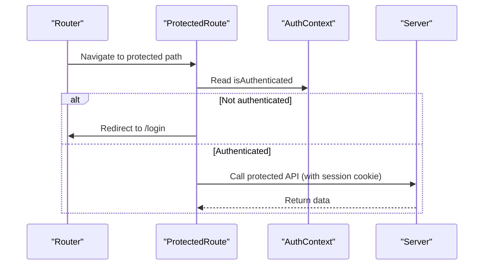
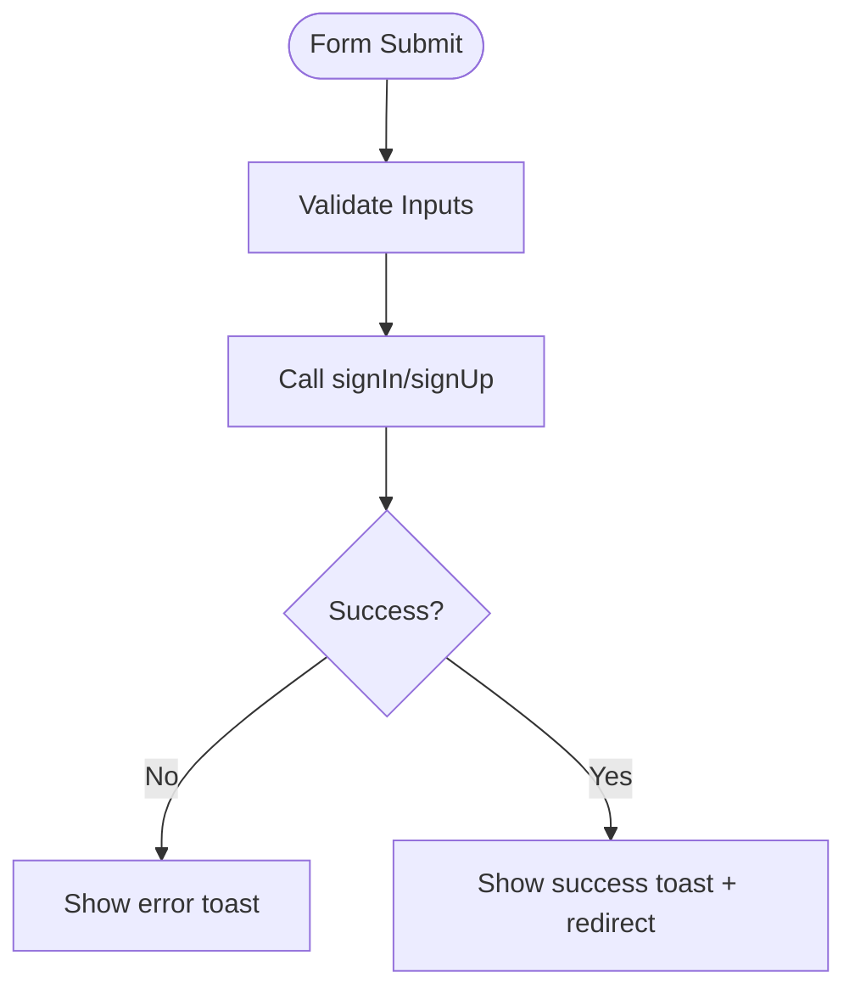
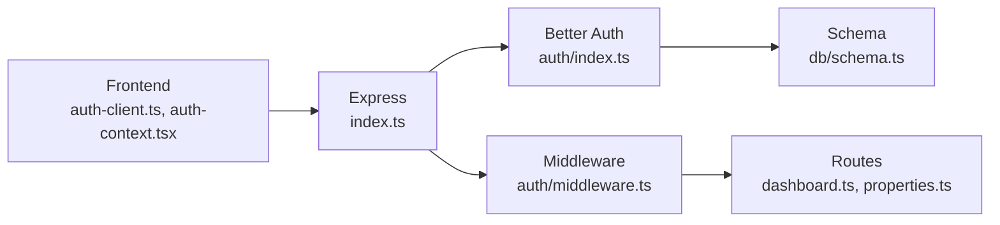

# Authentication Flow

<cite>
**Referenced Files in This Document**
- [server/src/auth/index.ts](file://server/src/auth/index.ts)
- [server/src/auth/middleware.ts](file://server/src/auth/middleware.ts)
- [server/src/db/schema.ts](file://server/src/db/schema.ts)
- [server/src/index.ts](file://server/src/index.ts)
- [client/src/lib/auth-client.ts](file://client/src/lib/auth-client.ts)
- [client/src/contexts/auth-context.tsx](file://client/src/contexts/auth-context.tsx)
- [client/src/pages/Login.tsx](file://client/src/pages/Login.tsx)
- [client/src/pages/Signup.tsx](file://client/src/pages/Signup.tsx)
- [client/src/App.tsx](file://client/src/App.tsx)
- [server/src/routes/dashboard.ts](file://server/src/routes/dashboard.ts)
- [server/src/routes/properties.ts](file://server/src/routes/properties.ts)
</cite>

## Table of Contents
1. [Introduction](#introduction)
2. [Project Structure](#project-structure)
3. [Core Components](#core-components)
4. [Architecture Overview](#architecture-overview)
5. [Detailed Component Analysis](#detailed-component-analysis)
6. [Dependency Analysis](#dependency-analysis)
7. [Performance Considerations](#performance-considerations)
8. [Troubleshooting Guide](#troubleshooting-guide)
9. [Conclusion](#conclusion)

## Introduction
This document explains the complete authentication flow in RentLite, built on Better Auth with a Drizzle ORM adapter for PostgreSQL. It covers server-side configuration (database adapter, email/password auth, session policies), client-side context and hooks, user registration and login flows, protected routes, session persistence, token refresh behavior, error handling, and security considerations such as password hashing, session security, and trusted origins.

## Project Structure
RentLite is split into a Node/Express backend and a React frontend:
- Backend exposes Better Auth endpoints under /api/auth/* and protects business routes via middleware.
- Frontend uses a Better Auth React client to sign in/out, fetch sessions, and render protected UI.

**Diagram sources**
- [server/src/index.ts:21-49](file://server/src/index.ts#L21-L49)
- [server/src/auth/middleware.ts:1-45](file://server/src/auth/middleware.ts#L1-L45)
- [server/src/routes/dashboard.ts:1-10](file://server/src/routes/dashboard.ts#L1-L10)
- [server/src/routes/properties.ts:1-10](file://server/src/routes/properties.ts#L1-L10)
- [client/src/lib/auth-client.ts:1-13](file://client/src/lib/auth-client.ts#L1-L13)
- [client/src/contexts/auth-context.tsx:1-38](file://client/src/contexts/auth-context.tsx#L1-L38)
- [client/src/pages/Login.tsx:1-148](file://client/src/pages/Login.tsx#L1-L148)
- [client/src/pages/Signup.tsx:1-185](file://client/src/pages/Signup.tsx#L1-L185)
- [client/src/App.tsx:16-32](file://client/src/App.tsx#L16-L32)

**Section sources**
- [server/src/index.ts:21-49](file://server/src/index.ts#L21-L49)
- [client/src/App.tsx:16-32](file://client/src/App.tsx#L16-L32)

## Core Components
- Better Auth server configuration: database adapter, email/password auth, session policy, trusted origins.
- Express integration: mount Better Auth handler at /api/auth/*; protect routes with middleware.
- Database schema: user, session, account, verification tables managed by Better Auth.
- Client SDK: createAuthClient with baseURL; expose signIn, signUp, signOut, useSession.
- React context: provides user, loading, isAuthenticated state across app.
- Pages: Login and Signup forms calling client SDK methods.
- Protected routes: client-side guard using useAuth; server-side guard using authMiddleware.

**Section sources**
- [server/src/auth/index.ts:1-23](file://server/src/auth/index.ts#L1-L23)
- [server/src/auth/middleware.ts:1-45](file://server/src/auth/middleware.ts#L1-L45)
- [server/src/db/schema.ts:137-187](file://server/src/db/schema.ts#L137-L187)
- [client/src/lib/auth-client.ts:1-13](file://client/src/lib/auth-client.ts#L1-L13)
- [client/src/contexts/auth-context.tsx:1-38](file://client/src/contexts/auth-context.tsx#L1-L38)
- [client/src/pages/Login.tsx:16-35](file://client/src/pages/Login.tsx#L16-L35)
- [client/src/pages/Signup.tsx:18-48](file://client/src/pages/Signup.tsx#L18-L48)
- [client/src/App.tsx:16-32](file://client/src/App.tsx#L16-L32)
- [server/src/routes/dashboard.ts:1-10](file://server/src/routes/dashboard.ts#L1-L10)
- [server/src/routes/properties.ts:1-10](file://server/src/routes/properties.ts#L1-L10)

## Architecture Overview
The authentication architecture integrates Better Auth with Express and Drizzle ORM, while the React frontend uses the Better Auth React client to manage sessions and UI state.

**Diagram sources**
- [client/src/pages/Login.tsx:16-35](file://client/src/pages/Login.tsx#L16-L35)
- [client/src/pages/Signup.tsx:18-48](file://client/src/pages/Signup.tsx#L18-L48)
- [client/src/lib/auth-client.ts:1-13](file://client/src/lib/auth-client.ts#L1-L13)
- [server/src/index.ts:34-36](file://server/src/index.ts#L34-L36)
- [server/src/auth/index.ts:1-23](file://server/src/auth/index.ts#L1-L23)
- [server/src/db/schema.ts:137-187](file://server/src/db/schema.ts#L137-L187)

## Detailed Component Analysis

### Better Auth Configuration
- Database adapter: Drizzle adapter configured with provider pg.
- Email/password: Enabled without mandatory email verification (recommended to enable in production).
- Session policy: Expiration set to 7 days; updateAge set to 24 hours to refresh session metadata periodically.
- Trusted origins: Configured from environment variable CLIENT_URL with localhost fallback.

Security notes:
- Passwords are hashed by Better Auth before storage.
- Sessions are stored in the database and secured via cookies handled by Better Auth.
- CORS is enabled with credentials; ensure CLIENT_URL matches the frontend origin.

**Section sources**
- [server/src/auth/index.ts:1-23](file://server/src/auth/index.ts#L1-L23)
- [server/src/index.ts:26-31](file://server/src/index.ts#L26-L31)

### Database Schema for Auth
- user: stores id, name, email, emailVerified, image, timestamps.
- session: stores id, expiresAt, token, timestamps, ipAddress, userAgent, userId (FK to user).
- account: stores provider info, tokens, password field for local accounts, timestamps.
- verification: stores verification identifiers and values with expiry.

These tables are managed by Better Auth through the Drizzle adapter.

**Section sources**
- [server/src/db/schema.ts:137-187](file://server/src/db/schema.ts#L137-L187)

### Express Integration and Protected Routes
- Better Auth handler mounted at /api/auth/* via toNodeHandler.
- Business routes protect access using authMiddleware, which calls Better Auth’s getSession and attaches session/userId to request.
- Example protected routes: dashboard and properties routers both apply authMiddleware at router level.

**Diagram sources**
- [server/src/index.ts:34-49](file://server/src/index.ts#L34-L49)
- [server/src/auth/middleware.ts:1-45](file://server/src/auth/middleware.ts#L1-L45)
- [server/src/routes/dashboard.ts:1-10](file://server/src/routes/dashboard.ts#L1-L10)
- [server/src/routes/properties.ts:1-10](file://server/src/routes/properties.ts#L1-L10)

**Section sources**
- [server/src/index.ts:34-49](file://server/src/index.ts#L34-L49)
- [server/src/auth/middleware.ts:1-45](file://server/src/auth/middleware.ts#L1-L45)
- [server/src/routes/dashboard.ts:1-10](file://server/src/routes/dashboard.ts#L1-L10)
- [server/src/routes/properties.ts:1-10](file://server/src/routes/properties.ts#L1-L10)

### Client-Side Authentication Context
- Auth client: createAuthClient with baseURL pointing to API server.
- Hooks exposed: signIn, signUp, signOut, useSession.
- Context wraps useSession to provide user, isLoading, isAuthenticated to components.
- ProtectedRoute component guards routes based on isAuthenticated and redirects to /login when needed.

**Diagram sources**
- [client/src/lib/auth-client.ts:1-13](file://client/src/lib/auth-client.ts#L1-L13)
- [client/src/contexts/auth-context.tsx:1-38](file://client/src/contexts/auth-context.tsx#L1-L38)
- [client/src/App.tsx:16-32](file://client/src/App.tsx#L16-L32)

**Section sources**
- [client/src/lib/auth-client.ts:1-13](file://client/src/lib/auth-client.ts#L1-L13)
- [client/src/contexts/auth-context.tsx:1-38](file://client/src/contexts/auth-context.tsx#L1-L38)
- [client/src/App.tsx:16-32](file://client/src/App.tsx#L16-L32)

### User Registration Flow
- Form collects name, email, password, confirmPassword.
- Client validates password match and minimum length.
- Calls signUp.email with payload.
- On success, shows success toast and navigates to home.
- On error, displays error message.

**Diagram sources**
- [client/src/pages/Signup.tsx:18-48](file://client/src/pages/Signup.tsx#L18-L48)
- [client/src/lib/auth-client.ts:1-13](file://client/src/lib/auth-client.ts#L1-L13)
- [server/src/index.ts:34-36](file://server/src/index.ts#L34-L36)
- [server/src/auth/index.ts:1-23](file://server/src/auth/index.ts#L1-L23)
- [server/src/db/schema.ts:137-187](file://server/src/db/schema.ts#L137-L187)

**Section sources**
- [client/src/pages/Signup.tsx:18-48](file://client/src/pages/Signup.tsx#L18-L48)

### Login Flow and Credential Validation
- Form collects email and password.
- Calls signIn.email with credentials.
- On success, shows success toast and navigates to home.
- On error, shows error toast.

**Diagram sources**
- [client/src/pages/Login.tsx:16-35](file://client/src/pages/Login.tsx#L16-L35)
- [client/src/lib/auth-client.ts:1-13](file://client/src/lib/auth-client.ts#L1-L13)
- [server/src/index.ts:34-36](file://server/src/index.ts#L34-L36)
- [server/src/auth/index.ts:1-23](file://server/src/auth/index.ts#L1-L23)
- [server/src/db/schema.ts:137-187](file://server/src/db/schema.ts#L137-L187)

**Section sources**
- [client/src/pages/Login.tsx:16-35](file://client/src/pages/Login.tsx#L16-L35)

### Session Management and Persistence
- Session expiration: 7 days.
- Session update age: 24 hours; session metadata refreshed on subsequent requests within this window.
- Cookies: Better Auth sets secure session cookies automatically when credentials are valid.
- Client session sync: useSession reads current session from cookies and updates React state; ProtectedRoute relies on this to guard routes.

**Diagram sources**
- [server/src/auth/index.ts:13-16](file://server/src/auth/index.ts#L13-L16)
- [server/src/auth/middleware.ts:9-27](file://server/src/auth/middleware.ts#L9-L27)
- [client/src/contexts/auth-context.tsx:16-32](file://client/src/contexts/auth-context.tsx#L16-L32)

**Section sources**
- [server/src/auth/index.ts:13-16](file://server/src/auth/index.ts#L13-L16)
- [server/src/auth/middleware.ts:9-27](file://server/src/auth/middleware.ts#L9-L27)
- [client/src/contexts/auth-context.tsx:16-32](file://client/src/contexts/auth-context.tsx#L16-L32)

### Protected Route Implementation
- Client-side: ProtectedRoute checks isAuthenticated and redirects to /login if not authenticated; shows a loader while checking.
- Server-side: Routes like dashboard and properties apply authMiddleware to enforce authentication and attach userId to requests.

**Diagram sources**
- [client/src/App.tsx:16-32](file://client/src/App.tsx#L16-L32)
- [server/src/routes/dashboard.ts:1-10](file://server/src/routes/dashboard.ts#L1-L10)
- [server/src/routes/properties.ts:1-10](file://server/src/routes/properties.ts#L1-L10)

**Section sources**
- [client/src/App.tsx:16-32](file://client/src/App.tsx#L16-L32)
- [server/src/routes/dashboard.ts:1-10](file://server/src/routes/dashboard.ts#L1-L10)
- [server/src/routes/properties.ts:1-10](file://server/src/routes/properties.ts#L1-L10)

### Automatic Token Refresh
- Better Auth manages session cookies and refreshes session metadata based on updateAge.
- The client does not manually handle token refresh; useSession reflects the current session state derived from cookies.
- For long-lived sessions, ensure updateAge and expiresIn align with your UX needs.

**Section sources**
- [server/src/auth/index.ts:13-16](file://server/src/auth/index.ts#L13-L16)
- [client/src/contexts/auth-context.tsx:16-32](file://client/src/contexts/auth-context.tsx#L16-L32)

### Error Handling for Authentication Failures
- Login page: Displays error toast on signIn failure; handles network errors gracefully.
- Signup page: Validates input locally (password match, minimum length); shows error toast on server-side failures.
- Server middleware: Returns 401 with standardized error structure when session is missing.

**Diagram sources**
- [client/src/pages/Login.tsx:16-35](file://client/src/pages/Login.tsx#L16-L35)
- [client/src/pages/Signup.tsx:18-48](file://client/src/pages/Signup.tsx#L18-L48)
- [server/src/auth/middleware.ts:18-21](file://server/src/auth/middleware.ts#L18-L21)

**Section sources**
- [client/src/pages/Login.tsx:16-35](file://client/src/pages/Login.tsx#L16-L35)
- [client/src/pages/Signup.tsx:18-48](file://client/src/pages/Signup.tsx#L18-L48)
- [server/src/auth/middleware.ts:18-21](file://server/src/auth/middleware.ts#L18-L21)

### Security Considerations
- Password hashing: Handled by Better Auth; passwords are never stored in plaintext.
- Session security:
  - Sessions stored in database with unique tokens and expiration.
  - Cookies set by Better Auth; ensure HTTPS in production and configure trustedOrigins correctly.
- Trusted origins:
  - Configure CLIENT_URL to match the frontend domain to prevent CSRF-like misuse.
- CORS:
  - Enable credentials and restrict origin to the frontend URL.
- Input validation:
  - Use Zod schemas on server routes to validate payloads and reduce injection risks.
- Environment variables:
  - Store sensitive configuration (e.g., DATABASE_URL, CLIENT_URL) securely.

**Section sources**
- [server/src/auth/index.ts:1-23](file://server/src/auth/index.ts#L1-L23)
- [server/src/index.ts:26-31](file://server/src/index.ts#L26-L31)
- [server/src/routes/properties.ts:11-23](file://server/src/routes/properties.ts#L11-L23)

## Dependency Analysis
- Better Auth depends on Drizzle adapter and PostgreSQL schema for user/session/account/verification.
- Express mounts Better Auth handler and applies middleware to protect routes.
- Frontend depends on Better Auth React client and context to manage session state and UI.

**Diagram sources**
- [client/src/lib/auth-client.ts:1-13](file://client/src/lib/auth-client.ts#L1-L13)
- [client/src/contexts/auth-context.tsx:1-38](file://client/src/contexts/auth-context.tsx#L1-L38)
- [server/src/index.ts:21-49](file://server/src/index.ts#L21-L49)
- [server/src/auth/index.ts:1-23](file://server/src/auth/index.ts#L1-L23)
- [server/src/auth/middleware.ts:1-45](file://server/src/auth/middleware.ts#L1-L45)
- [server/src/routes/dashboard.ts:1-10](file://server/src/routes/dashboard.ts#L1-L10)
- [server/src/routes/properties.ts:1-10](file://server/src/routes/properties.ts#L1-L10)
- [server/src/db/schema.ts:137-187](file://server/src/db/schema.ts#L137-L187)

**Section sources**
- [server/src/index.ts:21-49](file://server/src/index.ts#L21-L49)
- [server/src/auth/index.ts:1-23](file://server/src/auth/index.ts#L1-L23)
- [server/src/auth/middleware.ts:1-45](file://server/src/auth/middleware.ts#L1-L45)
- [server/src/routes/dashboard.ts:1-10](file://server/src/routes/dashboard.ts#L1-L10)
- [server/src/routes/properties.ts:1-10](file://server/src/routes/properties.ts#L1-L10)
- [client/src/lib/auth-client.ts:1-13](file://client/src/lib/auth-client.ts#L1-L13)
- [client/src/contexts/auth-context.tsx:1-38](file://client/src/contexts/auth-context.tsx#L1-L38)

## Performance Considerations
- Session updateAge reduces frequent full re-authentication while keeping session metadata fresh.
- Protecting routes server-side avoids unnecessary data fetching for unauthenticated users.
- Using Zod schemas prevents invalid payloads from reaching the database layer.
- Keep CORS strict to minimize overhead and risk.

[No sources needed since this section provides general guidance]

## Troubleshooting Guide
- 401 Unauthorized: Indicates missing or invalid session; check browser cookies and that CLIENT_URL matches the frontend origin.
- CORS errors: Ensure cors.origin includes the frontend URL and credentials are enabled.
- Sign-in/Sign-up failures: Verify email/password format and that the database tables exist; check logs for Better Auth errors.
- Session not persisting: Confirm that cookies are allowed and not blocked by browser settings; ensure HTTPS in production.

**Section sources**
- [server/src/auth/middleware.ts:18-21](file://server/src/auth/middleware.ts#L18-L21)
- [server/src/index.ts:26-31](file://server/src/index.ts#L26-L31)
- [client/src/pages/Login.tsx:20-35](file://client/src/pages/Login.tsx#L20-L35)
- [client/src/pages/Signup.tsx:20-48](file://client/src/pages/Signup.tsx#L20-L48)

## Conclusion
RentLite’s authentication system leverages Better Auth for robust, secure credential management and session handling, backed by a Drizzle-managed PostgreSQL schema. The client uses a React context to synchronize session state and protect routes, while server-side middleware enforces access control. With proper configuration of trusted origins, CORS, and session policies, the system provides a secure and user-friendly authentication experience suitable for production deployments.

[No sources needed since this section summarizes without analyzing specific files]