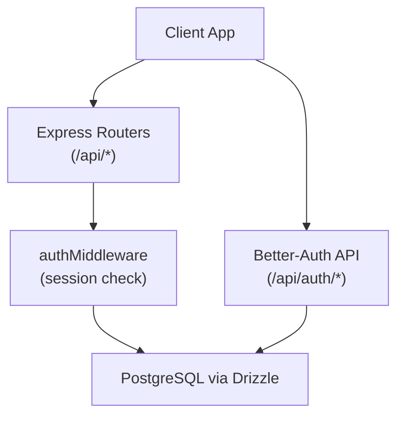
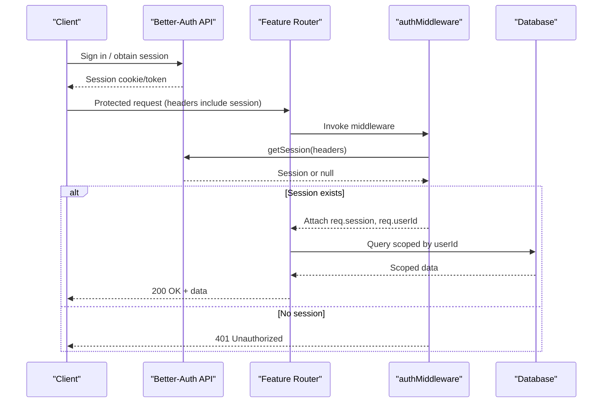
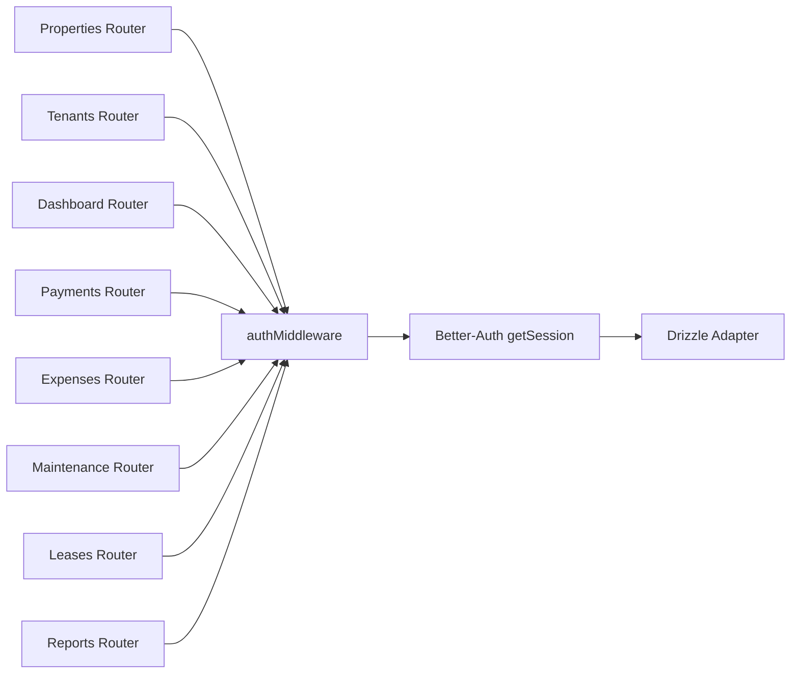

# Authorization & Middleware

<cite>
**Referenced Files in This Document**
- [middleware.ts](file://server/src/auth/middleware.ts)
- [index.ts](file://server/src/auth/index.ts)
- [schema.ts](file://server/src/db/schema.ts)
- [properties.ts](file://server/src/routes/properties.ts)
- [tenants.ts](file://server/src/routes/tenants.ts)
- [dashboard.ts](file://server/src/routes/dashboard.ts)
- [payments.ts](file://server/src/routes/payments.ts)
- [expenses.ts](file://server/src/routes/expenses.ts)
- [maintenance.ts](file://server/src/routes/maintenance.ts)
- [leases.ts](file://server/src/routes/leases.ts)
- [reports.ts](file://server/src/routes/reports.ts)
- [auth-context.tsx](file://client/src/contexts/auth-context.tsx)
- [auth-client.ts](file://client/src/lib/auth-client.ts)
</cite>

## Table of Contents
1. Introduction
2. Project Structure
3. Core Components
4. Architecture Overview
5. Detailed Component Analysis
6. Dependency Analysis
7. Performance Considerations
8. Troubleshooting Guide
9. Conclusion
10. Appendices

## Introduction
This document explains the authorization middleware and access control system in RentLite. It covers how API routes are protected, how authentication is enforced, and how resource-level ownership checks isolate data per user (landlord). It also provides guidance for implementing role-based access control (RBAC), custom authorization logic for resource-specific permissions, route protection patterns, permission checking functions, and error responses for unauthorized access. Security best practices for fine-grained authorization, preventing privilege escalation, and maintaining audit trails are included.

## Project Structure
RentLite’s backend uses Express with Better-Auth for session management and Drizzle ORM for database access. Authentication is centralized in the auth module, while each feature router applies an authentication middleware to protect endpoints. Data isolation is enforced at the query level by scoping results to the authenticated user’s resources.

**Diagram sources**
- [index.ts:5-20](file://server/src/auth/index.ts#L5-L20)
- [middleware.ts:9-27](file://server/src/auth/middleware.ts#L9-L27)
- [properties.ts:8-9](file://server/src/routes/properties.ts#L8-L9)
- [schema.ts:139-160](file://server/src/db/schema.ts#L139-L160)

**Section sources**
- [index.ts:1-23](file://server/src/auth/index.ts#L1-L23)
- [middleware.ts:1-45](file://server/src/auth/middleware.ts#L1-L45)
- [schema.ts:139-160](file://server/src/db/schema.ts#L139-L160)

## Core Components
- Authentication provider: Better-Auth configured with a Drizzle adapter and email/password support. Sessions are stored in the database and have configurable expiration and update policies.
- Session middleware: Extracts the current session from request headers, attaches user identity to the request, and returns a standardized 401 response when unauthenticated.
- Optional auth middleware: Allows requests to proceed without requiring authentication while still attaching session data if present.
- Route protection: Each feature router applies the authentication middleware to enforce that only logged-in users can access endpoints.
- Resource isolation: Endpoints filter queries by the authenticated user’s ID to ensure tenants, properties, payments, expenses, maintenance requests, leases, and reports are scoped to the owner.

Key implementation references:
- Auth configuration and session settings: [index.ts:5-20](file://server/src/auth/index.ts#L5-L20)
- Session extraction and attachment: [middleware.ts:9-27](file://server/src/auth/middleware.ts#L9-L27)
- Optional auth usage pattern: [middleware.ts:30-44](file://server/src/auth/middleware.ts#L30-L44)
- Example route protection: [properties.ts:8-9](file://server/src/routes/properties.ts#L8-L9)

**Section sources**
- [index.ts:1-23](file://server/src/auth/index.ts#L1-L23)
- [middleware.ts:1-45](file://server/src/auth/middleware.ts#L1-L45)
- [properties.ts:1-10](file://server/src/routes/properties.ts#L1-L10)

## Architecture Overview
The authorization flow ensures every protected endpoint validates the session before processing business logic. The client communicates with Better-Auth endpoints to sign in/out and maintain sessions. Feature routers then rely on the middleware to attach user context and enforce ownership constraints in queries.

**Diagram sources**
- [index.ts:5-20](file://server/src/auth/index.ts#L5-L20)
- [middleware.ts:9-27](file://server/src/auth/middleware.ts#L9-L27)
- [properties.ts:26-34](file://server/src/routes/properties.ts#L26-L34)

## Detailed Component Analysis

### Authentication Provider and Session Management
- Better-Auth is configured with a Drizzle adapter for PostgreSQL, enabling persistent sessions.
- Email/password authentication is enabled; email verification can be toggled for production readiness.
- Session lifetime and refresh behavior are defined to balance security and usability.

References:
- Configuration and session policy: [index.ts:5-20](file://server/src/auth/index.ts#L5-L20)
- User/session/account tables schema: [schema.ts:139-178](file://server/src/db/schema.ts#L139-L178)

**Section sources**
- [index.ts:1-23](file://server/src/auth/index.ts#L1-L23)
- [schema.ts:139-178](file://server/src/db/schema.ts#L139-L178)

### Session Middleware and Optional Auth
- authMiddleware retrieves the session using Better-Auth’s getSession API with request headers. If no session is found, it responds with a 401 status and a consistent JSON error shape.
- On success, it attaches session and userId to the request object for downstream handlers.
- optionalAuth allows unauthenticated access but still enriches the request with session data when available.

References:
- Mandatory session enforcement: [middleware.ts:9-27](file://server/src/auth/middleware.ts#L9-L27)
- Optional session enrichment: [middleware.ts:30-44](file://server/src/auth/middleware.ts#L30-L44)

Error response example (conceptual):
- 401 Unauthorized with message and code fields for missing session.

**Section sources**
- [middleware.ts:9-27](file://server/src/auth/middleware.ts#L9-L27)
- [middleware.ts:30-44](file://server/src/auth/middleware.ts#L30-L44)

### Route Protection Patterns
- Every feature router applies authMiddleware at the top to secure all its endpoints.
- Handlers extract userId from the request and scope database queries to that user.

Examples:
- Properties router protection and user-scoped listing: [properties.ts:8-9](file://server/src/routes/properties.ts#L8-L9), [properties.ts:26-34](file://server/src/routes/properties.ts#L26-L34)
- Tenants router protection and user-scoped listing: [tenants.ts:8-9](file://server/src/routes/tenants.ts#L8-L9), [tenants.ts:23-30](file://server/src/routes/tenants.ts#L23-L30)
- Dashboard router protection and aggregated stats: [dashboard.ts:7-8](file://server/src/routes/dashboard.ts#L7-L8), [dashboard.ts:11-24](file://server/src/routes/dashboard.ts#L11-L24)

**Section sources**
- [properties.ts:1-34](file://server/src/routes/properties.ts#L1-L34)
- [tenants.ts:1-30](file://server/src/routes/tenants.ts#L1-L30)
- [dashboard.ts:1-24](file://server/src/routes/dashboard.ts#L1-L24)

### Resource-Specific Permissions and Ownership Verification
- Property ownership: Endpoints verify that the requested property belongs to the authenticated user before allowing read/write operations.
- Tenant isolation: Tenant records are filtered by userId to ensure landlords only see their own tenants.
- Payment and expense scoping: Queries compute allowed unit IDs based on user-owned properties and filter payments/expenses accordingly.
- Lease creation validation: Ensures the unit and tenant belong to the requesting landlord before creating a lease.

References:
- Property ownership checks: [properties.ts:37-45](file://server/src/routes/properties.ts#L37-L45), [properties.ts:74-90](file://server/src/routes/properties.ts#L74-L90), [properties.ts:94-102](file://server/src/routes/properties.ts#L94-L102)
- Tenant isolation: [tenants.ts:23-30](file://server/src/routes/tenants.ts#L23-L30), [tenants.ts:33-40](file://server/src/routes/tenants.ts#L33-L40)
- Payment scoping by user properties: [payments.ts:25-58](file://server/src/routes/payments.ts#L25-L58)
- Expense creation ownership verification: [expenses.ts:66-78](file://server/src/routes/expenses.ts#L66-L78)
- Lease creation ownership verification: [leases.ts:89-113](file://server/src/routes/leases.ts#L89-L113)

**Section sources**
- [properties.ts:26-102](file://server/src/routes/properties.ts#L26-L102)
- [tenants.ts:23-80](file://server/src/routes/tenants.ts#L23-L80)
- [payments.ts:25-109](file://server/src/routes/payments.ts#L25-L109)
- [expenses.ts:66-78](file://server/src/routes/expenses.ts#L66-L78)
- [leases.ts:89-113](file://server/src/routes/leases.ts#L89-L113)

### RBAC Patterns and Role-Based Access Control
Current state:
- The codebase enforces authentication and resource ownership but does not implement explicit roles or permissions. All authenticated users operate under a single implicit role (landlord).

Recommended approach:
- Add a role field to the user entity and propagate it through the session.
- Create role-checking middleware (e.g., requireRole("admin")) to gate administrative endpoints.
- Combine role checks with ownership checks to implement fine-grained authorization.

Implementation pointers:
- Extend session type to include role: [index.ts:22-23](file://server/src/auth/index.ts#L22-L23)
- Apply role middleware before business logic in new admin routes.

[No sources needed since this section proposes future enhancements]

### Custom Authorization Logic for Resource-Specific Permissions
Patterns used across routes:
- Compute allowed resource IDs based on user ownership (e.g., propertyIds, unitIds).
- Filter collections in memory or refine SQL queries to restrict access.
- Validate relationships before mutations (e.g., ensuring unit and tenant belong to the same landlord before lease creation).

References:
- Property-to-unit mapping and filtering: [dashboard.ts:14-24](file://server/src/routes/dashboard.ts#L14-L24)
- Payment list filtering by user units: [payments.ts:29-58](file://server/src/routes/payments.ts#L29-L58)
- Expense filtering by user properties: [expenses.ts:31-53](file://server/src/routes/expenses.ts#L31-L53)
- Lease expiring leases filtering: [leases.ts:49-76](file://server/src/routes/leases.ts#L49-L76)

**Section sources**
- [dashboard.ts:14-24](file://server/src/routes/dashboard.ts#L14-L24)
- [payments.ts:29-58](file://server/src/routes/payments.ts#L29-L58)
- [expenses.ts:31-53](file://server/src/routes/expenses.ts#L31-L53)
- [leases.ts:49-76](file://server/src/routes/leases.ts#L49-L76)

### Error Responses for Unauthorized Access
- Missing session: 401 Unauthorized with a structured JSON payload containing message and code.
- Not found: 404 Not Found with message and code for invalid resource identifiers.
- Validation errors: 400 Bad Request with details for malformed input.

References:
- Unauthorized response: [middleware.ts:18-21](file://server/src/auth/middleware.ts#L18-L21)
- Not found responses: [properties.ts:44-45](file://server/src/routes/properties.ts#L44-L45), [tenants.ts:38-39](file://server/src/routes/tenants.ts#L38-L39), [expenses.ts:61-62](file://server/src/routes/expenses.ts#L61-L62)
- Validation error responses: [properties.ts:51-52](file://server/src/routes/properties.ts#L51-L52), [tenants.ts:45-46](file://server/src/routes/tenants.ts#L45-L46)

**Section sources**
- [middleware.ts:18-21](file://server/src/auth/middleware.ts#L18-L21)
- [properties.ts:44-52](file://server/src/routes/properties.ts#L44-L52)
- [tenants.ts:38-46](file://server/src/routes/tenants.ts#L38-L46)
- [expenses.ts:61-62](file://server/src/routes/expenses.ts#L61-L62)

### Client-Side Authentication Integration
- The React client uses Better-Auth’s React hooks to manage sessions and expose user context via a context provider.
- The auth client is configured with the API base URL to communicate with the server’s auth endpoints.

References:
- Auth context provider exposing session and user: [auth-context.tsx:16-33](file://client/src/contexts/auth-context.tsx#L16-L33)
- Auth client setup and exported hooks: [auth-client.ts:3-12](file://client/src/lib/auth-client.ts#L3-L12)

**Section sources**
- [auth-context.tsx:1-38](file://client/src/contexts/auth-context.tsx#L1-L38)
- [auth-client.ts:1-13](file://client/src/lib/auth-client.ts#L1-L13)

## Dependency Analysis
The authorization stack depends on Better-Auth for session handling, Express for routing, and Drizzle for database interactions. Each router imports and applies the shared middleware, ensuring consistent protection across features.

**Diagram sources**
- [middleware.ts:9-27](file://server/src/auth/middleware.ts#L9-L27)
- [index.ts:5-20](file://server/src/auth/index.ts#L5-L20)
- [properties.ts:8-9](file://server/src/routes/properties.ts#L8-L9)
- [tenants.ts:8-9](file://server/src/routes/tenants.ts#L8-L9)
- [dashboard.ts:7-8](file://server/src/routes/dashboard.ts#L7-L8)
- [payments.ts:8-9](file://server/src/routes/payments.ts#L8-L9)
- [expenses.ts:8-9](file://server/src/routes/expenses.ts#L8-L9)
- [maintenance.ts:8-9](file://server/src/routes/maintenance.ts#L8-L9)
- [leases.ts:8-9](file://server/src/routes/leases.ts#L8-L9)
- [reports.ts:7-8](file://server/src/routes/reports.ts#L7-L8)

**Section sources**
- [middleware.ts:1-45](file://server/src/auth/middleware.ts#L1-L45)
- [index.ts:1-23](file://server/src/auth/index.ts#L1-L23)
- [properties.ts:1-10](file://server/src/routes/properties.ts#L1-L10)
- [tenants.ts:1-10](file://server/src/routes/tenants.ts#L1-L10)
- [dashboard.ts:1-9](file://server/src/routes/dashboard.ts#L1-L9)
- [payments.ts:1-10](file://server/src/routes/payments.ts#L1-L10)
- [expenses.ts:1-10](file://server/src/routes/expenses.ts#L1-L10)
- [maintenance.ts:1-10](file://server/src/routes/maintenance.ts#L1-L10)
- [leases.ts:1-10](file://server/src/routes/leases.ts#L1-L10)
- [reports.ts:1-9](file://server/src/routes/reports.ts#L1-L9)

## Performance Considerations
- Prefer database-side filtering over in-memory filtering where possible to reduce payload sizes and improve performance. For example, use Drizzle queries with WHERE clauses instead of fetching all rows and filtering in JavaScript.
- Cache frequently accessed aggregates (e.g., dashboard stats) with appropriate invalidation strategies to avoid repeated heavy computations.
- Use pagination and selective column projection for large datasets to minimize memory usage and network overhead.
- Ensure indexes exist on foreign keys and commonly filtered columns (e.g., userId, propertyId, unitId) to speed up scoped queries.

[No sources needed since this section provides general guidance]

## Troubleshooting Guide
Common issues and resolutions:
- 401 Unauthorized: Indicates missing or invalid session. Verify that the client sends proper headers and that the server’s trusted origins are configured correctly.
- 404 Not Found: Occurs when a requested resource does not exist or does not belong to the authenticated user. Confirm ownership checks and correct resource IDs.
- Validation errors: Input payloads do not match expected schemas. Check Zod validations and adjust client requests accordingly.

References:
- Unauthorized handling: [middleware.ts:18-21](file://server/src/auth/middleware.ts#L18-L21)
- Not found handling examples: [properties.ts:44-45](file://server/src/routes/properties.ts#L44-L45), [tenants.ts:38-39](file://server/src/routes/tenants.ts#L38-L39), [expenses.ts:61-62](file://server/src/routes/expenses.ts#L61-L62)
- Validation error handling: [properties.ts:51-52](file://server/src/routes/properties.ts#L51-L52), [tenants.ts:45-46](file://server/src/routes/tenants.ts#L45-L46)

**Section sources**
- [middleware.ts:18-21](file://server/src/auth/middleware.ts#L18-L21)
- [properties.ts:44-52](file://server/src/routes/properties.ts#L44-L52)
- [tenants.ts:38-46](file://server/src/routes/tenants.ts#L38-L46)
- [expenses.ts:61-62](file://server/src/routes/expenses.ts#L61-L62)

## Conclusion
RentLite implements robust authentication and resource-level authorization using Better-Auth and Express middleware. All protected routes enforce session validation and scope data to the authenticated user, ensuring strong tenant isolation for landlords. While explicit RBAC is not yet implemented, the architecture supports extending roles and permissions. Following the recommended patterns—database-side filtering, consistent error shapes, and ownership verification—helps maintain secure, scalable access control.

[No sources needed since this section summarizes without analyzing specific files]

## Appendices

### Security Best Practices for Fine-Grained Authorization
- Enforce ownership checks at the database layer whenever possible to prevent data leaks.
- Centralize authorization logic in reusable middleware or service functions to reduce duplication and risk of oversight.
- Validate and sanitize all inputs using strict schemas (e.g., Zod) before processing.
- Limit exposure of sensitive information in error responses; return generic messages for security-sensitive failures.
- Rotate secrets and configure CORS/trusted origins carefully to prevent cross-origin attacks.

[No sources needed since this section provides general guidance]

### Preventing Privilege Escalation
- Never trust client-supplied roles or permissions; derive privileges server-side from verified session data.
- Apply least-privilege principles: grant minimal permissions required for each operation.
- Audit critical actions and log authorization decisions for accountability and incident response.

[No sources needed since this section provides general guidance]

### Maintaining Audit Trails for Access Control Decisions
- Log successful and failed authorization attempts with timestamps, user IDs, IP addresses, and affected resources.
- Store audit logs in a tamper-evident manner and retain them according to compliance requirements.
- Provide tools to review access logs for anomalies and potential breaches.

[No sources needed since this section provides general guidance]