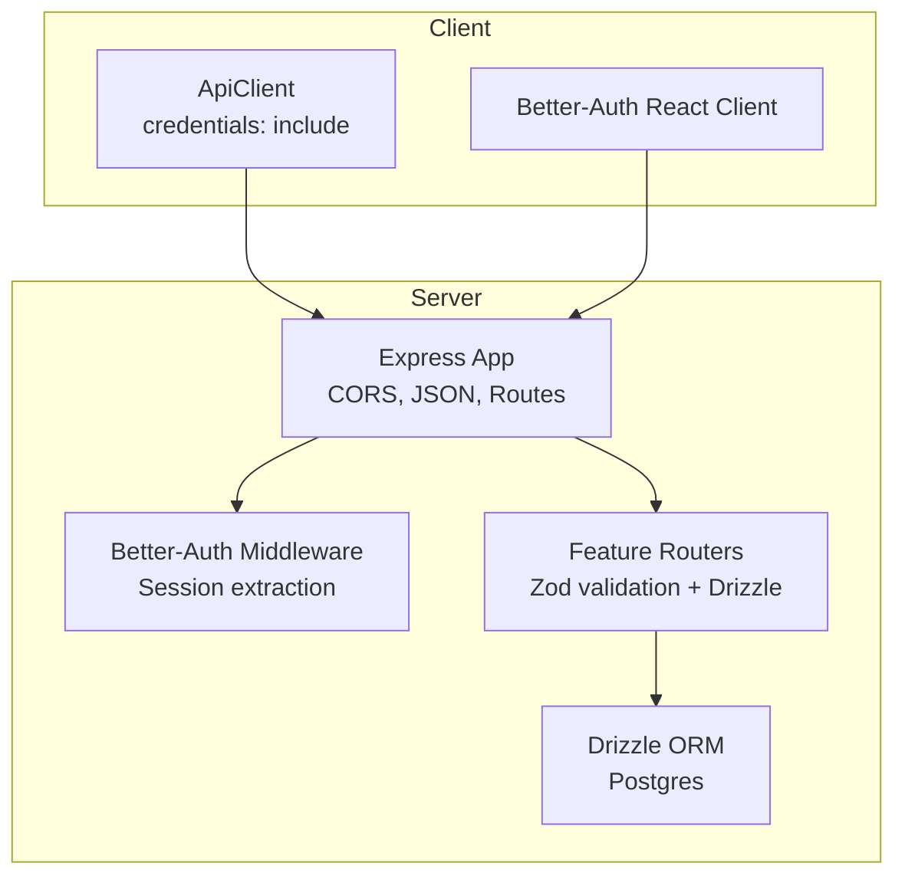
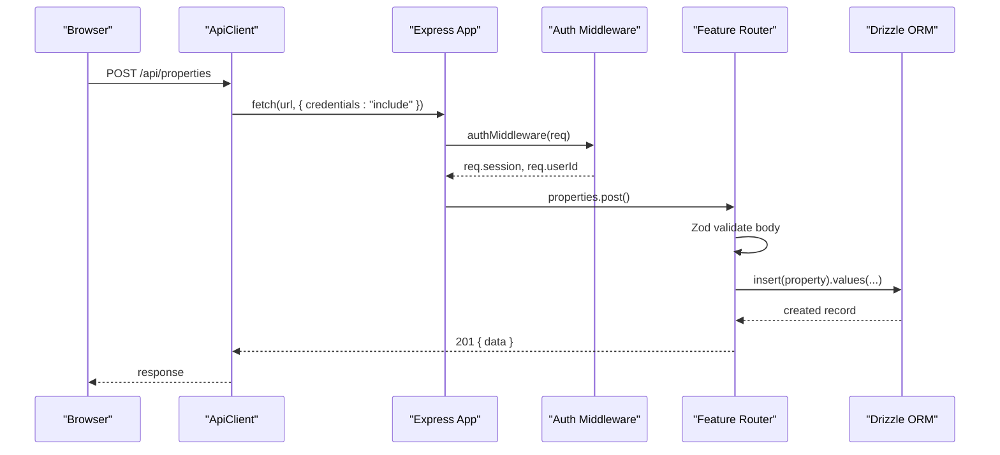
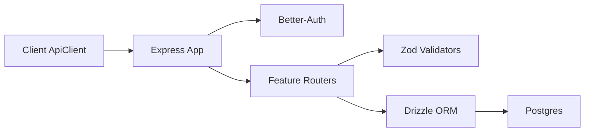
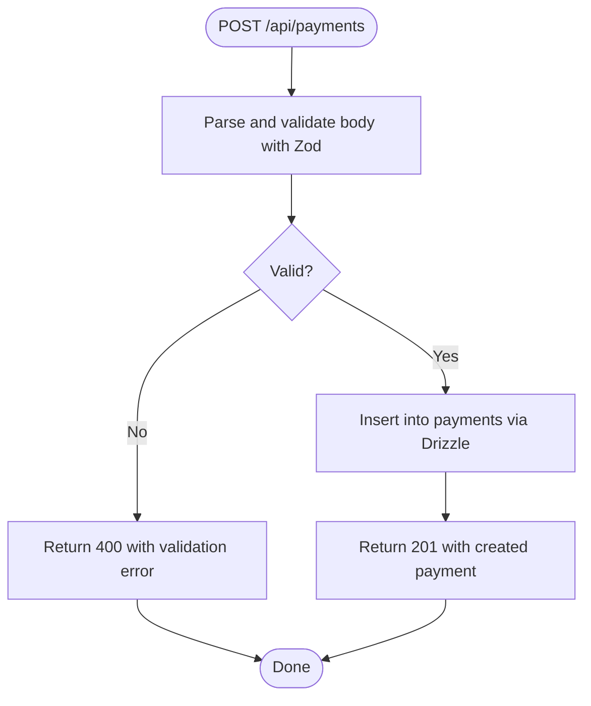
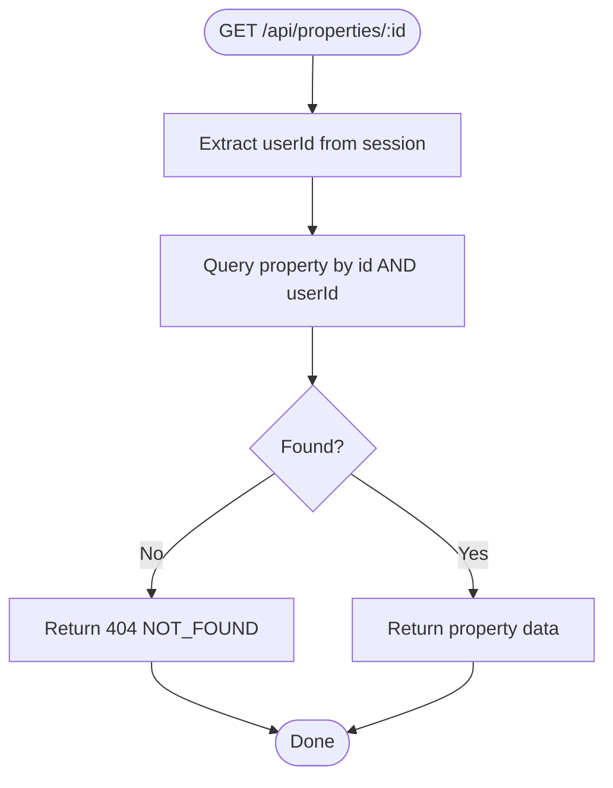

# Security Best Practices

<cite>
**Referenced Files in This Document**
- [server/src/index.ts](file://server/src/index.ts)
- [server/src/auth/middleware.ts](file://server/src/auth/middleware.ts)
- [server/src/auth/index.ts](file://server/src/auth/index.ts)
- [server/src/db/index.ts](file://server/src/db/index.ts)
- [server/src/db/schema.ts](file://server/src/db/schema.ts)
- [server/src/routes/properties.ts](file://server/src/routes/properties.ts)
- [server/src/routes/payments.ts](file://server/src/routes/payments.ts)
- [client/src/lib/api.ts](file://client/src/lib/api.ts)
- [client/src/lib/auth-client.ts](file://client/src/lib/auth-client.ts)
</cite>

## Table of Contents
1. Introduction
2. Project Structure
3. Core Components
4. Architecture Overview
5. Detailed Component Analysis
6. Dependency Analysis
7. Performance Considerations
8. Troubleshooting Guide
9. Conclusion
10. Appendices

## Introduction
This document provides comprehensive security best practices for the RentLite application, focusing on input validation and sanitization, secure database queries with Drizzle ORM, CSRF protection, secure cookie configuration, HTTPS enforcement, file upload security, secure API design with safe error handling, data encryption for sensitive fields, and security testing approaches including vulnerability scanning, penetration testing procedures, and code review checklists. It maps recommendations to the current implementation and highlights areas that need hardening.

## Project Structure
RentLite is a full-stack TypeScript application:
- Server (Express): Centralized app setup, CORS, JSON parsing, auth routes via Better-Auth, feature routers under /api/*, health endpoint.
- Client (React + Vite): API client with credentials mode, auth client integration with Better-Auth.
- Shared types and DB layer: Drizzle ORM schema and relations; Postgres connection via environment variables.

**Diagram sources**
- [server/src/index.ts:21-49](file://server/src/index.ts#L21-L49)
- [server/src/auth/middleware.ts:9-27](file://server/src/auth/middleware.ts#L9-L27)
- [server/src/routes/properties.ts:1-10](file://server/src/routes/properties.ts#L1-L10)
- [server/src/db/index.ts:1-10](file://server/src/db/index.ts#L1-L10)

**Section sources**
- [server/src/index.ts:21-49](file://server/src/index.ts#L21-L49)
- [server/src/db/index.ts:1-10](file://server/src/db/index.ts#L1-L10)

## Core Components
- Authentication and session management via Better-Auth with Drizzle adapter.
- Express middleware for CORS and JSON parsing.
- Feature routers using Zod schemas for strict input validation and Drizzle ORM for type-safe queries.
- Client-side API client sending cookies with requests and handling unauthorized redirects.

Key responsibilities:
- Enforce authentication per route via middleware.
- Validate all inputs with Zod before persistence or processing.
- Use parameterized Drizzle queries to prevent SQL injection.
- Restrict cross-origin access via CORS and trusted origins.

**Section sources**
- [server/src/auth/index.ts:5-20](file://server/src/auth/index.ts#L5-L20)
- [server/src/auth/middleware.ts:9-27](file://server/src/auth/middleware.ts#L9-L27)
- [server/src/routes/properties.ts:11-23](file://server/src/routes/properties.ts#L11-L23)
- [server/src/routes/payments.ts:11-22](file://server/src/routes/payments.ts#L11-L22)
- [client/src/lib/api.ts:26-54](file://client/src/lib/api.ts#L26-L54)

## Architecture Overview
The request flow enforces authentication, validates inputs, and executes parameterized queries.

**Diagram sources**
- [client/src/lib/api.ts:26-54](file://client/src/lib/api.ts#L26-L54)
- [server/src/index.ts:26-49](file://server/src/index.ts#L26-L49)
- [server/src/auth/middleware.ts:9-27](file://server/src/auth/middleware.ts#L9-L27)
- [server/src/routes/properties.ts:48-71](file://server/src/routes/properties.ts#L48-L71)
- [server/src/db/index.ts:6-9](file://server/src/db/index.ts#L6-L9)

## Detailed Component Analysis

### Input Validation and Sanitization
- All create/update endpoints use Zod schemas to enforce allowed values, types, and constraints before touching the database.
- Examples:
  - Property creation/update validated by a schema with enums and numeric bounds.
  - Payment creation/update validated by a schema with UUIDs, non-negative amounts, and enum statuses.
- Recommendations:
  - Add length limits and character whitelisting for free-text fields (e.g., notes, descriptions).
  - Normalize strings (trim, lowercase where appropriate) before storage.
  - Reject empty or whitespace-only inputs explicitly.
  - Consider adding content-type checks for any future file uploads.

**Section sources**
- [server/src/routes/properties.ts:11-23](file://server/src/routes/properties.ts#L11-L23)
- [server/src/routes/payments.ts:11-22](file://server/src/routes/payments.ts#L11-L22)

### Secure Database Queries with Drizzle ORM
- All queries use Drizzle’s typed query builder with parameter binding, preventing SQL injection.
- Authorization is enforced at the query level by scoping results to the authenticated user’s ID.
- Example patterns:
  - Filtering by userId when listing or fetching resources.
  - Using UUIDs for primary keys to reduce enumeration risks.

Recommendations:
- Continue to scope every read/write by userId or resource ownership.
- Avoid raw SQL; prefer Drizzle’s query methods.
- Audit any new routes to ensure they do not bypass authorization checks.

**Section sources**
- [server/src/routes/properties.ts:26-45](file://server/src/routes/properties.ts#L26-L45)
- [server/src/routes/payments.ts:25-59](file://server/src/routes/payments.ts#L25-L59)
- [server/src/db/schema.ts:191-208](file://server/src/db/schema.ts#L191-L208)

### Authentication and Session Handling
- Better-Auth manages sessions with Drizzle adapter; session duration and update age are configured.
- Express middleware extracts session and attaches userId to requests.
- Client sends credentials with requests to support cookie-based sessions.

Recommendations:
- Enable email verification in production.
- Configure secure cookie flags (see next section).
- Rotate secrets regularly and store them securely in environment variables.

**Section sources**
- [server/src/auth/index.ts:5-20](file://server/src/auth/index.ts#L5-L20)
- [server/src/auth/middleware.ts:9-27](file://server/src/auth/middleware.ts#L9-L27)
- [client/src/lib/api.ts:26-37](file://client/src/lib/api.ts#L26-L37)

### CORS and Trusted Origins
- CORS is enabled with credentials and a configurable origin from environment.
- Better-Auth also uses trustedOrigins for session validation.

Recommendations:
- Pin CLIENT_URL to exact origins in production (no wildcards).
- Ensure both Express CORS and Better-Auth trustedOrigins match exactly.
- Log and alert on unexpected origin attempts if feasible.

**Section sources**
- [server/src/index.ts:26-31](file://server/src/index.ts#L26-L31)
- [server/src/auth/index.ts:17-19](file://server/src/auth/index.ts#L17-L19)

### CSRF Protection
- Current implementation does not show explicit CSRF tokens. With cookie-based sessions and same-site cookies, risk can be mitigated but not eliminated.

Recommendations:
- Implement CSRF tokens for state-changing requests (POST/PUT/DELETE), especially if cookies are used across domains.
- Alternatively, enforce SameSite=Strict/Lax cookies and avoid cross-site scripting vectors.
- Consider double-submit cookie pattern or custom headers validated server-side.

[No sources needed since this section proposes improvements beyond current code]

### Secure Cookie Configuration
- Sessions are managed by Better-Auth; cookie options should be set to secure, httpOnly, and sameSite in production.

Recommendations:
- Set cookie secure flag only over HTTPS.
- Set httpOnly to prevent client-side JS access to session cookies.
- Set sameSite to Lax or Strict to mitigate CSRF.
- Ensure SESSION_SECRET or equivalent is strong and rotated.

[No sources needed since this section provides general guidance]

### HTTPS Enforcement
- The server currently logs HTTP startup and accepts HTTP traffic.

Recommendations:
- Terminate TLS at a reverse proxy (e.g., Nginx, Cloudflare) or enable HTTPS directly in production.
- Redirect all HTTP to HTTPS.
- Enforce HSTS headers.
- Update CLIENT_URL and CORS origins to HTTPS.

**Section sources**
- [server/src/index.ts:59-61](file://server/src/index.ts#L59-L61)

### File Upload Security
- No file upload endpoints are present in the analyzed routes.

Recommendations (for future implementation):
- Validate MIME type and extension server-side; reject executables and scripts.
- Limit file size and scan with antivirus (e.g., ClamAV).
- Store files outside web root or in a secure object store with signed URLs.
- Rename files to random names; never trust original filenames.
- Generate thumbnails safely and sanitize metadata.

[No sources needed since this section provides general guidance]

### Secure API Design and Error Handling
- Errors return generic messages and codes without stack traces or internals.
- Unauthorized responses return consistent 401 with minimal details.
- Client handles 401 by redirecting to login.

Recommendations:
- Standardize error envelope with message, code, and optional details; avoid leaking internal identifiers.
- Log detailed errors server-side only; never echo stack traces to clients.
- Rate-limit endpoints to mitigate abuse.
- Add audit logging for sensitive operations (e.g., payment updates).

**Section sources**
- [server/src/auth/middleware.ts:18-20](file://server/src/auth/middleware.ts#L18-L20)
- [server/src/routes/properties.ts:44-45](file://server/src/routes/properties.ts#L44-L45)
- [server/src/routes/payments.ts:105-109](file://server/src/routes/payments.ts#L105-L109)
- [client/src/lib/api.ts:39-51](file://client/src/lib/api.ts#L39-L51)

### Data Encryption for Sensitive Fields
- Schema includes fields such as payment method and tenant personal info.

Recommendations:
- Encrypt sensitive fields at rest (e.g., payment-related PII) using field-level encryption or database-native encryption.
- Never store raw credit card numbers; integrate PCI-compliant providers and store only tokens/references.
- Encrypt secrets and keys using a secrets manager; rotate regularly.
- Apply least privilege to database accounts.

**Section sources**
- [server/src/db/schema.ts:230-245](file://server/src/db/schema.ts#L230-L245)
- [server/src/db/schema.ts:270-289](file://server/src/db/schema.ts#L270-L289)

### Security Testing Approaches
- Vulnerability Scanning:
  - Run dependency scans (npm audit, pnpm audit) and container image scans in CI.
  - Use SAST tools to detect common issues (e.g., unsafe string concatenation, missing validation).
- Penetration Testing:
  - Test authentication flows, session handling, CORS misconfigurations, and authorization boundaries.
  - Validate CSRF protections and cookie flags.
  - Probe file upload paths (if added) for traversal and execution.
- Code Review Checklist:
  - Confirm all inputs validated with Zod before DB writes.
  - Verify all queries scoped by userId/resource ownership.
  - Ensure no raw SQL with unsanitized inputs.
  - Check CORS and trusted origins alignment.
  - Validate error responses do not leak internals.
  - Confirm HTTPS termination and secure cookie settings in production.

[No sources needed since this section provides general guidance]

## Dependency Analysis
High-level dependencies and their roles:
- Express app wires CORS, JSON parsing, and routes.
- Better-Auth provides session management and integrates with Drizzle.
- Zod validates incoming payloads.
- Drizzle ORM ensures type-safe, parameterized queries against Postgres.
- Client API client sends credentials and handles auth redirects.

**Diagram sources**
- [server/src/index.ts:21-49](file://server/src/index.ts#L21-L49)
- [server/src/auth/index.ts:5-20](file://server/src/auth/index.ts#L5-L20)
- [server/src/routes/properties.ts:1-10](file://server/src/routes/properties.ts#L1-L10)
- [server/src/db/index.ts:1-10](file://server/src/db/index.ts#L1-L10)
- [client/src/lib/api.ts:26-54](file://client/src/lib/api.ts#L26-L54)

**Section sources**
- [server/src/index.ts:21-49](file://server/src/index.ts#L21-L49)
- [server/src/auth/index.ts:5-20](file://server/src/auth/index.ts#L5-L20)
- [server/src/routes/properties.ts:1-10](file://server/src/routes/properties.ts#L1-L10)
- [server/src/db/index.ts:1-10](file://server/src/db/index.ts#L1-L10)
- [client/src/lib/api.ts:26-54](file://client/src/lib/api.ts#L26-L54)

## Performance Considerations
- Keep payload sizes reasonable; current JSON limit is generous. Tune based on expected usage.
- Index database columns used in frequent filters (e.g., userId, unitId, status).
- Paginate large result sets (e.g., payments, maintenance requests).
- Cache read-heavy endpoints where appropriate with short TTLs.

[No sources needed since this section provides general guidance]

## Troubleshooting Guide
Common issues and mitigations:
- 401 Unauthorized:
  - Ensure cookies are sent with requests (credentials: include).
  - Verify CORS allows the client origin and credentials.
  - Confirm Better-Auth trustedOrigins matches the client URL.
- Validation errors:
  - Inspect Zod error details returned by endpoints to fix client payloads.
- Not found:
  - Verify resource ownership checks and correct IDs.

Operational tips:
- Log failed auth attempts and validation failures server-side.
- Monitor CORS rejections and adjust trusted origins as needed.

**Section sources**
- [client/src/lib/api.ts:39-51](file://client/src/lib/api.ts#L39-L51)
- [server/src/auth/middleware.ts:18-20](file://server/src/auth/middleware.ts#L18-L20)
- [server/src/routes/properties.ts:44-45](file://server/src/routes/properties.ts#L44-L45)

## Conclusion
RentLite implements solid foundations for secure development:
- Strong input validation with Zod.
- Parameterized Drizzle queries to prevent SQL injection.
- Scoped authorization by userId in routes.
- CORS and trusted origins configured.
- Consistent, non-leaky error responses.

To reach production-grade security:
- Harden cookies and enforce HTTPS.
- Add CSRF protection.
- Encrypt sensitive data at rest and integrate PCI-compliant payment flows.
- Implement robust security testing and continuous monitoring.

[No sources needed since this section summarizes without analyzing specific files]

## Appendices

### Appendix A: Route-Level Security Flow (Payments)

**Diagram sources**
- [server/src/routes/payments.ts:103-109](file://server/src/routes/payments.ts#L103-L109)

### Appendix B: Route-Level Security Flow (Properties)

**Diagram sources**
- [server/src/routes/properties.ts:36-45](file://server/src/routes/properties.ts#L36-L45)
- [server/src/auth/middleware.ts:9-27](file://server/src/auth/middleware.ts#L9-L27)