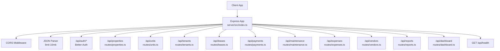
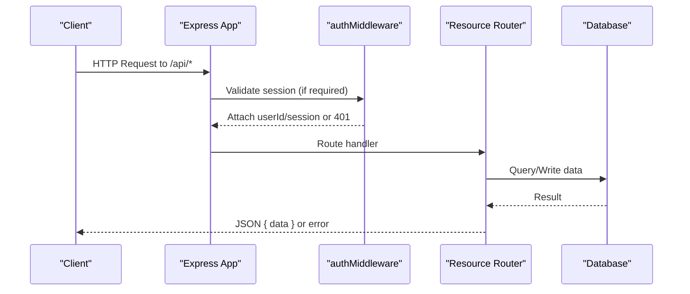
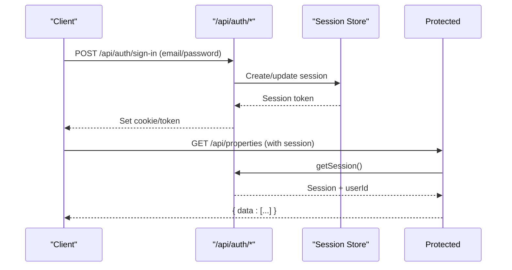
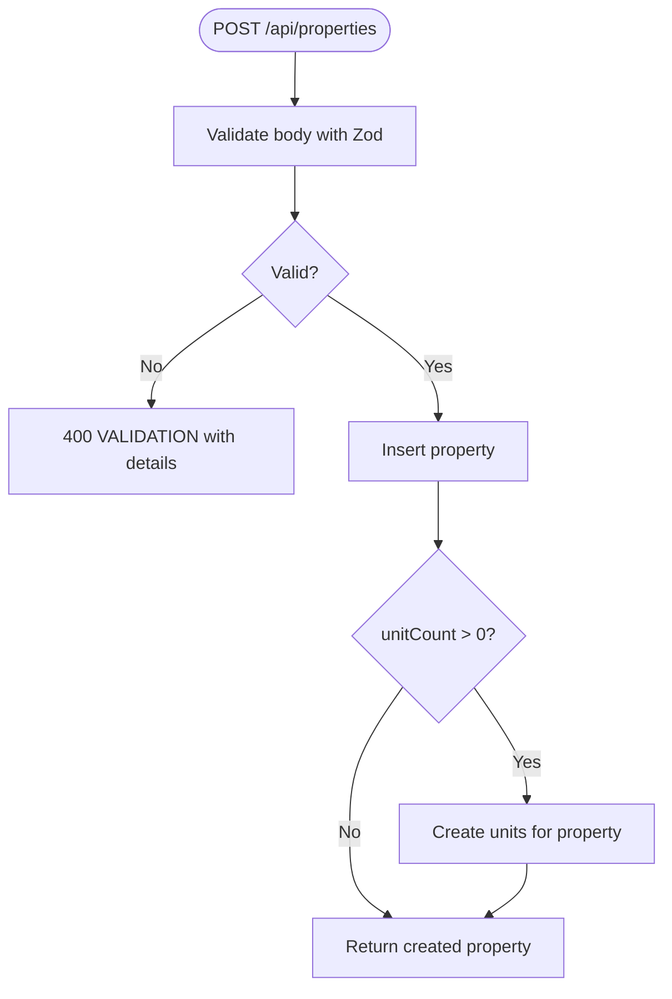
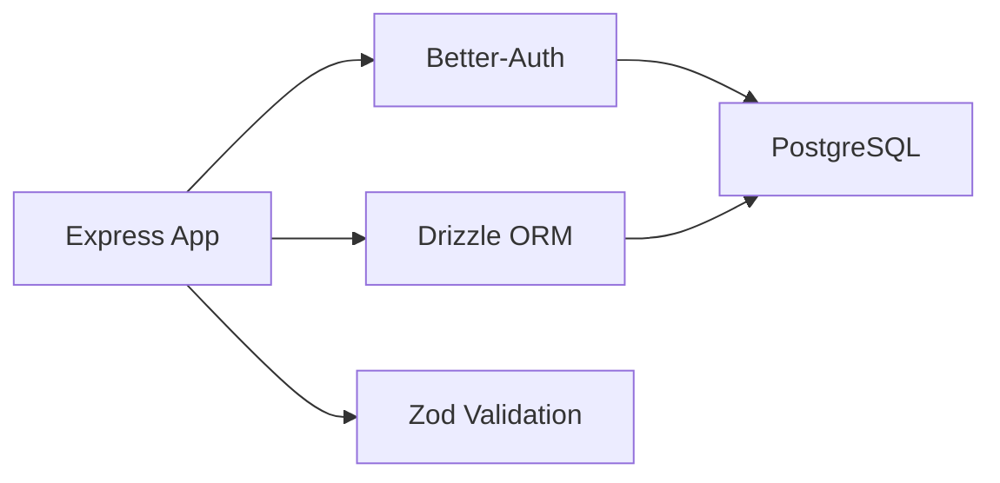

# API Overview

<cite>
**Referenced Files in This Document**
- [server/src/index.ts](file://server/src/index.ts)
- [server/src/auth/middleware.ts](file://server/src/auth/middleware.ts)
- [server/src/auth/index.ts](file://server/src/auth/index.ts)
- [server/src/routes/properties.ts](file://server/src/routes/properties.ts)
- [server/src/routes/tenants.ts](file://server/src/routes/tenants.ts)
- [server/src/routes/payments.ts](file://server/src/routes/payments.ts)
- [server/src/routes/dashboard.ts](file://server/src/routes/dashboard.ts)
- [server/src/routes/expenses.ts](file://server/src/routes/expenses.ts)
- [server/src/routes/maintenance.ts](file://server/src/routes/maintenance.ts)
- [server/src/db/schema.ts](file://server/src/db/schema.ts)
- [server/package.json](file://server/package.json)
</cite>

## Table of Contents
1. Introduction
2. Project Structure
3. Core Components
4. Architecture Overview
5. Detailed Component Analysis
6. Dependency Analysis
7. Performance Considerations
8. Troubleshooting Guide
9. Conclusion

## Introduction
This document provides a comprehensive overview of the RentLite backend RESTful API. It explains the base URL structure (/api/*), routing organization, middleware stack (CORS, JSON parsing limits, authentication), design principles, naming conventions, response formats, error handling patterns, status codes, and server configuration options. It also documents the health check endpoint and demonstrates how the modular route structure supports scalability.

## Project Structure
The backend is an Express application that:
- Configures global middleware for CORS and JSON body parsing.
- Mounts Better-Auth routes under /api/auth/* for authentication flows.
- Mounts feature-scoped routers under /api/<resource> for domain resources.
- Exposes a simple health check at /api/health.

**Diagram sources**
- [server/src/index.ts:19-50](file://server/src/index.ts#L19-L50)

**Section sources**
- [server/src/index.ts:1-59](file://server/src/index.ts#L1-L59)
- [server/package.json:1-37](file://server/package.json#L1-L37)

## Core Components
- Base URL and Routing: All business endpoints are mounted under /api with one router per resource. Authentication endpoints are exposed via Better-Auth at /api/auth/*.
- Middleware Stack:
  - CORS configured with credentials enabled; origin defaults to a development client URL when not set.
  - JSON parser with a generous request size limit (10mb).
  - Per-route authentication middleware that validates sessions and attaches user context to requests.
- Authentication:
  - Better-Auth integrated with Drizzle adapter for PostgreSQL.
  - Session-based auth with configurable expiration and update intervals.
  - Optional session extraction for routes that allow unauthenticated access.
- Response Format:
  - Successful responses wrap data in a consistent { data } envelope.
  - Error responses include message, code, and optional details for validation errors.
- Health Check:
  - GET /api/health returns a JSON object with status and timestamp.

**Section sources**
- [server/src/index.ts:19-50](file://server/src/index.ts#L19-L50)
- [server/src/auth/middleware.ts:8-44](file://server/src/auth/middleware.ts#L8-L44)
- [server/src/auth/index.ts:5-20](file://server/src/auth/index.ts#L5-L20)
- [server/src/routes/properties.ts:25-102](file://server/src/routes/properties.ts#L25-L102)
- [server/src/routes/payments.ts:24-133](file://server/src/routes/payments.ts#L24-L133)

## Architecture Overview
The API follows a clean separation of concerns:
- Global middleware handles cross-cutting concerns (CORS, JSON parsing).
- Feature routers encapsulate resource-specific logic, validation, and database operations.
- Authentication is enforced at the router level using a reusable middleware.
- Data access uses Drizzle ORM against a PostgreSQL database defined in schema.ts.

**Diagram sources**
- [server/src/index.ts:19-50](file://server/src/index.ts#L19-L50)
- [server/src/auth/middleware.ts:8-27](file://server/src/auth/middleware.ts#L8-L27)
- [server/src/routes/properties.ts:25-102](file://server/src/routes/properties.ts#L25-L102)

## Detailed Component Analysis

### Authentication Flow
- Better-Auth exposes endpoints under /api/auth/* which handle sign-in, sign-up, session management, etc.
- The app mounts these routes globally so clients can authenticate without additional configuration.
- Protected routes use authMiddleware to ensure a valid session exists before processing.

**Diagram sources**
- [server/src/index.ts:29-31](file://server/src/index.ts#L29-L31)
- [server/src/auth/middleware.ts:8-27](file://server/src/auth/middleware.ts#L8-L27)
- [server/src/auth/index.ts:5-20](file://server/src/auth/index.ts#L5-L20)

**Section sources**
- [server/src/index.ts:29-31](file://server/src/index.ts#L29-L31)
- [server/src/auth/middleware.ts:8-44](file://server/src/auth/middleware.ts#L8-L44)
- [server/src/auth/index.ts:5-20](file://server/src/auth/index.ts#L5-L20)

### Properties Resource
- Endpoints:
  - GET /api/properties — list properties owned by the authenticated user
  - GET /api/properties/:id — retrieve a single property
  - POST /api/properties — create a property and optionally auto-create units
  - PUT /api/properties/:id — update a property
  - DELETE /api/properties/:id — delete a property
- Validation: Zod schemas enforce input constraints; validation failures return 400 with structured error details.
- Ownership: Queries filter by userId to ensure multi-tenant isolation.

**Diagram sources**
- [server/src/routes/properties.ts:48-71](file://server/src/routes/properties.ts#L48-L71)

**Section sources**
- [server/src/routes/properties.ts:25-102](file://server/src/routes/properties.ts#L25-L102)

### Tenants Resource
- Endpoints:
  - GET /api/tenants — list tenants owned by the authenticated user
  - GET /api/tenants/:id — get tenant details
  - POST /api/tenants — create tenant
  - PUT /api/tenants/:id — update tenant
  - DELETE /api/tenants/:id — delete tenant
- Validation and ownership filtering follow the same patterns as properties.

**Section sources**
- [server/src/routes/tenants.ts:22-80](file://server/src/routes/tenants.ts#L22-L80)

### Payments Resource
- Endpoints:
  - GET /api/payments — list payments with optional filters (month, year, status, unitId)
  - GET /api/payments/summary — monthly rent collection summary
  - POST /api/payments — record payment
  - PUT /api/payments/:id — update payment
  - DELETE /api/payments/:id — delete payment
- Filtering logic computes monthly aggregates and respects user ownership boundaries.

**Section sources**
- [server/src/routes/payments.ts:24-133](file://server/src/routes/payments.ts#L24-L133)

### Dashboard Resource
- Endpoint:
  - GET /api/dashboard — aggregated metrics including occupancy, rent collection, financials, and alerts
- Computes current month metrics and summarizes across properties owned by the user.

**Section sources**
- [server/src/routes/dashboard.ts:10-121](file://server/src/routes/dashboard.ts#L10-L121)

### Expenses and Maintenance Resources
- Expenses:
  - CRUD endpoints with query filters (propertyId, category, year, month)
  - Validates and enforces property ownership on creation
- Maintenance:
  - CRUD endpoints with status/priority filters
  - Supports photo arrays and vendor associations

**Section sources**
- [server/src/routes/expenses.ts:30-102](file://server/src/routes/expenses.ts#L30-L102)
- [server/src/routes/maintenance.ts:25-100](file://server/src/routes/maintenance.ts#L25-L100)

### Health Check
- GET /api/health returns a minimal JSON payload indicating service availability and includes a timestamp.

**Section sources**
- [server/src/index.ts:46-50](file://server/src/index.ts#L46-L50)

## Dependency Analysis
- Express serves as the HTTP server and middleware orchestrator.
- Better-Auth provides authentication and session management backed by Drizzle and PostgreSQL.
- Drizzle ORM defines typed tables and queries used across routes.
- Zod validates incoming payloads consistently across routes.
- CORS and JSON parsing are applied globally before routing.

**Diagram sources**
- [server/src/index.ts:1-27](file://server/src/index.ts#L1-L27)
- [server/src/auth/index.ts:1-20](file://server/src/auth/index.ts#L1-L20)
- [server/src/db/schema.ts:1-12](file://server/src/db/schema.ts#L1-L12)

**Section sources**
- [server/package.json:15-25](file://server/package.json#L15-L25)
- [server/src/db/schema.ts:137-403](file://server/src/db/schema.ts#L137-L403)

## Performance Considerations
- JSON body size limit is set to 10mb to accommodate larger payloads if needed.
- Database queries often fetch all records and filter in memory; consider adding server-side filtering and pagination for large datasets.
- Repeated ownership checks compute sets of allowed IDs; ensure indexes exist on foreign keys and user-scoped columns to optimize queries.
- Avoid unnecessary joins; use selective column projection where possible.

[No sources needed since this section provides general guidance]

## Troubleshooting Guide
- Unauthorized Access:
  - If a protected route returns 401 with UNAUTHORIZED, verify the client sends a valid session/cookie.
  - Ensure CORS allows credentials and the correct origin.
- Validation Errors:
  - 400 VALIDATION responses include details from Zod; inspect the details field to fix request payloads.
- Not Found:
  - 404 NOT_FOUND indicates missing resources or lack of ownership; confirm IDs and user context.
- Health Check:
  - Use GET /api/health to verify the server is running and responsive.

**Section sources**
- [server/src/auth/middleware.ts:18-20](file://server/src/auth/middleware.ts#L18-L20)
- [server/src/routes/properties.ts:44-45](file://server/src/routes/properties.ts#L44-L45)
- [server/src/routes/expenses.ts:61-62](file://server/src/routes/expenses.ts#L61-L62)
- [server/src/routes/maintenance.ts:53-54](file://server/src/routes/maintenance.ts#L53-L54)
- [server/src/index.ts:46-50](file://server/src/index.ts#L46-L50)

## Conclusion
RentLite’s backend implements a clear, modular REST API with consistent patterns:
- Base URL /api/* with feature-scoped routers for scalability.
- Robust middleware stack: CORS, JSON parsing, and session-based authentication.
- Standardized response envelopes and error codes for predictable client behavior.
- A simple health check endpoint for operational monitoring.
This design enables easy extension with new resources while maintaining security, consistency, and maintainability.