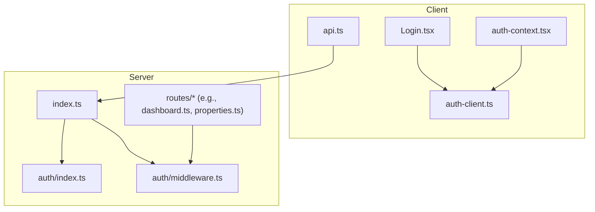
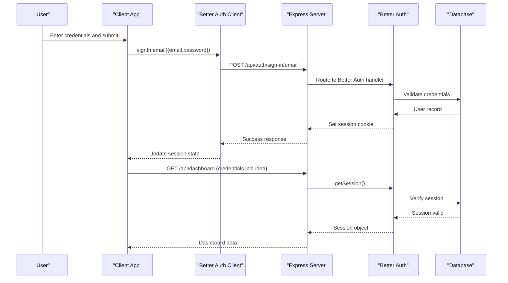
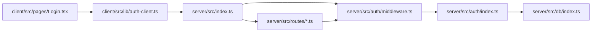
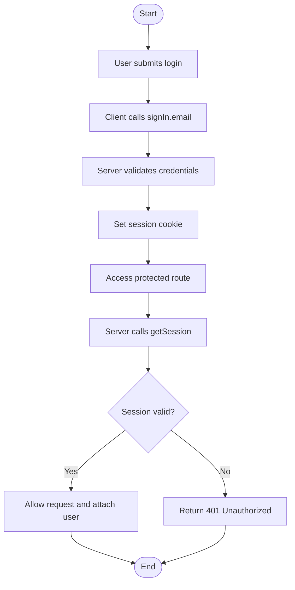

# Authentication & Middleware

<cite>
**Referenced Files in This Document**
- [server/src/auth/index.ts](file://server/src/auth/index.ts)
- [server/src/auth/middleware.ts](file://server/src/auth/middleware.ts)
- [server/src/index.ts](file://server/src/index.ts)
- [client/src/lib/auth-client.ts](file://client/src/lib/auth-client.ts)
- [client/src/contexts/auth-context.tsx](file://client/src/contexts/auth-context.tsx)
- [client/src/lib/api.ts](file://client/src/lib/api.ts)
- [client/src/pages/Login.tsx](file://client/src/pages/Login.tsx)
- [server/src/routes/dashboard.ts](file://server/src/routes/dashboard.ts)
- [server/src/routes/properties.ts](file://server/src/routes/properties.ts)
</cite>

## Table of Contents
1. Introduction
2. Project Structure
3. Core Components
4. Architecture Overview
5. Detailed Component Analysis
6. Dependency Analysis
7. Performance Considerations
8. Troubleshooting Guide
9. Conclusion
10. Appendices

## Introduction
This document explains the authentication system and middleware architecture built with Better Auth, including session handling, JWT-like token management via cookies, and protected route patterns. It covers how the client authenticates users, how server-side middleware validates sessions, and how to extend the system with custom authorization logic and additional providers.

## Project Structure
The authentication system spans both server and client:
- Server: Better Auth configuration, Express integration, and middleware for protecting routes.
- Client: Better Auth React client, context provider for session state, and API client that includes credentials for cookie-based sessions.

**Diagram sources**
- [client/src/pages/Login.tsx:1-148](file://client/src/pages/Login.tsx#L1-L148)
- [client/src/contexts/auth-context.tsx:1-38](file://client/src/contexts/auth-context.tsx#L1-L38)
- [client/src/lib/auth-client.ts:1-13](file://client/src/lib/auth-client.ts#L1-L13)
- [client/src/lib/api.ts:1-82](file://client/src/lib/api.ts#L1-L82)
- [server/src/index.ts:1-64](file://server/src/index.ts#L1-L64)
- [server/src/auth/index.ts:1-23](file://server/src/auth/index.ts#L1-L23)
- [server/src/auth/middleware.ts:1-45](file://server/src/auth/middleware.ts#L1-L45)
- [server/src/routes/dashboard.ts:1-124](file://server/src/routes/dashboard.ts#L1-L124)
- [server/src/routes/properties.ts:1-106](file://server/src/routes/properties.ts#L1-L106)

**Section sources**
- [server/src/index.ts:24-49](file://server/src/index.ts#L24-L49)
- [client/src/lib/auth-client.ts:1-13](file://client/src/lib/auth-client.ts#L1-L13)
- [client/src/contexts/auth-context.tsx:1-38](file://client/src/contexts/auth-context.tsx#L1-L38)

## Core Components
- Better Auth server setup: Configures database adapter, email/password auth, session lifetime, and trusted origins.
- Express integration: Mounts Better Auth handlers under /api/auth/* and applies global middleware.
- Session middleware: Validates sessions on protected routes and attaches user info to requests.
- Client SDK: Provides signIn/signUp/useSession hooks and a React context to expose session data.
- API client: Sends requests with credentials included; redirects to login on 401 responses.

Key responsibilities:
- Server: Issue and validate sessions, enforce access control at route level.
- Client: Manage login flow, maintain session awareness, and handle unauthorized states.

**Section sources**
- [server/src/auth/index.ts:1-23](file://server/src/auth/index.ts#L1-L23)
- [server/src/auth/middleware.ts:1-45](file://server/src/auth/middleware.ts#L1-L45)
- [server/src/index.ts:34-49](file://server/src/index.ts#L34-L49)
- [client/src/lib/auth-client.ts:1-13](file://client/src/lib/auth-client.ts#L1-L13)
- [client/src/contexts/auth-context.tsx:1-38](file://client/src/contexts/auth-context.tsx#L1-L38)
- [client/src/lib/api.ts:26-54](file://client/src/lib/api.ts#L26-L54)

## Architecture Overview
The system uses cookie-based sessions managed by Better Auth. The client calls signIn methods which set an HTTP-only session cookie. Protected routes call getSession to validate the session and attach user identity to the request.

**Diagram sources**
- [client/src/pages/Login.tsx:16-35](file://client/src/pages/Login.tsx#L16-L35)
- [client/src/lib/auth-client.ts:1-13](file://client/src/lib/auth-client.ts#L1-L13)
- [server/src/index.ts:34-49](file://server/src/index.ts#L34-L49)
- [server/src/auth/middleware.ts:8-27](file://server/src/auth/middleware.ts#L8-L27)
- [server/src/routes/dashboard.ts:1-124](file://server/src/routes/dashboard.ts#L1-L124)

## Detailed Component Analysis

### Better Auth Configuration
- Database adapter: Uses Drizzle with PostgreSQL provider.
- Email/password: Enabled without mandatory email verification (configurable).
- Session settings: Expiration and update age configured for weekly sessions with daily refresh.
- Trusted origins: Restricts cross-origin requests to the configured client URL.

Security notes:
- Ensure environment variables are set for secure production (e.g., HTTPS, proper domain).
- Consider enabling email verification in production.

**Section sources**
- [server/src/auth/index.ts:1-23](file://server/src/auth/index.ts#L1-L23)

### Express Integration and Auth Routes
- Global middleware: CORS with credentials enabled, JSON body parsing.
- Auth routes: All paths under /api/auth/* are forwarded to Better Auth’s Node handler.
- Feature routers: Mounted under /api/* and protected using middleware.

Operational notes:
- CORS must allow credentials when using cookie-based sessions.
- Keep auth routes separate from business routes to avoid accidental exposure.

**Section sources**
- [server/src/index.ts:24-49](file://server/src/index.ts#L24-L49)

### Session Middleware and Optional Auth
- authMiddleware:
  - Calls getSession using request headers.
  - Returns 401 if no session is present.
  - Attaches session and userId to the request for downstream handlers.
- optionalAuth:
  - Attempts to load session but does not block unauthenticated requests.
  - Useful for endpoints that serve public content but personalize it when logged in.

Extensibility:
- Add role checks after session validation by reading roles from the session or database.
- Combine with route-level guards for fine-grained permissions.

**Section sources**
- [server/src/auth/middleware.ts:8-45](file://server/src/auth/middleware.ts#L8-L45)

### Protected Routes Pattern
- Each feature router applies authMiddleware at the top to ensure all endpoints require authentication.
- Handlers use req.userId to scope queries to the current user’s resources.

Examples:
- Properties router enforces ownership by filtering queries with userId.
- Dashboard router aggregates data scoped to the authenticated user.

Best practices:
- Always scope database queries by userId to prevent IDOR vulnerabilities.
- Centralize authorization rules where possible.

**Section sources**
- [server/src/routes/properties.ts:1-106](file://server/src/routes/properties.ts#L1-L106)
- [server/src/routes/dashboard.ts:1-124](file://server/src/routes/dashboard.ts#L1-L124)

### Client-Side Authentication Flow
- Login page calls signIn.email and handles success/failure with user feedback.
- Auth context exposes current user and loading state via useSession.
- API client sends requests with credentials included and redirects to login on 401.

Error handling:
- UI shows toast messages for login errors.
- API client navigates to /login when receiving 401 responses.

**Section sources**
- [client/src/pages/Login.tsx:16-35](file://client/src/pages/Login.tsx#L16-L35)
- [client/src/contexts/auth-context.tsx:16-33](file://client/src/contexts/auth-context.tsx#L16-L33)
- [client/src/lib/api.ts:26-54](file://client/src/lib/api.ts#L26-L54)

### Custom Middleware Examples
You can create specialized middleware for:
- Role-based access control: Check user roles from session or database before allowing access.
- Feature flags: Gate features based on subscription tier or tenant settings.
- Audit logging: Record access attempts and outcomes for compliance.

Implementation pattern:
- Compose multiple middlewares (e.g., optionalAuth + roleGuard).
- Return early with appropriate status codes and error payloads.

[No sources needed since this section provides general guidance]

## Dependency Analysis
The authentication dependencies form a clear chain from client to server and into data stores.

**Diagram sources**
- [client/src/pages/Login.tsx:1-148](file://client/src/pages/Login.tsx#L1-L148)
- [client/src/lib/auth-client.ts:1-13](file://client/src/lib/auth-client.ts#L1-L13)
- [server/src/index.ts:1-64](file://server/src/index.ts#L1-L64)
- [server/src/auth/middleware.ts:1-45](file://server/src/auth/middleware.ts#L1-L45)
- [server/src/auth/index.ts:1-23](file://server/src/auth/index.ts#L1-L23)

**Section sources**
- [server/src/index.ts:1-64](file://server/src/index.ts#L1-L64)
- [server/src/auth/middleware.ts:1-45](file://server/src/auth/middleware.ts#L1-L45)
- [server/src/auth/index.ts:1-23](file://server/src/auth/index.ts#L1-L23)

## Performance Considerations
- Session validation: getSession is called per request; consider caching strategies if you add heavy checks.
- Database scoping: Filter queries by userId to minimize result sets and improve performance.
- CORS and credentials: Ensure minimal allowed origins to reduce overhead and risk.
- Body size limits: Current JSON limit is set; adjust as needed for large payloads.

[No sources needed since this section provides general guidance]

## Troubleshooting Guide
Common issues and resolutions:
- 401 Unauthorized on protected routes:
  - Cause: Missing or invalid session cookie.
  - Resolution: Ensure credentials are included in fetch requests and CORS allows credentials.
- Redirect loops after login:
  - Cause: Client not updating session or redirecting incorrectly.
  - Resolution: Verify signIn flow updates session and navigation occurs post-login.
- Cross-origin session failures:
  - Cause: Mismatched trusted origins or missing credentials flag.
  - Resolution: Align CLIENT_URL and CORS origin; enable credentials in CORS config.
- Permission denied scenarios:
  - Cause: Insufficient roles or resource ownership mismatch.
  - Resolution: Implement role checks and verify resource ownership in handlers.

**Section sources**
- [client/src/lib/api.ts:39-54](file://client/src/lib/api.ts#L39-L54)
- [server/src/auth/middleware.ts:14-27](file://server/src/auth/middleware.ts#L14-L27)
- [server/src/index.ts:26-31](file://server/src/index.ts#L26-L31)

## Conclusion
The application uses Better Auth for robust, cookie-based session management with clear separation between public auth routes and protected business routes. Middleware centralizes session validation and user attachment, while the client maintains session state and handles unauthorized flows gracefully. Extending the system with role-based access and custom middleware is straightforward by composing existing helpers and enforcing ownership checks in handlers.

[No sources needed since this section summarizes without analyzing specific files]

## Appendices

### Authentication Flow Summary

[No sources needed since this diagram shows conceptual workflow, not actual code structure]

### Extending Authentication
- Additional providers: Configure new providers in Better Auth server settings and update client usage accordingly.
- Custom authorization: Build middleware that reads roles or permissions from session or database and enforces policies before route handlers execute.
- Audit and monitoring: Log authentication events and policy decisions for security and compliance.

[No sources needed since this section provides general guidance]