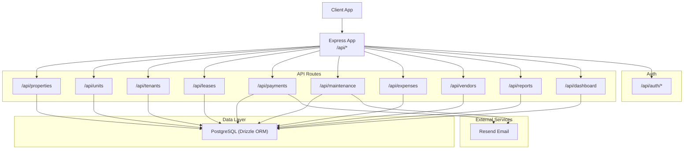
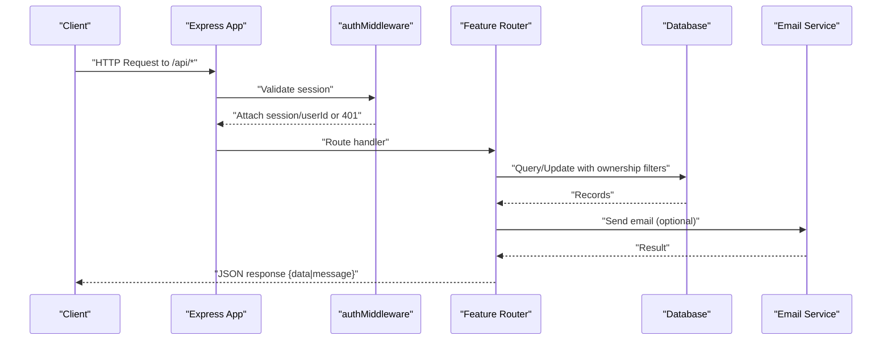
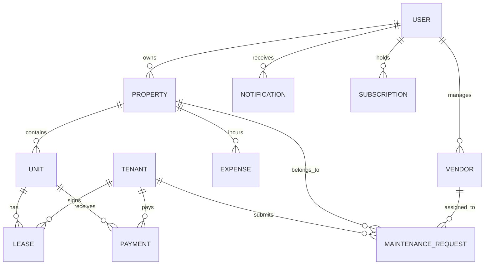
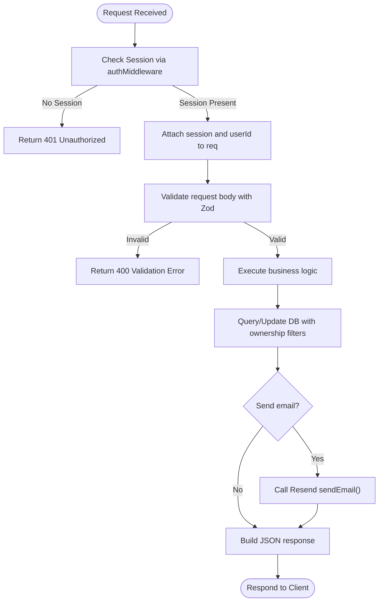
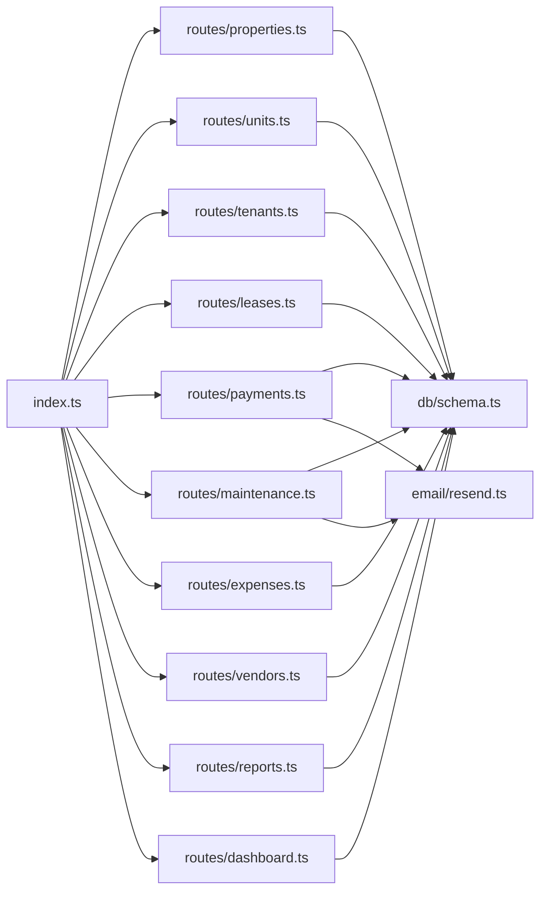

# Backend API

<cite>
**Referenced Files in This Document**
- [index.ts](file://server/src/index.ts)
- [middleware.ts](file://server/src/auth/middleware.ts)
- [schema.ts](file://server/src/db/schema.ts)
- [resend.ts](file://server/src/email/resend.ts)
- [properties.ts](file://server/src/routes/properties.ts)
- [units.ts](file://server/src/routes/units.ts)
- [tenants.ts](file://server/src/routes/tenants.ts)
- [leases.ts](file://server/src/routes/leases.ts)
- [payments.ts](file://server/src/routes/payments.ts)
- [maintenance.ts](file://server/src/routes/maintenance.ts)
- [expenses.ts](file://server/src/routes/expenses.ts)
- [vendors.ts](file://server/src/routes/vendors.ts)
- [reports.ts](file://server/src/routes/reports.ts)
- [dashboard.ts](file://server/src/routes/dashboard.ts)
</cite>

## Table of Contents
1. [Introduction](#introduction)
2. [Project Structure](#project-structure)
3. [Core Components](#core-components)
4. [Architecture Overview](#architecture-overview)
5. [Detailed Component Analysis](#detailed-component-analysis)
6. [Dependency Analysis](#dependency-analysis)
7. [Performance Considerations](#performance-considerations)
8. [Troubleshooting Guide](#troubleshooting-guide)
9. [Conclusion](#conclusion)
10. [Appendices](#appendices)

## Introduction
This document provides comprehensive API documentation for the RentLite backend services. It covers RESTful endpoints organized by functional domains: properties, units, tenants, leases, payments, maintenance, expenses, vendors, reports, and dashboard. For each endpoint, it specifies HTTP methods, URL patterns, request/response schemas, and authentication requirements. It also explains the middleware architecture for authentication, validation, and error handling; documents the database layer using Drizzle ORM including schema definitions, query patterns, and relationship management; and details external service integrations such as email notifications via Resend. Finally, it includes guidance on rate limiting, security considerations, API versioning strategies, extending the API with new endpoints, and maintaining backward compatibility.

## Project Structure
The backend is an Express application that mounts feature routers under a common base path. Global middleware configures CORS and JSON parsing. Authentication routes are mounted separately and protected routes use session-based middleware to enforce ownership and authorization. The data layer uses Drizzle ORM against PostgreSQL, with strongly typed schemas and relationships defined centrally. Email notifications are handled through a dedicated module integrating with Resend.

**Diagram sources**
- [index.ts:19-44](file://server/src/index.ts#L19-L44)
- [properties.ts:1-106](file://server/src/routes/properties.ts#L1-L106)
- [payments.ts:1-137](file://server/src/routes/payments.ts#L1-L137)
- [maintenance.ts:1-103](file://server/src/routes/maintenance.ts#L1-L103)
- [resend.ts:1-113](file://server/src/email/resend.ts#L1-L113)

**Section sources**
- [index.ts:19-59](file://server/src/index.ts#L19-L59)

## Core Components
- Authentication and Authorization: Session-based auth via Better-Auth with middleware to extract and attach user context to requests. Protected routes enforce ownership checks per resource.
- Validation: Zod schemas validate request payloads consistently across endpoints, returning structured validation errors.
- Data Access: Drizzle ORM queries with type-safe relations and filters scoped to the authenticated user’s resources.
- External Integrations: Email sending via Resend with templates for rent reminders, receipts, and maintenance updates.

Key responsibilities by domain:
- Properties: CRUD for properties with automatic unit creation based on unit count.
- Units: CRUD for units linked to properties with ownership verification.
- Tenants: CRUD for tenant records scoped to users.
- Leases: CRUD for leases with unit status transitions and expiring lease queries.
- Payments: CRUD for payments with monthly summaries and filtering.
- Maintenance: CRUD for maintenance requests with optional vendor linkage and status updates.
- Expenses: CRUD for expenses with property ownership checks and category filters.
- Vendors: CRUD for vendor contacts scoped to users.
- Reports: Aggregations for cash flow, Schedule E mapping, and profit & loss.
- Dashboard: High-level metrics combining multiple entities.

**Section sources**
- [middleware.ts:9-44](file://server/src/auth/middleware.ts#L9-L44)
- [properties.ts:11-23](file://server/src/routes/properties.ts#L11-L23)
- [schema.ts:191-403](file://server/src/db/schema.ts#L191-L403)
- [resend.ts:7-113](file://server/src/email/resend.ts#L7-L113)

## Architecture Overview
The server initializes global middleware (CORS, JSON body parser), mounts Better-Auth handlers at /api/auth/*, and registers feature routers under /api. Each router applies authMiddleware to secure endpoints. Queries are filtered by userId to ensure multi-tenant isolation. Responses follow a consistent shape with data envelopes and standardized error objects.

**Diagram sources**
- [index.ts:19-44](file://server/src/index.ts#L19-L44)
- [middleware.ts:9-27](file://server/src/auth/middleware.ts#L9-L27)
- [payments.ts:24-137](file://server/src/routes/payments.ts#L24-L137)
- [maintenance.ts:25-103](file://server/src/routes/maintenance.ts#L25-L103)
- [resend.ts:7-30](file://server/src/email/resend.ts#L7-L30)

## Detailed Component Analysis

### Properties API
- Base path: /api/properties
- Auth: Required (session)
- Endpoints:
  - GET / — List properties owned by the current user, include related units.
  - GET /:id — Get a single property with units if owned by the current user.
  - POST / — Create a property; optionally auto-create units based on unitCount.
  - PUT /:id — Update fields of a property owned by the current user.
  - DELETE /:id — Delete a property owned by the current user.
- Request/Response Schemas:
  - Create/Update payload validated by a schema with fields for name, address, city, state, zip, type, unitCount, status, notes.
  - Responses return { data } for successful operations; errors return { message, code }.
- Notes:
  - Ownership enforced by userId filter on all queries.
  - Auto-creation of units simplifies onboarding.

**Section sources**
- [properties.ts:1-106](file://server/src/routes/properties.ts#L1-L106)

### Units API
- Base path: /api/units
- Auth: Required (session)
- Endpoints:
  - GET /?propertyId=xxx — List units, optionally filtered by propertyId; results scoped to user-owned properties.
  - GET /:id — Get a unit with its property; ownership verified.
  - POST / — Create a unit under a user-owned property.
  - PUT /:id — Update unit fields; ownership verified.
  - DELETE /:id — Delete a unit; ownership verified.
- Request/Response Schemas:
  - Create/Update payload validated by a schema with fields for propertyId, unitNumber, rentAmount, status, bedrooms, bathrooms, notes.
  - Responses return { data }; errors return { message, code }.

**Section sources**
- [units.ts:1-123](file://server/src/routes/units.ts#L1-L123)

### Tenants API
- Base path: /api/tenants
- Auth: Required (session)
- Endpoints:
  - GET / — List tenants owned by the current user.
  - GET /:id — Get a tenant owned by the current user.
  - POST / — Create a tenant record.
  - PUT /:id — Update tenant fields.
  - DELETE /:id — Delete a tenant record.
- Request/Response Schemas:
  - Create/Update payload validated by a schema with fields for firstName, lastName, email, phone, emergencyContactName, emergencyContactPhone, employer, notes.
  - Responses return { data }; errors return { message, code }.

**Section sources**
- [tenants.ts:1-83](file://server/src/routes/tenants.ts#L1-L83)

### Leases API
- Base path: /api/leases
- Auth: Required (session)
- Endpoints:
  - GET / — List leases associated with user-owned units.
  - GET /expiring?days=N — List active leases expiring within N days for user-owned units.
  - GET /:id — Get a lease with related unit and tenant.
  - POST / — Create a lease; validates unit and tenant ownership; sets unit status to occupied.
  - PUT /:id — Update lease fields; if terminated/expired, sets unit status to vacant.
  - DELETE /:id — Delete a lease.
- Request/Response Schemas:
  - Create/Update payload validated by a schema with fields for unitId, tenantId, startDate, endDate, rentAmount, deposit, terms, documentUrl, status.
  - Responses return { data }; errors return { message, code }.

**Section sources**
- [leases.ts:1-147](file://server/src/routes/leases.ts#L1-L147)

### Payments API
- Base path: /api/payments
- Auth: Required (session)
- Endpoints:
  - GET /?month=&year=&status=&unitId= — List payments with optional filters; results scoped to user-owned units.
  - GET /summary?month=&year= — Monthly rent collection summary with totals and rates.
  - POST / — Create a payment record.
  - PUT /:id — Update payment fields (e.g., mark received).
  - DELETE /:id — Delete a payment.
- Request/Response Schemas:
  - Create/Update payload validated by a schema with fields for unitId, tenantId, amount, amountPaid, dueDate, paidDate, method, status, lateFee, notes.
  - Summary returns aggregated metrics including totalExpected, totalCollected, totalOutstanding, collectionRate, counts by status.
  - Responses return { data }; errors return { message, code }.

**Section sources**
- [payments.ts:1-137](file://server/src/routes/payments.ts#L1-L137)

### Maintenance API
- Base path: /api/maintenance
- Auth: Required (session)
- Endpoints:
  - GET /?status=&priority= — List maintenance requests for user-owned properties with optional filters.
  - GET /:id — Get a maintenance request with related unit, tenant, vendor.
  - POST / — Create a maintenance request; sets submittedAt timestamp.
  - PUT /:id — Update request fields; setting status to completed sets completedAt.
  - DELETE /:id — Delete a maintenance request.
- Request/Response Schemas:
  - Create/Update payload validated by a schema with fields for unitId, propertyId, tenantId, title, description, priority, status, photos, completionPhotos, vendorId, cost.
  - Responses return { data }; errors return { message, code }.

**Section sources**
- [maintenance.ts:1-103](file://server/src/routes/maintenance.ts#L1-L103)

### Expenses API
- Base path: /api/expenses
- Auth: Required (session)
- Endpoints:
  - GET /?propertyId=&category=&year=&month= — List expenses for user-owned properties with optional filters.
  - GET /:id — Get a specific expense.
  - POST / — Create an expense; verifies property ownership.
  - PUT /:id — Update expense fields.
  - DELETE /:id — Delete an expense.
- Request/Response Schemas:
  - Create/Update payload validated by a schema with fields for propertyId, unitId, category, description, amount, date, vendor, receiptUrl, isRecurring, recurringFrequency, notes.
  - Responses return { data }; errors return { message, code }.

**Section sources**
- [expenses.ts:1-106](file://server/src/routes/expenses.ts#L1-L106)

### Vendors API
- Base path: /api/vendors
- Auth: Required (session)
- Endpoints:
  - GET / — List vendors owned by the current user.
  - POST / — Create a vendor record.
  - PUT /:id — Update vendor fields.
  - DELETE /:id — Delete a vendor record.
- Request/Response Schemas:
  - Create/Update payload validated by a schema with fields for name, trade, phone, email, insuranceExpiry, notes.
  - Responses return { data }; errors return { message, code }.

**Section sources**
- [vendors.ts:1-71](file://server/src/routes/vendors.ts#L1-L71)

### Reports API
- Base path: /api/reports
- Auth: Required (session)
- Endpoints:
  - GET /cashflow?year= — Monthly cash flow per property for the given year.
  - GET /schedule-e?year= — Schedule E helper aggregating expenses by category mapped to IRS lines and total rent received.
  - GET /pnl?year=&quarter= — Profit & loss per property for the given year and optional quarter.
- Response Schemas:
  - Cashflow: array of property entries with monthly income, expenses, net, and yearly totals.
  - Schedule E: array of property entries with rentReceived, lineItems (category, line number, description, amount), totalExpenses, netIncome.
  - PnL: array of property entries with totalIncome, totalExpenses, netIncome, period label.
- Notes:
  - All computations scoped to user-owned properties and units.

**Section sources**
- [reports.ts:1-186](file://server/src/routes/reports.ts#L1-L186)

### Dashboard API
- Base path: /api/dashboard
- Auth: Required (session)
- Endpoint:
  - GET / — Returns overview stats including properties, units, occupancy rate, tenants, rent collection metrics, financials, and alerts (open maintenance, expiring leases, late payments).
- Response Schema:
  - Aggregated metrics grouped by categories: properties, units, tenants, rent, financials, alerts.

**Section sources**
- [dashboard.ts:1-124](file://server/src/routes/dashboard.ts#L1-L124)

### Database Layer (Drizzle ORM)
- Schema Definitions:
  - Enums define constrained values for types like property_type, unit_status, lease_status, payment_method, payment_status, maintenance_priority, maintenance_status, expense_category, notification enums, plan tiers, billing cycles, subscription statuses, and recurring frequencies.
  - Entities include user/session/account/verification tables managed by Better-Auth; business entities include property, unit, tenant, lease, payment, maintenance_request, expense, vendor, notification, subscription.
- Relationships:
  - Foreign keys link units to properties, leases to units and tenants, payments to units and tenants, maintenance requests to units, tenants, properties, and vendors, expenses to properties and units, notifications to users, subscriptions to users.
  - Cascade behaviors applied where appropriate (e.g., deleting a property cascades to units and related records).
- Query Patterns:
  - Multi-tenant scoping: Most queries filter by userId to ensure data isolation.
  - In-memory filtering: Some endpoints fetch broad datasets and filter client-side for performance simplicity; consider indexing and server-side pagination for scale.
  - Relations: Use Drizzle’s with option to eagerly load related entities (e.g., units with properties, payments with units and tenants).

**Diagram sources**
- [schema.ts:139-403](file://server/src/db/schema.ts#L139-L403)

**Section sources**
- [schema.ts:14-403](file://server/src/db/schema.ts#L14-L403)

### Middleware Architecture
- Authentication:
  - Better-Auth integration mounted at /api/auth/* handles sign-in/out and session management.
  - authMiddleware extracts session from headers, attaches session and userId to request, and enforces 401 Unauthorized when missing.
  - optionalAuth allows endpoints to proceed without requiring authentication while still attaching session if present.
- Validation:
  - Each route defines Zod schemas for create/update payloads; validation failures return 400 with structured error details.
- Error Handling:
  - Consistent error responses include message and code fields; not found returns 404, unauthorized returns 401, validation errors return 400.

**Diagram sources**
- [middleware.ts:9-44](file://server/src/auth/middleware.ts#L9-L44)
- [properties.ts:11-23](file://server/src/routes/properties.ts#L11-L23)
- [resend.ts:7-30](file://server/src/email/resend.ts#L7-L30)

**Section sources**
- [middleware.ts:1-44](file://server/src/auth/middleware.ts#L1-L44)

### External Service Integration: Email Notifications via Resend
- Module exports sendEmail function that wraps Resend API calls, returning success or error details.
- Templates provided for rent reminders, rent receipts, and maintenance updates with styled HTML content.
- Usage pattern:
  - Generate template string with parameters (tenant name, property/unit info, amounts, dates).
  - Call sendEmail with recipient, subject, and HTML.
  - Handle success/failure in route handlers to inform clients or log issues.

**Section sources**
- [resend.ts:1-113](file://server/src/email/resend.ts#L1-L113)

## Dependency Analysis
- Routing Dependencies:
  - index.ts mounts routers for each domain under /api, ensuring modular separation.
  - Each router depends on authMiddleware for protection and db accessors for persistence.
- Data Dependencies:
  - Schema.ts centralizes entity definitions and enums used across routes.
  - Routes often compute derived sets (e.g., user property IDs) to scope queries and filter in-memory for simplicity.
- External Dependencies:
  - Resend integration is isolated in email/resend.ts and can be invoked by relevant routes (e.g., maintenance updates, payment confirmations).

**Diagram sources**
- [index.ts:1-59](file://server/src/index.ts#L1-L59)
- [schema.ts:14-403](file://server/src/db/schema.ts#L14-L403)
- [resend.ts:1-113](file://server/src/email/resend.ts#L1-L113)

**Section sources**
- [index.ts:1-59](file://server/src/index.ts#L1-L59)
- [schema.ts:14-403](file://server/src/db/schema.ts#L14-L403)

## Performance Considerations
- Query Efficiency:
  - Prefer server-side filtering and pagination for large datasets instead of fetching all records and filtering in memory.
  - Add indexes on frequently filtered columns (e.g., propertyId, unitId, userId, dueDate, date).
- Caching:
  - Introduce caching for read-heavy endpoints (e.g., dashboard, reports) with short TTLs to reduce DB load.
- Email Delivery:
  - Queue email sending asynchronously to avoid blocking request-response cycles.
- Rate Limiting:
  - Implement rate limiting at the API gateway or middleware level to protect endpoints from abuse.
- Connection Pooling:
  - Ensure DB connection pooling is tuned for expected concurrency.

[No sources needed since this section provides general guidance]

## Troubleshooting Guide
Common issues and resolutions:
- Unauthorized (401):
  - Cause: Missing or invalid session.
  - Resolution: Ensure client sends proper cookies/headers; verify Better-Auth configuration.
- Not Found (404):
  - Cause: Resource does not exist or is not owned by the current user.
  - Resolution: Verify resource ID and ownership checks in routes.
- Validation Error (400):
  - Cause: Invalid request payload.
  - Resolution: Inspect validation error details returned in response; adjust client input.
- Email Sending Failures:
  - Cause: Resend API errors or network issues.
  - Resolution: Check logs for error messages; verify API key and recipient addresses; implement retries.

**Section sources**
- [middleware.ts:14-27](file://server/src/auth/middleware.ts#L14-L27)
- [properties.ts:44-102](file://server/src/routes/properties.ts#L44-L102)
- [payments.ts:104-133](file://server/src/routes/payments.ts#L104-L133)
- [resend.ts:12-30](file://server/src/email/resend.ts#L12-L30)

## Conclusion
RentLite’s backend provides a well-structured, secure, and extensible API for landlord management tasks. The modular routing, robust authentication and validation, and clear database schema enable rapid development and maintainability. External integrations like Resend enhance user experience through timely notifications. Following the guidelines for performance, security, and versioning will help scale the system and support future growth.

[No sources needed since this section summarizes without analyzing specific files]

## Appendices

### API Versioning Strategy
- Current state: No explicit version prefix in routes; all endpoints live under /api.
- Recommendation: Introduce a versioned base path (e.g., /api/v1) to allow breaking changes without disrupting existing clients.
- Migration approach:
  - Maintain parallel versions during transition periods.
  - Deprecate older versions with clear timelines and migration guides.

[No sources needed since this section provides general guidance]

### Security Considerations
- Authentication: Enforce session-based auth on all sensitive endpoints; use HTTPS in production.
- Authorization: Always filter by userId to prevent cross-user data access.
- Input Validation: Validate all inputs with strict schemas; sanitize outputs to prevent injection.
- Secrets Management: Store API keys (e.g., Resend) in environment variables; never hardcode secrets.
- CORS: Configure allowed origins explicitly; restrict credentials usage to trusted domains.

[No sources needed since this section provides general guidance]

### Extending the API with New Endpoints
Steps:
- Define a new router file under routes/ with clear naming and responsibility.
- Add Zod schemas for request validation.
- Apply authMiddleware to secure endpoints.
- Implement CRUD operations with ownership checks and Drizzle queries.
- Mount the router in index.ts under /api/<domain>.
- Add tests for validation, authorization, and data integrity.
- Document endpoints in this guide with methods, paths, schemas, and examples.

**Section sources**
- [index.ts:35-44](file://server/src/index.ts#L35-L44)
- [properties.ts:11-23](file://server/src/routes/properties.ts#L11-L23)

### Backward Compatibility Guidelines
- Avoid removing or renaming fields in request/response schemas without deprecation.
- Introduce new fields as optional initially; enforce required behavior in later versions.
- Provide migration scripts or adapters for significant schema changes.
- Communicate changes via release notes and update client SDKs accordingly.

[No sources needed since this section provides general guidance]