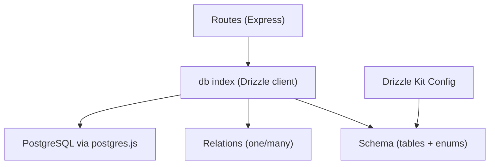
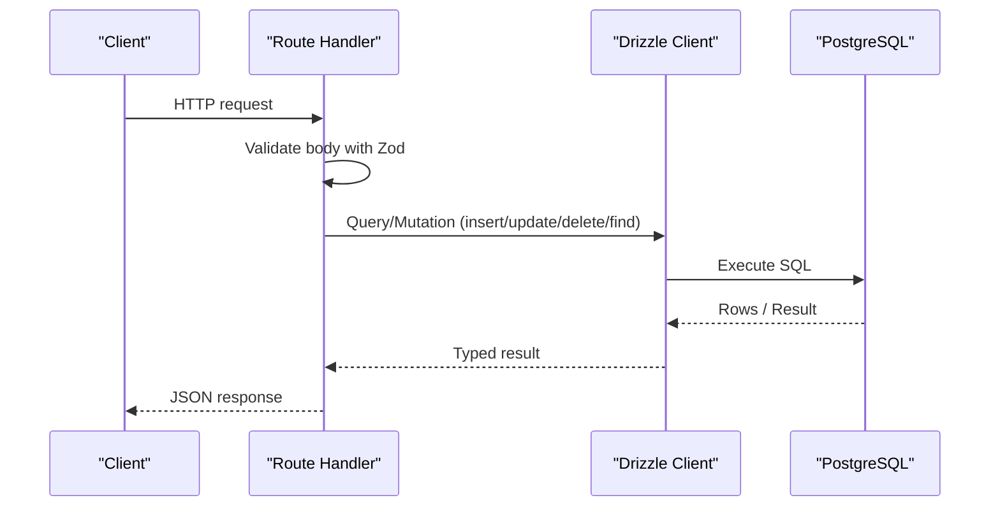
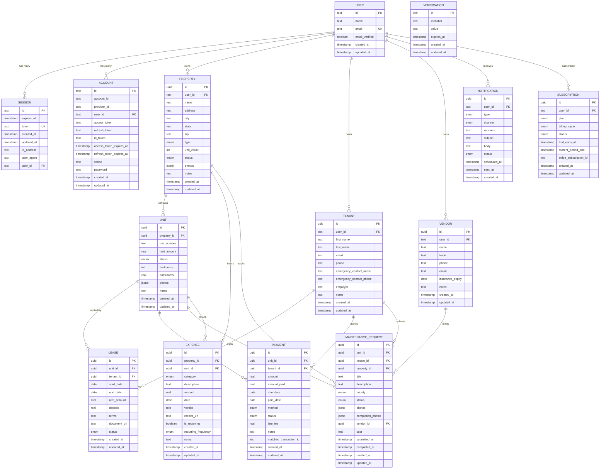
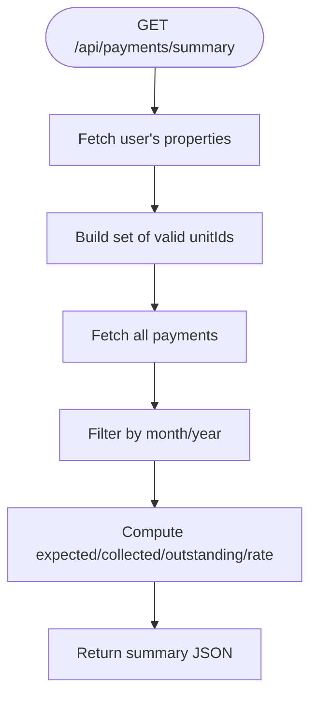
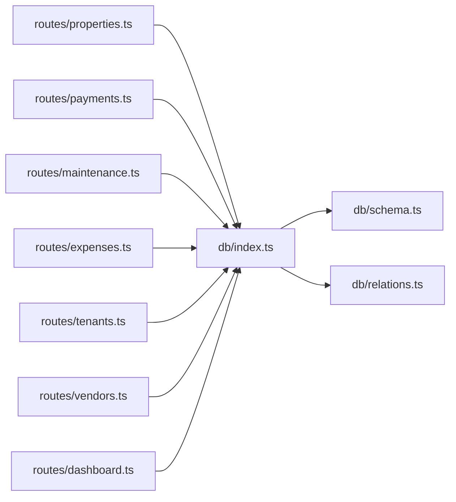

# Database Layer

<cite>
**Referenced Files in This Document**
- [schema.ts](file://server/src/db/schema.ts)
- [relations.ts](file://server/src/db/relations.ts)
- [index.ts](file://server/src/db/index.ts)
- [drizzle.config.ts](file://server/drizzle.config.ts)
- [properties.ts](file://server/src/routes/properties.ts)
- [payments.ts](file://server/src/routes/payments.ts)
- [maintenance.ts](file://server/src/routes/maintenance.ts)
- [expenses.ts](file://server/src/routes/expenses.ts)
- [tenants.ts](file://server/src/routes/tenants.ts)
- [vendors.ts](file://server/src/routes/vendors.ts)
- [dashboard.ts](file://server/src/routes/dashboard.ts)
</cite>

## Table of Contents
1. Introduction
2. Project Structure
3. Core Components
4. Architecture Overview
5. Detailed Component Analysis
6. Dependency Analysis
7. Performance Considerations
8. Troubleshooting Guide
9. Conclusion
10. Appendices

## Introduction
This document describes the database layer built with Drizzle ORM for a landlord management application. It covers the complete schema, relational model, query patterns, validation strategies, migration configuration, and operational guidance such as connection setup, logging, and debugging. The focus is on how properties, units, tenants, leases, payments, maintenance requests, expenses, and vendors are modeled and queried across the API routes.

## Project Structure
The database layer lives under server/src/db and is consumed by route handlers:
- Schema definitions and enums: server/src/db/schema.ts
- Relational mappings: server/src/db/relations.ts
- Database client initialization: server/src/db/index.ts
- Drizzle Kit configuration: server/drizzle.config.ts
- Route handlers that perform queries and mutations: server/src/routes/*

**Diagram sources**
- [index.ts:1-10](file://server/src/db/index.ts#L1-L10)
- [schema.ts:1-403](file://server/src/db/schema.ts#L1-L403)
- [relations.ts:1-103](file://server/src/db/relations.ts#L1-L103)
- [drizzle.config.ts:1-16](file://server/drizzle.config.ts#L1-L16)

**Section sources**
- [index.ts:1-10](file://server/src/db/index.ts#L1-L10)
- [schema.ts:1-403](file://server/src/db/schema.ts#L1-L403)
- [relations.ts:1-103](file://server/src/db/relations.ts#L1-L103)
- [drizzle.config.ts:1-16](file://server/drizzle.config.ts#L1-L16)

## Core Components
- PostgreSQL-backed schema using Drizzle’s pg-core types and enums.
- Strongly typed relations to enable nested queries and joins.
- Centralized db client exported from db/index.ts used by all routes.
- Zod-based input validation at route boundaries before DB writes.

Key responsibilities:
- schema.ts: defines tables, columns, constraints, defaults, and foreign keys.
- relations.ts: declares one-to-many and many-to-one relationships for rich querying.
- index.ts: creates a single drizzle instance with schema and relations merged.
- drizzle.config.ts: configures migrations and dialect for Drizzle Kit.

**Section sources**
- [schema.ts:1-403](file://server/src/db/schema.ts#L1-L403)
- [relations.ts:1-103](file://server/src/db/relations.ts#L1-L103)
- [index.ts:1-10](file://server/src/db/index.ts#L1-L10)
- [drizzle.config.ts:1-16](file://server/drizzle.config.ts#L1-L16)

## Architecture Overview
The application uses an Express router per domain (properties, payments, etc.) that validates inputs with Zod and performs CRUD operations through a shared Drizzle client. Data integrity is enforced by foreign key constraints and enum types defined in the schema. Relationships are declared in relations.ts to support nested reads.

**Diagram sources**
- [properties.ts:25-71](file://server/src/routes/properties.ts#L25-L71)
- [payments.ts:24-137](file://server/src/routes/payments.ts#L24-L137)
- [index.ts:1-10](file://server/src/db/index.ts#L1-L10)

## Detailed Component Analysis

### Schema and Relational Model
The schema models the following core entities and their relationships:

- User and Auth-related tables (user, session, account, verification)
- Property (owned by user)
- Unit (belongs to property)
- Tenant (belongs to user)
- Lease (links unit and tenant)
- Payment (links unit and tenant)
- MaintenanceRequest (links unit, tenant, property, vendor)
- Expense (links property and optionally unit)
- Vendor (belongs to user)
- Notification (belongs to user)
- Subscription (belongs to user)

Relationships:
- user 1→* property, tenant, vendor, notification, subscription
- property 1→* unit, expense, maintenanceRequest
- unit 1→* lease, payment, maintenanceRequest, expense
- tenant 1→* lease, payment, maintenanceRequest
- lease n→1 unit, tenant
- payment n→1 unit, tenant
- maintenanceRequest n→1 unit, tenant (nullable), property, vendor (nullable)
- expense n→1 property, unit (nullable)
- vendor 1→* maintenanceRequest
- notification n→1 user
- subscription n→1 user

Constraints and indexes:
- Primary keys: uuid for most business tables; text id for auth tables.
- Foreign keys: defined with onDelete cascade or set null where appropriate.
- Unique constraints: email on user; token on session; account_id/provider_id not explicitly unique but tied to user.
- Enums: strongly typed status/priority/category fields ensure data consistency.
- Defaults: timestamps default to now; booleans and arrays have sensible defaults.

Note: Explicit indexes are not declared in the schema. For performance tuning, consider adding indexes on frequently filtered columns (e.g., userId, propertyId, unitId, dueDate, date).

**Diagram sources**
- [schema.ts:139-403](file://server/src/db/schema.ts#L139-L403)

**Section sources**
- [schema.ts:139-403](file://server/src/db/schema.ts#L139-L403)
- [relations.ts:18-103](file://server/src/db/relations.ts#L18-L103)

### Query Patterns and Examples
Common patterns observed across routes:

- Ownership scoping: Most endpoints filter by userId to ensure tenants/landlords only access their own data.
- Nested reads: Using relations to include related entities (e.g., units with properties, payments with unit and tenant).
- Filtering and aggregation: In-memory filtering after fetching sets, then computing totals and rates.
- Enum-constrained updates: Status transitions validated by Zod and persisted safely.

Examples:
- List properties with units: findMany with where clause and with relation.
- Create property and auto-create units: insert property then batch insert units.
- Payments listing and summary: fetch payments, filter by ownership and month/year, compute totals and collection rate.
- Dashboard aggregation: combine multiple tables to compute occupancy, income, expenses, alerts.

**Diagram sources**
- [payments.ts:61-101](file://server/src/routes/payments.ts#L61-L101)

**Section sources**
- [properties.ts:25-71](file://server/src/routes/properties.ts#L25-L71)
- [payments.ts:24-137](file://server/src/routes/payments.ts#L24-L137)
- [dashboard.ts:10-124](file://server/src/routes/dashboard.ts#L10-L124)

### Transaction Handling
- No explicit transactions are used in the examined routes. Each mutation executes a single statement.
- For multi-step operations (e.g., creating a property and its units), consider wrapping in a transaction to ensure atomicity.
- When updating related records (e.g., marking payment received and adjusting balances), use transactions to prevent partial updates.

Recommendation: Use Drizzle’s transaction API to group related inserts/updates/deletes into a single atomic unit.

**Section sources**
- [properties.ts:48-71](file://server/src/routes/properties.ts#L48-L71)
- [payments.ts:103-137](file://server/src/routes/payments.ts#L103-L137)

### Data Validation Strategies
- Input validation is performed with Zod schemas at the route level before any DB write.
- Schemas enforce required fields, types, ranges, and allowed enum values.
- Validation errors return structured responses with details for clients.

Patterns:
- Create schemas for POST bodies and partial schemas for PUT updates.
- Reuse schemas across routes for consistent validation rules.

**Section sources**
- [properties.ts:11-23](file://server/src/routes/properties.ts#L11-L23)
- [payments.ts:11-22](file://server/src/routes/payments.ts#L11-L22)
- [maintenance.ts:11-23](file://server/src/routes/maintenance.ts#L11-L23)
- [expenses.ts:11-28](file://server/src/routes/expenses.ts#L11-L28)
- [tenants.ts:11-20](file://server/src/routes/tenants.ts#L11-L20)
- [vendors.ts:11-18](file://server/src/routes/vendors.ts#L11-L18)

### Complex Queries, Joins, and Aggregations
- Joins: Achieved via relations in findMany/findFirst with with clauses (e.g., payments with unit and tenant).
- Aggregations: Computed in application code by summing amounts and counting statuses; could be optimized with SQL-level aggregations for large datasets.
- Filtering: Applied both at DB level (where clauses) and in memory (date filters, status filters).

Optimization opportunities:
- Move heavy filtering/aggregation to SQL using Drizzle’s sql helper or raw queries for better performance at scale.
- Add database indexes on commonly filtered columns.

**Section sources**
- [payments.ts:24-101](file://server/src/routes/payments.ts#L24-L101)
- [dashboard.ts:10-124](file://server/src/routes/dashboard.ts#L10-L124)

## Dependency Analysis
The database layer depends on:
- Drizzle ORM and postgres driver for type-safe queries.
- Zod for input validation.
- Express routers for HTTP endpoints.

**Diagram sources**
- [index.ts:1-10](file://server/src/db/index.ts#L1-L10)
- [schema.ts:1-403](file://server/src/db/schema.ts#L1-L403)
- [relations.ts:1-103](file://server/src/db/relations.ts#L1-L103)
- [properties.ts:1-106](file://server/src/routes/properties.ts#L1-L106)
- [payments.ts:1-137](file://server/src/routes/payments.ts#L1-L137)
- [maintenance.ts:1-103](file://server/src/routes/maintenance.ts#L1-L103)
- [expenses.ts:1-106](file://server/src/routes/expenses.ts#L1-L106)
- [tenants.ts:1-83](file://server/src/routes/tenants.ts#L1-L83)
- [vendors.ts:1-71](file://server/src/routes/vendors.ts#L1-L71)
- [dashboard.ts:1-124](file://server/src/routes/dashboard.ts#L1-L124)

**Section sources**
- [index.ts:1-10](file://server/src/db/index.ts#L1-L10)
- [schema.ts:1-403](file://server/src/db/schema.ts#L1-L403)
- [relations.ts:1-103](file://server/src/db/relations.ts#L1-L103)

## Performance Considerations
- Current approach fetches full tables and filters in memory for some endpoints (e.g., payments, dashboard). For larger datasets, move filtering to the database using where clauses and date functions.
- Consider adding indexes on:
  - user.id, property.userId, unit.propertyId, payment.unitId, expense.propertyId, maintenanceRequest.propertyId
  - Date fields like payment.dueDate, expense.date for time-range queries
- Use select projections to limit returned columns when possible.
- Batch inserts where applicable (e.g., creating multiple units).
- Avoid N+1 queries by leveraging relations and batching.

[No sources needed since this section provides general guidance]

## Troubleshooting Guide
Common issues and approaches:
- Connection failures: Verify DATABASE_URL environment variable and network access to PostgreSQL.
- Migration mismatches: Ensure schema changes are reflected via Drizzle Kit migrations and applied to the database.
- Validation errors: Inspect Zod error details returned by routes to correct client payloads.
- Missing data: Check foreign key constraints and referential integrity; ensure parent records exist before referencing them.
- Slow queries: Identify unindexed filters and add appropriate indexes; rewrite in-memory filters to SQL.

Operational tips:
- Enable query logging in development by configuring the postgres client to log statements.
- Use Drizzle’s generated types to catch schema mismatches at compile time.
- Wrap risky mutations in transactions to maintain consistency.

**Section sources**
- [index.ts:6-9](file://server/src/db/index.ts#L6-L9)
- [drizzle.config.ts:8-15](file://server/drizzle.config.ts#L8-L15)
- [payments.ts:103-137](file://server/src/routes/payments.ts#L103-L137)

## Conclusion
The database layer leverages Drizzle ORM with a well-defined schema and strong typing. Relationships are clearly modeled, and routes consistently validate inputs and scope queries by user ownership. While current implementations favor simplicity, scaling considerations should include moving filtering/aggregation to SQL, adding indexes, and introducing transactions for multi-step operations. Drizzle Kit simplifies migration management, and careful attention to connection configuration ensures reliable operation.

[No sources needed since this section summarizes without analyzing specific files]

## Appendices

### Migration Strategy
- Drizzle Kit configuration points to the schema file and output directory for migrations.
- Use Drizzle Kit commands to generate and apply migrations based on schema changes.
- Keep DATABASE_URL configured for target environments to run migrations against the correct database.

**Section sources**
- [drizzle.config.ts:8-15](file://server/drizzle.config.ts#L8-L15)

### Backup Procedures
- Use PostgreSQL-native tools (e.g., pg_dump) to back up the database regularly.
- Schedule backups aligned with business requirements and retention policies.
- Test restore procedures periodically to ensure recoverability.

[No sources needed since this section provides general guidance]

### Connection Pooling, Query Logging, and Debugging
- Connection pooling: The postgres client is instantiated once and reused; configure pool size and timeouts according to workload.
- Query logging: Enable logging in the postgres client during development to inspect executed SQL.
- Debugging: Use Drizzle’s type safety to catch schema issues early; leverage Zod error messages for payload debugging.

**Section sources**
- [index.ts:6-9](file://server/src/db/index.ts#L6-L9)