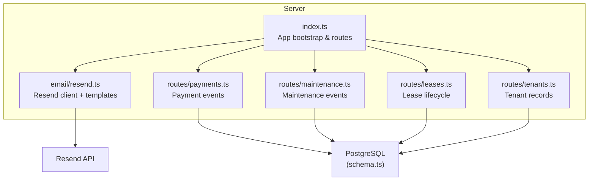
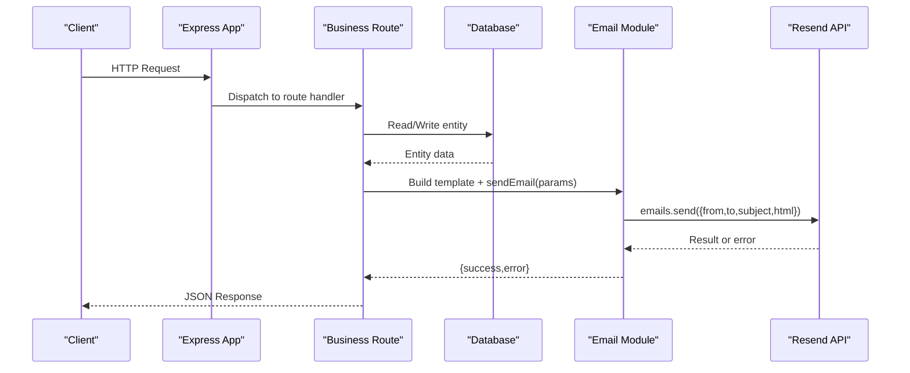
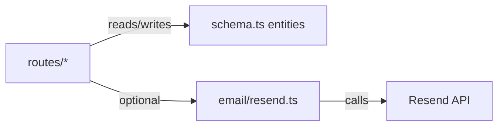

# Email Integration

<cite>
**Referenced Files in This Document**
- [resend.ts](file://server/src/email/resend.ts)
- [schema.ts](file://server/src/db/schema.ts)
- [payments.ts](file://server/src/routes/payments.ts)
- [maintenance.ts](file://server/src/routes/maintenance.ts)
- [leases.ts](file://server/src/routes/leases.ts)
- [tenants.ts](file://server/src/routes/tenants.ts)
- [index.ts](file://server/src/index.ts)
- [docker-compose.yml](file://docker-compose.yml)
</cite>

## Table of Contents
1. [Introduction](#introduction)
2. [Project Structure](#project-structure)
3. [Core Components](#core-components)
4. [Architecture Overview](#architecture-overview)
5. [Detailed Component Analysis](#detailed-component-analysis)
6. [Dependency Analysis](#dependency-analysis)
7. [Performance Considerations](#performance-considerations)
8. [Troubleshooting Guide](#troubleshooting-guide)
9. [Conclusion](#conclusion)
10. [Appendices](#appendices)

## Introduction
This document explains how the application integrates email delivery using Resend, including configuration, template management, and sending workflows. It covers available email types (rent reminders, rent receipts, maintenance updates), how to personalize templates with tenant and property data, and where to integrate triggers for events such as payment processing and maintenance status changes. It also outlines error handling patterns, logging strategies, and guidance for scaling and monitoring email operations.

## Project Structure
The email integration is implemented on the server side:
- Email provider client and templates live in a dedicated module.
- Business routes handle domain events (payments, maintenance, leases, tenants).
- The application loads environment variables at startup and exposes API routes.
- Docker Compose defines environment variables for the email provider.

**Diagram sources**
- [index.ts:20-62](file://server/src/index.ts#L20-L62)
- [resend.ts:1-30](file://server/src/email/resend.ts#L1-L30)
- [payments.ts:103-126](file://server/src/routes/payments.ts#L103-L126)
- [maintenance.ts:57-90](file://server/src/routes/maintenance.ts#L57-L90)
- [leases.ts:88-136](file://server/src/routes/leases.ts#L88-L136)
- [tenants.ts:42-69](file://server/src/routes/tenants.ts#L42-L69)
- [schema.ts:228-325](file://server/src/db/schema.ts#L228-L325)

**Section sources**
- [index.ts:20-62](file://server/src/index.ts#L20-L62)
- [docker-compose.yml:20-46](file://docker-compose.yml#L20-L46)

## Core Components
- Email client and transport:
  - Initializes the Resend client from an environment variable and provides a sendEmail function that accepts recipient, subject, and HTML content. Errors are captured and returned as structured results.
- Email templates:
  - rentReminderEmail: Personalized reminder with tenant name, property, unit, amount, and due date.
  - rentReceiptEmail: Receipt with transaction details including method and paid date.
  - maintenanceUpdateEmail: Status update notification with human-friendly labels for request states.
- Configuration:
  - RESEND_API_KEY is provided via environment variables; the sender address is fixed in code.

Key responsibilities:
- Template functions produce HTML strings tailored to each event type.
- sendEmail encapsulates network calls to Resend and returns consistent success/failure outcomes.

**Section sources**
- [resend.ts:1-30](file://server/src/email/resend.ts#L1-L30)
- [resend.ts:34-112](file://server/src/email/resend.ts#L34-L112)
- [docker-compose.yml:29-35](file://docker-compose.yml#L29-L35)

## Architecture Overview
The email flow consists of three layers:
- Event layer: Routes detect business events (e.g., payment received, maintenance status changed).
- Service layer: Templates generate HTML and call sendEmail.
- Transport layer: Resend delivers the message.

**Diagram sources**
- [index.ts:20-62](file://server/src/index.ts#L20-L62)
- [resend.ts:7-30](file://server/src/email/resend.ts#L7-L30)
- [payments.ts:103-126](file://server/src/routes/payments.ts#L103-L126)
- [maintenance.ts:57-90](file://server/src/routes/maintenance.ts#L57-L90)

## Detailed Component Analysis

### Email Provider and Transport
- Initialization reads the API key from environment and sets a default fallback for development.
- sendEmail standardizes responses with a success flag and optional error string.
- All outgoing messages use a fixed sender identity.

Operational notes:
- Network errors and provider-level errors are caught and logged.
- The function is synchronous in terms of control flow but uses async I/O for delivery.

**Section sources**
- [resend.ts:1-30](file://server/src/email/resend.ts#L1-L30)
- [docker-compose.yml:29-35](file://docker-compose.yml#L29-L35)

### Email Templates and Personalization
- Rent Reminder:
  - Variables: tenantName, propertyName, unitNumber, amount, dueDate.
  - Use case: Notify tenants about upcoming rent due dates.
- Rent Receipt:
  - Variables: tenantName, propertyName, unitNumber, amount, paidDate, method.
  - Use case: Confirm receipt of payment and provide transaction summary.
- Maintenance Update:
  - Variables: tenantName, propertyName, requestTitle, status.
  - Uses friendly labels for statuses like acknowledged, in_progress, completed.

Customization guidance:
- Update styles inline within templates to match branding.
- Extend parameters to include additional context (e.g., lease number, invoice link).

**Section sources**
- [resend.ts:34-112](file://server/src/email/resend.ts#L34-L112)

### Triggering Emails for Events

#### Payment Processing
- When recording or updating payments, you can trigger a receipt email by building the receipt template and calling sendEmail with tenant and payment details.
- Relevant fields for personalization come from the payment record and associated unit/tenant.

Integration points:
- POST /api/payments creates a new payment.
- PUT /api/payments/:id updates payment status or marks as received.

**Section sources**
- [payments.ts:103-126](file://server/src/routes/payments.ts#L103-L126)
- [resend.ts:60-86](file://server/src/email/resend.ts#L60-L86)

#### Maintenance Request Updates
- On status transitions (acknowledged, in_progress, completed), build a maintenance update email and send it to the tenant.
- Use the status mapping to render friendly messages.

Integration points:
- PUT /api/maintenance/:id updates status and timestamps.

**Section sources**
- [maintenance.ts:69-90](file://server/src/routes/maintenance.ts#L69-L90)
- [resend.ts:88-112](file://server/src/email/resend.ts#L88-L112)

#### Lease Renewals and Expirations
- While no direct email trigger exists in the lease routes, you can add logic to:
  - Send renewal notices when leases approach expiration.
  - Notify tenants upon lease creation or termination.
- Use lease and tenant data to populate template variables.

Integration points:
- GET /api/leases/expiring identifies leases nearing expiration.
- POST /api/leases creates a lease and updates unit status.
- PUT /api/leases/:id may terminate or expire a lease.

**Section sources**
- [leases.ts:48-76](file://server/src/routes/leases.ts#L48-L76)
- [leases.ts:88-136](file://server/src/routes/leases.ts#L88-L136)

#### Tenant Notifications
- Tenants have an email field in the schema; use this to target notifications.
- You can create a general-purpose notification service that persists notifications and dispatches them via email.

Data model:
- Notification table supports multiple channels and statuses.

**Section sources**
- [schema.ts:228-245](file://server/src/db/schema.ts#L228-L245)
- [schema.ts:367-383](file://server/src/db/schema.ts#L367-L383)

### Error Handling and Logging
- sendEmail returns a structured result with success and optional error.
- Errors from the provider and exceptions are logged with a consistent prefix for easy filtering.
- Recommended enhancements:
  - Persist failed deliveries to the notification table with retry scheduling.
  - Add structured logging (timestamp, messageId if available, recipient, subject).

**Section sources**
- [resend.ts:7-30](file://server/src/email/resend.ts#L7-L30)
- [schema.ts:367-383](file://server/src/db/schema.ts#L367-L383)

### Data Models Relevant to Email
- Tenant: Contains contact information used for addressing emails.
- Payment: Provides transaction details for receipts.
- MaintenanceRequest: Drives status update notifications.
- Notification: Serves as a durable log and queue for multi-channel messaging.

**Section sources**
- [schema.ts:228-245](file://server/src/db/schema.ts#L228-L245)
- [schema.ts:268-289](file://server/src/db/schema.ts#L268-L289)
- [schema.ts:291-325](file://server/src/db/schema.ts#L291-L325)
- [schema.ts:367-383](file://server/src/db/schema.ts#L367-L383)

## Dependency Analysis
- The email module depends only on the Resend SDK and environment configuration.
- Routes depend on database models and can be extended to call the email module.
- The application bootstraps routes and middleware without tight coupling to email, enabling modular integration.

**Diagram sources**
- [index.ts:20-62](file://server/src/index.ts#L20-L62)
- [resend.ts:1-30](file://server/src/email/resend.ts#L1-L30)
- [schema.ts:137-383](file://server/src/db/schema.ts#L137-L383)

**Section sources**
- [index.ts:20-62](file://server/src/index.ts#L20-L62)
- [schema.ts:137-383](file://server/src/db/schema.ts#L137-L383)

## Performance Considerations
- Asynchronous delivery: sendEmail should be invoked asynchronously to avoid blocking request handlers.
- Batching: For high-volume events (e.g., monthly reminders), consider batching recipients and sending in parallel with rate limiting.
- Retries: Implement exponential backoff for transient failures and persist retries in the notification table.
- Observability: Capture metrics such as sent, failed, and delayed counts per template and route.

[No sources needed since this section provides general guidance]

## Troubleshooting Guide
Common issues and resolutions:
- Missing or invalid API key:
  - Ensure RESEND_API_KEY is set in the environment. In Docker Compose, it is mapped from host environment variables.
- Delivery failures:
  - Check logs for provider errors returned by sendEmail.
  - Validate recipient addresses and ensure they are not blocked by spam filters.
- Template rendering issues:
  - Verify all required variables are present before rendering.
  - Test HTML in an email client preview tool.

Operational tips:
- Centralize logging around sendEmail to capture inputs and outputs.
- Add health checks for the email subsystem by attempting a test send in non-production environments.

**Section sources**
- [resend.ts:7-30](file://server/src/email/resend.ts#L7-L30)
- [docker-compose.yml:29-35](file://docker-compose.yml#L29-L35)

## Conclusion
The email integration leverages a simple, robust pattern: template functions generate branded HTML, and a centralized sendEmail function handles delivery via Resend. Routes can be extended to trigger emails on key events like payments and maintenance updates. To scale and monitor effectively, introduce persistent notifications, retry mechanisms, structured logging, and metrics collection.

[No sources needed since this section summarizes without analyzing specific files]

## Appendices

### Environment Configuration
- RESEND_API_KEY: Required to authenticate with Resend.
- Other services (Twilio, Plaid) are configured similarly via environment variables.

**Section sources**
- [docker-compose.yml:29-41](file://docker-compose.yml#L29-L41)

### Example Event-to-Email Mapping
- New tenant registration: Not currently triggered; can be added to tenant creation flow.
- Payment received: Use rentReceiptEmail with payment details.
- Maintenance status change: Use maintenanceUpdateEmail with updated status.
- Lease renewal/expiry: Use a custom template or extend existing ones with lease-specific variables.

[No sources needed since this section provides conceptual guidance]