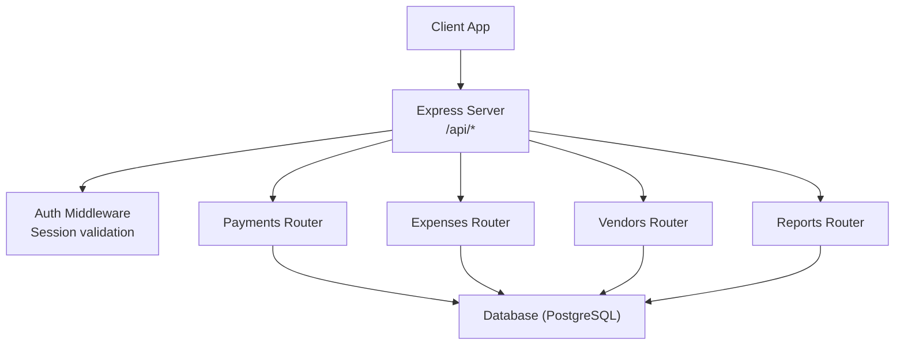
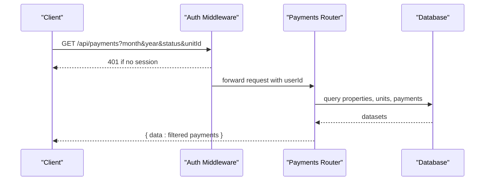
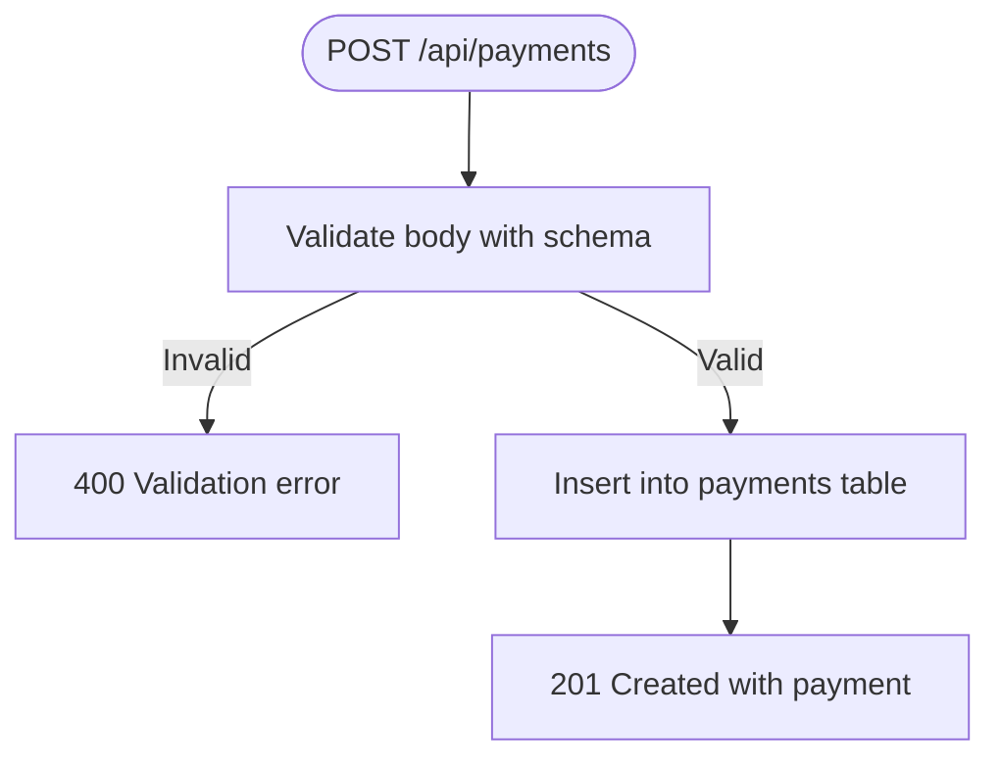
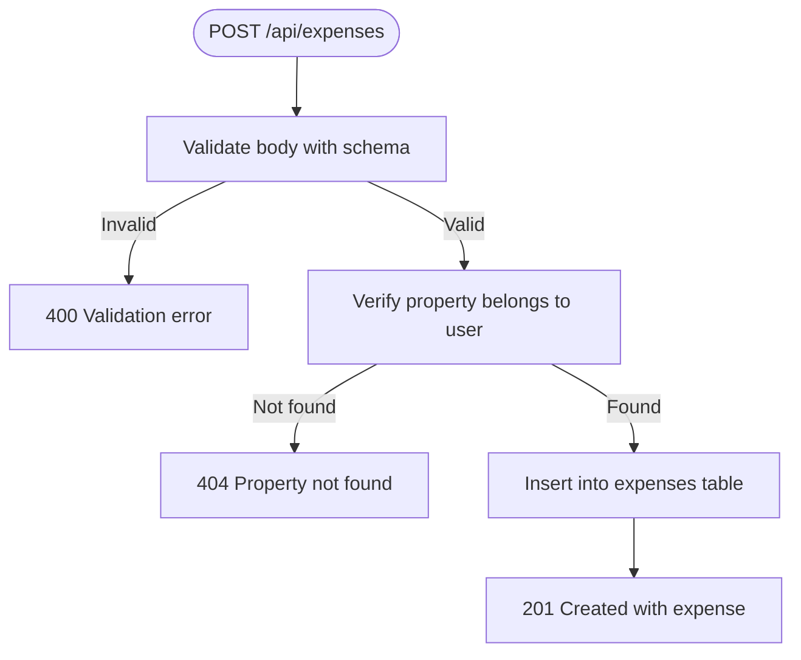
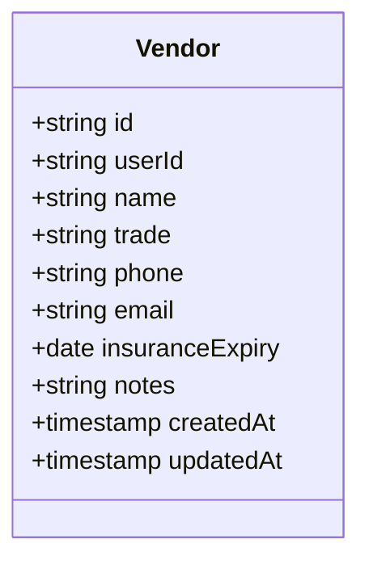
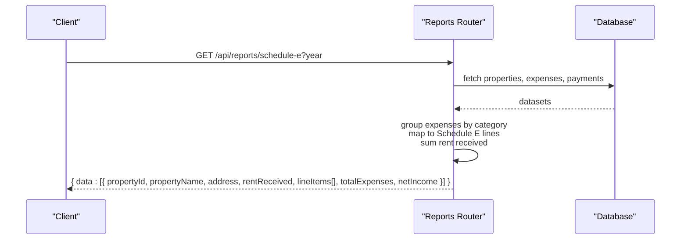
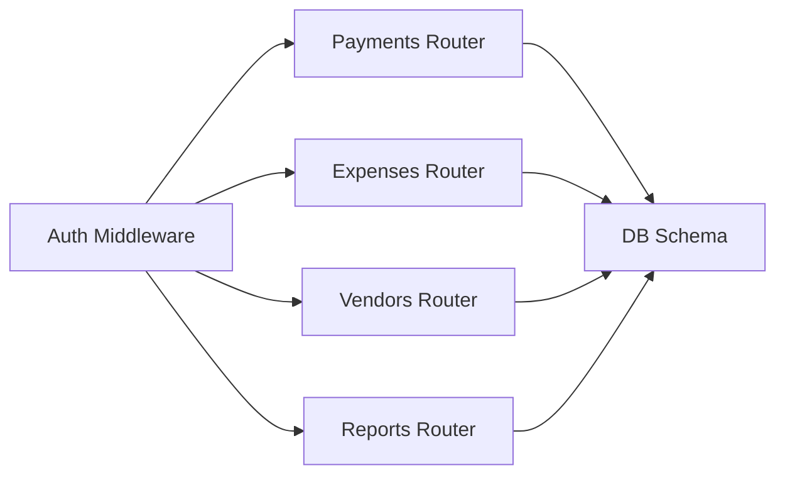

# Financial Management API

<cite>
**Referenced Files in This Document**
- [index.ts](file://server/src/index.ts)
- [middleware.ts](file://server/src/auth/middleware.ts)
- [schema.ts](file://server/src/db/schema.ts)
- [payments.ts](file://server/src/routes/payments.ts)
- [expenses.ts](file://server/src/routes/expenses.ts)
- [vendors.ts](file://server/src/routes/vendors.ts)
- [reports.ts](file://server/src/routes/reports.ts)
- [types.ts](file://shared/src/types.ts)
</cite>

## Table of Contents
1. Introduction
2. Project Structure
3. Core Components
4. Architecture Overview
5. Detailed Component Analysis
6. Dependency Analysis
7. Performance Considerations
8. Troubleshooting Guide
9. Conclusion
10. Appendices

## Introduction
This document provides detailed API documentation for financial management features: payments, expenses, and vendor management. It covers payment processing endpoints for rent collection, late fee handling, payment method support, and reconciliation fields; expense management for categorization, receipts, recurring expenses, and tax category mapping; and vendor management including directory creation, contact information, insurance tracking, and performance evaluation. It also includes examples of financial workflows and describes financial reporting data structures and integration points with accounting systems.

## Project Structure
The server exposes REST endpoints under /api grouped by feature. Authentication is enforced via middleware that validates sessions using Better-Auth. Data models are defined with Drizzle ORM against a PostgreSQL database.

**Diagram sources**
- [index.ts:20-62](file://server/src/index.ts#L20-L62)
- [middleware.ts:9-27](file://server/src/auth/middleware.ts#L9-L27)

**Section sources**
- [index.ts:20-62](file://server/src/index.ts#L20-L62)
- [middleware.ts:9-27](file://server/src/auth/middleware.ts#L9-L27)

## Core Components
- Payments: Create, list, update, delete payments; monthly summary; filtering by month/year/status/unit; supports multiple payment methods; tracks status and late fees; includes reconciliation field for matched transactions.
- Expenses: CRUD for expenses with property scoping; supports categories aligned to Schedule E; optional unit association; receipt URL; recurring flags and frequency; notes.
- Vendors: CRUD for vendors scoped to user; trade, contact info, insurance expiry, notes.
- Reports: Cash flow per property by month; Profit & Loss per property by year or quarter; Schedule E helper mapping expense categories to tax lines; totals and net income calculations.

**Section sources**
- [payments.ts:11-22](file://server/src/routes/payments.ts#L11-L22)
- [payments.ts:24-134](file://server/src/routes/payments.ts#L24-L134)
- [expenses.ts:11-28](file://server/src/routes/expenses.ts#L11-L28)
- [expenses.ts:30-103](file://server/src/routes/expenses.ts#L30-L103)
- [vendors.ts:11-18](file://server/src/routes/vendors.ts#L11-L18)
- [vendors.ts:20-68](file://server/src/routes/vendors.ts#L20-L68)
- [reports.ts:10-26](file://server/src/routes/reports.ts#L10-L26)
- [reports.ts:28-183](file://server/src/routes/reports.ts#L28-L183)

## Architecture Overview
All financial endpoints are protected by session-based authentication. Each router queries the database using Drizzle ORM and returns JSON responses. Reports aggregate payments and expenses across properties and units to produce financial summaries.

**Diagram sources**
- [middleware.ts:9-27](file://server/src/auth/middleware.ts#L9-L27)
- [payments.ts:24-59](file://server/src/routes/payments.ts#L24-L59)

## Detailed Component Analysis

### Payments API
- Base path: /api/payments
- Authentication: Required (session)
- Endpoints:
  - GET /api/payments
    - Query params: month, year, status, unitId
    - Filters payments by user’s properties and units; supports month/year and status filters
    - Response: { data: Payment[] }
  - GET /api/payments/summary
    - Query params: month, year (defaults to current)
    - Computes total expected, collected, outstanding, collection rate, counts by status
    - Response: { data: Summary }
  - POST /api/payments
    - Body: unitId, tenantId, amount, amountPaid (default 0), dueDate, paidDate (optional), method (enum), status (default pending), lateFee (default 0), notes (optional)
    - Validates input; creates payment; returns created record
  - PUT /api/payments/:id
    - Partial update of payment fields; updates updatedAt
  - DELETE /api/payments/:id
    - Deletes payment if exists

- Payment methods supported: cash, check, zelle, venmo, ach, card, bank_transfer, other
- Statuses: pending, received, late, partial
- Late fee: tracked per payment
- Reconciliation: matchedTransactionId field available on payment model for linking external transactions

**Diagram sources**
- [payments.ts:103-110](file://server/src/routes/payments.ts#L103-L110)

**Section sources**
- [payments.ts:11-22](file://server/src/routes/payments.ts#L11-L22)
- [payments.ts:24-134](file://server/src/routes/payments.ts#L24-L134)
- [schema.ts:270-289](file://server/src/db/schema.ts#L270-L289)
- [types.ts:70-90](file://shared/src/types.ts#L70-L90)

### Expenses API
- Base path: /api/expenses
- Authentication: Required (session)
- Endpoints:
  - GET /api/expenses
    - Query params: propertyId, category, year, month
    - Filters expenses by user’s properties; supports category and date filters
    - Response: { data: Expense[] }
  - GET /api/expenses/:id
    - Returns single expense by id
  - POST /api/expenses
    - Body: propertyId, unitId (optional), category (Schedule E enum), description, amount, date, vendor (optional), receiptUrl (optional), isRecurring (default false), recurringFrequency (monthly/quarterly/annually, optional), notes (optional)
    - Verifies property ownership before insert
  - PUT /api/expenses/:id
    - Partial update; updates updatedAt
  - DELETE /api/expenses/:id
    - Deletes expense if exists

- Categories align to Schedule E lines for tax reporting
- Receipts: receiptUrl stored for audit and attachments
- Recurring: isRecurring and recurringFrequency enable planning and automation hooks

**Diagram sources**
- [expenses.ts:65-79](file://server/src/routes/expenses.ts#L65-L79)

**Section sources**
- [expenses.ts:11-28](file://server/src/routes/expenses.ts#L11-L28)
- [expenses.ts:30-103](file://server/src/routes/expenses.ts#L30-L103)
- [schema.ts:329-348](file://server/src/db/schema.ts#L329-L348)
- [types.ts:116-149](file://shared/src/types.ts#L116-L149)

### Vendors API
- Base path: /api/vendors
- Authentication: Required (session)
- Endpoints:
  - GET /api/vendors
    - Lists vendors owned by user, sorted by name
  - POST /api/vendors
    - Body: name, trade, phone (optional), email (optional, validated), insuranceExpiry (optional), notes (optional)
  - PUT /api/vendors/:id
    - Partial update; updates updatedAt
  - DELETE /api/vendors/:id
    - Deletes vendor if owned by user

- Insurance tracking: insuranceExpiry enables compliance alerts
- Contact info: phone/email for communication
- Notes: free-form context for relationships

**Diagram sources**
- [schema.ts:352-365](file://server/src/db/schema.ts#L352-L365)

**Section sources**
- [vendors.ts:11-18](file://server/src/routes/vendors.ts#L11-L18)
- [vendors.ts:20-68](file://server/src/routes/vendors.ts#L20-L68)
- [schema.ts:352-365](file://server/src/db/schema.ts#L352-L365)
- [types.ts:151-164](file://shared/src/types.ts#L151-L164)

### Reports API
- Base path: /api/reports
- Authentication: Required (session)
- Endpoints:
  - GET /api/reports/cashflow
    - Query param: year (defaults to current)
    - Returns monthly income, expenses, net per property
  - GET /api/reports/schedule-e
    - Query param: year (defaults to current)
    - Aggregates expenses by category mapped to Schedule E lines; computes rent received and net income per property
  - GET /api/reports/pnl
    - Query params: year (defaults to current), quarter (optional)
    - Returns profit & loss per property for year or quarter

- Schedule E mapping: predefined mapping from expense categories to IRS line numbers and descriptions
- Integration points: outputs structured data suitable for export to accounting systems (CSV/JSON)

**Diagram sources**
- [reports.ts:79-129](file://server/src/routes/reports.ts#L79-L129)

**Section sources**
- [reports.ts:10-26](file://server/src/routes/reports.ts#L10-L26)
- [reports.ts:28-183](file://server/src/routes/reports.ts#L28-L183)
- [schema.ts:73-88](file://server/src/db/schema.ts#L73-L88)
- [types.ts:219-234](file://shared/src/types.ts#L219-L234)

## Dependency Analysis
- Authentication dependency: All financial routers depend on authMiddleware to enforce session-based access control.
- Database dependencies:
  - Payments depend on property, unit, tenant tables for scoping and relationships.
  - Expenses depend on property and optionally unit tables.
  - Vendors are scoped to user.
  - Reports aggregate across property, unit, payment, and expense tables.
- External integrations:
  - Reconciliation: matchedTransactionId on payment can link to external transaction IDs for accounting system sync.
  - Accounting exports: reports provide structured data for Schedule E and P&L, enabling CSV/JSON export to accounting software.

**Diagram sources**
- [index.ts:20-62](file://server/src/index.ts#L20-L62)
- [middleware.ts:9-27](file://server/src/auth/middleware.ts#L9-L27)
- [schema.ts:189-403](file://server/src/db/schema.ts#L189-L403)

**Section sources**
- [index.ts:20-62](file://server/src/index.ts#L20-L62)
- [middleware.ts:9-27](file://server/src/auth/middleware.ts#L9-L27)
- [schema.ts:189-403](file://server/src/db/schema.ts#L189-L403)

## Performance Considerations
- Filtering in-memory: Current implementations load full datasets then filter client-side; for large portfolios, consider server-side pagination and indexed queries on dates and foreign keys.
- Aggregation efficiency: Reports compute aggregates in memory; consider materialized views or precomputed monthly aggregates for high-volume scenarios.
- Indexing recommendations:
  - payment.dueDate, payment.paidDate
  - expense.date
  - property.userId, unit.propertyId
  - vendor.userId
- Connection pooling and query batching: Ensure DB connection pool sizing matches workload; batch reads where possible.

[No sources needed since this section provides general guidance]

## Troubleshooting Guide
- Unauthorized errors: Ensure valid session headers are sent; verify auth middleware configuration and CORS settings.
- Validation errors: Check request payloads against schemas; ensure enums match allowed values.
- Not found errors: Verify resource existence and ownership checks (e.g., property ownership for expenses).
- Date parsing issues: Confirm date formats used in dueDate/date fields; ensure timezone consistency.
- Reconciliation mismatches: Use matchedTransactionId to link external transactions; validate IDs in accounting systems.

**Section sources**
- [middleware.ts:9-27](file://server/src/auth/middleware.ts#L9-L27)
- [payments.ts:103-134](file://server/src/routes/payments.ts#L103-L134)
- [expenses.ts:65-103](file://server/src/routes/expenses.ts#L65-L103)

## Conclusion
The Financial Management API provides comprehensive capabilities for managing payments, expenses, and vendors with robust authentication, validation, and reporting. Payments support multiple methods, status tracking, late fees, and reconciliation fields. Expenses include Schedule E-aligned categories, receipts, and recurring flags. Vendors capture essential contact and compliance data. Reports deliver cash flow, P&L, and Schedule E mappings to support accounting integration and tax preparation.

[No sources needed since this section summarizes without analyzing specific files]

## Appendices

### Example Workflows

- Processing rent payments
  - Create a payment record with unitId, tenantId, amount, dueDate, and method.
  - Update status to received and set amountPaid when funds are collected; optionally set paidDate and lateFee.
  - Use /api/payments/summary to track monthly collection metrics.

- Recording maintenance expenses
  - Create an expense with propertyId, category (e.g., repairs), amount, date, vendor, and receiptUrl.
  - Mark isRecurring and recurringFrequency if applicable for planning.
  - Use /api/expenses to filter by category and date for reporting.

- Managing vendor relationships
  - Create a vendor with name, trade, contact info, and insuranceExpiry.
  - Update details as needed; use notes to capture performance evaluations and history.
  - Reference vendorId in maintenance requests to associate costs and performance.

**Section sources**
- [payments.ts:103-134](file://server/src/routes/payments.ts#L103-L134)
- [expenses.ts:65-103](file://server/src/routes/expenses.ts#L65-L103)
- [vendors.ts:30-68](file://server/src/routes/vendors.ts#L30-L68)

### Data Models and Types

- Payment fields include amount, amountPaid, dueDate, paidDate, method, status, lateFee, notes, matchedTransactionId.
- Expense fields include propertyId, unitId, category, description, amount, date, vendor, receiptUrl, isRecurring, recurringFrequency, notes.
- Vendor fields include name, trade, phone, email, insuranceExpiry, notes.
- Report types include CashFlowEntry, PropertyReport, ScheduleEEntry.

**Section sources**
- [schema.ts:270-289](file://server/src/db/schema.ts#L270-L289)
- [schema.ts:329-348](file://server/src/db/schema.ts#L329-L348)
- [schema.ts:352-365](file://server/src/db/schema.ts#L352-L365)
- [types.ts:70-90](file://shared/src/types.ts#L70-L90)
- [types.ts:116-149](file://shared/src/types.ts#L116-L149)
- [types.ts:151-164](file://shared/src/types.ts#L151-L164)
- [types.ts:212-234](file://shared/src/types.ts#L212-L234)