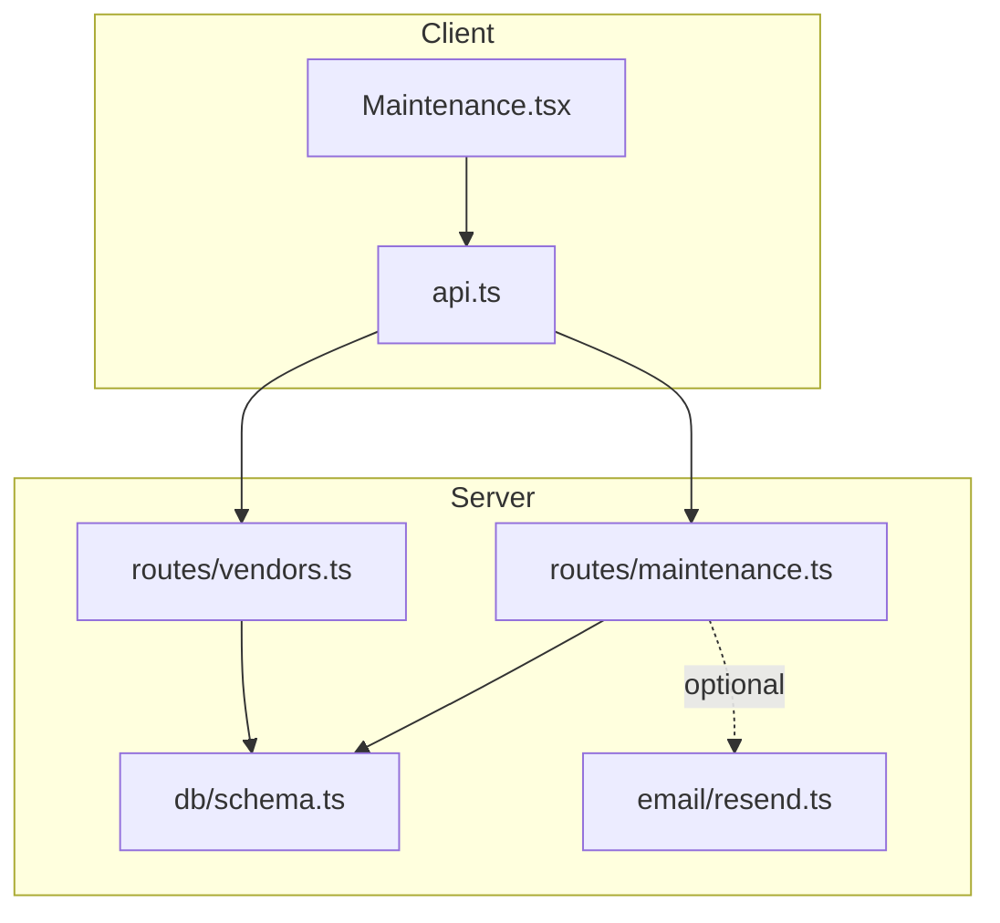
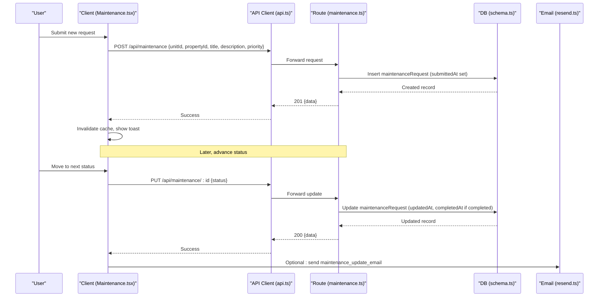
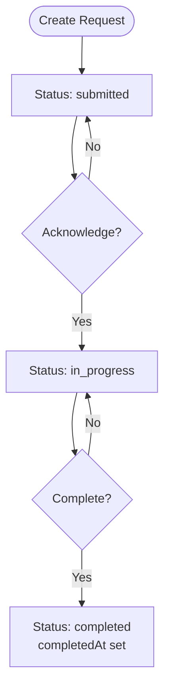
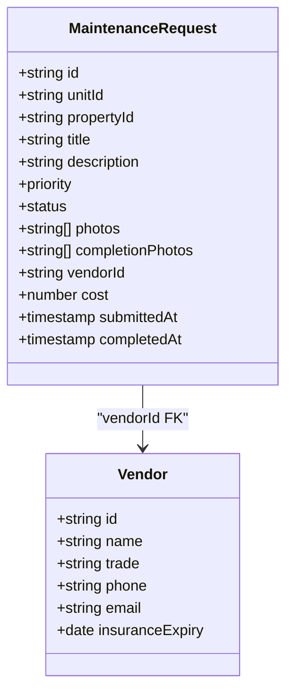
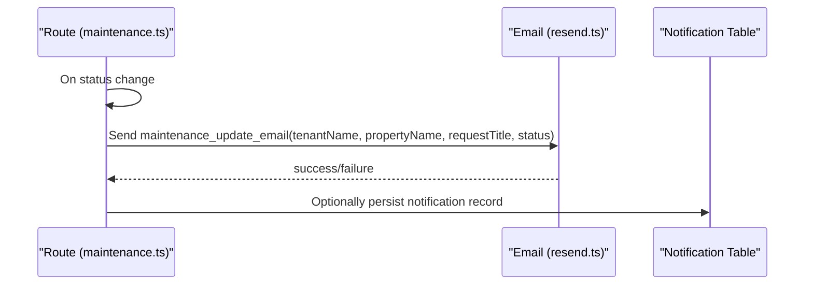
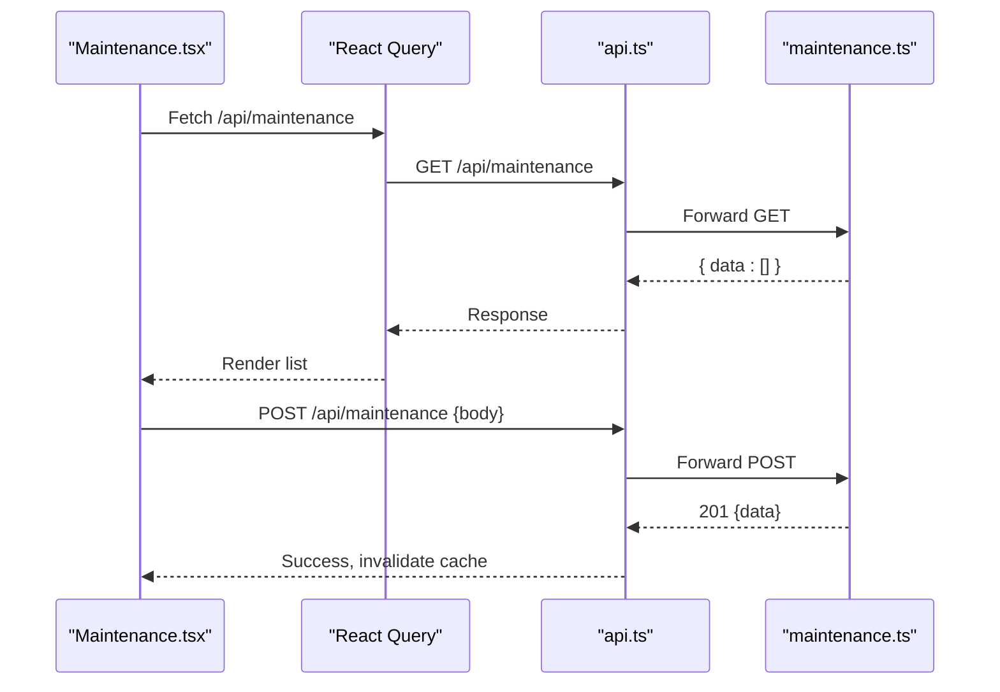
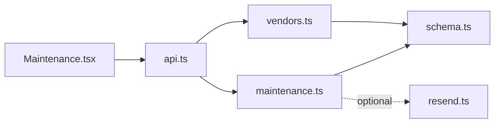

# Maintenance API

<cite>
**Referenced Files in This Document**
- [maintenance.ts](file://server/src/routes/maintenance.ts)
- [schema.ts](file://server/src/db/schema.ts)
- [vendors.ts](file://server/src/routes/vendors.ts)
- [resend.ts](file://server/src/email/resend.ts)
- [Maintenance.tsx](file://client/src/pages/Maintenance.tsx)
- [api.ts](file://client/src/lib/api.ts)
- [types.ts](file://shared/src/types.ts)
</cite>

## Table of Contents
1. [Introduction](#introduction)
2. [Project Structure](#project-structure)
3. [Core Components](#core-components)
4. [Architecture Overview](#architecture-overview)
5. [Detailed Component Analysis](#detailed-component-analysis)
6. [Dependency Analysis](#dependency-analysis)
7. [Performance Considerations](#performance-considerations)
8. [Troubleshooting Guide](#troubleshooting-guide)
9. [Conclusion](#conclusion)
10. [Appendices](#appendices)

## Introduction
This document provides comprehensive API documentation for maintenance request management in the application. It covers the full lifecycle from submission to completion, including priority assignment, vendor assignment, progress tracking, cost tracking, and notifications. It also explains categories, priorities, status transitions, and how to integrate with external scheduling tools and generate reports.

## Project Structure
The maintenance feature spans server routes, database schema, client UI, shared types, and email templates:
- Server routes define REST endpoints for creating, reading, updating, and deleting maintenance requests and vendors.
- Database schema defines enums and tables for maintenance requests, vendors, properties, units, tenants, and notifications.
- Client pages provide a Kanban-style interface to create and manage maintenance requests.
- Shared types define TypeScript interfaces for maintenance entities.
- Email module includes templates for maintenance updates.

**Diagram sources**
- [maintenance.ts:1-103](file://server/src/routes/maintenance.ts#L1-L103)
- [vendors.ts:1-71](file://server/src/routes/vendors.ts#L1-L71)
- [schema.ts:291-325](file://server/src/db/schema.ts#L291-L325)
- [resend.ts:88-112](file://server/src/email/resend.ts#L88-L112)
- [Maintenance.tsx:61-106](file://client/src/pages/Maintenance.tsx#L61-L106)
- [api.ts:26-54](file://client/src/lib/api.ts#L26-L54)

**Section sources**
- [maintenance.ts:1-103](file://server/src/routes/maintenance.ts#L1-L103)
- [schema.ts:291-325](file://server/src/db/schema.ts#L291-L325)
- [Maintenance.tsx:61-106](file://client/src/pages/Maintenance.tsx#L61-L106)
- [api.ts:26-54](file://client/src/lib/api.ts#L26-L54)

## Core Components
- Maintenance Request CRUD: Create, read (list/detail), update (status, photos, cost, vendor), delete.
- Vendor Management: Create, read, update, delete vendors scoped by user.
- Data Model: Enums for priority/status, tables linking maintenance to property/unit/tenant/vendor, timestamps for history.
- Notifications: Email template for maintenance updates; notification table exists for future use.
- Client UI: Kanban board with filters, creation modal, and status advancement.

Key responsibilities:
- Route handlers validate inputs, enforce ownership filtering, and persist changes.
- Schema defines strict enums and relationships ensuring data integrity.
- Client composes queries and mutations using a centralized API client.

**Section sources**
- [maintenance.ts:11-23](file://server/src/routes/maintenance.ts#L11-L23)
- [schema.ts:60-71](file://server/src/db/schema.ts#L60-L71)
- [schema.ts:291-325](file://server/src/db/schema.ts#L291-L325)
- [vendors.ts:11-18](file://server/src/routes/vendors.ts#L11-L18)
- [types.ts:94-114](file://shared/src/types.ts#L94-L114)

## Architecture Overview
The maintenance workflow is driven by REST APIs and persisted via Drizzle ORM. The client uses React Query to fetch and mutate data. Status transitions are enforced by route logic and schema enums.

**Diagram sources**
- [maintenance.ts:57-90](file://server/src/routes/maintenance.ts#L57-L90)
- [schema.ts:291-325](file://server/src/db/schema.ts#L291-L325)
- [resend.ts:88-112](file://server/src/email/resend.ts#L88-L112)
- [Maintenance.tsx:82-106](file://client/src/pages/Maintenance.tsx#L82-L106)
- [api.ts:26-54](file://client/src/lib/api.ts#L26-L54)

## Detailed Component Analysis

### API Endpoints
- GET /api/maintenance
  - Purpose: List maintenance requests filtered by user-owned properties; supports query params status and priority.
  - Response: Array of maintenance requests with unit and tenant relations.
  - Notes: Filters results to only those belonging to properties owned by the authenticated user.

- GET /api/maintenance/:id
  - Purpose: Retrieve a single maintenance request with unit, tenant, and vendor relations.
  - Response: Single maintenance request object or 404.

- POST /api/maintenance
  - Purpose: Create a new maintenance request.
  - Body: unitId, propertyId, tenantId (optional), title, description, priority (default routine), status (default submitted), photos (array), completionPhotos (array), vendorId (optional), cost (optional).
  - Behavior: Sets submittedAt timestamp on creation. Returns created record.

- PUT /api/maintenance/:id
  - Purpose: Update fields such as status, photos, completionPhotos, vendorId, cost.
  - Behavior: Updates updatedAt; sets completedAt when status becomes completed.

- DELETE /api/maintenance/:id
  - Purpose: Delete a maintenance request.
  - Behavior: Returns 404 if not found.

- GET /api/vendors
- POST /api/vendors
- PUT /api/vendors/:id
- DELETE /api/vendors/:id
  - Purpose: Manage vendors scoped to the authenticated user.

**Section sources**
- [maintenance.ts:25-100](file://server/src/routes/maintenance.ts#L25-L100)
- [vendors.ts:20-68](file://server/src/routes/vendors.ts#L20-L68)

### Data Model and Types
- Priority levels: emergency, urgent, routine.
- Status transitions: submitted → acknowledged → in_progress → completed.
- MaintenanceRequest fields include unitId, propertyId, tenantId, title, description, priority, status, photos, completionPhotos, vendorId, cost, submittedAt, completedAt, createdAt, updatedAt.
- Vendor fields include name, trade, phone, email, insuranceExpiry, notes.
- Notification table exists with type maintenance_update for future integration.

**Section sources**
- [schema.ts:60-71](file://server/src/db/schema.ts#L60-L71)
- [schema.ts:291-325](file://server/src/db/schema.ts#L291-L325)
- [schema.ts:350-365](file://server/src/db/schema.ts#L350-L365)
- [schema.ts:367-383](file://server/src/db/schema.ts#L367-L383)
- [types.ts:94-114](file://shared/src/types.ts#L94-L114)
- [types.ts:153-164](file://shared/src/types.ts#L153-L164)

### Status Transitions and Workflow
- Default status on creation is submitted.
- Next status mapping: submitted → acknowledged → in_progress → completed.
- When status is updated to completed, completedAt is automatically set.
- The client exposes “Move to next status” actions aligned with this mapping.

**Diagram sources**
- [maintenance.ts:57-90](file://server/src/routes/maintenance.ts#L57-L90)
- [Maintenance.tsx:47-51](file://client/src/pages/Maintenance.tsx#L47-L51)

**Section sources**
- [maintenance.ts:57-90](file://server/src/routes/maintenance.ts#L57-L90)
- [Maintenance.tsx:47-51](file://client/src/pages/Maintenance.tsx#L47-L51)

### Vendor Assignment Logic
- Vendors are managed per user and can be assigned to maintenance requests via vendorId.
- Assignment is a simple field update on the maintenance request; no automatic selection logic is implemented in the current codebase.
- Cost tracking is stored directly on the maintenance request as cost.

**Diagram sources**
- [schema.ts:291-325](file://server/src/db/schema.ts#L291-L325)
- [schema.ts:350-365](file://server/src/db/schema.ts#L350-L365)

**Section sources**
- [schema.ts:291-325](file://server/src/db/schema.ts#L291-L325)
- [schema.ts:350-365](file://server/src/db/schema.ts#L350-L365)
- [vendors.ts:20-68](file://server/src/routes/vendors.ts#L20-L68)

### Cost Tracking and History
- Cost is an optional numeric field on maintenance requests.
- Timestamps (submittedAt, completedAt, createdAt, updatedAt) provide a basic audit trail for request lifecycle.
- Photos and completionPhotos allow visual evidence of work done.

**Section sources**
- [schema.ts:291-325](file://server/src/db/schema.ts#L291-L325)
- [maintenance.ts:57-90](file://server/src/routes/maintenance.ts#L57-L90)

### Notification System
- An email template for maintenance updates exists, supporting tenant notifications when status changes.
- The notification table supports multiple channels and types, enabling future expansion beyond email.
- Current route handlers do not trigger emails automatically; integration points exist for adding notifications on status changes.

**Diagram sources**
- [resend.ts:88-112](file://server/src/email/resend.ts#L88-L112)
- [schema.ts:367-383](file://server/src/db/schema.ts#L367-L383)

**Section sources**
- [resend.ts:88-112](file://server/src/email/resend.ts#L88-L112)
- [schema.ts:367-383](file://server/src/db/schema.ts#L367-L383)

### Client Integration and UI Flow
- The Maintenance page lists requests, groups them by status, and allows advancing status via PUT calls.
- Creation form collects property, unit, title, description, and priority; submits via POST.
- The API client handles authentication redirects and error parsing.

**Diagram sources**
- [Maintenance.tsx:67-106](file://client/src/pages/Maintenance.tsx#L67-L106)
- [api.ts:26-54](file://client/src/lib/api.ts#L26-L54)
- [maintenance.ts:25-67](file://server/src/routes/maintenance.ts#L25-L67)

**Section sources**
- [Maintenance.tsx:61-106](file://client/src/pages/Maintenance.tsx#L61-L106)
- [api.ts:26-54](file://client/src/lib/api.ts#L26-L54)

## Dependency Analysis
- Routes depend on Drizzle ORM models defined in schema.ts.
- Maintenance routes filter results based on user-owned properties.
- Vendor routes scope operations to the authenticated user.
- Email module is decoupled and can be invoked by routes or background jobs.

**Diagram sources**
- [maintenance.ts:1-103](file://server/src/routes/maintenance.ts#L1-L103)
- [vendors.ts:1-71](file://server/src/routes/vendors.ts#L1-L71)
- [schema.ts:291-325](file://server/src/db/schema.ts#L291-L325)
- [resend.ts:1-30](file://server/src/email/resend.ts#L1-L30)
- [Maintenance.tsx:61-106](file://client/src/pages/Maintenance.tsx#L61-L106)
- [api.ts:26-54](file://client/src/lib/api.ts#L26-L54)

**Section sources**
- [maintenance.ts:1-103](file://server/src/routes/maintenance.ts#L1-L103)
- [vendors.ts:1-71](file://server/src/routes/vendors.ts#L1-L71)
- [schema.ts:291-325](file://server/src/db/schema.ts#L291-L325)

## Performance Considerations
- Filtering by user-owned properties occurs in memory after fetching all maintenance requests; consider server-side filtering for large datasets.
- Use query parameters status and priority to reduce client-side processing.
- Avoid unnecessary re-renders by leveraging React Query invalidation only on successful mutations.
- For high-volume environments, implement pagination and server-side sorting/filtering on list endpoints.

[No sources needed since this section provides general guidance]

## Troubleshooting Guide
Common issues and resolutions:
- Validation errors: Ensure required fields (title, description, unitId, propertyId) are provided; check Zod validation details in responses.
- Not found errors: Verify IDs exist before attempting updates or deletions.
- Unauthorized: The client redirects to login on 401; ensure sessions are valid.
- Email failures: Check Resend configuration and handle failure responses gracefully.

Operational checks:
- Confirm auth middleware protects routes.
- Validate that user has access to listed properties when retrieving maintenance requests.
- Ensure timestamps are set correctly on create/update operations.

**Section sources**
- [maintenance.ts:57-100](file://server/src/routes/maintenance.ts#L57-L100)
- [api.ts:39-51](file://client/src/lib/api.ts#L39-L51)
- [resend.ts:12-29](file://server/src/email/resend.ts#L12-L29)

## Conclusion
The maintenance API provides a robust foundation for managing maintenance requests with clear status transitions, vendor assignment, cost tracking, and notification templates. While the current implementation focuses on core CRUD and status updates, it is structured to support extensions such as automated notifications, advanced reporting, and integrations with external scheduling systems.

[No sources needed since this section summarizes without analyzing specific files]

## Appendices

### Common Maintenance Scenarios
- Emergency repairs: Set priority to emergency; fast-track acknowledgment and in_progress; notify tenant upon status changes.
- Scheduled maintenance: Create routine requests with planned dates; track completion and costs; attach completion photos.
- Routine upkeep: Use routine priority; batch updates for multiple units; export related expenses for reporting.

[No sources needed since this section provides conceptual guidance]

### Integrating with External Scheduling Tools
- Use vendorId and cost fields to link maintenance requests to external job records.
- On status changes, call external scheduling APIs to sync job states.
- Persist external job IDs in notes or custom fields if needed.

[No sources needed since this section provides conceptual guidance]

### Generating Maintenance Reports
- Export CSV from the Reports page for financial data; extend to include maintenance metrics (counts by priority, average resolution time).
- Aggregate maintenance costs per property/unit for expense categorization.
- Use timestamps to compute SLA metrics (time from submitted to completed).

[No sources needed since this section provides conceptual guidance]