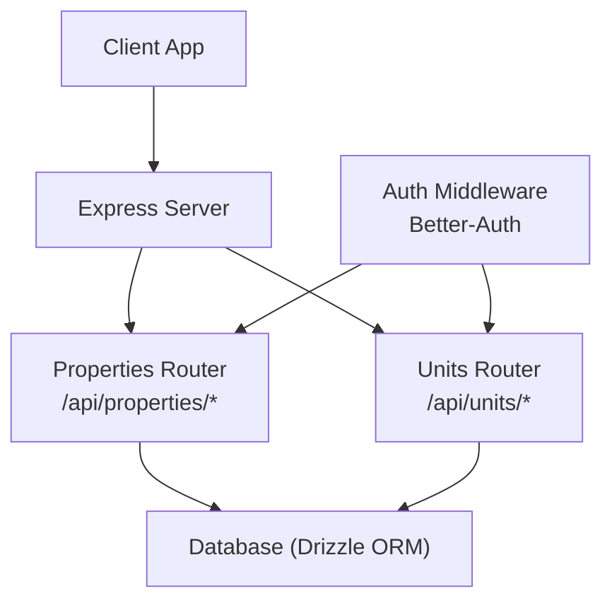
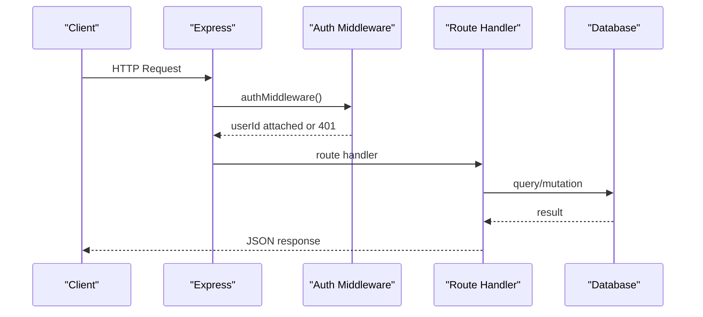
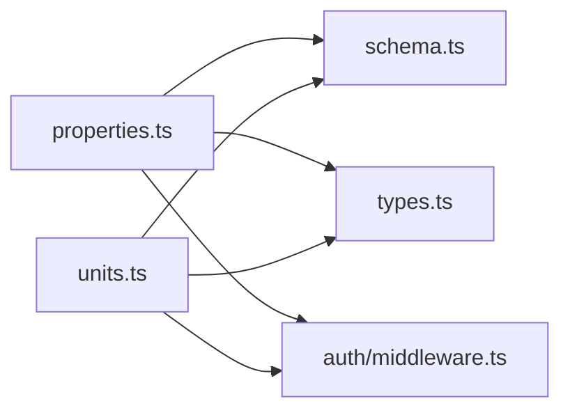

# Properties API

<cite>
**Referenced Files in This Document**
- [index.ts](file://server/src/index.ts)
- [middleware.ts](file://server/src/auth/middleware.ts)
- [properties.ts](file://server/src/routes/properties.ts)
- [units.ts](file://server/src/routes/units.ts)
- [schema.ts](file://server/src/db/schema.ts)
- [types.ts](file://shared/src/types.ts)
</cite>

## Table of Contents
1. [Introduction](#introduction)
2. [Project Structure](#project-structure)
3. [Core Components](#core-components)
4. [Architecture Overview](#architecture-overview)
5. [Detailed Component Analysis](#detailed-component-analysis)
6. [Dependency Analysis](#dependency-analysis)
7. [Performance Considerations](#performance-considerations)
8. [Troubleshooting Guide](#troubleshooting-guide)
9. [Conclusion](#conclusion)
10. [Appendices](#appendices)

## Introduction
This document provides detailed API documentation for property and unit management endpoints. It covers CRUD operations for properties (create, read, update, delete), retrieval with filtering and pagination notes, and full unit lifecycle management (add, configure, update, delete). It also explains property status management, unit occupancy tracking, request/response schemas, validation rules, business logic constraints, and common workflows such as creating a new property with multiple units and managing unit availability.

## Project Structure
The server exposes REST endpoints under /api. Property and unit routes are mounted centrally and protected by authentication middleware. Database schema defines entities and enums used across the API. Shared types define client-facing contracts.

**Diagram sources**
- [index.ts:53-62](file://server/src/index.ts#L53-L62)
- [middleware.ts:9-27](file://server/src/auth/middleware.ts#L9-L27)
- [properties.ts:1-106](file://server/src/routes/properties.ts#L1-L106)
- [units.ts:1-123](file://server/src/routes/units.ts#L1-L123)

**Section sources**
- [index.ts:34-62](file://server/src/index.ts#L34-L62)
- [middleware.ts:9-27](file://server/src/auth/middleware.ts#L9-L27)

## Core Components
- Authentication: All property and unit endpoints require an authenticated session via Better-Auth middleware. Unauthorized requests receive a 401 response.
- Validation: Request bodies are validated using Zod schemas before database writes. Invalid payloads return 400 with structured error details.
- Data models: Property and Unit entities are defined in the database schema with specific enums for statuses and types. Shared TypeScript types mirror these structures for clients.

Key responsibilities:
- Properties router: Create, list, get, update, delete properties; auto-create units based on unitCount during creation.
- Units router: List units (optionally filtered by propertyId), get, create, update, delete units; enforce ownership checks against user’s properties.

**Section sources**
- [properties.ts:11-23](file://server/src/routes/properties.ts#L11-L23)
- [units.ts:11-21](file://server/src/routes/units.ts#L11-L21)
- [schema.ts:191-226](file://server/src/db/schema.ts#L191-L226)
- [types.ts:7-36](file://shared/src/types.ts#L7-L36)

## Architecture Overview
The API follows a standard layered architecture:
- HTTP layer (Express) mounts routers under /api.
- Route handlers validate inputs, enforce authorization, and interact with the database via Drizzle ORM.
- Schema-driven data model ensures consistent types and constraints.

**Diagram sources**
- [index.ts:53-62](file://server/src/index.ts#L53-L62)
- [middleware.ts:9-27](file://server/src/auth/middleware.ts#L9-L27)
- [properties.ts:26-103](file://server/src/routes/properties.ts#L26-L103)
- [units.ts:24-120](file://server/src/routes/units.ts#L24-L120)

## Detailed Component Analysis

### Properties API
Base path: /api/properties
Authentication: Required (session-based via Better-Auth)

- GET /api/properties
  - Purpose: List all properties owned by the authenticated user, including associated units.
  - Response: Array of properties with nested units.
  - Notes: Results are ordered by creation date descending. No explicit pagination parameters are implemented in this endpoint.

- GET /api/properties/:id
  - Purpose: Retrieve a single property by ID if it belongs to the authenticated user.
  - Response: Single property object with units included.
  - Error: 404 if not found or not owned.

- POST /api/properties
  - Purpose: Create a new property.
  - Request body fields:
    - name: string, required
    - address: string, required
    - city: string, required
    - state: string, required
    - zip: string, required
    - type: enum ["single_family", "duplex", "multifamily", "condo", "townhouse"], required
    - unitCount: number, integer, minimum 1, default 1
    - status: enum ["active", "vacant", "under_renovation"], default "active"
    - notes: string, optional, nullable
  - Business logic:
    - On successful creation, the system auto-creates N units where N equals unitCount. Each auto-created unit has:
      - propertyId set to the new property
      - unitNumber starting from "1" incrementing
      - rentAmount set to 0
      - status set to "vacant"
  - Response: Created property object.
  - Errors: 400 for validation errors; 401 if unauthorized.

- PUT /api/properties/:id
  - Purpose: Update an existing property owned by the authenticated user.
  - Request body: Partial of the create schema (all fields optional).
  - Behavior: Updates provided fields and sets updatedAt timestamp.
  - Response: Updated property object.
  - Errors: 400 for validation; 404 if not found or not owned.

- DELETE /api/properties/:id
  - Purpose: Delete a property owned by the authenticated user.
  - Behavior: Deletes the property record.
  - Response: Success message.
  - Errors: 404 if not found or not owned.

Validation and constraints:
- Property type and status are strictly validated against enums.
- unitCount must be a positive integer when provided.
- Ownership is enforced by matching userId to the property.

Property status management:
- active: Property is currently active and available for leasing or management.
- vacant: Property has no occupied units at present.
- under_renovation: Property is undergoing maintenance or renovation.

Notes on filtering and pagination:
- The current implementation lists all properties for the user without query filters or pagination parameters. If needed, additional query parameters can be added to support filtering by status/type and pagination via page/pageSize.

Common workflow example: Creating a new property with multiple units
- Send POST /api/properties with unitCount > 1.
- System creates the property and automatically generates corresponding units with initial vacant status and zero rent.
- Subsequent updates can adjust unit numbers, rent amounts, and statuses.

**Section sources**
- [properties.ts:11-23](file://server/src/routes/properties.ts#L11-L23)
- [properties.ts:26-103](file://server/src/routes/properties.ts#L26-L103)
- [schema.ts:191-208](file://server/src/db/schema.ts#L191-L208)
- [types.ts:7-22](file://shared/src/types.ts#L7-L22)

### Units API
Base path: /api/units
Authentication: Required (session-based via Better-Auth)

- GET /api/units
  - Purpose: List units, optionally filtered by propertyId.
  - Query parameter:
    - propertyId: string (UUID), optional — returns only units belonging to the specified property.
  - Behavior:
    - If propertyId is provided, returns units for that property.
    - Otherwise, returns units belonging to properties owned by the authenticated user.
  - Response: Array of unit objects.
  - Notes: No explicit pagination parameters are implemented in this endpoint.

- GET /api/units/:id
  - Purpose: Retrieve a single unit by ID, including its parent property.
  - Authorization: Must belong to a property owned by the authenticated user.
  - Response: Unit object with nested property.
  - Error: 404 if not found or not owned.

- POST /api/units
  - Purpose: Create a new unit within a property owned by the authenticated user.
  - Request body fields:
    - propertyId: string (UUID), required
    - unitNumber: string, required, non-empty
    - rentAmount: number, minimum 0
    - status: enum ["occupied", "vacant", "under_renovation"], default "vacant"
    - bedrooms: number, optional, nullable
    - bathrooms: number, optional, nullable
    - notes: string, optional, nullable
  - Business logic:
    - Verifies that the property exists and belongs to the authenticated user.
  - Response: Created unit object.
  - Errors: 400 for validation; 404 if property not found or not owned; 401 if unauthorized.

- PUT /api/units/:id
  - Purpose: Update an existing unit owned by the authenticated user.
  - Request body: Partial of the create schema excluding propertyId.
  - Behavior: Updates provided fields and sets updatedAt timestamp.
  - Response: Updated unit object.
  - Errors: 400 for validation; 404 if not found or not owned.

- DELETE /api/units/:id
  - Purpose: Delete a unit owned by the authenticated user.
  - Behavior: Deletes the unit record.
  - Response: Success message.
  - Errors: 404 if not found or not owned.

Unit status and occupancy tracking:
- occupied: Unit is currently leased or occupied by a tenant.
- vacant: Unit is available for lease.
- under_renovation: Unit is temporarily unavailable due to maintenance or renovation.

Business logic constraints:
- Ownership enforcement: All unit operations verify that the unit’s property belongs to the authenticated user.
- Status transitions: While not enforced by the API, typical flows involve moving from vacant to occupied upon lease creation, and to under_renovation during maintenance.

Common workflow examples:
- Add a new unit to an existing property:
  - POST /api/units with propertyId, unitNumber, rentAmount, and desired status.
- Update unit configuration:
  - PUT /api/units/:id to change rentAmount, bedrooms, bathrooms, or status.
- Manage unit availability:
  - Set status to "occupied" when a tenant moves in; "vacant" when they move out; "under_renovation" during repairs.

**Section sources**
- [units.ts:11-21](file://server/src/routes/units.ts#L11-L21)
- [units.ts:24-120](file://server/src/routes/units.ts#L24-L120)
- [schema.ts:212-226](file://server/src/db/schema.ts#L212-L226)
- [types.ts:24-36](file://shared/src/types.ts#L24-L36)

### File Upload Capabilities
Current implementation:
- There are no file upload endpoints exposed in the property or unit routes.
- The database schema includes photo arrays for both Property and Unit (stored as JSONB strings), which suggests readiness for storing URLs or references to uploaded files.
- The dependency list includes multer, but no upload routes or storage configuration are implemented in the codebase reviewed.

Recommendation:
- Implement dedicated endpoints for uploading photos/documents (e.g., POST /api/properties/:id/photos, POST /api/units/:id/photos) using a secure storage provider and return URLs to persist in the photos fields.
- Validate file types, sizes, and sanitize filenames. Store metadata and generate access controls.

[No sources needed since this section describes future capabilities not implemented in the analyzed files]

## Dependency Analysis
- Routes depend on:
  - Authentication middleware for session validation and user context.
  - Database schema for entity definitions and relationships.
  - Shared types for consistent client-server contracts.

**Diagram sources**
- [properties.ts:1-106](file://server/src/routes/properties.ts#L1-L106)
- [units.ts:1-123](file://server/src/routes/units.ts#L1-L123)
- [schema.ts:191-226](file://server/src/db/schema.ts#L191-L226)
- [types.ts:7-36](file://shared/src/types.ts#L7-L36)
- [middleware.ts:9-27](file://server/src/auth/middleware.ts#L9-L27)

**Section sources**
- [properties.ts:1-106](file://server/src/routes/properties.ts#L1-L106)
- [units.ts:1-123](file://server/src/routes/units.ts#L1-L123)
- [schema.ts:191-226](file://server/src/db/schema.ts#L191-L226)
- [types.ts:7-36](file://shared/src/types.ts#L7-L36)
- [middleware.ts:9-27](file://server/src/auth/middleware.ts#L9-L27)

## Performance Considerations
- Listing endpoints currently load all records for the user. For large datasets, consider adding pagination (page, pageSize) and server-side filtering (status, type) to reduce payload size and improve performance.
- Auto-creating units on property creation performs a batch insert; ensure indexes exist on foreign keys (propertyId) and frequently queried fields (userId, status) to optimize queries.
- Avoid unnecessary joins; include related data selectively (e.g., units in property responses) to minimize overhead.

[No sources needed since this section provides general guidance]

## Troubleshooting Guide
Common issues and resolutions:
- 401 Unauthorized: Ensure a valid session is established via the authentication flow before calling protected endpoints.
- 400 Validation error: Check request body against the documented schemas. Use the error details returned to identify invalid fields.
- 404 Not found: Verify resource IDs and ownership. Endpoints enforce that resources belong to the authenticated user.
- Unexpected unit counts: When creating properties, unitCount determines how many units are auto-created. Adjust unitCount accordingly.

Error response format:
- message: Human-readable description
- code: Machine-readable code (e.g., VALIDATION, NOT_FOUND, UNAUTHORIZED)
- details: Additional context for validation errors

**Section sources**
- [middleware.ts:18-20](file://server/src/auth/middleware.ts#L18-L20)
- [properties.ts:51-52](file://server/src/routes/properties.ts#L51-L52)
- [units.ts:70-71](file://server/src/routes/units.ts#L70-L71)

## Conclusion
The Properties API provides robust CRUD operations for managing rental properties and their units, with strong validation and ownership enforcement. Property status and unit occupancy states are clearly modeled and supported by the schema. While file uploads are not yet implemented, the schema is prepared to store photo references. Future enhancements should include pagination, advanced filtering, and secure file upload endpoints to complete the feature set.

[No sources needed since this section summarizes without analyzing specific files]

## Appendices

### Request/Response Schemas

- Property (create/update)
  - Fields:
    - name: string (required)
    - address: string (required)
    - city: string (required)
    - state: string (required)
    - zip: string (required)
    - type: enum ["single_family", "duplex", "multifamily", "condo", "townhouse"] (required)
    - unitCount: number, integer, min 1, default 1
    - status: enum ["active", "vacant", "under_renovation"], default "active"
    - notes: string, optional, nullable
  - Response: Property object with id, timestamps, and nested units (for list/get).

- Unit (create/update)
  - Fields:
    - propertyId: string (UUID) (required for create)
    - unitNumber: string (required)
    - rentAmount: number, min 0
    - status: enum ["occupied", "vacant", "under_renovation"], default "vacant"
    - bedrooms: number, optional, nullable
    - bathrooms: number, optional, nullable
    - notes: string, optional, nullable
  - Response: Unit object with id, timestamps, and nested property (for get).

- Errors
  - 400: Validation error with details
  - 401: Unauthorized
  - 404: Not found

**Section sources**
- [properties.ts:11-23](file://server/src/routes/properties.ts#L11-L23)
- [units.ts:11-21](file://server/src/routes/units.ts#L11-L21)
- [schema.ts:191-226](file://server/src/db/schema.ts#L191-L226)
- [types.ts:7-36](file://shared/src/types.ts#L7-L36)

### Common Workflows

- Create a new property with multiple units
  - POST /api/properties with unitCount > 1.
  - System auto-creates units with sequential numbers and vacant status.
  - Follow up with PUT /api/units/:id to set rentAmount and configure unit details.

- Update property details
  - PUT /api/properties/:id with partial fields.
  - System updates fields and sets updatedAt.

- Manage unit availability
  - Set unit status to "occupied" when leasing.
  - Set to "vacant" after tenant departure.
  - Set to "under_renovation" during maintenance.

[No sources needed since this section provides conceptual workflows]