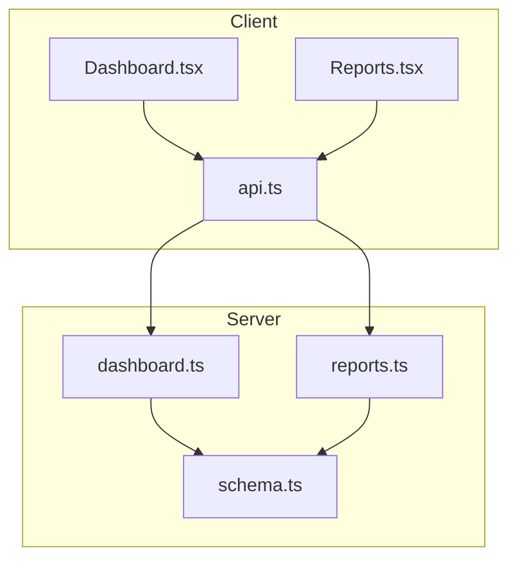
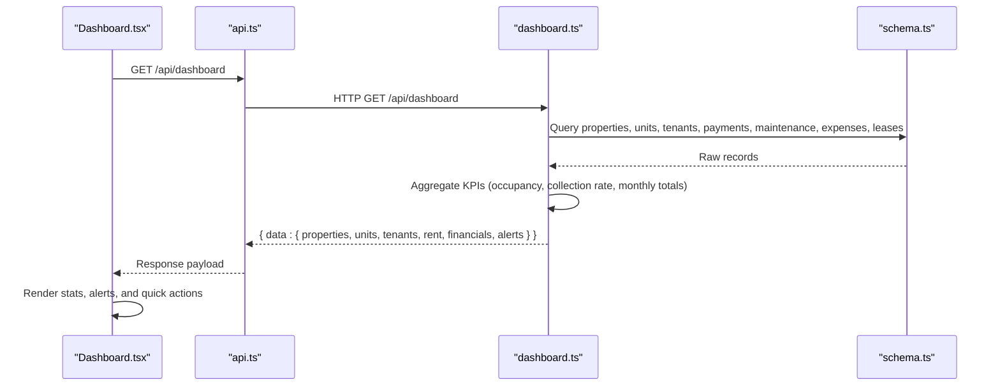
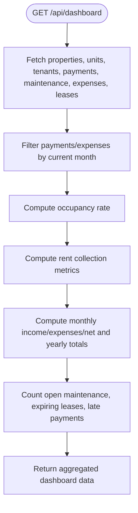
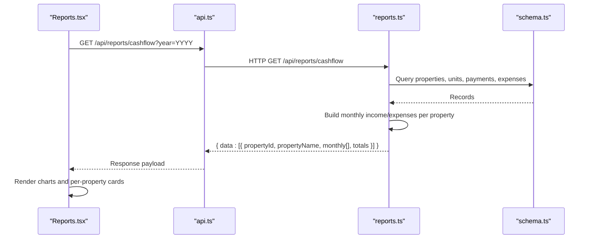
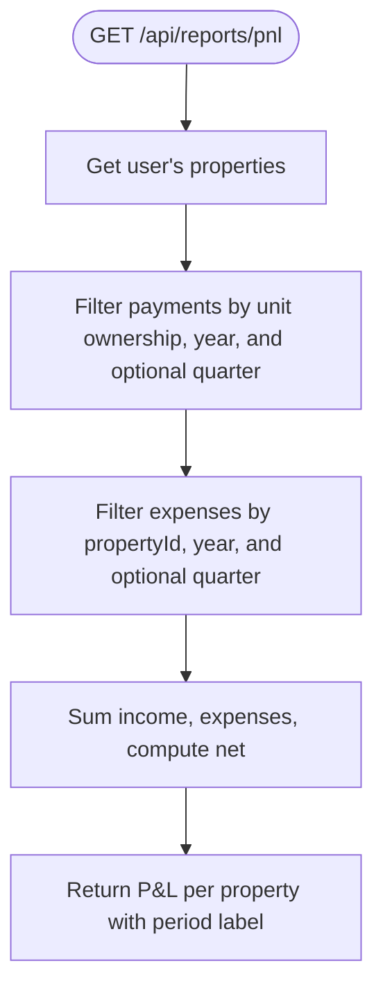
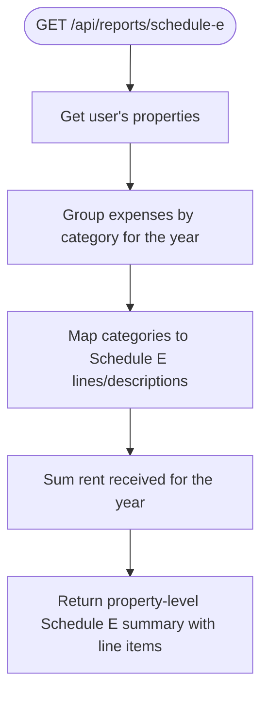
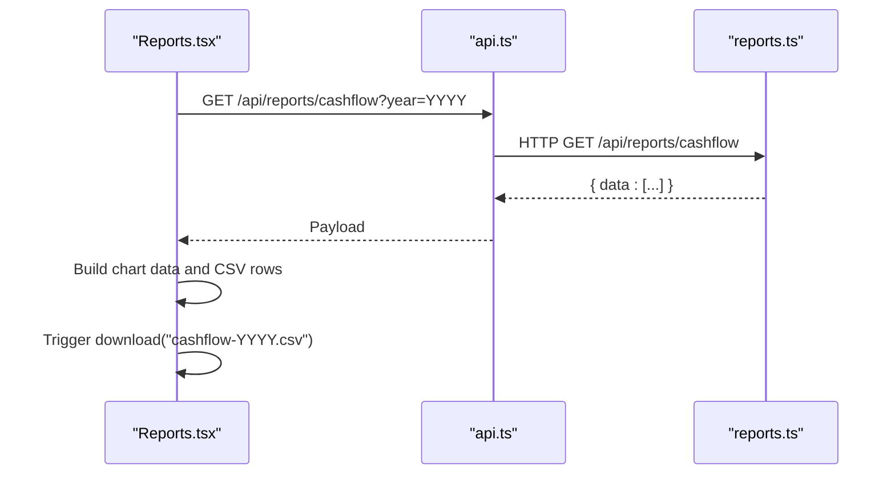
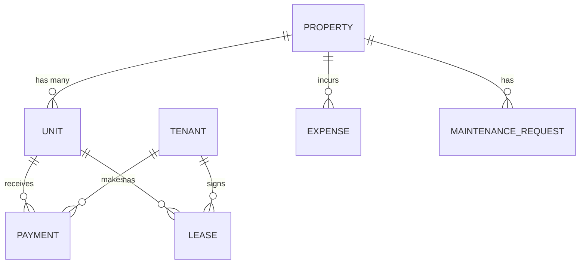

# Reports & Dashboard API

<cite>
**Referenced Files in This Document**
- [dashboard.ts](file://server/src/routes/dashboard.ts)
- [reports.ts](file://server/src/routes/reports.ts)
- [schema.ts](file://server/src/db/schema.ts)
- [types.ts](file://shared/src/types.ts)
- [Dashboard.tsx](file://client/src/pages/Dashboard.tsx)
- [Reports.tsx](file://client/src/pages/Reports.tsx)
- [api.ts](file://client/src/lib/api.ts)
</cite>

## Table of Contents
1. Introduction
2. Project Structure
3. Core Components
4. Architecture Overview
5. Detailed Component Analysis
6. Dependency Analysis
7. Performance Considerations
8. Troubleshooting Guide
9. Conclusion
10. Appendices

## Introduction
This document provides detailed API documentation for the reporting and dashboard functionality of the application. It covers:
- Dashboard endpoints that provide property performance metrics, financial summaries, occupancy rates, and key performance indicators (KPIs).
- Reporting endpoints for financial analysis, cash flow reports, profit and loss (P&L), and Schedule E tax reporting.
- Data aggregation patterns, time-based filtering, and export capabilities.
- Common reporting scenarios with examples.
- Caching strategies and performance optimization techniques for large datasets.

## Project Structure
The reporting and dashboard features are implemented across server routes, shared types, and client pages:
- Server routes expose REST endpoints under /api/dashboard and /api/reports.
- Shared types define data contracts used by both frontend and backend.
- Client pages consume these APIs to render dashboards and reports, including charts and CSV exports.

**Diagram sources**
- [Dashboard.tsx:24-27](file://client/src/pages/Dashboard.tsx#L24-L27)
- [Reports.tsx:64-80](file://client/src/pages/Reports.tsx#L64-L80)
- [api.ts:58-60](file://client/src/lib/api.ts#L58-L60)
- [dashboard.ts:11-121](file://server/src/routes/dashboard.ts#L11-L121)
- [reports.ts:29-183](file://server/src/routes/reports.ts#L29-L183)
- [schema.ts:191-403](file://server/src/db/schema.ts#L191-L403)

**Section sources**
- [dashboard.ts:11-121](file://server/src/routes/dashboard.ts#L11-L121)
- [reports.ts:29-183](file://server/src/routes/reports.ts#L29-L183)
- [Dashboard.tsx:24-27](file://client/src/pages/Dashboard.tsx#L24-L27)
- [Reports.tsx:64-80](file://client/src/pages/Reports.tsx#L64-L80)
- [api.ts:58-60](file://client/src/lib/api.ts#L58-L60)
- [schema.ts:191-403](file://server/src/db/schema.ts#L191-L403)

## Core Components
- Dashboard endpoint aggregates portfolio-wide KPIs: properties, units, tenants, rent collection, monthly financials, and alerts.
- Reporting endpoints provide:
  - Cash flow per property by month for a given year.
  - Profit & Loss per property for a year or quarter.
  - Schedule E line-item mapping for tax preparation.

Key responsibilities:
- Time-based filtering by current month/year or query parameters.
- Aggregation of payments and expenses by property/unit.
- Computation of occupancy rate, collection rate, and net income.
- Exporting report data as CSV from the client.

**Section sources**
- [dashboard.ts:11-121](file://server/src/routes/dashboard.ts#L11-L121)
- [reports.ts:29-183](file://server/src/routes/reports.ts#L29-L183)
- [types.ts:212-234](file://shared/src/types.ts#L212-L234)

## Architecture Overview
The system follows a simple client-server architecture:
- The React client uses TanStack Query to fetch data from REST endpoints.
- Express routes enforce authentication and aggregate data from the database using Drizzle ORM.
- Responses are structured JSON payloads consumed by the UI to render charts and tables.

**Diagram sources**
- [Dashboard.tsx:24-27](file://client/src/pages/Dashboard.tsx#L24-L27)
- [api.ts:58-60](file://client/src/lib/api.ts#L58-L60)
- [dashboard.ts:11-121](file://server/src/routes/dashboard.ts#L11-L121)
- [schema.ts:191-403](file://server/src/db/schema.ts#L191-L403)

## Detailed Component Analysis

### Dashboard API
- Endpoint: GET /api/dashboard
- Authentication: Required via middleware.
- Behavior:
  - Retrieves all properties, units, tenants, payments, maintenance requests, expenses, and leases scoped to the authenticated user.
  - Filters current month payments and expenses based on dueDate/date fields.
  - Computes occupancy rate, rent collection metrics, monthly income/expenses/net, and alerts (open maintenance, expiring leases within 90 days, late payments).
- Response structure includes:
  - properties: total and active counts.
  - units: total, occupied, vacant, occupancyRate.
  - tenants: total count.
  - rent: monthlyExpected, monthlyCollected, monthlyOutstanding, collectionRate.
  - financials: monthlyIncome, monthlyExpenses, monthlyNet, yearIncome, yearExpenses.
  - alerts: openMaintenance, expiringLeases, latePayments.

**Diagram sources**
- [dashboard.ts:11-121](file://server/src/routes/dashboard.ts#L11-L121)

**Section sources**
- [dashboard.ts:11-121](file://server/src/routes/dashboard.ts#L11-L121)
- [schema.ts:191-403](file://server/src/db/schema.ts#L191-L403)

### Cash Flow Report API
- Endpoint: GET /api/reports/cashflow?year=YYYY
- Authentication: Required via middleware.
- Behavior:
  - For each property owned by the user, builds monthly arrays for income and expenses over the specified year.
  - Income is derived from payments linked to units belonging to the property; expenses are filtered by propertyId and date.
  - Returns per-property monthly breakdowns plus totals for income, expenses, and net income.

**Diagram sources**
- [Reports.tsx:64-80](file://client/src/pages/Reports.tsx#L64-L80)
- [api.ts:58-60](file://client/src/lib/api.ts#L58-L60)
- [reports.ts:29-77](file://server/src/routes/reports.ts#L29-L77)
- [schema.ts:191-403](file://server/src/db/schema.ts#L191-L403)

**Section sources**
- [reports.ts:29-77](file://server/src/routes/reports.ts#L29-L77)
- [schema.ts:191-403](file://server/src/db/schema.ts#L191-L403)

### Profit & Loss (P&L) Report API
- Endpoint: GET /api/reports/pnl?year=YYYY[&quarter=1|2|3|4]
- Authentication: Required via middleware.
- Behavior:
  - For each property, filters payments and expenses by year and optional quarter.
  - Computes total income, total expenses, and net income per property for the period.
  - Returns period label indicating full year or specific quarter.

**Diagram sources**
- [reports.ts:132-183](file://server/src/routes/reports.ts#L132-L183)

**Section sources**
- [reports.ts:132-183](file://server/src/routes/reports.ts#L132-L183)
- [schema.ts:191-403](file://server/src/db/schema.ts#L191-L403)

### Schedule E Tax Report API
- Endpoint: GET /api/reports/schedule-e?year=YYYY
- Authentication: Required via middleware.
- Behavior:
  - For each property, groups expenses by category and maps them to Schedule E lines with descriptions.
  - Calculates total rent received for the year using payment dates.
  - Returns line items sorted by line number, total expenses, and net income.

**Diagram sources**
- [reports.ts:80-129](file://server/src/routes/reports.ts#L80-L129)

**Section sources**
- [reports.ts:80-129](file://server/src/routes/reports.ts#L80-L129)
- [schema.ts:191-403](file://server/src/db/schema.ts#L191-L403)

### Client-Side Consumption and Export
- Dashboard page consumes GET /api/dashboard to display KPIs, alerts, and quick actions.
- Reports page consumes:
  - GET /api/reports/cashflow?year=YYYY
  - GET /api/reports/pnl?year=YYYY[&quarter=Q]
  - GET /api/reports/schedule-e?year=YYYY
- Export capability:
  - Client-side CSV generation for each report tab, producing downloadable files named by report type and year.

**Diagram sources**
- [Reports.tsx:64-80](file://client/src/pages/Reports.tsx#L64-L80)
- [Reports.tsx:102-135](file://client/src/pages/Reports.tsx#L102-L135)
- [api.ts:58-60](file://client/src/lib/api.ts#L58-L60)
- [reports.ts:29-77](file://server/src/routes/reports.ts#L29-L77)

**Section sources**
- [Dashboard.tsx:24-27](file://client/src/pages/Dashboard.tsx#L24-L27)
- [Reports.tsx:64-80](file://client/src/pages/Reports.tsx#L64-L80)
- [Reports.tsx:102-135](file://client/src/pages/Reports.tsx#L102-L135)
- [api.ts:58-60](file://client/src/lib/api.ts#L58-L60)

## Dependency Analysis
- Authentication: All endpoints are protected by authMiddleware.
- Data models:
  - Property, Unit, Tenant, Lease, Payment, MaintenanceRequest, Expense, Vendor, Notification, Subscription.
- Relationships:
  - Payments link to Units and Tenants.
  - Expenses link to Properties and optionally Units.
  - Leases link to Units and Tenants.
  - MaintenanceRequests link to Units, Tenants, and Properties.

**Diagram sources**
- [schema.ts:191-403](file://server/src/db/schema.ts#L191-L403)

**Section sources**
- [schema.ts:191-403](file://server/src/db/schema.ts#L191-L403)

## Performance Considerations
- Current implementation loads entire sets of related records into memory and performs client-side filtering/aggregation. This approach can become inefficient with large datasets.
- Recommendations:
  - Add server-side pagination and filtering for large result sets.
  - Introduce database indexes on frequently filtered columns such as dueDate, date, propertyId, unitId, userId.
  - Implement caching layers (e.g., Redis) for dashboard and report endpoints with appropriate TTLs keyed by userId and time windows.
  - Use materialized views or pre-aggregated tables for monthly totals to reduce computation overhead.
  - Offload heavy aggregations to background jobs for scheduled report generation.
  - Consider returning only necessary fields to minimize payload size.

[No sources needed since this section provides general guidance]

## Troubleshooting Guide
- Authentication failures:
  - Ensure the request includes valid credentials; unauthorized responses redirect to login on the client side.
- Empty or unexpected data:
  - Verify that properties, units, payments, and expenses exist for the selected year/month.
  - Confirm that dueDate and date fields are set correctly for payments and expenses.
- Export issues:
  - CSV export is handled client-side; ensure browser allows file downloads and that data is present before exporting.

**Section sources**
- [api.ts:39-53](file://client/src/lib/api.ts#L39-L53)
- [reports.tsx:102-135](file://client/src/pages/Reports.tsx#L102-L135)

## Conclusion
The reporting and dashboard APIs provide essential insights into property performance, financial health, and tax readiness. They support time-based filtering and offer client-side export capabilities. To scale effectively, adopt server-side optimizations, caching, and indexing to handle large datasets efficiently.

[No sources needed since this section summarizes without analyzing specific files]

## Appendices

### API Reference Summary

- Dashboard
  - Method: GET
  - Path: /api/dashboard
  - Auth: Required
  - Response keys: properties, units, tenants, rent, financials, alerts

- Cash Flow Report
  - Method: GET
  - Path: /api/reports/cashflow
  - Query params: year (default current year)
  - Auth: Required
  - Response: Array of property objects with monthly arrays and totals

- Profit & Loss Report
  - Method: GET
  - Path: /api/reports/pnl
  - Query params: year (default current year), quarter (optional 1–4)
  - Auth: Required
  - Response: Array of property objects with totals and period label

- Schedule E Report
  - Method: GET
  - Path: /api/reports/schedule-e
  - Query params: year (default current year)
  - Auth: Required
  - Response: Array of property objects with line items mapped to Schedule E lines

**Section sources**
- [dashboard.ts:11-121](file://server/src/routes/dashboard.ts#L11-L121)
- [reports.ts:29-183](file://server/src/routes/reports.ts#L29-L183)

### Common Reporting Scenarios

- Monthly Financial Summary
  - Use Dashboard to view current month’s expected vs collected rent, monthly income/expenses/net, and alerts.
  - Use Cash Flow Report for a monthly breakdown across properties.

- Annual Property Performance Review
  - Use P&L Report for annual totals per property; optionally filter by quarter for quarterly reviews.
  - Use Cash Flow Report to analyze trends across months.

- Tenant Payment History Report
  - While not directly exposed as a dedicated endpoint, payment data underpins cash flow and P&L reports.
  - Export Cash Flow CSV to analyze payment timing and amounts per property and month.

**Section sources**
- [dashboard.ts:11-121](file://server/src/routes/dashboard.ts#L11-L121)
- [reports.ts:29-183](file://server/src/routes/reports.ts#L29-L183)
- [Reports.tsx:102-135](file://client/src/pages/Reports.tsx#L102-L135)