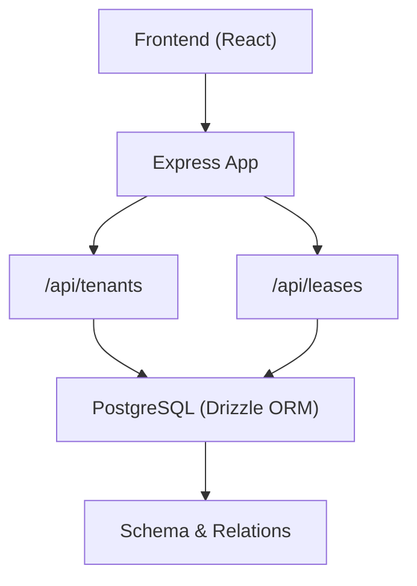
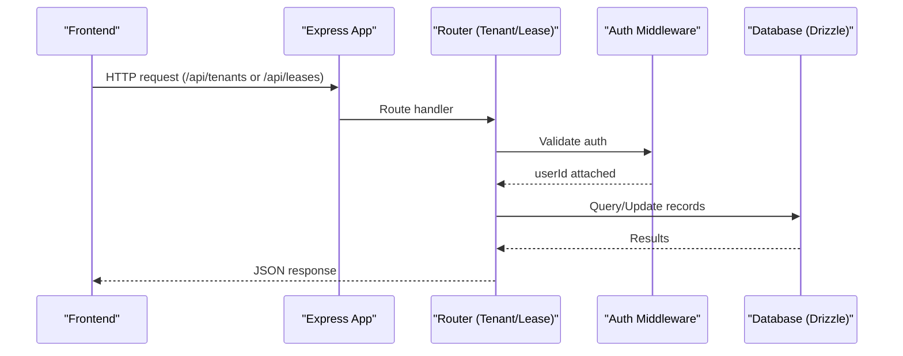
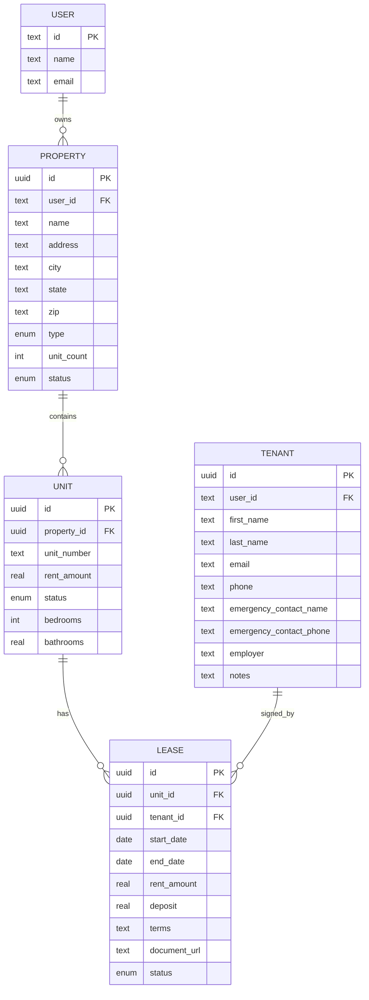
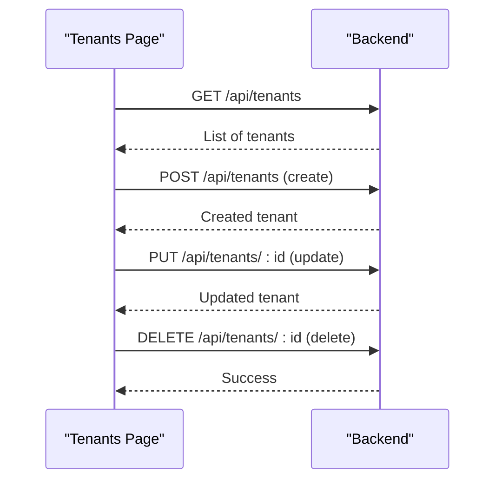
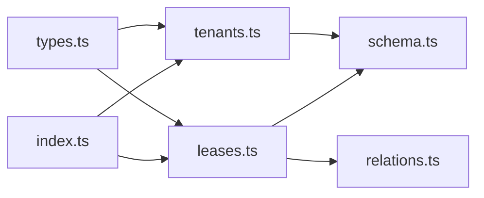

# Tenants & Leases API

<cite>
**Referenced Files in This Document**
- [tenants.ts](file://server/src/routes/tenants.ts)
- [leases.ts](file://server/src/routes/leases.ts)
- [schema.ts](file://server/src/db/schema.ts)
- [relations.ts](file://server/src/db/relations.ts)
- [types.ts](file://shared/src/types.ts)
- [index.ts](file://server/src/index.ts)
- [Tenants.tsx](file://client/src/pages/Tenants.tsx)
</cite>

## Table of Contents
1. Introduction
2. Project Structure
3. Core Components
4. Architecture Overview
5. Detailed Component Analysis
6. Dependency Analysis
7. Performance Considerations
8. Troubleshooting Guide
9. Conclusion

## Introduction
This document provides comprehensive API documentation for tenant administration and lease management in the application. It covers:
- Tenant profile management (personal information, emergency contacts, employment details)
- Lease lifecycle management (creation, terms configuration, document attachment, status tracking, renewal workflows)
- Relationships between tenants and leases (one-to-one mapping per unit and enforcement via business logic)
- Contact information management and tenant search/filtering capabilities
- Examples of tenant onboarding workflows, lease agreement generation, and lease renewal processes

The API is secured with authentication middleware and exposes REST endpoints under /api/tenants and /api/leases.

## Project Structure
Key backend files involved in tenant and lease functionality:
- Routes: server/src/routes/tenants.ts, server/src/routes/leases.ts
- Database schema and relations: server/src/db/schema.ts, server/src/db/relations.ts
- Shared types: shared/src/types.ts
- Server bootstrap and route mounting: server/src/index.ts
- Frontend tenant UI: client/src/pages/Tenants.tsx

**Diagram sources**
- [index.ts:53-56](file://server/src/index.ts#L53-L56)
- [tenants.ts:1-10](file://server/src/routes/tenants.ts#L1-L10)
- [leases.ts:1-10](file://server/src/routes/leases.ts#L1-L10)
- [schema.ts:228-266](file://server/src/db/schema.ts#L228-L266)

**Section sources**
- [index.ts:53-56](file://server/src/index.ts#L53-L56)

## Core Components
- Tenant CRUD: Create, Read, Update, Delete tenants scoped to the authenticated user.
- Lease CRUD: Create, Read, Update, Delete leases scoped to units owned by the authenticated user; includes expiring leases endpoint.
- Data models: Tenant and Lease entities defined in schema with strict enums and timestamps.
- Type contracts: Shared TypeScript interfaces for Tenant and Lease used across frontend and backend.

**Section sources**
- [tenants.ts:11-20](file://server/src/routes/tenants.ts#L11-L20)
- [leases.ts:11-21](file://server/src/routes/leases.ts#L11-L21)
- [schema.ts:228-266](file://server/src/db/schema.ts#L228-L266)
- [types.ts:40-68](file://shared/src/types.ts#L40-L68)

## Architecture Overview
The API follows a layered architecture:
- Express app mounts routers for tenants and leases.
- Each router applies authentication middleware.
- Request handlers validate payloads using Zod schemas.
- Handlers query/update data via Drizzle ORM against PostgreSQL.
- Business rules enforce ownership and state transitions (e.g., unit status changes when leases are created or terminated).

**Diagram sources**
- [index.ts:53-56](file://server/src/index.ts#L53-L56)
- [tenants.ts:1-10](file://server/src/routes/tenants.ts#L1-L10)
- [leases.ts:1-10](file://server/src/routes/leases.ts#L1-L10)

## Detailed Component Analysis

### Tenant Management API
Endpoints:
- GET /api/tenants
  - Returns all tenants belonging to the authenticated user, ordered by creation date descending.
- GET /api/tenants/:id
  - Returns a specific tenant if it belongs to the authenticated user; otherwise 404.
- POST /api/tenants
  - Creates a new tenant with validated fields; returns 201 with created record.
- PUT /api/tenants/:id
  - Partially updates an existing tenant that belongs to the authenticated user; returns updated record.
- DELETE /api/tenants/:id
  - Deletes a tenant that belongs to the authenticated user; returns success message.

Validation and fields:
- Required: firstName, lastName
- Optional: email, phone, emergencyContactName, emergencyContactPhone, employer, notes
- All fields validated via Zod schema before persistence.

Ownership and security:
- All operations are scoped to the authenticated user’s tenant records.

Error handling:
- Validation errors return 400 with structured error details.
- Not found returns 404 with code NOT_FOUND.

Example usage patterns:
- Tenant onboarding workflow:
  - Create tenant via POST /api/tenants with personal and contact details.
  - Optionally update later via PUT /api/tenants/:id to add employer or notes.
  - Retrieve tenant list via GET /api/tenants for dashboards and search.

Search and filtering:
- Current implementation lists all tenants for the authenticated user without query parameters. Filtering can be added at the route level using additional query parameters and Drizzle where clauses.

**Section sources**
- [tenants.ts:22-80](file://server/src/routes/tenants.ts#L22-L80)
- [tenants.ts:11-20](file://server/src/routes/tenants.ts#L11-L20)
- [schema.ts:228-245](file://server/src/db/schema.ts#L228-L245)
- [types.ts:40-53](file://shared/src/types.ts#L40-L53)

### Lease Management API
Endpoints:
- GET /api/leases
  - Returns leases associated with units owned by the authenticated user. Includes related unit and tenant data.
- GET /api/leases/expiring?days=N
  - Returns active leases expiring within N days (default 90), filtered to user-owned properties.
- GET /api/leases/:id
  - Returns a specific lease with related unit and tenant; 404 if not found.
- POST /api/leases
  - Creates a lease for a unit and tenant owned by the authenticated user; sets unit status to occupied.
- PUT /api/leases/:id
  - Updates lease fields; if status becomes expired or terminated, sets unit status to vacant.
- DELETE /api/leases/:id
  - Deletes a lease; 404 if not found.

Validation and fields:
- Required: unitId, tenantId, startDate, endDate, rentAmount
- Optional: deposit, terms, documentUrl, status (defaults to active)
- Status enum: active, expired, terminated

Business rules:
- Ownership verification:
  - Unit must belong to the authenticated user.
  - Tenant must belong to the authenticated user.
- Unit status synchronization:
  - On lease creation: unit status set to occupied.
  - On lease termination/expiry: unit status set to vacant.

Renewal workflow example:
- Retrieve expiring leases via GET /api/leases/expiring?days=90.
- For each expiring lease, create a new lease record with updated dates and possibly new terms/documentUrl via POST /api/leases.
- Optionally mark old lease as expired or terminated via PUT /api/leases/:id to reflect end of term.

Lease agreement generation:
- Use terms and documentUrl fields to store lease text and link to generated documents. The API accepts these fields but does not generate documents itself; integrate with external document generation services and persist URLs.

**Section sources**
- [leases.ts:23-144](file://server/src/routes/leases.ts#L23-L144)
- [schema.ts:247-266](file://server/src/db/schema.ts#L247-L266)
- [types.ts:55-68](file://shared/src/types.ts#L55-L68)

### Data Models and Relationships
Entities:
- Tenant: personal info, emergency contacts, employer, notes, timestamps.
- Lease: links to unit and tenant, start/end dates, rent amount, deposit, terms, document URL, status, timestamps.
- Unit: belongs to property, has status (occupied/vacant/under_renovation).
- Property: belongs to user, contains multiple units.

Relationships:
- One lease references one unit and one tenant.
- Units belong to properties; leases are effectively scoped to properties through unit ownership checks.
- User owns properties; tenants are also scoped to users.

**Diagram sources**
- [schema.ts:139-147](file://server/src/db/schema.ts#L139-L147)
- [schema.ts:191-226](file://server/src/db/schema.ts#L191-L226)
- [schema.ts:228-266](file://server/src/db/schema.ts#L228-L266)
- [relations.ts:45-66](file://server/src/db/relations.ts#L45-L66)

### Tenant Search and Filtering
Current behavior:
- Lists all tenants for the authenticated user.
- No built-in query parameters for search/filter.

Recommendations:
- Add optional query parameters such as name, email, phone, employer to filter results.
- Implement server-side pagination for large datasets.
- Use Drizzle where clauses to compose filters efficiently.

[No sources needed since this section proposes enhancements beyond current implementation]

### Communication Tracking
Current behavior:
- No dedicated communication history table or endpoints in the analyzed routes.
- Notes field exists on Tenant and other entities for ad-hoc remarks.

Recommendations:
- Introduce a communication log entity to track emails, SMS, calls, and in-app messages with metadata (channel, recipient, subject, body, status, scheduledAt, sentAt).
- Expose endpoints to create/read communication logs linked to tenants and leases.
- Use existing notification infrastructure concepts to standardize channels and statuses.

[No sources needed since this section proposes enhancements beyond current implementation]

### Frontend Integration Example
The Tenants page demonstrates:
- Fetching tenant list via GET /api/tenants.
- Creating tenants via POST /api/tenants.
- Updating tenants via PUT /api/tenants/:id.
- Deleting tenants via DELETE /api/tenants/:id.
- Modal-based form for adding/editing tenant profiles including personal and emergency contact fields.

**Diagram sources**
- [Tenants.tsx:37-69](file://client/src/pages/Tenants.tsx#L37-L69)
- [tenants.ts:22-80](file://server/src/routes/tenants.ts#L22-L80)

**Section sources**
- [Tenants.tsx:37-69](file://client/src/pages/Tenants.tsx#L37-L69)

## Dependency Analysis
Component coupling:
- Routes depend on database schema and relations for queries and updates.
- Lease routes depend on unit and property ownership checks to ensure tenant-unit association is valid.
- Tenant routes enforce user-scoped access.

External dependencies:
- Express for routing and middleware.
- Drizzle ORM for database interactions.
- Zod for request validation.
- Better-Auth middleware for authentication.

Potential circular dependencies:
- None observed between routes and schema/relations.

Interface contracts:
- Shared types define Tenant and Lease structures consumed by both frontend and backend.

**Diagram sources**
- [tenants.ts:1-10](file://server/src/routes/tenants.ts#L1-L10)
- [leases.ts:1-10](file://server/src/routes/leases.ts#L1-L10)
- [schema.ts:228-266](file://server/src/db/schema.ts#L228-L266)
- [relations.ts:45-66](file://server/src/db/relations.ts#L45-L66)
- [types.ts:40-68](file://shared/src/types.ts#L40-L68)
- [index.ts:53-56](file://server/src/index.ts#L53-L56)

**Section sources**
- [schema.ts:228-266](file://server/src/db/schema.ts#L228-L266)
- [relations.ts:45-66](file://server/src/db/relations.ts#L45-L66)
- [types.ts:40-68](file://shared/src/types.ts#L40-L68)
- [index.ts:53-56](file://server/src/index.ts#L53-L56)

## Performance Considerations
- Pagination: Add pagination to tenant and lease listing endpoints to handle large datasets efficiently.
- Indexes: Ensure indexes on frequently queried columns such as userId, unitId, tenantId, status, and dates.
- Eager loading: Use Drizzle relations to fetch related data in single queries where appropriate (already used in lease listing).
- Caching: Consider caching frequent read operations like expiring leases for short intervals.
- Validation: Keep Zod schemas minimal and focused to reduce overhead.

[No sources needed since this section provides general guidance]

## Troubleshooting Guide
Common issues and resolutions:
- Validation errors:
  - Cause: Missing required fields or invalid formats.
  - Resolution: Check request payload against Zod schema; ensure firstName and lastName are present for tenants; ensure unitId, tenantId, startDate, endDate, rentAmount for leases.
- Not found errors:
  - Cause: Accessing resources not owned by the authenticated user or non-existent IDs.
  - Resolution: Verify ownership checks and correct IDs; ensure tenant/unit belong to the user.
- Unit status inconsistencies:
  - Cause: Manual updates bypassing lease endpoints.
  - Resolution: Always update unit status via lease endpoints to maintain consistency.

Error responses:
- 400 VALIDATION: Structured error details included.
- 404 NOT_FOUND: Resource not found or unauthorized access.

**Section sources**
- [tenants.ts:43-69](file://server/src/routes/tenants.ts#L43-L69)
- [leases.ts:88-136](file://server/src/routes/leases.ts#L88-L136)

## Conclusion
The Tenants & Leases API provides robust CRUD operations for managing tenant profiles and lease agreements with clear ownership scoping and business rule enforcement. While basic communication tracking and advanced search/filtering are not implemented in the analyzed routes, the schema and structure support future enhancements. Integrating document generation for lease agreements and adding communication logs will further strengthen the system’s capabilities for landlord administration.