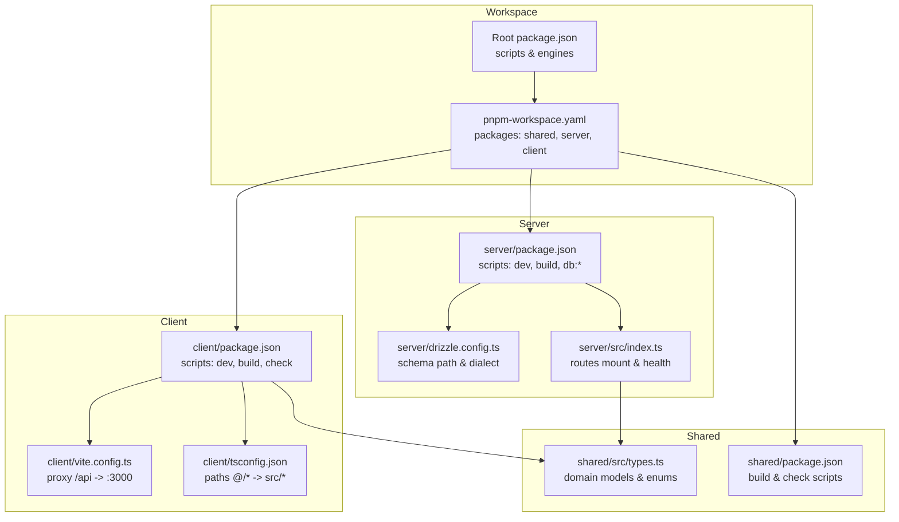
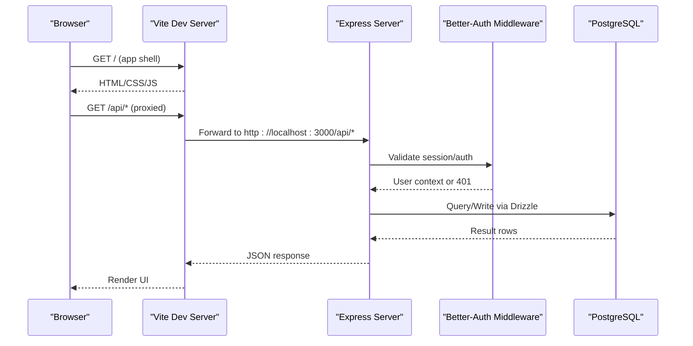
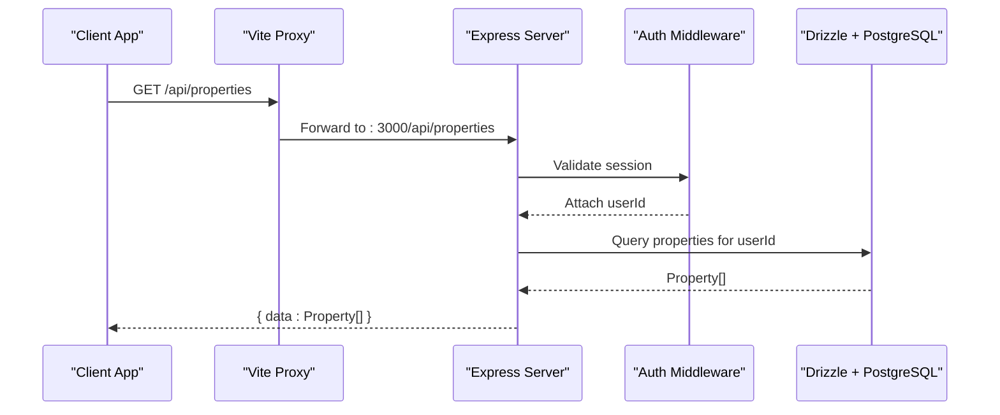
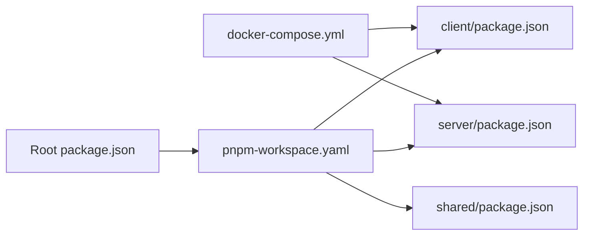

# Contributing Guide

<cite>
**Referenced Files in This Document**
- [package.json](file://package.json)
- [pnpm-workspace.yaml](file://pnpm-workspace.yaml)
- [docker-compose.yml](file://docker-compose.yml)
- [client/package.json](file://client/package.json)
- [server/package.json](file://server/package.json)
- [shared/package.json](file://shared/package.json)
- [client/tsconfig.json](file://client/tsconfig.json)
- [server/tsconfig.json](file://server/tsconfig.json)
- [shared/tsconfig.json](file://shared/tsconfig.json)
- [client/vite.config.ts](file://client/vite.config.ts)
- [server/drizzle.config.ts](file://server/drizzle.config.ts)
- [.gitignore](file://.gitignore)
- [RentLite-Product-Spec-Sheet.md](file://RentLite-Product-Spec-Sheet.md)
- [Reusable AI-App Technology and Design Stack Playbook.md](file://Reusable AI-App Technology and Design Stack Playbook.md)
- [server/src/index.ts](file://server/src/index.ts)
- [client/src/App.tsx](file://client/src/App.tsx)
- [shared/src/types.ts](file://shared/src/types.ts)
- [server/src/db/schema.ts](file://server/src/db/schema.ts)
- [server/src/routes/properties.ts](file://server/src/routes/properties.ts)
</cite>

## Table of Contents
1. Introduction
2. Project Structure
3. Core Components
4. Architecture Overview
5. Detailed Component Analysis
6. Dependency Analysis
7. Performance Considerations
8. Troubleshooting Guide
9. Conclusion
10. Appendices

## Introduction
This guide explains how to contribute to RentLite, a small property management application for landlords with 2–20 units. It covers development workflow, branch and commit conventions, pull request procedures, code style and formatting standards, environment setup, testing practices, documentation updates, API specification changes, code review and quality assurance, release procedures, versioning, licensing considerations, and contributor agreements.

RentLite is a monorepo using pnpm workspaces with three packages: client (React + Vite), server (Express + Drizzle ORM), and shared (TypeScript types). The project uses Docker Compose to run PostgreSQL, the backend server, and the frontend dev server together.

## Project Structure
The repository is organized as a pnpm workspace with clear separation between frontend, backend, and shared types.

**Diagram sources**
- [package.json:1-21](file://package.json#L1-L21)
- [pnpm-workspace.yaml:1-5](file://pnpm-workspace.yaml#L1-L5)
- [client/package.json:1-44](file://client/package.json#L1-L44)
- [server/package.json:1-37](file://server/package.json#L1-L37)
- [shared/package.json:1-22](file://shared/package.json#L1-L22)
- [client/vite.config.ts:1-24](file://client/vite.config.ts#L1-L24)
- [server/drizzle.config.ts:1-12](file://server/drizzle.config.ts#L1-L12)
- [server/src/index.ts:1-59](file://server/src/index.ts#L1-L59)
- [shared/src/types.ts:1-251](file://shared/src/types.ts#L1-L251)

**Section sources**
- [package.json:1-21](file://package.json#L1-L21)
- [pnpm-workspace.yaml:1-5](file://pnpm-workspace.yaml#L1-L5)
- [client/package.json:1-44](file://client/package.json#L1-L44)
- [server/package.json:1-37](file://server/package.json#L1-L37)
- [shared/package.json:1-22](file://shared/package.json#L1-L22)

## Core Components
- Client: React 19 app built with Vite, Tailwind CSS, Wouter routing, and shadcn/ui primitives. Provides pages for dashboard, properties, tenants, payments, maintenance, expenses, and reports.
- Server: Express API with Better-Auth middleware, Zod validation, and Drizzle ORM against PostgreSQL. Routes are grouped by domain (properties, tenants, leases, payments, maintenance, expenses, vendors, reports, dashboard).
- Shared: TypeScript types and enums used by both client and server to ensure consistent contracts.

Key responsibilities:
- Routing and protected routes on the client.
- API endpoints under /api/* on the server.
- Database schema and migrations via Drizzle.
- Shared type definitions for domain entities.

**Section sources**
- [client/src/App.tsx:1-78](file://client/src/App.tsx#L1-L78)
- [server/src/index.ts:1-59](file://server/src/index.ts#L1-L59)
- [server/src/routes/properties.ts:1-106](file://server/src/routes/properties.ts#L1-L106)
- [shared/src/types.ts:1-251](file://shared/src/types.ts#L1-L251)

## Architecture Overview
High-level flow from browser to database and back:

**Diagram sources**
- [client/vite.config.ts:1-24](file://client/vite.config.ts#L1-L24)
- [server/src/index.ts:1-59](file://server/src/index.ts#L1-L59)
- [docker-compose.yml:1-64](file://docker-compose.yml#L1-L64)

## Detailed Component Analysis

### Development Environment Setup
- Prerequisites: Node.js >= 20 and pnpm >= 9 (enforced by root package.json engines).
- Install dependencies at the workspace root.
- Start all services with Docker Compose:
  - PostgreSQL container with health checks.
  - Server container with environment variables for auth, client URL, email, uploads, etc.
  - Client container running Vite dev server proxied to the server.
- Alternatively, run parts locally:
  - Backend: use server scripts for dev/build/check and database commands.
  - Frontend: use client scripts for dev/build/check/preview.
- Database:
  - Push schema to local Postgres using server scripts.
  - Open Drizzle Studio for visual inspection.
  - Seed data if available via server scripts.

Environment variables:
- DATABASE_URL, BETTER_AUTH_SECRET, BETTER_AUTH_URL, CLIENT_URL, RESEND_API_KEY, TWILIO_* placeholders, PLAID_* placeholders, UPLOAD_DIR, PORT are configured in docker-compose.

**Section sources**
- [package.json:1-21](file://package.json#L1-L21)
- [docker-compose.yml:1-64](file://docker-compose.yml#L1-L64)
- [server/package.json:1-37](file://server/package.json#L1-L37)
- [client/package.json:1-44](file://client/package.json#L1-L44)
- [server/drizzle.config.ts:1-12](file://server/drizzle.config.ts#L1-L12)

### Branch Management
Recommended workflow:
- Create feature branches from main with descriptive names: feature/<short-desc>, fix/<short-desc>, docs/<short-desc>.
- Keep branches focused on one change or related set of changes.
- Rebase onto main before opening a PR to keep history clean.
- Use small, incremental commits that each represent a coherent unit of change.

No specific branch policy is enforced in configuration; follow team conventions and keep diffs reviewable.

### Commit Conventions
Adopt conventional commits for clarity and automation-friendly logs:
- feat: new features (e.g., feat(properties): add create endpoint)
- fix: bug fixes
- docs: documentation-only changes
- refactor: code restructure without behavior change
- test: adding or updating tests
- chore: tooling, config, dependency updates

Examples:
- feat(server): add payment route with zod validation
- fix(client): correct tenant list pagination
- docs: update contributing guide

### Pull Request Procedures
Before opening a PR:
- Ensure type checks pass:
  - Root: pnpm check
  - Or per-package: pnpm --filter <pkg> check
- Build successfully:
  - Root: pnpm build
- Run database migrations if schema changed:
  - pnpm db:push
- Test locally:
  - Start services with pnpm dev (Docker Compose)
  - Verify key flows in the browser and API endpoints

PR checklist:
- Linked issue or description of purpose
- Summary of changes
- Screenshots or short demos for UI changes
- Notes on environment variables or migrations
- Confirmation that checks pass

Review expectations:
- Clear intent and minimal scope
- No commented-out code
- Consistent naming and structure
- Updated documentation when needed

### Code Style and Formatting Standards
- Language: TypeScript across client, server, and shared.
- Type safety:
  - Define domain types in shared/src/types.ts and reuse them.
  - Validate incoming requests with Zod in server routes.
- Styling:
  - Tailwind CSS utilities in the client.
  - Follow the design stack guidance for spacing, typography, and motion.
- File organization:
  - Client: pages, components/ui, contexts, lib.
  - Server: routes grouped by domain; db schema and relations; auth middleware.
- Naming:
  - PascalCase for components and types.
  - camelCase for functions and variables.
  - kebab-case for file names where appropriate.
- Linting and checks:
  - Use pnpm check to validate TypeScript compilation without emitting files.
  - Use pnpm build to validate production builds.

References:
- Client tsconfig paths alias @/* to src/* for imports.
- Server references shared package for types.
- Shared package exports types consumed by client and server.

**Section sources**
- [client/tsconfig.json:1-16](file://client/tsconfig.json#L1-L16)
- [server/tsconfig.json:1-14](file://server/tsconfig.json#L1-L14)
- [shared/tsconfig.json:1-10](file://shared/tsconfig.json#L1-L10)
- [shared/src/types.ts:1-251](file://shared/src/types.ts#L1-L251)
- [server/src/routes/properties.ts:1-106](file://server/src/routes/properties.ts#L1-L106)
- [Reusable AI-App Technology and Design Stack Playbook.md:1-362](file://Reusable AI-App Technology and Design Stack Playbook.md#L1-L362)

### Testing Procedures
Current repository does not include a dedicated test runner configuration. Recommended approach:
- Add unit tests for server routes and utilities using a framework like Vitest or Jest.
- Add integration tests for critical API flows (create/read/update/delete).
- Add component tests for complex UI interactions in the client.
- Include smoke tests to verify health endpoint and core navigation.

Until tests are added:
- Manually verify changes using the dev server and Drizzle Studio.
- Use pnpm check and pnpm build to catch type errors early.

### Documentation Guidelines
- Product spec: Refer to RentLite-Product-Spec-Sheet.md for feature scope and roadmap alignment.
- Design and UX: Follow the Reusable AI-App Technology and Design Stack Playbook.md for UI patterns, accessibility, and quality checks.
- When changing APIs or schemas:
  - Update relevant sections in product spec or internal docs.
  - Reflect changes in shared types and server routes.
  - Note migration steps and breaking changes in PR descriptions.

**Section sources**
- [RentLite-Product-Spec-Sheet.md:1-625](file://RentLite-Product-Spec-Sheet.md#L1-L625)
- [Reusable AI-App Technology and Design Stack Playbook.md:1-362](file://Reusable AI-App Technology and Design Stack Playbook.md#L1-L362)

### Adding Tests
Guidelines:
- Place tests near the code they cover (co-location).
- Name files descriptively (e.g., properties.test.ts).
- Cover happy paths, edge cases, and error handling.
- Mock external services (email, SMS, storage) where applicable.
- Ensure tests run via pnpm scripts in the relevant package.

### Updating API Specifications
When modifying endpoints:
- Update route handlers and validation schemas.
- Adjust shared types if payloads change.
- Document request/response shapes in comments or external API docs.
- Keep backward compatibility when possible; mark breaking changes clearly.

Example reference:
- Properties routes demonstrate CRUD with Zod validation and Drizzle queries.

**Section sources**
- [server/src/routes/properties.ts:1-106](file://server/src/routes/properties.ts#L1-L106)
- [shared/src/types.ts:1-251](file://shared/src/types.ts#L1-L251)

### Code Review Processes and Quality Assurance
Quality gates:
- pnpm check must pass across packages.
- pnpm build must succeed.
- Manual verification of affected flows.
- For UI changes, verify responsive layouts and accessibility basics.

Review focus:
- Correctness and safety (types, validation, authorization).
- Maintainability (clarity, modularity, consistency).
- Performance (avoid N+1 queries, unnecessary re-renders).
- Security (input validation, auth checks, secrets management).

### Release Procedures and Version Management
Versioning:
- Each package has its own version in package.json; maintain versions aligned with changes.
- Coordinate cross-package updates when shared types change.

Release steps:
- Ensure all checks pass and tests (when added) succeed.
- Update changelog entries in PRs.
- Tag releases and publish artifacts as needed.
- Update environment variables and configurations for deployment targets.

Note: There is no CI/CD pipeline defined in this repository snapshot; adopt a CI system to automate checks and deployments.

**Section sources**
- [package.json:1-21](file://package.json#L1-L21)
- [client/package.json:1-44](file://client/package.json#L1-L44)
- [server/package.json:1-37](file://server/package.json#L1-L37)
- [shared/package.json:1-22](file://shared/package.json#L1-L22)

### Licensing and Contributor Agreements
- License: Not specified in the repository snapshot. If you plan to distribute or commercialize contributions, clarify licensing terms with maintainers.
- Contributor Agreement: Not present in the repository. Establish a CLA or DCO if required by your organization or distribution model.
- Best practice: Add LICENSE and CONTRIBUTING files to formalize policies.

[No sources needed since this section provides general guidance]

## Architecture Overview
End-to-end request flow for a protected resource:

**Diagram sources**
- [client/vite.config.ts:1-24](file://client/vite.config.ts#L1-L24)
- [server/src/index.ts:1-59](file://server/src/index.ts#L1-L59)
- [server/src/routes/properties.ts:1-106](file://server/src/routes/properties.ts#L1-L106)

## Detailed Component Analysis

### Server Entry and Routing
- Initializes Express, applies CORS and JSON parsing.
- Mounts Better-Auth handler for authentication routes.
- Registers domain routers under /api/* and exposes a health endpoint.

Best practices demonstrated:
- Centralized route registration.
- Health check for readiness probes.
- Environment-driven origin for CORS.

**Section sources**
- [server/src/index.ts:1-59](file://server/src/index.ts#L1-L59)

### Client Routing and Protected Pages
- Defines public routes (/login, /signup) and protected routes wrapped in a guard that redirects unauthenticated users.
- Uses Wouter for routing and a layout component for authenticated sessions.

Recommendations:
- Keep route guards simple and centralized.
- Add loading states during auth checks.

**Section sources**
- [client/src/App.tsx:1-78](file://client/src/App.tsx#L1-L78)

### Shared Types and Domain Model
- Centralizes domain types and enums for properties, units, tenants, leases, payments, maintenance, expenses, vendors, notifications, subscriptions, and reports.
- Ensures consistency between client and server contracts.

Usage:
- Import into server routes for typed responses and validations.
- Import into client for UI state and API responses.

**Section sources**
- [shared/src/types.ts:1-251](file://shared/src/types.ts#L1-L251)

### Database Schema and Migrations
- Drizzle schema defines tables, enums, and relationships for all core entities.
- Configuration points to schema file and PostgreSQL dialect.
- Use db:push to apply schema changes to the local database.

Migration strategy:
- Treat schema changes as migrations; document breaking changes.
- Keep seed data updated if provided.

**Section sources**
- [server/src/db/schema.ts:1-403](file://server/src/db/schema.ts#L1-L403)
- [server/drizzle.config.ts:1-12](file://server/drizzle.config.ts#L1-L12)

### Example Route: Properties
- Implements CRUD operations with Zod validation.
- Enforces ownership by filtering queries by userId from auth context.
- Auto-creates units based on unitCount when creating a property.

Patterns to follow:
- Validate inputs with Zod.
- Return structured error responses with codes and details.
- Use Drizzle query helpers for safe and readable queries.

**Section sources**
- [server/src/routes/properties.ts:1-106](file://server/src/routes/properties.ts#L1-L106)

## Dependency Analysis
Workspace and runtime dependencies:

**Diagram sources**
- [package.json:1-21](file://package.json#L1-L21)
- [pnpm-workspace.yaml:1-5](file://pnpm-workspace.yaml#L1-L5)
- [client/package.json:1-44](file://client/package.json#L1-L44)
- [server/package.json:1-37](file://server/package.json#L1-L37)
- [shared/package.json:1-22](file://shared/package.json#L1-L22)
- [docker-compose.yml:1-64](file://docker-compose.yml#L1-L64)

**Section sources**
- [package.json:1-21](file://package.json#L1-L21)
- [pnpm-workspace.yaml:1-5](file://pnpm-workspace.yaml#L1-L5)
- [docker-compose.yml:1-64](file://docker-compose.yml#L1-L64)

## Performance Considerations
- Use Drizzle query optimizations (select only needed fields, avoid N+1 queries).
- Cache frequently accessed data where appropriate.
- Minimize bundle size in the client by lazy-loading heavy components.
- Enable compression and caching headers on the server for static assets.
- Monitor database performance and add indexes for frequent filters.

[No sources needed since this section provides general guidance]

## Troubleshooting Guide
Common issues and resolutions:
- Cannot connect to database:
  - Ensure PostgreSQL container is healthy and DATABASE_URL is set correctly.
- CORS errors:
  - Verify CLIENT_URL and BETTER_AUTH_URL match the actual origins.
- Auth failures:
  - Check BETTER_AUTH_SECRET and session configuration.
- Port conflicts:
  - Confirm ports 3000 (server) and 5173 (client) are free.
- Uploads not persisted:
  - Ensure UPLOAD_DIR volume is mounted and writable.

Useful commands:
- pnpm dev to start all services via Docker Compose.
- pnpm db:studio to inspect the database.
- pnpm check to validate TypeScript across packages.

**Section sources**
- [docker-compose.yml:1-64](file://docker-compose.yml#L1-L64)
- [server/package.json:1-37](file://server/package.json#L1-L37)
- [client/package.json:1-44](file://client/package.json#L1-L44)
- [package.json:1-21](file://package.json#L1-L21)

## Conclusion
Follow the workflows and standards outlined here to contribute effectively to RentLite. Prioritize type safety, validation, and clear documentation. Use the workspace scripts to develop, test, and build consistently. Align changes with the product spec and design playbook to maintain coherence across the application.

[No sources needed since this section summarizes without analyzing specific files]

## Appendices

### Quick Commands Reference
- Start all services: pnpm dev
- Run type checks: pnpm check
- Build all packages: pnpm build
- Database push: pnpm db:push
- Open database studio: pnpm db:studio
- Seed data: pnpm db:seed

**Section sources**
- [package.json:1-21](file://package.json#L1-L21)
- [server/package.json:1-37](file://server/package.json#L1-L37)
- [client/package.json:1-44](file://client/package.json#L1-L44)

### Ignored Files and Secrets
- Ensure sensitive files (.env, uploads, pgdata) remain ignored.
- Never commit secrets or generated artifacts.

**Section sources**
- [.gitignore:1-8](file://.gitignore#L1-L8)