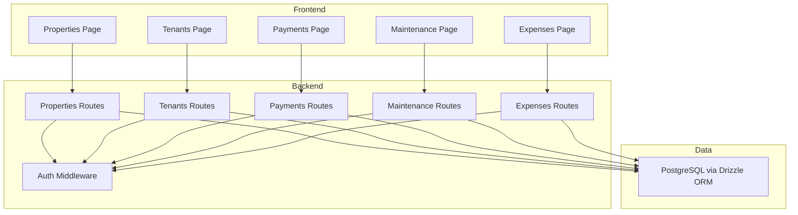
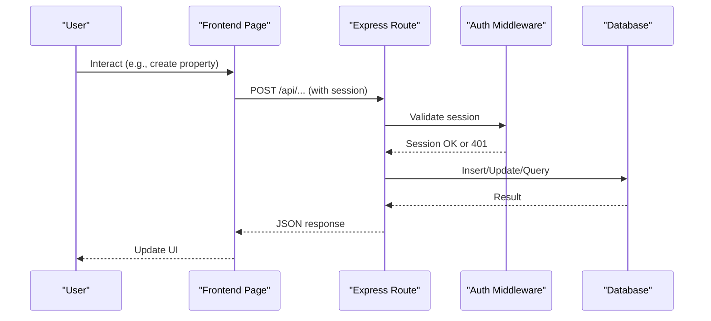
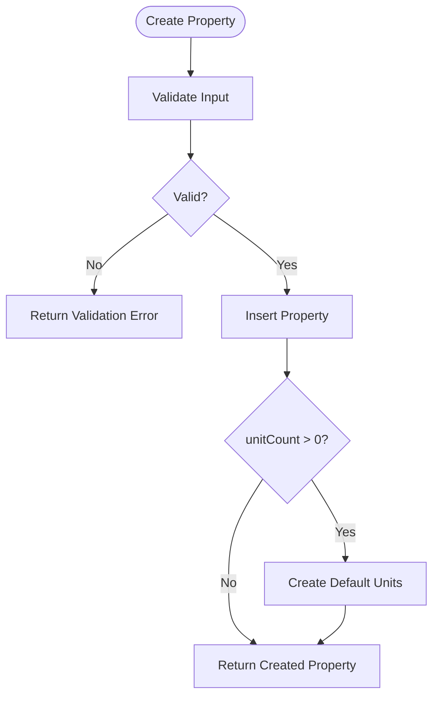
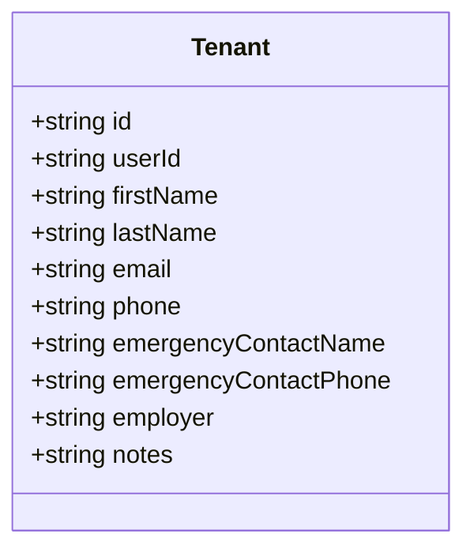
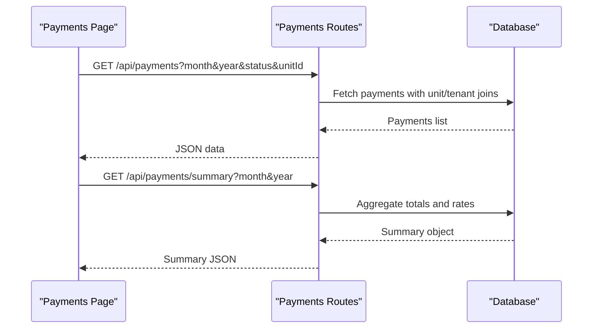
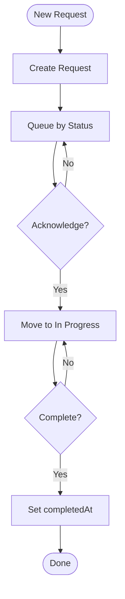
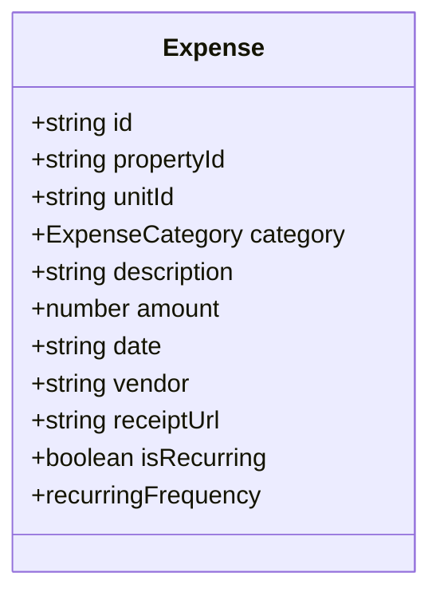
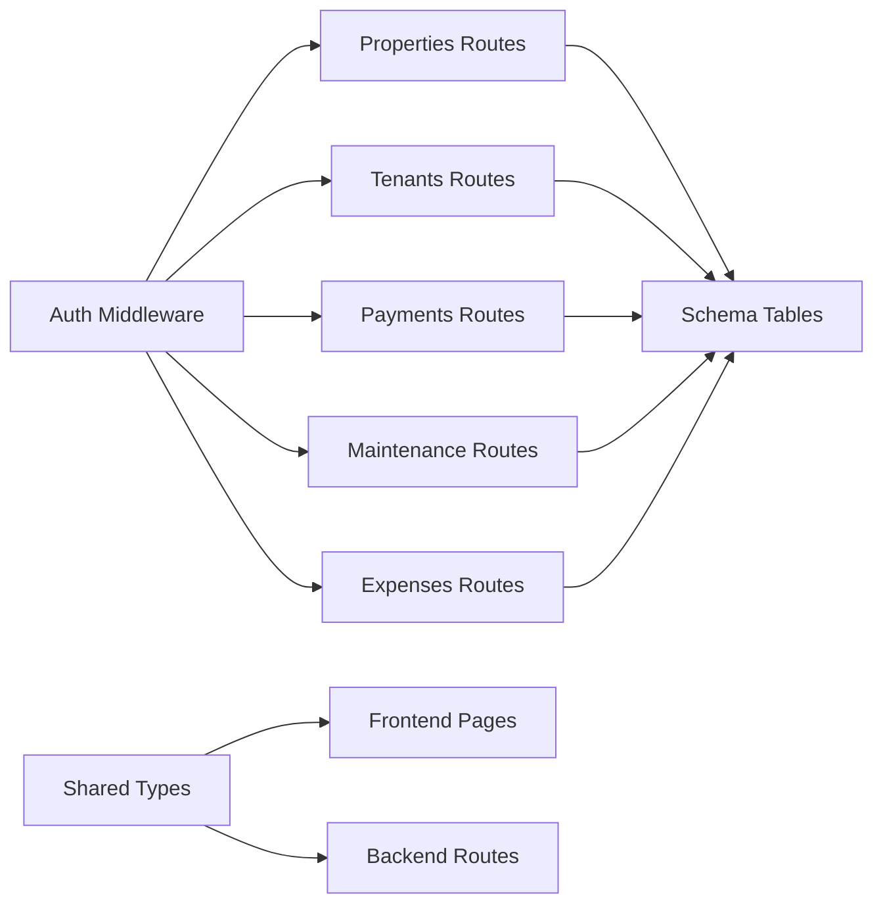

# Core Features

<cite>
**Referenced Files in This Document**
- [RentLite-Product-Spec-Sheet.md](file://RentLite-Product-Spec-Sheet.md)
- [schema.ts](file://server/src/db/schema.ts)
- [properties.ts](file://server/src/routes/properties.ts)
- [tenants.ts](file://server/src/routes/tenants.ts)
- [payments.ts](file://server/src/routes/payments.ts)
- [maintenance.ts](file://server/src/routes/maintenance.ts)
- [expenses.ts](file://server/src/routes/expenses.ts)
- [middleware.ts](file://server/src/auth/middleware.ts)
- [types.ts](file://shared/src/types.ts)
- [Properties.tsx](file://client/src/pages/Properties.tsx)
- [Tenants.tsx](file://client/src/pages/Tenants.tsx)
- [Payments.tsx](file://client/src/pages/Payments.tsx)
- [Maintenance.tsx](file://client/src/pages/Maintenance.tsx)
- [Expenses.tsx](file://client/src/pages/Expenses.tsx)
</cite>

## Table of Contents
1. Introduction
2. Project Structure
3. Core Components
4. Architecture Overview
5. Detailed Component Analysis
6. Dependency Analysis
7. Performance Considerations
8. Troubleshooting Guide
9. Conclusion

## Introduction
This document provides comprehensive documentation for the core RentLite features: property management, tenant administration, payment processing, maintenance workflow, and expense tracking. It covers user workflows, business logic, implementation details, data models, configuration options, validation rules, integration points, troubleshooting, performance considerations, and access controls. The goal is to make RentLite’s architecture and behavior clear to both technical and non-technical readers.

## Project Structure
RentLite is a full-stack application with:
- Frontend (React + TypeScript): Pages for each feature area, UI components, and API client utilities.
- Backend (Express + TypeScript): RESTful routes for CRUD operations, authentication middleware, and database schema definitions using Drizzle ORM.
- Shared types: Centralized TypeScript interfaces used across frontend and backend to ensure consistency.

**Diagram sources**
- [properties.ts:1-106](file://server/src/routes/properties.ts#L1-L106)
- [tenants.ts:1-83](file://server/src/routes/tenants.ts#L1-L83)
- [payments.ts:1-137](file://server/src/routes/payments.ts#L1-L137)
- [maintenance.ts:1-103](file://server/src/routes/maintenance.ts#L1-L103)
- [expenses.ts:1-106](file://server/src/routes/expenses.ts#L1-L106)
- [middleware.ts:1-45](file://server/src/auth/middleware.ts#L1-L45)
- [schema.ts:1-403](file://server/src/db/schema.ts#L1-L403)

**Section sources**
- [RentLite-Product-Spec-Sheet.md:109-179](file://RentLite-Product-Spec-Sheet.md#L109-L179)
- [schema.ts:14-136](file://server/src/db/schema.ts#L14-L136)

## Core Components
RentLite’s core features are implemented as independent route modules with shared authentication and a unified database schema. Each feature includes:
- A Zod-based request validator for input safety.
- Data isolation by user via userId filters.
- Consistent error responses for validation and not-found cases.
- Frontend pages that use React Query for state synchronization and optimistic UX patterns.

Key cross-cutting concerns:
- Authentication: All protected routes require a valid session; unauthorized requests return 401.
- Data integrity: Foreign keys enforce referential integrity between properties, units, tenants, payments, maintenance requests, expenses, and vendors.
- Enumerations: Strict enums define allowed values for statuses, priorities, categories, and methods.

**Section sources**
- [middleware.ts:9-27](file://server/src/auth/middleware.ts#L9-L27)
- [schema.ts:14-136](file://server/src/db/schema.ts#L14-L136)

## Architecture Overview
The system follows a layered architecture:
- Presentation Layer: React pages render UI and call backend APIs.
- API Layer: Express routes handle HTTP requests, validate inputs, enforce authorization, and interact with the database.
- Data Layer: Drizzle ORM queries against PostgreSQL tables defined in the schema.

**Diagram sources**
- [middleware.ts:9-27](file://server/src/auth/middleware.ts#L9-L27)
- [properties.ts:48-71](file://server/src/routes/properties.ts#L48-L71)
- [schema.ts:189-226](file://server/src/db/schema.ts#L189-L226)

## Detailed Component Analysis

### Property Management
Purpose: Manage landlord-owned properties and their units.

User Workflow:
- Add a property with address, type, unit count, and status.
- View all properties with quick actions to delete.
- Auto-create units based on unit count during creation.

Business Logic:
- Properties are scoped to the authenticated user.
- Creating a property can auto-generate multiple units with default vacant status and zero rent amount.
- Updates allow partial field changes; deletes remove the property record.

Implementation Details:
- Validation: Zod schema enforces required fields and enum constraints.
- Authorization: authMiddleware ensures user context; queries filter by userId.
- Database: property table with foreign key to user; unit table linked to property.

UI Interaction Patterns:
- Modal form for creating properties.
- Grid view showing property cards with badges for type and status.
- Confirmation dialog before deletion.

Configuration Options:
- Property type: single_family, duplex, multifamily, condo, townhouse.
- Status: active, vacant, under_renovation.
- Unit count defaults to 1 if not specified.

Validation Rules:
- Required fields: name, address, city, state, zip, type.
- unitCount must be a positive integer.

Common Use Cases:
- Adding a new rental building with multiple units.
- Updating property details like status or notes.

Edge Cases:
- Deleting a property removes associated units due to cascade rules.
- Auto-created units start vacant; landlords must set rent amounts and assign tenants later.

Integration Points:
- Units created from properties feed into payments, maintenance, and expenses.
- Tenant records link to units via leases and payments.

**Diagram sources**
- [properties.ts:48-71](file://server/src/routes/properties.ts#L48-L71)
- [schema.ts:189-226](file://server/src/db/schema.ts#L189-L226)

**Section sources**
- [properties.ts:1-106](file://server/src/routes/properties.ts#L1-L106)
- [Properties.tsx:36-103](file://client/src/pages/Properties.tsx#L36-L103)
- [schema.ts:189-226](file://server/src/db/schema.ts#L189-L226)

### Tenant Administration
Purpose: Maintain tenant profiles and contact information.

User Workflow:
- Add, edit, and delete tenant records.
- Store email, phone, emergency contacts, employer, and notes.

Business Logic:
- Tenants are scoped to the authenticated user.
- Updates support partial field modifications.
- Deletion removes tenant records only.

Implementation Details:
- Validation: Zod schema validates names and optional contact fields.
- Authorization: User-scoped queries ensure data isolation.
- Database: tenant table with userId reference.

UI Interaction Patterns:
- List view with edit and delete actions.
- Modal form for adding/editing tenants.

Configuration Options:
- Optional fields: email, phone, emergencyContactName, emergencyContactPhone, employer, notes.

Validation Rules:
- firstName and lastName are required.
- Email format validated when provided.

Common Use Cases:
- Onboarding a new tenant with contact details.
- Updating emergency contact information.

Edge Cases:
- Deleting a tenant does not cascade to payments or maintenance unless explicitly handled elsewhere.

Integration Points:
- Payments and maintenance requests may reference tenantId for audit trails.

**Diagram sources**
- [schema.ts:228-245](file://server/src/db/schema.ts#L228-L245)
- [types.ts:40-53](file://shared/src/types.ts#L40-L53)

**Section sources**
- [tenants.ts:1-83](file://server/src/routes/tenants.ts#L1-L83)
- [Tenants.tsx:31-123](file://client/src/pages/Tenants.tsx#L31-L123)
- [schema.ts:228-245](file://server/src/db/schema.ts#L228-L245)

### Payment Processing
Purpose: Record and track rent payments per unit and tenant.

User Workflow:
- Record payments with amount due, amount paid, due date, method, and status.
- View monthly summary including expected, collected, outstanding, and collection rate.
- Filter payments by month, year, status, or unit.

Business Logic:
- Payments are tied to units and tenants.
- Summary endpoint aggregates totals and calculates collection rate for a given month/year.
- Filtering restricts results to user’s properties via unit ownership checks.

Implementation Details:
- Validation: Zod schema enforces numeric amounts and enum methods/statuses.
- Authorization: Queries filter by user’s properties through unit associations.
- Database: payment table with references to unit and tenant.

UI Interaction Patterns:
- Stat cards show total expected, collected, outstanding, and collection rate.
- Table lists payments with status badges and formatted currency/date.
- Modal form for recording payments with dropdowns for units and tenants.

Configuration Options:
- Payment methods: cash, check, zelle, venmo, ach, card, bank_transfer, other.
- Status: pending, received, late, partial.

Validation Rules:
- amount and amountPaid must be non-negative numbers.
- dueDate is required; paidDate is optional.

Common Use Cases:
- Logging manual payments (cash, check, Zelle).
- Tracking partial payments and late fees.

Edge Cases:
- Deleting a payment removes it without cascading effects.
- Summary calculations rely on dueDate month/year matching.

Integration Points:
- Links to units and tenants provide context for reporting.
- Maintenance costs can be tracked separately but often correlate with repairs.

**Diagram sources**
- [payments.ts:24-101](file://server/src/routes/payments.ts#L24-L101)
- [schema.ts:268-289](file://server/src/db/schema.ts#L268-L289)

**Section sources**
- [payments.ts:1-137](file://server/src/routes/payments.ts#L1-L137)
- [Payments.tsx:58-156](file://client/src/pages/Payments.tsx#L58-L156)
- [schema.ts:268-289](file://server/src/db/schema.ts#L268-L289)

### Maintenance Workflow
Purpose: Track and manage maintenance requests with status progression and priority levels.

User Workflow:
- Create maintenance requests with title, description, priority, and photos.
- Advance status through submitted -> acknowledged -> in_progress -> completed.
- Filter by status or priority; view kanban-style columns when viewing all.

Business Logic:
- Requests are scoped to properties owned by the user.
- Completion sets completedAt timestamp automatically.
- Vendor association and cost tracking are supported.

Implementation Details:
- Validation: Zod schema enforces required fields and enum values.
- Authorization: Filters requests by user’s properties.
- Database: maintenance_request table with references to unit, tenant, and vendor.

UI Interaction Patterns:
- Kanban board with columns per status.
- Cards show title, description, priority badge, and next action button.
- Modal form for creating requests with property/unit selectors.

Configuration Options:
- Priority: emergency, urgent, routine.
- Status: submitted, acknowledged, in_progress, completed.

Validation Rules:
- title and description are required.
- priority defaults to routine; status defaults to submitted.

Common Use Cases:
- Logging a plumbing issue with photos and assigning a vendor.
- Marking a request as completed after work is done.

Edge Cases:
- Deleting a request removes it without affecting related expenses unless manually linked.
- Vendor association is optional; cost is optional.

Integration Points:
- Costs can be recorded here and later categorized as expenses.
- Photos and completion photos provide audit evidence.

**Diagram sources**
- [maintenance.ts:57-90](file://server/src/routes/maintenance.ts#L57-L90)
- [schema.ts:291-325](file://server/src/db/schema.ts#L291-L325)

**Section sources**
- [maintenance.ts:1-103](file://server/src/routes/maintenance.ts#L1-L103)
- [Maintenance.tsx:61-138](file://client/src/pages/Maintenance.tsx#L61-L138)
- [schema.ts:291-325](file://server/src/db/schema.ts#L291-L325)

### Expense Tracking
Purpose: Record and categorize property-related expenses for accounting and tax preparation.

User Workflow:
- Add expenses with category, description, amount, date, vendor, and receipt URL.
- Filter by property, category, year, and month.
- Mark expenses as recurring with frequency.

Business Logic:
- Expenses are scoped to properties owned by the user.
- Recurring flag enables future automation (not implemented in routes).
- Category mapping aligns with IRS-compatible categories.

Implementation Details:
- Validation: Zod schema enforces category enum and numeric amount.
- Authorization: Verifies property ownership before insertion.
- Database: expense table with references to property and optional unit.

UI Interaction Patterns:
- Filter panel with property, category, year, and month selectors.
- Table lists expenses with formatted currency and category badges.
- Modal form for adding expenses with optional vendor and receipt.

Configuration Options:
- Categories: advertising, auto_travel, cleaning, insurance, legal_professional, management, mortgage_interest, other_interest, repairs, supplies, taxes, utilities, depreciation, other.
- Recurring frequency: monthly, quarterly, annually.

Validation Rules:
- propertyId is required; unitId is optional.
- amount must be non-negative; date is required.

Common Use Cases:
- Logging repair costs with receipts.
- Tracking monthly insurance premiums as recurring expenses.

Edge Cases:
- Deleting an expense removes it without cascading effects.
- Recurring flag is informational unless automated generation is added.

Integration Points:
- Linked to properties and optionally units for granular reporting.
- Supports Schedule E export planning via category mapping.

**Diagram sources**
- [schema.ts:327-348](file://server/src/db/schema.ts#L327-L348)
- [types.ts:116-149](file://shared/src/types.ts#L116-L149)

**Section sources**
- [expenses.ts:1-106](file://server/src/routes/expenses.ts#L1-L106)
- [Expenses.tsx:57-155](file://client/src/pages/Expenses.tsx#L57-L155)
- [schema.ts:327-348](file://server/src/db/schema.ts#L327-L348)

## Dependency Analysis
RentLite’s features depend on shared infrastructure:
- Authentication middleware protects all routes and attaches user context.
- Database schema defines relationships between entities.
- Shared types ensure consistent contracts between frontend and backend.

**Diagram sources**
- [middleware.ts:9-27](file://server/src/auth/middleware.ts#L9-L27)
- [schema.ts:14-136](file://server/src/db/schema.ts#L14-L136)
- [types.ts:1-251](file://shared/src/types.ts#L1-L251)

**Section sources**
- [middleware.ts:9-27](file://server/src/auth/middleware.ts#L9-L27)
- [schema.ts:14-136](file://server/src/db/schema.ts#L14-L136)
- [types.ts:1-251](file://shared/src/types.ts#L1-L251)

## Performance Considerations
- Query Efficiency:
  - Payments and expenses endpoints fetch all records then filter in memory; consider server-side filtering for large datasets.
  - Use indexes on frequently filtered columns (userId, propertyId, unitId, dueDate, date).
- Caching:
  - Frontend uses React Query for caching and background refetching; tune stale times and invalidation strategies.
- Database:
  - Ensure foreign key constraints are enforced; avoid N+1 queries by leveraging Drizzle relations where possible.
- Frontend:
  - Debounce search/filter inputs to reduce API calls.
  - Lazy load heavy components or images to improve initial load time.

[No sources needed since this section provides general guidance]

## Troubleshooting Guide
Common Issues and Resolutions:
- Unauthorized Access:
  - Symptom: 401 Unauthorized responses.
  - Cause: Missing or invalid session.
  - Resolution: Ensure login flow completes and session headers are included in API calls.
- Validation Errors:
  - Symptom: 400 VALIDATION errors with details.
  - Cause: Invalid or missing fields in request body.
  - Resolution: Check Zod schemas and ensure required fields are present and correctly typed.
- Not Found:
  - Symptom: 404 NOT_FOUND responses.
  - Cause: Attempting to access resources outside user scope or non-existent IDs.
  - Resolution: Verify resource ownership and existence before updates/deletes.
- Data Integrity:
  - Symptom: Foreign key constraint violations.
  - Cause: Referencing non-existent parent records.
  - Resolution: Ensure related entities exist before creating dependent records.

**Section sources**
- [middleware.ts:18-20](file://server/src/auth/middleware.ts#L18-L20)
- [properties.ts:51-52](file://server/src/routes/properties.ts#L51-L52)
- [tenants.ts:45-46](file://server/src/routes/tenants.ts#L45-L46)
- [payments.ts:105-106](file://server/src/routes/payments.ts#L105-L106)
- [maintenance.ts:59-60](file://server/src/routes/maintenance.ts#L59-L60)
- [expenses.ts:67-68](file://server/src/routes/expenses.ts#L67-L68)

## Conclusion
RentLite provides a streamlined property management solution tailored for small landlords. Its modular architecture separates concerns across features while maintaining consistency through shared authentication, schema, and types. The documented workflows, validations, and integrations enable efficient operation and scalability. Future enhancements can build upon this foundation to add advanced reporting, automated notifications, and third-party integrations.

[No sources needed since this section summarizes without analyzing specific files]