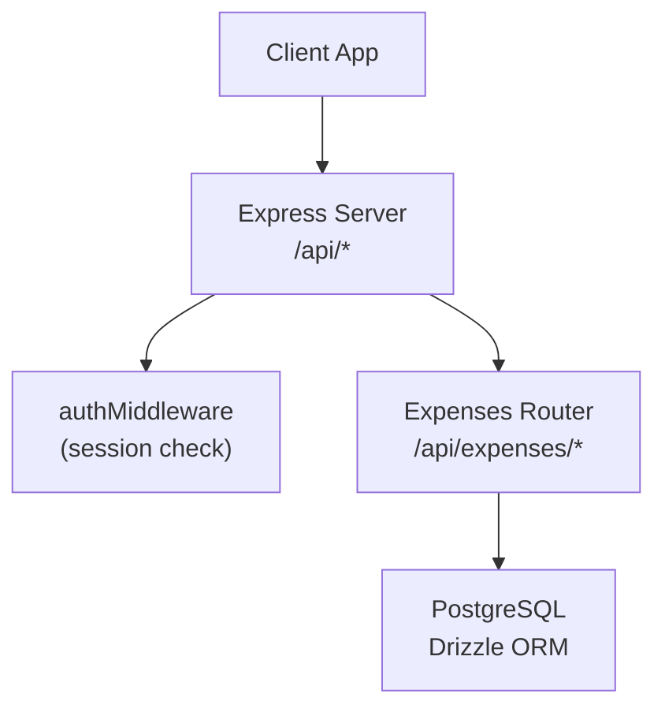
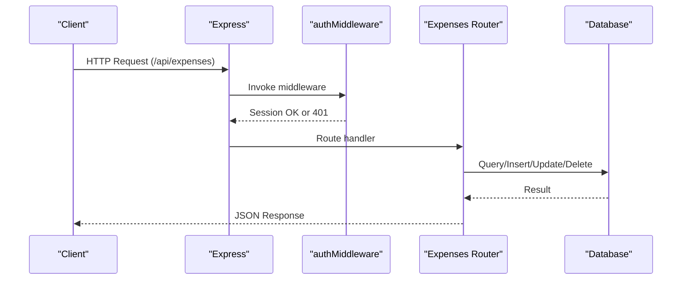
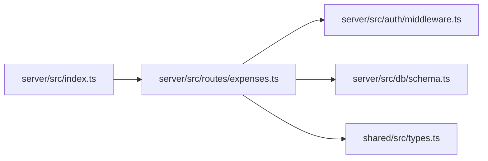

# Expense API Endpoints

<cite>
**Referenced Files in This Document**
- [expenses.ts](file://server/src/routes/expenses.ts)
- [middleware.ts](file://server/src/auth/middleware.ts)
- [schema.ts](file://server/src/db/schema.ts)
- [types.ts](file://shared/src/types.ts)
- [index.ts](file://server/src/index.ts)
</cite>

## Table of Contents
1. [Introduction](#introduction)
2. [Project Structure](#project-structure)
3. [Core Components](#core-components)
4. [Architecture Overview](#architecture-overview)
5. [Detailed Component Analysis](#detailed-component-analysis)
6. [Dependency Analysis](#dependency-analysis)
7. [Performance Considerations](#performance-considerations)
8. [Troubleshooting Guide](#troubleshooting-guide)
9. [Conclusion](#conclusion)
10. [Appendices](#appendices)

## Introduction
This document provides detailed API documentation for the expense management endpoints in RentLite. It covers all RESTful endpoints under /api/expenses, including filtering and validation rules, authentication requirements using authMiddleware, request/response schemas, error responses, and best practices for client implementation.

## Project Structure
The expense endpoints are implemented as an Express router mounted at /api/expenses. The router applies authentication middleware to protect all routes and uses Zod for input validation. Data is persisted via Drizzle ORM against a PostgreSQL schema that defines the expense entity and related enums.

**Diagram sources**
- [index.ts:51-62](file://server/src/index.ts#L51-L62)
- [expenses.ts:1-10](file://server/src/routes/expenses.ts#L1-L10)
- [middleware.ts:9-27](file://server/src/auth/middleware.ts#L9-L27)

**Section sources**
- [index.ts:51-62](file://server/src/index.ts#L51-L62)
- [expenses.ts:1-10](file://server/src/routes/expenses.ts#L1-L10)

## Core Components
- Authentication: All expense endpoints require a valid session via authMiddleware. Unauthenticated requests receive a 401 Unauthorized response.
- Validation: POST and PUT use a Zod schema to validate inputs. Required fields include propertyId, category, description, amount, and date. Optional fields include unitId, vendor, receiptUrl, isRecurring, recurringFrequency, and notes.
- Filtering: GET /api/expenses supports query parameters propertyId, category, year, and month. Results are filtered server-side based on these parameters.
- Authorization: When creating expenses, the server verifies that the requesting user owns the specified property before insertion.

**Section sources**
- [middleware.ts:9-27](file://server/src/auth/middleware.ts#L9-L27)
- [expenses.ts:11-28](file://server/src/routes/expenses.ts#L11-L28)
- [expenses.ts:31-54](file://server/src/routes/expenses.ts#L31-L54)
- [expenses.ts:66-79](file://server/src/routes/expenses.ts#L66-L79)

## Architecture Overview
The expense API follows a layered approach:
- HTTP layer (Express): Routes define endpoints and handle request/response mapping.
- Middleware layer: authMiddleware ensures authenticated access and attaches user context.
- Validation layer: Zod schemas enforce data integrity and business constraints.
- Data layer: Drizzle ORM queries interact with the database schema.

**Diagram sources**
- [index.ts:51-62](file://server/src/index.ts#L51-L62)
- [middleware.ts:9-27](file://server/src/auth/middleware.ts#L9-L27)
- [expenses.ts:31-103](file://server/src/routes/expenses.ts#L31-L103)

## Detailed Component Analysis

### Authentication Requirements
- All expense endpoints are protected by authMiddleware.
- If no valid session is present, the server responds with 401 Unauthorized.
- On success, the session is attached to the request along with userId for authorization checks.

**Section sources**
- [middleware.ts:9-27](file://server/src/auth/middleware.ts#L9-L27)

### GET /api/expenses
Retrieves expenses with optional filtering by propertyId, category, year, and month.

- Method: GET
- URL: /api/expenses
- Authentication: Required (authMiddleware)
- Query Parameters:
  - propertyId: string (UUID). Filters expenses by property.
  - category: string (enum). Filters by expense category.
  - year: integer. Filters by expense date year.
  - month: integer (1–12). Filters by expense date month.
- Response:
  - 200 OK: { data: Expense[] }
  - 401 Unauthorized: { message: "Unauthorized", code: "UNAUTHORIZED" }
- Notes:
  - Results are limited to properties owned by the authenticated user.
  - Filtering is performed after retrieving all expenses and narrowing down in memory.

Example request:
- GET /api/expenses?propertyId=uuid&category=repairs&year=2024&month=6

Example response:
- 200 OK: { data: [Expense, ...] }

**Section sources**
- [expenses.ts:31-54](file://server/src/routes/expenses.ts#L31-L54)

### GET /api/expenses/:id
Retrieves a single expense by ID.

- Method: GET
- URL: /api/expenses/:id
- Path Parameter:
  - id: string (UUID)
- Response:
  - 200 OK: { data: Expense }
  - 401 Unauthorized: { message: "Unauthorized", code: "UNAUTHORIZED" }
  - 404 Not Found: { message: "Not found", code: "NOT_FOUND" }

Example request:
- GET /api/expenses/uuid

Example response:
- 200 OK: { data: Expense }

**Section sources**
- [expenses.ts:56-63](file://server/src/routes/expenses.ts#L56-L63)

### POST /api/expenses
Creates a new expense with full validation and ownership verification.

- Method: POST
- URL: /api/expenses
- Authentication: Required (authMiddleware)
- Request Body Schema (Zod validated):
  - propertyId: string (UUID) — required
  - unitId: string (UUID) — optional, nullable
  - category: enum — required; allowed values: advertising, auto_travel, cleaning, insurance, legal_professional, management, mortgage_interest, other_interest, repairs, supplies, taxes, utilities, depreciation, other
  - description: string — required, min length 1
  - amount: number — required, must be >= 0
  - date: string — required, non-empty
  - vendor: string — optional, nullable
  - receiptUrl: string — optional, nullable
  - isRecurring: boolean — default false
  - recurringFrequency: enum — optional, nullable; allowed values: monthly, quarterly, annually
  - notes: string — optional, nullable
- Business Logic:
  - Verifies that the authenticated user owns the specified property before creation.
- Response:
  - 201 Created: { data: Expense }
  - 400 Bad Request: { message: "Validation error", code: "VALIDATION", details: flattened errors }
  - 401 Unauthorized: { message: "Unauthorized", code: "UNAUTHORIZED" }
  - 404 Not Found: { message: "Property not found", code: "NOT_FOUND" }

Example request payload:
- {
    "propertyId": "uuid",
    "unitId": "uuid|null",
    "category": "repairs",
    "description": "Fix leaky faucet",
    "amount": 150.00,
    "date": "2024-06-15",
    "vendor": "Plumber Inc.",
    "receiptUrl": "https://example.com/receipt.pdf",
    "isRecurring": false,
    "recurringFrequency": null,
    "notes": "Emergency repair"
  }

Example response:
- 201 Created: { data: Expense }

**Section sources**
- [expenses.ts:11-28](file://server/src/routes/expenses.ts#L11-L28)
- [expenses.ts:66-79](file://server/src/routes/expenses.ts#L66-L79)

### PUT /api/expenses/:id
Partially updates an existing expense.

- Method: PUT
- URL: /api/expenses/:id
- Path Parameter:
  - id: string (UUID)
- Authentication: Required (authMiddleware)
- Request Body Schema (Zod partial validation):
  - Any subset of the POST fields above is accepted.
- Response:
  - 200 OK: { data: Expense }
  - 400 Bad Request: { message: "Validation error", code: "VALIDATION", details: flattened errors }
  - 401 Unauthorized: { message: "Unauthorized", code: "UNAUTHORIZED" }
  - 404 Not Found: { message: "Not found", code: "NOT_FOUND" }

Example request payload:
- { "amount": 175.00, "notes": "Updated cost" }

Example response:
- 200 OK: { data: Expense }

**Section sources**
- [expenses.ts:81-95](file://server/src/routes/expenses.ts#L81-L95)

### DELETE /api/expenses/:id
Deletes an expense by ID.

- Method: DELETE
- URL: /api/expenses/:id
- Path Parameter:
  - id: string (UUID)
- Authentication: Required (authMiddleware)
- Response:
  - 200 OK: { message: "Deleted" }
  - 401 Unauthorized: { message: "Unauthorized", code: "UNAUTHORIZED" }
  - 404 Not Found: { message: "Not found", code: "NOT_FOUND" }

Example request:
- DELETE /api/expenses/uuid

Example response:
- 200 OK: { message: "Deleted" }

**Section sources**
- [expenses.ts:97-103](file://server/src/routes/expenses.ts#L97-L103)

### Data Model and Enums
The expense entity and related enums are defined in the database schema. The shared types mirror the structure for type safety across the stack.

Key fields:
- id: UUID primary key
- propertyId: UUID foreign key to property
- unitId: UUID foreign key to unit (nullable)
- category: Enum from expenseCategoryEnum
- description: Text
- amount: Real (numeric)
- date: Date
- vendor: Text (nullable)
- receiptUrl: Text (nullable)
- isRecurring: Boolean (default false)
- recurringFrequency: Enum from recurringFrequencyEnum (nullable)
- notes: Text (nullable)
- createdAt, updatedAt: Timestamps

Allowed categories:
- advertising, auto_travel, cleaning, insurance, legal_professional, management, mortgage_interest, other_interest, repairs, supplies, taxes, utilities, depreciation, other

Allowed recurring frequencies:
- monthly, quarterly, annually

**Section sources**
- [schema.ts:329-348](file://server/src/db/schema.ts#L329-L348)
- [schema.ts:73-88](file://server/src/db/schema.ts#L73-L88)
- [schema.ts:131-135](file://server/src/db/schema.ts#L131-L135)
- [types.ts:116-149](file://shared/src/types.ts#L116-L149)

## Dependency Analysis
- The expenses router depends on:
  - Express Router for routing
  - Zod for validation
  - Drizzle ORM for querying and mutating data
  - authMiddleware for session-based authentication
- The main application mounts the expenses router under /api/expenses.

**Diagram sources**
- [index.ts:51-62](file://server/src/index.ts#L51-L62)
- [expenses.ts:1-10](file://server/src/routes/expenses.ts#L1-L10)
- [middleware.ts:9-27](file://server/src/auth/middleware.ts#L9-L27)
- [schema.ts:329-348](file://server/src/db/schema.ts#L329-L348)
- [types.ts:116-149](file://shared/src/types.ts#L116-L149)

**Section sources**
- [index.ts:51-62](file://server/src/index.ts#L51-L62)
- [expenses.ts:1-10](file://server/src/routes/expenses.ts#L1-L10)

## Performance Considerations
- Filtering strategy: Current GET /api/expenses loads all expenses into memory and filters client-side. For large datasets, consider server-side filtering using Drizzle query conditions to reduce memory usage and improve performance.
- Pagination: No pagination is currently implemented. Adding page and pageSize query parameters would help manage large result sets.
- Database indexes: Ensure indexes exist on frequently queried columns such as propertyId, category, and date to optimize future server-side filtering and sorting.
- Rate limiting: No rate limiting is configured in the current setup. Implementing rate limiting can protect endpoints from abuse and ensure fair usage.

[No sources needed since this section provides general guidance]

## Troubleshooting Guide
Common issues and resolutions:
- 401 Unauthorized: Ensure a valid session is present. Check that cookies or headers are correctly sent to maintain the session.
- 400 Validation Error: Review request body against the Zod schema. Ensure required fields are present and types match expectations. Use the provided details field to identify specific validation failures.
- 404 Not Found: Verify that the expense or property exists and belongs to the authenticated user. For POST, confirm property ownership.
- Filtering returns empty results: Confirm query parameters are correct and match available data. Note that month is 1-based and year should match the expense date.

**Section sources**
- [middleware.ts:18-21](file://server/src/auth/middleware.ts#L18-L21)
- [expenses.ts:66-79](file://server/src/routes/expenses.ts#L66-L79)
- [expenses.ts:56-63](file://server/src/routes/expenses.ts#L56-L63)
- [expenses.ts:97-103](file://server/src/routes/expenses.ts#L97-L103)

## Conclusion
The RentLite expense API provides secure, validated CRUD operations for managing expenses. Authentication is enforced via authMiddleware, and input validation is handled by Zod. Filtering is supported for property, category, year, and month. To scale effectively, consider implementing server-side filtering, pagination, and rate limiting.

[No sources needed since this section summarizes without analyzing specific files]

## Appendices

### Request/Response Schemas Summary
- GET /api/expenses
  - Query: propertyId, category, year, month
  - Response: { data: Expense[] }
- GET /api/expenses/:id
  - Response: { data: Expense }
- POST /api/expenses
  - Body: Full expense object per Zod schema
  - Response: { data: Expense }
- PUT /api/expenses/:id
  - Body: Partial expense object per Zod schema
  - Response: { data: Expense }
- DELETE /api/expenses/:id
  - Response: { message: "Deleted" }

**Section sources**
- [expenses.ts:31-103](file://server/src/routes/expenses.ts#L31-L103)
- [types.ts:116-149](file://shared/src/types.ts#L116-L149)

### Security and Best Practices
- Always send authenticated requests with a valid session.
- Validate payloads on the client side to provide immediate feedback, but rely on server-side validation for security.
- Sanitize URLs and file paths for receiptUrl to prevent injection attacks.
- Limit exposure of sensitive data in responses if additional fields are added later.
- Consider adding rate limiting and CORS hardening for production environments.

[No sources needed since this section provides general guidance]