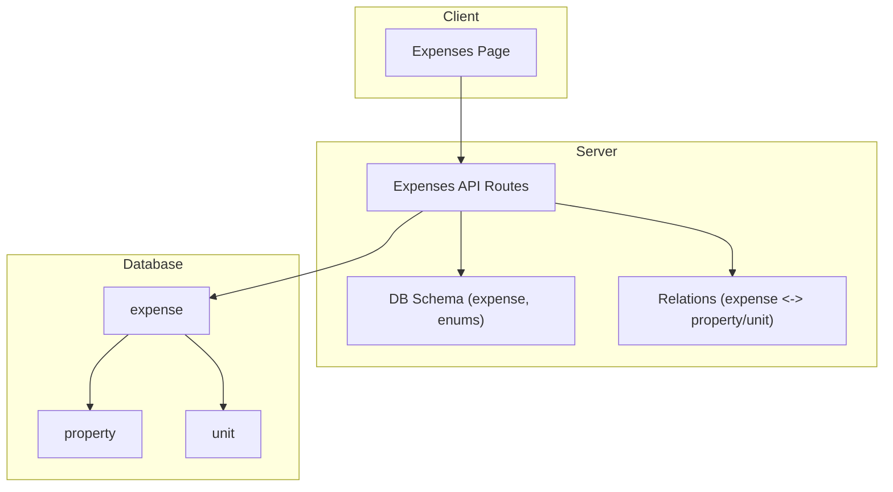
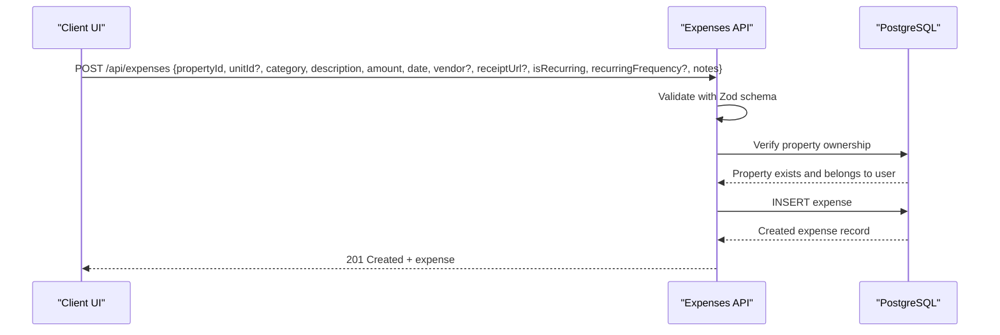
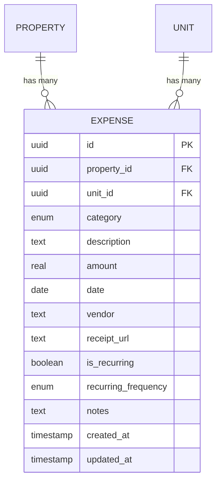
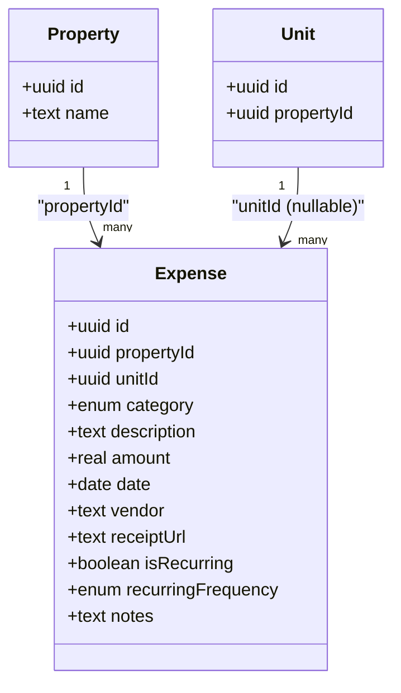
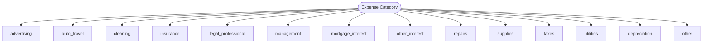
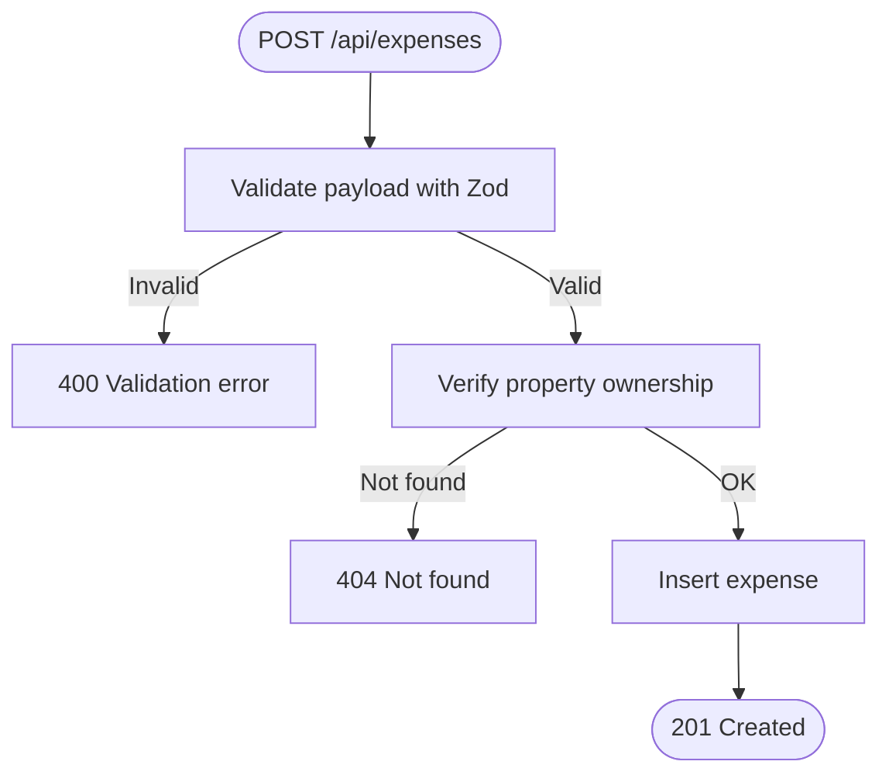
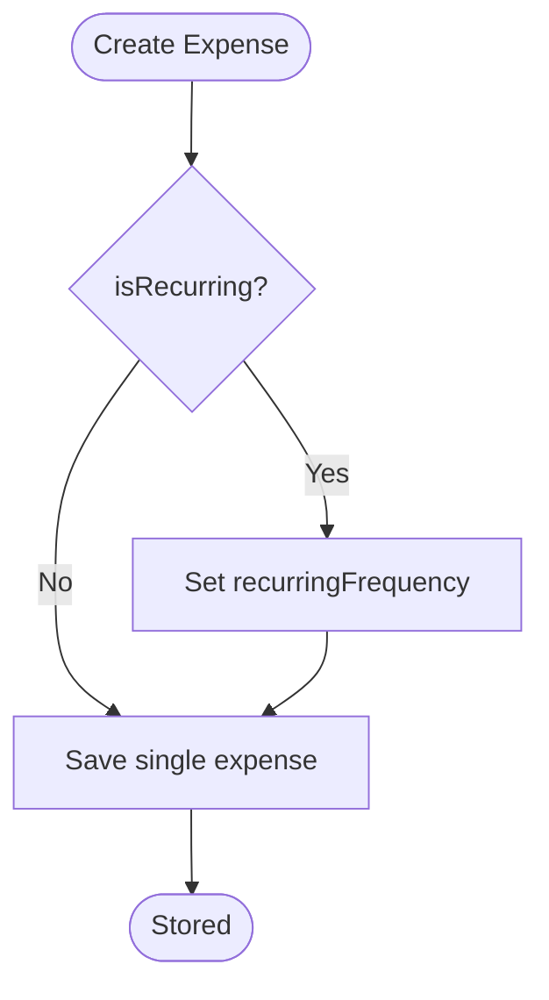
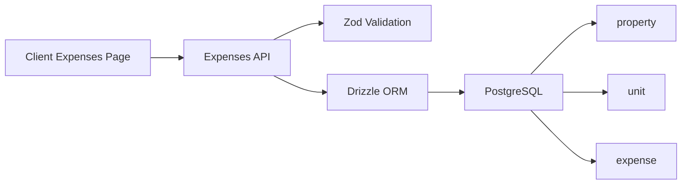

# Expense Data Model

<cite>
**Referenced Files in This Document**
- [schema.ts](file://server/src/db/schema.ts)
- [relations.ts](file://server/src/db/relations.ts)
- [expenses.ts](file://server/src/routes/expenses.ts)
- [types.ts](file://shared/src/types.ts)
- [Expenses.tsx](file://client/src/pages/Expenses.tsx)
</cite>

## Table of Contents
1. [Introduction](#introduction)
2. [Project Structure](#project-structure)
3. [Core Components](#core-components)
4. [Architecture Overview](#architecture-overview)
5. [Detailed Component Analysis](#detailed-component-analysis)
6. [Dependency Analysis](#dependency-analysis)
7. [Performance Considerations](#performance-considerations)
8. [Troubleshooting Guide](#troubleshooting-guide)
9. [Conclusion](#conclusion)

## Introduction
This document describes the expense data model in RentLite, focusing on the expense entity schema, relationships to properties and units, category system, validation rules, recurring expense structure, and performance considerations for large datasets. It is intended for both technical and non-technical readers to understand how expenses are modeled, validated, and used across the application.

## Project Structure
The expense model spans several layers:
- Database schema defines the expense table, enums, and foreign keys.
- Relations define how expense connects to property and unit.
- API routes implement validation and CRUD operations for expenses.
- Shared types provide a TypeScript contract for the expense shape.
- Client UI renders filters, forms, and lists for expenses.

**Diagram sources**
- [schema.ts:329-348](file://server/src/db/schema.ts#L329-L348)
- [relations.ts:82-86](file://server/src/db/relations.ts#L82-L86)
- [expenses.ts:1-106](file://server/src/routes/expenses.ts#L1-L106)
- [Expenses.tsx:1-360](file://client/src/pages/Expenses.tsx#L1-L360)

**Section sources**
- [schema.ts:329-348](file://server/src/db/schema.ts#L329-L348)
- [relations.ts:82-86](file://server/src/db/relations.ts#L82-L86)
- [expenses.ts:1-106](file://server/src/routes/expenses.ts#L1-L106)
- [Expenses.tsx:1-360](file://client/src/pages/Expenses.tsx#L1-L360)

## Core Components
- Expense entity fields: id, propertyId, unitId, category, description, amount, date, vendor, receiptUrl, isRecurring, recurringFrequency, notes, createdAt, updatedAt.
- Enums:
  - expense_category: advertising, auto_travel, cleaning, insurance, legal_professional, management, mortgage_interest, other_interest, repairs, supplies, taxes, utilities, depreciation, other.
  - recurring_frequency: monthly, quarterly, annually.
- Relationships:
  - expense.propertyId references property.id (required).
  - expense.unitId references unit.id (optional; set to null if deleted).
- Validation:
  - Server-side Zod schema enforces allowed categories, numeric amount >= 0, required fields, and optional recurring frequency when marked as recurring.
- Types:
  - Shared TypeScript interface Expense mirrors the database schema and enums.

**Section sources**
- [schema.ts:73-88](file://server/src/db/schema.ts#L73-L88)
- [schema.ts:131-135](file://server/src/db/schema.ts#L131-L135)
- [schema.ts:329-348](file://server/src/db/schema.ts#L329-L348)
- [expenses.ts:11-28](file://server/src/routes/expenses.ts#L11-L28)
- [types.ts:118-149](file://shared/src/types.ts#L118-L149)

## Architecture Overview
The expense workflow involves client interactions, server validation, and database persistence with referential integrity enforced by foreign keys.

**Diagram sources**
- [expenses.ts:65-79](file://server/src/routes/expenses.ts#L65-L79)
- [schema.ts:329-348](file://server/src/db/schema.ts#L329-L348)

## Detailed Component Analysis

### Expense Entity Schema
- Primary key: id (UUID).
- propertyId: UUID, not null, references property.id with cascade delete.
- unitId: UUID, nullable, references unit.id with set null on delete.
- category: Enum from expense_category; not null.
- description: Text; not null.
- amount: Real number; not null.
- date: Date; not null.
- vendor: Text; optional.
- receiptUrl: Text; optional.
- isRecurring: Boolean; default false.
- recurringFrequency: Enum from recurring_frequency; optional.
- notes: Text; optional.
- Timestamps: createdAt, updatedAt.

**Diagram sources**
- [schema.ts:191-208](file://server/src/db/schema.ts#L191-L208)
- [schema.ts:212-226](file://server/src/db/schema.ts#L212-L226)
- [schema.ts:329-348](file://server/src/db/schema.ts#L329-L348)

**Section sources**
- [schema.ts:329-348](file://server/src/db/schema.ts#L329-L348)

### Relationships to Properties and Units
- Multi-property expenses: Each expense is tied to exactly one property via propertyId. To represent an expense that affects multiple properties, create separate expense records per property or use higher-level aggregation logic in reports.
- Unit-level allocation: If an expense applies to a specific unit, set unitId; otherwise leave it null for property-wide costs.
- Referential integrity:
  - Deleting a property cascades deletes to related expenses.
  - Deleting a unit sets expense.unitId to null rather than deleting the expense.

**Diagram sources**
- [schema.ts:191-208](file://server/src/db/schema.ts#L191-L208)
- [schema.ts:212-226](file://server/src/db/schema.ts#L212-L226)
- [schema.ts:329-348](file://server/src/db/schema.ts#L329-L348)
- [relations.ts:82-86](file://server/src/db/relations.ts#L82-L86)

**Section sources**
- [schema.ts:329-348](file://server/src/db/schema.ts#L329-L348)
- [relations.ts:82-86](file://server/src/db/relations.ts#L82-L86)

### Expense Categories and Tax Implications
- Predefined categories: advertising, auto_travel, cleaning, insurance, legal_professional, management, mortgage_interest, other_interest, repairs, supplies, taxes, utilities, depreciation, other.
- These categories align with common Schedule E lines for rental income reporting. For example:
  - mortgage_interest, other_interest, taxes, insurance, depreciation, repairs, supplies, utilities, management, advertising, auto_travel, cleaning, legal_professional are typical deductible categories.
- Implementation note: The application stores category as a strict enum; tax treatment is conceptual and should be reviewed with a tax professional. Reports can group by category to approximate Schedule E totals.

**Diagram sources**
- [schema.ts:73-88](file://server/src/db/schema.ts#L73-L88)
- [types.ts:118-132](file://shared/src/types.ts#L118-L132)

**Section sources**
- [schema.ts:73-88](file://server/src/db/schema.ts#L73-L88)
- [types.ts:118-132](file://shared/src/types.ts#L118-L132)

### Validation Rules, Data Types, and Constraints
- Server-side validation (Zod):
  - propertyId: string UUID.
  - unitId: string UUID, optional.
  - category: must be one of the predefined expense categories.
  - description: non-empty string.
  - amount: number >= 0.
  - date: non-empty string (ISO date expected).
  - vendor: optional string.
  - receiptUrl: optional string.
  - isRecurring: boolean, default false.
  - recurringFrequency: optional enum monthly|quarterly|annually.
  - notes: optional string.
- Database constraints:
  - Not-null constraints on propertyId, category, description, amount, date, isRecurring.
  - Foreign keys enforce referential integrity to property and unit tables.
- Client-side:
  - Form fields mirror server expectations; amounts converted to numbers before submission.

**Diagram sources**
- [expenses.ts:11-28](file://server/src/routes/expenses.ts#L11-L28)
- [expenses.ts:65-79](file://server/src/routes/expenses.ts#L65-L79)

**Section sources**
- [expenses.ts:11-28](file://server/src/routes/expenses.ts#L11-L28)
- [schema.ts:329-348](file://server/src/db/schema.ts#L329-L348)

### Recurring Expenses
- Structure:
  - isRecurring: flag indicating whether the expense repeats.
  - recurringFrequency: one of monthly, quarterly, annually.
- Behavior:
  - The current implementation stores each occurrence as a single expense record. The recurring flags enable UI indicators and potential future automation for generating future instances.
- Example usage:
  - An annual insurance payment could be recorded with isRecurring=true and recurringFrequency=annually.
  - Monthly utilities could be recorded with isRecurring=true and recurringFrequency=monthly.

**Diagram sources**
- [schema.ts:329-348](file://server/src/db/schema.ts#L329-L348)
- [schema.ts:131-135](file://server/src/db/schema.ts#L131-L135)
- [expenses.ts:11-28](file://server/src/routes/expenses.ts#L11-L28)

**Section sources**
- [schema.ts:329-348](file://server/src/db/schema.ts#L329-L348)
- [schema.ts:131-135](file://server/src/db/schema.ts#L131-L135)
- [expenses.ts:11-28](file://server/src/routes/expenses.ts#L11-L28)

### Examples of Expense Records
- Single-property, unit-specific repair:
  - propertyId: <UUID>, unitId: <UUID>, category: repairs, description: "Fix kitchen faucet", amount: 150.00, date: "2024-06-10", vendor: "Local Plumber", receiptUrl: "/receipts/...".
- Multi-property expense (represented as multiple records):
  - Record A: propertyId: <Property A>, category: cleaning, amount: 200.00, date: "2024-07-01".
  - Record B: propertyId: <Property B>, category: cleaning, amount: 200.00, date: "2024-07-01".
- Recurring annual insurance:
  - propertyId: <UUID>, category: insurance, isRecurring: true, recurringFrequency: annually, amount: 1200.00, date: "2024-01-01".

[No sources needed since this section provides illustrative examples]

## Dependency Analysis
- Expense depends on:
  - property (via propertyId) for ownership and filtering.
  - unit (via unitId) for granular cost allocation.
- API layer depends on:
  - Zod for input validation.
  - Drizzle ORM for querying and inserting.
- Client depends on:
  - API endpoints for listing, creating, and deleting expenses.
  - UI components for rendering filters and forms.

**Diagram sources**
- [expenses.ts:1-106](file://server/src/routes/expenses.ts#L1-L106)
- [schema.ts:329-348](file://server/src/db/schema.ts#L329-L348)
- [relations.ts:82-86](file://server/src/db/relations.ts#L82-L86)

**Section sources**
- [expenses.ts:1-106](file://server/src/routes/expenses.ts#L1-L106)
- [schema.ts:329-348](file://server/src/db/schema.ts#L329-L348)
- [relations.ts:82-86](file://server/src/db/relations.ts#L82-L86)

## Performance Considerations
- Filtering and indexing:
  - Add indexes on expense.propertyId and expense.date to optimize queries by property and time ranges.
  - Consider composite indexes on (propertyId, date) for common report queries.
- Query patterns:
  - Avoid loading all expenses into memory without pagination; implement server-side pagination for large datasets.
  - Use server-side filtering by year/month/category to reduce payload size.
- Aggregation:
  - For financial reports, compute totals server-side using SQL aggregations grouped by property and period.
- Cascading deletes:
  - Deleting a property cascades to expenses; ensure downstream processes handle deletions gracefully.

[No sources needed since this section provides general guidance]

## Troubleshooting Guide
- Validation errors:
  - Ensure category matches one of the predefined values.
  - Ensure amount is a non-negative number.
  - Ensure date is a valid ISO date string.
- Ownership checks:
  - Creating an expense requires propertyId belonging to the authenticated user; otherwise, expect a 404.
- Referential integrity:
  - Deleting a unit will set expense.unitId to null; verify your UI handles null unitId gracefully.
  - Deleting a property will cascade-delete associated expenses.

**Section sources**
- [expenses.ts:11-28](file://server/src/routes/expenses.ts#L11-L28)
- [expenses.ts:65-79](file://server/src/routes/expenses.ts#L65-L79)
- [schema.ts:329-348](file://server/src/db/schema.ts#L329-L348)

## Conclusion
RentLite’s expense data model provides a robust foundation for tracking property-related costs with clear categorization, flexible unit-level allocation, and support for recurring expenses. Strong validation and referential integrity ensure data quality, while thoughtful indexing and server-side filtering will support scalability as datasets grow. For tax reporting, leverage the standardized categories to approximate Schedule E line items, and consult a tax professional for precise treatment.