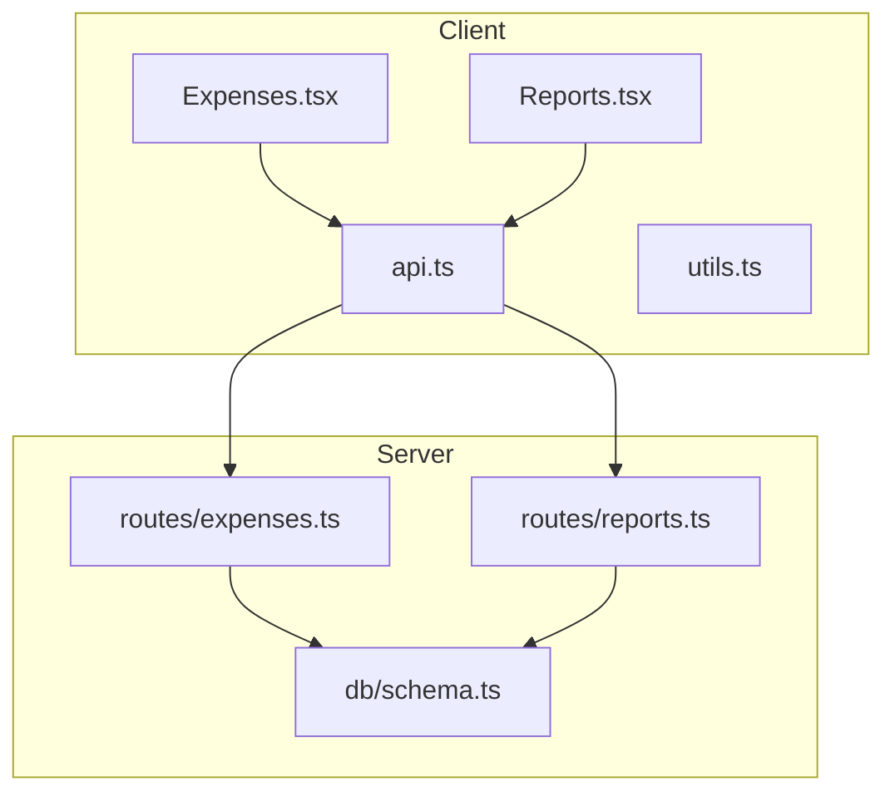
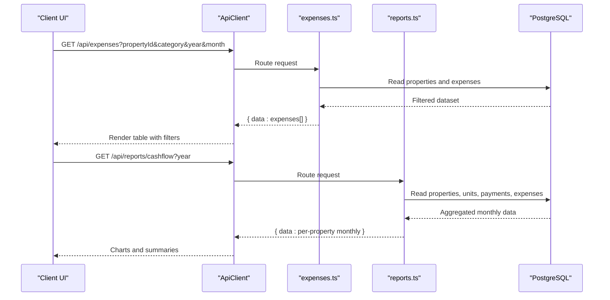
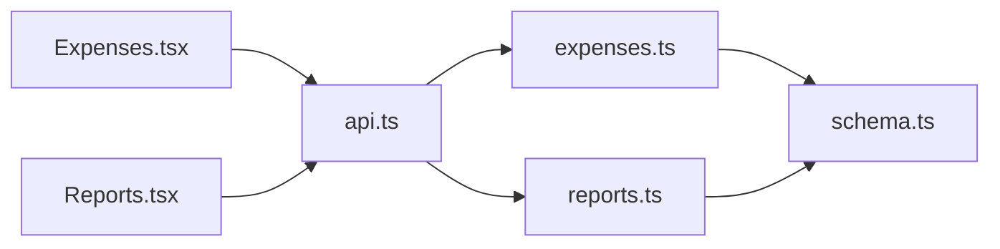
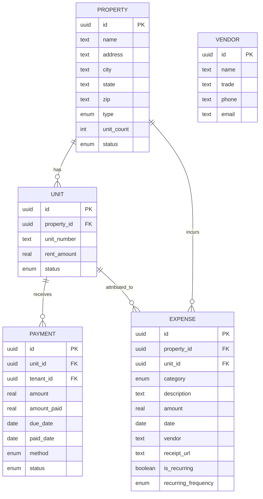

# Expense Reporting & Analytics

<cite>
**Referenced Files in This Document**
- [Expenses.tsx](file://client/src/pages/Expenses.tsx)
- [Reports.tsx](file://client/src/pages/Reports.tsx)
- [expenses.ts](file://server/src/routes/expenses.ts)
- [reports.ts](file://server/src/routes/reports.ts)
- [schema.ts](file://server/src/db/schema.ts)
- [utils.ts](file://client/src/lib/utils.ts)
- [api.ts](file://client/src/lib/api.ts)
</cite>

## Table of Contents
1. Introduction
2. Project Structure
3. Core Components
4. Architecture Overview
5. Detailed Component Analysis
6. Dependency Analysis
7. Performance Considerations
8. Troubleshooting Guide
9. Conclusion
10. Appendices

## Introduction
This document explains the expense reporting and analytics features in RentLite. It covers how expenses are categorized, filtered, and visualized; how monthly summaries, annual reports, category breakdowns, and trend analysis are generated; export capabilities for CSV; tax preparation support via Schedule E mapping; and performance metrics such as per-property totals and net income trends. Where applicable, it also outlines opportunities to extend budgeting, variance analysis, forecasting, and accounting integrations.

## Project Structure
RentLite’s expense and reporting functionality spans client pages, server routes, and database schema:
- Client pages provide user interfaces for entering expenses and viewing reports with charts and exports.
- Server routes implement filtering, aggregation, and report generation.
- Database schema defines enums and tables that standardize categories and link expenses to properties and units.

**Diagram sources**
- [Expenses.tsx:1-360](file://client/src/pages/Expenses.tsx#L1-L360)
- [Reports.tsx:1-382](file://client/src/pages/Reports.tsx#L1-L382)
- [expenses.ts:1-106](file://server/src/routes/expenses.ts#L1-L106)
- [reports.ts:1-186](file://server/src/routes/reports.ts#L1-L186)
- [schema.ts:73-88](file://server/src/db/schema.ts#L73-L88)

**Section sources**
- [Expenses.tsx:1-360](file://client/src/pages/Expenses.tsx#L1-L360)
- [Reports.tsx:1-382](file://client/src/pages/Reports.tsx#L1-L382)
- [expenses.ts:1-106](file://server/src/routes/expenses.ts#L1-L106)
- [reports.ts:1-186](file://server/src/routes/reports.ts#L1-L186)
- [schema.ts:73-88](file://server/src/db/schema.ts#L73-L88)

## Core Components
- Expense entry and management: Create, filter, and delete expenses by property, category, year, and month.
- Reporting dashboards: Cash flow (monthly), Profit & Loss (annual or quarterly), and Schedule E (tax-ready).
- Visualization: Bar and line charts for cash flow and net income trends; per-property summaries.
- Export: CSV downloads for each report type.
- Tax mapping: Predefined Schedule E lines mapped from expense categories.

Key implementation references:
- Expense categories and UI filters: [Expenses.tsx:20-35](file://client/src/pages/Expenses.tsx#L20-L35), [Expenses.tsx:62-77](file://client/src/pages/Expenses.tsx#L62-L77)
- Report endpoints and logic: [reports.ts:28-77](file://server/src/routes/reports.ts#L28-L77), [reports.ts:79-129](file://server/src/routes/reports.ts#L79-L129), [reports.ts:131-183](file://server/src/routes/reports.ts#L131-L183)
- Category enum and expense model: [schema.ts:73-88](file://server/src/db/schema.ts#L73-L88), [schema.ts:329-348](file://server/src/db/schema.ts#L329-L348)

**Section sources**
- [Expenses.tsx:20-77](file://client/src/pages/Expenses.tsx#L20-L77)
- [reports.ts:28-183](file://server/src/routes/reports.ts#L28-L183)
- [schema.ts:73-88](file://server/src/db/schema.ts#L73-L88)
- [schema.ts:329-348](file://server/src/db/schema.ts#L329-L348)

## Architecture Overview
The system follows a typical React + Express architecture:
- The client uses React Query to fetch data from REST endpoints and renders interactive reports.
- The server validates inputs, enforces ownership, aggregates data across payments and expenses, and returns structured JSON for visualization and export.
- Data is persisted using Drizzle ORM against PostgreSQL, with strict enums for categories and statuses.

**Diagram sources**
- [Expenses.tsx:62-77](file://client/src/pages/Expenses.tsx#L62-L77)
- [expenses.ts:31-54](file://server/src/routes/expenses.ts#L31-L54)
- [reports.ts:28-77](file://server/src/routes/reports.ts#L28-L77)
- [api.ts:26-54](file://client/src/lib/api.ts#L26-L54)

## Detailed Component Analysis

### Expense Categorization and Classification
- Predefined categories align with common landlord deductions and map directly to Schedule E lines on the server side.
- Categories are enforced at both the schema level (enum) and route validation layer (Zod), ensuring consistency.
- UI provides a curated list of categories when adding expenses and supports badge styling based on category groupings.

Implementation highlights:
- Schema enum for categories: [schema.ts:73-88](file://server/src/db/schema.ts#L73-L88)
- Zod validation for creation/update: [expenses.ts:11-28](file://server/src/routes/expenses.ts#L11-L28)
- UI category list and variant mapping: [Expenses.tsx:20-42](file://client/src/pages/Expenses.tsx#L20-L42)
- Schedule E mapping on server: [reports.ts:11-26](file://server/src/routes/reports.ts#L11-L26)

**Section sources**
- [schema.ts:73-88](file://server/src/db/schema.ts#L73-L88)
- [expenses.ts:11-28](file://server/src/routes/expenses.ts#L11-L28)
- [Expenses.tsx:20-42](file://client/src/pages/Expenses.tsx#L20-L42)
- [reports.ts:11-26](file://server/src/routes/reports.ts#L11-L26)

### Filtering and Search Capabilities
- Filters supported by the Expenses page:
  - Property: dropdown populated from user-owned properties
  - Category: predefined list
  - Year: last five years
  - Month: all months
- Server-side filtering applies property ownership scoping and optional filters for category, year, and month.

Implementation highlights:
- Client filter state and query params: [Expenses.tsx:62-77](file://client/src/pages/Expenses.tsx#L62-L77)
- Server filter logic: [expenses.ts:31-54](file://server/src/routes/expenses.ts#L31-L54)

Note: Amount range filtering is not currently implemented in the UI or server routes.

**Section sources**
- [Expenses.tsx:62-77](file://client/src/pages/Expenses.tsx#L62-L77)
- [expenses.ts:31-54](file://server/src/routes/expenses.ts#L31-L54)

### Reporting Features
- Monthly Cash Flow: Per property, monthly income vs expenses and net; aggregated view across properties for charts.
- Profit & Loss: Annual or quarterly totals per property with income, expenses, and net income.
- Schedule E: Grouped expense line items mapped to IRS Schedule E lines with totals and net income.

Implementation highlights:
- Cash flow endpoint and aggregation: [reports.ts:28-77](file://server/src/routes/reports.ts#L28-L77)
- P&L endpoint with optional quarter filter: [reports.ts:131-183](file://server/src/routes/reports.ts#L131-L183)
- Schedule E endpoint and line mapping: [reports.ts:79-129](file://server/src/routes/reports.ts#L79-L129)
- Client tabs and chart rendering: [Reports.tsx:31-35](file://client/src/pages/Reports.tsx#L31-L35), [Reports.tsx:84-100](file://client/src/pages/Reports.tsx#L84-L100), [Reports.tsx:184-253](file://client/src/pages/Reports.tsx#L184-L253), [Reports.tsx:255-313](file://client/src/pages/Reports.tsx#L255-L313), [Reports.tsx:315-378](file://client/src/pages/Reports.tsx#L315-L378)

**Section sources**
- [reports.ts:28-183](file://server/src/routes/reports.ts#L28-L183)
- [Reports.tsx:31-35](file://client/src/pages/Reports.tsx#L31-L35)
- [Reports.tsx:84-100](file://client/src/pages/Reports.tsx#L84-L100)
- [Reports.tsx:184-378](file://client/src/pages/Reports.tsx#L184-L378)

### Export Formats and Integration
- CSV export is available for all three report types directly from the Reports page.
- Exports include headers and rows tailored to each report:
  - Cash flow: Property, Month, Income, Expenses, Net
  - P&L: Property, Income, Expenses, Net Income, Period
  - Schedule E: Property, Address, Rent Received, Line, Category, Amount, Total Expenses, Net Income

Implementation highlights:
- CSV download function and usage: [Reports.tsx:47-58](file://client/src/pages/Reports.tsx#L47-L58), [Reports.tsx:102-135](file://client/src/pages/Reports.tsx#L102-L135)

Integration note:
- No direct integration with external accounting software is implemented. CSV files can be imported into third-party accounting systems manually.

**Section sources**
- [Reports.tsx:47-58](file://client/src/pages/Reports.tsx#L47-L58)
- [Reports.tsx:102-135](file://client/src/pages/Reports.tsx#L102-L135)

### Budget Comparison, Variance Analysis, and Forecasting
- Current implementation does not include budgets, variance calculations, or forecasting.
- Recommended extension points:
  - Add budget entities linked to properties/categories and periods.
  - Compute variance as Actual vs Budget per category and period.
  - Implement simple forecasting using historical averages or seasonality models.

[No sources needed since this section proposes future enhancements]

### Visualization Components
- Charts:
  - Bar chart for monthly income vs expenses (aggregated across properties).
  - Line chart for net income trend over months.
  - Per-property cards showing totals and progress bars for expense-to-income ratio.
- Utilities:
  - Currency formatting and date formatting helpers used throughout.

Implementation highlights:
- Chart components and data transformation: [Reports.tsx:18-29](file://client/src/pages/Reports.tsx#L18-L29), [Reports.tsx:84-100](file://client/src/pages/Reports.tsx#L84-L100), [Reports.tsx:184-253](file://client/src/pages/Reports.tsx#L184-L253)
- Formatting utilities: [utils.ts:8-34](file://client/src/lib/utils.ts#L8-L34)

**Section sources**
- [Reports.tsx:18-29](file://client/src/pages/Reports.tsx#L18-L29)
- [Reports.tsx:84-100](file://client/src/pages/Reports.tsx#L84-L100)
- [Reports.tsx:184-253](file://client/src/pages/Reports.tsx#L184-L253)
- [utils.ts:8-34](file://client/src/lib/utils.ts#L8-L34)

### Performance Metrics
- Per-property metrics:
  - Total income, total expenses, net income (P&L and Cash Flow).
  - Monthly breakdowns for income and expenses enabling trend analysis.
- Aggregate metrics:
  - Monthly totals across all properties for cash flow charts.
  - Net income trend line for portfolio-level performance.

Implementation highlights:
- Aggregation logic: [reports.ts:43-77](file://server/src/routes/reports.ts#L43-L77), [reports.ts:146-183](file://server/src/routes/reports.ts#L146-L183)
- Display of per-property summaries: [Reports.tsx:226-253](file://client/src/pages/Reports.tsx#L226-L253)

**Section sources**
- [reports.ts:43-77](file://server/src/routes/reports.ts#L43-L77)
- [reports.ts:146-183](file://server/src/routes/reports.ts#L146-L183)
- [Reports.tsx:226-253](file://client/src/pages/Reports.tsx#L226-L253)

### Tax Preparation Features
- Schedule E helper groups expenses by category and maps them to IRS Schedule E lines.
- Supports rent received calculation and net income computation per property.

Implementation highlights:
- Schedule E line mapping: [reports.ts:11-26](file://server/src/routes/reports.ts#L11-L26)
- Schedule E endpoint: [reports.ts:79-129](file://server/src/routes/reports.ts#L79-L129)

**Section sources**
- [reports.ts:11-26](file://server/src/routes/reports.ts#L11-L26)
- [reports.ts:79-129](file://server/src/routes/reports.ts#L79-L129)

### Common Reporting Scenarios and Customization Options
- Monthly cash flow review:
  - Use the Cash Flow tab to compare income vs expenses per month and identify trends.
- Annual profit and loss:
  - Use the P&L tab to see yearly totals per property; optionally filter by quarter where supported.
- Tax preparation:
  - Use the Schedule E tab to review category totals aligned with IRS lines; export CSV for import into tax software.
- Customization options:
  - Filter expenses by property, category, year, and month to tailor views.
  - Export any report to CSV for further analysis or sharing.

[No sources needed since this section summarizes usage patterns]

## Dependency Analysis
- Client dependencies:
  - React Query for data fetching and caching.
  - Recharts for charts.
  - UI primitives for forms, buttons, and cards.
- Server dependencies:
  - Express router for endpoints.
  - Drizzle ORM for database queries.
  - Zod for input validation.
  - Authentication middleware for access control.

**Diagram sources**
- [Expenses.tsx:1-360](file://client/src/pages/Expenses.tsx#L1-L360)
- [Reports.tsx:1-382](file://client/src/pages/Reports.tsx#L1-L382)
- [api.ts:1-82](file://client/src/lib/api.ts#L1-L82)
- [expenses.ts:1-106](file://server/src/routes/expenses.ts#L1-L106)
- [reports.ts:1-186](file://server/src/routes/reports.ts#L1-L186)
- [schema.ts:73-88](file://server/src/db/schema.ts#L73-L88)

**Section sources**
- [Expenses.tsx:1-360](file://client/src/pages/Expenses.tsx#L1-L360)
- [Reports.tsx:1-382](file://client/src/pages/Reports.tsx#L1-L382)
- [api.ts:1-82](file://client/src/lib/api.ts#L1-L82)
- [expenses.ts:1-106](file://server/src/routes/expenses.ts#L1-L106)
- [reports.ts:1-186](file://server/src/routes/reports.ts#L1-L186)
- [schema.ts:73-88](file://server/src/db/schema.ts#L73-L88)

## Performance Considerations
- Data retrieval:
  - Endpoints load all relevant records and filter in memory; consider indexing by userId, propertyId, and date fields for large datasets.
- Aggregation:
  - Monthly aggregations iterate over payments and expenses; pre-aggregating or using database-level grouping could improve performance.
- Caching:
  - React Query caches results by query keys; ensure appropriate invalidation on mutations to keep UI fresh without excessive re-fetches.
- Export:
  - CSV generation occurs client-side; for very large datasets, consider server-side streaming exports.

[No sources needed since this section provides general guidance]

## Troubleshooting Guide
- Unauthorized errors:
  - If the client receives a 401, it redirects to login. Ensure sessions are active and credentials are valid.
- Validation errors:
  - Creating or updating expenses validates required fields and category enums; check error responses for details.
- Not found errors:
  - Deleting or retrieving non-existent expenses returns 404; verify IDs and ownership.

Implementation references:
- Client error handling and redirect: [api.ts:39-51](file://client/src/lib/api.ts#L39-L51)
- Server validation and error responses: [expenses.ts:66-79](file://server/src/routes/expenses.ts#L66-L79), [expenses.ts:81-95](file://server/src/routes/expenses.ts#L81-L95), [expenses.ts:97-103](file://server/src/routes/expenses.ts#L97-L103)

**Section sources**
- [api.ts:39-51](file://client/src/lib/api.ts#L39-L51)
- [expenses.ts:66-103](file://server/src/routes/expenses.ts#L66-L103)

## Conclusion
RentLite provides a solid foundation for expense tracking and financial reporting for landlords. It includes robust categorization aligned with tax requirements, flexible filtering, clear visualizations, and CSV exports. While budgeting, variance analysis, and forecasting are not yet implemented, the existing structure offers clear extension points. For accounting integration, CSV exports serve as a practical bridge until direct integrations are added.

[No sources needed since this section summarizes without analyzing specific files]

## Appendices

### Data Model Overview

**Diagram sources**
- [schema.ts:191-226](file://server/src/db/schema.ts#L191-L226)
- [schema.ts:270-289](file://server/src/db/schema.ts#L270-L289)
- [schema.ts:329-348](file://server/src/db/schema.ts#L329-L348)
- [schema.ts:352-365](file://server/src/db/schema.ts#L352-L365)