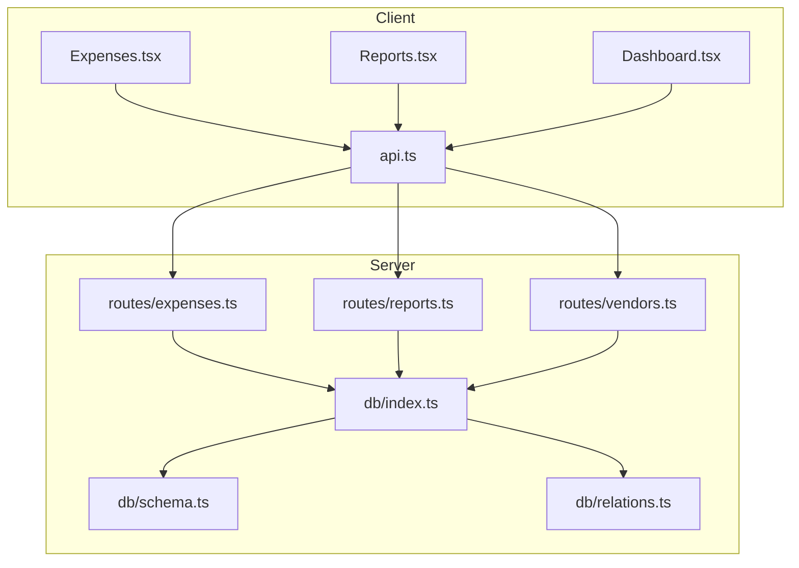
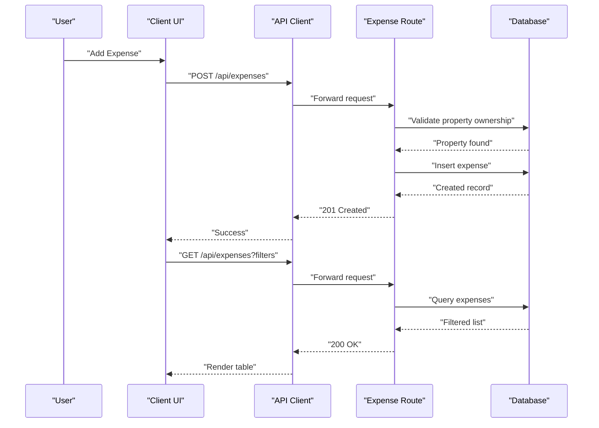
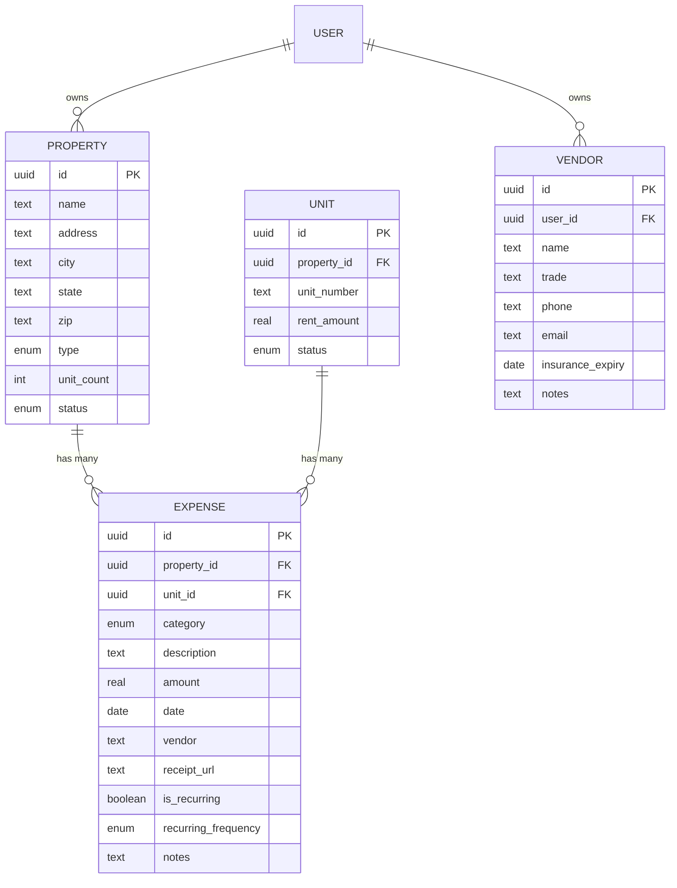
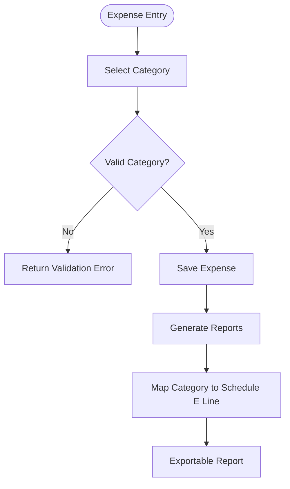
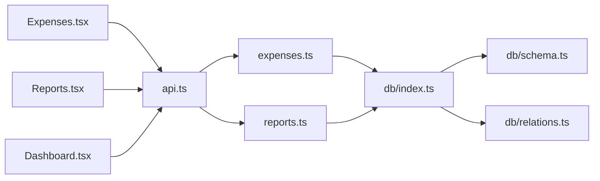

# Expense Tracking

<cite>
**Referenced Files in This Document**
- [expenses.ts](file://server/src/routes/expenses.ts)
- [reports.ts](file://server/src/routes/reports.ts)
- [vendors.ts](file://server/src/routes/vendors.ts)
- [schema.ts](file://server/src/db/schema.ts)
- [relations.ts](file://server/src/db/relations.ts)
- [index.ts](file://server/src/db/index.ts)
- [types.ts](file://shared/src/types.ts)
- [Expenses.tsx](file://client/src/pages/Expenses.tsx)
- [Reports.tsx](file://client/src/pages/Reports.tsx)
- [Dashboard.tsx](file://client/src/pages/Dashboard.tsx)
- [api.ts](file://client/src/lib/api.ts)
</cite>

## Table of Contents
1. Introduction
2. Project Structure
3. Core Components
4. Architecture Overview
5. Detailed Component Analysis
6. Dependency Analysis
7. Performance Considerations
8. Troubleshooting Guide
9. Conclusion
10. Appendices

## Introduction
This document explains the expense tracking functionality in RentLite, covering data modeling, categorization, receipt handling, recurring expenses, tax mapping, workflows from entry to reporting, API endpoints, UI components, and analytics. It is designed for both technical and non-technical readers to understand how expenses are captured, organized, and reported across properties and units.

## Project Structure
RentLite is a full-stack application with:
- Client (React + TypeScript) pages for expense entry and reporting
- Server (Express + TypeScript) routes for CRUD operations and reports
- Shared types for consistent contracts between client and server
- Database schema and relations defined with Drizzle ORM

**Diagram sources**
- [Expenses.tsx:1-360](file://client/src/pages/Expenses.tsx#L1-L360)
- [Reports.tsx:1-382](file://client/src/pages/Reports.tsx#L1-L382)
- [Dashboard.tsx:1-233](file://client/src/pages/Dashboard.tsx#L1-L233)
- [api.ts:1-82](file://client/src/lib/api.ts#L1-L82)
- [expenses.ts:1-106](file://server/src/routes/expenses.ts#L1-L106)
- [reports.ts:1-186](file://server/src/routes/reports.ts#L1-L186)
- [vendors.ts:1-71](file://server/src/routes/vendors.ts#L1-L71)
- [index.ts:1-11](file://server/src/db/index.ts#L1-L11)
- [schema.ts:1-403](file://server/src/db/schema.ts#L1-L403)
- [relations.ts:1-103](file://server/src/db/relations.ts#L1-L103)

**Section sources**
- [Expenses.tsx:1-360](file://client/src/pages/Expenses.tsx#L1-L360)
- [reports.ts:1-186](file://server/src/routes/reports.ts#L1-L186)
- [schema.ts:1-403](file://server/src/db/schema.ts#L1-L403)
- [relations.ts:1-103](file://server/src/db/relations.ts#L1-L103)
- [api.ts:1-82](file://client/src/lib/api.ts#L1-L82)

## Core Components
- Expense data model: categories, amounts, dates, vendors, receipts, property/unit associations, recurrence flags
- Expense CRUD API with validation and ownership checks
- Reporting APIs for cash flow, profit & loss, and Schedule E mapping
- Vendor management API
- UI for expense entry, filtering, and reporting with charts and CSV export

Key responsibilities:
- Expenses route: validate, create, read, update, delete expenses; filter by property/category/year/month
- Reports route: aggregate income and expenses per property and period; map categories to Schedule E lines
- Vendors route: manage vendor records
- Schema: define tables, enums, and relationships
- Relations: link expenses to properties and units
- Client pages: provide forms, filters, lists, and visualizations

**Section sources**
- [expenses.ts:11-28](file://server/src/routes/expenses.ts#L11-L28)
- [expenses.ts:31-103](file://server/src/routes/expenses.ts#L31-L103)
- [reports.ts:10-26](file://server/src/routes/reports.ts#L10-L26)
- [reports.ts:28-183](file://server/src/routes/reports.ts#L28-L183)
- [schema.ts:73-88](file://server/src/db/schema.ts#L73-L88)
- [schema.ts:329-348](file://server/src/db/schema.ts#L329-L348)
- [relations.ts:82-86](file://server/src/db/relations.ts#L82-L86)
- [Expenses.tsx:20-35](file://client/src/pages/Expenses.tsx#L20-L35)
- [Expenses.tsx:62-118](file://client/src/pages/Expenses.tsx#L62-L118)
- [Reports.tsx:31-80](file://client/src/pages/Reports.tsx#L31-L80)

## Architecture Overview
The expense system follows a standard layered architecture:
- Client UI calls REST endpoints via a typed API client
- Server routes enforce authentication, validate inputs, and query the database
- Database uses Drizzle ORM with explicit schema and relations
- Reports compute aggregates and map categories to tax lines

**Diagram sources**
- [expenses.ts:31-79](file://server/src/routes/expenses.ts#L31-L79)
- [api.ts:26-54](file://client/src/lib/api.ts#L26-L54)
- [Expenses.tsx:74-118](file://client/src/pages/Expenses.tsx#L74-L118)

## Detailed Component Analysis

### Expense Data Model
- Categories: predefined enum values aligned with common rental expense types
- Amounts: numeric fields with non-negative constraints
- Dates: date-only fields for transaction timing
- Vendors: optional text field on expense; separate vendor entity for contact info and trade
- Receipts: optional URL reference for attachments
- Property and Unit associations: expenses belong to a property and optionally a unit
- Recurrence: boolean flag and frequency enum to mark recurring expenses

**Diagram sources**
- [schema.ts:191-208](file://server/src/db/schema.ts#L191-L208)
- [schema.ts:212-226](file://server/src/db/schema.ts#L212-L226)
- [schema.ts:329-348](file://server/src/db/schema.ts#L329-L348)
- [schema.ts:352-365](file://server/src/db/schema.ts#L352-L365)
- [relations.ts:37-52](file://server/src/db/relations.ts#L37-L52)
- [relations.ts:82-92](file://server/src/db/relations.ts#L82-L92)

**Section sources**
- [schema.ts:73-88](file://server/src/db/schema.ts#L73-L88)
- [schema.ts:131-135](file://server/src/db/schema.ts#L131-L135)
- [schema.ts:329-348](file://server/src/db/schema.ts#L329-L348)
- [types.ts:118-149](file://shared/src/types.ts#L118-L149)

### Expense Categorization and Tax Mapping
- Categories are enforced via an enum and validated on the server
- The reporting layer maps each category to a Schedule E line number and description for tax preparation
- Clients render categories with badges and color variants for quick identification

**Diagram sources**
- [expenses.ts:11-28](file://server/src/routes/expenses.ts#L11-L28)
- [reports.ts:10-26](file://server/src/routes/reports.ts#L10-L26)
- [Expenses.tsx:20-42](file://client/src/pages/Expenses.tsx#L20-L42)

**Section sources**
- [reports.ts:10-26](file://server/src/routes/reports.ts#L10-L26)
- [Expenses.tsx:20-42](file://client/src/pages/Expenses.tsx#L20-L42)

### Receipt Handling
- Receipts are stored as URLs in the expense record
- No file upload endpoint is present in the analyzed code; clients should store receipts externally and set the URL when creating or updating expenses

**Section sources**
- [schema.ts:329-348](file://server/src/db/schema.ts#L329-L348)
- [expenses.ts:11-28](file://server/src/routes/expenses.ts#L11-L28)

### Recurring Expense Setup
- Expenses can be flagged as recurring with a frequency (monthly, quarterly, annually)
- The current implementation stores these flags but does not auto-generate future entries; recurring logic would require additional scheduling services

**Section sources**
- [schema.ts:131-135](file://server/src/db/schema.ts#L131-L135)
- [schema.ts:329-348](file://server/src/db/schema.ts#L329-L348)
- [expenses.ts:11-28](file://server/src/routes/expenses.ts#L11-L28)

### Approval Processes and Budget Tracking
- No approval workflow or budgeting features are implemented in the analyzed code
- Users can track expenses and generate reports; approvals and budgets would need new entities and routes

[No sources needed since this section summarizes missing features]

### API Endpoints for Expense Operations
- GET /api/expenses: List expenses with optional filters (propertyId, category, year, month)
- GET /api/expenses/:id: Get a single expense
- POST /api/expenses: Create an expense with validation and ownership verification
- PUT /api/expenses/:id: Update an expense with partial fields
- DELETE /api/expenses/:id: Delete an expense

Notes:
- All routes are protected by authentication middleware
- Creation validates that the user owns the referenced property

**Section sources**
- [expenses.ts:31-103](file://server/src/routes/expenses.ts#L31-L103)

### API Endpoints for Reporting
- GET /api/reports/cashflow: Monthly cash flow per property for a given year
- GET /api/reports/schedule-e: Schedule E line items grouped by category per property for a given year
- GET /api/reports/pnl: Profit & Loss per property for a given year or quarter

Notes:
- Aggregates payments and expenses by property and time period
- Maps expense categories to Schedule E lines for tax reporting

**Section sources**
- [reports.ts:28-183](file://server/src/routes/reports.ts#L28-L183)

### User Interface Components
- Expense Entry: Modal form with fields for property, category, amount, description, date, vendor, and recurring flag
- Filtering: Dropdowns for property, category, year, and month; totals computed client-side
- Listing: Table showing date, description, amount, category badge, vendor, and delete action
- Reports: Tabs for Cash Flow, Profit & Loss, and Schedule E; charts and CSV export

**Section sources**
- [Expenses.tsx:57-118](file://client/src/pages/Expenses.tsx#L57-L118)
- [Expenses.tsx:157-356](file://client/src/pages/Expenses.tsx#L157-L356)
- [Reports.tsx:60-135](file://client/src/pages/Reports.tsx#L60-L135)
- [Reports.tsx:137-379](file://client/src/pages/Reports.tsx#L137-L379)

### Integration with Accounting Systems and Tax Preparation Tools
- Schedule E mapping provides structured line items suitable for tax preparation
- CSV export enables importing into accounting software
- No direct integrations are implemented in the analyzed code

**Section sources**
- [reports.ts:10-26](file://server/src/routes/reports.ts#L10-L26)
- [Reports.tsx:47-58](file://client/src/pages/Reports.tsx#L47-L58)
- [Reports.tsx:102-135](file://client/src/pages/Reports.tsx#L102-L135)

### Examples of Expense Management Scenarios
- Multi-property expenses: Filter expenses by property to isolate costs per location; reports aggregate per property
- Shared costs: Assign expenses to a specific property; if shared across units, choose the primary property and add notes for clarity

[No sources needed since this section provides conceptual guidance]

### Expense Analytics, Budgeting Features, and Financial Reporting
- Analytics: Cash flow charts, net income trends, per-property breakdowns
- P&L: Income vs expenses per property with period selection
- Schedule E: Category-to-line mapping for tax filing
- Budgeting: Not implemented in the analyzed code

**Section sources**
- [Reports.tsx:84-100](file://client/src/pages/Reports.tsx#L84-L100)
- [Reports.tsx:185-252](file://client/src/pages/Reports.tsx#L185-L252)
- [Reports.tsx:255-313](file://client/src/pages/Reports.tsx#L255-L313)
- [Reports.tsx:315-379](file://client/src/pages/Reports.tsx#L315-L379)

## Dependency Analysis
The expense module depends on:
- Authentication middleware for access control
- Database schema and relations for data integrity
- Shared types for consistent contracts
- Client API client for HTTP requests and error handling

**Diagram sources**
- [Expenses.tsx:1-10](file://client/src/pages/Expenses.tsx#L1-L10)
- [api.ts:1-82](file://client/src/lib/api.ts#L1-L82)
- [expenses.ts:1-10](file://server/src/routes/expenses.ts#L1-L10)
- [reports.ts:1-8](file://server/src/routes/reports.ts#L1-L8)
- [index.ts:1-11](file://server/src/db/index.ts#L1-L11)
- [schema.ts:1-12](file://server/src/db/schema.ts#L1-L12)
- [relations.ts:1-16](file://server/src/db/relations.ts#L1-L16)
- [Dashboard.tsx:1-10](file://client/src/pages/Dashboard.tsx#L1-L10)

**Section sources**
- [expenses.ts:1-10](file://server/src/routes/expenses.ts#L1-L10)
- [reports.ts:1-8](file://server/src/routes/reports.ts#L1-L8)
- [api.ts:1-82](file://client/src/lib/api.ts#L1-L82)
- [index.ts:1-11](file://server/src/db/index.ts#L1-L11)
- [schema.ts:1-12](file://server/src/db/schema.ts#L1-L12)
- [relations.ts:1-16](file://server/src/db/relations.ts#L1-L16)

## Performance Considerations
- Filtering occurs client-side for small datasets; consider server-side pagination and indexing for large portfolios
- Report queries load all payments and expenses into memory; optimize with indexed date columns and targeted queries for large datasets
- Avoid unnecessary re-renders by memoizing chart data and using query caching

[No sources needed since this section provides general guidance]

## Troubleshooting Guide
Common issues and resolutions:
- Unauthorized errors: Ensure session is active; client redirects to login on 401
- Validation errors: Check required fields and formats; server returns detailed validation messages
- Not found errors: Verify IDs exist and user has permission to access them
- Empty reports: Confirm data exists for selected year and filters

**Section sources**
- [api.ts:39-51](file://client/src/lib/api.ts#L39-L51)
- [expenses.ts:67-79](file://server/src/routes/expenses.ts#L67-L79)
- [expenses.ts:82-103](file://server/src/routes/expenses.ts#L82-L103)
- [reports.ts:28-183](file://server/src/routes/reports.ts#L28-L183)

## Conclusion
RentLite’s expense tracking provides a solid foundation for capturing, organizing, and reporting property-related expenses. It supports categorization, receipt references, recurring flags, and robust reporting including Schedule E mapping. While approval workflows and budgeting are not implemented, the existing structure allows for straightforward extensions.

[No sources needed since this section summarizes without analyzing specific files]

## Appendices

### API Reference Summary
- Expenses
  - GET /api/expenses: List with filters
  - GET /api/expenses/:id: Retrieve one
  - POST /api/expenses: Create with validation
  - PUT /api/expenses/:id: Update partially
  - DELETE /api/expenses/:id: Delete
- Reports
  - GET /api/reports/cashflow: Monthly cash flow per property
  - GET /api/reports/schedule-e: Schedule E line items per property
  - GET /api/reports/pnl: Profit & Loss per property
- Vendors
  - GET /api/vendors: List user-owned vendors
  - POST /api/vendors: Create vendor
  - PUT /api/vendors/:id: Update vendor
  - DELETE /api/vendors/:id: Delete vendor

**Section sources**
- [expenses.ts:31-103](file://server/src/routes/expenses.ts#L31-L103)
- [reports.ts:28-183](file://server/src/routes/reports.ts#L28-L183)
- [vendors.ts:20-68](file://server/src/routes/vendors.ts#L20-L68)