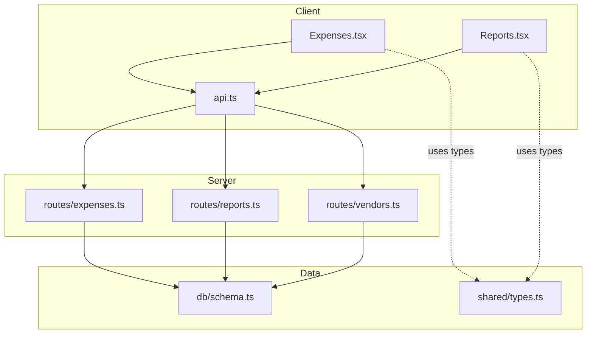
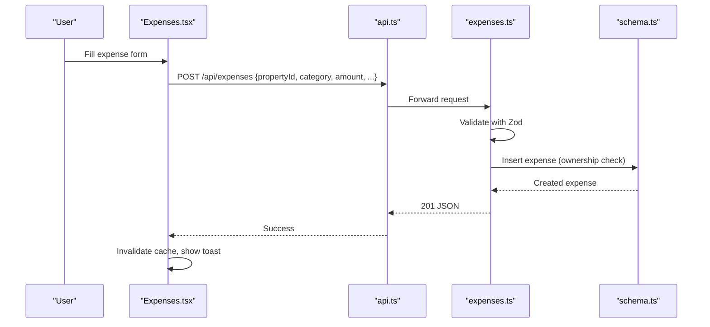
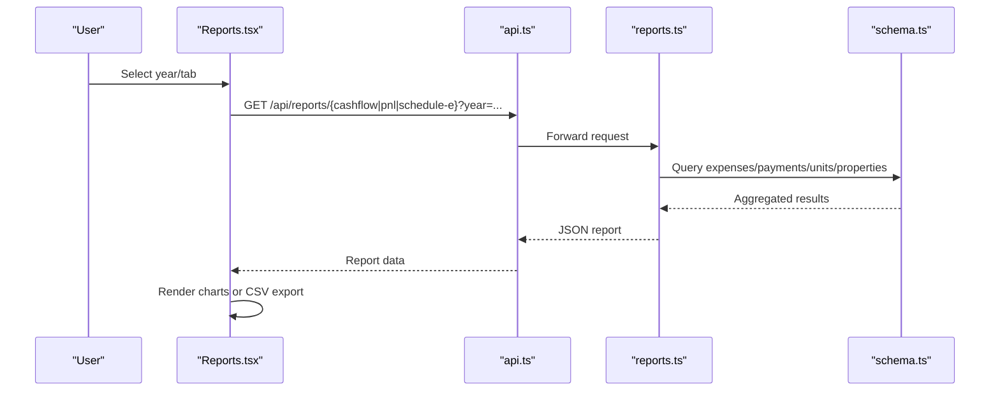
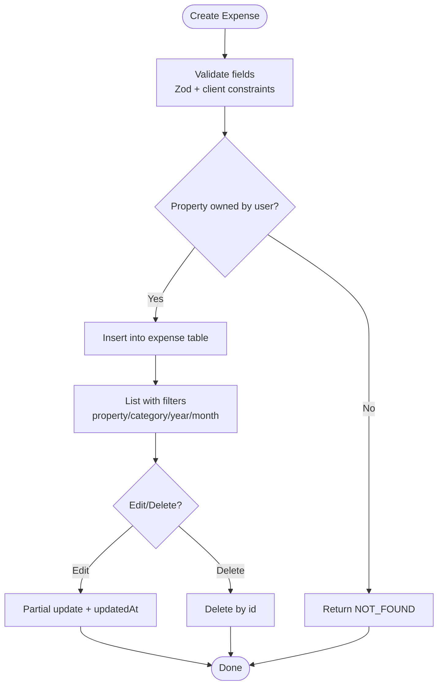
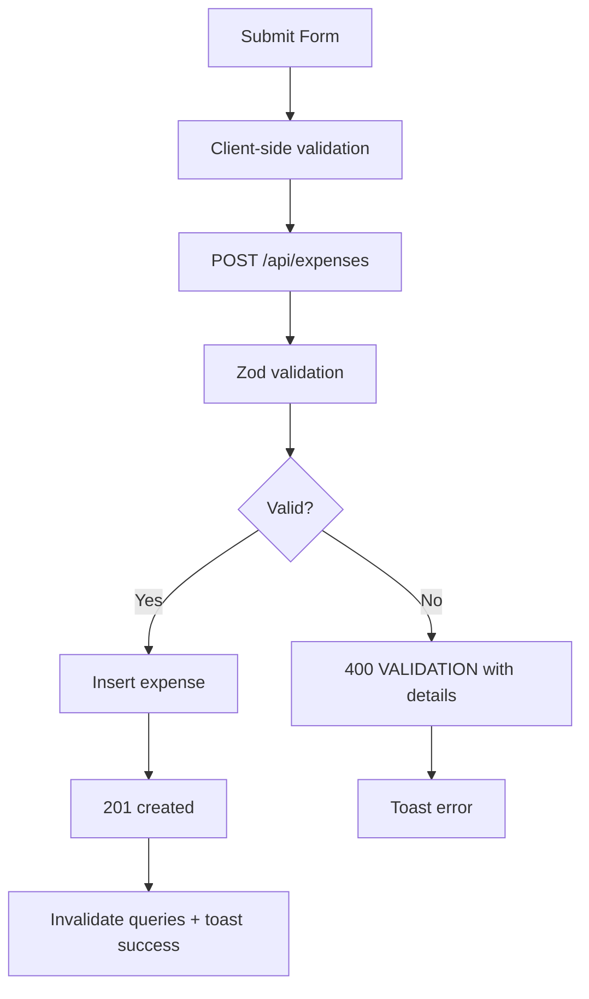
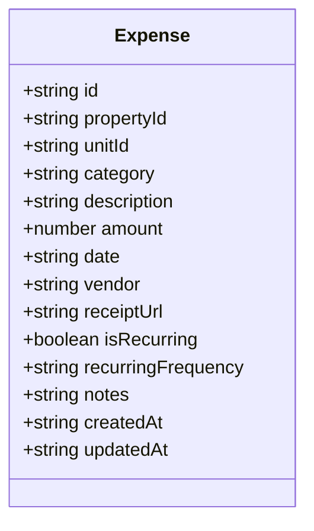
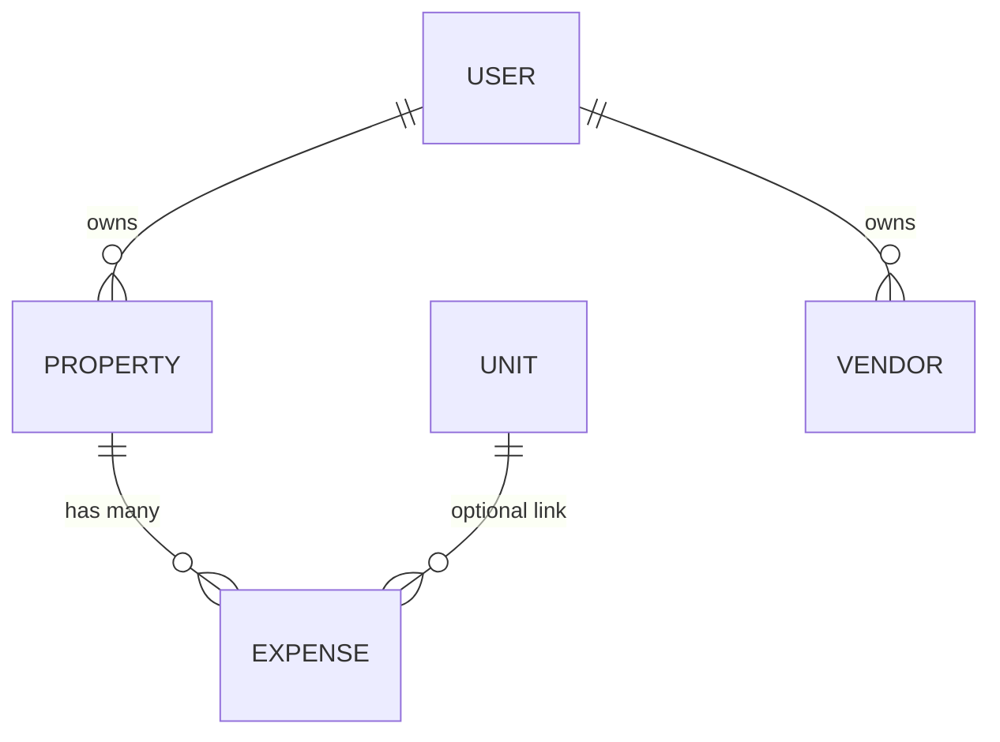
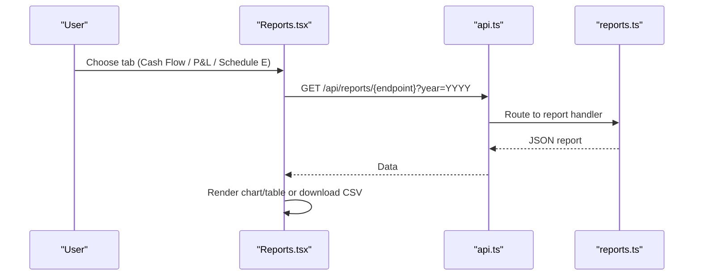
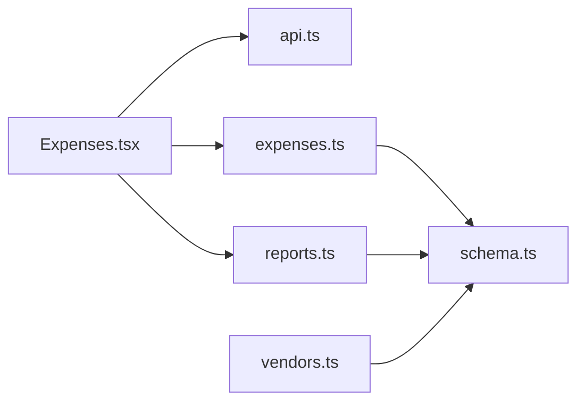

# Expense Workflow Management

<cite>
**Referenced Files in This Document**
- [expenses.ts](file://server/src/routes/expenses.ts)
- [Expenses.tsx](file://client/src/pages/Expenses.tsx)
- [schema.ts](file://server/src/db/schema.ts)
- [types.ts](file://shared/src/types.ts)
- [reports.ts](file://server/src/routes/reports.ts)
- [Reports.tsx](file://client/src/pages/Reports.tsx)
- [vendors.ts](file://server/src/routes/vendors.ts)
- [api.ts](file://client/src/lib/api.ts)
- [RentLite-Product-Spec-Sheet.md](file://RentLite-Product-Spec-Sheet.md)
</cite>

## Table of Contents
1. [Introduction](#introduction)
2. [Project Structure](#project-structure)
3. [Core Components](#core-components)
4. [Architecture Overview](#architecture-overview)
5. [Detailed Component Analysis](#detailed-component-analysis)
6. [Dependency Analysis](#dependency-analysis)
7. [Performance Considerations](#performance-considerations)
8. [Troubleshooting Guide](#troubleshooting-guide)
9. [Conclusion](#conclusion)
10. [Appendices](#appendices)

## Introduction
This document explains the end-to-end expense workflow in RentLite, covering creation, categorization, filtering, recurring setup, editing, reporting, and export. It also describes user interaction patterns (validation, feedback, errors), multi-property allocation via property and unit links, vendor management integration, and financial reporting capabilities including Schedule E mapping and CSV export for accounting workflows.

## Project Structure
The expense feature spans client pages, server routes, database schema, shared types, and reports:
- Client UI: Expenses page for entry, listing, filtering, and deletion; Reports page for cash flow, P&L, and Schedule E with CSV export.
- Server API: Express routes for CRUD on expenses, vendors, and report endpoints.
- Database: Drizzle ORM schema defines expense, vendor, and related entities.
- Shared Types: TypeScript interfaces for Expense, Vendor, and report structures.
- Product Spec: Feature context for expense tracking, recurring entries, and reporting.

**Diagram sources**
- [Expenses.tsx:1-360](file://client/src/pages/Expenses.tsx#L1-L360)
- [Reports.tsx:1-382](file://client/src/pages/Reports.tsx#L1-L382)
- [api.ts:1-82](file://client/src/lib/api.ts#L1-L82)
- [expenses.ts:1-106](file://server/src/routes/expenses.ts#L1-L106)
- [reports.ts:1-186](file://server/src/routes/reports.ts#L1-L186)
- [vendors.ts:1-71](file://server/src/routes/vendors.ts#L1-L71)
- [schema.ts:327-348](file://server/src/db/schema.ts#L327-L348)
- [types.ts:116-164](file://shared/src/types.ts#L116-L164)

**Section sources**
- [Expenses.tsx:1-360](file://client/src/pages/Expenses.tsx#L1-L360)
- [reports.ts:1-186](file://server/src/routes/reports.ts#L1-L186)
- [schema.ts:327-348](file://server/src/db/schema.ts#L327-L348)
- [types.ts:116-164](file://shared/src/types.ts#L116-L164)

## Core Components
- Expense Entry and Listing (Client): Form with validation, filters by property/category/year/month, table view, delete action, and recurring flag support.
- Expense API (Server): Zod-validated CRUD endpoints with ownership checks and date-based filtering.
- Reporting (Server + Client): Cash flow, Profit & Loss, and Schedule E helpers with per-property aggregation and CSV export.
- Vendors (Server): CRUD for vendor records to support expense attribution and maintenance linkage.
- Data Model: Expense entity with property/unit linkage, category enum, recurring flags, and timestamps.

Key responsibilities:
- Validate inputs on both client and server.
- Enforce data access by user-owned properties.
- Provide robust filtering and reporting across time periods.
- Support recurring expense configuration at entry time.

**Section sources**
- [expenses.ts:11-28](file://server/src/routes/expenses.ts#L11-L28)
- [expenses.ts:31-103](file://server/src/routes/expenses.ts#L31-L103)
- [Expenses.tsx:47-118](file://client/src/pages/Expenses.tsx#L47-L118)
- [schema.ts:73-88](file://server/src/db/schema.ts#L73-L88)
- [schema.ts:131-135](file://server/src/db/schema.ts#L131-L135)
- [schema.ts:327-348](file://server/src/db/schema.ts#L327-L348)
- [types.ts:116-164](file://shared/src/types.ts#L116-L164)

## Architecture Overview
Expense operations follow a standard request/response pattern with authentication middleware, input validation, and database queries. Reports aggregate payments and expenses per property and period.

**Diagram sources**
- [Expenses.tsx:84-112](file://client/src/pages/Expenses.tsx#L84-L112)
- [api.ts:26-54](file://client/src/lib/api.ts#L26-L54)
- [expenses.ts:65-79](file://server/src/routes/expenses.ts#L65-L79)
- [schema.ts:327-348](file://server/src/db/schema.ts#L327-L348)

**Diagram sources**
- [Reports.tsx:64-80](file://client/src/pages/Reports.tsx#L64-L80)
- [api.ts:58-78](file://client/src/lib/api.ts#L58-L78)
- [reports.ts:28-77](file://server/src/routes/reports.ts#L28-L77)
- [reports.ts:79-129](file://server/src/routes/reports.ts#L79-L129)
- [reports.ts:131-183](file://server/src/routes/reports.ts#L131-L183)
- [schema.ts:327-348](file://server/src/db/schema.ts#L327-L348)

## Detailed Component Analysis

### Expense Lifecycle: Creation to Reconciliation
- Creation:
  - Client form collects property, category, description, amount, date, optional vendor, and recurring flag.
  - Server validates payload with Zod and verifies property ownership before insert.
- Categorization:
  - Categories are constrained to an enum aligned with IRS categories for reporting.
- Filtering and Listing:
  - Client supports filters by property, category, year, month; server applies equivalent filters.
- Editing and Deletion:
  - Partial updates supported; updatedAt timestamp updated on change.
  - Delete removes the record if it exists.
- Reconciliation:
  - Reports aggregate expenses by property and period to compute net income and tax-ready line items.

**Diagram sources**
- [expenses.ts:11-28](file://server/src/routes/expenses.ts#L11-L28)
- [expenses.ts:65-103](file://server/src/routes/expenses.ts#L65-L103)
- [Expenses.tsx:104-118](file://client/src/pages/Expenses.tsx#L104-L118)
- [schema.ts:327-348](file://server/src/db/schema.ts#L327-L348)

**Section sources**
- [expenses.ts:31-103](file://server/src/routes/expenses.ts#L31-L103)
- [Expenses.tsx:62-118](file://client/src/pages/Expenses.tsx#L62-L118)
- [schema.ts:327-348](file://server/src/db/schema.ts#L327-L348)

### User Interaction Patterns: Validation, Feedback, Errors
- Form validation:
  - Client enforces required fields and numeric constraints; server uses Zod to validate and return structured validation errors.
- Real-time feedback:
  - Loading states during requests; success/error toasts on mutations; query invalidation refreshes lists.
- Error handling:
  - Unauthorized redirects handled by client API wrapper; server returns standardized error objects for not found and validation failures.

**Diagram sources**
- [Expenses.tsx:104-112](file://client/src/pages/Expenses.tsx#L104-L112)
- [expenses.ts:65-79](file://server/src/routes/expenses.ts#L65-L79)
- [api.ts:26-54](file://client/src/lib/api.ts#L26-L54)

**Section sources**
- [expenses.ts:65-85](file://server/src/routes/expenses.ts#L65-L85)
- [Expenses.tsx:84-118](file://client/src/pages/Expenses.tsx#L84-L118)
- [api.ts:26-54](file://client/src/lib/api.ts#L26-L54)

### Recurring Expense Setup and Automation
- Configuration:
  - The expense schema includes isRecurring and recurringFrequency fields (monthly, quarterly, annually).
  - The client form exposes a checkbox to mark an expense as recurring.
- Current automation:
  - The codebase stores recurring metadata but does not implement automatic generation of future expenses. Recurring setup is available for record-keeping and potential future automation.

**Diagram sources**
- [schema.ts:327-348](file://server/src/db/schema.ts#L327-L348)
- [types.ts:116-164](file://shared/src/types.ts#L116-L164)

**Section sources**
- [schema.ts:131-135](file://server/src/db/schema.ts#L131-L135)
- [schema.ts:327-348](file://server/src/db/schema.ts#L327-L348)
- [Expenses.tsx:336-347](file://client/src/pages/Expenses.tsx#L336-L347)

### Multi-Property Allocation and Unit-Level Detail
- Property-level allocation:
  - Every expense is linked to a property via propertyId; filtering and reporting scope expenses to user-owned properties.
- Unit-level detail:
  - Optional unitId allows attributing costs to specific units when applicable.
- Vendor linkage:
  - Vendor field on expenses enables association with vendor records managed via vendors endpoint.

**Diagram sources**
- [schema.ts:191-208](file://server/src/db/schema.ts#L191-L208)
- [schema.ts:212-226](file://server/src/db/schema.ts#L212-L226)
- [schema.ts:327-348](file://server/src/db/schema.ts#L327-L348)
- [schema.ts:352-365](file://server/src/db/schema.ts#L352-L365)

**Section sources**
- [expenses.ts:31-54](file://server/src/routes/expenses.ts#L31-L54)
- [schema.ts:327-348](file://server/src/db/schema.ts#L327-L348)
- [vendors.ts:20-28](file://server/src/routes/vendors.ts#L20-L28)

### Budget Tracking Integration
- Current state:
  - There is no explicit budget entity or enforcement in the current codebase.
- Practical approach:
  - Use Reports (P&L and Schedule E) to monitor spending against internal budgets per category or property.
  - Leverage filters and exports to track variances manually.

[No sources needed since this section provides general guidance]

### Expense Analysis Features and Financial Reporting
- Cash Flow:
  - Monthly income vs. expenses per property with totals and net income.
- Profit & Loss:
  - Per-property income, expenses, and net income filtered by year and optionally quarter.
- Schedule E Helper:
  - Maps expense categories to IRS line items and aggregates amounts per property for tax preparation.
- Export:
  - CSV export from the Reports page for all three report types.

**Diagram sources**
- [Reports.tsx:64-80](file://client/src/pages/Reports.tsx#L64-L80)
- [api.ts:58-78](file://client/src/lib/api.ts#L58-L78)
- [reports.ts:28-77](file://server/src/routes/reports.ts#L28-L77)
- [reports.ts:79-129](file://server/src/routes/reports.ts#L79-L129)
- [reports.ts:131-183](file://server/src/routes/reports.ts#L131-L183)

**Section sources**
- [reports.ts:28-183](file://server/src/routes/reports.ts#L28-L183)
- [Reports.tsx:102-135](file://client/src/pages/Reports.tsx#L102-L135)

### Vendor Management Integration
- Vendor CRUD:
  - Create, read, update, delete vendors scoped to the authenticated user.
- Usage:
  - Link vendors to expenses via the vendor field; maintain trade, contact info, and insurance expiry for compliance and follow-up.

**Section sources**
- [vendors.ts:11-18](file://server/src/routes/vendors.ts#L11-L18)
- [vendors.ts:20-68](file://server/src/routes/vendors.ts#L20-L68)
- [schema.ts:352-365](file://server/src/db/schema.ts#L352-L365)

### Common Expense Scenarios
- Maintenance costs:
  - Category: repairs/cleaning/supplies; optional unitId for unit-specific jobs; vendor field for contractor attribution.
- Utility bills:
  - Category: utilities; monthly or quarterly frequency can be recorded via recurring flags.
- Insurance payments:
  - Category: insurance; annual frequency; vendor field for insurer.
- Tax-deductible expenses:
  - Categories mapped to Schedule E lines; use Reports > Schedule E to prepare tax summaries.

[No sources needed since this section summarizes usage patterns without analyzing specific files]

### Export Functionality and Accounting System Integration
- Export:
  - CSV downloads for cash flow, P&L, and Schedule E directly from the Reports page.
- Accounting integration:
  - The product spec outlines planned QuickBooks/Xero sync in Phase 3; current implementation focuses on CSV export for manual import into accounting systems.

**Section sources**
- [Reports.tsx:47-58](file://client/src/pages/Reports.tsx#L47-L58)
- [Reports.tsx:102-135](file://client/src/pages/Reports.tsx#L102-L135)
- [RentLite-Product-Spec-Sheet.md:232-240](file://RentLite-Product-Spec-Sheet.md#L232-L240)

## Dependency Analysis
- Client dependencies:
  - React Query for data fetching and caching; API wrapper handles auth redirect and error normalization.
- Server dependencies:
  - Express router with Zod validation; Drizzle ORM for typed queries; auth middleware ensures user scoping.
- Data model dependencies:
  - Expense depends on Property and optionally Unit; Vendor is independent but referenced by expenses.

**Diagram sources**
- [Expenses.tsx:1-360](file://client/src/pages/Expenses.tsx#L1-L360)
- [api.ts:1-82](file://client/src/lib/api.ts#L1-L82)
- [expenses.ts:1-106](file://server/src/routes/expenses.ts#L1-L106)
- [reports.ts:1-186](file://server/src/routes/reports.ts#L1-L186)
- [vendors.ts:1-71](file://server/src/routes/vendors.ts#L1-L71)
- [schema.ts:327-348](file://server/src/db/schema.ts#L327-L348)

**Section sources**
- [api.ts:26-54](file://client/src/lib/api.ts#L26-L54)
- [expenses.ts:1-106](file://server/src/routes/expenses.ts#L1-L106)
- [reports.ts:1-186](file://server/src/routes/reports.ts#L1-L186)
- [vendors.ts:1-71](file://server/src/routes/vendors.ts#L1-L71)

## Performance Considerations
- Client-side caching:
  - React Query caches and invalidates queries on mutations to minimize redundant network calls.
- Server-side filtering:
  - Filters applied in-memory after fetching user-scoped datasets; consider indexing propertyId/date for large datasets.
- Report aggregation:
  - Aggregations run per user’s properties; ensure efficient queries and consider pagination for very large portfolios.

[No sources needed since this section provides general guidance]

## Troubleshooting Guide
- Validation errors:
  - Server returns 400 with VALIDATION code and details; client shows toast with error message.
- Not found:
  - Deleting or updating non-existent expenses returns 404; handle gracefully in UI.
- Unauthorized:
  - Client API wrapper redirects to login on 401 responses.

**Section sources**
- [expenses.ts:65-85](file://server/src/routes/expenses.ts#L65-L85)
- [expenses.ts:86-103](file://server/src/routes/expenses.ts#L86-L103)
- [api.ts:39-51](file://client/src/lib/api.ts#L39-L51)

## Conclusion
RentLite’s expense workflow provides a clear path from entry to reporting, with strong categorization, multi-property scoping, vendor linkage, and tax-ready outputs. While recurring setup is captured, automatic generation is not implemented yet. Reporting and CSV export enable reconciliation and accounting integration. Future phases plan deeper accounting system integrations.

[No sources needed since this section summarizes without analyzing specific files]

## Appendices

### A. Expense Categories and Schedule E Mapping
- Categories are enforced server-side and mapped to Schedule E lines for tax reporting.

**Section sources**
- [expenses.ts:14-19](file://server/src/routes/expenses.ts#L14-L19)
- [schema.ts:73-88](file://server/src/db/schema.ts#L73-L88)
- [reports.ts:11-26](file://server/src/routes/reports.ts#L11-L26)

### B. Recurring Frequency Options
- Supported frequencies: monthly, quarterly, annually.

**Section sources**
- [schema.ts:131-135](file://server/src/db/schema.ts#L131-L135)
- [expenses.ts:25-26](file://server/src/routes/expenses.ts#L25-L26)

### C. Product Context for Expenses
- Expense tracking features include categorization, receipts, recurring setup, and reporting aligned with MVP goals.

**Section sources**
- [RentLite-Product-Spec-Sheet.md:157-177](file://RentLite-Product-Spec-Sheet.md#L157-L177)