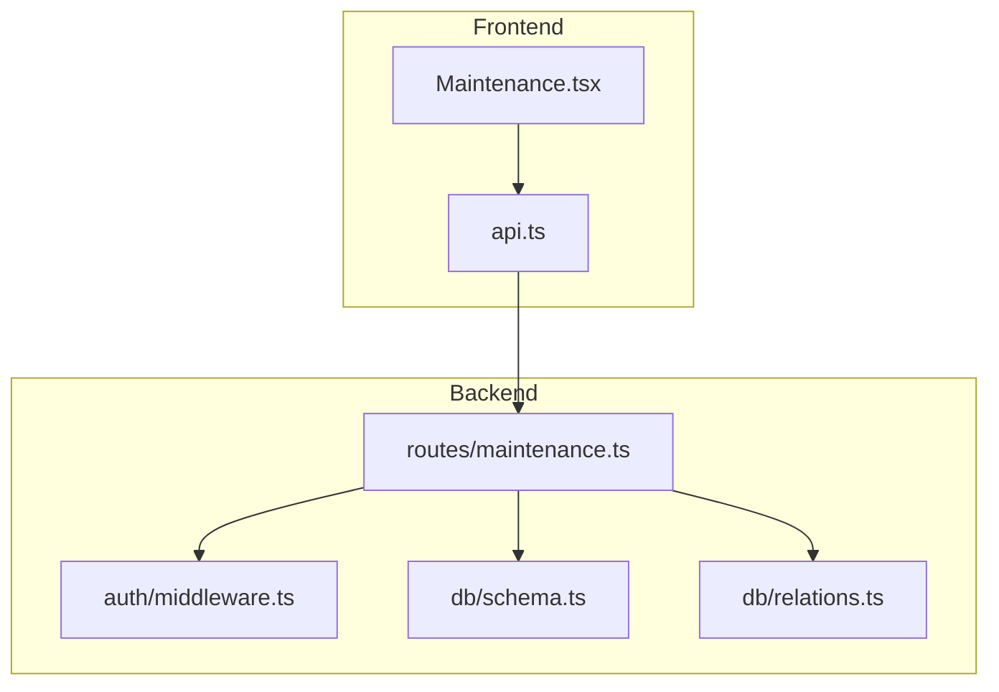
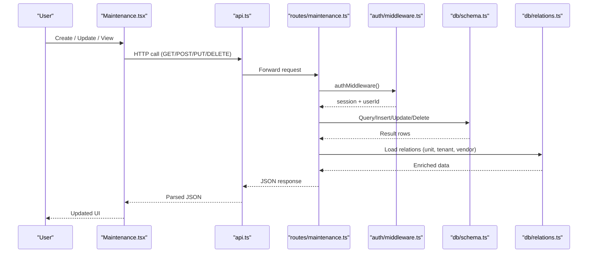
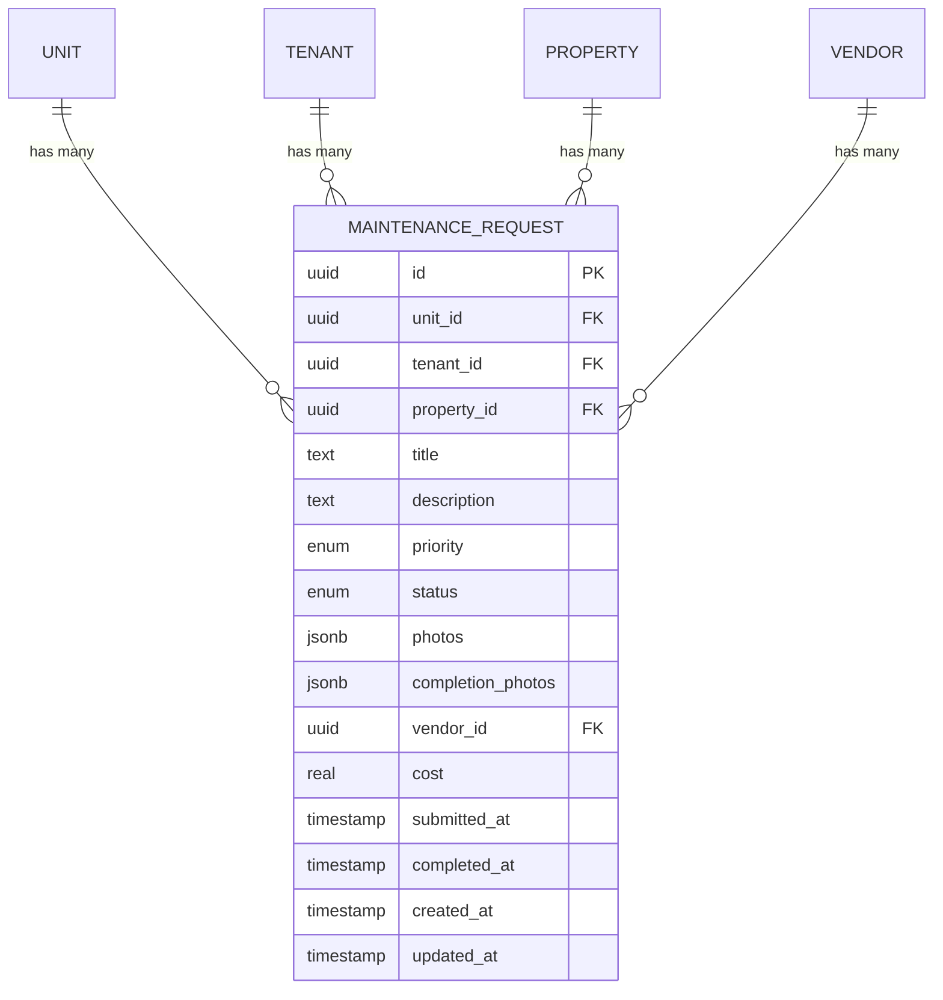
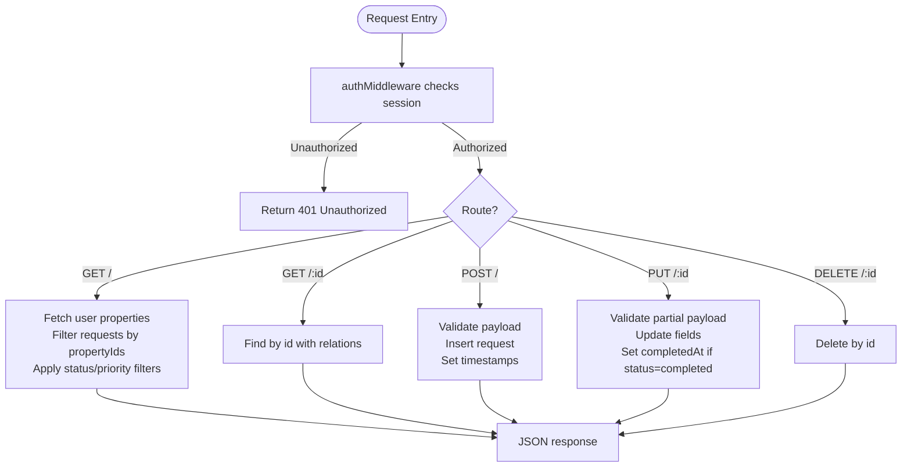
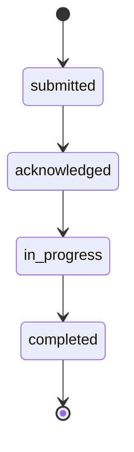
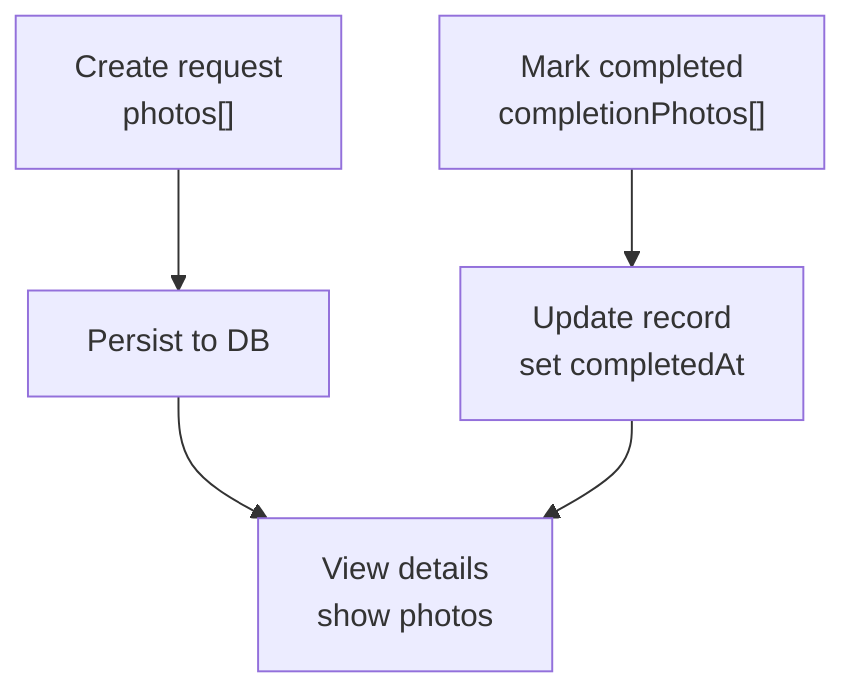
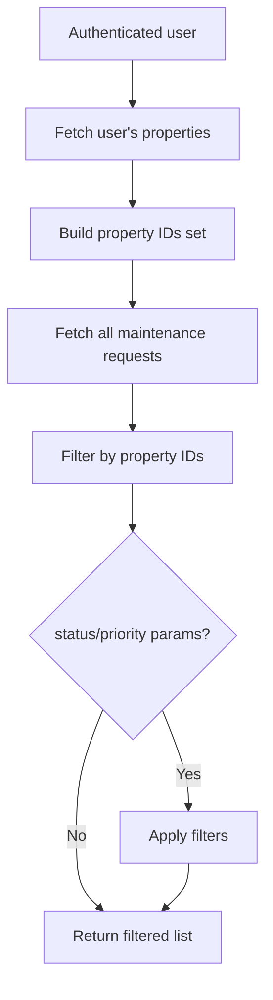
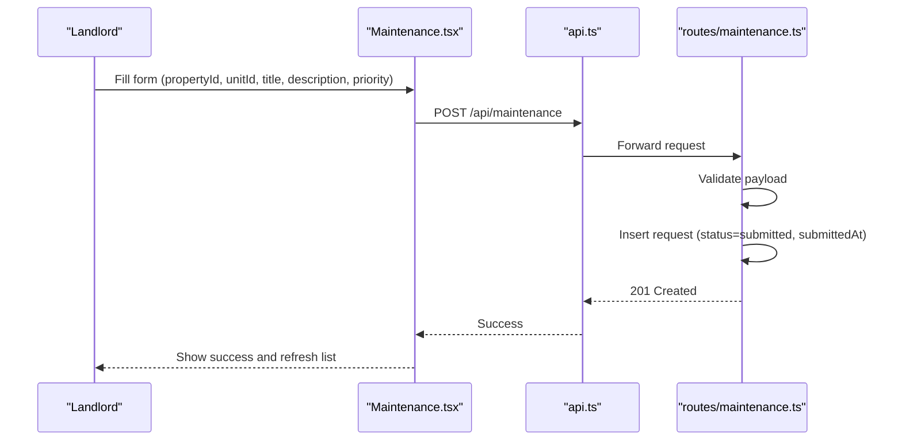
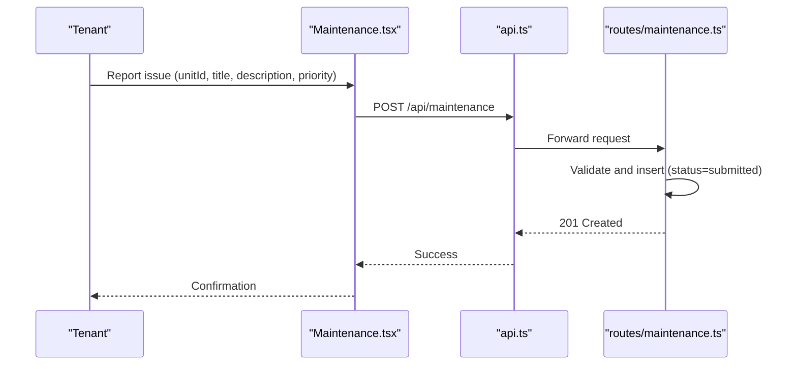
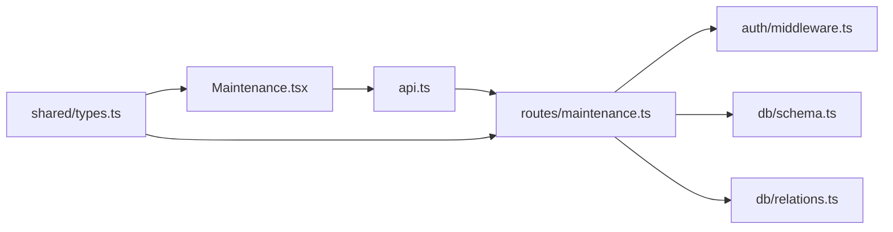

# Maintenance Request Management

<cite>
**Referenced Files in This Document**
- [maintenance.ts](file://server/src/routes/maintenance.ts)
- [Maintenance.tsx](file://client/src/pages/Maintenance.tsx)
- [types.ts](file://shared/src/types.ts)
- [schema.ts](file://server/src/db/schema.ts)
- [relations.ts](file://server/src/db/relations.ts)
- [middleware.ts](file://server/src/auth/middleware.ts)
- [api.ts](file://client/src/lib/api.ts)
</cite>

## Table of Contents
1. [Introduction](#introduction)
2. [Project Structure](#project-structure)
3. [Core Components](#core-components)
4. [Architecture Overview](#architecture-overview)
5. [Detailed Component Analysis](#detailed-component-analysis)
6. [Dependency Analysis](#dependency-analysis)
7. [Performance Considerations](#performance-considerations)
8. [Troubleshooting Guide](#troubleshooting-guide)
9. [Conclusion](#conclusion)

## Introduction
This document explains the complete lifecycle of maintenance requests in RentLite, from submission to completion. It covers data modeling, API endpoints, status transitions, filtering by status and priority, property-scoped visibility, and photo handling for both initial and completion photos. It also provides example workflows for landlords and tenants.

## Project Structure
RentLite implements maintenance request management across a React frontend and an Express backend with Drizzle ORM:
- Frontend page for creating and managing requests (kanban/list views).
- Backend routes for CRUD operations with validation and authorization.
- Shared TypeScript types defining the maintenance request model.
- Database schema and relations defining tables and relationships.
- Authentication middleware ensuring only authenticated users can access endpoints.

**Diagram sources**
- [Maintenance.tsx:67-105](file://client/src/pages/Maintenance.tsx#L67-L105)
- [api.ts:26-78](file://client/src/lib/api.ts#L26-L78)
- [maintenance.ts:1-103](file://server/src/routes/maintenance.ts#L1-L103)
- [middleware.ts:9-27](file://server/src/auth/middleware.ts#L9-L27)
- [schema.ts:291-325](file://server/src/db/schema.ts#L291-L325)
- [relations.ts:74-80](file://server/src/db/relations.ts#L74-L80)

**Section sources**
- [Maintenance.tsx:61-368](file://client/src/pages/Maintenance.tsx#L61-L368)
- [maintenance.ts:1-103](file://server/src/routes/maintenance.ts#L1-L103)
- [schema.ts:291-325](file://server/src/db/schema.ts#L291-L325)
- [relations.ts:74-80](file://server/src/db/relations.ts#L74-L80)
- [middleware.ts:9-27](file://server/src/auth/middleware.ts#L9-L27)
- [api.ts:26-78](file://client/src/lib/api.ts#L26-L78)

## Core Components
- Data model: The shared type defines the maintenance request fields including unitId, propertyId, tenantId, title, description, priority levels, status values, and photo arrays.
- Validation: The backend uses a schema to validate incoming payloads for create and update operations.
- Authorization: All endpoints are protected by authentication middleware that attaches the current user ID to the request.
- Filtering and scoping: Listing endpoints filter results by the authenticated user’s properties and support query parameters for status and priority.
- Status workflow: Requests progress through defined statuses; updates can set completion timestamps when moving to completed.

**Section sources**
- [types.ts:92-114](file://shared/src/types.ts#L92-L114)
- [maintenance.ts:11-23](file://server/src/routes/maintenance.ts#L11-L23)
- [maintenance.ts:25-45](file://server/src/routes/maintenance.ts#L25-L45)
- [maintenance.ts:69-90](file://server/src/routes/maintenance.ts#L69-L90)
- [middleware.ts:9-27](file://server/src/auth/middleware.ts#L9-L27)

## Architecture Overview
The maintenance request flow involves the UI triggering API calls, which are validated and persisted via Drizzle ORM. Relationships allow loading related unit, tenant, vendor, and property data.

**Diagram sources**
- [Maintenance.tsx:67-105](file://client/src/pages/Maintenance.tsx#L67-L105)
- [api.ts:26-78](file://client/src/lib/api.ts#L26-L78)
- [maintenance.ts:25-100](file://server/src/routes/maintenance.ts#L25-L100)
- [middleware.ts:9-27](file://server/src/auth/middleware.ts#L9-L27)
- [schema.ts:291-325](file://server/src/db/schema.ts#L291-L325)
- [relations.ts:74-80](file://server/src/db/relations.ts#L74-L80)

## Detailed Component Analysis

### Data Model
The maintenance request model includes:
- Identifiers: id, unitId, propertyId, tenantId (nullable), vendorId (nullable)
- Content: title, description
- Classification: priority (emergency, urgent, routine), status (submitted, acknowledged, in_progress, completed)
- Media: photos (initial), completionPhotos
- Financials: cost (nullable)
- Timestamps: submittedAt, completedAt (nullable), createdAt, updatedAt

**Diagram sources**
- [schema.ts:291-325](file://server/src/db/schema.ts#L291-L325)
- [relations.ts:74-80](file://server/src/db/relations.ts#L74-L80)

**Section sources**
- [types.ts:92-114](file://shared/src/types.ts#L92-L114)
- [schema.ts:291-325](file://server/src/db/schema.ts#L291-L325)

### API Endpoints
- GET /api/maintenance
  - Purpose: List all maintenance requests visible to the authenticated user, filtered to their properties. Supports optional query parameters status and priority.
  - Response: Array of maintenance requests with related unit, tenant, and vendor data.
- GET /api/maintenance/:id
  - Purpose: Retrieve a single maintenance request by ID with related data.
  - Response: Single maintenance request object or 404 if not found.
- POST /api/maintenance
  - Purpose: Create a new maintenance request. Validates payload using a schema. Sets submittedAt and default status/priority/photos/completionPhotos/vendorId/cost.
  - Response: Created request object with 201 status.
- PUT /api/maintenance/:id
  - Purpose: Update a maintenance request (partial fields allowed). If status is set to completed, sets completedAt automatically.
  - Response: Updated request object or 404 if not found.
- DELETE /api/maintenance/:id
  - Purpose: Delete a maintenance request by ID.
  - Response: Success message or 404 if not found.

**Diagram sources**
- [maintenance.ts:25-100](file://server/src/routes/maintenance.ts#L25-L100)
- [middleware.ts:9-27](file://server/src/auth/middleware.ts#L9-L27)

**Section sources**
- [maintenance.ts:25-100](file://server/src/routes/maintenance.ts#L25-L100)

### Status Transitions and Workflow
Statuses follow a defined progression:
- submitted → acknowledged → in_progress → completed
- When status is updated to completed, the system records completedAt.

**Diagram sources**
- [maintenance.ts:69-90](file://server/src/routes/maintenance.ts#L69-L90)
- [schema.ts:60-71](file://server/src/db/schema.ts#L60-L71)

**Section sources**
- [maintenance.ts:69-90](file://server/src/routes/maintenance.ts#L69-L90)
- [schema.ts:60-71](file://server/src/db/schema.ts#L60-L71)

### Photo Attachment Handling
- Initial photos: Stored in the photos array on creation.
- Completion photos: Stored in the completionPhotos array and typically added when marking a request as completed.
- Both fields are JSON arrays of strings representing URLs or identifiers.

**Diagram sources**
- [maintenance.ts:11-23](file://server/src/routes/maintenance.ts#L11-L23)
- [maintenance.ts:69-90](file://server/src/routes/maintenance.ts#L69-L90)
- [schema.ts:312-316](file://server/src/db/schema.ts#L312-L316)

**Section sources**
- [maintenance.ts:11-23](file://server/src/routes/maintenance.ts#L11-L23)
- [schema.ts:312-316](file://server/src/db/schema.ts#L312-L316)

### Filtering and Property Scoping
- Property scoping: On list, the server fetches properties owned by the authenticated user and filters maintenance requests to those belonging to these properties.
- Query filters: Optional status and priority query parameters further narrow results.

**Diagram sources**
- [maintenance.ts:25-45](file://server/src/routes/maintenance.ts#L25-L45)

**Section sources**
- [maintenance.ts:25-45](file://server/src/routes/maintenance.ts#L25-L45)

### Example Workflows

#### Landlord submits a maintenance request
- Steps:
  - Log in and navigate to Maintenance page.
  - Select property and unit, enter title and description, choose priority.
  - Submit creates a request with status submitted and timestamps recorded.
  - Later, landlord can move through statuses and add completion photos.

**Diagram sources**
- [Maintenance.tsx:82-105](file://client/src/pages/Maintenance.tsx#L82-L105)
- [api.ts:62-67](file://client/src/lib/api.ts#L62-L67)
- [maintenance.ts:57-67](file://server/src/routes/maintenance.ts#L57-L67)

**Section sources**
- [Maintenance.tsx:82-105](file://client/src/pages/Maintenance.tsx#L82-L105)
- [maintenance.ts:57-67](file://server/src/routes/maintenance.ts#L57-L67)

#### Tenant reports an issue
- Steps:
  - Tenant logs in and selects the relevant unit and property.
  - Submits a request with appropriate priority.
  - Landlord acknowledges and progresses through statuses; tenant can view progress.

**Diagram sources**
- [Maintenance.tsx:82-105](file://client/src/pages/Maintenance.tsx#L82-L105)
- [api.ts:62-67](file://client/src/lib/api.ts#L62-L67)
- [maintenance.ts:57-67](file://server/src/routes/maintenance.ts#L57-L67)

**Section sources**
- [Maintenance.tsx:82-105](file://client/src/pages/Maintenance.tsx#L82-L105)
- [maintenance.ts:57-67](file://server/src/routes/maintenance.ts#L57-L67)

## Dependency Analysis
- Frontend depends on the API client for network calls and React Query for caching and mutations.
- Backend routes depend on:
  - Authentication middleware for session validation.
  - Drizzle ORM for database queries and inserts.
  - Schema and relations for table definitions and joins.
- Shared types ensure consistent contracts between frontend and backend.

**Diagram sources**
- [Maintenance.tsx:1-10](file://client/src/pages/Maintenance.tsx#L1-L10)
- [api.ts:1-82](file://client/src/lib/api.ts#L1-L82)
- [maintenance.ts:1-103](file://server/src/routes/maintenance.ts#L1-L103)
- [middleware.ts:1-45](file://server/src/auth/middleware.ts#L1-L45)
- [schema.ts:291-325](file://server/src/db/schema.ts#L291-L325)
- [relations.ts:74-80](file://server/src/db/relations.ts#L74-L80)
- [types.ts:92-114](file://shared/src/types.ts#L92-L114)

**Section sources**
- [Maintenance.tsx:1-10](file://client/src/pages/Maintenance.tsx#L1-L10)
- [api.ts:1-82](file://client/src/lib/api.ts#L1-L82)
- [maintenance.ts:1-103](file://server/src/routes/maintenance.ts#L1-L103)
- [middleware.ts:1-45](file://server/src/auth/middleware.ts#L1-L45)
- [schema.ts:291-325](file://server/src/db/schema.ts#L291-L325)
- [relations.ts:74-80](file://server/src/db/relations.ts#L74-L80)
- [types.ts:92-114](file://shared/src/types.ts#L92-L114)

## Performance Considerations
- Property-scoped filtering reduces dataset size by limiting to user-owned properties before applying additional filters.
- Using query parameters for status and priority avoids client-side filtering overhead.
- Loading relations (unit, tenant, vendor) enriches responses but may increase payload size; consider selective inclusion if needed.
- Caching via React Query minimizes redundant network requests.

[No sources needed since this section provides general guidance]

## Troubleshooting Guide
Common issues and resolutions:
- Unauthorized errors: Ensure the session is active; the middleware returns 401 if no session is present.
- Validation errors: Check payload against the maintenance schema; missing required fields or invalid enums will be rejected.
- Not found errors: Verify the requested maintenance request ID exists before updating or deleting.
- Property visibility: If requests do not appear, confirm the user owns the associated properties; listing filters by user’s properties.

**Section sources**
- [middleware.ts:9-27](file://server/src/auth/middleware.ts#L9-L27)
- [maintenance.ts:57-67](file://server/src/routes/maintenance.ts#L57-L67)
- [maintenance.ts:47-55](file://server/src/routes/maintenance.ts#L47-L55)
- [maintenance.ts:92-100](file://server/src/routes/maintenance.ts#L92-L100)

## Conclusion
RentLite’s maintenance request management provides a robust, secure, and user-friendly workflow for tracking issues from submission to completion. The system enforces clear data models, validates inputs, scopes visibility by property ownership, supports filtering by status and priority, and handles photo attachments for both initial and completion documentation. Landlords and tenants can collaborate effectively through well-defined status transitions and intuitive UI interactions.