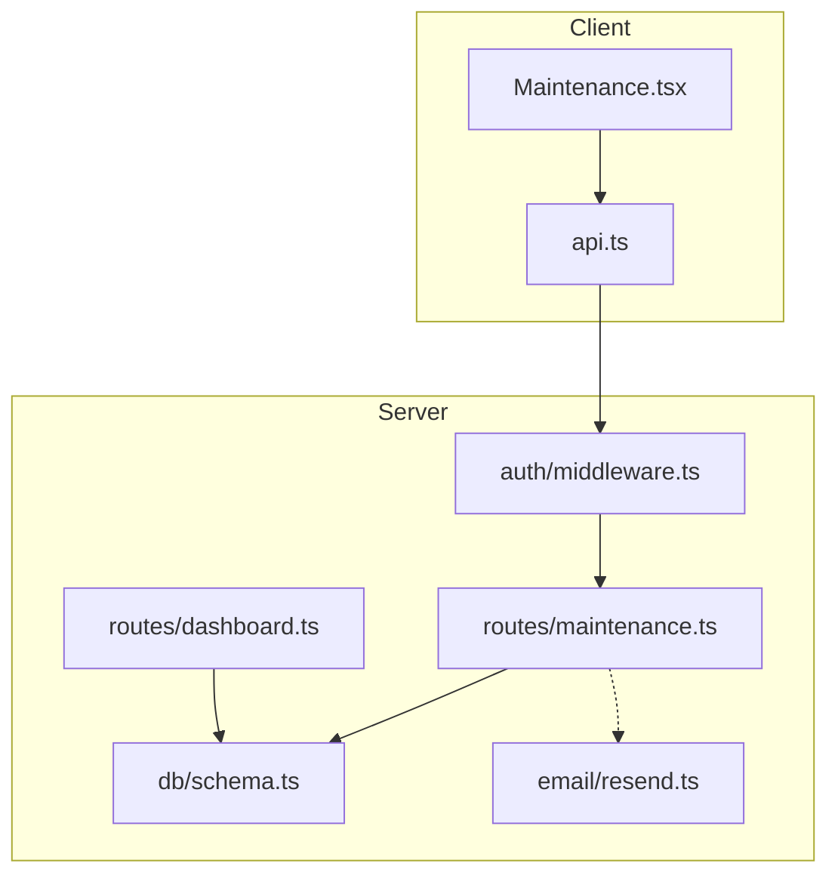
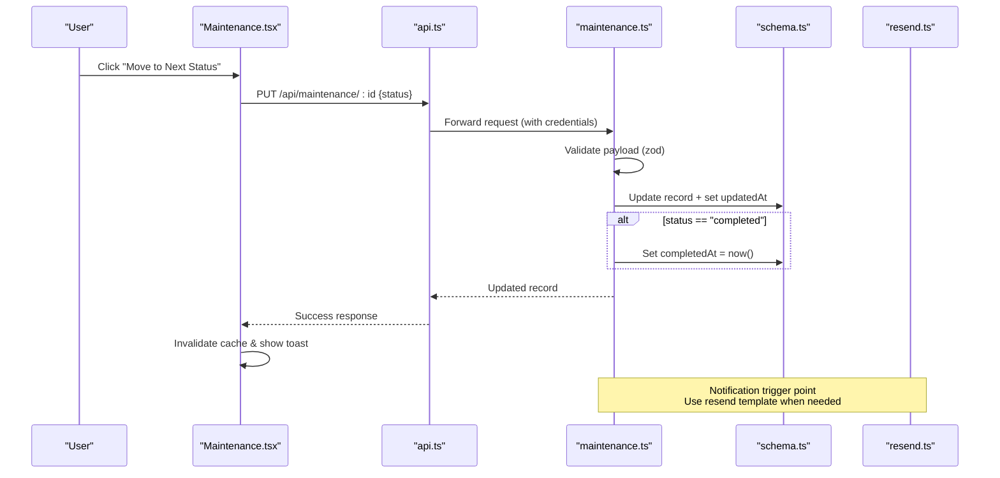
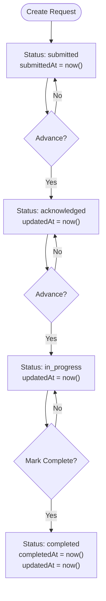
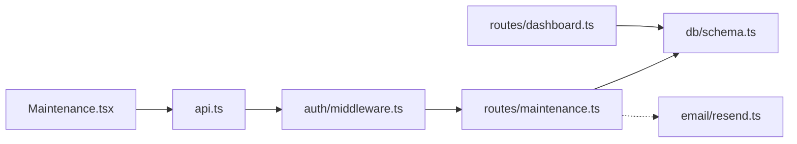

# Maintenance Status Workflow

<cite>
**Referenced Files in This Document**
- [maintenance.ts](file://server/src/routes/maintenance.ts)
- [schema.ts](file://server/src/db/schema.ts)
- [types.ts](file://shared/src/types.ts)
- [Maintenance.tsx](file://client/src/pages/Maintenance.tsx)
- [api.ts](file://client/src/lib/api.ts)
- [dashboard.ts](file://server/src/routes/dashboard.ts)
- [resend.ts](file://server/src/email/resend.ts)
- [middleware.ts](file://server/src/auth/middleware.ts)
</cite>

## Table of Contents
1. Introduction
2. Project Structure
3. Core Components
4. Architecture Overview
5. Detailed Component Analysis
6. Dependency Analysis
7. Performance Considerations
8. Troubleshooting Guide
9. Conclusion

## Introduction
This document explains the maintenance status workflow system, covering the full lifecycle from submitted to acknowledged, in_progress, and completed. It details automatic timestamp handling for submittedAt, updatedAt, and completedAt; business rules governing transitions and who can act; API examples for updating status; completion-triggered automation; notification behavior; UI and dashboard impacts; customization options; escalation procedures for high-priority requests; and troubleshooting guidance for stuck or invalid states.

## Project Structure
The maintenance workflow spans client UI, server routes, database schema, shared types, authentication middleware, email templates, and dashboard aggregation:
- Client: Maintenance page renders a Kanban/list view and triggers status updates via PUT requests.
- Server: Maintenance route validates inputs, persists changes, and manages timestamps.
- Database: Schema defines enums and fields including status and timestamps.
- Shared Types: Define MaintenanceStatus and related types used across layers.
- Auth: Middleware enforces session-based access on protected endpoints.
- Email: Templates exist for maintenance update notifications.
- Dashboard: Aggregates open maintenance counts for reporting.

**Diagram sources**
- [Maintenance.tsx:67-101](file://client/src/pages/Maintenance.tsx#L67-L101)
- [api.ts:26-78](file://client/src/lib/api.ts#L26-L78)
- [middleware.ts:9-27](file://server/src/auth/middleware.ts#L9-L27)
- [maintenance.ts:1-102](file://server/src/routes/maintenance.ts#L1-L102)
- [schema.ts:291-325](file://server/src/db/schema.ts#L291-L325)
- [resend.ts:88-112](file://server/src/email/resend.ts#L88-L112)
- [dashboard.ts:30-71](file://server/src/routes/dashboard.ts#L30-L71)

**Section sources**
- [maintenance.ts:1-102](file://server/src/routes/maintenance.ts#L1-L102)
- [schema.ts:291-325](file://server/src/db/schema.ts#L291-L325)
- [types.ts:92-114](file://shared/src/types.ts#L92-L114)
- [Maintenance.tsx:20-51](file://client/src/pages/Maintenance.tsx#L20-L51)
- [api.ts:26-78](file://client/src/lib/api.ts#L26-L78)
- [dashboard.ts:30-71](file://server/src/routes/dashboard.ts#L30-L71)
- [resend.ts:88-112](file://server/src/email/resend.ts#L88-L112)
- [middleware.ts:9-27](file://server/src/auth/middleware.ts#L9-L27)

## Core Components
- Maintenance Request Entity: Defined with status enum and timestamp fields (submittedAt, updatedAt, completedAt).
- Validation Schema: Enforces allowed statuses and priorities on create/update.
- API Endpoints: Create, Read, Update, Delete for maintenance requests with auth protection.
- Client UI: Kanban/list view with next-step actions based on current status.
- Dashboard Metrics: Counts open maintenance items for alerts.
- Email Templates: Ready-to-use template for maintenance update notifications.

Key responsibilities:
- Server route handles validation, persistence, and timestamp logic.
- Client orchestrates user interactions and calls API methods.
- Dashboard aggregates metrics for reporting.
- Email module provides templates for notifications.

**Section sources**
- [schema.ts:60-71](file://server/src/db/schema.ts#L60-L71)
- [schema.ts:291-325](file://server/src/db/schema.ts#L291-L325)
- [maintenance.ts:11-23](file://server/src/routes/maintenance.ts#L11-L23)
- [maintenance.ts:57-90](file://server/src/routes/maintenance.ts#L57-L90)
- [Maintenance.tsx:20-51](file://client/src/pages/Maintenance.tsx#L20-L51)
- [dashboard.ts:68-71](file://server/src/routes/dashboard.ts#L68-L71)
- [resend.ts:88-112](file://server/src/email/resend.ts#L88-L112)

## Architecture Overview
End-to-end flow for status updates:
- User interacts with the Maintenance UI to advance a request to the next status.
- The client sends a PUT request to /api/maintenance/:id with the new status.
- The server authenticates the request, validates input, applies updates, and sets timestamps.
- On completion, the completedAt timestamp is set automatically.
- Dashboard reflects updated counts for open maintenance.
- Notification templates are available for sending maintenance updates.

**Diagram sources**
- [Maintenance.tsx:93-101](file://client/src/pages/Maintenance.tsx#L93-L101)
- [api.ts:69-74](file://client/src/lib/api.ts#L69-L74)
- [maintenance.ts:69-90](file://server/src/routes/maintenance.ts#L69-L90)
- [schema.ts:291-325](file://server/src/db/schema.ts#L291-L325)
- [resend.ts:88-112](file://server/src/email/resend.ts#L88-L112)

## Detailed Component Analysis

### Status Transition Pipeline
- Allowed statuses: submitted, acknowledged, in_progress, completed.
- Default on creation: submitted.
- Automatic timestamps:
  - submittedAt: set at creation time.
  - updatedAt: set on every update.
  - completedAt: set only when status becomes completed.
- Next-step mapping in UI:
  - submitted → acknowledged
  - acknowledged → in_progress
  - in_progress → completed

**Diagram sources**
- [maintenance.ts:57-90](file://server/src/routes/maintenance.ts#L57-L90)
- [schema.ts:291-325](file://server/src/db/schema.ts#L291-L325)
- [Maintenance.tsx:47-51](file://client/src/pages/Maintenance.tsx#L47-L51)

**Section sources**
- [maintenance.ts:11-23](file://server/src/routes/maintenance.ts#L11-L23)
- [maintenance.ts:57-90](file://server/src/routes/maintenance.ts#L57-L90)
- [schema.ts:60-71](file://server/src/db/schema.ts#L60-L71)
- [schema.ts:291-325](file://server/src/db/schema.ts#L291-L325)
- [types.ts:92-114](file://shared/src/types.ts#L92-L114)
- [Maintenance.tsx:20-51](file://client/src/pages/Maintenance.tsx#L20-L51)

### Business Rules and Permissions
- Authentication: All maintenance endpoints are protected by authMiddleware, requiring a valid session.
- Creation: POST /api/maintenance creates a request with default status submitted and priority routine unless specified.
- Updates: PUT /api/maintenance/:id allows partial updates; updatedAt is always set; completedAt is set only when transitioning to completed.
- Filtering: GET supports filtering by status and priority query parameters.
- Ownership visibility: GET returns requests filtered to properties owned by the authenticated user.

Who can perform actions:
- Any authenticated user can create and update maintenance requests.
- Visibility is scoped to the authenticated user’s properties.

**Section sources**
- [middleware.ts:9-27](file://server/src/auth/middleware.ts#L9-L27)
- [maintenance.ts:25-45](file://server/src/routes/maintenance.ts#L25-L45)
- [maintenance.ts:57-90](file://server/src/routes/maintenance.ts#L57-L90)

### API Examples for Status Updates
- Move from submitted to acknowledged:
  - Method: PUT
  - Path: /api/maintenance/{id}
  - Body: { "status": "acknowledged" }
- Move from acknowledged to in_progress:
  - Method: PUT
  - Path: /api/maintenance/{id}
  - Body: { "status": "in_progress" }
- Mark as completed:
  - Method: PUT
  - Path: /api/maintenance/{id}
  - Body: { "status": "completed" }
  - Effect: Sets completedAt to current timestamp and updatedAt to current timestamp.

Notes:
- Responses include the updated record.
- Errors return standardized messages and codes.

**Section sources**
- [maintenance.ts:69-90](file://server/src/routes/maintenance.ts#L69-L90)
- [api.ts:69-74](file://client/src/lib/api.ts#L69-L74)

### Completion Triggers and Automation
- Timestamps: completedAt is automatically set upon marking completed.
- Notifications: An email template for maintenance updates exists and can be used to notify tenants when status changes.
- Dashboard: Open maintenance count excludes completed items, enabling real-time reporting.

Implementation notes:
- To fully automate notifications, integrate the resend email sender into the PUT handler or a background job triggered by status changes.
- Use the provided template to compose tenant-facing emails.

**Section sources**
- [maintenance.ts:79-82](file://server/src/routes/maintenance.ts#L79-L82)
- [resend.ts:88-112](file://server/src/email/resend.ts#L88-L112)
- [dashboard.ts:68-71](file://server/src/routes/dashboard.ts#L68-L71)

### UI Impact and Reporting Dashboards
- UI:
  - Kanban columns reflect current status; each card shows next-step action based on current status.
  - Color-coded indicators per status improve visual scanning.
  - After moving to completed, a “Completed” indicator appears.
- Dashboard:
  - Alerts section includes “Open Maintenance” count derived from non-completed requests.
  - Quick Actions provide direct navigation to Maintenance.

**Section sources**
- [Maintenance.tsx:20-51](file://client/src/pages/Maintenance.tsx#L20-L51)
- [Maintenance.tsx:198-239](file://client/src/pages/Maintenance.tsx#L198-L239)
- [Dashboard.tsx:88-119](file://client/src/pages/Dashboard.tsx#L88-L119)
- [dashboard.ts:68-71](file://server/src/routes/dashboard.ts#L68-L71)

### Customization Options
- Priority levels: emergency, urgent, routine. These influence UI badges and can drive escalation logic.
- Status labels and next-step mapping are defined in the client; adjust to fit custom workflows if needed.
- Filters: GET supports status and priority filters for dashboards and reports.

**Section sources**
- [maintenance.ts:11-23](file://server/src/routes/maintenance.ts#L11-L23)
- [Maintenance.tsx:28-38](file://client/src/pages/Maintenance.tsx#L28-L38)
- [Maintenance.tsx:39-51](file://client/src/pages/Maintenance.tsx#L39-L51)
- [maintenance.ts:39-44](file://server/src/routes/maintenance.ts#L39-L44)

### Escalation Procedures for High-Priority Requests
- Priorities: emergency and urgent can be flagged during creation.
- Recommended escalation pattern:
  - Auto-notify stakeholders for emergency/urgent requests using the email template.
  - Surface high-priority items prominently in UI (already indicated via badge colors).
  - Add SLA checks in a background process to escalate overdue items (not implemented in current code).
- Integration points:
  - Extend the PUT handler to send notifications on status changes for high-priority items.
  - Enhance dashboard alerts to highlight aging emergency/urgent requests.

**Section sources**
- [maintenance.ts:11-23](file://server/src/routes/maintenance.ts#L11-L23)
- [Maintenance.tsx:28-38](file://client/src/pages/Maintenance.tsx#L28-L38)
- [resend.ts:88-112](file://server/src/email/resend.ts#L88-L112)
- [dashboard.ts:68-71](file://server/src/routes/dashboard.ts#L68-L71)

## Dependency Analysis
- Client depends on api.ts for HTTP operations and uses React Query for caching and invalidation.
- Server routes depend on:
  - auth middleware for session validation.
  - Drizzle ORM and schema for data access.
  - Optional email service for notifications.
- Dashboard depends on maintenanceRequest to compute open counts.

**Diagram sources**
- [Maintenance.tsx:67-101](file://client/src/pages/Maintenance.tsx#L67-L101)
- [api.ts:26-78](file://client/src/lib/api.ts#L26-L78)
- [middleware.ts:9-27](file://server/src/auth/middleware.ts#L9-L27)
- [maintenance.ts:1-102](file://server/src/routes/maintenance.ts#L1-L102)
- [schema.ts:291-325](file://server/src/db/schema.ts#L291-L325)
- [resend.ts:88-112](file://server/src/email/resend.ts#L88-L112)
- [dashboard.ts:30-71](file://server/src/routes/dashboard.ts#L30-L71)

**Section sources**
- [Maintenance.tsx:67-101](file://client/src/pages/Maintenance.tsx#L67-L101)
- [api.ts:26-78](file://client/src/lib/api.ts#L26-L78)
- [maintenance.ts:1-102](file://server/src/routes/maintenance.ts#L1-L102)
- [dashboard.ts:30-71](file://server/src/routes/dashboard.ts#L30-L71)

## Performance Considerations
- Client-side caching: React Query caches maintenance lists and invalidates on mutations to minimize network calls.
- Server queries: GET filters results by user-owned properties; consider indexing propertyId and status for large datasets.
- Batch updates: For bulk status changes, implement batch endpoints to reduce round trips.
- Email throughput: If integrating automated notifications, queue emails asynchronously to avoid blocking request responses.

[No sources needed since this section provides general guidance]

## Troubleshooting Guide
Common issues and resolutions:
- Unauthorized errors:
  - Ensure a valid session exists; the API redirects to login on 401.
  - Verify cookies/credentials are included in requests.
- Validation errors:
  - Check that status values match allowed enums and required fields are present.
- Not found errors:
  - Confirm the maintenance request ID exists before updating.
- Stuck states:
  - Verify that the UI is calling the correct next status based on current state.
  - Inspect updatedAt/completedAt timestamps to confirm updates persisted.
- Missing notifications:
  - If notifications are not sent, ensure the email integration is wired into the update flow and configured with proper credentials.

Operational tips:
- Use GET with status/priority filters to inspect records in specific states.
- Leverage dashboard alerts to identify backlogs or aging items.

**Section sources**
- [api.ts:39-51](file://client/src/lib/api.ts#L39-L51)
- [maintenance.ts:57-90](file://server/src/routes/maintenance.ts#L57-L90)
- [middleware.ts:9-27](file://server/src/auth/middleware.ts#L9-L27)
- [dashboard.ts:68-71](file://server/src/routes/dashboard.ts#L68-L71)

## Conclusion
The maintenance status workflow provides a clear, validated pipeline from submission through completion with robust timestamping and optional notification support. The UI offers an intuitive Kanban experience, while the dashboard surfaces key operational metrics. Extending the system with automated notifications, escalation rules, and SLA monitoring will further enhance responsiveness and accountability for high-priority requests.

[No sources needed since this section summarizes without analyzing specific files]