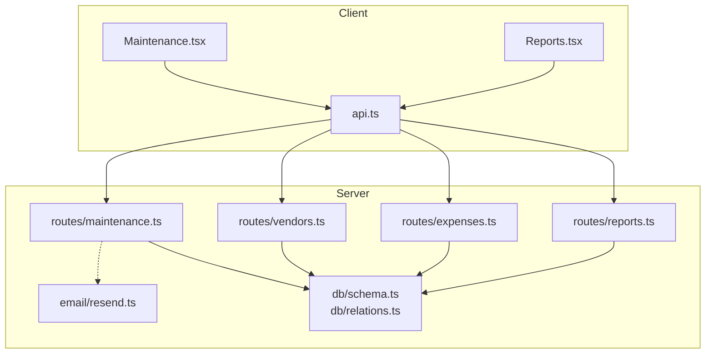
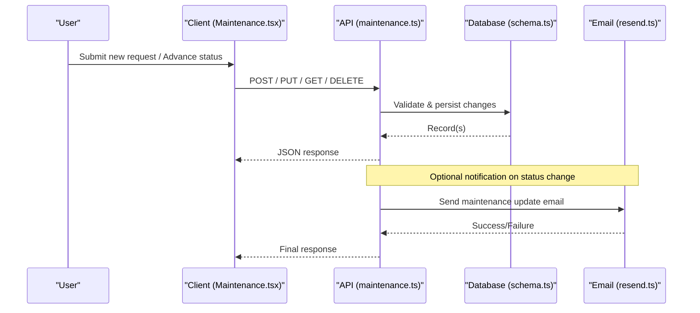
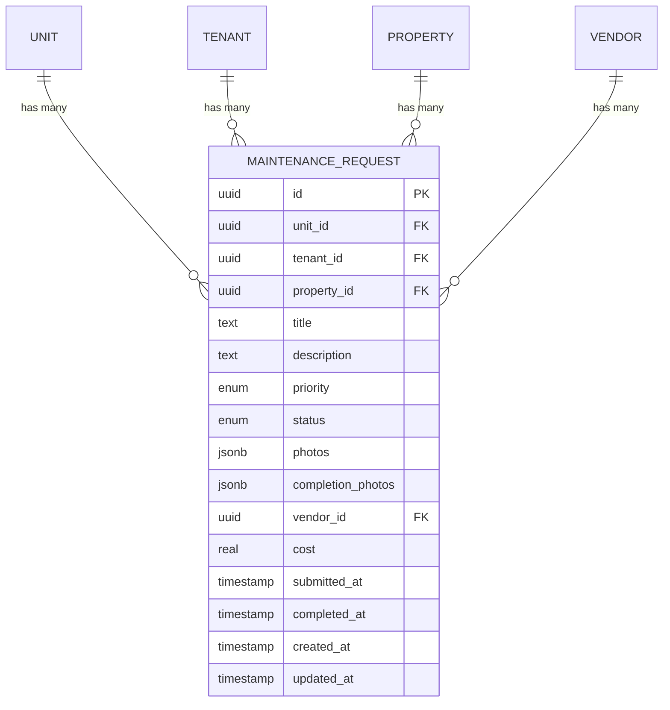
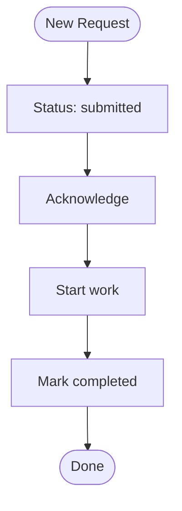
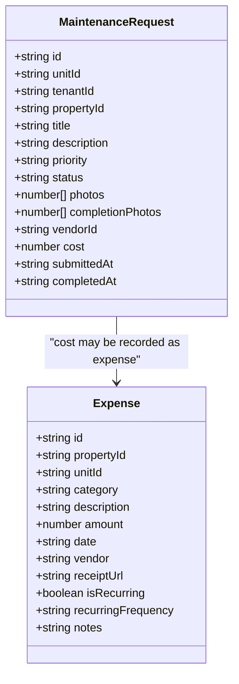
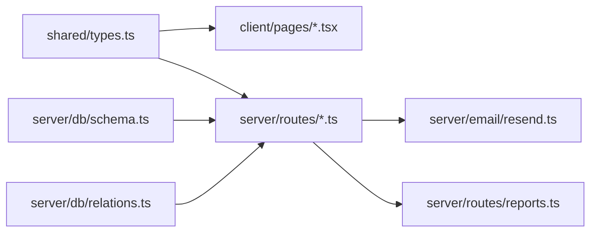

# Maintenance Workflow

<cite>
**Referenced Files in This Document**
- [maintenance.ts](file://server/src/routes/maintenance.ts)
- [Maintenance.tsx](file://client/src/pages/Maintenance.tsx)
- [schema.ts](file://server/src/db/schema.ts)
- [relations.ts](file://server/src/db/relations.ts)
- [types.ts](file://shared/src/types.ts)
- [vendors.ts](file://server/src/routes/vendors.ts)
- [expenses.ts](file://server/src/routes/expenses.ts)
- [resend.ts](file://server/src/email/resend.ts)
- [api.ts](file://client/src/lib/api.ts)
- [reports.ts](file://server/src/routes/reports.ts)
- [Reports.tsx](file://client/src/pages/Reports.tsx)
</cite>

## Table of Contents
1. [Introduction](#introduction)
2. [Project Structure](#project-structure)
3. [Core Components](#core-components)
4. [Architecture Overview](#architecture-overview)
5. [Detailed Component Analysis](#detailed-component-analysis)
6. [Dependency Analysis](#dependency-analysis)
7. [Performance Considerations](#performance-considerations)
8. [Troubleshooting Guide](#troubleshooting-guide)
9. [Conclusion](#conclusion)
10. [Appendices](#appendices)

## Introduction
This document explains the maintenance workflow system in RentLite, covering request submission, prioritization, assignment, status transitions, completion tracking, vendor integration, cost and expense categorization, notifications, API endpoints, UI components, reporting, and performance metrics. It is designed for both technical and non-technical readers to understand how maintenance requests flow from initiation to resolution and how related financial and vendor data are tracked.

## Project Structure
RentLite implements a full-stack architecture:
- Frontend (React + TanStack Query): pages and UI components for maintenance operations and reporting
- Backend (Express + Drizzle ORM): REST APIs for maintenance, vendors, expenses, reports, and email notifications
- Shared types: TypeScript interfaces used across client and server contracts

**Diagram sources**
- [Maintenance.tsx:67-101](file://client/src/pages/Maintenance.tsx#L67-L101)
- [api.ts:26-78](file://client/src/lib/api.ts#L26-L78)
- [maintenance.ts:25-100](file://server/src/routes/maintenance.ts#L25-L100)
- [vendors.ts:20-68](file://server/src/routes/vendors.ts#L20-L68)
- [expenses.ts:30-103](file://server/src/routes/expenses.ts#L30-L103)
- [reports.ts:28-183](file://server/src/routes/reports.ts#L28-L183)
- [schema.ts:291-365](file://server/src/db/schema.ts#L291-L365)
- [relations.ts:77-92](file://server/src/db/relations.ts#L77-L92)
- [resend.ts:7-30](file://server/src/email/resend.ts#L7-L30)

**Section sources**
- [Maintenance.tsx:67-101](file://client/src/pages/Maintenance.tsx#L67-L101)
- [api.ts:26-78](file://client/src/lib/api.ts#L26-L78)
- [maintenance.ts:25-100](file://server/src/routes/maintenance.ts#L25-L100)
- [vendors.ts:20-68](file://server/src/routes/vendors.ts#L20-L68)
- [expenses.ts:30-103](file://server/src/routes/expenses.ts#L30-L103)
- [reports.ts:28-183](file://server/src/routes/reports.ts#L28-L183)
- [schema.ts:291-365](file://server/src/db/schema.ts#L291-L365)
- [relations.ts:77-92](file://server/src/db/relations.ts#L77-L92)
- [resend.ts:7-30](file://server/src/email/resend.ts#L7-L30)

## Core Components
- Maintenance Request lifecycle: submitted → acknowledged → in_progress → completed
- Priority levels: emergency, urgent, routine
- Vendor assignment: optional link to a vendor record
- Cost tracking: per-request cost field; linked to expense categories for accounting
- Notifications: email templates for maintenance updates
- Reporting: cash flow, profit & loss, Schedule E export

Key implementation references:
- Data model and enums: [schema.ts:60-71](file://server/src/db/schema.ts#L60-L71), [schema.ts:291-325](file://server/src/db/schema.ts#L291-L325)
- Types contract: [types.ts:94-114](file://shared/src/types.ts#L94-L114)
- API routes: [maintenance.ts:25-100](file://server/src/routes/maintenance.ts#L25-L100)
- UI flows: [Maintenance.tsx:20-51](file://client/src/pages/Maintenance.tsx#L20-L51), [Maintenance.tsx:67-101](file://client/src/pages/Maintenance.tsx#L67-L101)
- Email template: [resend.ts:88-112](file://server/src/email/resend.ts#L88-L112)

**Section sources**
- [schema.ts:60-71](file://server/src/db/schema.ts#L60-L71)
- [schema.ts:291-325](file://server/src/db/schema.ts#L291-L325)
- [types.ts:94-114](file://shared/src/types.ts#L94-L114)
- [maintenance.ts:25-100](file://server/src/routes/maintenance.ts#L25-L100)
- [Maintenance.tsx:20-51](file://client/src/pages/Maintenance.tsx#L20-L51)
- [Maintenance.tsx:67-101](file://client/src/pages/Maintenance.tsx#L67-L101)
- [resend.ts:88-112](file://server/src/email/resend.ts#L88-L112)

## Architecture Overview
The maintenance workflow spans UI interactions, API validation, database persistence, and optional email notifications.

**Diagram sources**
- [Maintenance.tsx:67-101](file://client/src/pages/Maintenance.tsx#L67-L101)
- [maintenance.ts:57-90](file://server/src/routes/maintenance.ts#L57-L90)
- [schema.ts:291-325](file://server/src/db/schema.ts#L291-L325)
- [resend.ts:88-112](file://server/src/email/resend.ts#L88-L112)

## Detailed Component Analysis

### Maintenance Request Data Model
- Fields include unit, tenant, property, title, description, priority, status, photos, completionPhotos, vendorId, cost, timestamps
- Enums define allowed values for priority and status
- Relationships connect maintenanceRequest to unit, tenant, property, and vendor

**Diagram sources**
- [schema.ts:291-325](file://server/src/db/schema.ts#L291-L325)
- [relations.ts:77-80](file://server/src/db/relations.ts#L77-L80)

**Section sources**
- [schema.ts:291-325](file://server/src/db/schema.ts#L291-L325)
- [relations.ts:77-80](file://server/src/db/relations.ts#L77-L80)
- [types.ts:94-114](file://shared/src/types.ts#L94-L114)

### Status Transitions and Workflow
- Allowed statuses: submitted, acknowledged, in_progress, completed
- Next-step mapping enforced by UI; backend allows partial updates with automatic completion timestamp when marking completed
- Filtering by status and priority supported via query parameters

**Diagram sources**
- [Maintenance.tsx:20-51](file://client/src/pages/Maintenance.tsx#L20-L51)
- [maintenance.ts:69-90](file://server/src/routes/maintenance.ts#L69-L90)
- [schema.ts:66-71](file://server/src/db/schema.ts#L66-L71)

**Section sources**
- [Maintenance.tsx:20-51](file://client/src/pages/Maintenance.tsx#L20-L51)
- [maintenance.ts:69-90](file://server/src/routes/maintenance.ts#L69-L90)
- [schema.ts:66-71](file://server/src/db/schema.ts#L66-L71)

### API Endpoints for Maintenance Operations
- GET /api/maintenance: list requests filtered by user’s properties; supports status and priority query filters
- GET /api/maintenance/:id: fetch single request with relations
- POST /api/maintenance: create a new request with validation
- PUT /api/maintenance/:id: update fields including status; sets completedAt when marked completed
- DELETE /api/maintenance/:id: delete a request

Validation schema enforces required fields and allowed enums for priority and status.

**Section sources**
- [maintenance.ts:11-23](file://server/src/routes/maintenance.ts#L11-L23)
- [maintenance.ts:25-100](file://server/src/routes/maintenance.ts#L25-L100)

### Vendor Management API
- GET /api/vendors: list vendors owned by current user
- POST /api/vendors: create vendor with name, trade, contact info, insurance expiry, notes
- PUT /api/vendors/:id: update vendor details
- DELETE /api/vendors/:id: remove vendor

Vendor records can be assigned to maintenance requests via vendorId.

**Section sources**
- [vendors.ts:11-68](file://server/src/routes/vendors.ts#L11-L68)
- [schema.ts:352-365](file://server/src/db/schema.ts#L352-L365)
- [relations.ts:88-92](file://server/src/db/relations.ts#L88-L92)

### Expense Tracking and Categorization
- Expenses are tracked separately with IRS-compatible categories
- Categories include repairs, cleaning, supplies, utilities, etc.
- Maintenance costs can be recorded on the request and also categorized under expenses for reporting

**Diagram sources**
- [schema.ts:291-348](file://server/src/db/schema.ts#L291-L348)
- [types.ts:94-149](file://shared/src/types.ts#L94-L149)

**Section sources**
- [schema.ts:291-348](file://server/src/db/schema.ts#L291-L348)
- [expenses.ts:11-28](file://server/src/routes/expenses.ts#L11-L28)
- [types.ts:94-149](file://shared/src/types.ts#L94-L149)

### Notifications
- Email template exists for maintenance updates with status labels
- Integration uses Resend; sendEmail function returns success/failure
- Template supports acknowledging, working on, or completing requests

**Section sources**
- [resend.ts:7-30](file://server/src/email/resend.ts#L7-L30)
- [resend.ts:88-112](file://server/src/email/resend.ts#L88-L112)

### User Interface Components
- Maintenance page provides:
  - Kanban-style view grouped by status
  - Tabs to filter by status
  - New request modal with property/unit selection, title, description, priority
  - Move-to-next-status action per card
- Reports page provides:
  - Cash flow charts and net income trends
  - Profit & Loss summaries
  - Schedule E line items and CSV export

**Section sources**
- [Maintenance.tsx:61-318](file://client/src/pages/Maintenance.tsx#L61-L318)
- [Reports.tsx:60-379](file://client/src/pages/Reports.tsx#L60-L379)

### Common Maintenance Scenarios and Escalation Procedures
- Emergency leak: submit with priority “emergency”; landlord acknowledges quickly; assign vendor; mark in progress; complete with photos; log cost and expense category “repairs”
- Routine HVAC tune-up: submit “routine”; schedule vendor; track cost; categorize under “cleaning” or “supplies”
- Escalation: if an urgent request remains unacknowledged beyond SLA, escalate to management; notify via email template; reassign vendor if needed

[No sources needed since this section describes conceptual scenarios]

## Dependency Analysis
- Client depends on shared types for consistent contracts
- Server routes depend on schema and relations for queries and constraints
- Email module is decoupled and invoked optionally
- Reports aggregate payments and expenses for financial insights

**Diagram sources**
- [types.ts:94-149](file://shared/src/types.ts#L94-L149)
- [schema.ts:291-365](file://server/src/db/schema.ts#L291-L365)
- [relations.ts:77-92](file://server/src/db/relations.ts#L77-L92)
- [resend.ts:7-30](file://server/src/email/resend.ts#L7-L30)
- [reports.ts:28-183](file://server/src/routes/reports.ts#L28-L183)

**Section sources**
- [types.ts:94-149](file://shared/src/types.ts#L94-L149)
- [schema.ts:291-365](file://server/src/db/schema.ts#L291-L365)
- [relations.ts:77-92](file://server/src/db/relations.ts#L77-L92)
- [resend.ts:7-30](file://server/src/email/resend.ts#L7-L30)
- [reports.ts:28-183](file://server/src/routes/reports.ts#L28-L183)

## Performance Considerations
- Use query filtering on the server side (status, priority) to reduce payload size
- Avoid unnecessary joins; load relations only when needed (e.g., detail view)
- Cache frequently accessed lists (properties, units) on the client using React Query keys
- For large datasets, consider pagination on list endpoints (future enhancement)
- Batch updates where possible to minimize network calls

[No sources needed since this section provides general guidance]

## Troubleshooting Guide
- Validation errors: check Zod schemas for required fields and enums
- Not found responses: verify IDs exist and belong to the authenticated user
- Unauthorized redirects: ensure session cookies are included in requests
- Email failures: inspect resend error logs and retry logic

Common checks:
- Ensure property ownership filtering is applied for tenant-visible data
- Confirm that status transitions follow allowed sequences
- Verify vendor assignments match existing vendor records

**Section sources**
- [maintenance.ts:57-90](file://server/src/routes/maintenance.ts#L57-L90)
- [vendors.ts:30-68](file://server/src/routes/vendors.ts#L30-L68)
- [api.ts:39-51](file://client/src/lib/api.ts#L39-L51)
- [resend.ts:20-29](file://server/src/email/resend.ts#L20-L29)

## Conclusion
RentLite’s maintenance workflow provides a clear, auditable path from request submission through resolution, with robust data modeling, vendor integration, cost tracking, and reporting. The UI streamlines daily operations while the backend enforces consistency and security. Extending the system with automated notifications, SLA alerts, and advanced analytics will further improve operational efficiency.

[No sources needed since this section summarizes without analyzing specific files]

## Appendices

### API Reference Summary
- Maintenance
  - GET /api/maintenance?status=&priority=
  - GET /api/maintenance/:id
  - POST /api/maintenance
  - PUT /api/maintenance/:id
  - DELETE /api/maintenance/:id
- Vendors
  - GET /api/vendors
  - POST /api/vendors
  - PUT /api/vendors/:id
  - DELETE /api/vendors/:id
- Expenses
  - GET /api/expenses?propertyId=&category=&year=&month=
  - GET /api/expenses/:id
  - POST /api/expenses
  - PUT /api/expenses/:id
  - DELETE /api/expenses/:id
- Reports
  - GET /api/reports/cashflow?year=
  - GET /api/reports/pnl?year=&quarter=
  - GET /api/reports/schedule-e?year=

**Section sources**
- [maintenance.ts:25-100](file://server/src/routes/maintenance.ts#L25-L100)
- [vendors.ts:20-68](file://server/src/routes/vendors.ts#L20-L68)
- [expenses.ts:30-103](file://server/src/routes/expenses.ts#L30-L103)
- [reports.ts:28-183](file://server/src/routes/reports.ts#L28-L183)