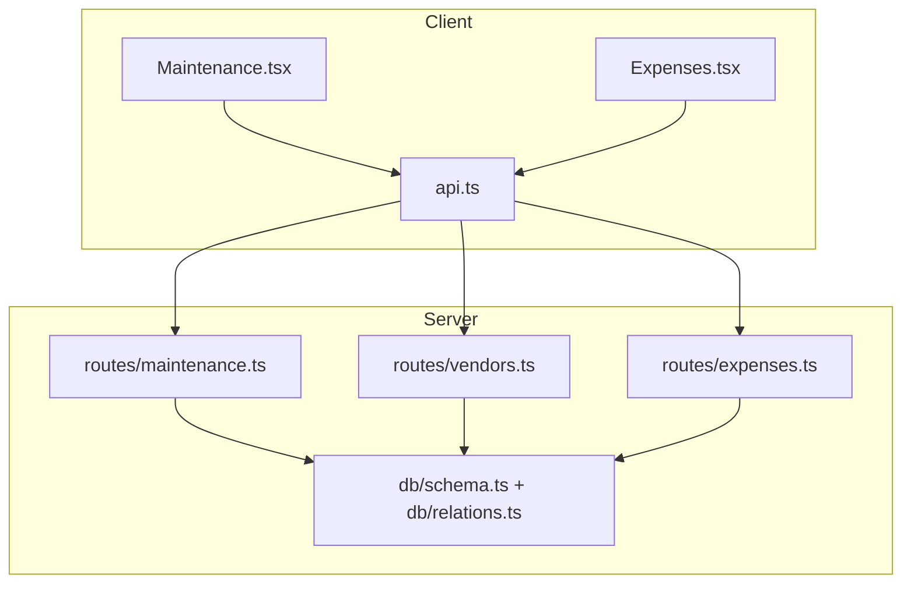
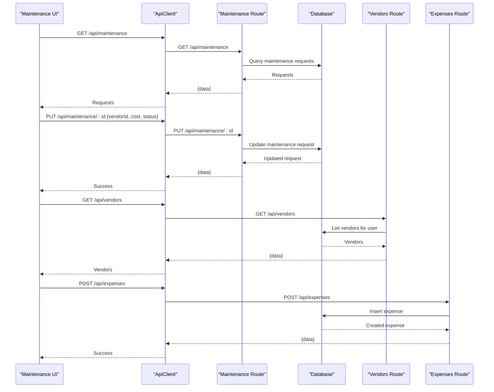
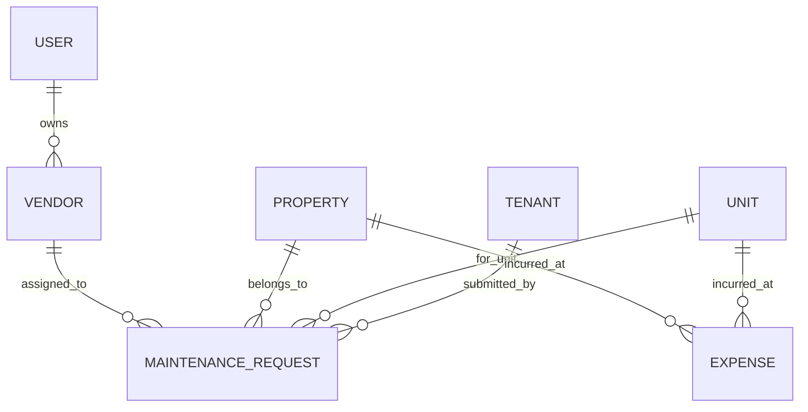
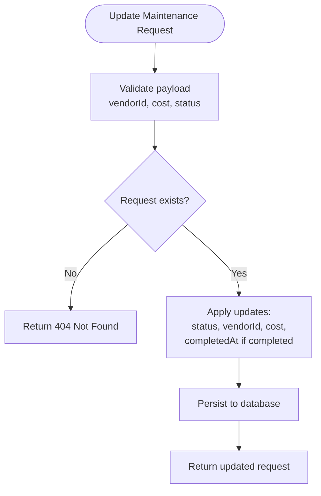
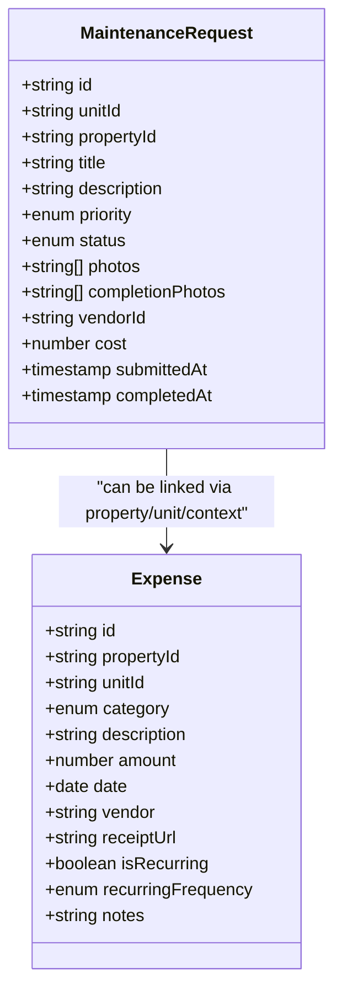
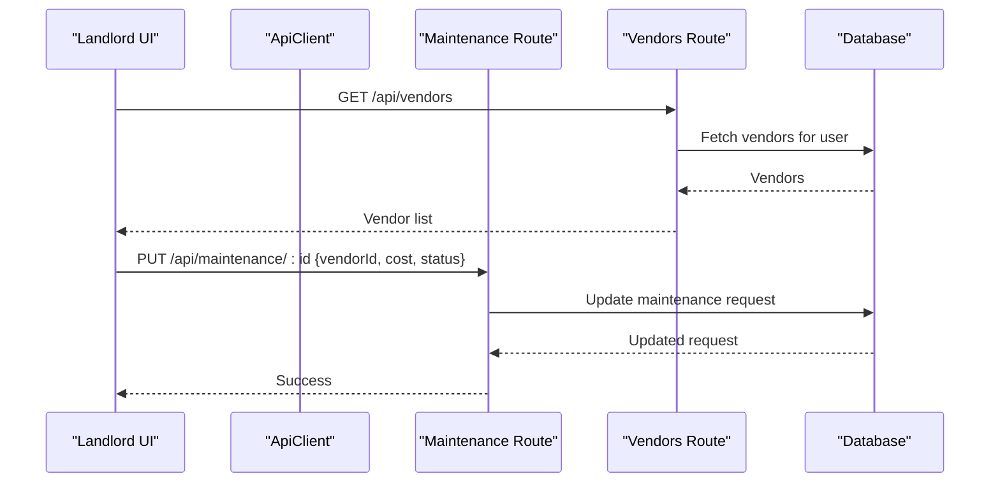
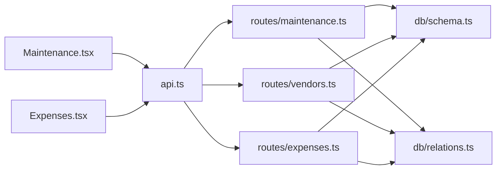

# Vendor Assignment and Tracking

<cite>
**Referenced Files in This Document**
- [schema.ts](file://server/src/db/schema.ts)
- [relations.ts](file://server/src/db/relations.ts)
- [maintenance.ts](file://server/src/routes/maintenance.ts)
- [vendors.ts](file://server/src/routes/vendors.ts)
- [expenses.ts](file://server/src/routes/expenses.ts)
- [Maintenance.tsx](file://client/src/pages/Maintenance.tsx)
- [Expenses.tsx](file://client/src/pages/Expenses.tsx)
- [api.ts](file://client/src/lib/api.ts)
- [types.ts](file://shared/src/types.ts)
</cite>

## Table of Contents
1. Introduction
2. Project Structure
3. Core Components
4. Architecture Overview
5. Detailed Component Analysis
6. Dependency Analysis
7. Performance Considerations
8. Troubleshooting Guide
9. Conclusion
10. Appendices

## Introduction
This document explains how vendors are assigned to maintenance requests, how costs are tracked, and how vendor data relates to maintenance workflows. It covers the data model, API endpoints, client interactions, and integration points between maintenance requests and vendor management. It also outlines notification capabilities and provides examples of assignment and cost tracking scenarios.

## Project Structure
The system is organized into:
- Server routes for maintenance, vendors, and expenses
- Database schema and relations defining entities and their relationships
- Client pages that drive user interactions for maintenance and expenses
- Shared types used across frontend and backend

**Diagram sources**
- [Maintenance.tsx:67-101](file://client/src/pages/Maintenance.tsx#L67-L101)
- [Expenses.tsx:207-232](file://client/src/pages/Expenses.tsx#L207-L232)
- [api.ts:26-78](file://client/src/lib/api.ts#L26-L78)
- [maintenance.ts:25-90](file://server/src/routes/maintenance.ts#L25-L90)
- [vendors.ts:20-68](file://server/src/routes/vendors.ts#L20-L68)
- [expenses.ts:30-103](file://server/src/routes/expenses.ts#L30-L103)
- [schema.ts:291-365](file://server/src/db/schema.ts#L291-L365)
- [relations.ts:74-92](file://server/src/db/relations.ts#L74-L92)

**Section sources**
- [Maintenance.tsx:67-101](file://client/src/pages/Maintenance.tsx#L67-L101)
- [api.ts:26-78](file://client/src/lib/api.ts#L26-L78)
- [maintenance.ts:25-90](file://server/src/routes/maintenance.ts#L25-L90)
- [vendors.ts:20-68](file://server/src/routes/vendors.ts#L20-L68)
- [expenses.ts:30-103](file://server/src/routes/expenses.ts#L30-L103)
- [schema.ts:291-365](file://server/src/db/schema.ts#L291-L365)
- [relations.ts:74-92](file://server/src/db/relations.ts#L74-L92)

## Core Components
- Vendor management: CRUD operations for vendors with ownership by user
- Maintenance workflow: Create, update status, and associate a vendor and cost
- Expense tracking: Record costs with categories and optional vendor references
- Data model: Entities and relations linking vendors to maintenance requests and properties

Key responsibilities:
- Vendors route: list, create, update, delete vendors scoped to the authenticated user
- Maintenance route: create requests, update status (including completion), attach vendorId and cost
- Expenses route: record expenses with category, amount, date, and vendor name
- Schema and relations: define tables and relationships including vendorId on maintenanceRequest

**Section sources**
- [vendors.ts:20-68](file://server/src/routes/vendors.ts#L20-L68)
- [maintenance.ts:11-90](file://server/src/routes/maintenance.ts#L11-L90)
- [expenses.ts:11-103](file://server/src/routes/expenses.ts#L11-L103)
- [schema.ts:291-365](file://server/src/db/schema.ts#L291-L365)
- [relations.ts:74-92](file://server/src/db/relations.ts#L74-L92)

## Architecture Overview
The maintenance-to-vendor flow involves:
- Frontend components calling APIs via a shared client
- Backend routes validating input and persisting changes
- Database schema enforcing relationships and constraints
- Optional notifications infrastructure for updates

**Diagram sources**
- [Maintenance.tsx:67-101](file://client/src/pages/Maintenance.tsx#L67-L101)
- [api.ts:26-78](file://client/src/lib/api.ts#L26-L78)
- [maintenance.ts:25-90](file://server/src/routes/maintenance.ts#L25-L90)
- [vendors.ts:20-68](file://server/src/routes/vendors.ts#L20-L68)
- [expenses.ts:65-79](file://server/src/routes/expenses.ts#L65-L79)
- [schema.ts:291-365](file://server/src/db/schema.ts#L291-L365)

## Detailed Component Analysis

### Vendor Data Model and Relationships
- Vendor entity includes identity, trade, contact info, insurance expiry, notes, timestamps, and ownership via userId
- MaintenanceRequest has an optional vendorId referencing vendor.id; when set, it links the request to a specific vendor
- Relations define one-to-many from vendor to maintenance requests and many-to-one from maintenance request to vendor

**Diagram sources**
- [schema.ts:291-365](file://server/src/db/schema.ts#L291-L365)
- [relations.ts:74-92](file://server/src/db/relations.ts#L74-L92)

**Section sources**
- [schema.ts:291-365](file://server/src/db/schema.ts#L291-L365)
- [relations.ts:74-92](file://server/src/db/relations.ts#L74-L92)

### Vendor Assignment Process
- Vendors are listed per user via GET /api/vendors
- Maintenance requests can be updated with vendorId and cost via PUT /api/maintenance/:id
- The maintenance route accepts vendorId as an optional field and persists it alongside status updates

**Diagram sources**
- [maintenance.ts:69-90](file://server/src/routes/maintenance.ts#L69-L90)

**Section sources**
- [maintenance.ts:69-90](file://server/src/routes/maintenance.ts#L69-L90)
- [vendors.ts:20-68](file://server/src/routes/vendors.ts#L20-L68)

### Cost Tracking Mechanisms
- MaintenanceRequest stores an optional cost field for estimated or actual costs tied to the request
- Expenses store detailed cost records with category, amount, date, and optional vendor name
- Categories include repairs and other IRS-compatible classifications for reporting

**Diagram sources**
- [schema.ts:291-348](file://server/src/db/schema.ts#L291-L348)

**Section sources**
- [schema.ts:291-348](file://server/src/db/schema.ts#L291-L348)
- [expenses.ts:11-103](file://server/src/routes/expenses.ts#L11-L103)

### Vendor Selection Criteria and Assignment Workflows
- Vendor selection criteria:
  - Trade specialization matching the maintenance need
  - Contact availability (phone/email)
  - Insurance expiry status for compliance
  - Ownership association to the landlord’s account
- Assignment workflow:
  - Landlord selects a vendor from the user-scoped vendor list
  - Updates the maintenance request with vendorId and optionally cost
  - Status progresses through submitted -> acknowledged -> in_progress -> completed
  - Completion sets completedAt timestamp

**Diagram sources**
- [vendors.ts:20-68](file://server/src/routes/vendors.ts#L20-L68)
- [maintenance.ts:69-90](file://server/src/routes/maintenance.ts#L69-L90)

**Section sources**
- [vendors.ts:20-68](file://server/src/routes/vendors.ts#L20-L68)
- [maintenance.ts:69-90](file://server/src/routes/maintenance.ts#L69-L90)

### Vendor Performance Evaluation Metrics
- Current implementation does not compute vendor performance metrics automatically
- Suggested metrics based on available fields:
  - Number of assignments per vendor (via maintenanceRequests relation)
  - Average cost per assignment (from maintenanceRequest.cost)
  - Completion time (difference between submittedAt and completedAt)
  - Reassignment rate (requests without vendorId vs. with vendorId)
- These metrics would require additional aggregation logic beyond current routes

[No sources needed since this section proposes enhancements not implemented]

### Integration Between Maintenance Requests and Vendor Management Systems
- Direct integration:
  - vendorId on maintenanceRequest links a request to a vendor record
  - Retrieval of a single maintenance request includes vendor details via relations
- Indirect integration:
  - Expenses can reference vendor names for accounting purposes
  - Property and unit context tie both maintenance and expenses together

**Section sources**
- [relations.ts:74-92](file://server/src/db/relations.ts#L74-L92)
- [maintenance.ts:47-55](file://server/src/routes/maintenance.ts#L47-L55)
- [expenses.ts:11-103](file://server/src/routes/expenses.ts#L11-L103)

### Vendor Communication Patterns and Notification Systems
- Notification schema supports channels (email, sms, in_app) and types including maintenance_update
- Current routes do not send notifications automatically on vendor assignment or status changes
- To implement communication:
  - Create notifications on vendor assignment or status transitions
  - Use channel and recipient fields to target landlords or tenants
  - Track status (pending, sent, failed) and timestamps for delivery

**Section sources**
- [schema.ts:367-383](file://server/src/db/schema.ts#L367-L383)

## Dependency Analysis
- Client dependencies:
  - Maintenance.tsx uses api.ts to call maintenance endpoints
  - Expenses.tsx uses api.ts to call expense endpoints
- Server dependencies:
  - Routes depend on db schema and relations for queries and writes
  - Auth middleware protects all routes
- Data dependencies:
  - maintenanceRequest depends on unit, tenant, property, vendor
  - expense depends on property and unit

**Diagram sources**
- [Maintenance.tsx:67-101](file://client/src/pages/Maintenance.tsx#L67-L101)
- [Expenses.tsx:207-232](file://client/src/pages/Expenses.tsx#L207-L232)
- [api.ts:26-78](file://client/src/lib/api.ts#L26-L78)
- [maintenance.ts:25-90](file://server/src/routes/maintenance.ts#L25-L90)
- [vendors.ts:20-68](file://server/src/routes/vendors.ts#L20-L68)
- [expenses.ts:30-103](file://server/src/routes/expenses.ts#L30-L103)
- [schema.ts:291-365](file://server/src/db/schema.ts#L291-L365)
- [relations.ts:74-92](file://server/src/db/relations.ts#L74-L92)

**Section sources**
- [Maintenance.tsx:67-101](file://client/src/pages/Maintenance.tsx#L67-L101)
- [api.ts:26-78](file://client/src/lib/api.ts#L26-L78)
- [maintenance.ts:25-90](file://server/src/routes/maintenance.ts#L25-L90)
- [vendors.ts:20-68](file://server/src/routes/vendors.ts#L20-L68)
- [expenses.ts:30-103](file://server/src/routes/expenses.ts#L30-L103)
- [schema.ts:291-365](file://server/src/db/schema.ts#L291-L365)
- [relations.ts:74-92](file://server/src/db/relations.ts#L74-L92)

## Performance Considerations
- Filtering maintenance requests by user properties reduces dataset size
- Using relations efficiently avoids N+1 queries when fetching related data
- Indexing vendorId and propertyId columns could improve query performance at scale
- Caching vendor lists on the client side may reduce repeated network calls

[No sources needed since this section provides general guidance]

## Troubleshooting Guide
Common issues and resolutions:
- Validation errors: Ensure vendorId is a valid UUID when provided; check payload structure against schemas
- Not found errors: Verify maintenance request or vendor IDs exist before updates
- Unauthorized access: Confirm authentication middleware is applied and credentials are included
- Missing vendor details: When retrieving a single maintenance request, ensure relations include vendor

**Section sources**
- [maintenance.ts:57-90](file://server/src/routes/maintenance.ts#L57-L90)
- [vendors.ts:30-68](file://server/src/routes/vendors.ts#L30-L68)
- [expenses.ts:65-103](file://server/src/routes/expenses.ts#L65-L103)
- [api.ts:26-54](file://client/src/lib/api.ts#L26-L54)

## Conclusion
The system supports vendor assignment to maintenance requests through vendorId and tracks costs via maintenanceRequest.cost and detailed expense records. While vendor performance metrics are not computed automatically, the data model enables future analytics. Notifications infrastructure exists but requires explicit integration to communicate assignments and updates. The current implementation provides a solid foundation for extending vendor management and cost tracking workflows.

[No sources needed since this section summarizes without analyzing specific files]

## Appendices

### Example Scenarios

- Vendor assignment workflow:
  - Landlord retrieves vendor list via GET /api/vendors
  - Landlord updates maintenance request with vendorId and cost via PUT /api/maintenance/:id
  - Status advances to completed, setting completedAt

- Cost tracking scenario:
  - After vendor completes work, landlord records expense with category "repairs", amount, date, and vendor name
  - Maintenance request cost reflects actual cost; expense entry supports receipts and categorization

**Section sources**
- [vendors.ts:20-68](file://server/src/routes/vendors.ts#L20-L68)
- [maintenance.ts:69-90](file://server/src/routes/maintenance.ts#L69-L90)
- [expenses.ts:65-79](file://server/src/routes/expenses.ts#L65-L79)