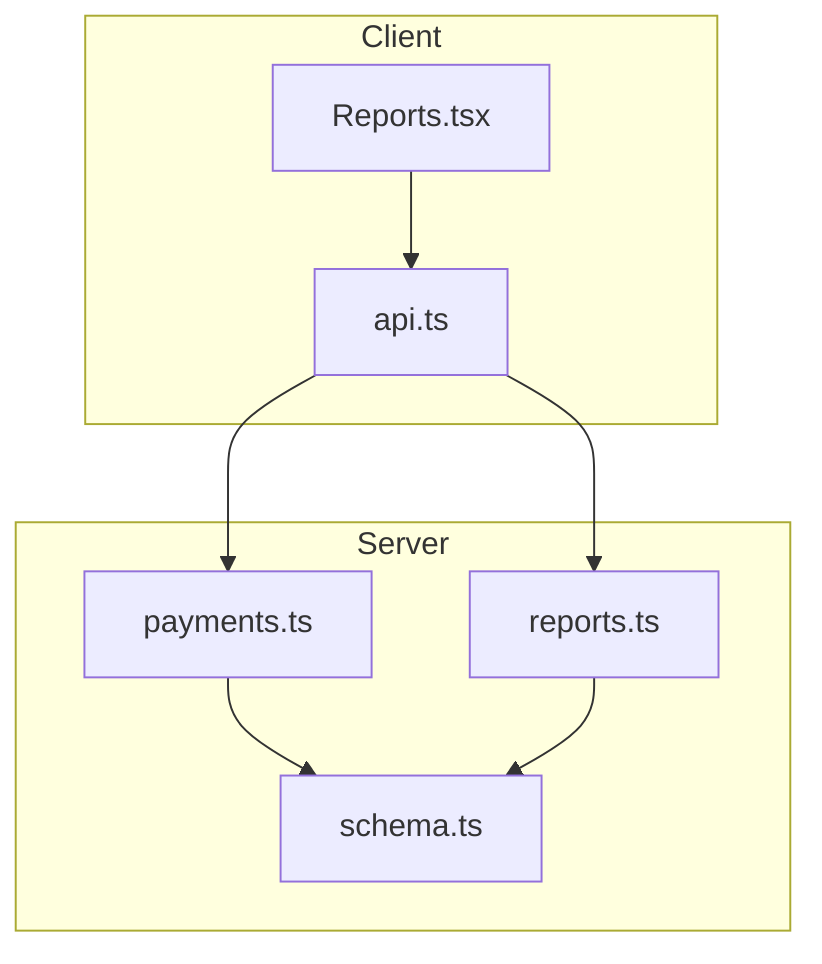
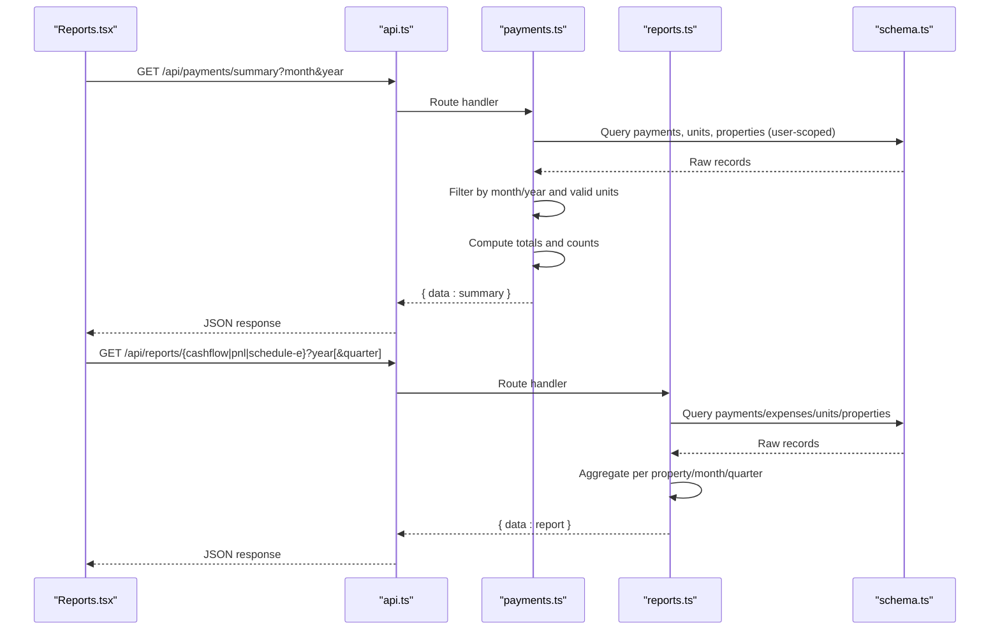
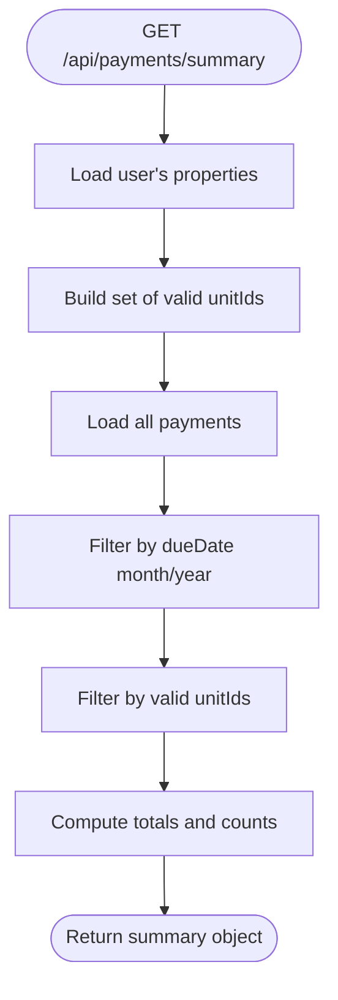
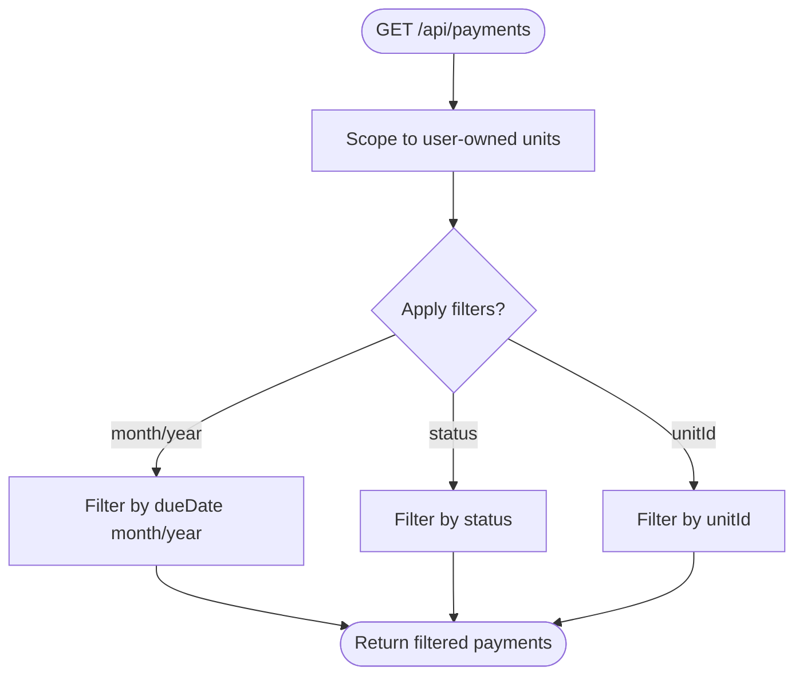
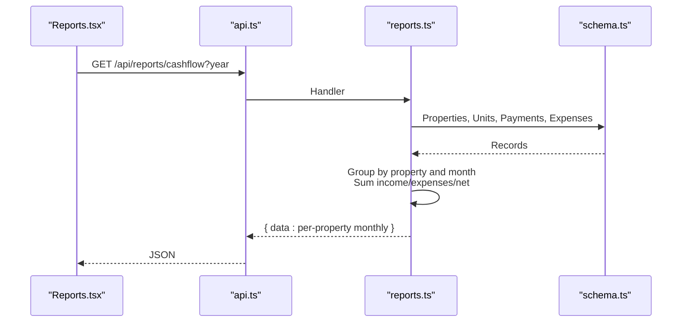
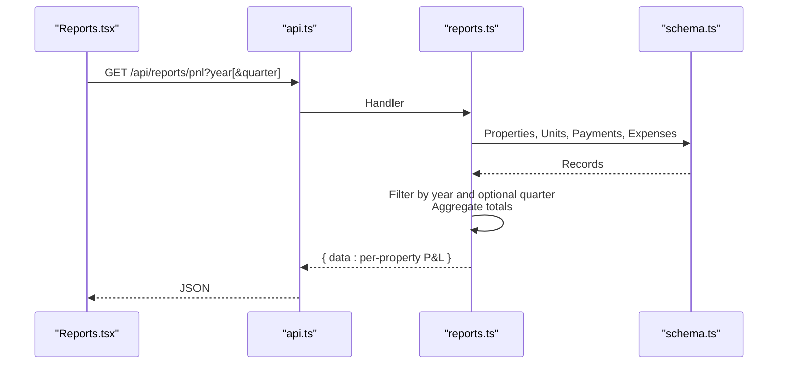
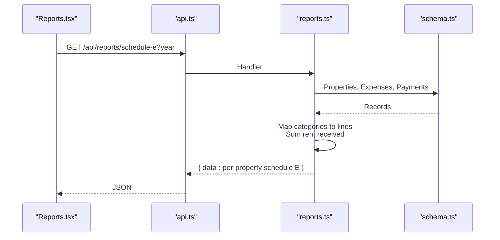
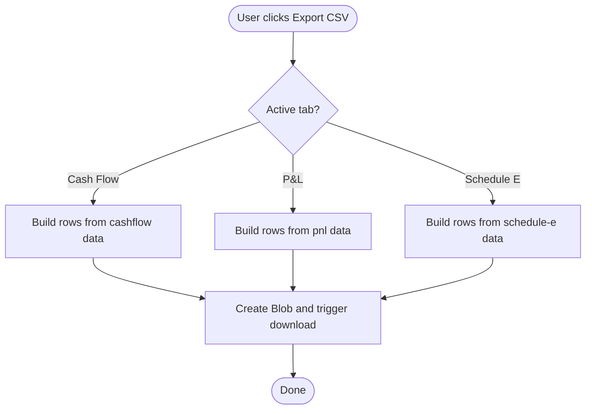
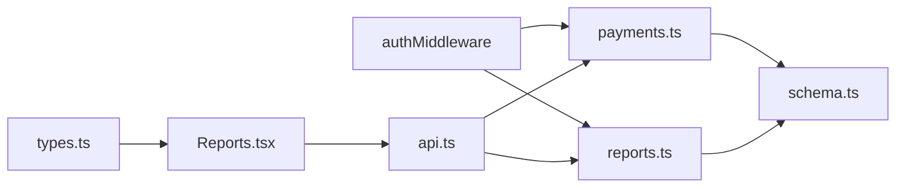

# Financial Reporting

<cite>
**Referenced Files in This Document**
- [payments.ts](file://server/src/routes/payments.ts)
- [reports.ts](file://server/src/routes/reports.ts)
- [schema.ts](file://server/src/db/schema.ts)
- [types.ts](file://shared/src/types.ts)
- [Reports.tsx](file://client/src/pages/Reports.tsx)
- [api.ts](file://client/src/lib/api.ts)
</cite>

## Table of Contents
1. Introduction
2. Project Structure
3. Core Components
4. Architecture Overview
5. Detailed Component Analysis
6. Dependency Analysis
7. Performance Considerations
8. Troubleshooting Guide
9. Conclusion
10. Appendices

## Introduction
This document explains RentLite’s financial reporting capabilities for the payment system, focusing on:
- The monthly rent collection summary endpoint and its metrics
- Generating payment reports filtered by date ranges, properties, and statuses
- Export formats and integration considerations with accounting systems
- Common reporting scenarios (monthly collections, annual summaries, property performance analysis)
- Data accuracy, audit trails, and compliance reporting requirements

## Project Structure
RentLite exposes server-side endpoints for payments and reports, a shared type layer, and a client that consumes these APIs to render charts and export CSVs.

**Diagram sources**
- [Payments.tsx:60-135](file://client/src/pages/Reports.tsx#L60-L135)
- [api.ts:1-82](file://client/src/lib/api.ts#L1-L82)
- [payments.ts:24-101](file://server/src/routes/payments.ts#L24-L101)
- [reports.ts:28-183](file://server/src/routes/reports.ts#L28-L183)
- [schema.ts:268-348](file://server/src/db/schema.ts#L268-L348)

**Section sources**
- [payments.ts:24-101](file://server/src/routes/payments.ts#L24-L101)
- [reports.ts:28-183](file://server/src/routes/reports.ts#L28-L183)
- [schema.ts:268-348](file://server/src/db/schema.ts#L268-L348)
- [Reports.tsx:60-135](file://client/src/pages/Reports.tsx#L60-L135)
- [api.ts:1-82](file://client/src/lib/api.ts#L1-L82)

## Core Components
- Monthly rent collection summary endpoint: GET /api/payments/summary
  - Filters payments by month/year and user-owned units
  - Computes totalExpected, totalCollected, totalOutstanding, collectionRate, paymentCount, receivedCount, lateCount, pendingCount
- Additional report endpoints:
  - GET /api/reports/cashflow — monthly cash flow per property
  - GET /api/reports/pnl — profit & loss per property (year or quarter)
  - GET /api/reports/schedule-e — Schedule E helper for tax reporting
- Client Reports page:
  - Displays charts and per-property breakdowns
  - Exports CSV for each tab

Key data models:
- Payment: amount, amountPaid, dueDate, paidDate, method, status, lateFee, notes, timestamps
- Expense: category, amount, date, vendor, receiptUrl, recurring flags
- Property/Unit: used to scope reports to user-owned assets

**Section sources**
- [payments.ts:61-101](file://server/src/routes/payments.ts#L61-L101)
- [reports.ts:28-183](file://server/src/routes/reports.ts#L28-L183)
- [schema.ts:268-348](file://server/src/db/schema.ts#L268-L348)
- [types.ts:70-149](file://shared/src/types.ts#L70-L149)
- [Reports.tsx:60-135](file://client/src/pages/Reports.tsx#L60-L135)

## Architecture Overview
The reporting flow combines authentication-scoped queries over payments and expenses, then aggregates results into financial metrics.

**Diagram sources**
- [payments.ts:61-101](file://server/src/routes/payments.ts#L61-L101)
- [reports.ts:28-183](file://server/src/routes/reports.ts#L28-L183)
- [schema.ts:268-348](file://server/src/db/schema.ts#L268-L348)
- [Reports.tsx:60-135](file://client/src/pages/Reports.tsx#L60-L135)
- [api.ts:1-82](file://client/src/lib/api.ts#L1-L82)

## Detailed Component Analysis

### Monthly Rent Collection Summary Endpoint
- Endpoint: GET /api/payments/summary
- Query parameters:
  - month: integer (1–12), defaults to current month
  - year: integer, defaults to current year
- Behavior:
  - Retrieves all properties belonging to the authenticated user
  - Builds a set of valid unit IDs under those properties
  - Loads all payments and filters to those whose dueDate falls within the specified month/year and belong to valid units
  - Computes:
    - totalExpected: sum of amount for filtered payments
    - totalCollected: sum of amountPaid for filtered payments
    - totalOutstanding: totalExpected − totalCollected
    - collectionRate: (totalCollected / totalExpected) × 100, rounded to two decimals; 0 if totalExpected is 0
    - paymentCount: number of filtered payments
    - receivedCount: count where status = "received"
    - lateCount: count where status = "late"
    - pendingCount: count where status = "pending"
- Response shape: { data: { totalExpected, totalCollected, totalOutstanding, collectionRate, paymentCount, receivedCount, lateCount, pendingCount } }

**Diagram sources**
- [payments.ts:61-101](file://server/src/routes/payments.ts#L61-L101)

**Section sources**
- [payments.ts:61-101](file://server/src/routes/payments.ts#L61-L101)

### Payment List Filtering
- Endpoint: GET /api/payments
- Query parameters:
  - month, year: filter by dueDate month/year
  - status: filter by payment status ("pending", "received", "late", "partial")
  - unitId: filter by specific unit
- Behavior:
  - Scopes to user-owned units
  - Applies filters sequentially
  - Returns matching payments with related unit and tenant

**Diagram sources**
- [payments.ts:24-59](file://server/src/routes/payments.ts#L24-L59)

**Section sources**
- [payments.ts:24-59](file://server/src/routes/payments.ts#L24-L59)

### Cash Flow Report
- Endpoint: GET /api/reports/cashflow
- Query parameters:
  - year: integer, defaults to current year
- Behavior:
  - For each user-owned property, computes monthly income from payments linked to units under that property
  - Computes monthly expenses from expense records for that property
  - Aggregates net per month and totals across months
- Response: array of per-property objects with monthly arrays and totals

**Diagram sources**
- [reports.ts:28-77](file://server/src/routes/reports.ts#L28-L77)
- [schema.ts:268-348](file://server/src/db/schema.ts#L268-L348)
- [Reports.tsx:60-135](file://client/src/pages/Reports.tsx#L60-L135)

**Section sources**
- [reports.ts:28-77](file://server/src/routes/reports.ts#L28-L77)

### Profit & Loss Report
- Endpoint: GET /api/reports/pnl
- Query parameters:
  - year: integer, defaults to current year
  - quarter: optional integer (1–4)
- Behavior:
  - For each user-owned property, sums payments and expenses within the selected period
  - Computes net income and labels period as year or “YYYY Qn”
- Response: array of per-property P&L summaries

**Diagram sources**
- [reports.ts:131-183](file://server/src/routes/reports.ts#L131-L183)
- [schema.ts:268-348](file://server/src/db/schema.ts#L268-L348)
- [Reports.tsx:60-135](file://client/src/pages/Reports.tsx#L60-L135)

**Section sources**
- [reports.ts:131-183](file://server/src/routes/reports.ts#L131-L183)

### Schedule E Helper
- Endpoint: GET /api/reports/schedule-e
- Query parameters:
  - year: integer, defaults to current year
- Behavior:
  - Groups expenses by category and maps to IRS Schedule E line items
  - Computes total rent received for the year using paidDate or dueDate fallback
  - Produces per-property line items sorted by line number
- Response: array of per-property objects with rentReceived, lineItems, totalExpenses, netIncome

**Diagram sources**
- [reports.ts:79-129](file://server/src/routes/reports.ts#L79-L129)
- [schema.ts:268-348](file://server/src/db/schema.ts#L268-L348)
- [Reports.tsx:60-135](file://client/src/pages/Reports.tsx#L60-L135)

**Section sources**
- [reports.ts:79-129](file://server/src/routes/reports.ts#L79-L129)

### Client-Side Export
- The Reports page provides CSV export for:
  - Cash Flow: columns include Property, Month, Income, Expenses, Net
  - Profit & Loss: columns include Property, Income, Expenses, Net Income, Period
  - Schedule E: columns include Property, Address, Rent Received, Line, Category, Amount, Total Expenses, Net Income
- Export logic builds CSV rows from fetched data and triggers browser download

**Diagram sources**
- [Reports.tsx:47-135](file://client/src/pages/Reports.tsx#L47-L135)

**Section sources**
- [Reports.tsx:47-135](file://client/src/pages/Reports.tsx#L47-L135)

## Dependency Analysis
- Authentication scoping: All routes use an auth middleware to ensure user isolation.
- Data access:
  - Payments and expenses are loaded and filtered in-memory after retrieval
  - Unit-to-property mapping is built via sets for efficient filtering
- Type safety:
  - Shared types define Payment, Expense, and report structures
  - Zod schema validates payment creation/update payloads

**Diagram sources**
- [payments.ts:1-10](file://server/src/routes/payments.ts#L1-L10)
- [reports.ts:1-8](file://server/src/routes/reports.ts#L1-L8)
- [schema.ts:268-348](file://server/src/db/schema.ts#L268-L348)
- [types.ts:70-149](file://shared/src/types.ts#L70-L149)
- [Reports.tsx:60-135](file://client/src/pages/Reports.tsx#L60-L135)
- [api.ts:1-82](file://client/src/lib/api.ts#L1-L82)

**Section sources**
- [payments.ts:1-10](file://server/src/routes/payments.ts#L1-L10)
- [reports.ts:1-8](file://server/src/routes/reports.ts#L1-L8)
- [schema.ts:268-348](file://server/src/db/schema.ts#L268-L348)
- [types.ts:70-149](file://shared/src/types.ts#L70-L149)
- [Reports.tsx:60-135](file://client/src/pages/Reports.tsx#L60-L135)
- [api.ts:1-82](file://client/src/lib/api.ts#L1-L82)

## Performance Considerations
- In-memory aggregation: Current implementation loads all payments/expenses into memory and filters client-side. For large datasets, consider:
  - Server-side pagination and filtering by date range and property/unit
  - Database indexes on dueDate, paidDate, propertyId, unitId, and status
  - Pre-aggregated materialized views for monthly totals
- Efficiency tips:
  - Use indexed queries to reduce full table scans
  - Cache frequent report results (e.g., current month) with short TTL
  - Batch unit/property lookups to minimize N+1 queries

[No sources needed since this section provides general guidance]

## Troubleshooting Guide
- Unauthorized access:
  - If the client receives 401, it redirects to login. Ensure sessions are active and credentials are included.
- Validation errors:
  - Payment create/update uses strict validation; invalid fields return structured error details.
- Empty reports:
  - Ensure payments/expenses exist for the selected month/year and belong to user-owned units.
- Date boundaries:
  - Summary filters by dueDate month/year; verify timezone handling and date strings conform to expected formats.

**Section sources**
- [api.ts:39-51](file://client/src/lib/api.ts#L39-L51)
- [payments.ts:103-126](file://server/src/routes/payments.ts#L103-L126)

## Conclusion
RentLite’s financial reporting provides:
- A robust monthly rent collection summary with key metrics for cash flow visibility
- Flexible report endpoints for cash flow, profit & loss, and Schedule E preparation
- Client-side CSV exports for easy sharing and downstream processing
To scale further, implement server-side filtering, indexing, and caching to support larger portfolios while maintaining accurate, auditable financial data.

[No sources needed since this section summarizes without analyzing specific files]

## Appendices

### A. Monthly Rent Collection Summary: Metrics Reference
- totalExpected: Sum of amount for payments due in the selected month/year
- totalCollected: Sum of amountPaid for those payments
- totalOutstanding: totalExpected − totalCollected
- collectionRate: Percentage collected; 0 when no expected rent
- paymentCount: Number of payments in scope
- receivedCount: Count with status "received"
- lateCount: Count with status "late"
- pendingCount: Count with status "pending"

**Section sources**
- [payments.ts:61-101](file://server/src/routes/payments.ts#L61-L101)

### B. Generating Payment Reports
- Monthly collections:
  - Use GET /api/payments/summary?month=MM&year=YYYY
- Annual summaries:
  - Use GET /api/reports/cashflow?year=YYYY and GET /api/reports/pnl?year=YYYY
- Property performance analysis:
  - Use GET /api/reports/pnl?year=YYYY&quarter=Q to analyze quarterly performance per property
  - Use GET /api/reports/cashflow?year=YYYY for monthly trends per property
- Status-based filtering:
  - Use GET /api/payments?status=pending|received|late|partial to inspect outstanding vs. collected

**Section sources**
- [payments.ts:24-59](file://server/src/routes/payments.ts#L24-L59)
- [reports.ts:28-183](file://server/src/routes/reports.ts#L28-L183)

### C. Export Formats and Accounting Integration
- Export format: CSV generated in the client for each report tab
- Accounting integration patterns:
  - Map payment methods to accounting codes (e.g., card, ach, bank_transfer)
  - Map expense categories to GL accounts (advertising, repairs, utilities, etc.)
  - Use matchedTransactionId to reconcile bank feeds
  - Schedule periodic exports (monthly/quarterly) and import into accounting software via CSV or API connectors

**Section sources**
- [Reports.tsx:47-135](file://client/src/pages/Reports.tsx#L47-L135)
- [schema.ts:268-348](file://server/src/db/schema.ts#L268-L348)
- [types.ts:70-149](file://shared/src/types.ts#L70-L149)

### D. Data Accuracy, Audit Trails, and Compliance
- Data accuracy:
  - Validate inputs with Zod schemas on create/update
  - Enforce user scoping to prevent cross-tenant data leakage
- Audit trails:
  - Each record includes createdAt and updatedAt timestamps
  - Notes field can capture context for adjustments or corrections
- Compliance reporting:
  - Schedule E helper maps expenses to IRS line items for tax filing
  - Keep receipts and vendor information attached to expenses for substantiation

**Section sources**
- [payments.ts:103-126](file://server/src/routes/payments.ts#L103-L126)
- [schema.ts:268-348](file://server/src/db/schema.ts#L268-L348)
- [reports.ts:79-129](file://server/src/routes/reports.ts#L79-L129)