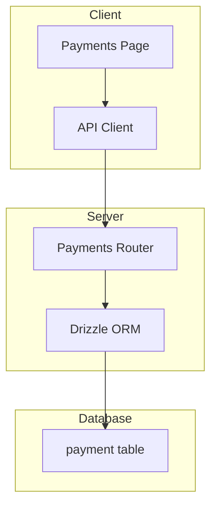
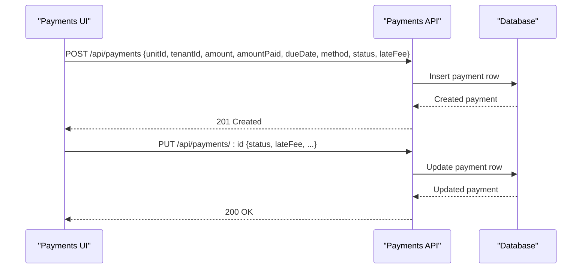
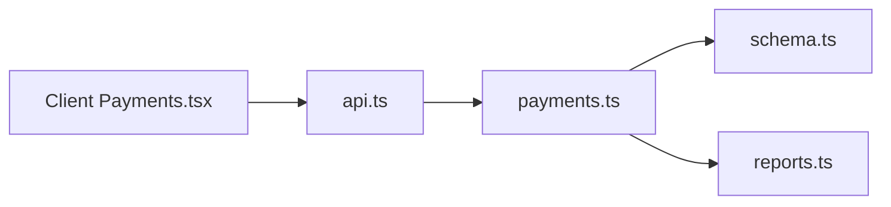

# Late Fee Management

<cite>
**Referenced Files in This Document**
- [schema.ts](file://server/src/db/schema.ts)
- [payments.ts](file://server/src/routes/payments.ts)
- [types.ts](file://shared/src/types.ts)
- [Payments.tsx](file://client/src/pages/Payments.tsx)
- [api.ts](file://client/src/lib/api.ts)
- [index.ts](file://server/src/index.ts)
- [reports.ts](file://server/src/routes/reports.ts)
</cite>

## Table of Contents
1. [Introduction](#introduction)
2. [Project Structure](#project-structure)
3. [Core Components](#core-components)
4. [Architecture Overview](#architecture-overview)
5. [Detailed Component Analysis](#detailed-component-analysis)
6. [Dependency Analysis](#dependency-analysis)
7. [Performance Considerations](#performance-considerations)
8. [Troubleshooting Guide](#troubleshooting-guide)
9. [Conclusion](#conclusion)
10. [Appendices](#appendices)

## Introduction
This document explains how late fee management works in RentLite’s payment system. It covers the data model for payments, the lateFee field and its relationship to payment status changes, how late payments are identified, and where automatic or manual application of late fees occurs. It also outlines configuration options available in the current codebase, example scenarios (automatic application, manual adjustments, and waivers), and audit trail considerations based on existing schema and API behavior.

## Project Structure
RentLite is a full-stack TypeScript application with:
- A server using Express and Drizzle ORM for database access
- A React client that calls REST endpoints
- Shared types between client and server

The late fee functionality spans:
- Database schema defining payment fields including lateFee and status
- Server routes that accept and update payments, including lateFee and status
- Client UI that allows recording payments and selecting status
- Reports and dashboards that summarize late payments

**Diagram sources**
- [Payments.tsx:63-107](file://client/src/pages/Payments.tsx#L63-L107)
- [api.ts:26-78](file://client/src/lib/api.ts#L26-L78)
- [payments.ts:103-133](file://server/src/routes/payments.ts#L103-L133)
- [schema.ts:270-289](file://server/src/db/schema.ts#L270-L289)

**Section sources**
- [index.ts:51-62](file://server/src/index.ts#L51-L62)
- [schema.ts:270-289](file://server/src/db/schema.ts#L270-L289)
- [payments.ts:103-133](file://server/src/routes/payments.ts#L103-L133)
- [Payments.tsx:63-107](file://client/src/pages/Payments.tsx#L63-L107)

## Core Components
- Payment data model includes amount, amountPaid, dueDate, paidDate, method, status, and lateFee. The lateFee field defaults to zero and is persisted per payment record.
- Payment status values include pending, received, late, and partial. These statuses are used throughout the app to reflect collection state.
- The Payments API supports creating and updating payments, including setting status and lateFee.

Key responsibilities:
- Schema defines the canonical structure and constraints for payments and related entities.
- Routes validate input and persist changes, exposing summaries and filters by status.
- Client UI enables recording payments and selecting status; it does not compute late fees automatically.

**Section sources**
- [schema.ts:53-58](file://server/src/db/schema.ts#L53-L58)
- [schema.ts:270-289](file://server/src/db/schema.ts#L270-L289)
- [payments.ts:11-22](file://server/src/routes/payments.ts#L11-L22)
- [payments.ts:24-59](file://server/src/routes/payments.ts#L24-L59)
- [payments.ts:103-133](file://server/src/routes/payments.ts#L103-L133)
- [types.ts:75-90](file://shared/src/types.ts#L75-L90)
- [Payments.tsx:33-38](file://client/src/pages/Payments.tsx#L33-L38)
- [Payments.tsx:96-107](file://client/src/pages/Payments.tsx#L96-L107)

## Architecture Overview
Late fee handling in the current implementation is primarily manual:
- Users can set payment status to “late” when recording or updating a payment.
- Users can set the lateFee amount directly when creating or updating a payment.
- There is no built-in automated calculation engine in the provided code; late fee determination and application are driven by user actions via the API.

**Diagram sources**
- [payments.ts:103-133](file://server/src/routes/payments.ts#L103-L133)
- [schema.ts:270-289](file://server/src/db/schema.ts#L270-L289)

**Section sources**
- [payments.ts:103-133](file://server/src/routes/payments.ts#L103-L133)
- [schema.ts:270-289](file://server/src/db/schema.ts#L270-L289)

## Detailed Component Analysis

### Payment Data Model and Late Fee Field
- The payment table stores lateFee as a numeric field with a default of zero.
- The shared type mirrors this structure, ensuring consistent usage across client and server.
- Status enum includes “late,” enabling explicit marking of overdue payments.

Implications:
- lateFee is an explicit, auditable value stored per payment.
- Status “late” indicates a payment is considered overdue at the time recorded/updated.

**Section sources**
- [schema.ts:270-289](file://server/src/db/schema.ts#L270-L289)
- [types.ts:75-90](file://shared/src/types.ts#L75-L90)
- [schema.ts:53-58](file://server/src/db/schema.ts#L53-L58)

### API Validation and Updates
- Input validation enforces non-negative amounts and lateFee, and restricts status to allowed values.
- Creating a payment accepts all fields, including lateFee and status.
- Updating a payment allows partial updates, commonly used to change status and/or lateFee after initial creation.

Operational notes:
- No server-side business logic computes late fees automatically; values are accepted as provided.
- Summary endpoints count late payments by status but do not alter records.

**Section sources**
- [payments.ts:11-22](file://server/src/routes/payments.ts#L11-L22)
- [payments.ts:103-133](file://server/src/routes/payments.ts#L103-L133)
- [payments.ts:24-59](file://server/src/routes/payments.ts#L24-L59)

### Client-Side Interaction
- The Payments page provides a form to create payments and select status from predefined options, including “late.”
- The form sends unitId, tenantId, amount, amountPaid, dueDate, method, and status to the API.
- The UI displays status badges and summary metrics, including counts of late payments.

Behavioral note:
- The UI does not auto-calculate late fees; users must explicitly set status and lateFee if needed.

**Section sources**
- [Payments.tsx:33-38](file://client/src/pages/Payments.tsx#L33-L38)
- [Payments.tsx:96-107](file://client/src/pages/Payments.tsx#L96-L107)
- [Payments.tsx:171-209](file://client/src/pages/Payments.tsx#L171-L209)

### Reporting and Summaries
- Payment summary endpoint aggregates monthly totals and counts by status, including lateCount.
- Dashboard and reports use payment status to surface late payment counts and collection metrics.

These endpoints support visibility into late payments but do not modify them.

**Section sources**
- [payments.ts:61-101](file://server/src/routes/payments.ts#L61-L101)
- [reports.ts:28-77](file://server/src/routes/reports.ts#L28-L77)

## Dependency Analysis
- Client depends on the Payments API for CRUD operations and summaries.
- Server routes depend on Drizzle ORM and the database schema for persistence.
- Shared types ensure consistency between client and server contracts.

**Diagram sources**
- [Payments.tsx:63-107](file://client/src/pages/Payments.tsx#L63-L107)
- [api.ts:26-78](file://client/src/lib/api.ts#L26-L78)
- [payments.ts:103-133](file://server/src/routes/payments.ts#L103-L133)
- [schema.ts:270-289](file://server/src/db/schema.ts#L270-L289)
- [reports.ts:28-77](file://server/src/routes/reports.ts#L28-L77)

**Section sources**
- [index.ts:51-62](file://server/src/index.ts#L51-L62)
- [payments.ts:103-133](file://server/src/routes/payments.ts#L103-L133)
- [schema.ts:270-289](file://server/src/db/schema.ts#L270-L289)

## Performance Considerations
- Current late fee processing is O(1) per request since it performs simple inserts/updates without complex calculations.
- Summary endpoints filter in-memory arrays; for large datasets, consider server-side filtering and indexing on dueDate and status.
- Avoid unnecessary re-renders by leveraging query invalidation only when payments change.

[No sources needed since this section provides general guidance]

## Troubleshooting Guide
Common issues and resolutions:
- Validation errors: Ensure lateFee and amounts are non-negative and status is one of the allowed values.
- Not found errors: Verify payment IDs exist before attempting updates or deletions.
- Unauthorized: If the client receives 401, it redirects to login; ensure authentication is active.

Relevant behaviors:
- Create and update endpoints return structured error responses for validation failures.
- Delete endpoints check existence before removing records.

**Section sources**
- [payments.ts:103-133](file://server/src/routes/payments.ts#L103-L133)
- [api.ts:26-54](file://client/src/lib/api.ts#L26-L54)

## Conclusion
In RentLite’s current implementation, late fee management is manual and explicit:
- lateFee is a stored field on each payment, defaulting to zero.
- Payments become “late” when a user sets status to “late.”
- There is no automated calculation engine in the provided code; late fees are applied by user action through the API.
- Reporting surfaces late payment counts and collection metrics for visibility.

To implement automation in the future, you could add scheduled jobs or triggers that evaluate due dates and apply late fees based on configurable policies, while preserving auditability via timestamps and notes.

[No sources needed since this section summarizes without analyzing specific files]

## Appendices

### Business Logic for Determining When Payments Become Late
- In the current codebase, a payment becomes late when a user explicitly sets status to “late.”
- There is no automatic evaluation of dueDate vs. current date to mark payments late.

Recommendation for future enhancement:
- Implement a background job that scans payments with dueDate in the past and status not equal to “received,” then applies policy-based late fees and updates status accordingly.

**Section sources**
- [schema.ts:270-289](file://server/src/db/schema.ts#L270-L289)
- [payments.ts:103-133](file://server/src/routes/payments.ts#L103-L133)

### Configuration Options for Late Fee Policies
Current capabilities:
- lateFee is a free-form numeric field; any non-negative value can be recorded.
- Status values allow marking payments as late or partial.

Potential configuration points to add:
- Policy rules (e.g., grace period days, fixed fee, percentage-based fee).
- Per-property or per-unit overrides.
- Waiver flags or approval workflows.

**Section sources**
- [schema.ts:270-289](file://server/src/db/schema.ts#L270-L289)
- [payments.ts:11-22](file://server/src/routes/payments.ts#L11-L22)

### Examples of Late Fee Scenarios
- Automatic application: Not implemented in current code; would require a scheduler to detect overdue payments and apply fees based on policy.
- Manual adjustment: Users can set status to “late” and specify lateFee when creating or updating a payment via the API.
- Fee waiver: Users can set lateFee back to zero and adjust status as appropriate (e.g., “received”) to reflect a waived fee.

**Section sources**
- [payments.ts:103-133](file://server/src/routes/payments.ts#L103-L133)
- [Payments.tsx:96-107](file://client/src/pages/Payments.tsx#L96-L107)

### Audit Trail Requirements
Current auditability:
- Each payment record includes createdAt and updatedAt timestamps, providing basic history of when records were created and last modified.
- Notes field can be used to document reasons for late fee application or waivers.

Enhancements to strengthen audit trails:
- Add an audit log table capturing who changed status and lateFee, with before/after values and reason codes.
- Enforce immutable historical snapshots for financial events.

**Section sources**
- [schema.ts:270-289](file://server/src/db/schema.ts#L270-L289)