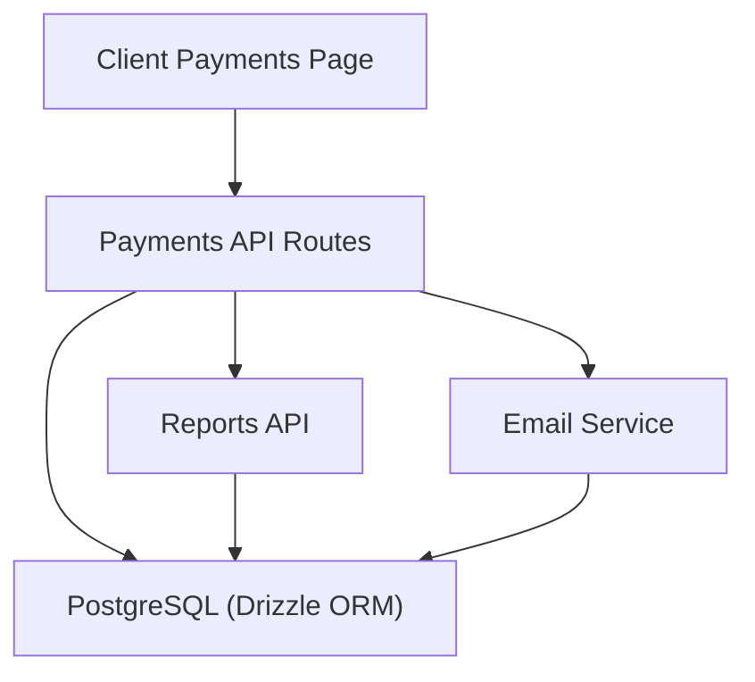
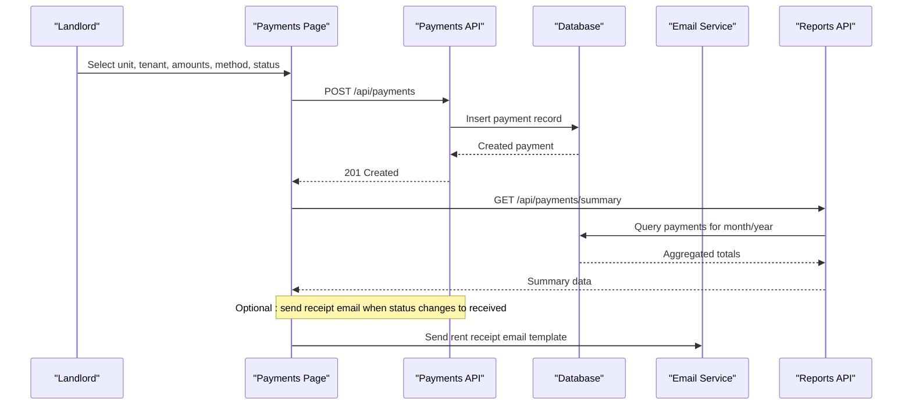
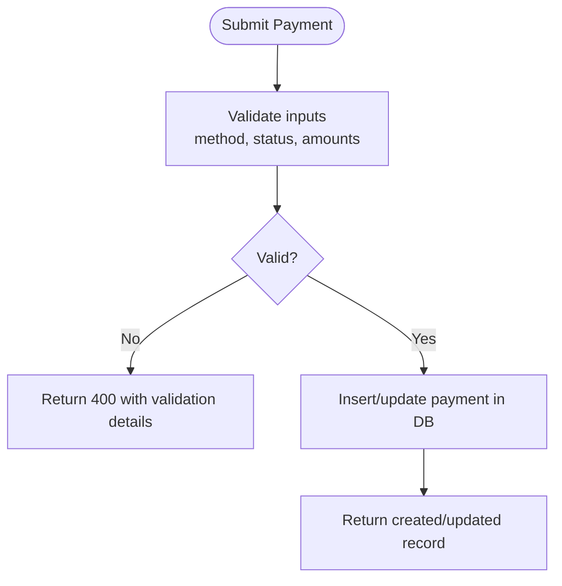
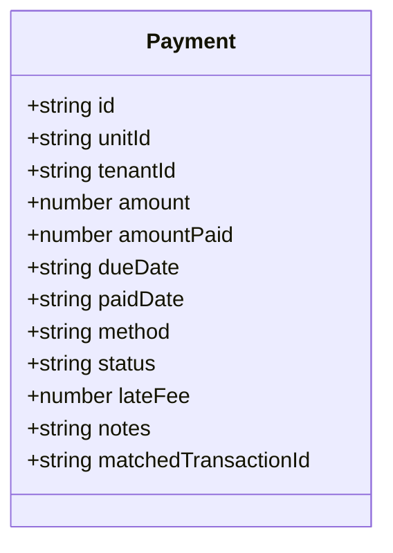
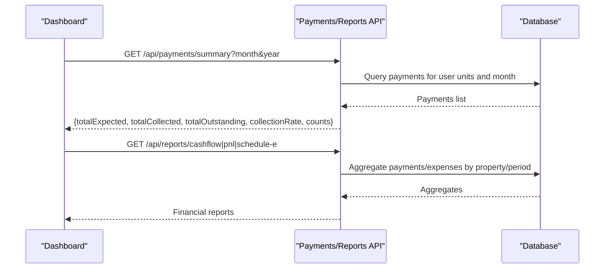
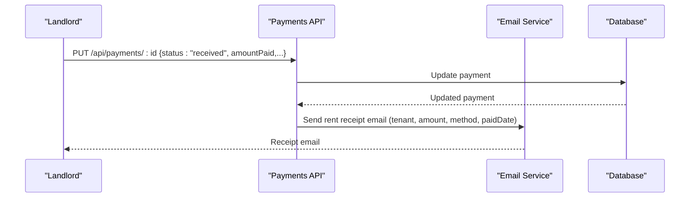
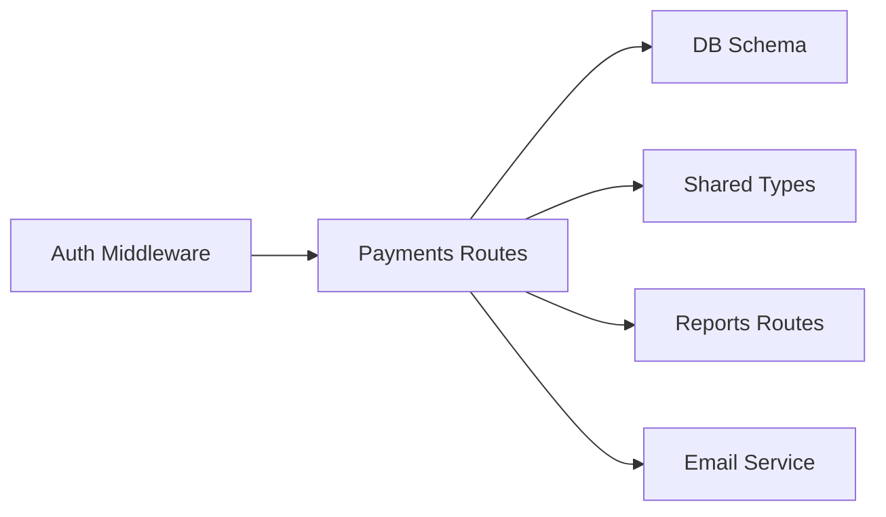

# Payment Methods

<cite>
**Referenced Files in This Document**
- [payments.ts](file://server/src/routes/payments.ts)
- [Payments.tsx](file://client/src/pages/Payments.tsx)
- [schema.ts](file://server/src/db/schema.ts)
- [types.ts](file://shared/src/types.ts)
- [reports.ts](file://server/src/routes/reports.ts)
- [resend.ts](file://server/src/email/resend.ts)
- [RentLite-Product-Spec-Sheet.md](file://RentLite-Product-Spec-Sheet.md)
</cite>

## Table of Contents
1. Introduction
2. Project Structure
3. Core Components
4. Architecture Overview
5. Detailed Component Analysis
6. Dependency Analysis
7. Performance Considerations
8. Troubleshooting Guide
9. Conclusion
10. Appendices

## Introduction
This document explains how RentLite supports payment methods for rent collection and tracking. It covers all supported methods, how each is handled in the UI and backend, validation rules, reconciliation hooks, reporting integration points, receipt generation, and guidance for integrating external processors for digital payments.

Supported payment methods:
- cash
- check
- zelle
- venmo
- ach
- card
- bank_transfer
- other

These are enforced consistently across the database schema, shared types, server routes, and client interface.

## Project Structure
The payment system spans three layers:
- Frontend: A React page that lets landlords record payments and view summaries.
- Backend: Express routes with Zod validation and Drizzle ORM queries to persist and retrieve payments.
- Database: PostgreSQL schema with enums for method and status, plus fields for transaction matching and receipts.

**Diagram sources**
- [Payments.tsx:63-107](file://client/src/pages/Payments.tsx#L63-L107)
- [payments.ts:24-136](file://server/src/routes/payments.ts#L24-L136)
- [schema.ts:268-289](file://server/src/db/schema.ts#L268-L289)
- [reports.ts:28-185](file://server/src/routes/reports.ts#L28-L185)
- [resend.ts:7-30](file://server/src/email/resend.ts#L7-L30)

**Section sources**
- [Payments.tsx:22-38](file://client/src/pages/Payments.tsx#L22-L38)
- [payments.ts:11-22](file://server/src/routes/payments.ts#L11-L22)
- [schema.ts:42-58](file://server/src/db/schema.ts#L42-L58)
- [types.ts:72-90](file://shared/src/types.ts#L72-L90)

## Core Components
- Payment method enum and type: Defined in both shared types and database schema to ensure consistency.
- Validation: Server-side Zod schema enforces allowed values for method and status.
- UI selection: The frontend presents a dropdown of supported methods and statuses.
- Storage: Payments table stores amount, amountPaid, dueDate, paidDate, method, status, lateFee, notes, and matchedTransactionId.
- Reporting: Summary and financial reports aggregate payments by month/year and property.
- Receipts: Email templates support sending rent receipts; expense records store receipt URLs.

Key implementation references:
- Method/status enums and payment model: [schema.ts:42-58](file://server/src/db/schema.ts#L42-L58), [schema.ts:268-289](file://server/src/db/schema.ts#L268-L289)
- Shared types: [types.ts:72-90](file://shared/src/types.ts#L72-L90)
- Server validation: [payments.ts:11-22](file://server/src/routes/payments.ts#L11-L22)
- UI options: [Payments.tsx:22-38](file://client/src/pages/Payments.tsx#L22-L38)

**Section sources**
- [schema.ts:42-58](file://server/src/db/schema.ts#L42-L58)
- [schema.ts:268-289](file://server/src/db/schema.ts#L268-L289)
- [types.ts:72-90](file://shared/src/types.ts#L72-L90)
- [payments.ts:11-22](file://server/src/routes/payments.ts#L11-L22)
- [Payments.tsx:22-38](file://client/src/pages/Payments.tsx#L22-L38)

## Architecture Overview
The payment flow centers on recording and updating payments, then surfacing them via summary and report endpoints. Digital integrations can be added later to process online payments and reconcile transactions automatically.

**Diagram sources**
- [Payments.tsx:84-107](file://client/src/pages/Payments.tsx#L84-L107)
- [payments.ts:103-126](file://server/src/routes/payments.ts#L103-L126)
- [payments.ts:61-101](file://server/src/routes/payments.ts#L61-L101)
- [resend.ts:60-86](file://server/src/email/resend.ts#L60-L86)

## Detailed Component Analysis

### Supported Payment Methods and Handling
All eight methods are first-class options in the UI and validated on the server. They differ primarily in how they are reconciled and reported:

- cash
  - Use case: Landlord collects physical cash.
  - Processing: Record amountPaid and set status accordingly. No external processor involved.
  - Reconciliation: Manual; optionally link to bank deposit notes in notes field.
  - Reporting: Included in monthly totals and collection rate.

- check
  - Use case: Physical checks deposited.
  - Processing: Record amountPaid and status; consider adding notes for check number if needed.
  - Reconciliation: Match against bank statement entries; use matchedTransactionId when available.
  - Reporting: Included in totals and collection metrics.

- zelle
  - Use case: Peer-to-peer transfer via Zelle app.
  - Processing: Record amountPaid and status; capture confirmation details in notes or matchedTransactionId.
  - Reconciliation: Match using transaction ID or memo from bank feed.
  - Reporting: Included in totals; can be filtered by method in custom reports.

- venmo
  - Use case: Peer-to-peer transfer via Venmo.
  - Processing: Record amountPaid and status; capture confirmation details in notes or matchedTransactionId.
  - Reconciliation: Match using transaction ID or memo from bank feed.
  - Reporting: Included in totals; can be filtered by method in custom reports.

- ach
  - Use case: Bank transfers (ACH).
  - Processing: Record amountPaid and status; integrate with Plaid or Stripe Connect to auto-match transactions.
  - Reconciliation: Use matchedTransactionId to link bank transactions to payments.
  - Reporting: Included in totals; useful for automated reconciliation pipelines.

- card
  - Use case: Credit/debit card payments.
  - Processing: Integrate with Stripe Connect; record amountPaid and status upon successful charge.
  - Reconciliation: Use matchedTransactionId to link Stripe charge IDs to payments.
  - Reporting: Included in totals; PCI compliance via Stripe (no card data stored locally).

- bank_transfer
  - Use case: Direct bank wire or similar transfer.
  - Processing: Record amountPaid and status; capture reference in notes or matchedTransactionId.
  - Reconciliation: Match against bank statements using reference numbers.
  - Reporting: Included in totals; filterable by method.

- other
  - Use case: Any non-standard method not covered above.
  - Processing: Record amountPaid and status; use notes to describe specifics.
  - Reconciliation: Manual matching recommended.
  - Reporting: Included in totals; use notes for categorization.

Validation and storage:
- Allowed methods are enforced by server-side Zod enum and database enum.
- Statuses include pending, received, late, partial.
- Amounts must be non-negative; amountPaid defaults to 0.

**Section sources**
- [payments.ts:11-22](file://server/src/routes/payments.ts#L11-L22)
- [schema.ts:42-58](file://server/src/db/schema.ts#L42-L58)
- [schema.ts:268-289](file://server/src/db/schema.ts#L268-L289)
- [types.ts:72-90](file://shared/src/types.ts#L72-L90)
- [Payments.tsx:22-38](file://client/src/pages/Payments.tsx#L22-L38)

### Payment Method Selection Interface and Validation Rules
- UI: Dropdown lists all supported methods and statuses.
- Validation:
  - Server validates method and status against enums.
  - Amounts validated as numbers >= 0.
  - Due date required; paidDate optional.
  - Notes optional.
- Behavior:
  - Creating a payment returns 201 with the created record.
  - Updating a payment allows partial updates and persists updatedAt timestamp.

**Diagram sources**
- [payments.ts:103-126](file://server/src/routes/payments.ts#L103-L126)
- [payments.ts:11-22](file://server/src/routes/payments.ts#L11-L22)

**Section sources**
- [Payments.tsx:96-107](file://client/src/pages/Payments.tsx#L96-L107)
- [payments.ts:103-126](file://server/src/routes/payments.ts#L103-L126)

### Reconciliation and Transaction Matching
- matchedTransactionId field exists on the payment entity to link external transactions (e.g., Stripe charge IDs, Plaid transaction IDs).
- Reports compute totals based on amountPaid and dates, enabling reconciliation against bank feeds.
- Future enhancement: Auto-match incoming bank transactions to payments using matchedTransactionId and heuristics (amount, date range, memo).

**Diagram sources**
- [schema.ts:268-289](file://server/src/db/schema.ts#L268-L289)
- [types.ts:72-90](file://shared/src/types.ts#L72-L90)

**Section sources**
- [schema.ts:268-289](file://server/src/db/schema.ts#L268-L289)
- [reports.ts:28-185](file://server/src/routes/reports.ts#L28-L185)

### Reporting and Summaries
- Monthly summary endpoint aggregates expected vs collected amounts, outstanding balance, and counts by status.
- Cash flow and P&L reports use payment amounts to calculate income per property and period.
- Schedule E helper maps expenses to IRS categories; payment income contributes to total rent received.

**Diagram sources**
- [payments.ts:61-101](file://server/src/routes/payments.ts#L61-L101)
- [reports.ts:28-185](file://server/src/routes/reports.ts#L28-L185)

**Section sources**
- [payments.ts:61-101](file://server/src/routes/payments.ts#L61-L101)
- [reports.ts:28-185](file://server/src/routes/reports.ts#L28-L185)

### Receipt Generation and Confirmation Numbers
- Email templates exist for rent reminders and rent receipts, including method and paid date fields.
- Expense records store receiptUrl for attachments.
- For digital payments (card, ACH), you can populate matchedTransactionId with provider-specific IDs (e.g., Stripe charge ID) and include it in receipts or emails.

**Diagram sources**
- [payments.ts:112-126](file://server/src/routes/payments.ts#L112-L126)
- [resend.ts:60-86](file://server/src/email/resend.ts#L60-L86)

**Section sources**
- [resend.ts:60-86](file://server/src/email/resend.ts#L60-L86)
- [schema.ts:329-348](file://server/src/db/schema.ts#L329-L348)

### Integrating External Payment Processors
- Card and ACH payments: Plan to use Stripe Connect for processing, payouts, and PCI compliance. No card data should be stored locally.
- Bank feed matching: Plan to use Plaid to connect bank accounts and match incoming transactions to payments using matchedTransactionId.
- Workflow:
  - Tenant pays via provider portal.
  - Provider webhook notifies backend.
  - Backend creates or updates payment record, sets amountPaid, status, and matchedTransactionId.
  - System sends receipt email and updates reports.

References:
- Product spec outlines planned integrations and phases for online payments and bank feeds.

**Section sources**
- [RentLite-Product-Spec-Sheet.md:291-302](file://RentLite-Product-Spec-Sheet.md#L291-L302)
- [RentLite-Product-Spec-Sheet.md:184-194](file://RentLite-Product-Spec-Sheet.md#L184-L194)

### Security and Compliance Considerations
- PCI-DSS: Offload card data handling to Stripe; do not store sensitive card data in RentLite.
- Encryption: Ensure TLS in transit and AES-256 at rest for stored data.
- Access controls: Enforce authentication middleware on all payment endpoints.
- Data privacy: Comply with applicable state privacy laws; limit PII exposure.
- Auditability: Maintain updated timestamps and notes for traceability.

**Section sources**
- [RentLite-Product-Spec-Sheet.md:333-346](file://RentLite-Product-Spec-Sheet.md#L333-L346)
- [payments.ts:1-9](file://server/src/routes/payments.ts#L1-L9)

## Dependency Analysis
Payment functionality depends on:
- Authentication middleware to protect endpoints.
- Database schema for enums and payment fields.
- Shared types for consistent contracts between client and server.
- Reports module for aggregating payment data into financial insights.
- Email service for sending receipts and reminders.

**Diagram sources**
- [payments.ts:1-9](file://server/src/routes/payments.ts#L1-L9)
- [schema.ts:42-58](file://server/src/db/schema.ts#L42-L58)
- [types.ts:72-90](file://shared/src/types.ts#L72-L90)
- [reports.ts:1-8](file://server/src/routes/reports.ts#L1-L8)
- [resend.ts:1-30](file://server/src/email/resend.ts#L1-L30)

**Section sources**
- [payments.ts:1-9](file://server/src/routes/payments.ts#L1-L9)
- [schema.ts:42-58](file://server/src/db/schema.ts#L42-L58)
- [types.ts:72-90](file://shared/src/types.ts#L72-L90)
- [reports.ts:1-8](file://server/src/routes/reports.ts#L1-L8)
- [resend.ts:1-30](file://server/src/email/resend.ts#L1-L30)

## Performance Considerations
- Filtering payments by month/year and unit reduces query scope and improves performance.
- Using sets for valid unit IDs avoids repeated lookups during filtering.
- Aggregation in summary and reports uses efficient reduce operations over filtered arrays.
- Consider indexing payment.dueDate and payment.unitId for faster filtering as data grows.

[No sources needed since this section provides general guidance]

## Troubleshooting Guide
Common issues and resolutions:
- Validation errors: Check method and status values against allowed enums; ensure amounts are non-negative numbers.
- Not found errors: Verify payment ID exists before update/delete operations.
- Empty results: Confirm user has access to units; verify month/year filters match dueDate values.
- Email failures: Inspect email service responses and error logs; ensure recipient addresses are valid.

Operational references:
- Validation and error responses: [payments.ts:103-126](file://server/src/routes/payments.ts#L103-L126)
- Email error handling: [resend.ts:7-30](file://server/src/email/resend.ts#L7-L30)

**Section sources**
- [payments.ts:103-126](file://server/src/routes/payments.ts#L103-L126)
- [resend.ts:7-30](file://server/src/email/resend.ts#L7-L30)

## Conclusion
RentLite’s payment system supports a comprehensive set of methods with robust validation, clear reporting, and extensibility for digital integrations. By leveraging matchedTransactionId and future bank feed matching, landlords can streamline reconciliation. Receipts and reminders improve tenant communication, while security and compliance guidelines ensure safe handling of sensitive data.

[No sources needed since this section summarizes without analyzing specific files]

## Appendices

### Payment Method Quick Reference
- cash: Manual entry; no external processor.
- check: Manual entry; match via bank statements; optional notes for check number.
- zelle: Manual entry; capture confirmation details in notes or matchedTransactionId.
- venmo: Manual entry; capture confirmation details in notes or matchedTransactionId.
- ach: Integrate with Plaid/Stripe Connect; auto-match via matchedTransactionId.
- card: Integrate with Stripe Connect; PCI-compliant processing; use matchedTransactionId.
- bank_transfer: Manual or integrated; capture reference in notes or matchedTransactionId.
- other: Manual entry; use notes for specifics.

**Section sources**
- [schema.ts:42-58](file://server/src/db/schema.ts#L42-L58)
- [types.ts:72-90](file://shared/src/types.ts#L72-L90)
- [payments.ts:11-22](file://server/src/routes/payments.ts#L11-L22)
- [Payments.tsx:22-38](file://client/src/pages/Payments.tsx#L22-L38)